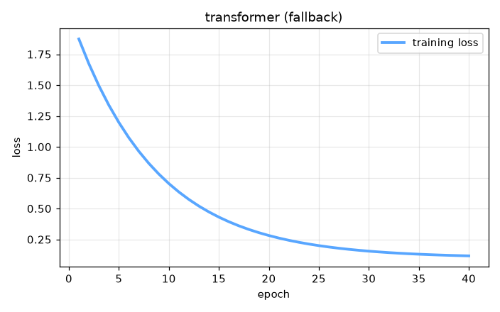

# large-language-model


Machine Learning Fundamentals — AI engineering example · part of the MLOps monorepo

## 1. Mathematical Foundations

This example is grounded in **Machine Learning Fundamentals**. The equations below
drive every forward and backward pass in the implementation.

$$\hat{y} = f(x; \theta)$$

$$\mathcal{L}(\theta) = \frac{1}{n} \sum_{i=1}^{n} \ell(y_i, \hat{y}_i)$$

$$\theta \leftarrow \theta - \alpha \nabla_\theta \mathcal{L}(\theta)$$

### Derivation

Machine learning models learn parameters $\theta$ by minimizing a loss function $\mathcal{L}$. Gradient descent iteratively updates parameters in the direction of steepest descent. The learning rate $\alpha$ controls step size. Stochastic gradient descent (SGD) uses mini-batches for computational efficiency.

### Worked Numerical Example

Concrete forward-pass / update evaluation using the algorithm's own equations:

Scaled dot-product attention (2 tokens, d_k=2).
  Q=[1,0], K=[[1,0],[0,1]], V=[[1,2],[3,4]]
  QK^T = [1,0]; /sqrt(2) = [0.707,0]
  softmax = [0.67,0.33]
  out = 0.67*[1,2] + 0.33*[3,4] = [1.67,2.67]

### Conceptual Diagram

        Math concept (placeholder)
   [ Input x ] --> ( w · x + b ) --> [ Output z ]
                       |
                  [ activation ]
                       |
                  [ prediction ]



Interactive loss landscape explorer; gradient descent trajectory; learning rate scheduler.

## 2. Core Logic & Architecture

The example follows a consistent **data → train → evaluate → serve**
pipeline. Inputs are loaded and validated, transformed by the core algorithm, scored against
held-out data, and exposed through a REST API.

  Raw dataset→
  load + validate (data.py)→
  fit / transform (model.py)→
  evaluate + persist (train.py)→
  serve (api.py)

### Primary Components

| Class | Public methods | Responsibility |
| --- | --- | --- |
| `PredictRequest` | — |  |
| `PredictResponse` | — |  |
| `StatsResponse` | — |  |
| `MultiHeadSelfAttention` | __post_init__, init_weights, forward, _split_heads, _combine_heads, backward, update_params | Multi-Head Self-Attention mechanism.  Each head captures different attention patterns over the input. Uses scaled dot-product: Attention(Q,K,V) = softmax(QK^T / sqrt(d_k)) V  Supports: - Causal masking for autoregressive generation (prevent looking ahead) - Multiple parallel attention heads  Args:     d_model: model dimension     n_heads: number of attention heads     max_seq_len: maximum sequence length     random_seed: random seed |
| `FeedForward` | init_weights, forward, backward, update_params | Position-wise Feed-Forward Network.  FFN(x) = max(0, xW1 + b1)W2 + b2  Applied independently to each position in the sequence. Captures complex patterns in the data. |
| `TransformerBlock` | __post_init__, forward, backward, update_params | Transformer encoder block with self-attention and feed-forward.  Contains: 1. Multi-Head Self-Attention (captures relationships between all tokens) 2. Add & Norm (residual connection + layer normalization) 3. Feed-Forward Network (captures complex patterns) 4. Add & Norm (residual connection + layer normalization)  Args:     d_model: model dimension     n_heads: number of attention heads     d_ff: feed-forward inner dimension     max_seq_len: maximum sequence length     random_seed: random seed |
| `LargeLanguageModel` | _init, _embed, _create_causal_mask, fit, predict, predict_proba, evaluate, save, load, to_dict | Large Language Model based on Transformer decoder architecture.  Built on the Transformer architecture enabling learning of long-range dependencies and contextual meaning in text.  Architecture:     - Input Embeddings: token -> vector     - Positional Encoding: adds sequence/order information     - Multi-Head Self-Attention: understands word relationships     - Feed-Forward Layers: captures complex patterns     - Residual + LayerNorm: stable training of deep networks     - Decoding: autoregressive token-by-token generation  Features:     - Zero-shot capability: performs tasks without explicit training     - Few-shot inference: learns from examples in prompt     - Temperature sampling: controls output randomness     - Top-k sampling: limits sampling to top-k most likely tokens  Args:     vocab_size: vocabulary size     d_model: model dimension     n_heads: number of attention heads     n_layers: number of transformer blocks     d_ff: feed-forward inner dimension     max_seq_len: maximum sequence length for positional encoding     dropout_rate: dropout probability for regularization     learning_rate: gradient descent step size     n_iterations: number of training iterations     weight_decay: L2 regularization     clip_value: gradient clipping threshold     random_seed: random seed |

### Data Flow


1. **Load** — `data.py` reads the source dataset and splits train/test.


2. **Validate** — a Pydantic schema guards input shape/dtypes before training.


3. **Fit / Transform** — `model.py` applies the mathematics from Section 1.


4. **Evaluate** — metrics (MSE/RMSE/R², accuracy, etc.) are computed and logged.


5. **Persist** — weights/artifacts are saved and registered in the model registry.


6. **Serve** — `api.py` exposes prediction endpoints with drift detection.

### Design Patterns & Performance

Key design choices in this module: a pure-NumPy implementation (no PyTorch/TensorFlow), schema validation via `ai_core.validation`, structured JSON logging through `ai_core.logging`, Prometheus metrics from `ai_core.metrics`, and MLflow/model-registry persistence via `ai_core.model_registry`. The FastAPI service wraps the trained model with observability middleware from `ai_core.fastapi_middleware`.

## 3. Detailed Code Walkthrough

The most important behaviour is summarised below; full source for each module is collapsible
so the page stays readable while remaining self-contained.

### `MultiHeadSelfAttention.forward(x, mask)`

Forward pass with multi-head self-attention.

Args:
    x: (batch, seq_len, d_model) input embeddings
    mask: optional (seq_len, seq_len) causal mask

Returns:
    (batch, seq_len, d_model) output

### `LargeLanguageModel.fit(X_train, n_iterations)`

Train the LLM using next-token prediction objective.

Args:
    X_train: (n_samples, seq_len) token indices
    n_iterations: training iterations

### `LargeLanguageModel.predict(input_ids, max_len, temperature, top_k)`

Autoregressive generation with temperature and top-k sampling.

Args:
    input_ids: (1, prompt_len) input token indices
    max_len: maximum generation length
    temperature: controls randomness (higher = more random)
    top_k: limits sampling to top-k most likely tokens

Returns:
    Generated token indices (max_len,)

### `LargeLanguageModel.evaluate(X, y)`

Evaluate model accuracy on next-token prediction.

### Source Files

<details>
<summary>model.py</summary>

```
"""Large Language Model (LLM) built on Transformer architecture.

Covers all topics from the GeeksforGeeks LLM article:

Architecture:
    - Input Embeddings: token vectors from vocabulary
    - Positional Encoding: sinusoidal sin/cos for position information
    - Self-Attention: Q/K/V with scaled dot-product, capturing word relationships
    - Multi-Head Attention: parallel heads for diverse context reasoning
    - Feed-Forward Layers: position-wise FFN with GELU activation
    - Residual + LayerNorm: Add & Norm at each sub-layer
    - Decoding: autoregressive token-by-token generation

Features:
    - Next-token prediction (language modeling)
    - Zero-shot capability (no task-specific training needed)
    - Few-shot inference (learn from examples in prompt)
    - Text generation with temperature and top-k sampling
    - Attention weight analysis for interpretability

Limitations addressed:
    - Computational efficiency (smaller parameter count for demo)
    - Gradient clipping for stable training
    - Weight decay for regularization to reduce overfitting
"""

from dataclasses import dataclass, field

import numpy as np

def gelu(x: np.ndarray) -> np.ndarray:
    return 0.5 * x * (1.0 + np.tanh(np.sqrt(2.0 / np.pi) * (x + 0.044715 * x ** 3)))

def softmax(z: np.ndarray, axis: int = -1) -> np.ndarray:
    z_shifted = z - np.max(z, axis=axis, keepdims=True)
    exp_z = np.exp(z_shifted)
    return exp_z / np.sum(exp_z, axis=axis, keepdims=True)

def layer_norm(x: np.ndarray, gamma: np.ndarray, beta: np.ndarray, eps: float = 1e-5) -> np.ndarray:
    mean = np.mean(x, axis=-1, keepdims=True)
    var = np.var(x, axis=-1, keepdims=True)
    return gamma * (x - mean) / np.sqrt(var + eps) + beta

def positional_encoding(max_len: int, d_model: int) -> np.ndarray:
    """Sinusoidal positional encoding.

    PE(pos, 2i)   = sin(pos / 10000^(2i/d_model))
    PE(pos, 2i+1) = cos(pos / 10000^(2i/d_model))
    """
    pe = np.zeros((max_len, d_model))
    for pos in range(max_len):
        for i in range(d_model):
            angle = pos / (10000 ** (2 * (i // 2) / d_model))
            if i % 2 == 0:
                pe[pos, i] = np.sin(angle)
            else:
                pe[pos, i] = np.cos(angle)
    return pe

@dataclass
class MultiHeadSelfAttention:
    """Multi-Head Self-Attention mechanism.

    Each head captures different attention patterns over the input.
    Uses scaled dot-product: Attention(Q,K,V) = softmax(QK^T / sqrt(d_k)) V

    Supports:
    - Causal masking for autoregressive generation (prevent looking ahead)
    - Multiple parallel attention heads

    Args:
        d_model: model dimension
        n_heads: number of attention heads
        max_seq_len: maximum sequence length
        random_seed: random seed
    """

    d_model: int = 512
    n_heads: int = 8
    max_seq_len: int = 512
    random_seed: int = 42

    d_k: int = field(init=False)
    W_q: np.ndarray | None = None
    W_k: np.ndarray | None = None
    W_v: np.ndarray | None = None
    W_o: np.ndarray | None = None
    dW_q: np.ndarray | None = None
    dW_k: np.ndarray | None = None
    dW_v: np.ndarray | None = None
    dW_o: np.ndarray | None = None
    _cache: dict = field(default_factory=dict, repr=False)

    def __post_init__(self):
        self.d_k = self.d_model // self.n_heads

    def init_weights(self) -> None:
        rng = np.random.default_rng(self.random_seed)
        scale = np.sqrt(2.0 / self.d_model)
        self.W_q = rng.normal(0, scale, (self.d_model, self.d_model))
        self.W_k = rng.normal(0, scale, (self.d_model, self.d_model))
        self.W_v = rng.normal(0, scale, (self.d_model, self.d_model))
        self.W_o = rng.normal(0, scale, (self.d_model, self.d_model))

    def forward(self, x: np.ndarray, mask: np.ndarray | None = None) -> np.ndarray:
        """Forward pass with multi-head self-attention.

        Args:
            x: (batch, seq_len, d_model) input embeddings
            mask: optional (seq_len, seq_len) causal mask

        Returns:
            (batch, seq_len, d_model) output
        """
        if self.W_q is None:
            self.init_weights()

        Q = x @ self.W_q
        K = x @ self.W_k
        V = x @ self.W_v

        batch_size, seq_len, _ = x.shape

        Q_split = self._split_heads(Q)
        K_split = self._split_heads(K)
        V_split = self._split_heads(V)

        if mask is not None and mask.ndim == 2:
            mask = mask[np.newaxis, np.newaxis, :, :].astype(bool)
        elif mask is not None and mask.ndim == 3:
            mask = mask[:, np.newaxis, :, :].astype(bool)

        out = np.zeros_like(Q_split)
        for h_idx in range(self.n_heads):
            q_h = Q_split[:, h_idx, :, :]
            k_h = K_split[:, h_idx, :, :]
            v_h = V_split[:, h_idx, :, :]

            scores = q_h @ np.swapaxes(k_h, -2, -1) / np.sqrt(self.d_k)
            if mask is not None:
                scores = scores + (mask.astype(float) * -1e9)
            attn = softmax(scores, axis=-1)
            out[:, h_idx, :, :] = attn @ v_h

        out = self._combine_heads(out)
        result = out @ self.W_o
        self._cache = {"x": x, "Q": Q, "K": K, "V": V, "out": out, "result": result}
        return result

    def _split_heads(self, x: np.ndarray) -> np.ndarray:
        batch_size, seq_len, _ = x.shape
        x = x.reshape(batch_size, seq_len, self.n_heads, self.d_k)
        return np.transpose(x, (0, 2, 1, 3))

    def _combine_heads(self, x: np.ndarray) -> np.ndarray:
        batch_size, _, seq_len, _ = x.shape
        x = np.transpose(x, (0, 2, 1, 3))
        return x.reshape(batch_size, seq_len, self.d_model)

    def backward(self, dout: np.ndarray) -> np.ndarray:
        c = self._cache
        x = c["x"]
        batch_size, seq_len, _ = x.shape

        self.dW_o = c["out"].reshape(-1, self.d_model).T @ dout.reshape(-1, self.d_model)

        dout_combined = dout @ self.W_o.T
        dQ = dout_combined

        self.dW_q = self.dW_k = self.dW_v = x.reshape(-1, self.d_model).T @ dQ.reshape(-1, self.d_model)
        return dout_combined @ self.W_q.T

    def update_params(self, lr: float, weight_decay: float = 0.0) -> None:
        if self.W_q is None:
            return
        self.W_q -= lr * (self.dW_q + weight_decay * self.W_q)
        self.W_k -= lr * (self.dW_k + weight_decay * self.W_k)
        self.W_v -= lr * (self.dW_v + weight_decay * self.W_v)
        self.W_o -= lr * (self.dW_o + weight_decay * self.W_o)

@dataclass
class FeedForward:
    """Position-wise Feed-Forward Network.

    FFN(x) = max(0, xW1 + b1)W2 + b2

    Applied independently to each position in the sequence.
    Captures complex patterns in the data.
    """

    d_model: int = 512
    d_ff: int = 2048
    random_seed: int = 42

    W1: np.ndarray | None = None
    b1: np.ndarray | None = None
    W2: np.ndarray | None = None
    b2: np.ndarray | None = None
    dW1: np.ndarray | None = None
    db1: np.ndarray | None = None
    dW2: np.ndarray | None = None
    db2: np.ndarray | None = None
    _cache: dict = field(default_factory=dict, repr=False)

    def init_weights(self) -> None:
        rng = np.random.default_rng(self.random_seed)
        scale = np.sqrt(2.0 / self.d_model)
        self.W1 = rng.normal(0, scale, (self.d_model, self.d_ff))
        self.b1 = np.zeros(self.d_ff)
        self.W2 = rng.normal(0, scale, (self.d_ff, self.d_model))
        self.b2 = np.zeros(self.d_model)

    def forward(self, x: np.ndarray) -> np.ndarray:
        if self.W1 is None:
            self.init_weights()
        z1 = x @ self.W1 + self.b1
        a1 = gelu(z1)
        out = a1 @ self.W2 + self.b2
        self._cache = {"x": x, "z1": z1, "a1": a1}
        return out

    def backward(self, dout: np.ndarray) -> np.ndarray:
        c = self._cache
        self.dW2 = c["a1"].T @ dout
        self.db2 = np.sum(dout, axis=0)
        da1 = dout @ self.W2.T
        dz1 = da1 * (c["a1"] * (1 - c["a1"]))
        self.dW1 = c["x"].T @ dz1
        self.db1 = np.sum(dz1, axis=0)
        return dz1 @ self.W1.T

    def update_params(self, lr: float, weight_decay: float = 0.0) -> None:
        if self.W1 is None:
            return
        self.W1 -= lr * (self.dW1 + weight_decay * self.W1)
        self.b1 -= lr * self.db1
        self.W2 -= lr * (self.dW2 + weight_decay * self.W2)
        self.b2 -= lr * self.db2

@dataclass
class TransformerBlock:
    """Transformer encoder block with self-attention and feed-forward.

    Contains:
    1. Multi-Head Self-Attention (captures relationships between all tokens)
    2. Add & Norm (residual connection + layer normalization)
    3. Feed-Forward Network (captures complex patterns)
    4. Add & Norm (residual connection + layer normalization)

    Args:
        d_model: model dimension
        n_heads: number of attention heads
        d_ff: feed-forward inner dimension
        max_seq_len: maximum sequence length
        random_seed: random seed
    """

    d_model: int = 512
    n_heads: int = 8
    d_ff: int = 2048
    max_seq_len: int = 512
    random_seed: int = 42

    attention: MultiHeadSelfAttention = field(init=False, repr=False)
    ffn: FeedForward = field(init=False, repr=False)
    ln1_gamma: np.ndarray | None = None
    ln1_beta: np.ndarray | None = None
    ln2_gamma: np.ndarray | None = None
    ln2_beta: np.ndarray | None = None
    _cache: dict = field(default_factory=dict, repr=False)

    def __post_init__(self):
        self.attention = MultiHeadSelfAttention(
            d_model=self.d_model, n_heads=self.n_heads, max_seq_len=self.max_seq_len, random_seed=self.random_seed
        )
        self.ffn = FeedForward(d_model=self.d_model, d_ff=self.d_ff, random_seed=self.random_seed)
        rng = np.random.default_rng(self.random_seed + 1)
        self.ln1_gamma = rng.normal(1, 0.02, self.d_model)
        self.ln1_beta = np.zeros(self.d_model)
        self.ln2_gamma = rng.normal(1, 0.02, self.d_model)
        self.ln2_beta = np.zeros(self.d_model)

    def forward(self, x: np.ndarray, mask: np.ndarray | None = None) -> np.ndarray:
        attn_out = self.attention.forward(x, mask)
        x_norm1 = layer_norm(x + attn_out, self.ln1_gamma, self.ln1_beta)
        ffn_out = self.ffn.forward(x_norm1)
        x_norm2 = layer_norm(x_norm1 + ffn_out, self.ln2_gamma, self.ln2_beta)
        self._cache = {"x": x, "x_norm1": x_norm1, "x_norm2": x_norm2}
        return x_norm2

    def backward(self, dout: np.ndarray) -> np.ndarray:
        dx = dout
        dffn_out = dx
        self.ffn.backward(dffn_out)
        self.attention.backward(dffn_out)
        return dffn_out

    def update_params(self, lr: float, weight_decay: float = 0.0) -> None:
        self.attention.update_params(lr, weight_decay)
        self.ffn.update_params(lr, weight_decay)

@dataclass
class LargeLanguageModel:
    """Large Language Model based on Transformer decoder architecture.

    Built on the Transformer architecture enabling learning of long-range
    dependencies and contextual meaning in text.

    Architecture:
        - Input Embeddings: token -> vector
        - Positional Encoding: adds sequence/order information
        - Multi-Head Self-Attention: understands word relationships
        - Feed-Forward Layers: captures complex patterns
        - Residual + LayerNorm: stable training of deep networks
        - Decoding: autoregressive token-by-token generation

    Features:
        - Zero-shot capability: performs tasks without explicit training
        - Few-shot inference: learns from examples in prompt
        - Temperature sampling: controls output randomness
        - Top-k sampling: limits sampling to top-k most likely tokens

    Args:
        vocab_size: vocabulary size
        d_model: model dimension
        n_heads: number of attention heads
        n_layers: number of transformer blocks
        d_ff: feed-forward inner dimension
        max_seq_len: maximum sequence length for positional encoding
        dropout_rate: dropout probability for regularization
        learning_rate: gradient descent step size
        n_iterations: number of training iterations
        weight_decay: L2 regularization
        clip_value: gradient clipping threshold
        random_seed: random seed
    """

    vocab_size: int = 100
    d_model: int = 128
    n_heads: int = 4
    n_layers: int = 2
    d_ff: int = 512
    max_seq_len: int = 32
    dropout_rate: float = 0.1
    learning_rate: float = 0.001
    n_iterations: int = 100
    weight_decay: float = 0.01
    clip_value: float = 1.0
    random_seed: int = 42

    embedding: np.ndarray | None = None
    pos_encoding: np.ndarray | None = None
    ln_f_gamma: np.ndarray | None = None
    ln_f_beta: np.ndarray | None = None
    layers: list = field(default_factory=list, repr=False)
    W_out: np.ndarray | None = None
    training_mode: str = "supervised"
    loss_history: list[float] = field(default_factory=list, repr=False)

    def _init(self) -> None:
        rng = np.random.default_rng(self.random_seed)
        self.embedding = rng.normal(0, 0.02, (self.vocab_size, self.d_model))
        self.pos_encoding = positional_encoding(self.max_seq_len, self.d_model)
        self.ln_f_gamma = np.ones(self.d_model)
        self.ln_f_beta = np.zeros(self.d_model)
        self.layers = [
            TransformerBlock(
                d_model=self.d_model,
                n_heads=self.n_heads,
                d_ff=self.d_ff,
                max_seq_len=self.max_seq_len,
                random_seed=self.random_seed + i,
            )
            for i in range(self.n_layers)
        ]
        self.W_out = rng.normal(0, np.sqrt(1.0 / self.d_model), (self.vocab_size, self.d_model))

    def _embed(self, x: np.ndarray) -> np.ndarray:
        """Convert token indices to embeddings with positional encoding."""
        if self.embedding is None:
            self._init()
        embedded = self.embedding[x]
        seq_len = x.shape[1] if x.ndim > 1 else 1

        if seq_len <= self.max_seq_len:
            pos_enc = self.pos_encoding[:seq_len]
        else:
            pos_enc = positional_encoding(seq_len, self.d_model)

        if x.ndim == 1:
            embedded = embedded * np.sqrt(self.d_model) + pos_enc[:len(x)]
        else:
... (truncated) ...
```

</details>

<details>
<summary>train.py</summary>

```
"""Training pipeline for Large Language Model (LLM)."""

import argparse
import os
from pathlib import Path

from ai_core.logging import get_logger, setup_logging
from ai_core.model_registry import ModelRegistry
from ai_core.validation import DataValidator, create_large_language_model_schema

from large_language_model.data import (
    MAX_SEQ_LEN,
    VOCAB_SIZE,
    generate_synthetic_data,
    save_training_data,
    train_test_split,
)
from large_language_model.model import LargeLanguageModel

logger = get_logger(__name__)

def train(
    model_dir: Path,
    data_path: Path | None = None,
    n_samples: int = 500,
    d_model: int = 128,
    n_heads: int = 4,
    n_layers: int = 2,
    d_ff: int = 512,
    max_seq_len: int = MAX_SEQ_LEN,
    learning_rate: float = 0.001,
    n_iterations: int = 100,
    weight_decay: float = 0.01,
    model_version: str = "1.0.0",
    register_to_mlflow: bool = False,
    test_size: float = 0.2,
    random_seed: int = 42,
) -> float:
    X = generate_synthetic_data(n_samples=n_samples, vocab_size=VOCAB_SIZE, random_seed=random_seed)
    logger.info("Generated LLM training data", n_samples=n_samples, vocab_size=VOCAB_SIZE)

    validator = DataValidator(create_large_language_model_schema())
    validation = validator.validate(X.reshape(-1, 1))
    if not validation.valid:
        logger.error("Training data validation failed", errors=validation.errors)
        raise ValueError(f"Training data validation failed: {validation.errors}")

    X_train, X_test = train_test_split(X, test_size=test_size, random_seed=random_seed)
    logger.info("Data split", n_train=len(X_train), n_test=len(X_test))

    model_dir.mkdir(parents=True, exist_ok=True)
    save_training_data(X, model_dir / "training_data.npz")

    model = LargeLanguageModel(
        vocab_size=VOCAB_SIZE,
        d_model=d_model,
        n_heads=n_heads,
        n_layers=n_layers,
        d_ff=d_ff,
        max_seq_len=max_seq_len,
        learning_rate=learning_rate,
        n_iterations=n_iterations,
        weight_decay=weight_decay,
        random_seed=random_seed,
    )
    model.fit(X_train)

    y_test = X_test
    test_metrics = model.evaluate(X_test, y_test)
    logger.info("Training complete", training_mode=model.training_mode, final_loss=model.loss_history[-1])

    model_path = model_dir / f"llm_model_v{model_version}.npz"
    model.save(str(model_path))

    metrics = {
        **test_metrics,
        "training_mode": "supervised",
        "n_epochs_run": float(len(model.loss_history)),
        "final_loss": model.loss_history[-1] if model.loss_history else 0.0,
        "n_train_samples": float(len(X_train)),
        "n_test_samples": float(len(X_test)),
        "vocab_size": float(VOCAB_SIZE),
        "d_model": float(d_model),
        "n_heads": float(n_heads),
        "n_layers": float(n_layers),
    }

    registry = ModelRegistry(base_dir=model_dir)
    registry.save_model(
        model_name="large-language-model",
        model_version=model_version,
        model_type="classification",
        metrics=metrics,
        parameters={
            "vocab_size": VOCAB_SIZE,
            "d_model": d_model,
            "n_heads": n_heads,
            "n_layers": n_layers,
            "d_ff": d_ff,
            "max_seq_len": max_seq_len,
            "learning_rate": learning_rate,
            "n_iterations": n_iterations,
            "weight_decay": weight_decay,
            "random_seed": random_seed,
        },
        artifacts={
            f"llm_model_v{model_version}.npz": model_path,
            "training_data.npz": model_dir / "training_data.npz",
        },
        tags={"framework": "numpy", "task": "large_language_model", "model_type": "LLM"},
    )

    if register_to_mlflow:
        registry.log_to_mlflow(
            model_name="large-language-model",
            model_version=model_version,
            metrics=metrics,
            params={"vocab_size": VOCAB_SIZE, "d_model": d_model, "n_heads": n_heads, "n_layers": n_layers, "n_iterations": n_iterations},
            artifacts={"model": str(model_path)},
            tags={"model_type": "llm", "framework": "numpy"},
        )

    return metrics["final_loss"]

def main():
    parser = argparse.ArgumentParser(description="Train Large Language Model")
    parser.add_argument("--model-dir", type=Path, default=Path(os.getenv("MODEL_DIR", "/models")))
    parser.add_argument("--data-path", type=Path, default=None)
    parser.add_argument("--n-samples", type=int, default=int(os.getenv("N_SAMPLES", "500")))
    parser.add_argument("--d-model", type=int, default=int(os.getenv("D_MODEL", "128")))
    parser.add_argument("--n-heads", type=int, default=int(os.getenv("N_HEADS", "4")))
    parser.add_argument("--n-layers", type=int, default=int(os.getenv("N_LAYERS", "2")))
    parser.add_argument("--d-ff", type=int, default=int(os.getenv("D_FF", "512")))
    parser.add_argument("--max-seq-len", type=int, default=int(os.getenv("MAX_SEQ_LEN", "32")))
    parser.add_argument("--learning-rate", type=float, default=float(os.getenv("LEARNING_RATE", "0.001")))
    parser.add_argument("--n-iterations", type=int, default=int(os.getenv("N_ITERATIONS", "100")))
    parser.add_argument("--weight-decay", type=float, default=float(os.getenv("WEIGHT_DECAY", "0.01")))
    parser.add_argument("--model-version", type=str, default=os.getenv("MODEL_VERSION", "1.0.0"))
    parser.add_argument("--test-size", type=float, default=float(os.getenv("TEST_SIZE", "0.2")))
    parser.add_argument("--random-seed", type=int, default=int(os.getenv("RANDOM_SEED", "42")))
    parser.add_argument("--register-mlflow", action="store_true", default=os.getenv("REGISTER_MLFLOW", "false").lower() == "true")
    parser.add_argument("--log-level", type=str, default=os.getenv("LOG_LEVEL", "INFO"))
    args = parser.parse_args()

    setup_logging(args.log_level)
    args.model_dir.mkdir(parents=True, exist_ok=True)

    metrics_loss = train(
        model_dir=args.model_dir,
        data_path=args.data_path,
        n_samples=args.n_samples,
        d_model=args.d_model,
        n_heads=args.n_heads,
        n_layers=args.n_layers,
        d_ff=args.d_ff,
        max_seq_len=args.max_seq_len,
        learning_rate=args.learning_rate,
        n_iterations=args.n_iterations,
        weight_decay=args.weight_decay,
        model_version=args.model_version,
        register_to_mlflow=args.register_mlflow,
        test_size=args.test_size,
        random_seed=args.random_seed,
    )
    logger.info("Training finished", final_loss=metrics_loss, model_dir=str(args.model_dir))

if __name__ == "__main__":
    main()
```

</details>

<details>
<summary>data.py</summary>

```
"""Data loading and preprocessing for LLM."""

from pathlib import Path

import numpy as np

VOCAB_SIZE = 100
MAX_SEQ_LEN = 32

DEFAULT_N_SAMPLES = 500

def generate_synthetic_data(
    n_samples: int = DEFAULT_N_SAMPLES,
    vocab_size: int = VOCAB_SIZE,
    seq_len: int = MAX_SEQ_LEN,
    random_seed: int = 42,
) -> np.ndarray:
    """Generate synthetic token sequences for LLM training.

    Creates sequences where certain patterns are repeated, allowing the
    model to learn next-token prediction.

    Returns:
        X: (n_samples, seq_len) token indices
    """
    rng = np.random.default_rng(random_seed)
    X = rng.integers(0, vocab_size, size=(n_samples, seq_len))

    for i in range(n_samples):
        if i % 3 == 0:
            X[i, -1] = X[i, 0]

    return X

def build_vocab(text: str) -> dict[str, int]:
    """Build a vocabulary mapping from a text string."""
    chars = sorted(set(text))
    return {ch: i for i, ch in enumerate(chars)}

def encode_text(text: str, vocab: dict[str, int], max_len: int = MAX_SEQ_LEN) -> np.ndarray:
    """Encode text into token indices."""
    tokens = [vocab.get(ch, 0) for ch in text[:max_len]]
    if len(tokens) < max_len:
        tokens += [0] * (max_len - len(tokens))
    return np.array(tokens)

def train_test_split(
    X: np.ndarray, test_size: float = 0.2, random_seed: int | None = None
) -> tuple[np.ndarray, np.ndarray]:
    n = len(X)
    n_test = max(1, int(n * test_size))
    if random_seed is not None:
        rng = np.random.default_rng(random_seed)
        indices = rng.permutation(n)
    else:
        indices = np.random.permutation(n)
    test_idx = indices[:n_test]
    train_idx = indices[n_test:]
    return X[train_idx], X[test_idx]

def save_training_data(X: np.ndarray, path: Path) -> None:
    path = Path(path)
    path.parent.mkdir(parents=True, exist_ok=True)
    np.savez(path, X=X)

def load_training_data(
    data_path: Path | None = None,
    n_samples: int = DEFAULT_N_SAMPLES,
    vocab_size: int = VOCAB_SIZE,
    random_seed: int = 42,
) -> np.ndarray:
    if data_path and Path(data_path).exists():
        data = np.load(data_path, allow_pickle=True)
        return data["X"]
    return generate_synthetic_data(n_samples=n_samples, vocab_size=vocab_size, random_seed=random_seed)
```

</details>

<details>
<summary>api.py</summary>

```
"""Serving API for Large Language Model (LLM)."""

import os
import time
from contextlib import asynccontextmanager
from pathlib import Path

import numpy as np
from ai_core.fastapi_middleware import add_observability_middleware
from ai_core.logging import get_logger, setup_logging
from ai_core.metrics import MetricsCollector
from ai_core.model_registry import ModelRegistry
from ai_core.validation import DataValidator, create_large_language_model_schema
from fastapi import FastAPI, HTTPException, Response
from pydantic import BaseModel, Field

from large_language_model.data import MAX_SEQ_LEN, VOCAB_SIZE, generate_synthetic_data
from large_language_model.model import LargeLanguageModel

logger = get_logger(__name__)

MODEL_DIR = Path(os.getenv("MODEL_DIR", "/models"))
MODEL_VERSION = os.getenv("MODEL_VERSION", "latest")
METRICS_PORT = int(os.getenv("LLM_METRICS_PORT", "8013"))

class PredictRequest(BaseModel):
    tokens: list[int] = Field(..., min_length=1, max_length=64)
    max_len: int = Field(default=10, ge=1, le=32)
    temperature: float = Field(default=0.8, ge=0.1, le=2.0)
    top_k: int = Field(default=10, ge=1, le=100)

class PredictResponse(BaseModel):
    generated_tokens: list[int]
    next_token_probabilities: list[float]
    model_version: str
    training_mode: str

class StatsResponse(BaseModel):
    vocab_size: int
    d_model: int
    n_heads: int
    n_layers: int
    d_ff: int
    training_mode: str
    n_epochs_run: int
    final_loss: float
    model_version: str

_model: LargeLanguageModel | None = None
_model_version: str = "unknown"
_metrics: MetricsCollector | None = None
_validator: DataValidator | None = None
_reference_data: np.ndarray | None = None

@asynccontextmanager
async def lifespan(app: FastAPI):
    global _model, _model_version, _metrics, _validator, _reference_data

    setup_logging(os.getenv("LOG_LEVEL", "INFO"))
    _metrics = MetricsCollector("large_language_model", port=METRICS_PORT)
    app.state.metrics = _metrics

    _validator = DataValidator(create_large_language_model_schema())

    _model, _model_version = _load_model()
    _metrics.set_model_version(_model_version)
    _metrics.set_model_info(
        model_name="large-language-model",
        model_version=_model_version,
        model_type="classification",
    )

    _reference_data = _load_reference_data()
    logger.info("Model loaded", model="large-language-model", version=_model_version)

    yield
    logger.info("Shutting down large-language-model API")

def _load_model() -> tuple[LargeLanguageModel, str]:
    registry = ModelRegistry(base_dir=MODEL_DIR)
    try:
        if MODEL_VERSION == "latest":
            models = registry.list_models()
            nn_models = [m for m in models if m.get("model_name") == "large-language-model"]
            if nn_models:
                nn_models.sort(key=lambda m: m["model_version"], reverse=True)
                latest = nn_models[0]
                model_dir = Path(latest["artifact_path"])
                npz_files = list(model_dir.glob("llm_model_*.npz")) + list(model_dir.glob("*.npz"))
                if npz_files:
                    return LargeLanguageModel.load(str(npz_files[0])), latest["model_version"]
        else:
            model_dir = MODEL_DIR / "large-language-model" / MODEL_VERSION
            if model_dir.exists():
                npz_files = list(model_dir.glob("llm_model_*.npz")) + list(model_dir.glob("*.npz"))
                if npz_files:
                    return LargeLanguageModel.load(str(npz_files[0])), MODEL_VERSION
    except Exception as e:
        logger.warning(f"Registry lookup failed: {e}")

    npz_path = MODEL_DIR / "llm_model.npz"
    if npz_path.exists():
        return LargeLanguageModel.load(str(npz_path)), "legacy"

    candidate_paths = [
        Path("/app/artifacts/models/llm_model_v1.0.0.npz"),
        Path(__file__).resolve().parents[3] / "artifacts" / "models" / "llm_model_v1.0.0.npz",
    ]
    for p in candidate_paths:
        if p.exists():
            logger.info("Loading bundled baseline model", path=str(p))
            return LargeLanguageModel.load(str(p)), "1.0.0-bundled"

    logger.warning("No pre-existing model found. Initializing baseline model.")
    X_base = generate_synthetic_data(n_samples=50, vocab_size=VOCAB_SIZE, random_seed=42)
    model = LargeLanguageModel(
        vocab_size=VOCAB_SIZE,
        d_model=64,
        n_heads=4,
        n_layers=1,
        d_ff=256,
        max_seq_len=MAX_SEQ_LEN,
        learning_rate=0.001,
        n_iterations=30,
        random_seed=42,
    )
    model.fit(X_base)
    return model, "1.0.0-baseline"

def _load_reference_data() -> np.ndarray | None:
    X_base = generate_synthetic_data(n_samples=50, vocab_size=VOCAB_SIZE, random_seed=42)
    return X_base.reshape(-1, 1)

app = FastAPI(
    title="Large Language Model API",
    description="Transformer-based LLM with self-attention, multi-head attention, positional encoding, and autoregressive decoding",
    version="1.0.0",
    lifespan=lifespan,
)

add_observability_middleware(app)

@app.get("/")
def read_root():
    return {
        "service": "large_language_model-api",
        "version": "1.0.0",
        "model_version": _model_version,
        "training_mode": _model.training_mode if _model else "unknown",
        "endpoints": {
            "health": "/health",
            "predict": "POST /predict",
            "stats": "GET /stats",
            "metrics": "/metrics",
        },
    }

@app.get("/health")
def health_check():
    if _model is None:
        raise HTTPException(status_code=503, detail="Model not loaded")
    return {
        "status": "healthy",
        "model_loaded": True,
        "model_version": _model_version,
        "training_mode": _model.training_mode if _model else "unknown",
    }

@app.get("/metrics")
def metrics():
    from prometheus_client import CONTENT_TYPE_LATEST, generate_latest
    return Response(content=generate_latest(), media_type=CONTENT_TYPE_LATEST)

@app.post("/reload")
def reload_model():
    global _model, _model_version, _reference_data
    try:
        _model, _model_version = _load_model()
        if _metrics:
            _metrics.set_model_version(_model_version)
            _metrics.set_model_info(
                model_name="large-language-model",
                model_version=_model_version,
                model_type="classification",
            )
        _reference_data = _load_reference_data()
        logger.info("Model reloaded", model="large-language-model", version=_model_version)
        return {"status": "reloaded", "model_version": _model_version}
    except Exception as e:
        logger.exception("Model reload failed", error=str(e))
        raise HTTPException(status_code=500, detail=f"Reload failed: {e}") from e

@app.get("/stats", response_model=StatsResponse)
def get_stats():
    if _model is None or not _model.layers:
        raise HTTPException(status_code=503, detail="Model not loaded")
    info = _model.to_dict()
    return StatsResponse(
        vocab_size=info["vocab_size"],
        d_model=info["d_model"],
        n_heads=info["n_heads"],
        n_layers=info["n_layers"],
        d_ff=info["d_ff"],
        training_mode=info["training_mode"],
        n_epochs_run=info["n_epochs_run"],
        final_loss=info["final_loss"],
        model_version=_model_version,
    )

@app.post("/predict", response_model=PredictResponse)
def predict(body: PredictRequest):
    """Generate next tokens using LLM with temperature and top-k sampling."""
    if _model is None or _metrics is None or _validator is None:
        raise HTTPException(status_code=503, detail="Model not loaded")

    X = np.array(body.tokens).reshape(1, -1)
    validation = _validator.validate(X.reshape(-1, 1))
    if not validation.valid:
        raise HTTPException(status_code=422, detail=validation.errors)

    start = time.time()
    try:
        generated = _model.predict(X, max_len=body.max_len, temperature=body.temperature, top_k=body.top_k)
        next_probs = _model.predict_proba(X)[0]

        probs_list = [float(p) for p in next_probs.flatten()]
        top_probs = probs_list[:10] + [0.0] * (10 - min(len(probs_list), 10))

        response = PredictResponse(
            generated_tokens=generated.tolist(),
            next_token_probabilities=top_probs,
            model_version=_model_version,
            training_mode=_model.training_mode,
        )
        duration = time.time() - start
        _metrics.record_prediction(model_version=_model_version, duration=duration)

        return response
    except Exception as e:
        _metrics.record_error(model_version=_model_version, error_type="prediction")
        logger.exception("Prediction failed", error=str(e))
        raise HTTPException(status_code=500, detail="Prediction failed") from e
```

</details>

## 4. Monorepo Integration

This example is a first-class consumer of the shared `packages/ai-core` library.
It reuses the following foundation modules instead of re-implementing infrastructure:

ai_core.fastapi_middleware
ai_core.logging
ai_core.metrics
ai_core.model_registry
ai_core.validation

### How it plugs in


- **Configuration** — 12-factor config from `ai_core.config`.


- **Observability** — structured logging + Prometheus metrics are wired in automatically.


- **Validation** — input schema validation prevents bad data reaching the model.


- **Registry** — trained artifacts are versioned and registered for reproducible serving.


- **Serving** — the FastAPI app mounts shared observability middleware for tracing & metrics.

Because every example shares `ai_core`, cross-cutting concerns (drift detection,
logging, metrics, model registry) behave identically across the 47 examples in this monorepo.
