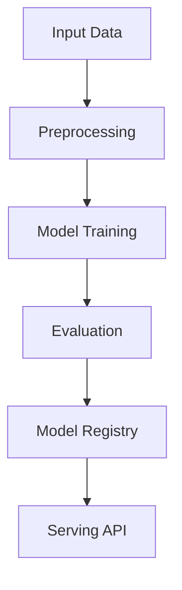

# multimodal-llm

## ∫ Mathematics & Theory

Multimodal Learning — Underlying equations and derivations

$$h = \text{CrossAttention}(Q_{\text{text}}, K_{\text{image}}, V_{\text{image}})$$

$$\mathcal{L} = \mathcal{L}_{\text{image-text}} + \lambda_1 \mathcal{L}_{\text{image}} + \lambda_2 \mathcal{L}_{\text{text}}$$

$$\text{cosine}(u, v) = \frac{u^T v}{\|u\| \|v\|}$$

### Step-by-Step Derivation

Multimodal models align representations from different modalities in a shared embedding space. Cross-attention allows one modality to query another. Contrastive learning pulls matched pairs together and pushes unmatched pairs apart. The total loss balances cross-modal alignment with unimodal task losses.

### Interactive Visualization

Interactive embedding alignment plot; cross-attention weight heatmap; modality contribution explorer.

## ⚙ Architecture

Model structure, data flow, and layer breakdown

### Class Hierarchy

```
  TextEncoder
  ImageEncoder
  AudioEncoder
  Connector
  FusionMechanism
  MultiHeadAttention
  FeedForward
  AddNorm
  TransformerEncoder
  TransformerDecoder
  LLMBackbone
  MultimodalLLM
```

### Data Flow



## ⚡ API Reference

FastAPI endpoints and model interfaces

| Method | Endpoint |
| --- | --- |
| `GET` | `/` |
| `GET` | `/health` |
| `GET` | `/metrics` |
| `POST` | `/reload` |

## ▶ Usage

Code examples and CLI commands

### Training Script

```python
"""Training pipeline for Multimodal Language Modeling."""

import argparse
import os
from pathlib import Path

from ai_core.logging import get_logger, setup_logging
from ai_core.model_registry import ModelRegistry

from multimodal_llm.data import (
    VOCAB_SIZE,
    generate_synthetic_multimodal_data,
    save_multimodal_data,
    train_test_split_multimodal,
)
from multimodal_llm.model import MultimodalLLM

logger = get_logger(__name__)

def train(
    model_dir: Path,
    n_samples: int = 500,
    vocab_size: int = VOCAB_SIZE,
    seq_len: int = 64,
    d_model: int = 256,
    text_encoder_dim: int = 256,
    image_encoder_dim: int = 768,
    audio_encoder_dim: int = 80,
    connector_dim: int = 512,
    fusion_type: str = "hybrid",
    max_seq_len: int = 128,
    n_encoder_layers: int = 2,
    n_decoder_layers: int = 2,
    d_ff: int = 512,
    learning_rate: float = 0.001,
    n_iterations: int = 100,
    weight_decay: float = 0.01,
    model_version: str = "1.0.0",
    register_to_mlflow: bool = False,
    test_size: float = 0.2,
    random_seed: int = 42,
    include_image: bool = True,
    include_audio: bool = True,
) -> dict:
    logger.info("Generating multimodal training data", n_samples=n_samples, include_image=include_image, include_audio=include_audio)
    data = generate_synthetic_multimodal_data(
        n_samples=n_samples,
        vocab_size=vocab_size,
        seq_len=seq_len,
        random_seed=random_seed,
        include_image=include_image,
        include_audio=include_audio,
    )

    train_data, test_data = train_test_split_multimodal(data, test_size=test_size, random_seed=random_seed)
    logger.info("Data split", n_train=len(train_data["text_tokens"]), n_test=len(test_data["text_tokens"]))

    model_dir.mkdir(parents=True, exist_ok=True)
    save_multimodal_data(data, model_dir / "training_data.npz")

    X_train_text = train_data["text_tokens"]
    y_train = train_data["text_targets"]
    X_train_image = train_data.get("image_patches")
    X_train_audio = train_data.get("mel_spectrogram")

    model = MultimodalLLM(
        vocab_size=vocab_size,
        d_model=d_model,
        text_encoder_dim=text_encoder_dim,
        image_encoder_dim=image_encoder_dim,
        audio_encoder_dim=audio_encoder_dim,
        connector_dim=connector_dim,
        fusion_type=fusion_type,
        max_seq_len=max_seq_len,
        n_encoder_layers=n_encoder_layers,
        n_decoder_layers=n_decoder_layers,
        d_ff=d_ff,
        learning_rate=learning_rate,
        n_iterations=n_iterations,
        weight_decay=weight_decay,
        random_seed=random_seed,
    )
    model.fit(X_train_text, y_train, image_patches=X_train_image, mel_spectrogram=X_train_audio)

    X_test_text = test_data["text_tokens"]
    y_test = test_data["text_targets"]
    X_test_image = test_data.get("image_patches")
    X_test_audio = test_data.get("mel_spectrogram")

    model.predict(X_test_text[:5], image_patches=X_test_image[:5] if X_test_image is not None else None, mel_spectrogram=X_test_audio[:5] if X_test_audio is not None else None)
    test_metrics = model.evaluate(X_test_text, y_test)
    logger.info("Training complete", training_mode=model.training_mode, final_loss=model.loss_history[-1])

    model_path = model_dir / f"multimodal_llm_v{model_version}.npz"
    model.save(str(model_path))

    metrics = {
        **test_metrics,
        "training_mode": "supervised",
        "n_epochs_run": float(len(model.loss_history)),
        "final_loss": model.loss_history[-1] if model.loss_history else 0.0,
        "n_train_samples": float(len(X_train_text)),
        "n_test_samples": float(len(X_test_text)),
        "vocab_size": float(vocab_size),
        "d_model": float(d_model),
        "connector_dim": float(connector_dim),
        "fusion_type": fusion_type,
        "n_encoder_layers": float(n_encoder_layers),
        "n_decoder_layers": float(n_decoder_layers),
    }

    registry = ModelRegistry(base_dir=model_dir)
    registry.save_model(
        model_name="multimodal-llm",
        model_version=model_version,
        model_type="classification",
        metrics=metrics,
        parameters={
            "vocab_size": vocab_size,
            "d_model": d_model,
            "text_encoder_dim": text_encoder_dim,
            "image_encoder_dim": image_encoder_dim,
            "audio_encoder_dim": audio_encoder_dim,
            "connector_dim": connector_dim,
            "fusion_type": fusion_type,
            "max_seq_len": max_seq_len,
            "n_encoder_layers": n_encoder_layers,
            "n_decoder_layers": n_decoder_layers,
            "d_ff": d_ff,
            "learning_rate": learning_rate,
            "n_iterations": n_iterations,
            "weight_decay": weight_decay,
            "random_seed": random_seed,
            "include_image": include_image,
            "include_audio": include_audio,
        },
        artifacts={
            f"multimodal_llm_v{model_version}.npz": model_path,
            "training_data.npz": model_dir / "training_data.npz",
        },
        tags={"framework": "numpy", "task": "multimodal_llm", "model_type": "MLLM"},
    )

    if register_to_mlflow:
        registry.log_to_mlflow(
            model_name="multimodal-llm",
            model_version=model_version,
            metrics=metrics,
            params={"vocab_size": vocab_size, "d_model": d_model, "fusion_type": fusion_type, "n_iterations": n_iterations},
            artifacts={"model": str(model_path)},
            tags={"model_type": "multimodal_llm", "framework": "numpy"},
        )

    return metrics

def main():
    parser = argparse.ArgumentParser(description="Train Multimodal LLM")
    parser.add_argument("--model-dir", type=Path, default=Path(os.getenv("MODEL_DIR", "/models")))
    parser.add_argument("--n-samples", type=int, default=int(os.getenv("N_SAMPLES", "500")))
    parser.add_argument("--vocab-size", type=int, default=int(os.getenv("VOCAB_SIZE", str(VOCAB_SIZE))))
    parser.add_argument("--seq-len", type=int, default=int(os.getenv("SEQ_LEN", "64")))
    parser.add_argument("--d-model", type=int, default=int(os.getenv("D_MODEL", "256")))
    parser.add_argument("--text-encoder-dim", type=int, default=int(os.getenv("TEXT_ENCODER_DIM", "256")))
    parser.add_argument("--image-encoder-dim", type=int, default=int(os.getenv("IMAGE_ENCODER_DIM", "768")))
    parser.add_argument("--audio-encoder-dim", type=int, default=int(os.getenv("AUDIO_ENCODER_DIM", "80")))
    parser.add_argument("--connector-dim", type=int, default=int(os.getenv("CONNECTOR_DIM", "512")))
    parser.add_argument("--fusion-type", type=str, default=os.getenv("FUSION_TYPE", "hybrid"), choices=["early", "late", "hybrid"])
    parser.add_argument("--max-seq-len", type=int, default=int(os.getenv("MAX_SEQ_LEN", "128")))
    parser.add_argument("--n-encoder-layers", type=int, default=int(os.getenv("N_ENCODER_LAYERS", "2")))
    parser.add_argument("--n-decoder-layers", type=int, default=int(os.getenv("N_DECODER_LAYERS", "2")))
    parser.add_argument("--d-ff", type=int, default=int(os.getenv("D_FF", "512")))
    parser.add_argument("--learning-rate", type=float, default=float(os.getenv("LEARNING_RATE", "0.001")))
    parser.add_argument("--n-iterations", type=int, default=int(os.getenv("N_ITERATIONS", "100")))
    parser.add_argument("--weight-decay", type=float, default=float(os.getenv("WEIGHT_DECAY", "0.01")))
    parser.add_argument("--model-version", type=str, default=os.getenv("MODEL_VERSION", "1.0.0"))
    parser.add_argument("--test-size", type=float, default=float(os.getenv("TEST_SIZE", "0.2")))
    parser.add_argument("--random-seed", type=int, default=int(os.getenv("RANDOM_SEED", "42")))
    parser.add_argument("--register-mlflow", action="store_true", default=os.getenv("REGISTER_MLFLOW", "false").lower() == "true")
    parser.add_argument("--no-image", action="store_true", help="Disable image modality")
    parser.add_argument("--no-audio", action="store_true", help="Disable audio modality")
    parser.add_argument("--log-level", type=str, default=os.getenv("LOG_LEVEL", "INFO"))
    args = parser.parse_args()

    setup_logging(args.log_level)
    args.model_dir.mkdir(parents=True, exist_ok=True)

    metrics = train(
        model_dir=args.model_dir,
        n_samples=args.n_samples,
        vocab_size=args.vocab_size,
        seq_len=args.seq_len,
        d_model=args.d_model,
        text_encoder_dim=args.text_encoder_dim,
        image_encoder_dim=args.image_encoder_dim,
        audio_encoder_dim=args.audio_encoder_dim,
        connector_dim=args.connector_dim,
        fusion_type=args.fusion_type,
        max_seq_len=args.max_seq_len,
        n_encoder_layers=args.n_encoder_layers,
        n_decoder_layers=args.n_decoder_layers,
        d_ff=args.d_ff,
        learning_rate=args.learning_rate,
        n_iterations=args.n_iterations,
        weight_decay=args.weight_decay,
        model_version=args.model_version,
        register_to_mlflow=args.register_mlflow,
        test_size=args.test_size,
        random_seed=args.random_seed,
        include_image=not args.no_image,
        include_audio=not args.no_audio,
    )
    logger.info("Training finished", metrics=metrics, model_dir=str(args.model_dir))

if __name__ == "__main__":
    main()
```

### API Server

```python
"""Serving API for Multimodal Language Modeling."""

import os
import time
from contextlib import asynccontextmanager
from pathlib import Path

import numpy as np
from ai_core.drift import DriftDetector
from ai_core.fastapi_middleware import add_observability_middleware
from ai_core.logging import get_logger, setup_logging
from ai_core.metrics import MetricsCollector
from ai_core.model_registry import ModelRegistry
from fastapi import FastAPI, HTTPException, Response
from pydantic import BaseModel, Field

from multimodal_llm.data import VOCAB_SIZE, generate_synthetic_multimodal_data
from multimodal_llm.model import MultimodalLLM, softmax

logger = get_logger(__name__)

MODEL_DIR = Path(os.getenv("MODEL_DIR", "/models"))
MODEL_VERSION = os.getenv("MODEL_VERSION", "latest")
METRICS_PORT = int(os.getenv("MULTIMODAL_LLM_METRICS_PORT", "8012"))
DRIFT_THRESHOLD = float(os.getenv("DRIFT_THRESHOLD", "0.2"))

class MultimodalPredictRequest(BaseModel):
    text_tokens: list[int] = Field(..., min_length=1, max_length=64)
    image_patches: list[list[float]] | None = Field(default=None)
    mel_spectrogram: list[list[float]] | None = Field(default=None)
    max_len: int = Field(default=10, ge=1, le=32)

class MultimodalPredictResponse(BaseModel):
    generated_tokens: list[int]
    predicted_token: int
    confidence: float
    model_version: str
    training_mode: str
    modalities_used: list[str]

class DriftResponse(BaseModel):
    total_features: int
    drifted_features: int
    drift_ratio: float
    drifted: list[dict]
    all_results: list[dict]

class StatsResponse(BaseModel):
    vocab_size: int
    d_model: int
    connector_dim: int
    fusion_type: str
    n_encoder_layers: int
    n_decoder_layers: int
    training_mode: str
    n_epochs_run: int
    final_loss: float
    model_version: str

_model: MultimodalLLM | None = None
_model_version: str = "unknown"
_metrics: MetricsCollector | None = None
_drift_detector: DriftDetector | None = None
_reference_data: np.ndarray | None = None
_recent_predictions: list[list[float]] = []

@asynccontextmanager
async def lifespan(app: FastAPI):
    global _model, _model_version, _metrics, _drift_detector, _reference_data

    setup_logging(os.getenv("LOG_LEVEL", "INFO"))
    _metrics = MetricsCollector("multimodal_llm", port=METRICS_PORT)
    app.state.metrics = _metrics

    feature_names = [f"token_{i}" for i in range(VOCAB_SIZE)]
    _drift_detector = DriftDetector(
        feature_names=feature_names,
        feature_types={f: "float" for f in feature_names},
        psi_threshold=DRIFT_THRESHOLD,
    )

    _model, _model_version = _load_model()
    _metrics.set_model_version(_model_version)
    _metrics.set_model_info(
        model_name="multimodal-llm",
        model_version=_model_version,
        model_type="multimodal",
    )

    _reference_data = _load_reference_data()
    logger.info("Model loaded", model="multimodal-llm", version=_model_version)

    yield
    logger.info("Shutting down multimodal-llm API")

def _load_model() -> tuple[MultimodalLLM, str]:
    registry = ModelRegistry(base_dir=MODEL_DIR)
    try:
        if MODEL_VERSION == "latest":
            models = registry.list_models()
            mm_models = [m for m in models if m.get("model_name") == "multimodal-llm"]
            if mm_models:
                mm_models.sort(key=lambda m: m["model_version"], reverse=True)
                latest = mm_models[0]
                model_dir = Path(latest["artifact_path"])
                npz_files = list(model_dir.glob("multimodal_llm_v*.npz")) + list(model_dir.glob("*.npz"))
                if npz_files:
                    return MultimodalLLM.load(str(npz_files[0])), latest["model_version"]
        else:
            model_dir = MODEL_DIR / "multimodal-llm" / MODEL_VERSION
            if model_dir.exists():
                npz_files = list(model_dir.glob("multimodal_llm_v*.npz")) + list(model_dir.glob("*.npz"))
                if npz_files:
                    return MultimodalLLM.load(str(npz_files[0])), MODEL_VERSION
    except Exception as e:
        logger.warning(f"Registry lookup failed: {e}")

    npz_path = MODEL_DIR / "multimodal_llm.npz"
    if npz_path.exists():
        return MultimodalLLM.load(str(npz_path)), "legacy"

    candidate_paths = [
        Path("/app/artifacts/models/multimodal_llm_v1.0.0.npz"),
        Path(__file__).resolve().parents[3] / "artifacts" / "models" / "multimodal_llm_v1.0.0.npz",
    ]
    for p in candidate_paths:
        if p.exists():
            logger.info("Loading bundled baseline model", path=str(p))
            return MultimodalLLM.load(str(p)), "1.0.0-bundled"

    logger.warning("No pre-existing model found. Initializing baseline model.")
    X_base, y_base = generate_synthetic_multimodal_data(n_samples=100, random_seed=42)
    model = MultimodalLLM(
        vocab_size=VOCAB_SIZE,
        d_model=128,
        text_encoder_dim=128,
        image_encoder_dim=256,
        audio_encoder_dim=64,
        connector_dim=256,
        fusion_type="hybrid",
        max_seq_len=64,
        n_encoder_layers=1,
        n_decoder_layers=1,
        d_ff=256,
        learning_rate=0.001,
        n_iterations=50,
        random_seed=42,
    )
    model.fit(X_base["text_tokens"], y_base, image_patches=X_base.get("image_patches"), mel_spectrogram=X_base.get("mel_spectrogram"))
    return model, "1.0.0-baseline"

def _load_reference_data() -> np.ndarray | None:
    X_base, _ = generate_synthetic_multimodal_data(n_samples=100, random_seed=42)
    return X_base["text_tokens"].astype(float)

app = FastAPI(
    title="Multimodal LLM API",
    description="Multimodal Large Language Model that integrates text, image, and audio inputs using modality encoders, connectors, fusion mechanisms, and LLM backbone",
    version="1.0.0",
    lifespan=lifespan,
)

add_observability_middleware(app)

@app.get("/")
def read_root():
    return {
        "service": "multimodal_llm-api",
        "version": "1.0.0",
        "model_version": _model_version,
        "training_mode": _model.training_mode if _model else "unknown",
        "endpoints": {
            "health": "/health",
            "predict": "POST /predict",
            "stats": "GET /stats",
            "drift": "GET /drift",
            "metrics": "/metrics",
        },
    }

@app.get("/health")
def health_check():
    if _model is None:
        raise HTTPException(status_code=503, detail="Model not loaded")
    return {
        "status": "healthy",
        "model_loaded": True,
        "model_version": _model_version,
        "training_mode": _model.training_mode if _model else "unknown",
    }

@app.get("/metrics")
def metrics():
    from prometheus_client import CONTENT_TYPE_LATEST, generate_latest
    return Response(content=generate_latest(), media_type=CONTENT_TYPE_LATEST)

@app.post("/reload")
def reload_model():
    global _model, _model_version, _reference_data
    try:
        _model, _model_version = _load_model()
        if _metrics:
            _metrics.set_model_version(_model_version)
            _metrics.set_model_info(
                model_name="multimodal-llm",
                model_version=_model_version,
                model_type="multimodal",
            )
        _reference_data = _load_reference_data()
        logger.info("Model reloaded", model="multimodal-llm", version=_model_version)
        return {"status": "reloaded", "model_version": _model_version}
    except Exception as e:
        logger.exception("Model reload failed", error=str(e))
        raise HTTPException(status_code=500, detail=f"Reload failed: {e}") from e

@app.get("/drift", response_model=DriftResponse)
def drift_check():
    if _drift_detector is None or _reference_data is None:
        raise HTTPException(status_code=503, detail="Drift detection not available")
    if len(_recent_predictions) < 10:
        return {"total_features": VOCAB_SIZE, "drifted_features": 0, "drift_ratio": 0.0, "drifted": [], "all_results": []}
    current = np.array(_recent_predictions[-100:])
    results = _drift_detector.detect_drift(_reference_data, current)
    summary = _drift_detector.summarize(results)
    if _metrics:
        _metrics.set_drift_ratio(summary["drift_ratio"])
    return summary

@app.get("/stats", response_model=StatsResponse)
def get_stats():
    if _model is None or not _model.text_encoder:
        raise HTTPException(status_code=503, detail="Model not loaded")
    info = _model.to_dict()
    return StatsResponse(
        vocab_size=info["vocab_size"],
        d_model=info["d_model"],
        connector_dim=info["connector_dim"],
        fusion_type=info["fusion_type"],
        n_encoder_layers=info["n_encoder_layers"],
        n_decoder_layers=info["n_decoder_layers"],
        training_mode=info["training_mode"],
        n_epochs_run=info["n_epochs_run"],
        final_loss=info["final_loss"],
        model_version=_model_version,
    )

@app.post("/predict", response_model=MultimodalPredictResponse)
def predict(body: MultimodalPredictRequest):
    """Generate next-token prediction using multimodal LLM with text, image, and audio inputs."""
    if _model is None or _metrics is None:
        raise HTTPException(status_code=503, detail="Model not loaded")

    text_tokens = np.array(body.text_tokens).reshape(1, -1)
    image_patches = np.array(body.image_patches).reshape(1, -1, 768) if body.image_patches else None
    mel_spectrogram = np.array(body.mel_spectrogram).reshape(1, -1, 80) if body.mel_spectrogram else None

    modalities_used = ["text"]
    if image_patches is not None:
        modalities_used.append("image")
    if mel_spectrogram is not None:
        modalities_used.append("audio")

    start = time.time()
    try:
        generated = _model.predict(text_tokens, image_patches=image_patches, mel_spectrogram=mel_spectrogram, max_len=body.max_len)
        predicted_token = int(generated[0]) if len(generated) > 0 else 0

        logits = _model.llm_backbone.forward(text_tokens)
        probs = softmax(logits.flatten())
        confidence = float(probs[predicted_token]) if predicted_token < len(probs) else 0.0

        response = MultimodalPredictResponse(
            generated_tokens=generated.tolist(),
            predicted_token=predicted_token,
            confidence=round(confidence, 4),
            model_version=_model_version,
            training_mode=_model.training_mode,
            modalities_used=modalities_used,
        )
        duration = time.time() - start
        _metrics.record_prediction(model_version=_model_version, duration=duration)

        _recent_predictions.append([float(t) for t in body.text_tokens])
        if len(_recent_predictions) > 1000:
            _recent_predictions.pop(0)

        return response
    except Exception as e:
        _metrics.record_error(model_version=_model_version, error_type="prediction")
        logger.exception("Prediction failed", error=str(e))
        raise HTTPException(status_code=500, detail="Prediction failed") from e
```

### CLI Commands

```bash
uv run python -m multimodal_llm.train --model-dir ./artifacts/models
```

## 📊 Benchmarks

Test results and performance metrics

Run `pytest tests/test_models.py` and `pytest tests/test_apis.py` for detailed metrics.

Generated documentation for **multimodal-llm**
