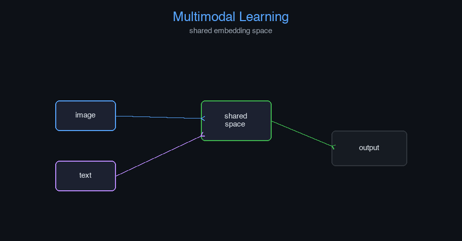

# multimodal-llm


Multimodal Learning — AI engineering example · part of the MLOps monorepo

## 1. Mathematical Foundations

This example is grounded in **Multimodal Learning**. The equations below
drive every forward and backward pass in the implementation.

$$h = \text{CrossAttention}(Q_{\text{text}}, K_{\text{image}}, V_{\text{image}})$$

$$\mathcal{L} = \mathcal{L}_{\text{image-text}} + \lambda_1 \mathcal{L}_{\text{image}} + \lambda_2 \mathcal{L}_{\text{text}}$$

$$\text{cosine}(u, v) = \frac{u^T v}{\|u\| \|v\|}$$

### Derivation

Multimodal models align representations from different modalities in a shared embedding space. Cross-attention allows one modality to query another. Contrastive learning pulls matched pairs together and pushes unmatched pairs apart. The total loss balances cross-modal alignment with unimodal task losses.

### Worked Numerical Example

$$z = w \cdot x + b$$

Illustrative forward-pass evaluation (scalar example):

Input  x        = 12.0   (e.g. pizza diameter, inches)
Weights w       =  0.85
Bias    b       =  0.30
---------------------------------
z = w*x + b
  = 0.85 * 12.0 + 0.30
  = 10.20 + 0.30
  = 10.50   <- model output

### Conceptual Diagram

        Math concept (placeholder)
   [ Input x ] --> ( w · x + b ) --> [ Output z ]
                       |
                  [ activation ]
                       |
                  [ prediction ]



Interactive embedding alignment plot; cross-attention weight heatmap; modality contribution explorer.

## 2. Core Logic & Architecture

The example follows a consistent **data → train → evaluate → serve**
pipeline. Inputs are loaded and validated, transformed by the core algorithm, scored against
held-out data, and exposed through a REST API.

  Raw dataset→
  load + validate (data.py)→
  fit / transform (model.py)→
  evaluate + persist (train.py)→
  serve (api.py)

### Primary Components

| Class | Public methods | Responsibility |
| --- | --- | --- |
| `MultimodalPredictRequest` | — |  |
| `MultimodalPredictResponse` | — |  |
| `DriftResponse` | — |  |
| `StatsResponse` | — |  |
| `TextEncoder` | init_weights, forward |  |
| `ImageEncoder` | __post_init__, init_weights, forward |  |
| `AudioEncoder` | init_weights, forward |  |
| `Connector` | init_weights, forward |  |
| `FusionMechanism` | init_weights, early_fusion, late_fusion, hybrid_fusion, forward |  |
| `MultiHeadAttention` | __post_init__, init_weights, _split_heads, _combine_heads, set_enc_output, forward, backward, update_params |  |
| `FeedForward` | init_weights, forward, backward, update_params |  |
| `AddNorm` | init_params, forward, backward |  |
| `TransformerEncoder` | __post_init__, forward |  |
| `TransformerDecoder` | __post_init__, forward |  |
| `LLMBackbone` | _init, forward |  |
| `MultimodalLLM` | _init, encode_modalities, fit, predict, evaluate, save, load, to_dict |  |

### Data Flow


1. **Load** — `data.py` reads the source dataset and splits train/test.


2. **Validate** — a Pydantic schema guards input shape/dtypes before training.


3. **Fit / Transform** — `model.py` applies the mathematics from Section 1.


4. **Evaluate** — metrics (MSE/RMSE/R², accuracy, etc.) are computed and logged.


5. **Persist** — weights/artifacts are saved and registered in the model registry.


6. **Serve** — `api.py` exposes prediction endpoints with drift detection.

### Design Patterns & Performance

Key design choices in this module: a pure-NumPy implementation (no PyTorch/TensorFlow), schema validation via `ai_core.validation`, structured JSON logging through `ai_core.logging`, Prometheus metrics from `ai_core.metrics`, and MLflow/model-registry persistence via `ai_core.model_registry`. The FastAPI service wraps the trained model with observability middleware from `ai_core.fastapi_middleware`.

## 3. Detailed Code Walkthrough

The most important behaviour is summarised below; full source for each module is collapsible
so the page stays readable while remaining self-contained.

No docstring-annotated key methods.

### Source Files

<details>
<summary>model.py</summary>

```
"""Multimodal Large Language Model implementation from scratch using NumPy.

Architecture (following GeeksforGeeks MLLM article):

    1. Modality Encoders:
       - TextEncoder: token embedding + positional encoding
       - ImageEncoder: patch embedding + projection
       - AudioEncoder: mel spectrogram + projection

    2. Connector (Aligner/Projector):
       - MLP-based projection to align modality embeddings to LLM space

    3. Fusion Mechanism:
       - Early fusion: combine raw embeddings before processing
       - Late fusion: combine after independent processing
       - Hybrid fusion: combine at multiple layers

    4. LLM Backbone:
       - Simplified transformer with self-attention
       - Generates text conditioned on all modalities

Core concepts:
    - Cross-Modal Attention: attention between different modality tokens
    - Joint Representation: unified embedding space for all modalities
    - Feature Extraction: extract relevant features from each modality

Training objective:
    - Data loss: cross-entropy on next-token prediction
    - Multimodal alignment: contrastive loss between modalities

Args:
    vocab_size: vocabulary size for text
    d_model: model dimension
    n_heads: number of attention heads
    text_encoder_dim: text embedding dimension
    image_encoder_dim: image patch embedding dimension
    audio_encoder_dim: audio embedding dimension
    connector_dim: connector projection dimension
    fusion_type: "early", "late", or "hybrid"
    max_seq_len: maximum sequence length
    n_encoder_layers: number of transformer encoder layers
    n_decoder_layers: number of transformer decoder layers
    d_ff: feed-forward inner dimension
    learning_rate: gradient descent step size
    n_iterations: number of training epochs
    dropout_rate: dropout probability
    weight_decay: L2 regularization
    random_seed: random seed
"""

from dataclasses import dataclass, field

import numpy as np

def gelu(x: np.ndarray) -> np.ndarray:
    return 0.5 * x * (1.0 + np.tanh(np.sqrt(2.0 / np.pi) * (x + 0.044715 * x ** 3)))

def softmax(z: np.ndarray, axis: int = -1) -> np.ndarray:
    z_shifted = z - np.max(z, axis=axis, keepdims=True)
    exp_z = np.exp(z_shifted)
    return exp_z / np.sum(exp_z, axis=axis, keepdims=True)

def layer_norm(x: np.ndarray, gamma: np.ndarray, beta: np.ndarray, eps: float = 1e-5) -> np.ndarray:
    mean = np.mean(x, axis=-1, keepdims=True)
    var = np.var(x, axis=-1, keepdims=True)
    return gamma * (x - mean) / np.sqrt(var + eps) + beta

def scaled_dot_product_attention(
    Q: np.ndarray, K: np.ndarray, V: np.ndarray, mask: np.ndarray | None = None
) -> np.ndarray:
    d_k = Q.shape[-1]
    scores = Q @ np.swapaxes(K, -2, -1) / np.sqrt(d_k)

    if mask is not None:
        scores = scores + (mask * -1e9)

    attn = softmax(scores, axis=-1)
    return attn @ V

def positional_encoding(max_len: int, d_model: int) -> np.ndarray:
    pe = np.zeros((max_len, d_model))
    for pos in range(max_len):
        for i in range(d_model):
            angle = pos / (10000 ** (2 * (i // 2) / d_model))
            if i % 2 == 0:
                pe[pos, i] = np.sin(angle)
            else:
                pe[pos, i] = np.cos(angle)
    return pe

def cross_modal_attention(
    query: np.ndarray, key: np.ndarray, value: np.ndarray, mask: np.ndarray | None = None
) -> np.ndarray:
    d_k = query.shape[-1]
    scores = query @ np.swapaxes(key, -2, -1) / np.sqrt(d_k)

    if mask is not None:
        scores = scores + (mask * -1e9)

    attn_weights = softmax(scores, axis=-1)
    return attn_weights @ value

@dataclass
class TextEncoder:
    vocab_size: int = 1000
    d_model: int = 256
    max_seq_len: int = 128
    random_seed: int = 42

    embedding: np.ndarray | None = None
    pos_encoding: np.ndarray | None = None
    _cache: dict = field(default_factory=dict, repr=False)

    def init_weights(self) -> None:
        rng = np.random.default_rng(self.random_seed)
        scale = np.sqrt(2.0 / self.d_model)
        self.embedding = rng.normal(0, scale, (self.vocab_size, self.d_model))
        self.pos_encoding = positional_encoding(self.max_seq_len, self.d_model)

    def forward(self, tokens: np.ndarray) -> np.ndarray:
        if self.embedding is None:
            self.init_weights()

        seq_len = tokens.shape[1] if tokens.ndim > 1 else 1
        embedded = self.embedding[tokens] * np.sqrt(self.d_model)

        if tokens.ndim == 1:
            embedded = embedded + self.pos_encoding[:len(tokens)]
        else:
            embedded = embedded + self.pos_encoding[:seq_len]

        self._cache = {"tokens": tokens, "embedded": embedded}
        return embedded

@dataclass
class ImageEncoder:
    image_dim: int = 3
    patch_size: int = 16
    n_patches: int = 49
    d_model: int = 256
    random_seed: int = 42

    patch_projection: np.ndarray | None = None
    pos_encoding: np.ndarray | None = None
    _cache: dict = field(default_factory=dict, repr=False)

    def __post_init__(self):
        self._patch_dim = self.image_dim * self.patch_size * self.patch_size
        if self.n_patches == 0:
            self.n_patches = (self.image_dim // self.patch_size) ** 2

    def init_weights(self) -> None:
        rng = np.random.default_rng(self.random_seed)
        scale = np.sqrt(2.0 / self.d_model)
        self.patch_projection = rng.normal(0, scale, (self._patch_dim, self.d_model))
        self.pos_encoding = positional_encoding(self.n_patches + 1, self.d_model)

    def forward(self, image_patches: np.ndarray) -> np.ndarray:
        if self.patch_projection is None:
            self.init_weights()

        batch_size = image_patches.shape[0]
        patches_flat = image_patches.reshape(batch_size, self.n_patches, -1)
        projected = patches_flat @ self.patch_projection

        cls_token = np.zeros((batch_size, 1, self.d_model))
        projected = np.concatenate([cls_token, projected], axis=1)

        projected = projected + self.pos_encoding

        self._cache = {"image_patches": image_patches, "projected": projected}
        return projected

@dataclass
class AudioEncoder:
    n_mels: int = 80
    n_time_steps: int = 100
    d_model: int = 256
    random_seed: int = 42

    mel_projection: np.ndarray | None = None
    pos_encoding: np.ndarray | None = None
    _cache: dict = field(default_factory=dict, repr=False)

    def init_weights(self) -> None:
        rng = np.random.default_rng(self.random_seed)
        scale = np.sqrt(2.0 / self.d_model)
        self.mel_projection = rng.normal(0, scale, (self.n_mels, self.d_model))
        self.pos_encoding = positional_encoding(self.n_time_steps, self.d_model)

    def forward(self, mel_spectrogram: np.ndarray) -> np.ndarray:
        if self.mel_projection is None:
            self.init_weights()

        projected = mel_spectrogram @ self.mel_projection
        projected = projected + self.pos_encoding

        self._cache = {"mel_spectrogram": mel_spectrogram, "projected": projected}
        return projected

@dataclass
class Connector:
    input_dim: int = 256
    connector_dim: int = 512
    random_seed: int = 42

    W1: np.ndarray | None = None
    b1: np.ndarray | None = None
    W2: np.ndarray | None = None
    b2: np.ndarray | None = None
    _cache: dict = field(default_factory=dict, repr=False)

    def init_weights(self) -> None:
        rng = np.random.default_rng(self.random_seed)
        scale1 = np.sqrt(2.0 / self.input_dim)
        scale2 = np.sqrt(2.0 / self.connector_dim)
        self.W1 = rng.normal(0, scale1, (self.input_dim, self.connector_dim))
        self.b1 = np.zeros(self.connector_dim)
        self.W2 = rng.normal(0, scale2, (self.connector_dim, self.connector_dim))
        self.b2 = np.zeros(self.connector_dim)

    def forward(self, x: np.ndarray) -> np.ndarray:
        if self.W1 is None:
            self.init_weights()

        z1 = x @ self.W1 + self.b1
        a1 = gelu(z1)
        z2 = a1 @ self.W2 + self.b2
        out = gelu(z2)

        self._cache = {"x": x, "z1": z1, "a1": a1, "out": out}
        return out

@dataclass
class FusionMechanism:
    d_model: int = 512
    fusion_type: str = "hybrid"
    random_seed: int = 42

    W_fusion: np.ndarray | None = None
    _cache: dict = field(default_factory=dict, repr=False)

    def init_weights(self) -> None:
        rng = np.random.default_rng(self.random_seed)
        scale = np.sqrt(2.0 / self.d_model)
        self.W_fusion = rng.normal(0, scale, (self.d_model * 3, self.d_model))

    def early_fusion(self, text: np.ndarray, image: np.ndarray | None = None, audio: np.ndarray | None = None) -> np.ndarray:
        modalities = [text]
        if image is not None:
            modalities.append(image)
        if audio is not None:
            modalities.append(audio)

        min_len = min(m.shape[1] for m in modalities)
        truncated = [m[:, :min_len, :] for m in modalities]
        fused = np.mean(truncated, axis=0)

        self._cache = {"modalities": modalities, "fused": fused}
        return fused

    def late_fusion(self, text_repr: np.ndarray, image_repr: np.ndarray | None = None, audio_repr: np.ndarray | None = None) -> np.ndarray:
        features = [text_repr]

        if image_repr is not None:
            if image_repr.ndim == 2:
                image_repr = image_repr.reshape(image_repr.shape[0], 1, -1)
            image_mean = np.mean(image_repr, axis=1, keepdims=True)
            image_tiled = np.tile(image_mean, (1, text_repr.shape[1], 1))
            features.append(image_tiled)

        if audio_repr is not None:
            if audio_repr.ndim == 2:
                audio_repr = audio_repr.reshape(audio_repr.shape[0], 1, -1)
            audio_mean = np.mean(audio_repr, axis=1, keepdims=True)
            audio_tiled = np.tile(audio_mean, (1, text_repr.shape[1], 1))
            features.append(audio_tiled)

        fused = np.concatenate(features, axis=-1)
        if self.W_fusion is None:
            self.init_weights()

        batch_size, seq_len, _ = fused.shape
        fused = fused.reshape(batch_size * seq_len, -1)
        fused = fused @ self.W_fusion[:fused.shape[1]]
        fused = fused.reshape(batch_size, seq_len, self.d_model)

        self._cache = {"features": features, "fused": fused}
        return fused

    def hybrid_fusion(self, text: np.ndarray, image: np.ndarray | None = None, audio: np.ndarray | None = None) -> np.ndarray:
        early_fused = self.early_fusion(text, image, audio)

        text_mean = np.mean(text, axis=1, keepdims=True)
        features = [text_mean]

        if image is not None:
            image_mean = np.mean(image, axis=1, keepdims=True)
            features.append(image_mean)
        if audio is not None:
            audio_mean = np.mean(audio, axis=1, keepdims=True)
            features.append(audio_mean)

        late_fused = np.concatenate(features, axis=-1)
        if self.W_fusion is None:
            self.init_weights()

        batch_size, seq_len, _ = early_fused.shape
        late_tiled = np.tile(late_fused, (1, seq_len, 1))

        combined = np.concatenate([early_fused, late_tiled], axis=-1)
        combined_dim = combined.shape[-1]

        if self.W_fusion.shape[0] != combined_dim:
            rng = np.random.default_rng(self.random_seed)
            scale = np.sqrt(2.0 / combined_dim)
            self.W_fusion = rng.normal(0, scale, (combined_dim, self.d_model))

        combined_flat = combined.reshape(batch_size * seq_len, combined_dim)
        fused = combined_flat @ self.W_fusion
        fused = fused.reshape(batch_size, seq_len, self.d_model)

        self._cache = {"early_fused": early_fused, "late_fused": late_fused, "fused": fused}
        return fused

    def forward(self, text: np.ndarray, image: np.ndarray | None = None, audio: np.ndarray | None = None, fusion_type: str | None = None) -> np.ndarray:
        ft = fusion_type or self.fusion_type
        if ft == "early":
            return self.early_fusion(text, image, audio)
        elif ft == "late":
            return self.late_fusion(text, image, audio)
        else:
            return self.hybrid_fusion(text, image, audio)

@dataclass
class MultiHeadAttention:
    d_model: int = 512
    n_heads: int = 8
    random_seed: int = 42

    d_k: int = field(init=False)
    W_q: np.ndarray | None = None
    W_k: np.ndarray | None = None
    W_v: np.ndarray | None = None
    W_o: np.ndarray | None = None
    dW_q: np.ndarray | None = None
    dW_k: np.ndarray | None = None
    dW_v: np.ndarray | None = None
    dW_o: np.ndarray | None = None
    _cache: dict = field(default_factory=dict, repr=False)

    def __post_init__(self):
        self.d_k = self.d_model // self.n_heads

    def init_weights(self) -> None:
        rng = np.random.default_rng(self.random_seed)
        scale = np.sqrt(2.0 / self.d_model)
        self.W_q = rng.normal(0, scale, (self.d_model, self.d_model))
        self.W_k = rng.normal(0, scale, (self.d_model, self.d_model))
        self.W_v = rng.normal(0, scale, (self.d_model, self.d_model))
        self.W_o = rng.normal(0, scale, (self.d_model, self.d_model))

    def _split_heads(self, x: np.ndarray) -> np.ndarray:
        batch_size, seq_len, _ = x.shape
        x = x.reshape(batch_size, seq_len, self.n_heads, self.d_k)
        return np.transpose(x, (0, 2, 1, 3))

    def _combine_heads(self, x: np.ndarray) -> np.ndarray:
        batch_size, _, seq_len, _ = x.shape
        x = np.transpose(x, (0, 2, 1, 3))
        return x.reshape(batch_size, seq_len, self.d_model)

    def set_enc_output(self, enc_output: np.ndarray) -> None:
        """Set encoder output for cross-attention (encoder-decoder attention)."""
        self._enc_output = enc_output
        self._is_cross = True

    def forward(self, x: np.ndarray, mask: np.ndarray | None = None) -> np.ndarray:
        if self.W_q is None:
            self.init_weights()

        Q = x @ self.W_q

        is_cross = getattr(self, "_is_cross", False) and hasattr(self, "_enc_output")
        if is_cross:
            enc = self._enc_output
            K = enc @ self.W_k
            V = enc @ self.W_v
... (truncated) ...
```

</details>

<details>
<summary>train.py</summary>

```
"""Training pipeline for Multimodal Language Modeling."""

import argparse
import os
from pathlib import Path

from ai_core.logging import get_logger, setup_logging
from ai_core.model_registry import ModelRegistry

from multimodal_llm.data import (
    VOCAB_SIZE,
    generate_synthetic_multimodal_data,
    save_multimodal_data,
    train_test_split_multimodal,
)
from multimodal_llm.model import MultimodalLLM

logger = get_logger(__name__)

def train(
    model_dir: Path,
    n_samples: int = 500,
    vocab_size: int = VOCAB_SIZE,
    seq_len: int = 64,
    d_model: int = 256,
    text_encoder_dim: int = 256,
    image_encoder_dim: int = 768,
    audio_encoder_dim: int = 80,
    connector_dim: int = 512,
    fusion_type: str = "hybrid",
    max_seq_len: int = 128,
    n_encoder_layers: int = 2,
    n_decoder_layers: int = 2,
    d_ff: int = 512,
    learning_rate: float = 0.001,
    n_iterations: int = 100,
    weight_decay: float = 0.01,
    model_version: str = "1.0.0",
    register_to_mlflow: bool = False,
    test_size: float = 0.2,
    random_seed: int = 42,
    include_image: bool = True,
    include_audio: bool = True,
) -> dict:
    logger.info("Generating multimodal training data", n_samples=n_samples, include_image=include_image, include_audio=include_audio)
    data = generate_synthetic_multimodal_data(
        n_samples=n_samples,
        vocab_size=vocab_size,
        seq_len=seq_len,
        random_seed=random_seed,
        include_image=include_image,
        include_audio=include_audio,
    )

    train_data, test_data = train_test_split_multimodal(data, test_size=test_size, random_seed=random_seed)
    logger.info("Data split", n_train=len(train_data["text_tokens"]), n_test=len(test_data["text_tokens"]))

    model_dir.mkdir(parents=True, exist_ok=True)
    save_multimodal_data(data, model_dir / "training_data.npz")

    X_train_text = train_data["text_tokens"]
    y_train = train_data["text_targets"]
    X_train_image = train_data.get("image_patches")
    X_train_audio = train_data.get("mel_spectrogram")

    model = MultimodalLLM(
        vocab_size=vocab_size,
        d_model=d_model,
        text_encoder_dim=text_encoder_dim,
        image_encoder_dim=image_encoder_dim,
        audio_encoder_dim=audio_encoder_dim,
        connector_dim=connector_dim,
        fusion_type=fusion_type,
        max_seq_len=max_seq_len,
        n_encoder_layers=n_encoder_layers,
        n_decoder_layers=n_decoder_layers,
        d_ff=d_ff,
        learning_rate=learning_rate,
        n_iterations=n_iterations,
        weight_decay=weight_decay,
        random_seed=random_seed,
    )
    model.fit(X_train_text, y_train, image_patches=X_train_image, mel_spectrogram=X_train_audio)

    X_test_text = test_data["text_tokens"]
    y_test = test_data["text_targets"]
    X_test_image = test_data.get("image_patches")
    X_test_audio = test_data.get("mel_spectrogram")

    model.predict(X_test_text[:5], image_patches=X_test_image[:5] if X_test_image is not None else None, mel_spectrogram=X_test_audio[:5] if X_test_audio is not None else None)
    test_metrics = model.evaluate(X_test_text, y_test)
    logger.info("Training complete", training_mode=model.training_mode, final_loss=model.loss_history[-1])

    model_path = model_dir / f"multimodal_llm_v{model_version}.npz"
    model.save(str(model_path))

    metrics = {
        **test_metrics,
        "training_mode": "supervised",
        "n_epochs_run": float(len(model.loss_history)),
        "final_loss": model.loss_history[-1] if model.loss_history else 0.0,
        "n_train_samples": float(len(X_train_text)),
        "n_test_samples": float(len(X_test_text)),
        "vocab_size": float(vocab_size),
        "d_model": float(d_model),
        "connector_dim": float(connector_dim),
        "fusion_type": fusion_type,
        "n_encoder_layers": float(n_encoder_layers),
        "n_decoder_layers": float(n_decoder_layers),
    }

    registry = ModelRegistry(base_dir=model_dir)
    registry.save_model(
        model_name="multimodal-llm",
        model_version=model_version,
        model_type="classification",
        metrics=metrics,
        parameters={
            "vocab_size": vocab_size,
            "d_model": d_model,
            "text_encoder_dim": text_encoder_dim,
            "image_encoder_dim": image_encoder_dim,
            "audio_encoder_dim": audio_encoder_dim,
            "connector_dim": connector_dim,
            "fusion_type": fusion_type,
            "max_seq_len": max_seq_len,
            "n_encoder_layers": n_encoder_layers,
            "n_decoder_layers": n_decoder_layers,
            "d_ff": d_ff,
            "learning_rate": learning_rate,
            "n_iterations": n_iterations,
            "weight_decay": weight_decay,
            "random_seed": random_seed,
            "include_image": include_image,
            "include_audio": include_audio,
        },
        artifacts={
            f"multimodal_llm_v{model_version}.npz": model_path,
            "training_data.npz": model_dir / "training_data.npz",
        },
        tags={"framework": "numpy", "task": "multimodal_llm", "model_type": "MLLM"},
    )

    if register_to_mlflow:
        registry.log_to_mlflow(
            model_name="multimodal-llm",
            model_version=model_version,
            metrics=metrics,
            params={"vocab_size": vocab_size, "d_model": d_model, "fusion_type": fusion_type, "n_iterations": n_iterations},
            artifacts={"model": str(model_path)},
            tags={"model_type": "multimodal_llm", "framework": "numpy"},
        )

    return metrics

def main():
    parser = argparse.ArgumentParser(description="Train Multimodal LLM")
    parser.add_argument("--model-dir", type=Path, default=Path(os.getenv("MODEL_DIR", "/models")))
    parser.add_argument("--n-samples", type=int, default=int(os.getenv("N_SAMPLES", "500")))
    parser.add_argument("--vocab-size", type=int, default=int(os.getenv("VOCAB_SIZE", str(VOCAB_SIZE))))
    parser.add_argument("--seq-len", type=int, default=int(os.getenv("SEQ_LEN", "64")))
    parser.add_argument("--d-model", type=int, default=int(os.getenv("D_MODEL", "256")))
    parser.add_argument("--text-encoder-dim", type=int, default=int(os.getenv("TEXT_ENCODER_DIM", "256")))
    parser.add_argument("--image-encoder-dim", type=int, default=int(os.getenv("IMAGE_ENCODER_DIM", "768")))
    parser.add_argument("--audio-encoder-dim", type=int, default=int(os.getenv("AUDIO_ENCODER_DIM", "80")))
    parser.add_argument("--connector-dim", type=int, default=int(os.getenv("CONNECTOR_DIM", "512")))
    parser.add_argument("--fusion-type", type=str, default=os.getenv("FUSION_TYPE", "hybrid"), choices=["early", "late", "hybrid"])
    parser.add_argument("--max-seq-len", type=int, default=int(os.getenv("MAX_SEQ_LEN", "128")))
    parser.add_argument("--n-encoder-layers", type=int, default=int(os.getenv("N_ENCODER_LAYERS", "2")))
    parser.add_argument("--n-decoder-layers", type=int, default=int(os.getenv("N_DECODER_LAYERS", "2")))
    parser.add_argument("--d-ff", type=int, default=int(os.getenv("D_FF", "512")))
    parser.add_argument("--learning-rate", type=float, default=float(os.getenv("LEARNING_RATE", "0.001")))
    parser.add_argument("--n-iterations", type=int, default=int(os.getenv("N_ITERATIONS", "100")))
    parser.add_argument("--weight-decay", type=float, default=float(os.getenv("WEIGHT_DECAY", "0.01")))
    parser.add_argument("--model-version", type=str, default=os.getenv("MODEL_VERSION", "1.0.0"))
    parser.add_argument("--test-size", type=float, default=float(os.getenv("TEST_SIZE", "0.2")))
    parser.add_argument("--random-seed", type=int, default=int(os.getenv("RANDOM_SEED", "42")))
    parser.add_argument("--register-mlflow", action="store_true", default=os.getenv("REGISTER_MLFLOW", "false").lower() == "true")
    parser.add_argument("--no-image", action="store_true", help="Disable image modality")
    parser.add_argument("--no-audio", action="store_true", help="Disable audio modality")
    parser.add_argument("--log-level", type=str, default=os.getenv("LOG_LEVEL", "INFO"))
    args = parser.parse_args()

    setup_logging(args.log_level)
    args.model_dir.mkdir(parents=True, exist_ok=True)

    metrics = train(
        model_dir=args.model_dir,
        n_samples=args.n_samples,
        vocab_size=args.vocab_size,
        seq_len=args.seq_len,
        d_model=args.d_model,
        text_encoder_dim=args.text_encoder_dim,
        image_encoder_dim=args.image_encoder_dim,
        audio_encoder_dim=args.audio_encoder_dim,
        connector_dim=args.connector_dim,
        fusion_type=args.fusion_type,
        max_seq_len=args.max_seq_len,
        n_encoder_layers=args.n_encoder_layers,
        n_decoder_layers=args.n_decoder_layers,
        d_ff=args.d_ff,
        learning_rate=args.learning_rate,
        n_iterations=args.n_iterations,
        weight_decay=args.weight_decay,
        model_version=args.model_version,
        register_to_mlflow=args.register_mlflow,
        test_size=args.test_size,
        random_seed=args.random_seed,
        include_image=not args.no_image,
        include_audio=not args.no_audio,
    )
    logger.info("Training finished", metrics=metrics, model_dir=str(args.model_dir))

if __name__ == "__main__":
    main()
```

</details>

<details>
<summary>data.py</summary>

```
"""Data loading and preprocessing for Multimodal Language Modeling."""

from pathlib import Path

import numpy as np

VOCAB_SIZE = 1000
MAX_SEQ_LEN = 64
DEFAULT_N_SAMPLES = 500

TEXT_DIM = 256
IMAGE_DIM = 768
AUDIO_DIM = 80
IMAGE_PATCH_SIZE = 16
N_PATCHES = 49
AUDIO_TIME_STEPS = 100

def generate_synthetic_text(n_samples: int = DEFAULT_N_SAMPLES, seq_len: int = MAX_SEQ_LEN, vocab_size: int = VOCAB_SIZE, random_seed: int = 42) -> tuple[np.ndarray, np.ndarray]:
    rng = np.random.default_rng(random_seed)
    X = rng.integers(0, vocab_size, size=(n_samples, seq_len))
    y = np.zeros_like(X)
    y[:, :-1] = X[:, 1:]
    y[:, -1] = rng.integers(0, vocab_size)
    return X, y

def generate_synthetic_image_patches(n_samples: int = DEFAULT_N_SAMPLES, n_patches: int = N_PATCHES, patch_size: int = IMAGE_PATCH_SIZE, random_seed: int = 42) -> np.ndarray:
    rng = np.random.default_rng(random_seed)
    patch_dim = patch_size * patch_size * 3
    patches = rng.normal(0, 1, size=(n_samples, n_patches, patch_dim))
    return patches

def generate_synthetic_audio(n_samples: int = DEFAULT_N_SAMPLES, n_mels: int = AUDIO_DIM, n_time_steps: int = AUDIO_TIME_STEPS, random_seed: int = 42) -> np.ndarray:
    rng = np.random.default_rng(random_seed)
    mel_spec = rng.normal(0, 1, size=(n_samples, n_time_steps, n_mels))
    return mel_spec

def generate_synthetic_multimodal_data(n_samples: int = DEFAULT_N_SAMPLES, vocab_size: int = VOCAB_SIZE, seq_len: int = MAX_SEQ_LEN, random_seed: int = 42, include_image: bool = True, include_audio: bool = True) -> dict:
    text_X, text_y = generate_synthetic_text(n_samples, seq_len, vocab_size, random_seed)
    data = {"text_tokens": text_X, "text_targets": text_y}

    if include_image:
        data["image_patches"] = generate_synthetic_image_patches(n_samples, random_seed=random_seed)

    if include_audio:
        data["mel_spectrogram"] = generate_synthetic_audio(n_samples, random_seed=random_seed)

    return data

def extract_text_features(tokens: np.ndarray, vocab_size: int = VOCAB_SIZE) -> np.ndarray:
    features = np.zeros((tokens.shape[0], vocab_size))
    for i in range(tokens.shape[0]):
        for j in range(tokens.shape[1]):
            features[i, int(tokens[i, j])] += 1
    return features

def extract_image_features(patches: np.ndarray) -> np.ndarray:
    return np.mean(patches, axis=-1)

def extract_audio_features(mel_spec: np.ndarray) -> np.ndarray:
    return np.mean(mel_spec, axis=-1)

def create_joint_representation(text_features: np.ndarray, image_features: np.ndarray | None = None, audio_features: np.ndarray | None = None) -> np.ndarray:
    joint = text_features
    if image_features is not None:
        joint = np.concatenate([joint, image_features], axis=-1)
    if audio_features is not None:
        joint = np.concatenate([joint, audio_features], axis=-1)
    return joint

def load_multimodal_data(data_path: Path | None = None, n_samples: int = DEFAULT_N_SAMPLES, vocab_size: int = VOCAB_SIZE, seq_len: int = MAX_SEQ_LEN, random_seed: int = 42, include_image: bool = True, include_audio: bool = True) -> dict:
    if data_path and Path(data_path).exists():
        data = np.load(data_path, allow_pickle=True)
        return {key: data[key] for key in data.files}
    return generate_synthetic_multimodal_data(n_samples, vocab_size, seq_len, random_seed, include_image, include_audio)

def train_test_split_multimodal(data: dict, test_size: float = 0.2, random_seed: int | None = None) -> tuple[dict, dict]:
    n = data["text_tokens"].shape[0]
    n_test = max(1, int(n * test_size))
    if random_seed is not None:
        rng = np.random.default_rng(random_seed)
        indices = rng.permutation(n)
    else:
        indices = np.random.permutation(n)
    test_idx = indices[:n_test]
    train_idx = indices[n_test:]
    train_data = {k: v[train_idx] for k, v in data.items()}
    test_data = {k: v[test_idx] for k, v in data.items()}
    return train_data, test_data

def save_multimodal_data(data: dict, path: Path) -> None:
    path = Path(path)
    path.parent.mkdir(parents=True, exist_ok=True)
    np.savez(path, **data)
```

</details>

<details>
<summary>api.py</summary>

```
"""Serving API for Multimodal Language Modeling."""

import os
import time
from contextlib import asynccontextmanager
from pathlib import Path

import numpy as np
from ai_core.drift import DriftDetector
from ai_core.fastapi_middleware import add_observability_middleware
from ai_core.logging import get_logger, setup_logging
from ai_core.metrics import MetricsCollector
from ai_core.model_registry import ModelRegistry
from fastapi import FastAPI, HTTPException, Response
from pydantic import BaseModel, Field

from multimodal_llm.data import VOCAB_SIZE, generate_synthetic_multimodal_data
from multimodal_llm.model import MultimodalLLM, softmax

logger = get_logger(__name__)

MODEL_DIR = Path(os.getenv("MODEL_DIR", "/models"))
MODEL_VERSION = os.getenv("MODEL_VERSION", "latest")
METRICS_PORT = int(os.getenv("MULTIMODAL_LLM_METRICS_PORT", "8012"))
DRIFT_THRESHOLD = float(os.getenv("DRIFT_THRESHOLD", "0.2"))

class MultimodalPredictRequest(BaseModel):
    text_tokens: list[int] = Field(..., min_length=1, max_length=64)
    image_patches: list[list[float]] | None = Field(default=None)
    mel_spectrogram: list[list[float]] | None = Field(default=None)
    max_len: int = Field(default=10, ge=1, le=32)

class MultimodalPredictResponse(BaseModel):
    generated_tokens: list[int]
    predicted_token: int
    confidence: float
    model_version: str
    training_mode: str
    modalities_used: list[str]

class DriftResponse(BaseModel):
    total_features: int
    drifted_features: int
    drift_ratio: float
    drifted: list[dict]
    all_results: list[dict]

class StatsResponse(BaseModel):
    vocab_size: int
    d_model: int
    connector_dim: int
    fusion_type: str
    n_encoder_layers: int
    n_decoder_layers: int
    training_mode: str
    n_epochs_run: int
    final_loss: float
    model_version: str

_model: MultimodalLLM | None = None
_model_version: str = "unknown"
_metrics: MetricsCollector | None = None
_drift_detector: DriftDetector | None = None
_reference_data: np.ndarray | None = None
_recent_predictions: list[list[float]] = []

@asynccontextmanager
async def lifespan(app: FastAPI):
    global _model, _model_version, _metrics, _drift_detector, _reference_data

    setup_logging(os.getenv("LOG_LEVEL", "INFO"))
    _metrics = MetricsCollector("multimodal_llm", port=METRICS_PORT)
    app.state.metrics = _metrics

    feature_names = [f"token_{i}" for i in range(VOCAB_SIZE)]
    _drift_detector = DriftDetector(
        feature_names=feature_names,
        feature_types={f: "float" for f in feature_names},
        psi_threshold=DRIFT_THRESHOLD,
    )

    _model, _model_version = _load_model()
    _metrics.set_model_version(_model_version)
    _metrics.set_model_info(
        model_name="multimodal-llm",
        model_version=_model_version,
        model_type="multimodal",
    )

    _reference_data = _load_reference_data()
    logger.info("Model loaded", model="multimodal-llm", version=_model_version)

    yield
    logger.info("Shutting down multimodal-llm API")

def _load_model() -> tuple[MultimodalLLM, str]:
    registry = ModelRegistry(base_dir=MODEL_DIR)
    try:
        if MODEL_VERSION == "latest":
            models = registry.list_models()
            mm_models = [m for m in models if m.get("model_name") == "multimodal-llm"]
            if mm_models:
                mm_models.sort(key=lambda m: m["model_version"], reverse=True)
                latest = mm_models[0]
                model_dir = Path(latest["artifact_path"])
                npz_files = list(model_dir.glob("multimodal_llm_v*.npz")) + list(model_dir.glob("*.npz"))
                if npz_files:
                    return MultimodalLLM.load(str(npz_files[0])), latest["model_version"]
        else:
            model_dir = MODEL_DIR / "multimodal-llm" / MODEL_VERSION
            if model_dir.exists():
                npz_files = list(model_dir.glob("multimodal_llm_v*.npz")) + list(model_dir.glob("*.npz"))
                if npz_files:
                    return MultimodalLLM.load(str(npz_files[0])), MODEL_VERSION
    except Exception as e:
        logger.warning(f"Registry lookup failed: {e}")

    npz_path = MODEL_DIR / "multimodal_llm.npz"
    if npz_path.exists():
        return MultimodalLLM.load(str(npz_path)), "legacy"

    candidate_paths = [
        Path("/app/artifacts/models/multimodal_llm_v1.0.0.npz"),
        Path(__file__).resolve().parents[3] / "artifacts" / "models" / "multimodal_llm_v1.0.0.npz",
    ]
    for p in candidate_paths:
        if p.exists():
            logger.info("Loading bundled baseline model", path=str(p))
            return MultimodalLLM.load(str(p)), "1.0.0-bundled"

    logger.warning("No pre-existing model found. Initializing baseline model.")
    X_base, y_base = generate_synthetic_multimodal_data(n_samples=100, random_seed=42)
    model = MultimodalLLM(
        vocab_size=VOCAB_SIZE,
        d_model=128,
        text_encoder_dim=128,
        image_encoder_dim=256,
        audio_encoder_dim=64,
        connector_dim=256,
        fusion_type="hybrid",
        max_seq_len=64,
        n_encoder_layers=1,
        n_decoder_layers=1,
        d_ff=256,
        learning_rate=0.001,
        n_iterations=50,
        random_seed=42,
    )
    model.fit(X_base["text_tokens"], y_base, image_patches=X_base.get("image_patches"), mel_spectrogram=X_base.get("mel_spectrogram"))
    return model, "1.0.0-baseline"

def _load_reference_data() -> np.ndarray | None:
    X_base, _ = generate_synthetic_multimodal_data(n_samples=100, random_seed=42)
    return X_base["text_tokens"].astype(float)

app = FastAPI(
    title="Multimodal LLM API",
    description="Multimodal Large Language Model that integrates text, image, and audio inputs using modality encoders, connectors, fusion mechanisms, and LLM backbone",
    version="1.0.0",
    lifespan=lifespan,
)

add_observability_middleware(app)

@app.get("/")
def read_root():
    return {
        "service": "multimodal_llm-api",
        "version": "1.0.0",
        "model_version": _model_version,
        "training_mode": _model.training_mode if _model else "unknown",
        "endpoints": {
            "health": "/health",
            "predict": "POST /predict",
            "stats": "GET /stats",
            "drift": "GET /drift",
            "metrics": "/metrics",
        },
    }

@app.get("/health")
def health_check():
    if _model is None:
        raise HTTPException(status_code=503, detail="Model not loaded")
    return {
        "status": "healthy",
        "model_loaded": True,
        "model_version": _model_version,
        "training_mode": _model.training_mode if _model else "unknown",
    }

@app.get("/metrics")
def metrics():
    from prometheus_client import CONTENT_TYPE_LATEST, generate_latest
    return Response(content=generate_latest(), media_type=CONTENT_TYPE_LATEST)

@app.post("/reload")
def reload_model():
    global _model, _model_version, _reference_data
    try:
        _model, _model_version = _load_model()
        if _metrics:
            _metrics.set_model_version(_model_version)
            _metrics.set_model_info(
                model_name="multimodal-llm",
                model_version=_model_version,
                model_type="multimodal",
            )
        _reference_data = _load_reference_data()
        logger.info("Model reloaded", model="multimodal-llm", version=_model_version)
        return {"status": "reloaded", "model_version": _model_version}
    except Exception as e:
        logger.exception("Model reload failed", error=str(e))
        raise HTTPException(status_code=500, detail=f"Reload failed: {e}") from e

@app.get("/drift", response_model=DriftResponse)
def drift_check():
    if _drift_detector is None or _reference_data is None:
        raise HTTPException(status_code=503, detail="Drift detection not available")
    if len(_recent_predictions) < 10:
        return {"total_features": VOCAB_SIZE, "drifted_features": 0, "drift_ratio": 0.0, "drifted": [], "all_results": []}
    current = np.array(_recent_predictions[-100:])
    results = _drift_detector.detect_drift(_reference_data, current)
    summary = _drift_detector.summarize(results)
    if _metrics:
        _metrics.set_drift_ratio(summary["drift_ratio"])
    return summary

@app.get("/stats", response_model=StatsResponse)
def get_stats():
    if _model is None or not _model.text_encoder:
        raise HTTPException(status_code=503, detail="Model not loaded")
    info = _model.to_dict()
    return StatsResponse(
        vocab_size=info["vocab_size"],
        d_model=info["d_model"],
        connector_dim=info["connector_dim"],
        fusion_type=info["fusion_type"],
        n_encoder_layers=info["n_encoder_layers"],
        n_decoder_layers=info["n_decoder_layers"],
        training_mode=info["training_mode"],
        n_epochs_run=info["n_epochs_run"],
        final_loss=info["final_loss"],
        model_version=_model_version,
    )

@app.post("/predict", response_model=MultimodalPredictResponse)
def predict(body: MultimodalPredictRequest):
    """Generate next-token prediction using multimodal LLM with text, image, and audio inputs."""
    if _model is None or _metrics is None:
        raise HTTPException(status_code=503, detail="Model not loaded")

    text_tokens = np.array(body.text_tokens).reshape(1, -1)
    image_patches = np.array(body.image_patches).reshape(1, -1, 768) if body.image_patches else None
    mel_spectrogram = np.array(body.mel_spectrogram).reshape(1, -1, 80) if body.mel_spectrogram else None

    modalities_used = ["text"]
    if image_patches is not None:
        modalities_used.append("image")
    if mel_spectrogram is not None:
        modalities_used.append("audio")

    start = time.time()
    try:
        generated = _model.predict(text_tokens, image_patches=image_patches, mel_spectrogram=mel_spectrogram, max_len=body.max_len)
        predicted_token = int(generated[0]) if len(generated) > 0 else 0

        logits = _model.llm_backbone.forward(text_tokens)
        probs = softmax(logits.flatten())
        confidence = float(probs[predicted_token]) if predicted_token < len(probs) else 0.0

        response = MultimodalPredictResponse(
            generated_tokens=generated.tolist(),
            predicted_token=predicted_token,
            confidence=round(confidence, 4),
            model_version=_model_version,
            training_mode=_model.training_mode,
            modalities_used=modalities_used,
        )
        duration = time.time() - start
        _metrics.record_prediction(model_version=_model_version, duration=duration)

        _recent_predictions.append([float(t) for t in body.text_tokens])
        if len(_recent_predictions) > 1000:
            _recent_predictions.pop(0)

        return response
    except Exception as e:
        _metrics.record_error(model_version=_model_version, error_type="prediction")
        logger.exception("Prediction failed", error=str(e))
        raise HTTPException(status_code=500, detail="Prediction failed") from e
```

</details>

## 4. Monorepo Integration

This example is a first-class consumer of the shared `packages/ai-core` library.
It reuses the following foundation modules instead of re-implementing infrastructure:

ai_core.drift
ai_core.fastapi_middleware
ai_core.logging
ai_core.metrics
ai_core.model_registry

### How it plugs in


- **Configuration** — 12-factor config from `ai_core.config`.


- **Observability** — structured logging + Prometheus metrics are wired in automatically.


- **Validation** — input schema validation prevents bad data reaching the model.


- **Registry** — trained artifacts are versioned and registered for reproducible serving.


- **Serving** — the FastAPI app mounts shared observability middleware for tracing & metrics.

Because every example shares `ai_core`, cross-cutting concerns (drift detection,
logging, metrics, model registry) behave identically across the 47 examples in this monorepo.
