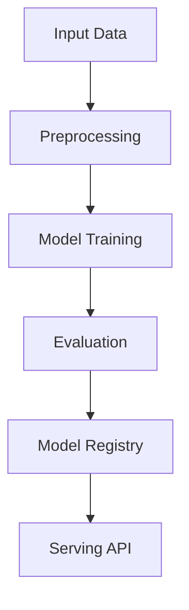

# pre-training-fine-tuning

## ∫ Mathematics & Theory

Pre-training and Fine-Tuning — Underlying equations and derivations

$$\mathcal{L}_{MLM} = -\sum_{i \in M} \log P(x_i | x_{\setminus M})$$

$$\mathcal{L}_{NSP} = \log P(\text{IsNext} | [CLS])$$

$$\mathcal{L}_{total} = \mathcal{L}_{MLM} + \mathcal{L}_{NSP}$$

### Step-by-Step Derivation

Pre-training learns general representations from large unlabeled corpora. Masked Language Modeling (MLM) predicts randomly masked tokens. Next Sentence Prediction (NSP) learns inter-sentence coherence. Fine-tuning adapts pre-trained weights to downstream tasks with minimal labeled data.

### Interactive Visualization

Interactive MLM token prediction explorer; attention head visualization; layer-wise transfer analysis.

## ⚙ Architecture

Model structure, data flow, and layer breakdown

### Class Hierarchy

```
  MultiHeadAttention
  FeedForward
  AddNorm
  LoRAAdapter
  MLMHead
  NTPHead
  ClassificationHead
  Transformer
```

### Data Flow



## ⚡ API Reference

FastAPI endpoints and model interfaces

| Method | Endpoint |
| --- | --- |
| `GET` | `/` |
| `GET` | `/health` |
| `GET` | `/metrics` |
| `POST` | `/pretrain` |
| `POST` | `/finetune` |
| `GET` | `/drift` |
| `POST` | `/reload` |

## ▶ Usage

Code examples and CLI commands

### Training Script

```python
"""Training pipeline for Pre-training and Fine-tuning."""

import argparse
import os
from pathlib import Path

from ai_core.logging import get_logger, setup_logging
from ai_core.model_registry import ModelRegistry

from pre_training_fine_tuning.data import (
    VOCAB_SIZE,
    generate_mlm_data,
    generate_ntp_data,
    generate_synthetic_data,
    save_training_data,
    train_test_split,
)
from pre_training_fine_tuning.model import Transformer

logger = get_logger(__name__)

def train(
    model_dir: Path,
    data_path: Path | None = None,
    n_samples: int = 500,
    d_model: int = 128,
    n_heads: int = 4,
    n_encoder_layers: int = 2,
    n_decoder_layers: int = 2,
    d_ff: int = 512,
    max_seq_len: int = 32,
    learning_rate: float = 0.001,
    n_iterations: int = 100,
    weight_decay: float = 0.01,
    model_version: str = "1.0.0",
    register_to_mlflow: bool = False,
    test_size: float = 0.2,
    random_seed: int = 42,
    phase: str = "pretrain",
    objective: str = "ntp",
    strategy: str = "full",
) -> dict:
    """Train model for pre-training or fine-tuning.

    Args:
        phase: "pretrain" or "finetune"
        objective: "mlm" or "ntp" (for pre-training)
        strategy: "full", "feature_extraction", "partial", "peft" (for fine-tuning)
    """
    if phase == "pretrain":
        if objective == "mlm":
            X, y, mask_positions = generate_mlm_data(n_samples=n_samples, vocab_size=VOCAB_SIZE, random_seed=random_seed)
            X_train, X_test, y_train, y_test = train_test_split(X, y, test_size=test_size, random_seed=random_seed)
            logger.info("Generated MLM pre-training data", n_samples=n_samples, mask_prob=0.15)
        else:
            X, y = generate_ntp_data(n_samples=n_samples, vocab_size=VOCAB_SIZE, random_seed=random_seed)
            X_train, X_test, y_train, y_test = train_test_split(X, y, test_size=test_size, random_seed=random_seed)
            mask_positions = None
            logger.info("Generated NTP pre-training data", n_samples=n_samples)
    else:
        X, y = generate_synthetic_data(n_samples=n_samples, vocab_size=VOCAB_SIZE, random_seed=random_seed, phase="finetune")
        X_train, X_test, y_train, y_test = train_test_split(X, y, test_size=test_size, random_seed=random_seed)
        mask_positions = None
        logger.info("Generated fine-tuning data", n_samples=n_samples, strategy=strategy)

    model_dir.mkdir(parents=True, exist_ok=True)
    save_training_data(X, y, model_dir / "training_data.npz")

    model = Transformer(
        vocab_size=VOCAB_SIZE,
        d_model=d_model,
        n_heads=n_heads,
        n_encoder_layers=n_encoder_layers,
        n_decoder_layers=n_decoder_layers,
        d_ff=d_ff,
        max_seq_len=max_seq_len,
        learning_rate=learning_rate,
        n_iterations=n_iterations,
        weight_decay=weight_decay,
        random_seed=random_seed,
    )

    model.fit(
        X_train,
        y_train,
        phase=phase,
        objective=objective,
        strategy=strategy,
        n_iterations=n_iterations,
        learning_rate=learning_rate,
        mask_positions=mask_positions if phase == "pretrain" and objective == "mlm" else None,
    )

    test_metrics = model.evaluate(X_test, y_test, phase=phase)
    logger.info("Training complete", training_mode=model.training_mode, final_loss=model.loss_history[-1])

    model_path = model_dir / f"model_v{model_version}.npz"
    model.save(str(model_path))

    metrics = {
        **test_metrics,
        "training_mode": phase,
        "objective": objective if phase == "pretrain" else "finetune",
        "strategy": strategy if phase == "finetune" else "none",
        "n_epochs_run": float(len(model.loss_history)),
        "final_loss": model.loss_history[-1] if model.loss_history else 0.0,
        "n_train_samples": float(len(X_train)),
        "n_test_samples": float(len(X_test)),
        "vocab_size": float(VOCAB_SIZE),
        "d_model": float(d_model),
        "n_heads": float(n_heads),
        "n_encoder_layers": float(n_encoder_layers),
        "n_decoder_layers": float(n_decoder_layers),
    }

    registry = ModelRegistry(base_dir=model_dir)
    registry.save_model(
        model_name="pre-training-fine-tuning",
        model_version=model_version,
        model_type="transformer",
        metrics=metrics,
        parameters={
            "vocab_size": VOCAB_SIZE,
            "d_model": d_model,
            "n_heads": n_heads,
            "n_encoder_layers": n_encoder_layers,
            "n_decoder_layers": n_decoder_layers,
            "d_ff": d_ff,
            "max_seq_len": max_seq_len,
            "learning_rate": learning_rate,
            "n_iterations": n_iterations,
            "weight_decay": weight_decay,
            "random_seed": random_seed,
            "phase": phase,
            "objective": objective,
            "strategy": strategy,
        },
        artifacts={
            f"model_v{model_version}.npz": model_path,
            "training_data.npz": model_dir / "training_data.npz",
        },
        tags={"framework": "numpy", "task": "pre_training_fine_tuning", "model_type": "Transformer", "phase": phase},
    )

    if register_to_mlflow:
        registry.log_to_mlflow(
            model_name="pre-training-fine-tuning",
            model_version=model_version,
            metrics=metrics,
            params={"vocab_size": VOCAB_SIZE, "d_model": d_model, "n_heads": n_heads, "n_iterations": n_iterations},
            artifacts={"model": str(model_path)},
            tags={"model_type": "transformer", "framework": "numpy", "phase": phase},
        )

    return metrics

def main():
    parser = argparse.ArgumentParser(description="Train Pre-training and Fine-tuning Transformer")
    parser.add_argument("--model-dir", type=Path, default=Path(os.getenv("MODEL_DIR", "/models")))
    parser.add_argument("--data-path", type=Path, default=None)
    parser.add_argument("--n-samples", type=int, default=int(os.getenv("N_SAMPLES", "500")))
    parser.add_argument("--d-model", type=int, default=int(os.getenv("D_MODEL", "128")))
    parser.add_argument("--n-heads", type=int, default=int(os.getenv("N_HEADS", "4")))
    parser.add_argument("--n-encoder-layers", type=int, default=int(os.getenv("N_ENCODER_LAYERS", "2")))
    parser.add_argument("--n-decoder-layers", type=int, default=int(os.getenv("N_DECODER_LAYERS", "2")))
    parser.add_argument("--d-ff", type=int, default=int(os.getenv("D_FF", "512")))
    parser.add_argument("--max-seq-len", type=int, default=int(os.getenv("MAX_SEQ_LEN", "32")))
    parser.add_argument("--learning-rate", type=float, default=float(os.getenv("LEARNING_RATE", "0.001")))
    parser.add_argument("--n-iterations", type=int, default=int(os.getenv("N_ITERATIONS", "100")))
    parser.add_argument("--weight-decay", type=float, default=float(os.getenv("WEIGHT_DECAY", "0.01")))
    parser.add_argument("--model-version", type=str, default=os.getenv("MODEL_VERSION", "1.0.0"))
    parser.add_argument("--test-size", type=float, default=float(os.getenv("TEST_SIZE", "0.2")))
    parser.add_argument("--random-seed", type=int, default=int(os.getenv("RANDOM_SEED", "42")))
    parser.add_argument("--phase", type=str, default=os.getenv("PHASE", "pretrain"), choices=["pretrain", "finetune"])
    parser.add_argument("--objective", type=str, default=os.getenv("OBJECTIVE", "ntp"), choices=["mlm", "ntp"])
    parser.add_argument("--strategy", type=str, default=os.getenv("STRATEGY", "full"), choices=["full", "feature_extraction", "partial", "peft"])
    parser.add_argument("--register-mlflow", action="store_true", default=os.getenv("REGISTER_MLFLOW", "false").lower() == "true")
    parser.add_argument("--log-level", type=str, default=os.getenv("LOG_LEVEL", "INFO"))
    args = parser.parse_args()

    setup_logging(args.log_level)
    args.model_dir.mkdir(parents=True, exist_ok=True)

    metrics = train(
        model_dir=args.model_dir,
        data_path=args.data_path,
        n_samples=args.n_samples,
        d_model=args.d_model,
        n_heads=args.n_heads,
        n_encoder_layers=args.n_encoder_layers,
        n_decoder_layers=args.n_decoder_layers,
        d_ff=args.d_ff,
        max_seq_len=args.max_seq_len,
        learning_rate=args.learning_rate,
        n_iterations=args.n_iterations,
        weight_decay=args.weight_decay,
        model_version=args.model_version,
        register_to_mlflow=args.register_mlflow,
        test_size=args.test_size,
        random_seed=args.random_seed,
        phase=args.phase,
        objective=args.objective,
        strategy=args.strategy,
    )
    logger.info("Training finished", metrics=metrics, model_dir=str(args.model_dir))

if __name__ == "__main__":
    main()
```

### API Server

```python
"""Serving API for Pre-training and Fine-tuning."""

import os
import time
from contextlib import asynccontextmanager
from pathlib import Path

import numpy as np
from ai_core.drift import DriftDetector
from ai_core.fastapi_middleware import add_observability_middleware
from ai_core.logging import get_logger, setup_logging
from ai_core.metrics import MetricsCollector
from ai_core.model_registry import ModelRegistry
from fastapi import FastAPI, HTTPException, Response
from pydantic import BaseModel, Field

from pre_training_fine_tuning.data import VOCAB_SIZE, generate_synthetic_data
from pre_training_fine_tuning.model import Transformer, softmax

logger = get_logger(__name__)

MODEL_DIR = Path(os.getenv("MODEL_DIR", "/models"))
MODEL_VERSION = os.getenv("MODEL_VERSION", "latest")
METRICS_PORT = int(os.getenv("PRETRAIN_METRICS_PORT", "8012"))
DRIFT_THRESHOLD = float(os.getenv("DRIFT_THRESHOLD", "0.2"))

class PretrainRequest(BaseModel):
    tokens: list[int] = Field(..., min_length=1, max_length=64)
    objective: str = Field(default="ntp", pattern="^(mlm|ntp)$")
    mask_positions: list[int] | None = Field(default=None)

class FinetuneRequest(BaseModel):
    tokens: list[int] = Field(..., min_length=1, max_length=64)
    label: int = Field(..., ge=0, le=9)
    strategy: str = Field(default="partial", pattern="^(full|feature_extraction|partial|peft)$")
    learning_rate: float = Field(default=0.0001, gt=0)
    n_iterations: int = Field(default=50, ge=1, le=500)

class PredictRequest(BaseModel):
    tokens: list[int] = Field(..., min_length=1, max_length=64)
    max_len: int = Field(default=10, ge=1, le=32)
    phase: str = Field(default="pretrain", pattern="^(pretrain|finetune)$")

class PredictResponse(BaseModel):
    generated_tokens: list[int]
    predicted_class: int | None = None
    confidence: float | None = None
    model_version: str
    training_mode: str
    objective: str | None = None
    strategy: str | None = None

class StatsResponse(BaseModel):
    vocab_size: int
    d_model: int
    n_heads: int
    n_encoder_layers: int
    n_decoder_layers: int
    d_ff: int
    training_mode: str
    pretraining_objective: str
    fine_tuning_strategy: str
    n_epochs_run: int
    final_loss: float
    model_version: str

_model: Transformer | None = None
_model_version: str = "unknown"
_metrics: MetricsCollector | None = None
_drift_detector: DriftDetector | None = None
_reference_data: np.ndarray | None = None
_recent_predictions: list[list[float]] = []

@asynccontextmanager
async def lifespan(app: FastAPI):
    global _model, _model_version, _metrics, _drift_detector, _reference_data

    setup_logging(os.getenv("LOG_LEVEL", "INFO"))
    _metrics = MetricsCollector("pre_training_fine_tuning", port=METRICS_PORT)
    app.state.metrics = _metrics

    feature_names = [f"token_{i}" for i in range(VOCAB_SIZE)]
    _drift_detector = DriftDetector(
        feature_names=feature_names,
        feature_types={f: "float" for f in feature_names},
        psi_threshold=DRIFT_THRESHOLD,
    )

    _model, _model_version = _load_model()
    _metrics.set_model_version(_model_version)
    _metrics.set_model_info(
        model_name="pre-training-fine-tuning",
        model_version=_model_version,
        model_type="transformer",
    )

    _reference_data = _load_reference_data()
    logger.info("Model loaded", model="pre-training-fine-tuning", version=_model_version, mode=_model.training_mode)

    yield
    logger.info("Shutting down pre-training-fine-tuning API")

def _load_model() -> tuple[Transformer, str]:
    registry = ModelRegistry(base_dir=MODEL_DIR)
    try:
        if MODEL_VERSION == "latest":
            models = registry.list_models()
            pt_models = [m for m in models if m.get("model_name") == "pre-training-fine-tuning"]
            if pt_models:
                pt_models.sort(key=lambda m: m["model_version"], reverse=True)
                latest = pt_models[0]
                model_dir = Path(latest["artifact_path"])
                npz_files = list(model_dir.glob("model_v*.npz")) + list(model_dir.glob("*.npz"))
                if npz_files:
                    return Transformer.load(str(npz_files[0])), latest["model_version"]
        else:
            model_dir = MODEL_DIR / "pre-training-fine-tuning" / MODEL_VERSION
            if model_dir.exists():
                npz_files = list(model_dir.glob("model_v*.npz")) + list(model_dir.glob("*.npz"))
                if npz_files:
                    return Transformer.load(str(npz_files[0])), MODEL_VERSION
    except Exception as e:
        logger.warning(f"Registry lookup failed: {e}")

    npz_path = MODEL_DIR / "model.npz"
    if npz_path.exists():
        return Transformer.load(str(npz_path)), "legacy"

    candidate_paths = [
        Path("/app/artifacts/models/model_v1.0.0.npz"),
        Path(__file__).resolve().parents[3] / "artifacts" / "models" / "model_v1.0.0.npz",
    ]
    for p in candidate_paths:
        if p.exists():
            logger.info("Loading bundled baseline model", path=str(p))
            return Transformer.load(str(p)), "1.0.0-bundled"

    logger.warning("No pre-existing model found. Initializing baseline model.")
    X_base, y_base = generate_synthetic_data(n_samples=100, vocab_size=VOCAB_SIZE, random_seed=42, phase="pretrain")
    model = Transformer(
        vocab_size=VOCAB_SIZE,
        d_model=64,
        n_heads=4,
        n_encoder_layers=1,
        n_decoder_layers=1,
        d_ff=256,
        learning_rate=0.001,
        n_iterations=50,
        random_seed=42,
    )
    model.fit(X_base, y_base, phase="pretrain", objective="ntp")
    return model, "1.0.0-baseline"

def _load_reference_data() -> np.ndarray | None:
    X_base, _ = generate_synthetic_data(n_samples=100, vocab_size=VOCAB_SIZE, random_seed=42, phase="pretrain")
    return X_base.astype(float)

app = FastAPI(
    title="Pre-training and Fine-tuning API",
    description="Pre-training (MLM, NTP) and fine-tuning (full, feature extraction, partial, PEFT) for deep learning models",
    version="1.0.0",
    lifespan=lifespan,
)

add_observability_middleware(app)

@app.get("/")
def read_root():
    return {
        "service": "pre_training_fine_tuning-api",
        "version": "1.0.0",
        "model_version": _model_version,
        "training_mode": _model.training_mode if _model else "unknown",
        "endpoints": {
            "health": "/health",
            "pretrain": "POST /pretrain",
            "finetune": "POST /finetune",
            "predict": "POST /predict",
            "stats": "GET /stats",
            "drift": "GET /drift",
            "metrics": "/metrics",
        },
    }

@app.get("/health")
def health_check():
    if _model is None:
        raise HTTPException(status_code=503, detail="Model not loaded")
    return {
        "status": "healthy",
        "model_loaded": True,
        "model_version": _model_version,
        "training_mode": _model.training_mode if _model else "unknown",
    }

@app.get("/metrics")
def metrics():
    from prometheus_client import CONTENT_TYPE_LATEST, generate_latest
    return Response(content=generate_latest(), media_type=CONTENT_TYPE_LATEST)

@app.post("/pretrain")
def pretrain(body: PretrainRequest):
    """Run pre-training step (simulated inference) with MLM or NTP objective."""
    if _model is None or _metrics is None:
        raise HTTPException(status_code=503, detail="Model not loaded")

    X = np.array(body.tokens).reshape(1, -1)
    start = time.time()

    try:
        if body.objective == "mlm":
            from pre_training_fine_tuning.data import generate_mlm_data
            _, y_orig, _ = generate_mlm_data(n_samples=1, vocab_size=VOCAB_SIZE, random_seed=42)
            y_orig = y_orig[:1]
            _model.pretraining_objective = "mlm"
            logits = _model.mlm_head.forward(_model._embed(X))
            predicted = np.argmax(softmax(logits[0]), axis=-1).tolist()
        else:
            _model.pretraining_objective = "ntp"
            generated = _model.predict(X, max_len=min(10, X.shape[1] if X.ndim > 1 else 10), phase="pretrain")
            predicted = generated.tolist()

        duration = time.time() - start
        _metrics.record_prediction(model_version=_model_version, duration=duration)

        _recent_predictions.append([float(t) for t in body.tokens])
        if len(_recent_predictions) > 1000:
            _recent_predictions.pop(0)

        return {
            "predicted_tokens": predicted,
            "objective": body.objective,
            "model_version": _model_version,
            "training_mode": _model.training_mode,
        }
    except Exception as e:
        _metrics.record_error(model_version=_model_version, error_type="pretrain")
        logger.exception("Pre-training inference failed", error=str(e))
        raise HTTPException(status_code=500, detail="Pre-training inference failed") from e

@app.post("/finetune")
def finetune(body: FinetuneRequest):
    """Fine-tune model on a single sample (simulated)."""
    if _model is None or _metrics is None:
        raise HTTPException(status_code=503, detail="Model not loaded")

    X = np.array(body.tokens).reshape(1, -1)
    y = np.array([body.label])

    start = time.time()
    try:
        _model.fit(
            X,
            y,
            phase="finetune",
            strategy=body.strategy,
            n_iterations=body.n_iterations,
            learning_rate=body.learning_rate,
        )

        preds = _model.predict(X, phase="finetune")
        predicted_class = int(preds[0]) if len(preds) > 0 else 0

        duration = time.time() - start
        _metrics.record_prediction(model_version=_model_version, duration=duration)

        return {
            "predicted_class": predicted_class,
            "true_label": body.label,
            "strategy": body.strategy,
            "model_version": _model_version,
            "training_mode": _model.training_mode,
            "final_loss": _model.loss_history[-1] if _model.loss_history else 0.0,
        }
    except Exception as e:
        _metrics.record_error(model_version=_model_version, error_type="finetune")
        logger.exception("Fine-tuning failed", error=str(e))
        raise HTTPException(status_code=500, detail="Fine-tuning failed") from e

@app.post("/predict", response_model=PredictResponse)
def predict(body: PredictRequest):
    """Generate predictions using pre-trained or fine-tuned model."""
    if _model is None or _metrics is None:
        raise HTTPException(status_code=503, detail="Model not loaded")

    X = np.array(body.tokens).reshape(1, -1)
    start = time.time()

    try:
        if body.phase == "finetune":
            preds = _model.predict(X, phase="finetune")
            predicted_class = int(preds[0]) if len(preds) > 0 else 0
            logits = _model.classification_head.forward(np.mean(_model._embed(X), axis=1))
            probs = softmax(logits[0])
            confidence = float(probs[predicted_class]) if predicted_class < len(probs) else 0.0

            response = PredictResponse(
                generated_tokens=[],
                predicted_class=predicted_class,
                confidence=round(confidence, 4),
                model_version=_model_version,
                training_mode=_model.training_mode,
                strategy=_model.fine_tuning_strategy,
            )
        else:
            generated = _model.predict(X, max_len=body.max_len, phase="pretrain")
            logits = _model._embed(X) @ _model.W_out.T
            probs = softmax(logits.flatten())
            predicted_token = int(generated[0]) if len(generated) > 0 else 0
            confidence = float(probs[predicted_token]) if predicted_token < len(probs) else 0.0

            response = PredictResponse(
                generated_tokens=generated.tolist(),
                predicted_class=None,
                confidence=round(confidence, 4),
                model_version=_model_version,
                training_mode=_model.training_mode,
                objective=_model.pretraining_objective,
            )

        duration = time.time() - start
        _metrics.record_prediction(model_version=_model_version, duration=duration)

        _recent_predictions.append([float(t) for t in body.tokens])
        if len(_recent_predictions) > 1000:
            _recent_predictions.pop(0)

        return response
    except Exception as e:
        _metrics.record_error(model_version=_model_version, error_type="prediction")
        logger.exception("Prediction failed", error=str(e))
        raise HTTPException(status_code=500, detail="Prediction failed") from e

@app.get("/drift")
def drift_check():
    if _drift_detector is None or _reference_data is None:
        raise HTTPException(status_code=503, detail="Drift detection not available")
    if len(_recent_predictions) < 10:
        return {"total_features": VOCAB_SIZE, "drifted_features": 0, "drift_ratio": 0.0, "drifted": [], "all_results": []}
    current = np.array(_recent_predictions[-100:])
    results = _drift_detector.detect_drift(_reference_data, current)
    summary = _drift_detector.summarize(results)
    if _metrics:
        _metrics.set_drift_ratio(summary["drift_ratio"])
    return summary

@app.get("/stats", response_model=StatsResponse)
def get_stats():
    if _model is None or not _model.encoder_layers:
        raise HTTPException(status_code=503, detail="Model not loaded")
    info = _model.to_dict()
    return StatsResponse(
        vocab_size=info["vocab_size"],
        d_model=info["d_model"],
        n_heads=info["n_heads"],
        n_encoder_layers=info["n_encoder_layers"],
        n_decoder_layers=info["n_decoder_layers"],
        d_ff=info["d_ff"],
        training_mode=info["training_mode"],
        pretraining_objective=info["pretraining_objective"],
        fine_tuning_strategy=info["fine_tuning_strategy"],
        n_epochs_run=info["n_epochs_run"],
        final_loss=info["final_loss"],
        model_version=_model_version,
    )

@app.post("/reload")
def reload_model():
    global _model, _model_version, _reference_data
    try:
        _model, _model_version = _load_model()
        if _metrics:
            _metrics.set_model_version(_model_version)
            _metrics.set_model_info(
                model_name="pre-training-fine-tuning",
                model_version=_model_version,
                model_type="transformer",
            )
        _reference_data = _load_reference_data()
        logger.info("Model reloaded", model="pre-training-fine-tuning", version=_model_version)
        return {"status": "reloaded", "model_version": _model_version, "training_mode": _model.training_mode}
    except Exception as e:
        logger.exception("Model reload failed", error=str(e))
        raise HTTPException(status_code=500, detail=f"Reload failed: {e}") from e
```

### CLI Commands

```bash
uv run python -m pre_training_fine_tuning.train --model-dir ./artifacts/models
```

## 📊 Benchmarks

Test results and performance metrics

Run `pytest tests/test_models.py` and `pytest tests/test_apis.py` for detailed metrics.

Generated documentation for **pre-training-fine-tuning**
