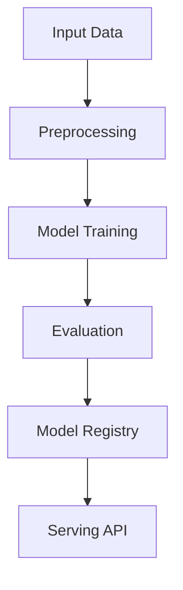

# transfer-learning

## ∫ Mathematics & Theory

Transfer Learning — Underlying equations and derivations

$$\mathcal{L} = \mathcal{L}_{task} + \lambda \mathcal{L}_{distill}$$

$$\mathcal{L}_{distill} = \text{KL}(p_{\text{teacher}} \| p_{\text{student}})$$

$$p_i = \frac{\exp(z_i / T)}{\sum_j \exp(z_j / T)}$$

### Step-by-Step Derivation

Transfer learning reuses features from a source domain for a target task. Fine-tuning updates only the final layers to adapt to new data. Knowledge distillation transfers dark knowledge from a large teacher to a compact student via softened probabilities.

### Interactive Visualization

Interactive feature reuse heatmap; layer freezing/unfreezing timeline; teacher vs student probability comparison.

## ⚙ Architecture

Model structure, data flow, and layer breakdown

### Class Hierarchy

```
  DenseLayer
  MultiHeadAttention
  AddNorm
  FeedForward
  TransformerBlock
  BaseModel
  TransferClassifier
  TransferLearningModel
```

### Data Flow



## ⚡ API Reference

FastAPI endpoints and model interfaces

| Method | Endpoint |
| --- | --- |
| `GET` | `/` |
| `GET` | `/health` |
| `GET` | `/metrics` |
| `POST` | `/reload` |

## ▶ Usage

Code examples and CLI commands

### Training Script

```python
"""Training pipeline for Transfer Learning."""

import argparse
import os
from pathlib import Path

from ai_core.logging import get_logger, setup_logging
from ai_core.model_registry import ModelRegistry
from ai_core.validation import DataValidator, create_transfer_learning_schema

from transfer_learning.data import (
    generate_synthetic_data,
    load_dataset,
    save_dataset,
    train_test_split,
)
from transfer_learning.model import TransferLearningModel

logger = get_logger(__name__)

def train(
    model_dir: Path,
    data_path: Path | None = None,
    n_samples: int = 500,
    vocab_size: int = 1000,
    seq_len: int = 32,
    d_model: int = 128,
    n_heads: int = 4,
    n_base_layers: int = 2,
    d_ff: int = 512,
    max_seq_len: int = 32,
    n_classes: int = 10,
    freeze_base: bool = True,
    fine_tune_layers: int = 0,
    learning_rate: float = 0.001,
    fine_tune_lr: float = 0.0001,
    n_iterations: int = 100,
    weight_decay: float = 0.01,
    model_version: str = "1.0.0",
    fine_tune_at: int | None = None,
    random_seed: int = 42,
    register_to_mlflow: bool = False,
) -> dict:
    logger.info("Loading data", n_samples=n_samples)
    if data_path and Path(data_path).exists():
        X, y = load_dataset(data_path)
    else:
        X, y = generate_synthetic_data(n_samples=n_samples, vocab_size=vocab_size, seq_len=seq_len, n_classes=n_classes, random_seed=random_seed)

    validator = DataValidator(create_transfer_learning_schema())
    validation = validator.validate(X.reshape(-1, X.shape[-1]))
    if not validation.valid:
        logger.error("Data validation failed", errors=validation.errors)
        raise ValueError(f"Data validation failed: {validation.errors}")

    X_train, X_test, y_train, y_test = train_test_split(X, y, test_size=0.2, random_seed=random_seed)
    logger.info("Data split", n_train=len(X_train), n_test=len(X_test))

    model_dir.mkdir(parents=True, exist_ok=True)
    save_dataset(X, y, model_dir / "training_data.npz")

    model = TransferLearningModel(
        vocab_size=vocab_size,
        d_model=d_model,
        n_heads=n_heads,
        n_base_layers=n_base_layers,
        d_ff=d_ff,
        max_seq_len=max_seq_len,
        n_classes=n_classes,
        freeze_base=freeze_base,
        fine_tune_layers=fine_tune_layers,
        learning_rate=learning_rate,
        fine_tune_lr=fine_tune_lr,
        weight_decay=weight_decay,
        random_seed=random_seed,
    )

    logger.info("Starting transfer learning training", freeze_base=freeze_base, fine_tune_layers=fine_tune_layers)
    model.fit(X_train, y_train, n_iterations=n_iterations, fine_tune_at=fine_tune_at)

    test_metrics = model.evaluate(X_test, y_test)
    logger.info("Training complete", final_loss=model.loss_history[-1], test_accuracy=test_metrics["accuracy"])

    model_path = model_dir / f"transfer_learning_v{model_version}.npz"
    model.save(str(model_path))

    metrics = {
        **test_metrics,
        "n_epochs_run": float(len(model.loss_history)),
        "final_loss": model.loss_history[-1] if model.loss_history else 0.0,
        "n_train_samples": float(len(X_train)),
        "n_test_samples": float(len(X_test)),
        "vocab_size": float(vocab_size),
        "d_model": float(d_model),
        "n_base_layers": float(n_base_layers),
        "d_ff": float(d_ff),
        "n_classes": float(n_classes),
        "freeze_base": 1.0 if freeze_base else 0.0,
        "fine_tune_layers": float(fine_tune_layers),
    }

    registry = ModelRegistry(base_dir=model_dir)
    registry.save_model(
        model_name="transfer-learning",
        model_version=model_version,
        model_type="classification",
        metrics=metrics,
        parameters={
            "vocab_size": vocab_size,
            "d_model": d_model,
            "n_heads": n_heads,
            "n_base_layers": n_base_layers,
            "d_ff": d_ff,
            "max_seq_len": max_seq_len,
            "n_classes": n_classes,
            "freeze_base": freeze_base,
            "fine_tune_layers": fine_tune_layers,
            "learning_rate": learning_rate,
            "fine_tune_lr": fine_tune_lr,
            "n_iterations": n_iterations,
            "weight_decay": weight_decay,
            "random_seed": random_seed,
            "fine_tune_at": fine_tune_at,
        },
        artifacts={
            f"transfer_learning_v{model_version}.npz": model_path,
            "training_data.npz": model_dir / "training_data.npz",
        },
        tags={"framework": "numpy", "task": "transfer_learning", "model_type": "TransferLearning"},
    )

    if register_to_mlflow:
        registry.log_to_mlflow(
            model_name="transfer-learning",
            model_version=model_version,
            metrics=metrics,
            params={"vocab_size": vocab_size, "d_model": d_model, "freeze_base": freeze_base, "fine_tune_layers": fine_tune_layers},
            artifacts={"model": str(model_path)},
            tags={"model_type": "transfer_learning", "framework": "numpy"},
        )

    return metrics

def main():
    parser = argparse.ArgumentParser(description="Train Transfer Learning Model")
    parser.add_argument("--model-dir", type=Path, default=Path(os.getenv("MODEL_DIR", "/models")))
    parser.add_argument("--data-path", type=Path, default=None)
    parser.add_argument("--n-samples", type=int, default=int(os.getenv("N_SAMPLES", "500")))
    parser.add_argument("--vocab-size", type=int, default=int(os.getenv("VOCAB_SIZE", str(1000))))
    parser.add_argument("--seq-len", type=int, default=int(os.getenv("SEQ_LEN", "32")))
    parser.add_argument("--d-model", type=int, default=int(os.getenv("D_MODEL", "128")))
    parser.add_argument("--n-heads", type=int, default=int(os.getenv("N_HEADS", "4")))
    parser.add_argument("--n-base-layers", type=int, default=int(os.getenv("N_BASE_LAYERS", "2")))
    parser.add_argument("--d-ff", type=int, default=int(os.getenv("D_FF", "512")))
    parser.add_argument("--max-seq-len", type=int, default=int(os.getenv("MAX_SEQ_LEN", "32")))
    parser.add_argument("--n-classes", type=int, default=int(os.getenv("N_CLASSES", "10")))
    parser.add_argument("--freeze-base", action="store_true", default=os.getenv("FREEZE_BASE", "true").lower() == "true")
    parser.add_argument("--no-freeze-base", dest="freeze_base", action="store_false")
    parser.add_argument("--fine-tune-layers", type=int, default=int(os.getenv("FINE_TUNE_LAYERS", "0")))
    parser.add_argument("--fine-tune-at", type=int, default=None)
    parser.add_argument("--learning-rate", type=float, default=float(os.getenv("LEARNING_RATE", "0.001")))
    parser.add_argument("--fine-tune-lr", type=float, default=float(os.getenv("FINE_TUNE_LR", "0.0001")))
    parser.add_argument("--n-iterations", type=int, default=int(os.getenv("N_ITERATIONS", "100")))
    parser.add_argument("--weight-decay", type=float, default=float(os.getenv("WEIGHT_DECAY", "0.01")))
    parser.add_argument("--model-version", type=str, default=os.getenv("MODEL_VERSION", "1.0.0"))
    parser.add_argument("--random-seed", type=int, default=int(os.getenv("RANDOM_SEED", "42")))
    parser.add_argument("--register-mlflow", action="store_true", default=os.getenv("REGISTER_MLFLOW", "false").lower() == "true")
    parser.add_argument("--log-level", type=str, default=os.getenv("LOG_LEVEL", "INFO"))
    args = parser.parse_args()

    setup_logging(args.log_level)
    args.model_dir.mkdir(parents=True, exist_ok=True)

    metrics = train(
        model_dir=args.model_dir,
        data_path=args.data_path,
        n_samples=args.n_samples,
        vocab_size=args.vocab_size,
        seq_len=args.seq_len,
        d_model=args.d_model,
        n_heads=args.n_heads,
        n_base_layers=args.n_base_layers,
        d_ff=args.d_ff,
        max_seq_len=args.max_seq_len,
        n_classes=args.n_classes,
        freeze_base=args.freeze_base,
        fine_tune_layers=args.fine_tune_layers,
        learning_rate=args.learning_rate,
        fine_tune_lr=args.fine_tune_lr,
        n_iterations=args.n_iterations,
        weight_decay=args.weight_decay,
        model_version=args.model_version,
        fine_tune_at=args.fine_tune_at,
        random_seed=args.random_seed,
        register_to_mlflow=args.register_mlflow,
    )
    logger.info("Training finished", metrics=metrics, model_dir=str(args.model_dir))

if __name__ == "__main__":
    main()
```

### API Server

```python
"""Serving API for Transfer Learning."""

import os
import time
from contextlib import asynccontextmanager
from pathlib import Path

import numpy as np
from ai_core.drift import DriftDetector
from ai_core.fastapi_middleware import add_observability_middleware
from ai_core.logging import get_logger, setup_logging
from ai_core.metrics import MetricsCollector
from ai_core.model_registry import ModelRegistry
from fastapi import FastAPI, HTTPException, Response
from pydantic import BaseModel, Field

from transfer_learning.data import VOCAB_SIZE
from transfer_learning.model import TransferLearningModel

logger = get_logger(__name__)

MODEL_DIR = Path(os.getenv("MODEL_DIR", "/models"))
MODEL_VERSION = os.getenv("MODEL_VERSION", "latest")
METRICS_PORT = int(os.getenv("TRANSFER_LEARNING_METRICS_PORT", "8013"))
DRIFT_THRESHOLD = float(os.getenv("DRIFT_THRESHOLD", "0.2"))

class PredictRequest(BaseModel):
    tokens: list[int] = Field(..., min_length=1, max_length=32)
    max_len: int = Field(default=1, ge=1, le=1)

class PredictResponse(BaseModel):
    predicted_class: int
    confidence: float
    class_probabilities: list[float]
    model_version: str
    base_model_frozen: bool
    fine_tune_layers: int

class DriftResponse(BaseModel):
    total_features: int
    drifted_features: int
    drift_ratio: float
    drifted: list[dict]
    all_results: list[dict]

class StatsResponse(BaseModel):
    vocab_size: int
    d_model: int
    n_base_layers: int
    d_ff: int
    n_classes: int
    freeze_base: bool
    fine_tune_layers: int
    learning_rate: float
    fine_tune_lr: float
    n_epochs_run: int
    final_loss: float
    model_version: str

_model: TransferLearningModel | None = None
_model_version: str = "unknown"
_metrics: MetricsCollector | None = None
_drift_detector: DriftDetector | None = None
_reference_data: np.ndarray | None = None
_recent_predictions: list[list[float]] = []

@asynccontextmanager
async def lifespan(app: FastAPI):
    global _model, _model_version, _metrics, _drift_detector, _reference_data

    setup_logging(os.getenv("LOG_LEVEL", "INFO"))
    _metrics = MetricsCollector("transfer_learning", port=METRICS_PORT)
    app.state.metrics = _metrics

    feature_names = [f"token_{i}" for i in range(VOCAB_SIZE)]
    _drift_detector = DriftDetector(
        feature_names=feature_names,
        feature_types={f: "float" for f in feature_names},
        psi_threshold=DRIFT_THRESHOLD,
    )

    _model, _model_version = _load_model()
    _metrics.set_model_version(_model_version)
    _metrics.set_model_info(
        model_name="transfer-learning",
        model_version=_model_version,
        model_type="classification",
    )

    _reference_data = _load_reference_data()
    logger.info("Model loaded", model="transfer-learning", version=_model_version)

    yield
    logger.info("Shutting down transfer-learning API")

def _load_model() -> tuple[TransferLearningModel, str]:
    registry = ModelRegistry(base_dir=MODEL_DIR)
    try:
        if MODEL_VERSION == "latest":
            models = registry.list_models()
            tl_models = [m for m in models if m.get("model_name") == "transfer-learning"]
            if tl_models:
                tl_models.sort(key=lambda m: m["model_version"], reverse=True)
                latest = tl_models[0]
                model_dir = Path(latest["artifact_path"])
                npz_files = list(model_dir.glob("transfer_learning_v*.npz")) + list(model_dir.glob("*.npz"))
                if npz_files:
                    return TransferLearningModel.load(str(npz_files[0])), latest["model_version"]
        else:
            model_dir = MODEL_DIR / "transfer-learning" / MODEL_VERSION
            if model_dir.exists():
                npz_files = list(model_dir.glob("transfer_learning_v*.npz")) + list(model_dir.glob("*.npz"))
                if npz_files:
                    return TransferLearningModel.load(str(npz_files[0])), MODEL_VERSION
    except Exception as e:
        logger.warning(f"Registry lookup failed: {e}")

    npz_path = MODEL_DIR / "transfer_learning.npz"
    if npz_path.exists():
        return TransferLearningModel.load(str(npz_path)), "legacy"

    candidate_paths = [
        Path("/app/artifacts/models/transfer_learning_v1.0.0.npz"),
        Path(__file__).resolve().parents[3] / "artifacts" / "models" / "transfer_learning_v1.0.0.npz",
    ]
    for p in candidate_paths:
        if p.exists():
            logger.info("Loading bundled baseline model", path=str(p))
            return TransferLearningModel.load(str(p)), "1.0.0-bundled"

    logger.warning("No pre-existing model found. Initializing baseline model.")
    from transfer_learning.data import generate_synthetic_data
    X_base, y_base = generate_synthetic_data(n_samples=100, random_seed=42)
    model = TransferLearningModel(
        vocab_size=100,
        d_model=64,
        n_heads=4,
        n_base_layers=1,
        d_ff=256,
        max_seq_len=32,
        n_classes=10,
        freeze_base=True,
        fine_tune_layers=0,
        learning_rate=0.001,
        fine_tune_lr=0.0001,
        n_iterations=10,
        random_seed=42,
    )
    model.fit(X_base, y_base, n_iterations=10)
    return model, "1.0.0-baseline"

def _load_reference_data() -> np.ndarray | None:
    from transfer_learning.data import generate_synthetic_data
    X_base, _ = generate_synthetic_data(n_samples=100, random_seed=42)
    return X_base.astype(float)

app = FastAPI(
    title="Transfer Learning API",
    description="Transfer Learning model with frozen base model and trainable classification head, supporting fine-tuning of top layers",
    version="1.0.0",
    lifespan=lifespan,
)

add_observability_middleware(app)

@app.get("/")
def read_root():
    return {
        "service": "transfer_learning-api",
        "version": "1.0.0",
        "model_version": _model_version,
        "base_model_frozen": _model.base_model.frozen if _model and _model.base_model else True,
        "fine_tune_layers": _model.fine_tune_layers if _model else 0,
        "endpoints": {
            "health": "/health",
            "predict": "POST /predict",
            "stats": "GET /stats",
            "drift": "GET /drift",
            "metrics": "/metrics",
        },
    }

@app.get("/health")
def health_check():
    if _model is None:
        raise HTTPException(status_code=503, detail="Model not loaded")
    return {
        "status": "healthy",
        "model_loaded": True,
        "model_version": _model_version,
        "base_model_frozen": _model.base_model.frozen if _model and _model.base_model else True,
    }

@app.get("/metrics")
def metrics():
    from prometheus_client import CONTENT_TYPE_LATEST, generate_latest
    return Response(content=generate_latest(), media_type=CONTENT_TYPE_LATEST)

@app.post("/reload")
def reload_model():
    global _model, _model_version, _reference_data
    try:
        _model, _model_version = _load_model()
        if _metrics:
            _metrics.set_model_version(_model_version)
            _metrics.set_model_info(
                model_name="transfer-learning",
                model_version=_model_version,
                model_type="classification",
            )
        _reference_data = _load_reference_data()
        logger.info("Model reloaded", model="transfer-learning", version=_model_version)
        return {"status": "reloaded", "model_version": _model_version}
    except Exception as e:
        logger.exception("Model reload failed", error=str(e))
        raise HTTPException(status_code=500, detail=f"Reload failed: {e}") from e

@app.get("/drift", response_model=DriftResponse)
def drift_check():
    if _drift_detector is None or _reference_data is None:
        raise HTTPException(status_code=503, detail="Drift detection not available")
    if len(_recent_predictions) < 10:
        return {"total_features": VOCAB_SIZE, "drifted_features": 0, "drift_ratio": 0.0, "drifted": [], "all_results": []}
    current = np.array(_recent_predictions[-100:])
    results = _drift_detector.detect_drift(_reference_data, current)
    summary = _drift_detector.summarize(results)
    if _metrics:
        _metrics.set_drift_ratio(summary["drift_ratio"])
    return summary

@app.get("/stats", response_model=StatsResponse)
def get_stats():
    if _model is None or _model.base_model is None:
        raise HTTPException(status_code=503, detail="Model not loaded")
    info = _model.to_dict()
    return StatsResponse(
        vocab_size=info["vocab_size"],
        d_model=info["d_model"],
        n_base_layers=info["n_base_layers"],
        d_ff=info["d_ff"],
        n_classes=info["n_classes"],
        freeze_base=bool(info["freeze_base"]),
        fine_tune_layers=info["fine_tune_layers"],
        learning_rate=info["learning_rate"],
        fine_tune_lr=info["fine_tune_lr"],
        n_epochs_run=info["n_epochs_run"],
        final_loss=info["final_loss"],
        model_version=_model_version,
    )

@app.post("/predict", response_model=PredictResponse)
def predict(body: PredictRequest):
    """Predict class using transfer learning model with frozen base and trainable head."""
    if _model is None or _metrics is None:
        raise HTTPException(status_code=503, detail="Model not loaded")

    X = np.array(body.tokens).reshape(1, -1)

    start = time.time()
    try:
        probs = _model.predict_proba(X)
        predicted_class = int(np.argmax(probs[0]))
        confidence = float(probs[0][predicted_class])

        response = PredictResponse(
            predicted_class=predicted_class,
            confidence=round(confidence, 4),
            class_probabilities=probs[0].tolist(),
            model_version=_model_version,
            base_model_frozen=_model.base_model.frozen if _model.base_model else True,
            fine_tune_layers=_model.fine_tune_layers,
        )
        duration = time.time() - start
        _metrics.record_prediction(model_version=_model_version, duration=duration)

        _recent_predictions.append([float(t) for t in body.tokens])
        if len(_recent_predictions) > 1000:
            _recent_predictions.pop(0)

        return response
    except Exception as e:
        _metrics.record_error(model_version=_model_version, error_type="prediction")
        logger.exception("Prediction failed", error=str(e))
        raise HTTPException(status_code=500, detail="Prediction failed") from e
```

### CLI Commands

```bash
uv run python -m transfer_learning.train --model-dir ./artifacts/models
```

## 📊 Benchmarks

Test results and performance metrics

Run `pytest tests/test_models.py` and `pytest tests/test_apis.py` for detailed metrics.

Generated documentation for **transfer-learning**
