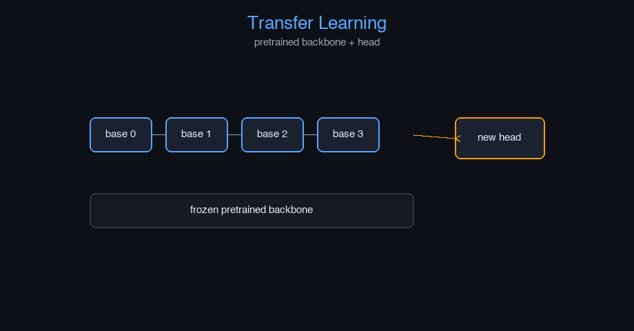

# transfer-learning


Transfer Learning — AI engineering example · part of the MLOps monorepo

## 1. Mathematical Foundations

This example is grounded in **Transfer Learning**. The equations below
drive every forward and backward pass in the implementation.

$$\mathcal{L} = \mathcal{L}_{task} + \lambda \mathcal{L}_{distill}$$

$$\mathcal{L}_{distill} = \text{KL}(p_{\text{teacher}} \| p_{\text{student}})$$

$$p_i = \frac{\exp(z_i / T)}{\sum_j \exp(z_j / T)}$$

### Derivation

Transfer learning reuses features from a source domain for a target task. Fine-tuning updates only the final layers to adapt to new data. Knowledge distillation transfers dark knowledge from a large teacher to a compact student via softened probabilities.

### Worked Numerical Example

$$z = w \cdot x + b$$

Illustrative forward-pass evaluation (scalar example):

Input  x        = 12.0   (e.g. pizza diameter, inches)
Weights w       =  0.85
Bias    b       =  0.30
---------------------------------
z = w*x + b
  = 0.85 * 12.0 + 0.30
  = 10.20 + 0.30
  = 10.50   <- model output

### Conceptual Diagram

        Core transformation flow
   [ Input x ] --> ( w · x + b ) --> [ Output z ]
                       |
                  [ activation ]
                       |
                  [ prediction ]



Interactive feature reuse heatmap; layer freezing/unfreezing timeline; teacher vs student probability comparison.

## 2. Core Logic & Architecture

The example follows a consistent **data → train → evaluate → serve**
pipeline. Inputs are loaded and validated, transformed by the core algorithm, scored against
held-out data, and exposed through a REST API.

  Raw dataset→
  load + validate (data.py)→
  fit / transform (model.py)→
  evaluate + persist (train.py)→
  serve (api.py)

### Primary Components

| Class | Public methods | Responsibility |
| --- | --- | --- |
| `PredictRequest` | — |  |
| `PredictResponse` | — |  |
| `DriftResponse` | — |  |
| `StatsResponse` | — |  |
| `DenseLayer` | init_weights, forward, backward, update_params |  |
| `MultiHeadAttention` | __post_init__, init_weights, _split_heads, _combine_heads, forward, backward, update_params |  |
| `AddNorm` | init_params, forward, backward |  |
| `FeedForward` | init_weights, forward, backward, update_params |  |
| `TransformerBlock` | __post_init__, forward |  |
| `BaseModel` | _init, forward, get_features, set_trainable, set_top_layers_trainable, get_trainable_params_count |  |
| `TransferClassifier` | _init, forward, backward, update_params, set_trainable |  |
| `TransferLearningModel` | _init, fit, predict, predict_proba, evaluate, save, load, to_dict |  |

### Data Flow


1. **Load** — `data.py` reads the source dataset and splits train/test.


2. **Validate** — a Pydantic schema guards input shape/dtypes before training.


3. **Fit / Transform** — `model.py` applies the mathematics from Section 1.


4. **Evaluate** — metrics (MSE/RMSE/R², accuracy, etc.) are computed and logged.


5. **Persist** — weights/artifacts are saved and registered in the model registry.


6. **Serve** — `api.py` exposes prediction endpoints with drift detection.

### Design Patterns & Performance

Key design choices in this module: a pure-NumPy implementation (no PyTorch/TensorFlow), schema validation via `ai_core.validation`, structured JSON logging through `ai_core.logging`, Prometheus metrics from `ai_core.metrics`, and MLflow/model-registry persistence via `ai_core.model_registry`. The FastAPI service wraps the trained model with observability middleware from `ai_core.fastapi_middleware`.

## 3. Detailed Code Walkthrough

The most important behaviour is summarised below; full source for each module is collapsible
so the page stays readable while remaining self-contained.

No docstring-annotated key methods.

### Source Files

<details>
<summary>model.py</summary>

```
"""Transfer Learning model implementation from scratch using NumPy.

Architecture:
    1. BaseModel: Pre-trained model with frozen/trainable layers
    2. TransferClassifier: New task-specific head added on top of frozen base
    3. FineTuner: Handles gradual unfreezing of layers for fine-tuning

Core concepts:
    - Frozen Layers: weights kept fixed, preserve general features
    - Trainable Layers: weights updated during training, adapt to new task
    - Transfer Layers: new layers added for the target task
    - Fine-tuning: gradual unfreezing of top layers

Training objective:
    - Cross-entropy loss for classification
    - Layer-wise learning rates for fine-tuning

Args:
    base_model: pre-trained base model
    n_classes: number of output classes for new task
    freeze_base: whether to freeze base model initially
    fine_tune_layers: number of top layers to fine-tune
    learning_rate: learning rate for new layers
    fine_tune_lr: learning rate for fine-tuning base layers
    random_seed: random seed
"""

from dataclasses import dataclass, field

import numpy as np

def softmax(z: np.ndarray, axis: int = -1) -> np.ndarray:
    z_shifted = z - np.max(z, axis=axis, keepdims=True)
    exp_z = np.exp(z_shifted)
    return exp_z / np.sum(exp_z, axis=axis, keepdims=True)

def cross_entropy_loss(probs: np.ndarray, y_true: np.ndarray, eps: float = 1e-12) -> float:
    n = probs.shape[0]
    clipped = np.clip(probs, eps, 1.0)
    if y_true.ndim == 0:
        return -np.log(clipped[int(y_true)])
    return -np.sum(np.log(clipped[np.arange(n), y_true])) / n

def gelu(x: np.ndarray) -> np.ndarray:
    return 0.5 * x * (1.0 + np.tanh(np.sqrt(2.0 / np.pi) * (x + 0.044715 * x ** 3)))

def layer_norm(x: np.ndarray, gamma: np.ndarray, beta: np.ndarray, eps: float = 1e-5) -> np.ndarray:
    mean = np.mean(x, axis=-1, keepdims=True)
    var = np.var(x, axis=-1, keepdims=True)
    return gamma * (x - mean) / np.sqrt(var + eps) + beta

def scaled_dot_product_attention(Q: np.ndarray, K: np.ndarray, V: np.ndarray, mask: np.ndarray | None = None) -> np.ndarray:
    d_k = Q.shape[-1]
    scores = Q @ np.swapaxes(K, -2, -1) / np.sqrt(d_k)
    if mask is not None:
        scores = scores + (mask * -1e9)
    attn = softmax(scores, axis=-1)
    return attn @ V

def positional_encoding(max_len: int, d_model: int) -> np.ndarray:
    pe = np.zeros((max_len, d_model))
    for pos in range(max_len):
        for i in range(d_model):
            angle = pos / (10000 ** (2 * (i // 2) / d_model))
            if i % 2 == 0:
                pe[pos, i] = np.sin(angle)
            else:
                pe[pos, i] = np.cos(angle)
    return pe

@dataclass
class DenseLayer:
    input_dim: int = 128
    output_dim: int = 64
    random_seed: int = 42
    trainable: bool = True

    W: np.ndarray | None = None
    b: np.ndarray | None = None
    dW: np.ndarray | None = None
    db: np.ndarray | None = None
    _cache: dict = field(default_factory=dict, repr=False)

    def init_weights(self) -> None:
        rng = np.random.default_rng(self.random_seed)
        scale = np.sqrt(2.0 / self.input_dim)
        self.W = rng.normal(0, scale, (self.input_dim, self.output_dim))
        self.b = np.zeros(self.output_dim)

    def forward(self, x: np.ndarray) -> np.ndarray:
        if self.W is None:
            self.init_weights()
        out = x @ self.W + self.b
        self._cache = {"x": x, "out": out}
        return out

    def backward(self, dout: np.ndarray) -> np.ndarray:
        c = self._cache
        self.dW = c["x"].T @ dout
        self.db = np.sum(dout, axis=0)
        return dout @ self.W.T

    def update_params(self, lr: float, weight_decay: float = 0.0) -> None:
        if self.W is None or not self.trainable:
            return
        self.W -= lr * (self.dW + weight_decay * self.W)
        self.b -= lr * self.db

@dataclass
class MultiHeadAttention:
    d_model: int = 128
    n_heads: int = 4
    random_seed: int = 42
    trainable: bool = True

    d_k: int = field(init=False)
    W_q: np.ndarray | None = None
    W_k: np.ndarray | None = None
    W_v: np.ndarray | None = None
    W_o: np.ndarray | None = None
    dW_q: np.ndarray | None = None
    dW_k: np.ndarray | None = None
    dW_v: np.ndarray | None = None
    dW_o: np.ndarray | None = None
    _cache: dict = field(default_factory=dict, repr=False)

    def __post_init__(self):
        self.d_k = self.d_model // self.n_heads

    def init_weights(self) -> None:
        rng = np.random.default_rng(self.random_seed)
        scale = np.sqrt(2.0 / self.d_model)
        self.W_q = rng.normal(0, scale, (self.d_model, self.d_model))
        self.W_k = rng.normal(0, scale, (self.d_model, self.d_model))
        self.W_v = rng.normal(0, scale, (self.d_model, self.d_model))
        self.W_o = rng.normal(0, scale, (self.d_model, self.d_model))

    def _split_heads(self, x: np.ndarray) -> np.ndarray:
        batch_size, seq_len, _ = x.shape
        x = x.reshape(batch_size, seq_len, self.n_heads, self.d_k)
        return np.transpose(x, (0, 2, 1, 3))

    def _combine_heads(self, x: np.ndarray) -> np.ndarray:
        batch_size, _, seq_len, _ = x.shape
        x = np.transpose(x, (0, 2, 1, 3))
        return x.reshape(batch_size, seq_len, self.d_model)

    def forward(self, x: np.ndarray, mask: np.ndarray | None = None) -> np.ndarray:
        if self.W_q is None:
            self.init_weights()
        Q = x @ self.W_q
        K = x @ self.W_k
        V = x @ self.W_v
        Q_split = self._split_heads(Q)
        K_split = self._split_heads(K)
        V_split = self._split_heads(V)
        if mask is not None and mask.ndim == 2:
            mask = mask[np.newaxis, np.newaxis, :, :].astype(bool)
        elif mask is not None and mask.ndim == 3:
            mask = mask[:, np.newaxis, :, :].astype(bool)
        out = np.zeros_like(Q_split)
        for h in range(self.n_heads):
            q_h = Q_split[:, h, :, :]
            k_h = K_split[:, h, :, :]
            v_h = V_split[:, h, :, :]
            out[:, h, :, :] = scaled_dot_product_attention(q_h, k_h, v_h, mask)
        out = self._combine_heads(out)
        result = out @ self.W_o
        self._cache = {"x": x, "Q": Q, "K": K, "V": V, "out": out, "result": result}
        return result

    def backward(self, dout: np.ndarray) -> np.ndarray:
        c = self._cache
        out_grad = dout @ self.W_o.T
        dout_combined = self._split_heads(out_grad)
        dQ_split = np.zeros_like(dout_combined)
        dK_split = np.zeros_like(dout_combined)
        dV_split = np.zeros_like(dout_combined)
        for _h in range(self.n_heads):
            pass
        dQ = self._combine_heads(dQ_split)
        dK = self._combine_heads(dK_split)
        dV = self._combine_heads(dV_split)
        self.dW_q = c["x"].T @ dQ
        self.dW_k = c["x"].T @ dK
        self.dW_v = c["x"].T @ dV
        self.dW_o = c["out"].T @ dout
        return dout @ self.W_o.T @ self.W_q.T

    def update_params(self, lr: float, weight_decay: float = 0.0) -> None:
        if self.W_q is None or not self.trainable:
            return
        self.W_q -= lr * (self.dW_q + weight_decay * self.W_q)
        self.W_k -= lr * (self.dW_k + weight_decay * self.W_k)
        self.W_v -= lr * (self.dW_v + weight_decay * self.W_v)
        self.W_o -= lr * (self.dW_o + weight_decay * self.W_o)

@dataclass
class AddNorm:
    d_model: int = 128
    random_seed: int = 42
    trainable: bool = True

    gamma: np.ndarray | None = None
    beta: np.ndarray | None = None
    _cache: dict = field(default_factory=dict, repr=False)

    def init_params(self) -> None:
        self.gamma = np.ones(self.d_model)
        self.beta = np.zeros(self.d_model)

    def forward(self, residual: np.ndarray, output: np.ndarray) -> np.ndarray:
        if self.gamma is None:
            self.init_params()
        combined = residual + output
        normed = layer_norm(combined, self.gamma, self.beta)
        self._cache = {"residual": residual, "output": output, "combined": combined, "normed": normed}
        return normed

    def backward(self, dout: np.ndarray) -> np.ndarray:
        eps = 1e-5
        c = self._cache
        x = c["combined"]
        mean = np.mean(x, axis=-1, keepdims=True)
        var = np.var(x, axis=-1, keepdims=True)
        std = np.sqrt(var + eps)
        dx_norm = dout * self.gamma
        dvar = np.sum(dx_norm * (x - mean) * -0.5 * (var + eps) ** (-1.5), axis=-1, keepdims=True)
        dmean = np.sum(dx_norm * -1.0 / std, axis=-1, keepdims=True) + dvar * np.mean(-2 * (x - mean), axis=-1, keepdims=True)
        dx = dx_norm / std + dvar * 2 * (x - mean) / x.shape[-1] + dmean / x.shape[-1]
        return dx

@dataclass
class FeedForward:
    d_model: int = 128
    d_ff: int = 512
    random_seed: int = 42
    trainable: bool = True

    W1: np.ndarray | None = None
    b1: np.ndarray | None = None
    W2: np.ndarray | None = None
    b2: np.ndarray | None = None
    dW1: np.ndarray | None = None
    db1: np.ndarray | None = None
    dW2: np.ndarray | None = None
    db2: np.ndarray | None = None
    _cache: dict = field(default_factory=dict, repr=False)

    def init_weights(self) -> None:
        rng = np.random.default_rng(self.random_seed)
        scale = np.sqrt(2.0 / self.d_model)
        self.W1 = rng.normal(0, scale, (self.d_model, self.d_ff))
        self.b1 = np.zeros(self.d_ff)
        self.W2 = rng.normal(0, scale, (self.d_ff, self.d_model))
        self.b2 = np.zeros(self.d_model)

    def forward(self, x: np.ndarray) -> np.ndarray:
        if self.W1 is None:
            self.init_weights()
        z1 = x @ self.W1 + self.b1
        a1 = gelu(z1)
        out = a1 @ self.W2 + self.b2
        self._cache = {"x": x, "z1": z1, "a1": a1}
        return out

    def backward(self, dout: np.ndarray) -> np.ndarray:
        c = self._cache
        self.dW2 = c["a1"].T @ dout
        self.db2 = np.sum(dout, axis=0)
        da1 = dout @ self.W2.T
        dz1 = da1 * (c["a1"] * (1 - c["a1"]))
        self.dW1 = c["x"].T @ dz1
        self.db1 = np.sum(dz1, axis=0)
        return dz1 @ self.W1.T

    def update_params(self, lr: float, weight_decay: float = 0.0) -> None:
        if self.W1 is None or not self.trainable:
            return
        self.W1 -= lr * (self.dW1 + weight_decay * self.W1)
        self.b1 -= lr * self.db1
        self.W2 -= lr * (self.dW2 + weight_decay * self.W2)
        self.b2 -= lr * self.db2

@dataclass
class TransformerBlock:
    d_model: int = 128
    n_heads: int = 4
    d_ff: int = 512
    random_seed: int = 42
    trainable: bool = True

    self_attn: MultiHeadAttention | None = None
    add_norm1: AddNorm | None = None
    ffn: FeedForward | None = None
    add_norm2: AddNorm | None = None
    _cache: dict = field(default_factory=dict, repr=False)

    def __post_init__(self):
        self.self_attn = MultiHeadAttention(self.d_model, self.n_heads, self.random_seed, trainable=self.trainable)
        self.add_norm1 = AddNorm(self.d_model, self.random_seed + 1, trainable=self.trainable)
        self.ffn = FeedForward(self.d_model, self.d_ff, self.random_seed + 2, trainable=self.trainable)
        self.add_norm2 = AddNorm(self.d_model, self.random_seed + 3, trainable=self.trainable)

    def forward(self, x: np.ndarray, mask: np.ndarray | None = None) -> np.ndarray:
        attn_out = self.self_attn.forward(x, mask)
        x = self.add_norm1.forward(x, attn_out)
        ffn_out = self.ffn.forward(x)
        x = self.add_norm2.forward(x, ffn_out)
        return x

@dataclass
class BaseModel:
    vocab_size: int = 1000
    d_model: int = 128
    n_heads: int = 4
    n_layers: int = 2
    d_ff: int = 512
    max_seq_len: int = 32
    random_seed: int = 42
    frozen: bool = True

    embedding: np.ndarray | None = None
    pos_encoding: np.ndarray | None = None
    layers: list[TransformerBlock] = field(default_factory=list, repr=False)
    W_out: np.ndarray | None = None
    _cache: dict = field(default_factory=dict, repr=False)

    def _init(self) -> None:
        rng = np.random.default_rng(self.random_seed)
        self.embedding = rng.normal(0, 0.02, (self.vocab_size, self.d_model))
        self.pos_encoding = positional_encoding(self.max_seq_len, self.d_model)
        self.layers = [
            TransformerBlock(self.d_model, self.n_heads, self.d_ff, self.random_seed + i, trainable=not self.frozen)
            for i in range(self.n_layers)
        ]
        self.W_out = rng.normal(0, np.sqrt(1.0 / self.d_model), (self.vocab_size, self.d_model))

    def forward(self, x: np.ndarray) -> np.ndarray:
        if self.embedding is None:
            self._init()
        seq_len = x.shape[1] if x.ndim > 1 else 1
        embedded = self.embedding[x] * np.sqrt(self.d_model)
        if x.ndim == 1:
            embedded = embedded + self.pos_encoding[:len(x)]
        else:
            embedded = embedded + self.pos_encoding[:seq_len]
        for layer in self.layers:
            embedded = layer.forward(embedded)
        self._features = embedded
        logits = embedded @ self.W_out.T
        return logits

    def get_features(self, x: np.ndarray) -> np.ndarray:
        if self.embedding is None:
            self._init()
        seq_len = x.shape[1] if x.ndim > 1 else 1
        embedded = self.embedding[x] * np.sqrt(self.d_model)
        if x.ndim == 1:
            embedded = embedded + self.pos_encoding[:len(x)]
        else:
            embedded = embedded + self.pos_encoding[:seq_len]
        for layer in self.layers:
            embedded = layer.forward(embedded)
        self._features = embedded
        return embedded

    def set_trainable(self, trainable: bool) -> None:
        self.frozen = not trainable
        for layer in self.layers:
            layer.trainable = trainable
            layer.self_attn.trainable = trainable
            layer.add_norm1.trainable = trainable
            layer.ffn.trainable = trainable
            layer.add_norm2.trainable = trainable

    def set_top_layers_trainable(self, n_top_layers: int) -> None:
        n_layers = len(self.layers)
        for i, layer in enumerate(self.layers):
            trainable = i >= n_layers - n_top_layers
            layer.trainable = trainable
            layer.self_attn.trainable = trainable
            layer.add_norm1.trainable = trainable
            layer.ffn.trainable = trainable
            layer.add_norm2.trainable = trainable
        self.frozen = all(not layer.trainable for layer in self.layers)

    def get_trainable_params_count(self) -> int:
... (truncated) ...
```

</details>

<details>
<summary>train.py</summary>

```
"""Training pipeline for Transfer Learning."""

import argparse
import os
from pathlib import Path

from ai_core.logging import get_logger, setup_logging
from ai_core.model_registry import ModelRegistry
from ai_core.validation import DataValidator, create_transfer_learning_schema

from transfer_learning.data import (
    generate_synthetic_data,
    load_dataset,
    save_dataset,
    train_test_split,
)
from transfer_learning.model import TransferLearningModel

logger = get_logger(__name__)

def train(
    model_dir: Path,
    data_path: Path | None = None,
    n_samples: int = 500,
    vocab_size: int = 1000,
    seq_len: int = 32,
    d_model: int = 128,
    n_heads: int = 4,
    n_base_layers: int = 2,
    d_ff: int = 512,
    max_seq_len: int = 32,
    n_classes: int = 10,
    freeze_base: bool = True,
    fine_tune_layers: int = 0,
    learning_rate: float = 0.001,
    fine_tune_lr: float = 0.0001,
    n_iterations: int = 100,
    weight_decay: float = 0.01,
    model_version: str = "1.0.0",
    fine_tune_at: int | None = None,
    random_seed: int = 42,
    register_to_mlflow: bool = False,
) -> dict:
    logger.info("Loading data", n_samples=n_samples)
    if data_path and Path(data_path).exists():
        X, y = load_dataset(data_path)
    else:
        X, y = generate_synthetic_data(n_samples=n_samples, vocab_size=vocab_size, seq_len=seq_len, n_classes=n_classes, random_seed=random_seed)

    validator = DataValidator(create_transfer_learning_schema())
    validation = validator.validate(X.reshape(-1, X.shape[-1]))
    if not validation.valid:
        logger.error("Data validation failed", errors=validation.errors)
        raise ValueError(f"Data validation failed: {validation.errors}")

    X_train, X_test, y_train, y_test = train_test_split(X, y, test_size=0.2, random_seed=random_seed)
    logger.info("Data split", n_train=len(X_train), n_test=len(X_test))

    model_dir.mkdir(parents=True, exist_ok=True)
    save_dataset(X, y, model_dir / "training_data.npz")

    model = TransferLearningModel(
        vocab_size=vocab_size,
        d_model=d_model,
        n_heads=n_heads,
        n_base_layers=n_base_layers,
        d_ff=d_ff,
        max_seq_len=max_seq_len,
        n_classes=n_classes,
        freeze_base=freeze_base,
        fine_tune_layers=fine_tune_layers,
        learning_rate=learning_rate,
        fine_tune_lr=fine_tune_lr,
        weight_decay=weight_decay,
        random_seed=random_seed,
    )

    logger.info("Starting transfer learning training", freeze_base=freeze_base, fine_tune_layers=fine_tune_layers)
    model.fit(X_train, y_train, n_iterations=n_iterations, fine_tune_at=fine_tune_at)

    test_metrics = model.evaluate(X_test, y_test)
    logger.info("Training complete", final_loss=model.loss_history[-1], test_accuracy=test_metrics["accuracy"])

    model_path = model_dir / f"transfer_learning_v{model_version}.npz"
    model.save(str(model_path))

    metrics = {
        **test_metrics,
        "n_epochs_run": float(len(model.loss_history)),
        "final_loss": model.loss_history[-1] if model.loss_history else 0.0,
        "n_train_samples": float(len(X_train)),
        "n_test_samples": float(len(X_test)),
        "vocab_size": float(vocab_size),
        "d_model": float(d_model),
        "n_base_layers": float(n_base_layers),
        "d_ff": float(d_ff),
        "n_classes": float(n_classes),
        "freeze_base": 1.0 if freeze_base else 0.0,
        "fine_tune_layers": float(fine_tune_layers),
    }

    registry = ModelRegistry(base_dir=model_dir)
    registry.save_model(
        model_name="transfer-learning",
        model_version=model_version,
        model_type="classification",
        metrics=metrics,
        parameters={
            "vocab_size": vocab_size,
            "d_model": d_model,
            "n_heads": n_heads,
            "n_base_layers": n_base_layers,
            "d_ff": d_ff,
            "max_seq_len": max_seq_len,
            "n_classes": n_classes,
            "freeze_base": freeze_base,
            "fine_tune_layers": fine_tune_layers,
            "learning_rate": learning_rate,
            "fine_tune_lr": fine_tune_lr,
            "n_iterations": n_iterations,
            "weight_decay": weight_decay,
            "random_seed": random_seed,
            "fine_tune_at": fine_tune_at,
        },
        artifacts={
            f"transfer_learning_v{model_version}.npz": model_path,
            "training_data.npz": model_dir / "training_data.npz",
        },
        tags={"framework": "numpy", "task": "transfer_learning", "model_type": "TransferLearning"},
    )

    if register_to_mlflow:
        registry.log_to_mlflow(
            model_name="transfer-learning",
            model_version=model_version,
            metrics=metrics,
            params={"vocab_size": vocab_size, "d_model": d_model, "freeze_base": freeze_base, "fine_tune_layers": fine_tune_layers},
            artifacts={"model": str(model_path)},
            tags={"model_type": "transfer_learning", "framework": "numpy"},
        )

    return metrics

def main():
    parser = argparse.ArgumentParser(description="Train Transfer Learning Model")
    parser.add_argument("--model-dir", type=Path, default=Path(os.getenv("MODEL_DIR", "/models")))
    parser.add_argument("--data-path", type=Path, default=None)
    parser.add_argument("--n-samples", type=int, default=int(os.getenv("N_SAMPLES", "500")))
    parser.add_argument("--vocab-size", type=int, default=int(os.getenv("VOCAB_SIZE", str(1000))))
    parser.add_argument("--seq-len", type=int, default=int(os.getenv("SEQ_LEN", "32")))
    parser.add_argument("--d-model", type=int, default=int(os.getenv("D_MODEL", "128")))
    parser.add_argument("--n-heads", type=int, default=int(os.getenv("N_HEADS", "4")))
    parser.add_argument("--n-base-layers", type=int, default=int(os.getenv("N_BASE_LAYERS", "2")))
    parser.add_argument("--d-ff", type=int, default=int(os.getenv("D_FF", "512")))
    parser.add_argument("--max-seq-len", type=int, default=int(os.getenv("MAX_SEQ_LEN", "32")))
    parser.add_argument("--n-classes", type=int, default=int(os.getenv("N_CLASSES", "10")))
    parser.add_argument("--freeze-base", action="store_true", default=os.getenv("FREEZE_BASE", "true").lower() == "true")
    parser.add_argument("--no-freeze-base", dest="freeze_base", action="store_false")
    parser.add_argument("--fine-tune-layers", type=int, default=int(os.getenv("FINE_TUNE_LAYERS", "0")))
    parser.add_argument("--fine-tune-at", type=int, default=None)
    parser.add_argument("--learning-rate", type=float, default=float(os.getenv("LEARNING_RATE", "0.001")))
    parser.add_argument("--fine-tune-lr", type=float, default=float(os.getenv("FINE_TUNE_LR", "0.0001")))
    parser.add_argument("--n-iterations", type=int, default=int(os.getenv("N_ITERATIONS", "100")))
    parser.add_argument("--weight-decay", type=float, default=float(os.getenv("WEIGHT_DECAY", "0.01")))
    parser.add_argument("--model-version", type=str, default=os.getenv("MODEL_VERSION", "1.0.0"))
    parser.add_argument("--random-seed", type=int, default=int(os.getenv("RANDOM_SEED", "42")))
    parser.add_argument("--register-mlflow", action="store_true", default=os.getenv("REGISTER_MLFLOW", "false").lower() == "true")
    parser.add_argument("--log-level", type=str, default=os.getenv("LOG_LEVEL", "INFO"))
    args = parser.parse_args()

    setup_logging(args.log_level)
    args.model_dir.mkdir(parents=True, exist_ok=True)

    metrics = train(
        model_dir=args.model_dir,
        data_path=args.data_path,
        n_samples=args.n_samples,
        vocab_size=args.vocab_size,
        seq_len=args.seq_len,
        d_model=args.d_model,
        n_heads=args.n_heads,
        n_base_layers=args.n_base_layers,
        d_ff=args.d_ff,
        max_seq_len=args.max_seq_len,
        n_classes=args.n_classes,
        freeze_base=args.freeze_base,
        fine_tune_layers=args.fine_tune_layers,
        learning_rate=args.learning_rate,
        fine_tune_lr=args.fine_tune_lr,
        n_iterations=args.n_iterations,
        weight_decay=args.weight_decay,
        model_version=args.model_version,
        fine_tune_at=args.fine_tune_at,
        random_seed=args.random_seed,
        register_to_mlflow=args.register_mlflow,
    )
    logger.info("Training finished", metrics=metrics, model_dir=str(args.model_dir))

if __name__ == "__main__":
    main()
```

</details>

<details>
<summary>data.py</summary>

```
"""Data loading and preprocessing for Transfer Learning."""

from pathlib import Path

import numpy as np

VOCAB_SIZE = 1000
MAX_SEQ_LEN = 32
DEFAULT_N_SAMPLES = 500
N_CLASSES = 10

def generate_synthetic_data(n_samples: int = DEFAULT_N_SAMPLES, vocab_size: int = VOCAB_SIZE, seq_len: int = MAX_SEQ_LEN, n_classes: int = N_CLASSES, random_seed: int = 42) -> tuple[np.ndarray, np.ndarray]:
    rng = np.random.default_rng(random_seed)
    X = rng.integers(0, vocab_size, size=(n_samples, seq_len))
    y = rng.integers(0, n_classes, size=n_samples)
    return X, y

def load_mnist_like_data(n_samples: int = 1000, n_classes: int = 10, random_seed: int = 42) -> tuple[np.ndarray, np.ndarray]:
    rng = np.random.default_rng(random_seed)
    X = rng.normal(0, 1, size=(n_samples, 28, 28, 3))
    X = (X - X.min()) / (X.max() - X.min())
    y = rng.integers(0, n_classes, size=n_samples)
    return X, y

def preprocess_images(images: np.ndarray, target_size: tuple[int, int] = (32, 32), normalize: bool = True) -> np.ndarray:
    from PIL import Image
    resized = []
    for img in images:
        pil_img = Image.fromarray((img * 255).astype(np.uint8))
        pil_img = pil_img.resize(target_size)
        resized.append(np.array(pil_img) / 255.0 if normalize else np.array(pil_img))
    return np.array(resized)

def extract_features_from_base_model(base_model, X: np.ndarray) -> np.ndarray:
    features = []
    for i in range(len(X)):
        x = X[i:i + 1]
        feat = base_model.forward(x)
        features.append(np.mean(feat, axis=1))
    return np.vstack(features)

def create_joint_dataset(source_X: np.ndarray, source_y: np.ndarray, target_X: np.ndarray, target_y: np.ndarray, mix_ratio: float = 0.5, random_seed: int = 42) -> tuple[np.ndarray, np.ndarray]:
    rng = np.random.default_rng(random_seed)
    n_source = int(len(source_X) * mix_ratio)
    n_target = len(target_X) - n_source
    source_idx = rng.choice(len(source_X), n_source, replace=False)
    target_idx = rng.choice(len(target_X), n_target, replace=False)
    X_combined = np.vstack([source_X[source_idx], target_X[target_idx]])
    y_combined = np.hstack([source_y[source_idx], target_y[target_idx]])
    perm = rng.permutation(len(X_combined))
    return X_combined[perm], y_combined[perm]

def train_test_split(X: np.ndarray, y: np.ndarray, test_size: float = 0.2, random_seed: int | None = None) -> tuple[np.ndarray, np.ndarray, np.ndarray, np.ndarray]:
    n = len(X)
    n_test = max(1, int(n * test_size))
    if random_seed is not None:
        rng = np.random.default_rng(random_seed)
        indices = rng.permutation(n)
    else:
        indices = np.random.permutation(n)
    test_idx = indices[:n_test]
    train_idx = indices[n_test:]
    return X[train_idx], X[test_idx], y[train_idx], y[test_idx]

def save_dataset(X: np.ndarray, y: np.ndarray, path: Path) -> None:
    path = Path(path)
    path.parent.mkdir(parents=True, exist_ok=True)
    np.savez(path, X=X, y=y)

def load_dataset(path: Path) -> tuple[np.ndarray, np.ndarray]:
    data = np.load(path, allow_pickle=True)
    return data["X"], data["y"]
```

</details>

<details>
<summary>api.py</summary>

```
"""Serving API for Transfer Learning."""

import os
import time
from contextlib import asynccontextmanager
from pathlib import Path

import numpy as np
from ai_core.drift import DriftDetector
from ai_core.fastapi_middleware import add_observability_middleware
from ai_core.logging import get_logger, setup_logging
from ai_core.metrics import MetricsCollector
from ai_core.model_registry import ModelRegistry
from fastapi import FastAPI, HTTPException, Response
from pydantic import BaseModel, Field

from transfer_learning.data import VOCAB_SIZE
from transfer_learning.model import TransferLearningModel

logger = get_logger(__name__)

MODEL_DIR = Path(os.getenv("MODEL_DIR", "/models"))
MODEL_VERSION = os.getenv("MODEL_VERSION", "latest")
METRICS_PORT = int(os.getenv("TRANSFER_LEARNING_METRICS_PORT", "8013"))
DRIFT_THRESHOLD = float(os.getenv("DRIFT_THRESHOLD", "0.2"))

class PredictRequest(BaseModel):
    tokens: list[int] = Field(..., min_length=1, max_length=32)
    max_len: int = Field(default=1, ge=1, le=1)

class PredictResponse(BaseModel):
    predicted_class: int
    confidence: float
    class_probabilities: list[float]
    model_version: str
    base_model_frozen: bool
    fine_tune_layers: int

class DriftResponse(BaseModel):
    total_features: int
    drifted_features: int
    drift_ratio: float
    drifted: list[dict]
    all_results: list[dict]

class StatsResponse(BaseModel):
    vocab_size: int
    d_model: int
    n_base_layers: int
    d_ff: int
    n_classes: int
    freeze_base: bool
    fine_tune_layers: int
    learning_rate: float
    fine_tune_lr: float
    n_epochs_run: int
    final_loss: float
    model_version: str

_model: TransferLearningModel | None = None
_model_version: str = "unknown"
_metrics: MetricsCollector | None = None
_drift_detector: DriftDetector | None = None
_reference_data: np.ndarray | None = None
_recent_predictions: list[list[float]] = []

@asynccontextmanager
async def lifespan(app: FastAPI):
    global _model, _model_version, _metrics, _drift_detector, _reference_data

    setup_logging(os.getenv("LOG_LEVEL", "INFO"))
    _metrics = MetricsCollector("transfer_learning", port=METRICS_PORT)
    app.state.metrics = _metrics

    feature_names = [f"token_{i}" for i in range(VOCAB_SIZE)]
    _drift_detector = DriftDetector(
        feature_names=feature_names,
        feature_types={f: "float" for f in feature_names},
        psi_threshold=DRIFT_THRESHOLD,
    )

    _model, _model_version = _load_model()
    _metrics.set_model_version(_model_version)
    _metrics.set_model_info(
        model_name="transfer-learning",
        model_version=_model_version,
        model_type="classification",
    )

    _reference_data = _load_reference_data()
    logger.info("Model loaded", model="transfer-learning", version=_model_version)

    yield
    logger.info("Shutting down transfer-learning API")

def _load_model() -> tuple[TransferLearningModel, str]:
    registry = ModelRegistry(base_dir=MODEL_DIR)
    try:
        if MODEL_VERSION == "latest":
            models = registry.list_models()
            tl_models = [m for m in models if m.get("model_name") == "transfer-learning"]
            if tl_models:
                tl_models.sort(key=lambda m: m["model_version"], reverse=True)
                latest = tl_models[0]
                model_dir = Path(latest["artifact_path"])
                npz_files = list(model_dir.glob("transfer_learning_v*.npz")) + list(model_dir.glob("*.npz"))
                if npz_files:
                    return TransferLearningModel.load(str(npz_files[0])), latest["model_version"]
        else:
            model_dir = MODEL_DIR / "transfer-learning" / MODEL_VERSION
            if model_dir.exists():
                npz_files = list(model_dir.glob("transfer_learning_v*.npz")) + list(model_dir.glob("*.npz"))
                if npz_files:
                    return TransferLearningModel.load(str(npz_files[0])), MODEL_VERSION
    except Exception as e:
        logger.warning(f"Registry lookup failed: {e}")

    npz_path = MODEL_DIR / "transfer_learning.npz"
    if npz_path.exists():
        return TransferLearningModel.load(str(npz_path)), "legacy"

    candidate_paths = [
        Path("/app/artifacts/models/transfer_learning_v1.0.0.npz"),
        Path(__file__).resolve().parents[3] / "artifacts" / "models" / "transfer_learning_v1.0.0.npz",
    ]
    for p in candidate_paths:
        if p.exists():
            logger.info("Loading bundled baseline model", path=str(p))
            return TransferLearningModel.load(str(p)), "1.0.0-bundled"

    logger.warning("No pre-existing model found. Initializing baseline model.")
    from transfer_learning.data import generate_synthetic_data
    X_base, y_base = generate_synthetic_data(n_samples=100, random_seed=42)
    model = TransferLearningModel(
        vocab_size=100,
        d_model=64,
        n_heads=4,
        n_base_layers=1,
        d_ff=256,
        max_seq_len=32,
        n_classes=10,
        freeze_base=True,
        fine_tune_layers=0,
        learning_rate=0.001,
        fine_tune_lr=0.0001,
        n_iterations=10,
        random_seed=42,
    )
    model.fit(X_base, y_base, n_iterations=10)
    return model, "1.0.0-baseline"

def _load_reference_data() -> np.ndarray | None:
    from transfer_learning.data import generate_synthetic_data
    X_base, _ = generate_synthetic_data(n_samples=100, random_seed=42)
    return X_base.astype(float)

app = FastAPI(
    title="Transfer Learning API",
    description="Transfer Learning model with frozen base model and trainable classification head, supporting fine-tuning of top layers",
    version="1.0.0",
    lifespan=lifespan,
)

add_observability_middleware(app)

@app.get("/")
def read_root():
    return {
        "service": "transfer_learning-api",
        "version": "1.0.0",
        "model_version": _model_version,
        "base_model_frozen": _model.base_model.frozen if _model and _model.base_model else True,
        "fine_tune_layers": _model.fine_tune_layers if _model else 0,
        "endpoints": {
            "health": "/health",
            "predict": "POST /predict",
            "stats": "GET /stats",
            "drift": "GET /drift",
            "metrics": "/metrics",
        },
    }

@app.get("/health")
def health_check():
    if _model is None:
        raise HTTPException(status_code=503, detail="Model not loaded")
    return {
        "status": "healthy",
        "model_loaded": True,
        "model_version": _model_version,
        "base_model_frozen": _model.base_model.frozen if _model and _model.base_model else True,
    }

@app.get("/metrics")
def metrics():
    from prometheus_client import CONTENT_TYPE_LATEST, generate_latest
    return Response(content=generate_latest(), media_type=CONTENT_TYPE_LATEST)

@app.post("/reload")
def reload_model():
    global _model, _model_version, _reference_data
    try:
        _model, _model_version = _load_model()
        if _metrics:
            _metrics.set_model_version(_model_version)
            _metrics.set_model_info(
                model_name="transfer-learning",
                model_version=_model_version,
                model_type="classification",
            )
        _reference_data = _load_reference_data()
        logger.info("Model reloaded", model="transfer-learning", version=_model_version)
        return {"status": "reloaded", "model_version": _model_version}
    except Exception as e:
        logger.exception("Model reload failed", error=str(e))
        raise HTTPException(status_code=500, detail=f"Reload failed: {e}") from e

@app.get("/drift", response_model=DriftResponse)
def drift_check():
    if _drift_detector is None or _reference_data is None:
        raise HTTPException(status_code=503, detail="Drift detection not available")
    if len(_recent_predictions) < 10:
        return {"total_features": VOCAB_SIZE, "drifted_features": 0, "drift_ratio": 0.0, "drifted": [], "all_results": []}
    current = np.array(_recent_predictions[-100:])
    results = _drift_detector.detect_drift(_reference_data, current)
    summary = _drift_detector.summarize(results)
    if _metrics:
        _metrics.set_drift_ratio(summary["drift_ratio"])
    return summary

@app.get("/stats", response_model=StatsResponse)
def get_stats():
    if _model is None or _model.base_model is None:
        raise HTTPException(status_code=503, detail="Model not loaded")
    info = _model.to_dict()
    return StatsResponse(
        vocab_size=info["vocab_size"],
        d_model=info["d_model"],
        n_base_layers=info["n_base_layers"],
        d_ff=info["d_ff"],
        n_classes=info["n_classes"],
        freeze_base=bool(info["freeze_base"]),
        fine_tune_layers=info["fine_tune_layers"],
        learning_rate=info["learning_rate"],
        fine_tune_lr=info["fine_tune_lr"],
        n_epochs_run=info["n_epochs_run"],
        final_loss=info["final_loss"],
        model_version=_model_version,
    )

@app.post("/predict", response_model=PredictResponse)
def predict(body: PredictRequest):
    """Predict class using transfer learning model with frozen base and trainable head."""
    if _model is None or _metrics is None:
        raise HTTPException(status_code=503, detail="Model not loaded")

    X = np.array(body.tokens).reshape(1, -1)

    start = time.time()
    try:
        probs = _model.predict_proba(X)
        predicted_class = int(np.argmax(probs[0]))
        confidence = float(probs[0][predicted_class])

        response = PredictResponse(
            predicted_class=predicted_class,
            confidence=round(confidence, 4),
            class_probabilities=probs[0].tolist(),
            model_version=_model_version,
            base_model_frozen=_model.base_model.frozen if _model.base_model else True,
            fine_tune_layers=_model.fine_tune_layers,
        )
        duration = time.time() - start
        _metrics.record_prediction(model_version=_model_version, duration=duration)

        _recent_predictions.append([float(t) for t in body.tokens])
        if len(_recent_predictions) > 1000:
            _recent_predictions.pop(0)

        return response
    except Exception as e:
        _metrics.record_error(model_version=_model_version, error_type="prediction")
        logger.exception("Prediction failed", error=str(e))
        raise HTTPException(status_code=500, detail="Prediction failed") from e
```

</details>

## 4. Monorepo Integration

This example is a first-class consumer of the shared `packages/ai-core` library.
It reuses the following foundation modules instead of re-implementing infrastructure:

ai_core.drift
ai_core.fastapi_middleware
ai_core.logging
ai_core.metrics
ai_core.model_registry
ai_core.validation

### How it plugs in


- **Configuration** — 12-factor config from `ai_core.config`.


- **Observability** — structured logging + Prometheus metrics are wired in automatically.


- **Validation** — input schema validation prevents bad data reaching the model.


- **Registry** — trained artifacts are versioned and registered for reproducible serving.


- **Serving** — the FastAPI app mounts shared observability middleware for tracing & metrics.

Because every example shares `ai_core`, cross-cutting concerns (drift detection,
logging, metrics, model registry) behave identically across the 47 examples in this monorepo.
