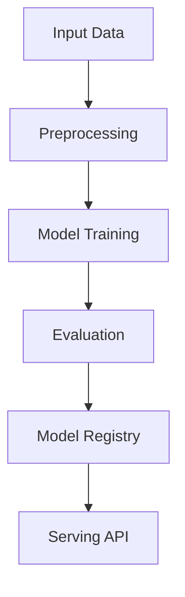

# code-generation

## ∫ Mathematics & Theory

Code Generation — Underlying equations and derivations

$$P(c | p) = \prod_{t=1}^{|c|} P(c_t | p, c_{

$$\mathcal{L} = -\sum_{t=1}^{|c|} \log P(c_t | p, c_{

### Step-by-Step Derivation

Code generation treats source code as a sequence modeled by a language model. The prompt $p$ provides context (docstring, imports, function signature). The model predicts tokens autoregressively, conditioned on previous predictions. Beam search and nucleus sampling improve output quality and diversity.

### Interactive Visualization

Interactive code completion demo; token probability heatmap; beam search tree explorer.

## ⚙ Architecture

Model structure, data flow, and layer breakdown

### Class Hierarchy

```
  CodeTokenizer
  MultiHeadAttention
  AddNorm
  FeedForward
  TransformerBlock
  BaseCodeModel
  CodeCompletionModel
  TextToCodeModel
  RefactoringModel
  TestingAndDebuggingModel
  CodeGenerationModel
```

### Data Flow



## ⚡ API Reference

FastAPI endpoints and model interfaces

| Method | Endpoint |
| --- | --- |
| `GET` | `/` |
| `GET` | `/health` |
| `GET` | `/metrics` |
| `POST` | `/reload` |

## ▶ Usage

Code examples and CLI commands

### Training Script

```python
"""Training pipeline for Code Generation."""

import argparse
import os
from pathlib import Path

from ai_core.logging import get_logger, setup_logging
from ai_core.model_registry import ModelRegistry

from code_generation.data import (
    MAX_SEQ_LEN,
    VOCAB_SIZE,
    load_code_dataset,
    save_dataset,
    train_test_split,
)
from code_generation.model import CodeGenerationModel

logger = get_logger(__name__)

def train(
    model_dir: Path,
    data_path: Path | None = None,
    n_samples: int = 500,
    vocab_size: int = 1000,
    seq_len: int = 128,
    d_model: int = 256,
    n_heads: int = 8,
    n_layers: int = 2,
    d_ff: int = 1024,
    max_seq_len: int = 128,
    learning_rate: float = 0.001,
    n_iterations: int = 100,
    weight_decay: float = 0.01,
    model_version: str = "1.0.0",
    random_seed: int = 42,
    register_to_mlflow: bool = False,
) -> dict:
    logger.info("Loading code dataset", n_samples=n_samples)
    X, y = load_code_dataset(data_path=data_path, n_samples=n_samples, random_seed=random_seed)

    X_train, X_test, y_train, y_test = train_test_split(X, y, test_size=0.2, random_seed=random_seed)
    logger.info("Data split", n_train=len(X_train), n_test=len(X_test))

    model_dir.mkdir(parents=True, exist_ok=True)
    save_dataset(X, y, model_dir / "training_data.npz")

    model = CodeGenerationModel(
        vocab_size=vocab_size,
        d_model=d_model,
        n_heads=n_heads,
        n_layers=n_layers,
        d_ff=d_ff,
        max_seq_len=max_seq_len,
        learning_rate=learning_rate,
        n_iterations=n_iterations,
        weight_decay=weight_decay,
        random_seed=random_seed,
    )

    logger.info("Starting code generation training")
    model.fit(X_train, y_train, n_iterations=n_iterations)

    test_metrics = model.evaluate(X_test, y_test)
    logger.info("Training complete", final_loss=model.loss_history[-1], test_accuracy=test_metrics["accuracy"])

    model_path = model_dir / f"code_generation_v{model_version}.npz"
    model.save(str(model_path))

    metrics = {
        **test_metrics,
        "n_epochs_run": float(len(model.loss_history)),
        "final_loss": model.loss_history[-1] if model.loss_history else 0.0,
        "n_train_samples": float(len(X_train)),
        "n_test_samples": float(len(X_test)),
        "vocab_size": float(vocab_size),
        "d_model": float(d_model),
        "n_layers": float(n_layers),
        "d_ff": float(d_ff),
        "max_seq_len": float(max_seq_len),
    }

    registry = ModelRegistry(base_dir=model_dir)
    registry.save_model(
        model_name="code-generation",
        model_version=model_version,
        model_type="generation",
        metrics=metrics,
        parameters={
            "vocab_size": vocab_size,
            "d_model": d_model,
            "n_heads": n_heads,
            "n_layers": n_layers,
            "d_ff": d_ff,
            "max_seq_len": max_seq_len,
            "learning_rate": learning_rate,
            "n_iterations": n_iterations,
            "weight_decay": weight_decay,
            "random_seed": random_seed,
        },
        artifacts={
            f"code_generation_v{model_version}.npz": model_path,
            "training_data.npz": model_dir / "training_data.npz",
        },
        tags={"framework": "numpy", "task": "code_generation", "model_type": "CodeGeneration"},
    )

    if register_to_mlflow:
        registry.log_to_mlflow(
            model_name="code-generation",
            model_version=model_version,
            metrics=metrics,
            params={"vocab_size": vocab_size, "d_model": d_model, "n_layers": n_layers, "n_iterations": n_iterations},
            artifacts={"model": str(model_path)},
            tags={"model_type": "code_generation", "framework": "numpy"},
        )

    return metrics

def main():
    parser = argparse.ArgumentParser(description="Train Code Generation Model")
    parser.add_argument("--model-dir", type=Path, default=Path(os.getenv("MODEL_DIR", "/models")))
    parser.add_argument("--data-path", type=Path, default=None)
    parser.add_argument("--n-samples", type=int, default=int(os.getenv("N_SAMPLES", "500")))
    parser.add_argument("--vocab-size", type=int, default=int(os.getenv("VOCAB_SIZE", str(VOCAB_SIZE))))
    parser.add_argument("--seq-len", type=int, default=int(os.getenv("SEQ_LEN", str(MAX_SEQ_LEN))))
    parser.add_argument("--d-model", type=int, default=int(os.getenv("D_MODEL", "256")))
    parser.add_argument("--n-heads", type=int, default=int(os.getenv("N_HEADS", "8")))
    parser.add_argument("--n-layers", type=int, default=int(os.getenv("N_LAYERS", "2")))
    parser.add_argument("--d-ff", type=int, default=int(os.getenv("D_FF", "1024")))
    parser.add_argument("--max-seq-len", type=int, default=int(os.getenv("MAX_SEQ_LEN", str(MAX_SEQ_LEN))))
    parser.add_argument("--learning-rate", type=float, default=float(os.getenv("LEARNING_RATE", "0.001")))
    parser.add_argument("--n-iterations", type=int, default=int(os.getenv("N_ITERATIONS", "100")))
    parser.add_argument("--weight-decay", type=float, default=float(os.getenv("WEIGHT_DECAY", "0.01")))
    parser.add_argument("--model-version", type=str, default=os.getenv("MODEL_VERSION", "1.0.0"))
    parser.add_argument("--random-seed", type=int, default=int(os.getenv("RANDOM_SEED", "42")))
    parser.add_argument("--register-mlflow", action="store_true", default=os.getenv("REGISTER_MLFLOW", "false").lower() == "true")
    parser.add_argument("--log-level", type=str, default=os.getenv("LOG_LEVEL", "INFO"))
    args = parser.parse_args()

    setup_logging(args.log_level)
    args.model_dir.mkdir(parents=True, exist_ok=True)

    metrics = train(
        model_dir=args.model_dir,
        data_path=args.data_path,
        n_samples=args.n_samples,
        vocab_size=args.vocab_size,
        seq_len=args.seq_len,
        d_model=args.d_model,
        n_heads=args.n_heads,
        n_layers=args.n_layers,
        d_ff=args.d_ff,
        max_seq_len=args.max_seq_len,
        learning_rate=args.learning_rate,
        n_iterations=args.n_iterations,
        weight_decay=args.weight_decay,
        model_version=args.model_version,
        random_seed=args.random_seed,
        register_to_mlflow=args.register_mlflow,
    )
    logger.info("Training finished", metrics=metrics, model_dir=str(args.model_dir))

if __name__ == "__main__":
    main()
```

### API Server

```python
"""Serving API for Code Generation."""

import os
import time
from contextlib import asynccontextmanager
from pathlib import Path

import numpy as np
from ai_core.drift import DriftDetector
from ai_core.fastapi_middleware import add_observability_middleware
from ai_core.logging import get_logger, setup_logging
from ai_core.metrics import MetricsCollector
from ai_core.model_registry import ModelRegistry
from fastapi import FastAPI, HTTPException, Response
from pydantic import BaseModel, Field

from code_generation.data import VOCAB_SIZE
from code_generation.model import CodeGenerationModel

logger = get_logger(__name__)

MODEL_DIR = Path(os.getenv("MODEL_DIR", "/models"))
MODEL_VERSION = os.getenv("MODEL_VERSION", "latest")
METRICS_PORT = int(os.getenv("CODE_GENERATION_METRICS_PORT", "9020"))
DRIFT_THRESHOLD = float(os.getenv("DRIFT_THRESHOLD", "0.2"))

class CodeCompletionRequest(BaseModel):
    code_prefix: str = Field(..., min_length=1, max_length=500)
    max_new_tokens: int = Field(default=20, ge=1, le=200)

class CodeCompletionResponse(BaseModel):
    completed_code: str
    model_version: str

class TextToCodeRequest(BaseModel):
    description: str = Field(..., min_length=1, max_length=500)
    max_new_tokens: int = Field(default=50, ge=1, le=200)

class TextToCodeResponse(BaseModel):
    generated_code: str
    model_version: str

class RefactorRequest(BaseModel):
    old_code: str = Field(..., min_length=1, max_length=500)
    target_language: str = Field(default="modern_python", max_length=50)

class RefactorResponse(BaseModel):
    refactored_code: str
    target_language: str
    model_version: str

class BugScanRequest(BaseModel):
    code: str = Field(..., min_length=1, max_length=500)

class BugScanResponse(BaseModel):
    bug_probability: float
    confidence: float
    suggested_fix: str
    model_version: str

class UnitTestRequest(BaseModel):
    code: str = Field(..., min_length=1, max_length=500)
    max_new_tokens: int = Field(default=50, ge=1, le=200)

class UnitTestResponse(BaseModel):
    unit_tests: str
    model_version: str

class DriftResponse(BaseModel):
    total_features: int
    drifted_features: int
    drift_ratio: float
    drifted: list[dict]
    all_results: list[dict]

class StatsResponse(BaseModel):
    vocab_size: int
    d_model: int
    n_layers: int
    d_ff: int
    max_seq_len: int
    n_epochs_run: int
    final_loss: float
    model_version: str

_model: CodeGenerationModel | None = None
_model_version: str = "unknown"
_metrics: MetricsCollector | None = None
_drift_detector: DriftDetector | None = None
_reference_data: np.ndarray | None = None
_recent_predictions: list[list[float]] = []

@asynccontextmanager
async def lifespan(app: FastAPI):
    global _model, _model_version, _metrics, _drift_detector, _reference_data

    setup_logging(os.getenv("LOG_LEVEL", "INFO"))
    _metrics = MetricsCollector("code_generation", port=METRICS_PORT)
    app.state.metrics = _metrics

    feature_names = [f"token_{i}" for i in range(VOCAB_SIZE)]
    _drift_detector = DriftDetector(
        feature_names=feature_names,
        feature_types={f: "float" for f in feature_names},
        psi_threshold=DRIFT_THRESHOLD,
    )

    _model, _model_version = _load_model()
    _metrics.set_model_version(_model_version)
    _metrics.set_model_info(
        model_name="code-generation",
        model_version=_model_version,
        model_type="generation",
    )

    _reference_data = _load_reference_data()
    logger.info("Model loaded", model="code-generation", version=_model_version)

    yield
    logger.info("Shutting down code-generation API")

def _load_model() -> tuple[CodeGenerationModel, str]:
    registry = ModelRegistry(base_dir=MODEL_DIR)
    try:
        if MODEL_VERSION == "latest":
            models = registry.list_models()
            cg_models = [m for m in models if m.get("model_name") == "code-generation"]
            if cg_models:
                cg_models.sort(key=lambda m: m["model_version"], reverse=True)
                latest = cg_models[0]
                model_dir = Path(latest["artifact_path"])
                npz_files = list(model_dir.glob("code_generation_v*.npz")) + list(model_dir.glob("*.npz"))
                if npz_files:
                    return CodeGenerationModel.load(str(npz_files[0])), latest["model_version"]
        else:
            model_dir = MODEL_DIR / "code-generation" / MODEL_VERSION
            if model_dir.exists():
                npz_files = list(model_dir.glob("code_generation_v*.npz")) + list(model_dir.glob("*.npz"))
                if npz_files:
                    return CodeGenerationModel.load(str(npz_files[0])), MODEL_VERSION
    except Exception as e:
        logger.warning(f"Registry lookup failed: {e}")

    npz_path = MODEL_DIR / "code_generation.npz"
    if npz_path.exists():
        return CodeGenerationModel.load(str(npz_path)), "legacy"

    candidate_paths = [
        Path("/app/artifacts/models/code_generation_v1.0.0.npz"),
        Path(__file__).resolve().parents[3] / "artifacts" / "models" / "code_generation_v1.0.0.npz",
    ]
    for p in candidate_paths:
        if p.exists():
            logger.info("Loading bundled baseline model", path=str(p))
            return CodeGenerationModel.load(str(p)), "1.0.0-bundled"

    logger.warning("No pre-existing model found. Initializing baseline model.")
    model = CodeGenerationModel(
        vocab_size=100,
        d_model=64,
        n_heads=4,
        n_layers=1,
        d_ff=256,
        max_seq_len=32,
        learning_rate=0.001,
        n_iterations=10,
        random_seed=42,
    )
    return model, "1.0.0-baseline"

def _load_reference_data() -> np.ndarray | None:
    from code_generation.data import generate_synthetic_code_data
    X_base, _ = generate_synthetic_code_data(n_samples=100, random_seed=42)
    return X_base.astype(float)

app = FastAPI(
    title="Code Generation API",
    description="Generative AI code generation with capabilities for code completion, text-to-code, refactoring, testing, and debugging",
    version="1.0.0",
    lifespan=lifespan,
)

add_observability_middleware(app)

@app.get("/")
def read_root():
    return {
        "service": "code_generation-api",
        "version": "1.0.0",
        "model_version": _model_version,
        "capabilities": ["code_completion", "text_to_code", "refactoring", "testing_debugging"],
        "endpoints": {
            "health": "/health",
            "complete": "POST /complete",
            "text_to_code": "POST /text-to-code",
            "refactor": "POST /refactor",
            "scan_bugs": "POST /scan-bugs",
            "generate_tests": "POST /generate-tests",
            "stats": "GET /stats",
            "drift": "GET /drift",
            "metrics": "/metrics",
        },
    }

@app.get("/health")
def health_check():
    if _model is None:
        raise HTTPException(status_code=503, detail="Model not loaded")
    return {
        "status": "healthy",
        "model_loaded": True,
        "model_version": _model_version,
    }

@app.get("/metrics")
def metrics():
    from prometheus_client import CONTENT_TYPE_LATEST, generate_latest
    return Response(content=generate_latest(), media_type=CONTENT_TYPE_LATEST)

@app.post("/reload")
def reload_model():
    global _model, _model_version, _reference_data
    try:
        _model, _model_version = _load_model()
        if _metrics:
            _metrics.set_model_version(_model_version)
            _metrics.set_model_info(
                model_name="code-generation",
                model_version=_model_version,
                model_type="generation",
            )
        _reference_data = _load_reference_data()
        logger.info("Model reloaded", model="code-generation", version=_model_version)
        return {"status": "reloaded", "model_version": _model_version}
    except Exception as e:
        logger.exception("Model reload failed", error=str(e))
        raise HTTPException(status_code=500, detail=f"Reload failed: {e}") from e

@app.get("/drift", response_model=DriftResponse)
def drift_check():
    if _drift_detector is None or _reference_data is None:
        raise HTTPException(status_code=503, detail="Drift detection not available")
    if len(_recent_predictions) < 10:
        return {"total_features": VOCAB_SIZE, "drifted_features": 0, "drift_ratio": 0.0, "drifted": [], "all_results": []}
    current = np.array(_recent_predictions[-100:])
    results = _drift_detector.detect_drift(_reference_data, current)
    summary = _drift_detector.summarize(results)
    if _metrics:
        _metrics.set_drift_ratio(summary["drift_ratio"])
    return summary

@app.get("/stats", response_model=StatsResponse)
def get_stats():
    if _model is None:
        raise HTTPException(status_code=503, detail="Model not loaded")
    info = _model.to_dict()
    return StatsResponse(
        vocab_size=info["vocab_size"],
        d_model=info["d_model"],
        n_layers=info["n_layers"],
        d_ff=info["d_ff"],
        max_seq_len=info["max_seq_len"],
        n_epochs_run=info["n_epochs_run"],
        final_loss=info["final_loss"],
        model_version=_model_version,
    )

@app.post("/complete", response_model=CodeCompletionResponse)
def complete_code(body: CodeCompletionRequest):
    """Complete code given a prefix - predicts and auto-completes lines or full functions."""
    if _model is None or _metrics is None:
        raise HTTPException(status_code=503, detail="Model not loaded")

    start = time.time()
    try:
        completed = _model.complete_code(body.code_prefix, max_new_tokens=body.max_new_tokens)
        response = CodeCompletionResponse(
            completed_code=completed,
            model_version=_model_version,
        )
        duration = time.time() - start
        _metrics.record_prediction(model_version=_model_version, duration=duration)
        return response
    except Exception as e:
        _metrics.record_error(model_version=_model_version, error_type="code_completion")
        logger.exception("Code completion failed", error=str(e))
        raise HTTPException(status_code=500, detail="Code completion failed") from e

@app.post("/text-to-code", response_model=TextToCodeResponse)
def text_to_code(body: TextToCodeRequest):
    """Translate plain English description into functional code blocks."""
    if _model is None or _metrics is None:
        raise HTTPException(status_code=503, detail="Model not loaded")

    start = time.time()
    try:
        generated = _model.text_to_code(body.description, max_new_tokens=body.max_new_tokens)
        response = TextToCodeResponse(
            generated_code=generated,
            model_version=_model_version,
        )
        duration = time.time() - start
        _metrics.record_prediction(model_version=_model_version, duration=duration)
        return response
    except Exception as e:
        _metrics.record_error(model_version=_model_version, error_type="text_to_code")
        logger.exception("Text-to-code generation failed", error=str(e))
        raise HTTPException(status_code=500, detail="Text-to-code generation failed") from e

@app.post("/refactor", response_model=RefactorResponse)
def refactor_code(body: RefactorRequest):
    """Upgrade older software frameworks, improve readability, translate code."""
    if _model is None or _metrics is None:
        raise HTTPException(status_code=503, detail="Model not loaded")

    start = time.time()
    try:
        refactored = _model.refactor_code(body.old_code, target_language=body.target_language)
        response = RefactorResponse(
            refactored_code=refactored,
            target_language=body.target_language,
            model_version=_model_version,
        )
        duration = time.time() - start
        _metrics.record_prediction(model_version=_model_version, duration=duration)
        return response
    except Exception as e:
        _metrics.record_error(model_version=_model_version, error_type="refactoring")
        logger.exception("Refactoring failed", error=str(e))
        raise HTTPException(status_code=500, detail="Refactoring failed") from e

@app.post("/scan-bugs", response_model=BugScanResponse)
def scan_bugs(body: BugScanRequest):
    """Scan code for bugs and identify security vulnerabilities."""
    if _model is None or _metrics is None:
        raise HTTPException(status_code=503, detail="Model not loaded")

    start = time.time()
    try:
        result = _model.scan_for_bugs(body.code)
        response = BugScanResponse(
            bug_probability=result.get("bug_probability", 0.0),
            confidence=result.get("confidence", 0.0),
            suggested_fix=result.get("suggested_fix", ""),
            model_version=_model_version,
        )
        duration = time.time() - start
        _metrics.record_prediction(model_version=_model_version, duration=duration)
        return response
    except Exception as e:
        _metrics.record_error(model_version=_model_version, error_type="bug_scan")
        logger.exception("Bug scan failed", error=str(e))
        raise HTTPException(status_code=500, detail="Bug scan failed") from e

@app.post("/generate-tests", response_model=UnitTestResponse)
def generate_tests(body: UnitTestRequest):
    """Auto-generate unit tests for given code."""
    if _model is None or _metrics is None:
        raise HTTPException(status_code=503, detail="Model not loaded")

    start = time.time()
    try:
        tests = _model.generate_unit_tests(body.code, max_new_tokens=body.max_new_tokens)
        response = UnitTestResponse(
            unit_tests=tests,
            model_version=_model_version,
        )
        duration = time.time() - start
        _metrics.record_prediction(model_version=_model_version, duration=duration)
        return response
    except Exception as e:
        _metrics.record_error(model_version=_model_version, error_type="test_generation")
        logger.exception("Test generation failed", error=str(e))
        raise HTTPException(status_code=500, detail="Test generation failed") from e
```

### CLI Commands

```bash
uv run python -m code_generation.train --model-dir ./artifacts/models
```

## 📊 Benchmarks

Test results and performance metrics

Run `pytest tests/test_models.py` and `pytest tests/test_apis.py` for detailed metrics.

### Related Apps

- [image-generation](../image-generation/README.md)

- [retrieval-augmented-generation](../retrieval-augmented-generation/README.md)

- [text-generation](../text-generation/README.md)

- [video-generation](../video-generation/README.md)

Generated documentation for **code-generation**
