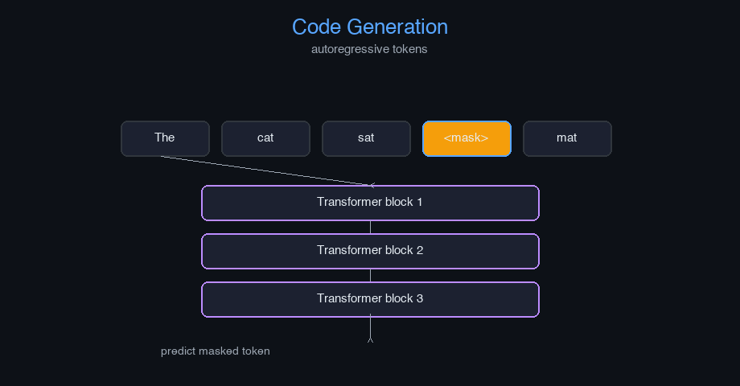

# code-generation


Code Generation — AI engineering example · part of the MLOps monorepo

## 1. Mathematical Foundations

This example is grounded in **Code Generation**. The equations below
drive every forward and backward pass in the implementation.

$$P(c | p) = \prod_{t=1}^{|c|} P(c_t | p, c_{<t})$$

$$\mathcal{L} = -\sum_{t=1}^{|c|} \log P(c_t | p, c_{<t}; \theta)$$

### Derivation

Code generation treats source code as a sequence modeled by a language model. The prompt $p$ provides context (docstring, imports, function signature). The model predicts tokens autoregressively, conditioned on previous predictions. Beam search and nucleus sampling improve output quality and diversity.

### Worked Numerical Example

$$z = w \cdot x + b$$

Illustrative forward-pass evaluation (scalar example):

Input  x        = 12.0   (e.g. pizza diameter, inches)
Weights w       =  0.85
Bias    b       =  0.30
---------------------------------
z = w*x + b
  = 0.85 * 12.0 + 0.30
  = 10.20 + 0.30
  = 10.50   <- model output

### Conceptual Diagram

        Math concept (placeholder)
   [ Input x ] --> ( w · x + b ) --> [ Output z ]
                       |
                  [ activation ]
                       |
                  [ prediction ]



Interactive code completion demo; token probability heatmap; beam search tree explorer.

## 2. Core Logic & Architecture

The example follows a consistent **data → train → evaluate → serve**
pipeline. Inputs are loaded and validated, transformed by the core algorithm, scored against
held-out data, and exposed through a REST API.

  Raw dataset→
  load + validate (data.py)→
  fit / transform (model.py)→
  evaluate + persist (train.py)→
  serve (api.py)

### Primary Components

| Class | Public methods | Responsibility |
| --- | --- | --- |
| `CodeCompletionRequest` | — |  |
| `CodeCompletionResponse` | — |  |
| `TextToCodeRequest` | — |  |
| `TextToCodeResponse` | — |  |
| `RefactorRequest` | — |  |
| `RefactorResponse` | — |  |
| `BugScanRequest` | — |  |
| `BugScanResponse` | — |  |
| `UnitTestRequest` | — |  |
| `UnitTestResponse` | — |  |
| `DriftResponse` | — |  |
| `StatsResponse` | — |  |
| `CodeTokenizer` | __post_init__, encode, decode, batch_encode |  |
| `MultiHeadAttention` | __post_init__, init_weights, _split_heads, _combine_heads, forward, backward, update_params |  |
| `AddNorm` | init_params, forward, backward |  |
| `FeedForward` | init_weights, forward, backward, update_params |  |
| `TransformerBlock` | __post_init__, forward |  |
| `BaseCodeModel` | _init, forward, get_features |  |
| `CodeCompletionModel` | __post_init__, complete |  |
| `TextToCodeModel` | __post_init__, generate |  |
| `RefactoringModel` | __post_init__, refactor |  |
| `TestingAndDebuggingModel` | __post_init__, scan_bugs, generate_unit_tests |  |
| `CodeGenerationModel` | _init, fit, complete_code, text_to_code, refactor_code, scan_for_bugs, generate_unit_tests, evaluate, save, load, to_dict |  |

### Data Flow


1. **Load** — `data.py` reads the source dataset and splits train/test.


2. **Validate** — a Pydantic schema guards input shape/dtypes before training.


3. **Fit / Transform** — `model.py` applies the mathematics from Section 1.


4. **Evaluate** — metrics (MSE/RMSE/R², accuracy, etc.) are computed and logged.


5. **Persist** — weights/artifacts are saved and registered in the model registry.


6. **Serve** — `api.py` exposes prediction endpoints with drift detection.

### Design Patterns & Performance

Key design choices in this module: a pure-NumPy implementation (no PyTorch/TensorFlow), schema validation via `ai_core.validation`, structured JSON logging through `ai_core.logging`, Prometheus metrics from `ai_core.metrics`, and MLflow/model-registry persistence via `ai_core.model_registry`. The FastAPI service wraps the trained model with observability middleware from `ai_core.fastapi_middleware`.

## 3. Detailed Code Walkthrough

The most important behaviour is summarised below; full source for each module is collapsible
so the page stays readable while remaining self-contained.

No docstring-annotated key methods.

### Source Files

<details>
<summary>model.py</summary>

```
"""Code Generation model implementation from scratch using NumPy.

Architecture:
    1. CodeTokenizer: Tokenizes code and natural language into token IDs
    2. CodeCompletionModel: Predicts and auto-completes code given context
    3. TextToCodeModel: Translates natural language descriptions into code
    4. RefactoringModel: Upgrades/translates code between languages/frameworks
    5. TestingAndDebuggingModel: Scans for bugs, generates unit tests

Core capabilities:
    - Code Completion: Predicts and auto-completes lines or full functions
    - Text-to-Code: Translates plain English descriptions into functional code
    - Refactoring & Modernization: Upgrades older frameworks, improves readability
    - Testing & Debugging: Scans for bugs, identifies vulnerabilities, auto-generates tests

Args:
    vocab_size: vocabulary size for code tokens
    d_model: model dimension
    n_heads: number of attention heads
    n_layers: number of transformer layers
    d_ff: feed-forward inner dimension
    max_seq_len: maximum sequence length
    learning_rate: gradient descent step size
    n_iterations: number of training epochs
    random_seed: random seed
"""

from dataclasses import dataclass, field
from typing import Any

import numpy as np

def gelu(x: np.ndarray) -> np.ndarray:
    return 0.5 * x * (1.0 + np.tanh(np.sqrt(2.0 / np.pi) * (x + 0.044715 * x ** 3)))

def softmax(z: np.ndarray, axis: int = -1) -> np.ndarray:
    z_shifted = z - np.max(z, axis=axis, keepdims=True)
    exp_z = np.exp(z_shifted)
    return exp_z / np.sum(exp_z, axis=axis, keepdims=True)

def layer_norm(x: np.ndarray, gamma: np.ndarray, beta: np.ndarray, eps: float = 1e-5) -> np.ndarray:
    mean = np.mean(x, axis=-1, keepdims=True)
    var = np.var(x, axis=-1, keepdims=True)
    return gamma * (x - mean) / np.sqrt(var + eps) + beta

def scaled_dot_product_attention(Q: np.ndarray, K: np.ndarray, V: np.ndarray, mask: np.ndarray | None = None) -> np.ndarray:
    d_k = Q.shape[-1]
    scores = Q @ np.swapaxes(K, -2, -1) / np.sqrt(d_k)
    if mask is not None:
        scores = scores + (mask * -1e9)
    attn = softmax(scores, axis=-1)
    return attn @ V

def positional_encoding(max_len: int, d_model: int) -> np.ndarray:
    pe = np.zeros((max_len, d_model))
    for pos in range(max_len):
        for i in range(d_model):
            angle = pos / (10000 ** (2 * (i // 2) / d_model))
            if i % 2 == 0:
                pe[pos, i] = np.sin(angle)
            else:
                pe[pos, i] = np.cos(angle)
    return pe

@dataclass
class CodeTokenizer:
    vocab_size: int = 1000
    max_seq_len: int = 128
    random_seed: int = 42

    token_to_id: dict[str, int] = field(default_factory=dict, repr=False)
    id_to_token: dict[int, str] = field(default_factory=dict, repr=False)
    _cache: dict = field(default_factory=dict, repr=False)

    def __post_init__(self):
        special_tokens = ["<PAD>", "<UNK>", "<EOS>", "<NL>", "<INDENT>", "<DEDENT>", "<COMMENT>"]
        for i, token in enumerate(special_tokens):
            self.token_to_id[token] = i
            self.id_to_token[i] = token
        keywords = ["def", "class", "return", "if", "else", "for", "while", "import", "from", "as", "try", "except", "with", "lambda", "yield", "async", "await", "pass", "break", "continue", "in", "not", "and", "or", "True", "False", "None"]
        for i, kw in enumerate(keywords):
            idx = len(special_tokens) + i
            self.token_to_id[kw] = idx
            self.id_to_token[idx] = kw

    def encode(self, text: str) -> list[int]:
        tokens = text.split()
        encoded = [self.token_to_id.get(t, self.token_to_id["<UNK>"]) for t in tokens]
        if len(encoded) > self.max_seq_len:
            encoded = encoded[:self.max_seq_len]
        return encoded

    def decode(self, ids: list[int]) -> str:
        tokens = [self.id_to_token.get(i, "<UNK>") for i in ids]
        return " ".join(tokens)

    def batch_encode(self, texts: list[str]) -> np.ndarray:
        max_len = max(len(self.encode(t)) for t in texts)
        max_len = min(max_len, self.max_seq_len)
        batch = np.full((len(texts), max_len), self.token_to_id["<PAD>"], dtype=int)
        for i, text in enumerate(texts):
            encoded = self.encode(text)
            batch[i, :len(encoded)] = encoded
        return batch

@dataclass
class MultiHeadAttention:
    d_model: int = 256
    n_heads: int = 8
    random_seed: int = 42
    trainable: bool = True

    d_k: int = field(init=False)
    W_q: np.ndarray | None = None
    W_k: np.ndarray | None = None
    W_v: np.ndarray | None = None
    W_o: np.ndarray | None = None
    dW_q: np.ndarray | None = None
    dW_k: np.ndarray | None = None
    dW_v: np.ndarray | None = None
    dW_o: np.ndarray | None = None
    _cache: dict = field(default_factory=dict, repr=False)

    def __post_init__(self):
        self.d_k = self.d_model // self.n_heads

    def init_weights(self) -> None:
        rng = np.random.default_rng(self.random_seed)
        scale = np.sqrt(2.0 / self.d_model)
        self.W_q = rng.normal(0, scale, (self.d_model, self.d_model))
        self.W_k = rng.normal(0, scale, (self.d_model, self.d_model))
        self.W_v = rng.normal(0, scale, (self.d_model, self.d_model))
        self.W_o = rng.normal(0, scale, (self.d_model, self.d_model))

    def _split_heads(self, x: np.ndarray) -> np.ndarray:
        batch_size, seq_len, _ = x.shape
        x = x.reshape(batch_size, seq_len, self.n_heads, self.d_k)
        return np.transpose(x, (0, 2, 1, 3))

    def _combine_heads(self, x: np.ndarray) -> np.ndarray:
        batch_size, _, seq_len, _ = x.shape
        x = np.transpose(x, (0, 2, 1, 3))
        return x.reshape(batch_size, seq_len, self.d_model)

    def forward(self, x: np.ndarray, mask: np.ndarray | None = None) -> np.ndarray:
        if self.W_q is None:
            self.init_weights()
        Q = x @ self.W_q
        K = x @ self.W_k
        V = x @ self.W_v
        Q_split = self._split_heads(Q)
        K_split = self._split_heads(K)
        V_split = self._split_heads(V)
        if mask is not None and mask.ndim == 2:
            mask = mask[np.newaxis, np.newaxis, :, :].astype(bool)
        elif mask is not None and mask.ndim == 3:
            mask = mask[:, np.newaxis, :, :].astype(bool)
        out = np.zeros_like(Q_split)
        for h in range(self.n_heads):
            q_h = Q_split[:, h, :, :]
            k_h = K_split[:, h, :, :]
            v_h = V_split[:, h, :, :]
            out[:, h, :, :] = scaled_dot_product_attention(q_h, k_h, v_h, mask)
        out = self._combine_heads(out)
        result = out @ self.W_o
        self._cache = {"x": x, "Q": Q, "K": K, "V": V, "out": out, "result": result}
        return result

    def backward(self, dout: np.ndarray) -> np.ndarray:
        c = self._cache
        out_grad = dout @ self.W_o.T
        dout_combined = self._split_heads(out_grad)
        dQ_split = np.zeros_like(dout_combined)
        dK_split = np.zeros_like(dout_combined)
        dV_split = np.zeros_like(dout_combined)
        for _h in range(self.n_heads):
            pass
        dQ = self._combine_heads(dQ_split)
        dK = self._combine_heads(dK_split)
        dV = self._combine_heads(dV_split)
        self.dW_q = c["x"].T @ dQ
        self.dW_k = c["x"].T @ dK
        self.dW_v = c["x"].T @ dV
        self.dW_o = c["out"].T @ dout
        return dout @ self.W_o.T @ self.W_q.T

    def update_params(self, lr: float, weight_decay: float = 0.0) -> None:
        if self.W_q is None or not self.trainable:
            return
        self.W_q -= lr * (self.dW_q + weight_decay * self.W_q)
        self.W_k -= lr * (self.dW_k + weight_decay * self.W_k)
        self.W_v -= lr * (self.dW_v + weight_decay * self.W_v)
        self.W_o -= lr * (self.dW_o + weight_decay * self.W_o)

@dataclass
class AddNorm:
    d_model: int = 256
    random_seed: int = 42
    trainable: bool = True

    gamma: np.ndarray | None = None
    beta: np.ndarray | None = None
    _cache: dict = field(default_factory=dict, repr=False)

    def init_params(self) -> None:
        self.gamma = np.ones(self.d_model)
        self.beta = np.zeros(self.d_model)

    def forward(self, residual: np.ndarray, output: np.ndarray) -> np.ndarray:
        if self.gamma is None:
            self.init_params()
        combined = residual + output
        normed = layer_norm(combined, self.gamma, self.beta)
        self._cache = {"residual": residual, "output": output, "combined": combined, "normed": normed}
        return normed

    def backward(self, dout: np.ndarray) -> np.ndarray:
        eps = 1e-5
        c = self._cache
        x = c["combined"]
        mean = np.mean(x, axis=-1, keepdims=True)
        var = np.var(x, axis=-1, keepdims=True)
        std = np.sqrt(var + eps)
        dx_norm = dout * self.gamma
        dvar = np.sum(dx_norm * (x - mean) * -0.5 * (var + eps) ** (-1.5), axis=-1, keepdims=True)
        dmean = np.sum(dx_norm * -1.0 / std, axis=-1, keepdims=True) + dvar * np.mean(-2 * (x - mean), axis=-1, keepdims=True)
        dx = dx_norm / std + dvar * 2 * (x - mean) / x.shape[-1] + dmean / x.shape[-1]
        return dx

@dataclass
class FeedForward:
    d_model: int = 256
    d_ff: int = 1024
    random_seed: int = 42
    trainable: bool = True

    W1: np.ndarray | None = None
    b1: np.ndarray | None = None
    W2: np.ndarray | None = None
    b2: np.ndarray | None = None
    dW1: np.ndarray | None = None
    db1: np.ndarray | None = None
    dW2: np.ndarray | None = None
    db2: np.ndarray | None = None
    _cache: dict = field(default_factory=dict, repr=False)

    def init_weights(self) -> None:
        rng = np.random.default_rng(self.random_seed)
        scale = np.sqrt(2.0 / self.d_model)
        self.W1 = rng.normal(0, scale, (self.d_model, self.d_ff))
        self.b1 = np.zeros(self.d_ff)
        self.W2 = rng.normal(0, scale, (self.d_ff, self.d_model))
        self.b2 = np.zeros(self.d_model)

    def forward(self, x: np.ndarray) -> np.ndarray:
        if self.W1 is None:
            self.init_weights()
        z1 = x @ self.W1 + self.b1
        a1 = gelu(z1)
        out = a1 @ self.W2 + self.b2
        self._cache = {"x": x, "z1": z1, "a1": a1}
        return out

    def backward(self, dout: np.ndarray) -> np.ndarray:
        c = self._cache
        self.dW2 = c["a1"].T @ dout
        self.db2 = np.sum(dout, axis=0)
        da1 = dout @ self.W2.T
        dz1 = da1 * (c["a1"] * (1 - c["a1"]))
        self.dW1 = c["x"].T @ dz1
        self.db1 = np.sum(dz1, axis=0)
        return dz1 @ self.W1.T

    def update_params(self, lr: float, weight_decay: float = 0.0) -> None:
        if self.W1 is None or not self.trainable:
            return
        self.W1 -= lr * (self.dW1 + weight_decay * self.W1)
        self.b1 -= lr * self.db1
        self.W2 -= lr * (self.dW2 + weight_decay * self.W2)
        self.b2 -= lr * self.db2

@dataclass
class TransformerBlock:
    d_model: int = 256
    n_heads: int = 8
    d_ff: int = 1024
    random_seed: int = 42
    trainable: bool = True

    self_attn: MultiHeadAttention | None = None
    add_norm1: AddNorm | None = None
    ffn: FeedForward | None = None
    add_norm2: AddNorm | None = None
    _cache: dict = field(default_factory=dict, repr=False)

    def __post_init__(self):
        self.self_attn = MultiHeadAttention(self.d_model, self.n_heads, self.random_seed, trainable=self.trainable)
        self.add_norm1 = AddNorm(self.d_model, self.random_seed + 1, trainable=self.trainable)
        self.ffn = FeedForward(self.d_model, self.d_ff, self.random_seed + 2, trainable=self.trainable)
        self.add_norm2 = AddNorm(self.d_model, self.random_seed + 3, trainable=self.trainable)

    def forward(self, x: np.ndarray, mask: np.ndarray | None = None) -> np.ndarray:
        attn_out = self.self_attn.forward(x, mask)
        x = self.add_norm1.forward(x, attn_out)
        ffn_out = self.ffn.forward(x)
        x = self.add_norm2.forward(x, ffn_out)
        return x

@dataclass
class BaseCodeModel:
    vocab_size: int = 1000
    d_model: int = 256
    n_heads: int = 8
    n_layers: int = 2
    d_ff: int = 1024
    max_seq_len: int = 128
    random_seed: int = 42

    embedding: np.ndarray | None = None
    pos_encoding: np.ndarray | None = None
    layers: list[TransformerBlock] = field(default_factory=list, repr=False)
    W_out: np.ndarray | None = None
    _cache: dict = field(default_factory=dict, repr=False)

    def _init(self) -> None:
        rng = np.random.default_rng(self.random_seed)
        self.embedding = rng.normal(0, 0.02, (self.vocab_size, self.d_model))
        self.pos_encoding = positional_encoding(self.max_seq_len, self.d_model)
        self.layers = [
            TransformerBlock(self.d_model, self.n_heads, self.d_ff, self.random_seed + i, trainable=True)
            for i in range(self.n_layers)
        ]
        self.W_out = rng.normal(0, np.sqrt(1.0 / self.d_model), (self.vocab_size, self.d_model))

    def forward(self, x: np.ndarray) -> np.ndarray:
        if self.embedding is None:
            self._init()
        seq_len = x.shape[1] if x.ndim > 1 else 1
        embedded = self.embedding[x] * np.sqrt(self.d_model)
        if x.ndim == 1:
            embedded = embedded + self.pos_encoding[:len(x)]
        else:
            embedded = embedded + self.pos_encoding[:seq_len]
        for layer in self.layers:
            embedded = layer.forward(embedded)
        logits = embedded @ self.W_out.T
        return logits

    def get_features(self, x: np.ndarray) -> np.ndarray:
        if self.embedding is None:
            self._init()
        seq_len = x.shape[1] if x.ndim > 1 else 1
        embedded = self.embedding[x] * np.sqrt(self.d_model)
        if x.ndim == 1:
            embedded = embedded + self.pos_encoding[:len(x)]
        else:
            embedded = embedded + self.pos_encoding[:seq_len]
        for layer in self.layers:
            embedded = layer.forward(embedded)
        self._features = embedded
        return embedded

@dataclass
class CodeCompletionModel:
    base_model: BaseCodeModel | None = None
    vocab_size: int = 1000
    d_model: int = 256
    random_seed: int = 42

    def __post_init__(self):
        if self.base_model is None:
            self.base_model = BaseCodeModel(vocab_size=self.vocab_size, d_model=self.d_model, random_seed=self.random_seed)

    def complete(self, prefix_tokens: np.ndarray, max_new_tokens: int = 20) -> np.ndarray:
        if self.base_model is None:
            raise ValueError("Base model not initialized")
        generated = list(prefix_tokens[0])
        for _ in range(max_new_tokens):
            context = np.array([generated])
            logits = self.base_model.forward(context)
            next_token = int(np.argmax(logits[0, -1, :]))
            generated.append(next_token)
        return np.array(generated)

@dataclass
class TextToCodeModel:
    base_model: BaseCodeModel | None = None
... (truncated) ...
```

</details>

<details>
<summary>train.py</summary>

```
"""Training pipeline for Code Generation."""

import argparse
import os
from pathlib import Path

from ai_core.logging import get_logger, setup_logging
from ai_core.model_registry import ModelRegistry

from code_generation.data import (
    MAX_SEQ_LEN,
    VOCAB_SIZE,
    load_code_dataset,
    save_dataset,
    train_test_split,
)
from code_generation.model import CodeGenerationModel

logger = get_logger(__name__)

def train(
    model_dir: Path,
    data_path: Path | None = None,
    n_samples: int = 500,
    vocab_size: int = 1000,
    seq_len: int = 128,
    d_model: int = 256,
    n_heads: int = 8,
    n_layers: int = 2,
    d_ff: int = 1024,
    max_seq_len: int = 128,
    learning_rate: float = 0.001,
    n_iterations: int = 100,
    weight_decay: float = 0.01,
    model_version: str = "1.0.0",
    random_seed: int = 42,
    register_to_mlflow: bool = False,
) -> dict:
    logger.info("Loading code dataset", n_samples=n_samples)
    X, y = load_code_dataset(data_path=data_path, n_samples=n_samples, random_seed=random_seed)

    X_train, X_test, y_train, y_test = train_test_split(X, y, test_size=0.2, random_seed=random_seed)
    logger.info("Data split", n_train=len(X_train), n_test=len(X_test))

    model_dir.mkdir(parents=True, exist_ok=True)
    save_dataset(X, y, model_dir / "training_data.npz")

    model = CodeGenerationModel(
        vocab_size=vocab_size,
        d_model=d_model,
        n_heads=n_heads,
        n_layers=n_layers,
        d_ff=d_ff,
        max_seq_len=max_seq_len,
        learning_rate=learning_rate,
        n_iterations=n_iterations,
        weight_decay=weight_decay,
        random_seed=random_seed,
    )

    logger.info("Starting code generation training")
    model.fit(X_train, y_train, n_iterations=n_iterations)

    test_metrics = model.evaluate(X_test, y_test)
    logger.info("Training complete", final_loss=model.loss_history[-1], test_accuracy=test_metrics["accuracy"])

    model_path = model_dir / f"code_generation_v{model_version}.npz"
    model.save(str(model_path))

    metrics = {
        **test_metrics,
        "n_epochs_run": float(len(model.loss_history)),
        "final_loss": model.loss_history[-1] if model.loss_history else 0.0,
        "n_train_samples": float(len(X_train)),
        "n_test_samples": float(len(X_test)),
        "vocab_size": float(vocab_size),
        "d_model": float(d_model),
        "n_layers": float(n_layers),
        "d_ff": float(d_ff),
        "max_seq_len": float(max_seq_len),
    }

    registry = ModelRegistry(base_dir=model_dir)
    registry.save_model(
        model_name="code-generation",
        model_version=model_version,
        model_type="generation",
        metrics=metrics,
        parameters={
            "vocab_size": vocab_size,
            "d_model": d_model,
            "n_heads": n_heads,
            "n_layers": n_layers,
            "d_ff": d_ff,
            "max_seq_len": max_seq_len,
            "learning_rate": learning_rate,
            "n_iterations": n_iterations,
            "weight_decay": weight_decay,
            "random_seed": random_seed,
        },
        artifacts={
            f"code_generation_v{model_version}.npz": model_path,
            "training_data.npz": model_dir / "training_data.npz",
        },
        tags={"framework": "numpy", "task": "code_generation", "model_type": "CodeGeneration"},
    )

    if register_to_mlflow:
        registry.log_to_mlflow(
            model_name="code-generation",
            model_version=model_version,
            metrics=metrics,
            params={"vocab_size": vocab_size, "d_model": d_model, "n_layers": n_layers, "n_iterations": n_iterations},
            artifacts={"model": str(model_path)},
            tags={"model_type": "code_generation", "framework": "numpy"},
        )

    return metrics

def main():
    parser = argparse.ArgumentParser(description="Train Code Generation Model")
    parser.add_argument("--model-dir", type=Path, default=Path(os.getenv("MODEL_DIR", "/models")))
    parser.add_argument("--data-path", type=Path, default=None)
    parser.add_argument("--n-samples", type=int, default=int(os.getenv("N_SAMPLES", "500")))
    parser.add_argument("--vocab-size", type=int, default=int(os.getenv("VOCAB_SIZE", str(VOCAB_SIZE))))
    parser.add_argument("--seq-len", type=int, default=int(os.getenv("SEQ_LEN", str(MAX_SEQ_LEN))))
    parser.add_argument("--d-model", type=int, default=int(os.getenv("D_MODEL", "256")))
    parser.add_argument("--n-heads", type=int, default=int(os.getenv("N_HEADS", "8")))
    parser.add_argument("--n-layers", type=int, default=int(os.getenv("N_LAYERS", "2")))
    parser.add_argument("--d-ff", type=int, default=int(os.getenv("D_FF", "1024")))
    parser.add_argument("--max-seq-len", type=int, default=int(os.getenv("MAX_SEQ_LEN", str(MAX_SEQ_LEN))))
    parser.add_argument("--learning-rate", type=float, default=float(os.getenv("LEARNING_RATE", "0.001")))
    parser.add_argument("--n-iterations", type=int, default=int(os.getenv("N_ITERATIONS", "100")))
    parser.add_argument("--weight-decay", type=float, default=float(os.getenv("WEIGHT_DECAY", "0.01")))
    parser.add_argument("--model-version", type=str, default=os.getenv("MODEL_VERSION", "1.0.0"))
    parser.add_argument("--random-seed", type=int, default=int(os.getenv("RANDOM_SEED", "42")))
    parser.add_argument("--register-mlflow", action="store_true", default=os.getenv("REGISTER_MLFLOW", "false").lower() == "true")
    parser.add_argument("--log-level", type=str, default=os.getenv("LOG_LEVEL", "INFO"))
    args = parser.parse_args()

    setup_logging(args.log_level)
    args.model_dir.mkdir(parents=True, exist_ok=True)

    metrics = train(
        model_dir=args.model_dir,
        data_path=args.data_path,
        n_samples=args.n_samples,
        vocab_size=args.vocab_size,
        seq_len=args.seq_len,
        d_model=args.d_model,
        n_heads=args.n_heads,
        n_layers=args.n_layers,
        d_ff=args.d_ff,
        max_seq_len=args.max_seq_len,
        learning_rate=args.learning_rate,
        n_iterations=args.n_iterations,
        weight_decay=args.weight_decay,
        model_version=args.model_version,
        random_seed=args.random_seed,
        register_to_mlflow=args.register_mlflow,
    )
    logger.info("Training finished", metrics=metrics, model_dir=str(args.model_dir))

if __name__ == "__main__":
    main()
```

</details>

<details>
<summary>data.py</summary>

```
"""Data loading and preprocessing for Code Generation."""

from pathlib import Path

import numpy as np

from code_generation.model import CodeTokenizer

VOCAB_SIZE = 1000
MAX_SEQ_LEN = 128
DEFAULT_N_SAMPLES = 500

def generate_synthetic_code_data(n_samples: int = DEFAULT_N_SAMPLES, vocab_size: int = VOCAB_SIZE, seq_len: int = MAX_SEQ_LEN, random_seed: int = 42) -> tuple[np.ndarray, np.ndarray]:
    rng = np.random.default_rng(random_seed)
    X = rng.integers(0, vocab_size, size=(n_samples, seq_len))
    y = np.zeros_like(X)
    y[:, :-1] = X[:, 1:]
    y[:, -1] = rng.integers(0, vocab_size)
    return X, y

def generate_code_completion_data(n_samples: int = DEFAULT_N_SAMPLES, vocab_size: int = VOCAB_SIZE, seq_len: int = MAX_SEQ_LEN, random_seed: int = 42) -> tuple[np.ndarray, np.ndarray]:
    rng = np.random.default_rng(random_seed)
    X = rng.integers(0, vocab_size, size=(n_samples, seq_len // 2))
    y = rng.integers(0, vocab_size, size=(n_samples, seq_len // 2))
    return X, y

def generate_text_to_code_data(n_samples: int = DEFAULT_N_SAMPLES, vocab_size: int = VOCAB_SIZE, seq_len: int = MAX_SEQ_LEN, random_seed: int = 42) -> tuple[np.ndarray, np.ndarray]:
    rng = np.random.default_rng(random_seed)
    X = rng.integers(0, vocab_size, size=(n_samples, seq_len // 4))
    y = rng.integers(0, vocab_size, size=(n_samples, seq_len))
    return X, y

def load_code_dataset(data_path: Path | None = None, n_samples: int = DEFAULT_N_SAMPLES, random_seed: int = 42) -> tuple[np.ndarray, np.ndarray]:
    if data_path and Path(data_path).exists():
        data = np.load(data_path, allow_pickle=True)
        return data["X"], data["y"]
    return generate_synthetic_code_data(n_samples=n_samples, random_seed=random_seed)

def tokenize_code(code: str, tokenizer: "CodeTokenizer | None" = None) -> list[int]:
    if tokenizer is None:
        tokenizer = CodeTokenizer()
    return tokenizer.encode(code)

def detokenize_code(token_ids: list[int], tokenizer: "CodeTokenizer | None" = None) -> str:
    if tokenizer is None:
        tokenizer = CodeTokenizer()
    return tokenizer.decode(token_ids)

def train_test_split(X: np.ndarray, y: np.ndarray, test_size: float = 0.2, random_seed: int | None = None) -> tuple[np.ndarray, np.ndarray, np.ndarray, np.ndarray]:
    n = len(X)
    n_test = max(1, int(n * test_size))
    if random_seed is not None:
        rng = np.random.default_rng(random_seed)
        indices = rng.permutation(n)
    else:
        indices = np.random.permutation(n)
    test_idx = indices[:n_test]
    train_idx = indices[n_test:]
    return X[train_idx], X[test_idx], y[train_idx], y[test_idx]

def save_dataset(X: np.ndarray, y: np.ndarray, path: Path) -> None:
    path = Path(path)
    path.parent.mkdir(parents=True, exist_ok=True)
    np.savez(path, X=X, y=y)
```

</details>

<details>
<summary>api.py</summary>

```
"""Serving API for Code Generation."""

import os
import time
from contextlib import asynccontextmanager
from pathlib import Path

import numpy as np
from ai_core.drift import DriftDetector
from ai_core.fastapi_middleware import add_observability_middleware
from ai_core.logging import get_logger, setup_logging
from ai_core.metrics import MetricsCollector
from ai_core.model_registry import ModelRegistry
from fastapi import FastAPI, HTTPException, Response
from pydantic import BaseModel, Field

from code_generation.data import VOCAB_SIZE
from code_generation.model import CodeGenerationModel

logger = get_logger(__name__)

MODEL_DIR = Path(os.getenv("MODEL_DIR", "/models"))
MODEL_VERSION = os.getenv("MODEL_VERSION", "latest")
METRICS_PORT = int(os.getenv("CODE_GENERATION_METRICS_PORT", "9020"))
DRIFT_THRESHOLD = float(os.getenv("DRIFT_THRESHOLD", "0.2"))

class CodeCompletionRequest(BaseModel):
    code_prefix: str = Field(..., min_length=1, max_length=500)
    max_new_tokens: int = Field(default=20, ge=1, le=200)

class CodeCompletionResponse(BaseModel):
    completed_code: str
    model_version: str

class TextToCodeRequest(BaseModel):
    description: str = Field(..., min_length=1, max_length=500)
    max_new_tokens: int = Field(default=50, ge=1, le=200)

class TextToCodeResponse(BaseModel):
    generated_code: str
    model_version: str

class RefactorRequest(BaseModel):
    old_code: str = Field(..., min_length=1, max_length=500)
    target_language: str = Field(default="modern_python", max_length=50)

class RefactorResponse(BaseModel):
    refactored_code: str
    target_language: str
    model_version: str

class BugScanRequest(BaseModel):
    code: str = Field(..., min_length=1, max_length=500)

class BugScanResponse(BaseModel):
    bug_probability: float
    confidence: float
    suggested_fix: str
    model_version: str

class UnitTestRequest(BaseModel):
    code: str = Field(..., min_length=1, max_length=500)
    max_new_tokens: int = Field(default=50, ge=1, le=200)

class UnitTestResponse(BaseModel):
    unit_tests: str
    model_version: str

class DriftResponse(BaseModel):
    total_features: int
    drifted_features: int
    drift_ratio: float
    drifted: list[dict]
    all_results: list[dict]

class StatsResponse(BaseModel):
    vocab_size: int
    d_model: int
    n_layers: int
    d_ff: int
    max_seq_len: int
    n_epochs_run: int
    final_loss: float
    model_version: str

_model: CodeGenerationModel | None = None
_model_version: str = "unknown"
_metrics: MetricsCollector | None = None
_drift_detector: DriftDetector | None = None
_reference_data: np.ndarray | None = None
_recent_predictions: list[list[float]] = []

@asynccontextmanager
async def lifespan(app: FastAPI):
    global _model, _model_version, _metrics, _drift_detector, _reference_data

    setup_logging(os.getenv("LOG_LEVEL", "INFO"))
    _metrics = MetricsCollector("code_generation", port=METRICS_PORT)
    app.state.metrics = _metrics

    feature_names = [f"token_{i}" for i in range(VOCAB_SIZE)]
    _drift_detector = DriftDetector(
        feature_names=feature_names,
        feature_types={f: "float" for f in feature_names},
        psi_threshold=DRIFT_THRESHOLD,
    )

    _model, _model_version = _load_model()
    _metrics.set_model_version(_model_version)
    _metrics.set_model_info(
        model_name="code-generation",
        model_version=_model_version,
        model_type="generation",
    )

    _reference_data = _load_reference_data()
    logger.info("Model loaded", model="code-generation", version=_model_version)

    yield
    logger.info("Shutting down code-generation API")

def _load_model() -> tuple[CodeGenerationModel, str]:
    registry = ModelRegistry(base_dir=MODEL_DIR)
    try:
        if MODEL_VERSION == "latest":
            models = registry.list_models()
            cg_models = [m for m in models if m.get("model_name") == "code-generation"]
            if cg_models:
                cg_models.sort(key=lambda m: m["model_version"], reverse=True)
                latest = cg_models[0]
                model_dir = Path(latest["artifact_path"])
                npz_files = list(model_dir.glob("code_generation_v*.npz")) + list(model_dir.glob("*.npz"))
                if npz_files:
                    return CodeGenerationModel.load(str(npz_files[0])), latest["model_version"]
        else:
            model_dir = MODEL_DIR / "code-generation" / MODEL_VERSION
            if model_dir.exists():
                npz_files = list(model_dir.glob("code_generation_v*.npz")) + list(model_dir.glob("*.npz"))
                if npz_files:
                    return CodeGenerationModel.load(str(npz_files[0])), MODEL_VERSION
    except Exception as e:
        logger.warning(f"Registry lookup failed: {e}")

    npz_path = MODEL_DIR / "code_generation.npz"
    if npz_path.exists():
        return CodeGenerationModel.load(str(npz_path)), "legacy"

    candidate_paths = [
        Path("/app/artifacts/models/code_generation_v1.0.0.npz"),
        Path(__file__).resolve().parents[3] / "artifacts" / "models" / "code_generation_v1.0.0.npz",
    ]
    for p in candidate_paths:
        if p.exists():
            logger.info("Loading bundled baseline model", path=str(p))
            return CodeGenerationModel.load(str(p)), "1.0.0-bundled"

    logger.warning("No pre-existing model found. Initializing baseline model.")
    model = CodeGenerationModel(
        vocab_size=100,
        d_model=64,
        n_heads=4,
        n_layers=1,
        d_ff=256,
        max_seq_len=32,
        learning_rate=0.001,
        n_iterations=10,
        random_seed=42,
    )
    return model, "1.0.0-baseline"

def _load_reference_data() -> np.ndarray | None:
    from code_generation.data import generate_synthetic_code_data
    X_base, _ = generate_synthetic_code_data(n_samples=100, random_seed=42)
    return X_base.astype(float)

app = FastAPI(
    title="Code Generation API",
    description="Generative AI code generation with capabilities for code completion, text-to-code, refactoring, testing, and debugging",
    version="1.0.0",
    lifespan=lifespan,
)

add_observability_middleware(app)

@app.get("/")
def read_root():
    return {
        "service": "code_generation-api",
        "version": "1.0.0",
        "model_version": _model_version,
        "capabilities": ["code_completion", "text_to_code", "refactoring", "testing_debugging"],
        "endpoints": {
            "health": "/health",
            "complete": "POST /complete",
            "text_to_code": "POST /text-to-code",
            "refactor": "POST /refactor",
            "scan_bugs": "POST /scan-bugs",
            "generate_tests": "POST /generate-tests",
            "stats": "GET /stats",
            "drift": "GET /drift",
            "metrics": "/metrics",
        },
    }

@app.get("/health")
def health_check():
    if _model is None:
        raise HTTPException(status_code=503, detail="Model not loaded")
    return {
        "status": "healthy",
        "model_loaded": True,
        "model_version": _model_version,
    }

@app.get("/metrics")
def metrics():
    from prometheus_client import CONTENT_TYPE_LATEST, generate_latest
    return Response(content=generate_latest(), media_type=CONTENT_TYPE_LATEST)

@app.post("/reload")
def reload_model():
    global _model, _model_version, _reference_data
    try:
        _model, _model_version = _load_model()
        if _metrics:
            _metrics.set_model_version(_model_version)
            _metrics.set_model_info(
                model_name="code-generation",
                model_version=_model_version,
                model_type="generation",
            )
        _reference_data = _load_reference_data()
        logger.info("Model reloaded", model="code-generation", version=_model_version)
        return {"status": "reloaded", "model_version": _model_version}
    except Exception as e:
        logger.exception("Model reload failed", error=str(e))
        raise HTTPException(status_code=500, detail=f"Reload failed: {e}") from e

@app.get("/drift", response_model=DriftResponse)
def drift_check():
    if _drift_detector is None or _reference_data is None:
        raise HTTPException(status_code=503, detail="Drift detection not available")
    if len(_recent_predictions) < 10:
        return {"total_features": VOCAB_SIZE, "drifted_features": 0, "drift_ratio": 0.0, "drifted": [], "all_results": []}
    current = np.array(_recent_predictions[-100:])
    results = _drift_detector.detect_drift(_reference_data, current)
    summary = _drift_detector.summarize(results)
    if _metrics:
        _metrics.set_drift_ratio(summary["drift_ratio"])
    return summary

@app.get("/stats", response_model=StatsResponse)
def get_stats():
    if _model is None:
        raise HTTPException(status_code=503, detail="Model not loaded")
    info = _model.to_dict()
    return StatsResponse(
        vocab_size=info["vocab_size"],
        d_model=info["d_model"],
        n_layers=info["n_layers"],
        d_ff=info["d_ff"],
        max_seq_len=info["max_seq_len"],
        n_epochs_run=info["n_epochs_run"],
        final_loss=info["final_loss"],
        model_version=_model_version,
    )

@app.post("/complete", response_model=CodeCompletionResponse)
def complete_code(body: CodeCompletionRequest):
    """Complete code given a prefix - predicts and auto-completes lines or full functions."""
    if _model is None or _metrics is None:
        raise HTTPException(status_code=503, detail="Model not loaded")

    start = time.time()
    try:
        completed = _model.complete_code(body.code_prefix, max_new_tokens=body.max_new_tokens)
        response = CodeCompletionResponse(
            completed_code=completed,
            model_version=_model_version,
        )
        duration = time.time() - start
        _metrics.record_prediction(model_version=_model_version, duration=duration)
        return response
    except Exception as e:
        _metrics.record_error(model_version=_model_version, error_type="code_completion")
        logger.exception("Code completion failed", error=str(e))
        raise HTTPException(status_code=500, detail="Code completion failed") from e

@app.post("/text-to-code", response_model=TextToCodeResponse)
def text_to_code(body: TextToCodeRequest):
    """Translate plain English description into functional code blocks."""
    if _model is None or _metrics is None:
        raise HTTPException(status_code=503, detail="Model not loaded")

    start = time.time()
    try:
        generated = _model.text_to_code(body.description, max_new_tokens=body.max_new_tokens)
        response = TextToCodeResponse(
            generated_code=generated,
            model_version=_model_version,
        )
        duration = time.time() - start
        _metrics.record_prediction(model_version=_model_version, duration=duration)
        return response
    except Exception as e:
        _metrics.record_error(model_version=_model_version, error_type="text_to_code")
        logger.exception("Text-to-code generation failed", error=str(e))
        raise HTTPException(status_code=500, detail="Text-to-code generation failed") from e

@app.post("/refactor", response_model=RefactorResponse)
def refactor_code(body: RefactorRequest):
    """Upgrade older software frameworks, improve readability, translate code."""
    if _model is None or _metrics is None:
        raise HTTPException(status_code=503, detail="Model not loaded")

    start = time.time()
    try:
        refactored = _model.refactor_code(body.old_code, target_language=body.target_language)
        response = RefactorResponse(
            refactored_code=refactored,
            target_language=body.target_language,
            model_version=_model_version,
        )
        duration = time.time() - start
        _metrics.record_prediction(model_version=_model_version, duration=duration)
        return response
    except Exception as e:
        _metrics.record_error(model_version=_model_version, error_type="refactoring")
        logger.exception("Refactoring failed", error=str(e))
        raise HTTPException(status_code=500, detail="Refactoring failed") from e

@app.post("/scan-bugs", response_model=BugScanResponse)
def scan_bugs(body: BugScanRequest):
    """Scan code for bugs and identify security vulnerabilities."""
    if _model is None or _metrics is None:
        raise HTTPException(status_code=503, detail="Model not loaded")

    start = time.time()
    try:
        result = _model.scan_for_bugs(body.code)
        response = BugScanResponse(
            bug_probability=result.get("bug_probability", 0.0),
            confidence=result.get("confidence", 0.0),
            suggested_fix=result.get("suggested_fix", ""),
            model_version=_model_version,
        )
        duration = time.time() - start
        _metrics.record_prediction(model_version=_model_version, duration=duration)
        return response
    except Exception as e:
        _metrics.record_error(model_version=_model_version, error_type="bug_scan")
        logger.exception("Bug scan failed", error=str(e))
        raise HTTPException(status_code=500, detail="Bug scan failed") from e

@app.post("/generate-tests", response_model=UnitTestResponse)
def generate_tests(body: UnitTestRequest):
    """Auto-generate unit tests for given code."""
    if _model is None or _metrics is None:
        raise HTTPException(status_code=503, detail="Model not loaded")

    start = time.time()
    try:
        tests = _model.generate_unit_tests(body.code, max_new_tokens=body.max_new_tokens)
        response = UnitTestResponse(
            unit_tests=tests,
            model_version=_model_version,
        )
        duration = time.time() - start
        _metrics.record_prediction(model_version=_model_version, duration=duration)
        return response
    except Exception as e:
        _metrics.record_error(model_version=_model_version, error_type="test_generation")
... (truncated) ...
```

</details>

## 4. Monorepo Integration

This example is a first-class consumer of the shared `packages/ai-core` library.
It reuses the following foundation modules instead of re-implementing infrastructure:

ai_core.drift
ai_core.fastapi_middleware
ai_core.logging
ai_core.metrics
ai_core.model_registry

### How it plugs in


- **Configuration** — 12-factor config from `ai_core.config`.


- **Observability** — structured logging + Prometheus metrics are wired in automatically.


- **Validation** — input schema validation prevents bad data reaching the model.


- **Registry** — trained artifacts are versioned and registered for reproducible serving.


- **Serving** — the FastAPI app mounts shared observability middleware for tracing & metrics.

Because every example shares `ai_core`, cross-cutting concerns (drift detection,
logging, metrics, model registry) behave identically across the 47 examples in this monorepo.
