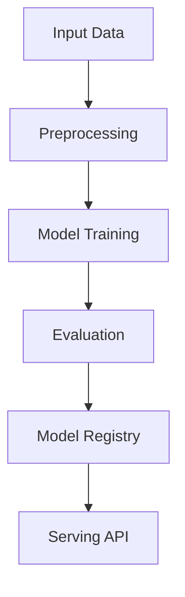

# image-generation

## ∫ Mathematics & Theory

Image Generation (GAN/VAE/Diffusion) — Underlying equations and derivations

$$\min_G \max_D V(D, G) = \mathbb{E}_{x \sim p_{data}}[\log D(x)] + \mathbb{E}_{z \sim p_z}[\log(1 - D(G(z)))]$$

$$q(x_t | x_{t-1}) = \mathcal{N}(x_t; \sqrt{1 - \beta_t}x_{t-1}, \beta_t I)$$

$$\mathcal{L}_{simple} = \mathbb{E}_{t, x_0, \epsilon} \left[ \| \epsilon - \epsilon_\theta(\sqrt{\bar{\alpha}_t}x_0 + \sqrt{1-\bar{\alpha}_t}\epsilon, t) \|^2 \right]$$

### Step-by-Step Derivation

Image generation models learn to synthesize realistic images. GANs use adversarial training between generator and discriminator. VAEs learn a structured latent space via reconstruction and KL regularization. Diffusion models iteratively denoise from Gaussian noise, offering stable training and diverse outputs.

### Interactive Visualization

Interactive latent space explorer; denoising trajectory viewer; FID score vs training steps.

## ⚙ Architecture

Model structure, data flow, and layer breakdown

### Class Hierarchy

```
  ImageTokenizer
  MultiHeadAttention
  AddNorm
  FeedForward
  TransformerBlock
  TextConditioning
  VariationalAutoencoder
  DiffusionModel
  ImageGenerationModel
```

### Data Flow



## ⚡ API Reference

FastAPI endpoints and model interfaces

| Method | Endpoint |
| --- | --- |
| `GET` | `/` |
| `GET` | `/health` |
| `GET` | `/metrics` |

## ▶ Usage

Code examples and CLI commands

### Training Script

```python
"""Training pipeline for Image Generation."""

import argparse
import os
from pathlib import Path

import numpy as np
from ai_core.logging import get_logger, setup_logging
from ai_core.model_registry import ModelRegistry

from image_generation.data import load_image_dataset, save_dataset, train_test_split_images
from image_generation.model import ImageGenerationModel

logger = get_logger(__name__)

def train(
    model_dir: Path,
    data_path: Path | None = None,
    n_samples: int = 500,
    img_size: int = 32,
    latent_dim: int = 64,
    model_id: str = "image-generation-v1",
    n_diffusion_steps: int = 1000,
    model_version: str = "1.0.0",
    register_to_mlflow: bool = False,
    random_seed: int = 42,
) -> dict:
    logger.info("Loading image dataset", n_samples=n_samples, img_size=img_size)
    images, prompts = load_image_dataset(data_path=data_path, n_samples=n_samples, random_seed=random_seed)

    X_train, X_test, prompts_train, prompts_test = train_test_split_images(images, prompts, test_size=0.2, random_seed=random_seed)
    logger.info("Data split", n_train=len(X_train), n_test=len(X_test))

    model_dir.mkdir(parents=True, exist_ok=True)
    save_dataset(images, prompts, model_dir / "training_data.npz")

    model = ImageGenerationModel(
        model_id=model_id,
        img_size=img_size,
        latent_dim=latent_dim,
        n_diffusion_steps=n_diffusion_steps,
        random_seed=random_seed,
    )
    model._init()

    X_train_flat = X_train.reshape(len(X_train), -1)
    X_test_flat = X_test.reshape(len(X_test), -1)
    metrics = model.fit(X_train_flat, np.zeros(len(X_train_flat)), n_iterations=10)
    logger.info("Training finished", metrics=metrics)

    eval_metrics = model.evaluate(X_test_flat, np.zeros(len(X_test_flat)))
    logger.info("Evaluation metrics", metrics=eval_metrics)

    model_path = model_dir / f"image_generation_v{model_version}.npz"
    model.save(str(model_path))

    combined_metrics = {**metrics, **eval_metrics}
    combined_metrics.update({
        "img_size": float(img_size),
        "latent_dim": float(latent_dim),
        "n_diffusion_steps": float(n_diffusion_steps),
        "n_samples": float(n_samples),
    })

    registry = ModelRegistry(base_dir=model_dir)
    registry.save_model(
        model_name="image-generation",
        model_version=model_version,
        model_type="generative",
        metrics=combined_metrics,
        parameters={
            "model_id": model_id,
            "img_size": img_size,
            "latent_dim": latent_dim,
            "n_diffusion_steps": n_diffusion_steps,
            "n_samples": n_samples,
            "random_seed": random_seed,
        },
        artifacts={f"image_generation_v{model_version}.npz": model_path, "training_data.npz": model_dir / "training_data.npz"},
        tags={"framework": "numpy", "task": "image_generation", "model_type": "ImageGeneration"},
    )

    if register_to_mlflow:
        registry.log_to_mlflow(
            model_name="image-generation",
            model_version=model_version,
            metrics=combined_metrics,
            params={"model_id": model_id, "img_size": img_size, "latent_dim": latent_dim, "n_diffusion_steps": n_diffusion_steps, "n_samples": n_samples},
            artifacts={"model": str(model_path)},
            tags={"model_type": "image_generation", "framework": "numpy"},
        )

    return combined_metrics

def main():
    parser = argparse.ArgumentParser(description="Train Image Generation Model")
    parser.add_argument("--model-dir", type=Path, default=Path(os.getenv("MODEL_DIR", "/models")))
    parser.add_argument("--data-path", type=Path, default=None)
    parser.add_argument("--n-samples", type=int, default=int(os.getenv("N_SAMPLES", "500")))
    parser.add_argument("--img-size", type=int, default=int(os.getenv("IMG_SIZE", "32")))
    parser.add_argument("--latent-dim", type=int, default=int(os.getenv("LATENT_DIM", "64")))
    parser.add_argument("--model-id", type=str, default=os.getenv("MODEL_ID", "image-generation-v1"))
    parser.add_argument("--n-diffusion-steps", type=int, default=int(os.getenv("N_DIFFUSION_STEPS", "1000")))
    parser.add_argument("--model-version", type=str, default=os.getenv("MODEL_VERSION", "1.0.0"))
    parser.add_argument("--random-seed", type=int, default=int(os.getenv("RANDOM_SEED", "42")))
    parser.add_argument("--register-mlflow", action="store_true", default=os.getenv("REGISTER_MLFLOW", "false").lower() == "true")
    parser.add_argument("--log-level", type=str, default=os.getenv("LOG_LEVEL", "INFO"))
    args = parser.parse_args()

    setup_logging(args.log_level)
    args.model_dir.mkdir(parents=True, exist_ok=True)

    metrics = train(
        model_dir=args.model_dir,
        data_path=args.data_path,
        n_samples=args.n_samples,
        img_size=args.img_size,
        latent_dim=args.latent_dim,
        model_id=args.model_id,
        n_diffusion_steps=args.n_diffusion_steps,
        model_version=args.model_version,
        register_to_mlflow=args.register_mlflow,
        random_seed=args.random_seed,
    )
    logger.info("Training finished", metrics=metrics, model_dir=str(args.model_dir))

if __name__ == "__main__":
    main()
```

### API Server

```python
"""Serving API for Image Generation."""

import os
import time
from contextlib import asynccontextmanager
from pathlib import Path

import numpy as np
from ai_core.drift import DriftDetector
from ai_core.fastapi_middleware import add_observability_middleware
from ai_core.logging import get_logger, setup_logging
from ai_core.metrics import MetricsCollector
from ai_core.model_registry import ModelRegistry
from fastapi import FastAPI, HTTPException, Response
from pydantic import BaseModel, Field

from image_generation.data import DEFAULT_IMG_SIZE, DEFAULT_LATENT_DIM
from image_generation.model import ImageGenerationModel

logger = get_logger(__name__)

MODEL_DIR = Path(os.getenv("MODEL_DIR", "/models"))
MODEL_VERSION = os.getenv("MODEL_VERSION", "latest")
METRICS_PORT = int(os.getenv("IMAGE_GENERATION_METRICS_PORT", "9021"))
DRIFT_THRESHOLD = float(os.getenv("DRIFT_THRESHOLD", "0.2"))

class GenerateImageRequest(BaseModel):
    prompt: str = Field(..., min_length=1)
    n_steps: int = Field(default=50, ge=1, le=200)

class GenerateImageResponse(BaseModel):
    image_shape: tuple[int, int, int]
    prompt: str
    model_version: str

class StatsResponse(BaseModel):
    model_id: str
    img_size: int
    latent_dim: int
    n_diffusion_steps: int
    model_version: str

_model: ImageGenerationModel | None = None
_model_version: str = "unknown"
_metrics: MetricsCollector | None = None
_drift_detector: DriftDetector | None = None
_reference_data: np.ndarray | None = None
_recent_predictions: list[list[float]] = []

@asynccontextmanager
async def lifespan(app: FastAPI):
    global _model, _model_version, _metrics, _drift_detector, _reference_data

    setup_logging(os.getenv("LOG_LEVEL", "INFO"))
    _metrics = MetricsCollector("image_generation", port=METRICS_PORT)
    app.state.metrics = _metrics

    feature_names = [f"latent_{i}" for i in range(DEFAULT_LATENT_DIM)]
    _drift_detector = DriftDetector(
        feature_names=feature_names,
        feature_types={f: "float" for f in feature_names},
        psi_threshold=DRIFT_THRESHOLD,
    )

    _model, _model_version = _load_model()
    _metrics.set_model_version(_model_version)
    _metrics.set_model_info(
        model_name="image-generation",
        model_version=_model_version,
        model_type="generative",
    )

    _reference_data = _load_reference_data()
    logger.info("Model loaded", model="image-generation", version=_model_version)

    yield
    logger.info("Shutting down image-generation API")

def _load_model() -> tuple[ImageGenerationModel, str]:
    registry = ModelRegistry(base_dir=MODEL_DIR)
    try:
        if MODEL_VERSION == "latest":
            models = registry.list_models()
            ig_models = [m for m in models if m.get("model_name") == "image-generation"]
            if ig_models:
                ig_models.sort(key=lambda m: m["model_version"], reverse=True)
                latest = ig_models[0]
                model_dir = Path(latest["artifact_path"])
                npz_files = list(model_dir.glob("image_generation_v*.npz")) + list(model_dir.glob("*.npz"))
                if npz_files:
                    return ImageGenerationModel.load(str(npz_files[0])), latest["model_version"]
        else:
            model_dir = MODEL_DIR / "image-generation" / MODEL_VERSION
            if model_dir.exists():
                npz_files = list(model_dir.glob("image_generation_v*.npz")) + list(model_dir.glob("*.npz"))
                if npz_files:
                    return ImageGenerationModel.load(str(npz_files[0])), MODEL_VERSION
    except Exception as e:
        logger.warning(f"Registry lookup failed: {e}")

    npz_path = MODEL_DIR / "image_generation.npz"
    if npz_path.exists():
        return ImageGenerationModel.load(str(npz_path)), "legacy"

    candidate_paths = [
        Path("/app/artifacts/models/image_generation_v1.0.0.npz"),
        Path(__file__).resolve().parents[3] / "artifacts" / "models" / "image_generation_v1.0.0.npz",
    ]
    for p in candidate_paths:
        if p.exists():
            logger.info("Loading bundled baseline model", path=str(p))
            return ImageGenerationModel.load(str(p)), "1.0.0-bundled"

    logger.warning("No pre-existing model found. Initializing baseline model.")
    model = ImageGenerationModel(model_id="baseline", img_size=DEFAULT_IMG_SIZE, latent_dim=DEFAULT_LATENT_DIM)
    model._init()
    return model, "1.0.0-baseline"

def _load_reference_data() -> np.ndarray | None:
    from image_generation.data import generate_synthetic_images
    images, _ = generate_synthetic_images(n_samples=100, random_seed=42)
    return images.reshape(100, -1).astype(float)

app = FastAPI(
    title="Image Generation API",
    description="Diffusion model-based text-to-image generation with VAE latent compression",
    version="1.0.0",
    lifespan=lifespan,
)

add_observability_middleware(app)

@app.get("/")
def read_root():
    return {
        "service": "image-generation-api",
        "version": "1.0.0",
        "model_version": _model_version,
        "endpoints": {
            "health": "/health",
            "generate": "POST /generate",
            "stats": "GET /stats",
            "metrics": "/metrics",
        },
    }

@app.get("/health")
def health_check():
    if _model is None:
        raise HTTPException(status_code=503, detail="Model not loaded")
    return {
        "status": "healthy",
        "model_loaded": True,
        "model_version": _model_version,
        "model_id": _model.model_id if _model else "unknown",
    }

@app.get("/metrics")
def metrics():
    from prometheus_client import CONTENT_TYPE_LATEST, generate_latest
    return Response(content=generate_latest(), media_type=CONTENT_TYPE_LATEST)

@app.post("/generate", response_model=GenerateImageResponse)
def generate_image(body: GenerateImageRequest):
    """Generate an image from a text prompt using the diffusion model."""
    if _model is None or _metrics is None:
        raise HTTPException(status_code=503, detail="Model not loaded")

    start = time.time()
    try:
        image = _model.generate_from_text(body.prompt, n_steps=body.n_steps)
        response = GenerateImageResponse(
            image_shape=image.shape,
            prompt=body.prompt,
            model_version=_model_version,
        )
        duration = time.time() - start
        _metrics.record_prediction(model_version=_model_version, duration=duration)

        _recent_predictions.append([float(body.n_steps)])
        if len(_recent_predictions) > 1000:
            _recent_predictions.pop(0)

        return response
    except Exception as e:
        _metrics.record_error(model_version=_model_version, error_type="generation")
        logger.exception("Image generation failed", error=str(e))
        raise HTTPException(status_code=500, detail="Image generation failed") from e

@app.get("/stats", response_model=StatsResponse)
def get_stats():
    if _model is None:
        raise HTTPException(status_code=503, detail="Model not loaded")
    info = _model.to_dict()
    return StatsResponse(
        model_id=info.get("model_id", "unknown"),
        img_size=info.get("img_size", DEFAULT_IMG_SIZE),
        latent_dim=info.get("latent_dim", DEFAULT_LATENT_DIM),
        n_diffusion_steps=info.get("n_diffusion_steps", 1000),
        model_version=_model_version,
    )
```

### CLI Commands

```bash
uv run python -m image_generation.train --model-dir ./artifacts/models
```

## 📊 Benchmarks

Test results and performance metrics

Run `pytest tests/test_models.py` and `pytest tests/test_apis.py` for detailed metrics.

### Related Apps

- [code-generation](../code-generation/README.md)

- [retrieval-augmented-generation](../retrieval-augmented-generation/README.md)

- [text-generation](../text-generation/README.md)

- [video-generation](../video-generation/README.md)

Generated documentation for **image-generation**
