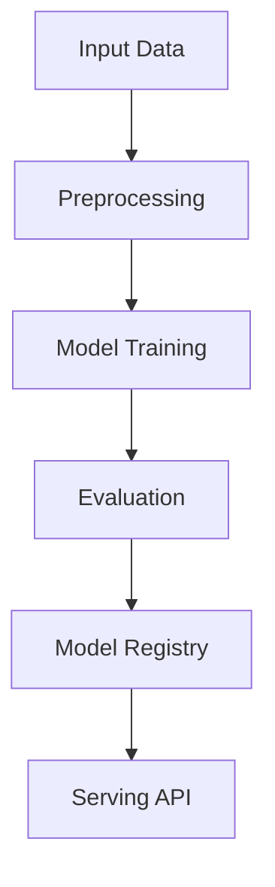

# prompt-engineering

## ∫ Mathematics & Theory

Prompt Engineering — Underlying equations and derivations

$$P(y|x, p) = \prod_{t=1}^{|y|} P(y_t | x, p, y_{

$$\hat{p} = \arg\max_p \mathbb{E}_{x \sim \mathcal{D}} [\log P(y^* | x, p)]$$

### Step-by-Step Derivation

Prompt engineering reformulates downstream tasks as language modeling. Given a prompt $p$, the model generates output $y$ autoregressively. Prompt tuning optimizes $p$ to maximize task-specific likelihood. Soft prompts are continuous embeddings optimized via gradient descent.

### Interactive Visualization

Interactive prompt comparison table; generation diversity vs prompt length; token probability explorer.

## ⚙ Architecture

Model structure, data flow, and layer breakdown

### Class Hierarchy

```
  PromptTemplate
  PromptTechnique
  PromptExample
  PromptEvaluator
  PromptOptimizer
  PromptEngineeringModel
```

### Data Flow



## ⚡ API Reference

FastAPI endpoints and model interfaces

| Method | Endpoint |
| --- | --- |
| `GET` | `/` |
| `GET` | `/health` |
| `GET` | `/metrics` |

## ▶ Usage

Code examples and CLI commands

### Training Script

```python
"""Training pipeline for Prompt Engineering."""

import argparse
import os
from pathlib import Path

from ai_core.logging import get_logger, setup_logging
from ai_core.model_registry import ModelRegistry

from prompt_engineering.data import load_prompt_dataset, save_dataset, train_test_split
from prompt_engineering.model import (
    PromptEngineeringModel,
    PromptEvaluator,
    PromptTemplate,
)

logger = get_logger(__name__)

def train(
    model_dir: Path,
    data_path: Path | None = None,
    n_samples: int = 500,
    vocab_size: int = 1000,
    model_id: str = "prompt-engineering-v1",
    base_model_name: str = "default",
    technique: str = "zero-shot",
    model_version: str = "1.0.0",
    register_to_mlflow: bool = False,
    random_seed: int = 42,
) -> dict:
    logger.info("Loading prompt dataset", n_samples=n_samples, technique=technique)
    X, y = load_prompt_dataset(data_path=data_path, n_samples=n_samples, random_seed=random_seed)

    X_train, X_test, y_train, y_test = train_test_split(X, y, test_size=0.2, random_seed=random_seed)
    logger.info("Data split", n_train=len(X_train), n_test=len(X_test))

    model_dir.mkdir(parents=True, exist_ok=True)
    save_dataset(X, y, model_dir / "training_data.npz")

    model = PromptEngineeringModel(model_id=model_id, base_model_name=base_model_name)
    model._init()

    template = PromptTemplate(
        template_id="default",
        template_text="Analyze the following: {input_text}",
        placeholders=["input_text"],
        technique=technique,
    )
    model.register_template(template)
    model.set_technique(technique)

    prompt = model.generate_prompt("default", input_text="Sample prompt for testing")
    logger.info("Generated prompt", prompt=prompt[:100])

    evaluator = PromptEvaluator()
    test_responses = [
        ("Sample response 1", "Expected output 1"),
        ("Sample response 2", "Expected output 2"),
        ("Sample response 3", "Expected output 3"),
    ]
    for response, expected in test_responses:
        scores = model.evaluate_prompt(prompt, response, expected)
        logger.info("Evaluation scores", scores=scores)

    avg_scores = evaluator.get_average_scores()
    logger.info("Average evaluation scores", scores=avg_scores)

    if len(test_responses) > 0:
        optimized_prompt = model.optimize_prompt(prompt, test_responses)
        logger.info("Optimized prompt", optimized=optimized_prompt[:100])

    model_path = model_dir / f"prompt_engineering_v{model_version}.json"
    model.save(str(model_path))

    metrics = {
        "n_samples": float(len(X)),
        "n_train": float(len(X_train)),
        "n_test": float(len(X_test)),
        "vocab_size": float(vocab_size),
        "technique": technique,
        "n_templates": float(len(model.templates)),
        "n_techniques": float(len(model.techniques)),
        "avg_relevance": avg_scores.get("relevance", 0.0),
        "avg_clarity": avg_scores.get("clarity", 0.0),
        "avg_completeness": avg_scores.get("completeness", 0.0),
        "avg_accuracy": avg_scores.get("accuracy", 0.0),
    }

    registry = ModelRegistry(base_dir=model_dir)
    registry.save_model(
        model_name="prompt-engineering",
        model_version=model_version,
        model_type="nlp",
        metrics=metrics,
        parameters={
            "model_id": model_id,
            "base_model_name": base_model_name,
            "technique": technique,
            "n_samples": n_samples,
            "vocab_size": vocab_size,
            "random_seed": random_seed,
        },
        artifacts={f"prompt_engineering_v{model_version}.json": model_path, "training_data.npz": model_dir / "training_data.npz"},
        tags={"framework": "numpy", "task": "prompt_engineering", "model_type": "PromptEngineering"},
    )

    if register_to_mlflow:
        registry.log_to_mlflow(
            model_name="prompt-engineering",
            model_version=model_version,
            metrics=metrics,
            params={"model_id": model_id, "technique": technique, "n_samples": n_samples},
            artifacts={"model": str(model_path)},
            tags={"model_type": "prompt_engineering", "framework": "numpy"},
        )

    return metrics

def main():
    parser = argparse.ArgumentParser(description="Train Prompt Engineering Model")
    parser.add_argument("--model-dir", type=Path, default=Path(os.getenv("MODEL_DIR", "/models")))
    parser.add_argument("--data-path", type=Path, default=None)
    parser.add_argument("--n-samples", type=int, default=int(os.getenv("N_SAMPLES", "500")))
    parser.add_argument("--vocab-size", type=int, default=int(os.getenv("VOCAB_SIZE", "1000")))
    parser.add_argument("--model-id", type=str, default=os.getenv("MODEL_ID", "prompt-engineering-v1"))
    parser.add_argument("--base-model-name", type=str, default=os.getenv("BASE_MODEL_NAME", "default"))
    parser.add_argument("--technique", type=str, default=os.getenv("TECHNIQUE", "zero-shot"), choices=["zero-shot", "few-shot", "chain-of-thought", "self-ask", "least-to-most", "meta-prompting", "context-amplification", "iterative"])
    parser.add_argument("--model-version", type=str, default=os.getenv("MODEL_VERSION", "1.0.0"))
    parser.add_argument("--random-seed", type=int, default=int(os.getenv("RANDOM_SEED", "42")))
    parser.add_argument("--register-mlflow", action="store_true", default=os.getenv("REGISTER_MLFLOW", "false").lower() == "true")
    parser.add_argument("--log-level", type=str, default=os.getenv("LOG_LEVEL", "INFO"))
    args = parser.parse_args()

    setup_logging(args.log_level)
    args.model_dir.mkdir(parents=True, exist_ok=True)

    metrics = train(
        model_dir=args.model_dir,
        data_path=args.data_path,
        n_samples=args.n_samples,
        vocab_size=args.vocab_size,
        model_id=args.model_id,
        base_model_name=args.base_model_name,
        technique=args.technique,
        model_version=args.model_version,
        register_to_mlflow=args.register_mlflow,
        random_seed=args.random_seed,
    )
    logger.info("Training finished", metrics=metrics, model_dir=str(args.model_dir))

if __name__ == "__main__":
    main()
```

### API Server

```python
"""Serving API for Prompt Engineering."""

import os
import time
from contextlib import asynccontextmanager
from pathlib import Path
from typing import Any

import numpy as np
from ai_core.drift import DriftDetector
from ai_core.fastapi_middleware import add_observability_middleware
from ai_core.logging import get_logger, setup_logging
from ai_core.metrics import MetricsCollector
from ai_core.model_registry import ModelRegistry
from fastapi import FastAPI, HTTPException, Response
from pydantic import BaseModel, Field

from prompt_engineering.data import DEFAULT_VOCAB_SIZE
from prompt_engineering.model import PromptEngineeringModel

logger = get_logger(__name__)

MODEL_DIR = Path(os.getenv("MODEL_DIR", "/models"))
MODEL_VERSION = os.getenv("MODEL_VERSION", "latest")
METRICS_PORT = int(os.getenv("PROMPT_ENGINEERING_METRICS_PORT", "9022"))
DRIFT_THRESHOLD = float(os.getenv("DRIFT_THRESHOLD", "0.2"))

class GenerateRequest(BaseModel):
    template_id: str = Field(..., min_length=1)
    technique: str = Field(default="zero-shot")
    input_text: str = Field(..., min_length=1)
    context: str | None = Field(default=None)
    examples: list[dict[str, str]] | None = Field(default=None)

class GenerateResponse(BaseModel):
    prompt: str
    template_id: str
    technique: str
    model_version: str

class EvaluateRequest(BaseModel):
    prompt: str = Field(..., min_length=1)
    response: str = Field(..., min_length=1)
    expected: str | None = Field(default=None)

class EvaluateResponse(BaseModel):
    scores: dict[str, float]
    average_score: float
    model_version: str

class OptimizeRequest(BaseModel):
    base_prompt: str = Field(..., min_length=1)
    responses: list[dict[str, str | None]] = Field(..., min_length=1)

class OptimizeResponse(BaseModel):
    optimized_prompt: str
    best_score: float
    optimization_history: list[dict[str, Any]]

class StatsResponse(BaseModel):
    model_id: str
    base_model_name: str
    n_templates: int
    n_techniques: int
    current_technique: str
    n_history_entries: int

OptimizeResponse.model_rebuild()

_model: PromptEngineeringModel | None = None
_model_version: str = "unknown"
_metrics: MetricsCollector | None = None
_drift_detector: DriftDetector | None = None
_reference_data: np.ndarray | None = None
_recent_predictions: list[list[float]] = []

@asynccontextmanager
async def lifespan(app: FastAPI):
    global _model, _model_version, _metrics, _drift_detector, _reference_data

    setup_logging(os.getenv("LOG_LEVEL", "INFO"))
    _metrics = MetricsCollector("prompt_engineering", port=METRICS_PORT)
    app.state.metrics = _metrics

    feature_names = [f"token_{i}" for i in range(DEFAULT_VOCAB_SIZE)]
    _drift_detector = DriftDetector(
        feature_names=feature_names,
        feature_types={f: "float" for f in feature_names},
        psi_threshold=DRIFT_THRESHOLD,
    )

    _model, _model_version = _load_model()
    _metrics.set_model_version(_model_version)
    _metrics.set_model_info(
        model_name="prompt-engineering",
        model_version=_model_version,
        model_type="nlp",
    )

    _reference_data = _load_reference_data()
    logger.info("Model loaded", model="prompt-engineering", version=_model_version)

    yield
    logger.info("Shutting down prompt-engineering API")

def _load_model() -> tuple[PromptEngineeringModel, str]:
    registry = ModelRegistry(base_dir=MODEL_DIR)
    try:
        if MODEL_VERSION == "latest":
            models = registry.list_models()
            pe_models = [m for m in models if m.get("model_name") == "prompt-engineering"]
            if pe_models:
                pe_models.sort(key=lambda m: m["model_version"], reverse=True)
                latest = pe_models[0]
                model_dir = Path(latest["artifact_path"])
                json_files = list(model_dir.glob("prompt_engineering_v*.json")) + list(model_dir.glob("*.json"))
                if json_files:
                    return PromptEngineeringModel.load(str(json_files[0])), latest["model_version"]
        else:
            model_dir = MODEL_DIR / "prompt-engineering" / MODEL_VERSION
            if model_dir.exists():
                json_files = list(model_dir.glob("prompt_engineering_v*.json")) + list(model_dir.glob("*.json"))
                if json_files:
                    return PromptEngineeringModel.load(str(json_files[0])), MODEL_VERSION
    except Exception as e:
        logger.warning(f"Registry lookup failed: {e}")

    json_path = MODEL_DIR / "prompt_engineering.json"
    if json_path.exists():
        return PromptEngineeringModel.load(str(json_path)), "legacy"

    candidate_paths = [
        Path("/app/artifacts/models/prompt_engineering_v1.0.0.json"),
        Path(__file__).resolve().parents[3] / "artifacts" / "models" / "prompt_engineering_v1.0.0.json",
    ]
    for p in candidate_paths:
        if p.exists():
            logger.info("Loading bundled baseline model", path=str(p))
            return PromptEngineeringModel.load(str(p)), "1.0.0-bundled"

    logger.warning("No pre-existing model found. Initializing baseline model.")
    model = PromptEngineeringModel(model_id="baseline", base_model_name="default")
    model._init()
    return model, "1.0.0-baseline"

def _load_reference_data() -> np.ndarray | None:
    from prompt_engineering.data import generate_synthetic_prompts
    X_base, _ = generate_synthetic_prompts(n_samples=100, random_seed=42)
    return X_base.astype(float)

app = FastAPI(
    title="Prompt Engineering API",
    description="Prompt Engineering service with various techniques (zero-shot, few-shot, chain-of-thought, self-ask, least-to-most, meta-prompting, context-amplification, iterative)",
    version="1.0.0",
    lifespan=lifespan,
)

add_observability_middleware(app)

@app.get("/")
def read_root():
    return {
        "service": "prompt_engineering-api",
        "version": "1.0.0",
        "model_version": _model_version,
        "available_techniques": _model.get_available_techniques() if _model else [],
        "endpoints": {
            "health": "/health",
            "generate": "POST /generate",
            "evaluate": "POST /evaluate",
            "optimize": "POST /optimize",
            "stats": "GET /stats",
            "metrics": "/metrics",
        },
    }

@app.get("/health")
def health_check():
    if _model is None:
        raise HTTPException(status_code=503, detail="Model not loaded")
    return {
        "status": "healthy",
        "model_loaded": True,
        "model_version": _model_version,
        "model_id": _model.model_id if _model else "unknown",
    }

@app.get("/metrics")
def metrics():
    from prometheus_client import CONTENT_TYPE_LATEST, generate_latest
    return Response(content=generate_latest(), media_type=CONTENT_TYPE_LATEST)

@app.post("/generate", response_model=GenerateResponse)
def generate_prompt(body: GenerateRequest):
    """Generate a prompt using the specified template and technique."""
    if _model is None or _metrics is None:
        raise HTTPException(status_code=503, detail="Model not loaded")

    start = time.time()
    try:
        prompt = _model.generate_prompt(
            body.template_id,
            technique=body.technique,
            input_text=body.input_text,
            context=body.context,
            examples=body.examples,
        )

        response = GenerateResponse(
            prompt=prompt,
            template_id=body.template_id,
            technique=body.technique,
            model_version=_model_version,
        )
        duration = time.time() - start
        _metrics.record_prediction(model_version=_model_version, duration=duration)

        _recent_predictions.append([float(len(body.input_text.split()))])
        if len(_recent_predictions) > 1000:
            _recent_predictions.pop(0)

        return response
    except Exception as e:
        _metrics.record_error(model_version=_model_version, error_type="generation")
        logger.exception("Prompt generation failed", error=str(e))
        raise HTTPException(status_code=500, detail="Prompt generation failed") from e

@app.post("/evaluate", response_model=EvaluateResponse)
def evaluate_prompt(body: EvaluateRequest):
    """Evaluate a prompt response against expected output."""
    if _model is None or _metrics is None:
        raise HTTPException(status_code=503, detail="Model not loaded")

    start = time.time()
    try:
        scores = _model.evaluate_prompt(body.prompt, body.response, body.expected)
        avg_score = float(np.mean(list(scores.values()))) if scores else 0.0

        response = EvaluateResponse(
            scores=scores,
            average_score=round(avg_score, 4),
            model_version=_model_version,
        )
        duration = time.time() - start
        _metrics.record_prediction(model_version=_model_version, duration=duration)

        return response
    except Exception as e:
        _metrics.record_error(model_version=_model_version, error_type="evaluation")
        logger.exception("Prompt evaluation failed", error=str(e))
        raise HTTPException(status_code=500, detail="Prompt evaluation failed") from e

@app.post("/optimize", response_model=OptimizeResponse)
def optimize_prompt(body: OptimizeRequest):
    """Optimize a prompt based on multiple response-evaluation pairs."""
    if _model is None or _metrics is None:
        raise HTTPException(status_code=503, detail="Model not loaded")

    start = time.time()
    try:
        responses = [(r["response"], r.get("expected")) for r in body.responses]
        optimized = _model.optimize_prompt(body.base_prompt, responses)
        best_score = _model.optimizer.get_best_score() if _model.optimizer else 0.0
        history = _model.optimizer.get_optimization_history() if _model.optimizer else []

        response = OptimizeResponse(
            optimized_prompt=optimized,
            best_score=round(best_score, 4),
            optimization_history=history,
        )
        duration = time.time() - start
        _metrics.record_prediction(model_version=_model_version, duration=duration)

        return response
    except Exception as e:
        _metrics.record_error(model_version=_model_version, error_type="optimization")
        logger.exception("Prompt optimization failed", error=str(e))
        raise HTTPException(status_code=500, detail="Prompt optimization failed") from e

@app.get("/stats", response_model=StatsResponse)
def get_stats():
    if _model is None:
        raise HTTPException(status_code=503, detail="Model not loaded")
    info = _model.to_dict()
    return StatsResponse(
        model_id=info["model_id"],
        base_model_name=info["base_model_name"],
        n_templates=info["n_templates"],
        n_techniques=info["n_techniques"],
        current_technique=info["current_technique"],
        n_history_entries=info["n_history_entries"],
        model_version=_model_version,
    )
```

### CLI Commands

```bash
uv run python -m prompt_engineering.train --model-dir ./artifacts/models
```

## 📊 Benchmarks

Test results and performance metrics

Run `pytest tests/test_models.py` and `pytest tests/test_apis.py` for detailed metrics.

Generated documentation for **prompt-engineering**
