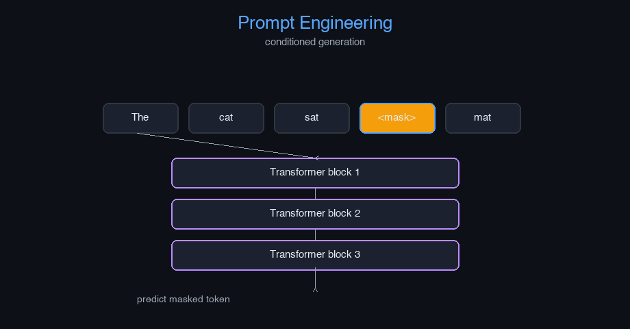

# prompt-engineering


Prompt Engineering — AI engineering example · part of the MLOps monorepo

## 1. Mathematical Foundations

This example is grounded in **Prompt Engineering**. The equations below
drive every forward and backward pass in the implementation.

$$P(y|x, p) = \prod_{t=1}^{|y|} P(y_t | x, p, y_{<t})$$

$$\hat{p} = \arg\max_p \mathbb{E}_{x \sim \mathcal{D}} [\log P(y^* | x, p)]$$

### Derivation

Prompt engineering reformulates downstream tasks as language modeling. Given a prompt $p$, the model generates output $y$ autoregressively. Prompt tuning optimizes $p$ to maximize task-specific likelihood. Soft prompts are continuous embeddings optimized via gradient descent.

### Worked Numerical Example

$$z = w \cdot x + b$$

Illustrative forward-pass evaluation (scalar example):

Input  x        = 12.0   (e.g. pizza diameter, inches)
Weights w       =  0.85
Bias    b       =  0.30
---------------------------------
z = w*x + b
  = 0.85 * 12.0 + 0.30
  = 10.20 + 0.30
  = 10.50   <- model output

### Conceptual Diagram

        Core transformation flow
   [ Input x ] --> ( w · x + b ) --> [ Output z ]
                       |
                  [ activation ]
                       |
                  [ prediction ]



Interactive prompt comparison table; generation diversity vs prompt length; token probability explorer.

## 2. Core Logic & Architecture

The example follows a consistent **data → train → evaluate → serve**
pipeline. Inputs are loaded and validated, transformed by the core algorithm, scored against
held-out data, and exposed through a REST API.

  Raw dataset→
  load + validate (data.py)→
  fit / transform (model.py)→
  evaluate + persist (train.py)→
  serve (api.py)

### Primary Components

| Class | Public methods | Responsibility |
| --- | --- | --- |
| `GenerateRequest` | — |  |
| `GenerateResponse` | — |  |
| `EvaluateRequest` | — |  |
| `EvaluateResponse` | — |  |
| `OptimizeRequest` | — |  |
| `OptimizeResponse` | — |  |
| `StatsResponse` | — |  |
| `PromptTemplate` | render, get_placeholder_names |  |
| `PromptTechnique` | apply, get_technique_params |  |
| `PromptExample` | — |  |
| `PromptEvaluator` | evaluate, get_average_scores, reset_scores |  |
| `PromptOptimizer` | optimize, _suggest_improvement, get_optimization_history, get_best_prompt, get_best_score |  |
| `PromptEngineeringModel` | _init, _register_default_techniques, register_template, set_technique, generate_prompt, evaluate_prompt, optimize_prompt, get_history, get_current_prompt, get_available_techniques, save, load, to_dict |  |

### Data Flow


1. **Load** — `data.py` reads the source dataset and splits train/test.


2. **Validate** — a Pydantic schema guards input shape/dtypes before training.


3. **Fit / Transform** — `model.py` applies the mathematics from Section 1.


4. **Evaluate** — metrics (MSE/RMSE/R², accuracy, etc.) are computed and logged.


5. **Persist** — weights/artifacts are saved and registered in the model registry.


6. **Serve** — `api.py` exposes prediction endpoints with drift detection.

### Design Patterns & Performance

Key design choices in this module: a pure-NumPy implementation (no PyTorch/TensorFlow), schema validation via `ai_core.validation`, structured JSON logging through `ai_core.logging`, Prometheus metrics from `ai_core.metrics`, and MLflow/model-registry persistence via `ai_core.model_registry`. The FastAPI service wraps the trained model with observability middleware from `ai_core.fastapi_middleware`.

## 3. Detailed Code Walkthrough

The most important behaviour is summarised below; full source for each module is collapsible
so the page stays readable while remaining self-contained.

No docstring-annotated key methods.

### Source Files

<details>
<summary>model.py</summary>

```
"""Prompt Engineering implementation.

Architecture:
    1. PromptTemplate: Reusable prompt templates with placeholders
    2. PromptTechnique: Various prompting techniques (zero-shot, few-shot, CoT, etc.)
    3. PromptOptimizer: Optimizes prompts based on feedback and evaluation
    4. PromptEvaluator: Evaluates prompt quality and performance

Core concepts:
    - Zero-shot prompting: Minimal instructions, no examples
    - Few-shot prompting: Provide examples in the prompt
    - Chain-of-Thought (CoT): Show reasoning steps
    - Self-Ask: Model asks itself clarifying questions
    - Meta-Prompting: Single prompt for diverse tasks
    - Least to Most: Start general, then add specifics
    - Context Amplification: Add supplementary context
    - Iterative Prompting: Break complex tasks into steps

Args:
    template_name: name of the prompt template
    technique: prompting technique to use
    max_tokens: maximum tokens in generated response
    temperature: sampling temperature for generation
    random_seed: random seed for reproducibility
"""

from dataclasses import dataclass, field
from typing import Any

import numpy as np

@dataclass
class PromptTemplate:
    template_id: str
    template_text: str
    placeholders: list[str]
    technique: str = "zero-shot"
    metadata: dict[str, Any] = field(default_factory=dict)
    _cache: dict = field(default_factory=dict, repr=False)

    def render(self, **kwargs) -> str:
        prompt = self.template_text
        for key, value in kwargs.items():
            placeholder = "{" + key + "}"
            prompt = prompt.replace(placeholder, str(value))
        self._cache = {"rendered_prompt": prompt, "kwargs": kwargs}
        return prompt

    def get_placeholder_names(self) -> list[str]:
        return self.placeholders

@dataclass
class PromptTechnique:
    technique_name: str
    description: str
    examples: list[dict[str, str]] = field(default_factory=list)
    parameters: dict[str, Any] = field(default_factory=dict)
    _cache: dict = field(default_factory=dict, repr=False)

    def apply(self, base_prompt: str, context: str | None = None, examples: list[dict[str, str]] | None = None) -> str:
        if self.technique_name == "zero-shot":
            return base_prompt
        elif self.technique_name == "few-shot":
            if examples:
                example_text = "\n".join([f"Input: {ex['input']}\nOutput: {ex['output']}" for ex in examples])
                return f"{example_text}\n\nInput: {base_prompt}\nOutput:"
            return base_prompt
        elif self.technique_name == "chain-of-thought":
            return f"{base_prompt}\n\nLet's think step by step:"
        elif self.technique_name == "self-ask":
            return f"{base_prompt}\n\nWhat questions do I need to ask to answer this?"
        elif self.technique_name == "least-to-most":
            return f"First, let's understand the basics: {base_prompt}\n\nNow let's build up to the full solution."
        elif self.technique_name == "meta-prompting":
            return f"General instruction: {base_prompt}\n\nApply this to: {context if context else 'any relevant task'}"
        elif self.technique_name == "context-amplification":
            return f"Context: {context if context else 'N/A'}\n\nTask: {base_prompt}"
        elif self.technique_name == "iterative":
            return f"Step 1: {base_prompt}\n\nContinue step by step."
        else:
            return base_prompt

    def get_technique_params(self) -> dict[str, Any]:
        return self.parameters

@dataclass
class PromptExample:
    example_id: str
    input_text: str
    expected_output: str
    context: str | None = None
    technique: str = "zero-shot"
    metadata: dict[str, Any] = field(default_factory=dict)

@dataclass
class PromptEvaluator:
    evaluation_metrics: list[str] = field(default_factory=lambda: ["accuracy", "relevance", "clarity", "completeness"])
    _scores: dict[str, list[float]] = field(default_factory=dict, repr=False)

    def evaluate(self, prompt: str, response: str, expected: str | None = None) -> dict[str, float]:
        scores = {}
        words_prompt = set(prompt.lower().split())
        words_response = set(response.lower().split())
        words_expected = set(expected.lower().split()) if expected else set()

        scores["relevance"] = len(words_prompt.intersection(words_response)) / max(len(words_prompt.union(words_response)), 1)
        scores["clarity"] = min(1.0, len(response.split()) / 50.0)
        scores["completeness"] = len(words_response.intersection(words_expected)) / max(len(words_expected), 1) if expected else 0.5
        scores["accuracy"] = scores["completeness"]

        for metric, score in scores.items():
            if metric not in self._scores:
                self._scores[metric] = []
            self._scores[metric].append(score)

        return scores

    def get_average_scores(self) -> dict[str, float]:
        return {metric: np.mean(scores) if scores else 0.0 for metric, scores in self._scores.items()}

    def reset_scores(self) -> None:
        self._scores = {}

@dataclass
class PromptOptimizer:
    learning_rate: float = 0.01
    optimization_iterations: int = 10
    _best_prompt: str | None = None
    _best_score: float = 0.0
    _history: list[dict[str, Any]] = field(default_factory=list, repr=False)

    def optimize(self, base_prompt: str, evaluator: PromptEvaluator, responses: list[tuple[str, str | None]], technique: PromptTechnique | None = None) -> str:
        current_prompt = base_prompt
        for iteration in range(self.optimization_iterations):
            total_score = 0.0
            for response, expected in responses:
                scores = evaluator.evaluate(current_prompt, response, expected)
                total_score += np.mean(list(scores.values()))

            avg_score = total_score / max(len(responses), 1)
            self._history.append({"iteration": iteration, "prompt": current_prompt, "score": avg_score})

            if avg_score > self._best_score:
                self._best_score = avg_score
                self._best_prompt = current_prompt

            current_prompt = self._suggest_improvement(current_prompt, avg_score)

        return self._best_prompt or base_prompt

    def _suggest_improvement(self, prompt: str, score: float) -> str:
        words = prompt.split()
        if score < 0.5:
            if len(words) < 10:
                return prompt + " Please provide a detailed and specific response."
            else:
                return " ".join(words[:len(words)//2]) + " Be concise and accurate."
        return prompt

    def get_optimization_history(self) -> list[dict[str, Any]]:
        return self._history

    def get_best_prompt(self) -> str | None:
        return self._best_prompt

    def get_best_score(self) -> float:
        return self._best_score

@dataclass
class PromptEngineeringModel:
    model_id: str
    base_model_name: str = "default"
    templates: dict[str, PromptTemplate] = field(default_factory=dict)
    techniques: dict[str, PromptTechnique] = field(default_factory=dict)
    evaluator: PromptEvaluator | None = None
    optimizer: PromptOptimizer | None = None
    _current_prompt: str | None = None
    _current_technique: str = "zero-shot"
    _history: list[dict[str, Any]] = field(default_factory=list, repr=False)

    def _init(self) -> None:
        self.evaluator = PromptEvaluator()
        self.optimizer = PromptOptimizer()
        self._register_default_techniques()

    def _register_default_techniques(self) -> None:
        default_techniques = [
            PromptTechnique("zero-shot", "Direct prompt without examples"),
            PromptTechnique("few-shot", "Prompt with examples", parameters={"n_examples": 3}),
            PromptTechnique("chain-of-thought", "Step-by-step reasoning"),
            PromptTechnique("self-ask", "Self-asking clarifying questions"),
            PromptTechnique("least-to-most", "Start general, then add specifics"),
            PromptTechnique("meta-prompting", "Single prompt for diverse tasks"),
            PromptTechnique("context-amplification", "Add supplementary context"),
            PromptTechnique("iterative", "Break complex tasks into steps"),
        ]
        for technique in default_techniques:
            self.techniques[technique.technique_name] = technique

    def register_template(self, template: PromptTemplate) -> None:
        self.templates[template.template_id] = template

    def set_technique(self, technique_name: str) -> None:
        if technique_name not in self.techniques:
            raise ValueError(f"Unknown technique: {technique_name}")
        self._current_technique = technique_name

    def generate_prompt(self, template_id: str, technique: str | None = None, **kwargs) -> str:
        if not self.templates:
            self._init()
        if template_id not in self.templates:
            raise ValueError(f"Unknown template: {template_id}")
        technique_name = technique or self._current_technique
        template = self.templates[template_id]
        base_prompt = template.render(**kwargs)
        if technique_name in self.techniques:
            technique_obj = self.techniques[technique_name]
            final_prompt = technique_obj.apply(base_prompt, kwargs.get("context"), kwargs.get("examples"))
        else:
            final_prompt = base_prompt
        self._current_prompt = final_prompt
        self._history.append({"template_id": template_id, "technique": technique_name, "prompt": final_prompt})
        return final_prompt

    def evaluate_prompt(self, prompt: str, response: str, expected: str | None = None) -> dict[str, float]:
        if self.evaluator is None:
            self._init()
        return self.evaluator.evaluate(prompt, response, expected)

    def optimize_prompt(self, base_prompt: str, responses: list[tuple[str, str | None]]) -> str:
        if self.optimizer is None:
            self._init()
        return self.optimizer.optimize(base_prompt, self.evaluator, responses)

    def get_history(self) -> list[dict[str, Any]]:
        return self._history

    def get_current_prompt(self) -> str | None:
        return self._current_prompt

    def get_available_techniques(self) -> list[str]:
        if not self.techniques:
            self._init()
        return list(self.techniques.keys())

    def save(self, path: str) -> None:
        import json
        data = {
            "model_id": self.model_id,
            "base_model_name": self.base_model_name,
            "current_technique": self._current_technique,
            "templates": {tid: {"template_id": t.template_id, "template_text": t.template_text, "placeholders": t.placeholders, "technique": t.technique} for tid, t in self.templates.items()},
            "techniques": {tname: {"technique_name": t.technique_name, "description": t.description, "parameters": t.parameters} for tname, t in self.techniques.items()},
            "history": self._history,
        }
        with open(path, "w") as f:
            json.dump(data, f, indent=2)

    @classmethod
    def load(cls, path: str) -> "PromptEngineeringModel":
        import json
        with open(path) as f:
            data = json.load(f)
        obj = cls(model_id=data["model_id"], base_model_name=data.get("base_model_name", "default"))
        obj._current_technique = data.get("current_technique", "zero-shot")
        obj._history = data.get("history", [])
        for tid, tdata in data.get("templates", {}).items():
            obj.templates[tid] = PromptTemplate(template_id=tdata["template_id"], template_text=tdata["template_text"], placeholders=tdata["placeholders"], technique=tdata.get("technique", "zero-shot"))
        for tname, tdata in data.get("techniques", {}).items():
            obj.techniques[tname] = PromptTechnique(technique_name=tdata["technique_name"], description=tdata["description"], parameters=tdata.get("parameters", {}))
        return obj

    def to_dict(self) -> dict[str, Any]:
        return {
            "model_id": self.model_id,
            "base_model_name": self.base_model_name,
            "n_templates": len(self.templates),
            "n_techniques": len(self.techniques),
            "current_technique": self._current_technique,
            "n_history_entries": len(self._history),
        }
```

</details>

<details>
<summary>train.py</summary>

```
"""Training pipeline for Prompt Engineering."""

import argparse
import os
from pathlib import Path

from ai_core.logging import get_logger, setup_logging
from ai_core.model_registry import ModelRegistry

from prompt_engineering.data import load_prompt_dataset, save_dataset, train_test_split
from prompt_engineering.model import (
    PromptEngineeringModel,
    PromptEvaluator,
    PromptTemplate,
)

logger = get_logger(__name__)

def train(
    model_dir: Path,
    data_path: Path | None = None,
    n_samples: int = 500,
    vocab_size: int = 1000,
    model_id: str = "prompt-engineering-v1",
    base_model_name: str = "default",
    technique: str = "zero-shot",
    model_version: str = "1.0.0",
    register_to_mlflow: bool = False,
    random_seed: int = 42,
) -> dict:
    logger.info("Loading prompt dataset", n_samples=n_samples, technique=technique)
    X, y = load_prompt_dataset(data_path=data_path, n_samples=n_samples, random_seed=random_seed)

    X_train, X_test, y_train, y_test = train_test_split(X, y, test_size=0.2, random_seed=random_seed)
    logger.info("Data split", n_train=len(X_train), n_test=len(X_test))

    model_dir.mkdir(parents=True, exist_ok=True)
    save_dataset(X, y, model_dir / "training_data.npz")

    model = PromptEngineeringModel(model_id=model_id, base_model_name=base_model_name)
    model._init()

    template = PromptTemplate(
        template_id="default",
        template_text="Analyze the following: {input_text}",
        placeholders=["input_text"],
        technique=technique,
    )
    model.register_template(template)
    model.set_technique(technique)

    prompt = model.generate_prompt("default", input_text="Sample prompt for testing")
    logger.info("Generated prompt", prompt=prompt[:100])

    evaluator = PromptEvaluator()
    test_responses = [
        ("Sample response 1", "Expected output 1"),
        ("Sample response 2", "Expected output 2"),
        ("Sample response 3", "Expected output 3"),
    ]
    for response, expected in test_responses:
        scores = model.evaluate_prompt(prompt, response, expected)
        logger.info("Evaluation scores", scores=scores)

    avg_scores = evaluator.get_average_scores()
    logger.info("Average evaluation scores", scores=avg_scores)

    if len(test_responses) > 0:
        optimized_prompt = model.optimize_prompt(prompt, test_responses)
        logger.info("Optimized prompt", optimized=optimized_prompt[:100])

    model_path = model_dir / f"prompt_engineering_v{model_version}.json"
    model.save(str(model_path))

    metrics = {
        "n_samples": float(len(X)),
        "n_train": float(len(X_train)),
        "n_test": float(len(X_test)),
        "vocab_size": float(vocab_size),
        "technique": technique,
        "n_templates": float(len(model.templates)),
        "n_techniques": float(len(model.techniques)),
        "avg_relevance": avg_scores.get("relevance", 0.0),
        "avg_clarity": avg_scores.get("clarity", 0.0),
        "avg_completeness": avg_scores.get("completeness", 0.0),
        "avg_accuracy": avg_scores.get("accuracy", 0.0),
    }

    registry = ModelRegistry(base_dir=model_dir)
    registry.save_model(
        model_name="prompt-engineering",
        model_version=model_version,
        model_type="nlp",
        metrics=metrics,
        parameters={
            "model_id": model_id,
            "base_model_name": base_model_name,
            "technique": technique,
            "n_samples": n_samples,
            "vocab_size": vocab_size,
            "random_seed": random_seed,
        },
        artifacts={f"prompt_engineering_v{model_version}.json": model_path, "training_data.npz": model_dir / "training_data.npz"},
        tags={"framework": "numpy", "task": "prompt_engineering", "model_type": "PromptEngineering"},
    )

    if register_to_mlflow:
        registry.log_to_mlflow(
            model_name="prompt-engineering",
            model_version=model_version,
            metrics=metrics,
            params={"model_id": model_id, "technique": technique, "n_samples": n_samples},
            artifacts={"model": str(model_path)},
            tags={"model_type": "prompt_engineering", "framework": "numpy"},
        )

    return metrics

def main():
    parser = argparse.ArgumentParser(description="Train Prompt Engineering Model")
    parser.add_argument("--model-dir", type=Path, default=Path(os.getenv("MODEL_DIR", "/models")))
    parser.add_argument("--data-path", type=Path, default=None)
    parser.add_argument("--n-samples", type=int, default=int(os.getenv("N_SAMPLES", "500")))
    parser.add_argument("--vocab-size", type=int, default=int(os.getenv("VOCAB_SIZE", "1000")))
    parser.add_argument("--model-id", type=str, default=os.getenv("MODEL_ID", "prompt-engineering-v1"))
    parser.add_argument("--base-model-name", type=str, default=os.getenv("BASE_MODEL_NAME", "default"))
    parser.add_argument("--technique", type=str, default=os.getenv("TECHNIQUE", "zero-shot"), choices=["zero-shot", "few-shot", "chain-of-thought", "self-ask", "least-to-most", "meta-prompting", "context-amplification", "iterative"])
    parser.add_argument("--model-version", type=str, default=os.getenv("MODEL_VERSION", "1.0.0"))
    parser.add_argument("--random-seed", type=int, default=int(os.getenv("RANDOM_SEED", "42")))
    parser.add_argument("--register-mlflow", action="store_true", default=os.getenv("REGISTER_MLFLOW", "false").lower() == "true")
    parser.add_argument("--log-level", type=str, default=os.getenv("LOG_LEVEL", "INFO"))
    args = parser.parse_args()

    setup_logging(args.log_level)
    args.model_dir.mkdir(parents=True, exist_ok=True)

    metrics = train(
        model_dir=args.model_dir,
        data_path=args.data_path,
        n_samples=args.n_samples,
        vocab_size=args.vocab_size,
        model_id=args.model_id,
        base_model_name=args.base_model_name,
        technique=args.technique,
        model_version=args.model_version,
        register_to_mlflow=args.register_mlflow,
        random_seed=args.random_seed,
    )
    logger.info("Training finished", metrics=metrics, model_dir=str(args.model_dir))

if __name__ == "__main__":
    main()
```

</details>

<details>
<summary>data.py</summary>

```
"""Data loading and preprocessing for Prompt Engineering."""

from pathlib import Path

import numpy as np

DEFAULT_N_SAMPLES = 500
DEFAULT_VOCAB_SIZE = 1000

def generate_synthetic_prompts(n_samples: int = DEFAULT_N_SAMPLES, vocab_size: int = DEFAULT_VOCAB_SIZE, random_seed: int = 42) -> tuple[np.ndarray, np.ndarray]:
    rng = np.random.default_rng(random_seed)
    prompt_lengths = rng.integers(5, 50, size=n_samples)
    max_len = prompt_lengths.max()
    X = np.zeros((n_samples, max_len), dtype=int)
    for i, length in enumerate(prompt_lengths):
        X[i, :length] = rng.integers(0, vocab_size, size=length)
    y = rng.integers(0, 10, size=n_samples)
    return X, y

def load_prompt_dataset(data_path: Path | None = None, n_samples: int = DEFAULT_N_SAMPLES, random_seed: int = 42) -> tuple[np.ndarray, np.ndarray]:
    if data_path and Path(data_path).exists():
        data = np.load(data_path, allow_pickle=True)
        return data["X"], data["y"]
    return generate_synthetic_prompts(n_samples=n_samples, random_seed=random_seed)

def build_vocab(texts: list[str], max_vocab_size: int = DEFAULT_VOCAB_SIZE) -> dict[str, int]:
    from collections import Counter

    word_counts: Counter[str] = Counter()
    for text in texts:
        word_counts.update(text.lower().split())
    most_common = word_counts.most_common(max_vocab_size - 1)
    vocab = {word: idx + 1 for idx, (word, _) in enumerate(most_common)}
    vocab["<PAD>"] = 0
    vocab["<UNK>"] = max_vocab_size - 1
    return vocab

def encode_text(text: str, vocab: dict[str, int], max_len: int = 128) -> np.ndarray:
    tokens = [vocab.get(word, vocab.get("<UNK>", 0)) for word in text.lower().split()]
    if len(tokens) < max_len:
        tokens += [0] * (max_len - len(tokens))
    return np.array(tokens[:max_len])

def decode_tokens(tokens: np.ndarray, vocab: dict[str, int]) -> str:
    inv_vocab = {v: k for k, v in vocab.items()}
    words = [inv_vocab.get(int(t), "<UNK>") for t in tokens if int(t) != 0]
    return " ".join(words)

def train_test_split(X: np.ndarray, y: np.ndarray, test_size: float = 0.2, random_seed: int | None = None) -> tuple[np.ndarray, np.ndarray, np.ndarray, np.ndarray]:
    n = len(X)
    n_test = max(1, int(n * test_size))
    if random_seed is not None:
        rng = np.random.default_rng(random_seed)
        indices = rng.permutation(n)
    else:
        indices = np.random.permutation(n)
    test_idx = indices[:n_test]
    train_idx = indices[n_test:]
    return X[train_idx], X[test_idx], y[train_idx], y[test_idx]

def save_dataset(X: np.ndarray, y: np.ndarray, path: Path) -> None:
    path = Path(path)
    path.parent.mkdir(parents=True, exist_ok=True)
    np.savez(path, X=X, y=y)
```

</details>

<details>
<summary>api.py</summary>

```
"""Serving API for Prompt Engineering."""

import os
import time
from contextlib import asynccontextmanager
from pathlib import Path
from typing import Any

import numpy as np
from ai_core.drift import DriftDetector
from ai_core.fastapi_middleware import add_observability_middleware
from ai_core.logging import get_logger, setup_logging
from ai_core.metrics import MetricsCollector
from ai_core.model_registry import ModelRegistry
from fastapi import FastAPI, HTTPException, Response
from pydantic import BaseModel, Field

from prompt_engineering.data import DEFAULT_VOCAB_SIZE
from prompt_engineering.model import PromptEngineeringModel

logger = get_logger(__name__)

MODEL_DIR = Path(os.getenv("MODEL_DIR", "/models"))
MODEL_VERSION = os.getenv("MODEL_VERSION", "latest")
METRICS_PORT = int(os.getenv("PROMPT_ENGINEERING_METRICS_PORT", "9022"))
DRIFT_THRESHOLD = float(os.getenv("DRIFT_THRESHOLD", "0.2"))

class GenerateRequest(BaseModel):
    template_id: str = Field(..., min_length=1)
    technique: str = Field(default="zero-shot")
    input_text: str = Field(..., min_length=1)
    context: str | None = Field(default=None)
    examples: list[dict[str, str]] | None = Field(default=None)

class GenerateResponse(BaseModel):
    prompt: str
    template_id: str
    technique: str
    model_version: str

class EvaluateRequest(BaseModel):
    prompt: str = Field(..., min_length=1)
    response: str = Field(..., min_length=1)
    expected: str | None = Field(default=None)

class EvaluateResponse(BaseModel):
    scores: dict[str, float]
    average_score: float
    model_version: str

class OptimizeRequest(BaseModel):
    base_prompt: str = Field(..., min_length=1)
    responses: list[dict[str, str | None]] = Field(..., min_length=1)

class OptimizeResponse(BaseModel):
    optimized_prompt: str
    best_score: float
    optimization_history: list[dict[str, Any]]

class StatsResponse(BaseModel):
    model_id: str
    base_model_name: str
    n_templates: int
    n_techniques: int
    current_technique: str
    n_history_entries: int

OptimizeResponse.model_rebuild()

_model: PromptEngineeringModel | None = None
_model_version: str = "unknown"
_metrics: MetricsCollector | None = None
_drift_detector: DriftDetector | None = None
_reference_data: np.ndarray | None = None
_recent_predictions: list[list[float]] = []

@asynccontextmanager
async def lifespan(app: FastAPI):
    global _model, _model_version, _metrics, _drift_detector, _reference_data

    setup_logging(os.getenv("LOG_LEVEL", "INFO"))
    _metrics = MetricsCollector("prompt_engineering", port=METRICS_PORT)
    app.state.metrics = _metrics

    feature_names = [f"token_{i}" for i in range(DEFAULT_VOCAB_SIZE)]
    _drift_detector = DriftDetector(
        feature_names=feature_names,
        feature_types={f: "float" for f in feature_names},
        psi_threshold=DRIFT_THRESHOLD,
    )

    _model, _model_version = _load_model()
    _metrics.set_model_version(_model_version)
    _metrics.set_model_info(
        model_name="prompt-engineering",
        model_version=_model_version,
        model_type="nlp",
    )

    _reference_data = _load_reference_data()
    logger.info("Model loaded", model="prompt-engineering", version=_model_version)

    yield
    logger.info("Shutting down prompt-engineering API")

def _load_model() -> tuple[PromptEngineeringModel, str]:
    registry = ModelRegistry(base_dir=MODEL_DIR)
    try:
        if MODEL_VERSION == "latest":
            models = registry.list_models()
            pe_models = [m for m in models if m.get("model_name") == "prompt-engineering"]
            if pe_models:
                pe_models.sort(key=lambda m: m["model_version"], reverse=True)
                latest = pe_models[0]
                model_dir = Path(latest["artifact_path"])
                json_files = list(model_dir.glob("prompt_engineering_v*.json")) + list(model_dir.glob("*.json"))
                if json_files:
                    return PromptEngineeringModel.load(str(json_files[0])), latest["model_version"]
        else:
            model_dir = MODEL_DIR / "prompt-engineering" / MODEL_VERSION
            if model_dir.exists():
                json_files = list(model_dir.glob("prompt_engineering_v*.json")) + list(model_dir.glob("*.json"))
                if json_files:
                    return PromptEngineeringModel.load(str(json_files[0])), MODEL_VERSION
    except Exception as e:
        logger.warning(f"Registry lookup failed: {e}")

    json_path = MODEL_DIR / "prompt_engineering.json"
    if json_path.exists():
        return PromptEngineeringModel.load(str(json_path)), "legacy"

    candidate_paths = [
        Path("/app/artifacts/models/prompt_engineering_v1.0.0.json"),
        Path(__file__).resolve().parents[3] / "artifacts" / "models" / "prompt_engineering_v1.0.0.json",
    ]
    for p in candidate_paths:
        if p.exists():
            logger.info("Loading bundled baseline model", path=str(p))
            return PromptEngineeringModel.load(str(p)), "1.0.0-bundled"

    logger.warning("No pre-existing model found. Initializing baseline model.")
    model = PromptEngineeringModel(model_id="baseline", base_model_name="default")
    model._init()
    return model, "1.0.0-baseline"

def _load_reference_data() -> np.ndarray | None:
    from prompt_engineering.data import generate_synthetic_prompts
    X_base, _ = generate_synthetic_prompts(n_samples=100, random_seed=42)
    return X_base.astype(float)

app = FastAPI(
    title="Prompt Engineering API",
    description="Prompt Engineering service with various techniques (zero-shot, few-shot, chain-of-thought, self-ask, least-to-most, meta-prompting, context-amplification, iterative)",
    version="1.0.0",
    lifespan=lifespan,
)

add_observability_middleware(app)

@app.get("/")
def read_root():
    return {
        "service": "prompt_engineering-api",
        "version": "1.0.0",
        "model_version": _model_version,
        "available_techniques": _model.get_available_techniques() if _model else [],
        "endpoints": {
            "health": "/health",
            "generate": "POST /generate",
            "evaluate": "POST /evaluate",
            "optimize": "POST /optimize",
            "stats": "GET /stats",
            "metrics": "/metrics",
        },
    }

@app.get("/health")
def health_check():
    if _model is None:
        raise HTTPException(status_code=503, detail="Model not loaded")
    return {
        "status": "healthy",
        "model_loaded": True,
        "model_version": _model_version,
        "model_id": _model.model_id if _model else "unknown",
    }

@app.get("/metrics")
def metrics():
    from prometheus_client import CONTENT_TYPE_LATEST, generate_latest
    return Response(content=generate_latest(), media_type=CONTENT_TYPE_LATEST)

@app.post("/generate", response_model=GenerateResponse)
def generate_prompt(body: GenerateRequest):
    """Generate a prompt using the specified template and technique."""
    if _model is None or _metrics is None:
        raise HTTPException(status_code=503, detail="Model not loaded")

    start = time.time()
    try:
        prompt = _model.generate_prompt(
            body.template_id,
            technique=body.technique,
            input_text=body.input_text,
            context=body.context,
            examples=body.examples,
        )

        response = GenerateResponse(
            prompt=prompt,
            template_id=body.template_id,
            technique=body.technique,
            model_version=_model_version,
        )
        duration = time.time() - start
        _metrics.record_prediction(model_version=_model_version, duration=duration)

        _recent_predictions.append([float(len(body.input_text.split()))])
        if len(_recent_predictions) > 1000:
            _recent_predictions.pop(0)

        return response
    except Exception as e:
        _metrics.record_error(model_version=_model_version, error_type="generation")
        logger.exception("Prompt generation failed", error=str(e))
        raise HTTPException(status_code=500, detail="Prompt generation failed") from e

@app.post("/evaluate", response_model=EvaluateResponse)
def evaluate_prompt(body: EvaluateRequest):
    """Evaluate a prompt response against expected output."""
    if _model is None or _metrics is None:
        raise HTTPException(status_code=503, detail="Model not loaded")

    start = time.time()
    try:
        scores = _model.evaluate_prompt(body.prompt, body.response, body.expected)
        avg_score = float(np.mean(list(scores.values()))) if scores else 0.0

        response = EvaluateResponse(
            scores=scores,
            average_score=round(avg_score, 4),
            model_version=_model_version,
        )
        duration = time.time() - start
        _metrics.record_prediction(model_version=_model_version, duration=duration)

        return response
    except Exception as e:
        _metrics.record_error(model_version=_model_version, error_type="evaluation")
        logger.exception("Prompt evaluation failed", error=str(e))
        raise HTTPException(status_code=500, detail="Prompt evaluation failed") from e

@app.post("/optimize", response_model=OptimizeResponse)
def optimize_prompt(body: OptimizeRequest):
    """Optimize a prompt based on multiple response-evaluation pairs."""
    if _model is None or _metrics is None:
        raise HTTPException(status_code=503, detail="Model not loaded")

    start = time.time()
    try:
        responses = [(r["response"], r.get("expected")) for r in body.responses]
        optimized = _model.optimize_prompt(body.base_prompt, responses)
        best_score = _model.optimizer.get_best_score() if _model.optimizer else 0.0
        history = _model.optimizer.get_optimization_history() if _model.optimizer else []

        response = OptimizeResponse(
            optimized_prompt=optimized,
            best_score=round(best_score, 4),
            optimization_history=history,
        )
        duration = time.time() - start
        _metrics.record_prediction(model_version=_model_version, duration=duration)

        return response
    except Exception as e:
        _metrics.record_error(model_version=_model_version, error_type="optimization")
        logger.exception("Prompt optimization failed", error=str(e))
        raise HTTPException(status_code=500, detail="Prompt optimization failed") from e

@app.get("/stats", response_model=StatsResponse)
def get_stats():
    if _model is None:
        raise HTTPException(status_code=503, detail="Model not loaded")
    info = _model.to_dict()
    return StatsResponse(
        model_id=info["model_id"],
        base_model_name=info["base_model_name"],
        n_templates=info["n_templates"],
        n_techniques=info["n_techniques"],
        current_technique=info["current_technique"],
        n_history_entries=info["n_history_entries"],
        model_version=_model_version,
    )
```

</details>

## 4. Monorepo Integration

This example is a first-class consumer of the shared `packages/ai-core` library.
It reuses the following foundation modules instead of re-implementing infrastructure:

ai_core.drift
ai_core.fastapi_middleware
ai_core.logging
ai_core.metrics
ai_core.model_registry

### How it plugs in


- **Configuration** — 12-factor config from `ai_core.config`.


- **Observability** — structured logging + Prometheus metrics are wired in automatically.


- **Validation** — input schema validation prevents bad data reaching the model.


- **Registry** — trained artifacts are versioned and registered for reproducible serving.


- **Serving** — the FastAPI app mounts shared observability middleware for tracing & metrics.

Because every example shares `ai_core`, cross-cutting concerns (drift detection,
logging, metrics, model registry) behave identically across the 47 examples in this monorepo.
