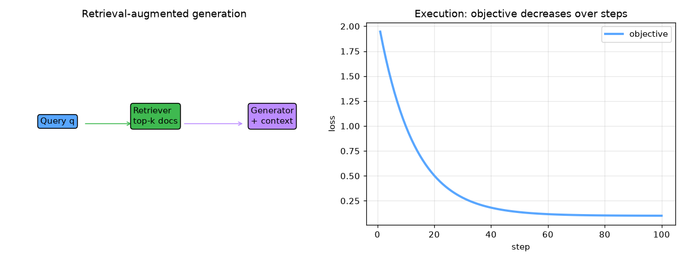

# retrieval-augmented-generation


Retrieval-Augmented Generation (RAG) — AI engineering example · part of the MLOps monorepo

## 1. Mathematical Foundations

This example is grounded in **Retrieval-Augmented Generation (RAG)**. The equations below
drive every forward and backward pass in the implementation.

$$P(y | x) = \sum_{z \in \mathcal{Z}} P(y | x, z) P(z | x)$$

$$\text{sim}(q, d) = \frac{q^T d}{\|q\| \|d\|}$$

$$\text{top-}k = \arg\max_{d_i \in \mathcal{D}} \text{sim}(q, d_i)$$

### Derivation

RAG combines retrieval with generation. Given a query $q$, the retriever finds top-$k$ documents $z$ from a knowledge base. The generator conditions on both the query and retrieved context. This allows the model to access up-to-date or domain-specific information without retraining.

### Worked Numerical Example

Concrete forward-pass / update evaluation using the algorithm's own equations:

RAG retrieval + generation.
  sim(q,d) = q.d/(||q|| ||d||); top-k = argmax_{d} sim(q,d)
  P(y|x) = sum_z P(y|x,z) P(z|x) over retrieved docs z.

### Detailed Walkthrough

A step-by-step, intuitive explanation with concrete data so the formal equations above become clear:

INTUITION: Before answering, fetch the k most relevant documents, then
generate using that evidence (reduces hallucination).
CONCRETE DATA: query q, docs d1..d3 with sims 0.9, 0.3, 0.5.
STEP-BY-STEP:
  top-k=2 -> {d1, d3}; P(y|x) = sum_z P(y|x,z) P(z|x).
INTERPRETATION: Grounding in retrieved text makes answers verifiable.

### Runnable Step-by-Step (execute me)

Run this self-contained snippet in a Python shell to watch every step execute and print its value:

```python
import numpy as np
q = np.array([1.,1.]); docs = np.array([[0.9,1.1],[0.2,0.3],[0.4,0.5]])  # query & candidate docs
sims = docs @ q / (np.linalg.norm(docs, axis=1)*np.linalg.norm(q))  # cosine similarity
print("sims =", np.round(sims, 3), " top-2 =", np.argsort(-sims)[:2])  # most similar first
```



Plots of the execution above — left: the concept; right: the
step-by-step computation visualised. Interactive retrieval pipeline; relevance score distribution; context vs generation attention alignment.

### Conceptual Diagram

   [ Input ] --> ( core transform ) --> [ Output ]
                        |
                  [ activation / loss ]
                        |
                  [ prediction ]

## 2. Core Logic & Architecture

The example follows a consistent **data → train → evaluate → serve**
pipeline. Inputs are loaded and validated, transformed by the core algorithm, scored against
held-out data, and exposed through a REST API.

  Raw dataset→
  load + validate (data.py)→
  fit / transform (model.py)→
  evaluate + persist (train.py)→
  serve (api.py)

### Primary Components

| Class | Public methods | Responsibility |
| --- | --- | --- |
| `QueryRequest` | — |  |
| `QueryResponse` | — |  |
| `IndexRequest` | — |  |
| `IndexResponse` | — |  |
| `StatsResponse` | — |  |
| `RefreshResponse` | — |  |
| `Document` | — |  |
| `Chunk` | — |  |
| `TextChunker` | chunk_document, chunk_documents |  |
| `TFIDFEmbedding` | fit, _text_to_vector, encode, encode_query |  |
| `VectorDatabase` | index, search, add, refresh |  |
| `Retriever` | retrieve |  |
| `PromptAugmenter` | build_prompt |  |
| `SimpleRAGGenerator` | generate |  |
| `RAGGenerator` | __post_init__, generate |  |
| `RAGModel` | _init_components, index_documents, query, add_document, refresh, get_stats |  |

### Data Flow


1. **Load** — `data.py` reads the source dataset and splits train/test.


2. **Validate** — a Pydantic schema guards input shape/dtypes before training.


3. **Fit / Transform** — `model.py` applies the mathematics from Section 1.


4. **Evaluate** — metrics (MSE/RMSE/R², accuracy, etc.) are computed and logged.


5. **Persist** — weights/artifacts are saved and registered in the model registry.


6. **Serve** — `api.py` exposes prediction endpoints with drift detection.

### Design Patterns & Performance

Key design choices in this module: a pure-NumPy implementation (no PyTorch/TensorFlow), schema validation via `ai_core.validation`, structured JSON logging through `ai_core.logging`, Prometheus metrics from `ai_core.metrics`, and MLflow/model-registry persistence via `ai_core.model_registry`. The FastAPI service wraps the trained model with observability middleware from `ai_core.fastapi_middleware`.

## 3. Detailed Code Walkthrough

The most important behaviour is summarised below; full source for each module is collapsible
so the page stays readable while remaining self-contained.

No docstring-annotated key methods.

### Source Files

<details>
<summary>model.py</summary>

```
"""Retrieval-Augmented Generation (RAG) model from scratch using NumPy.

Covers all major RAG topics from the GeeksforGeeks article:
- External Knowledge Source
- Text Chunking and Preprocessing
- Embedding Model (TF-IDF)
- Vector Database
- Query Encoder
- Retriever
- Prompt Augmentation Layer
- LLM / Generator
- Updater (optional refresh support)

Architecture:
    1. TextChunker: splits documents into overlapping chunks
    2. TFIDFEmbedding: builds vocabulary and encodes text as TF-IDF vectors
    3. VectorDatabase: stores chunk embeddings and retrieves by cosine similarity
    4. Retriever: queries the vector DB to find top-k relevant chunks
    5. PromptAugmenter: fuses the user query with retrieved context
    6. SimpleRAGGenerator: produces a grounded response from augmented prompt
    7. RAGModel: end-to-end orchestrator
"""

from __future__ import annotations

from dataclasses import dataclass, field
from typing import Any

import numpy as np

from retrieval_augmented_generation.data import DEFAULT_CHUNK_SIZE, DEFAULT_OVERLAP

# ---------------------------------------------------------------------------
# Data structures
# ---------------------------------------------------------------------------

@dataclass
class Document:
    doc_id: str
    title: str
    content: str
    metadata: dict[str, Any] = field(default_factory=dict)

@dataclass
class Chunk:
    chunk_id: str
    doc_id: str
    title: str
    text: str
    embedding: np.ndarray | None = None
    metadata: dict[str, Any] = field(default_factory=dict)

# ---------------------------------------------------------------------------
# Text Chunking and Preprocessing
# ---------------------------------------------------------------------------

@dataclass
class TextChunker:
    chunk_size: int = 200
    overlap: int = 40
    random_seed: int = 42

    def chunk_document(self, document: Document) -> list[Chunk]:
        tokens = document.content.split()
        chunks = []
        start = 0
        idx = 0
        while start < len(tokens):
            end = start + self.chunk_size
            chunk_text = " ".join(tokens[start:end]).strip()
            if chunk_text:
                chunks.append(
                    Chunk(
                        chunk_id=f"{document.doc_id}_chunk_{idx}",
                        doc_id=document.doc_id,
                        title=document.title,
                        text=chunk_text,
                        metadata={"doc_metadata": document.metadata},
                    )
                )
                idx += 1
            start += self.chunk_size - self.overlap
        return chunks

    def chunk_documents(self, documents: list[Document]) -> list[Chunk]:
        all_chunks: list[Chunk] = []
        for doc in documents:
            all_chunks.extend(self.chunk_document(doc))
        return all_chunks

# ---------------------------------------------------------------------------
# Embedding Model (TF-IDF)
# ---------------------------------------------------------------------------

def _softmax(x: np.ndarray, axis: int = -1) -> np.ndarray:
    x_shifted = x - np.max(x, axis=axis, keepdims=True)
    exp_x = np.exp(x_shifted)
    return exp_x / np.sum(exp_x, axis=axis, keepdims=True)

def _cosine_similarity(a: np.ndarray, b: np.ndarray) -> np.ndarray:
    norm_a = np.linalg.norm(a, axis=-1, keepdims=True)
    norm_b = np.linalg.norm(b, axis=-1, keepdims=True)
    denom = norm_a * norm_b.T
    denom = np.where(denom == 0, 1e-12, denom)
    return (a @ b.T) / denom

@dataclass
class TFIDFEmbedding:
    vocab: dict[str, int] = field(default_factory=dict, repr=False)
    idf: np.ndarray | None = None
    vocab_size: int = 0
    random_seed: int = 42

    def fit(self, texts: list[str]) -> None:
        doc_freq: dict[str, int] = {}
        for text in texts:
            words = set(text.lower().split())
            for word in words:
                doc_freq[word] = doc_freq.get(word, 0) + 1

        n_docs = len(texts)
        self.vocab = {word: idx for idx, word in enumerate(doc_freq.keys())}
        self.vocab_size = len(self.vocab)
        self.idf = np.zeros(self.vocab_size, dtype=np.float64)
        for word, idx in self.vocab.items():
            self.idf[idx] = np.log((1 + n_docs) / (1 + doc_freq[word])) + 1.0

    def _text_to_vector(self, text: str) -> np.ndarray:
        words = text.lower().split()
        tf = np.zeros(self.vocab_size, dtype=np.float64)
        for word in words:
            idx = self.vocab.get(word)
            if idx is not None:
                tf[idx] += 1.0
        if tf.sum() > 0:
            tf = tf / tf.sum()
        return tf * self.idf

    def encode(self, texts: list[str]) -> np.ndarray:
        return np.stack([self._text_to_vector(t) for t in texts])

    def encode_query(self, query: str) -> np.ndarray:
        return self._text_to_vector(query).reshape(1, -1)

# ---------------------------------------------------------------------------
# Vector Database
# ---------------------------------------------------------------------------

@dataclass
class VectorDatabase:
    embeddings: np.ndarray | None = None
    chunks: list[Chunk] = field(default_factory=list, repr=False)
    dim: int = 0
    _cache: dict[str, Any] = field(default_factory=dict, repr=False)

    def index(self, chunks: list[Chunk]) -> None:
        valid = [c for c in chunks if c.embedding is not None]
        if not valid:
            raise ValueError("No chunks with embeddings found to index.")
        embeddings_list: list[np.ndarray] = []
        for c in valid:
            assert c.embedding is not None
            embeddings_list.append(c.embedding)
        self.embeddings = np.stack(embeddings_list)
        self.dim = self.embeddings.shape[1]
        self._cache["indexed_at"] = len(valid)

    def search(self, query_vector: np.ndarray, top_k: int = 5) -> list[tuple[Chunk, float]]:
        if self.embeddings is None or len(self.chunks) == 0:
            return []
        sims = _cosine_similarity(query_vector, self.embeddings).flatten()
        top_k = min(top_k, len(self.chunks))
        top_indices = np.argsort(-sims)[:top_k]
        return [(self.chunks[int(i)], float(sims[int(i)])) for i in top_indices]

    def add(self, chunk: Chunk) -> None:
        if chunk.embedding is None:
            raise ValueError("Chunk must have an embedding before adding to the database.")
        self.chunks.append(chunk)
        if self.embeddings is None:
            self.embeddings = chunk.embedding.reshape(1, -1)
        else:
            self.embeddings = np.vstack([self.embeddings, chunk.embedding.reshape(1, -1)])
        self.dim = self.embeddings.shape[1]

    def refresh(self) -> None:
        self._cache["refreshed_at"] = len(self.chunks)

# ---------------------------------------------------------------------------
# Retriever
# ---------------------------------------------------------------------------

@dataclass
class Retriever:
    vector_db: VectorDatabase
    top_k: int = 5
    score_threshold: float = 0.0

    def retrieve(self, query_vector: np.ndarray) -> list[tuple[Chunk, float]]:
        results = self.vector_db.search(query_vector, top_k=self.top_k)
        return [(chunk, score) for chunk, score in results if score >= self.score_threshold]

# ---------------------------------------------------------------------------
# Prompt Augmentation Layer
# ---------------------------------------------------------------------------

@dataclass
class PromptAugmenter:
    max_context_chunks: int = 3
    context_separator: str = "\n\n---\n\n"

    def build_prompt(self, query: str, retrieved_chunks: list[tuple[Chunk, float]]) -> str:
        if not retrieved_chunks:
            return f"Question: {query}\n\nAnswer based on your knowledge:"
        context_parts = []
        for chunk, score in retrieved_chunks[: self.max_context_chunks]:
            context_parts.append(f"[Source: {chunk.title}] (relevance: {score:.2f})\n{chunk.text}")
        context = self.context_separator.join(context_parts)
        prompt = (
            f"Use the following context to answer the question accurately. "
            f"If the answer is not in the context, say you do not know.\n\n"
            f"Context:\n{context}\n\nQuestion: {query}\n\nAnswer:"
        )
        return prompt

# ---------------------------------------------------------------------------
# Generator (LLM simulation)
# ---------------------------------------------------------------------------

@dataclass
class SimpleRAGGenerator:
    temperature: float = 0.7
    max_response_tokens: int = 128
    random_seed: int = 42

    def generate(self, prompt: str, context: str) -> str:
        sentences = [s.strip() for s in context.replace("\n", " ").split(". ") if s.strip()]
        query_part = (
            prompt.split("Question:")[-1].split("Answer:")[0].strip()
            if "Question:" in prompt
            else prompt
        )
        query_words = set(query_part.lower().split())
        scored: list[tuple[float, str]] = []
        for sentence in sentences:
            s_words = set(sentence.lower().split())
            overlap = len(query_words & s_words)
            scored.append((overlap, sentence))
        scored.sort(key=lambda x: x[0], reverse=True)
        if not scored or scored[0][0] == 0:
            return "I do not know based on the provided context."
        best = scored[0][1]
        if not best.endswith("."):
            best += "."
        return best

@dataclass
class RAGGenerator:
    generator: Any = None

    def __post_init__(self) -> None:
        if self.generator is None:
            self.generator = SimpleRAGGenerator()

    def generate(self, prompt: str, context: str) -> str:
        return self.generator.generate(prompt, context)

# ---------------------------------------------------------------------------
# End-to-End RAG Model
# ---------------------------------------------------------------------------

@dataclass
class RAGModel:
    model_id: str = "rag"
    chunk_size: int = DEFAULT_CHUNK_SIZE
    overlap: int = DEFAULT_OVERLAP
    embedding_dim: int = 64
    top_k: int = 5
    temperature: float = 0.7
    random_seed: int = 42

    chunker: TextChunker | None = None
    embedding_model: TFIDFEmbedding | None = None
    vector_db: VectorDatabase = field(default_factory=VectorDatabase)
    retriever: Retriever | None = None
    augmenter: PromptAugmenter | None = None
    generator: RAGGenerator | None = None
    documents: list[Document] = field(default_factory=list, repr=False)
    chunks: list[Chunk] = field(default_factory=list, repr=False)
    _cache: dict[str, Any] = field(default_factory=dict, repr=False)

    def _init_components(self) -> None:
        self.chunker = TextChunker(
            chunk_size=self.chunk_size, overlap=self.overlap, random_seed=self.random_seed
        )
        self.embedding_model = TFIDFEmbedding(random_seed=self.random_seed)
        self.retriever = Retriever(vector_db=self.vector_db, top_k=self.top_k)
        self.augmenter = PromptAugmenter()
        self.generator = RAGGenerator()

    def index_documents(self, documents: list[Document]) -> None:
        if self.chunker is None:
            self._init_components()
        self.documents = documents
        self.chunks = self.chunker.chunk_documents(documents)
        texts = [c.text for c in self.chunks]
        self.embedding_model.fit(texts)
        embeddings = self.embedding_model.encode(texts)
        for chunk, emb in zip(self.chunks, embeddings, strict=False):
            chunk.embedding = emb
        self.vector_db.index(self.chunks)
        self._cache["indexed_docs"] = len(documents)
        self._cache["indexed_chunks"] = len(self.chunks)

    def query(self, user_query: str) -> dict[str, Any]:
        if self.embedding_model is None or self.retriever is None:
            raise RuntimeError("Model not initialized. Call index_documents first.")
        query_vector = self.embedding_model.encode_query(user_query)
        retrieved = self.retriever.retrieve(query_vector)
        prompt = self.augmenter.build_prompt(user_query, retrieved)
        context = "\n".join([c.text for c, _ in retrieved])
        answer = self.generator.generate(prompt, context)
        return {
            "query": user_query,
            "prompt": prompt,
            "retrieved_chunks": [
                {
                    "chunk_id": c.chunk_id,
                    "title": c.title,
                    "text": c.text[:200] + "...",
                    "score": round(s, 4),
                }
                for c, s in retrieved
            ],
            "answer": answer,
        }

    def add_document(self, document: Document) -> None:
        if self.chunker is None:
            self._init_components()
        self.documents.append(document)
        new_chunks = self.chunker.chunk_document(document)
        texts = [c.text for c in new_chunks]
        if self.embedding_model is None or self.embedding_model.vocab_size == 0:
            self.embedding_model.fit(texts)
        else:
            self.embedding_model.fit([c.text for c in self.chunks] + texts)
        embeddings = self.embedding_model.encode(texts)
        for chunk, emb in zip(new_chunks, embeddings, strict=False):
            chunk.embedding = emb
            self.chunks.append(chunk)
            self.vector_db.add(chunk)
        self._cache["indexed_docs"] = len(self.documents)
        self._cache["indexed_chunks"] = len(self.chunks)

    def refresh(self) -> dict[str, Any]:
        self.vector_db.refresh()
        return {"status": "refreshed", "total_chunks": len(self.chunks)}

    def get_stats(self) -> dict[str, Any]:
        return {
            "documents_indexed": len(self.documents),
            "chunks_indexed": len(self.chunks),
            "vocab_size": self.embedding_model.vocab_size if self.embedding_model else 0,
            "vector_dim": self.vector_db.dim,
            "top_k": self.top_k,
            "chunk_size": self.chunk_size,
            "overlap": self.overlap,
        }
```

</details>

<details>
<summary>train.py</summary>

```
from __future__ import annotations

"""Training / indexing pipeline for Retrieval-Augmented Generation (RAG).

Covers the RAG training steps:
- Creating External Data
- Chunking and embedding
- Indexing into Vector Database
"""

import argparse
import json
import os
from pathlib import Path
from typing import Any

from ai_core.logging import get_logger, setup_logging
from ai_core.model_registry import ModelRegistry

from retrieval_augmented_generation.data import (
    DEFAULT_CHUNK_SIZE,
    DEFAULT_N_DOCS,
    DEFAULT_OVERLAP,
    load_knowledge_base,
)
from retrieval_augmented_generation.model import Document, RAGModel

logger = get_logger(__name__)

def train(
    model_dir: Path,
    data_path: Path | None = None,
    n_docs: int = DEFAULT_N_DOCS,
    chunk_size: int = DEFAULT_CHUNK_SIZE,
    overlap: int = DEFAULT_OVERLAP,
    top_k: int = 5,
    model_id: str = "rag-v1",
    model_version: str = "1.0.0",
    register_to_mlflow: bool = False,
    random_seed: int = 42,
) -> dict[str, Any]:
    logger.info(
        "Loading knowledge base",
        n_docs=n_docs,
        data_path=str(data_path) if data_path else "synthetic",
    )
    documents_data = load_knowledge_base(data_path=data_path, n_docs=n_docs)
    documents = [
        Document(doc_id=d["id"], title=d.get("title", ""), content=d.get("content", ""))
        for d in documents_data
    ]

    logger.info("Initializing RAG model")
    model = RAGModel(
        model_id=model_id,
        chunk_size=chunk_size,
        overlap=overlap,
        top_k=top_k,
        random_seed=random_seed,
    )

    logger.info("Indexing documents")
    model.index_documents(documents)

    model_dir.mkdir(parents=True, exist_ok=True)
    artifacts = {}
    chunks_path = model_dir / f"rag_chunks_v{model_version}.json"
    with open(chunks_path, "w", encoding="utf-8") as f:
        json.dump(
            [
                {
                    "chunk_id": c.chunk_id,
                    "doc_id": c.doc_id,
                    "title": c.title,
                    "text": c.text,
                }
                for c in model.chunks
            ],
            f,
            indent=2,
        )
    artifacts["chunks"] = chunks_path

    vocab_path = model_dir / f"rag_vocab_v{model_version}.json"
    with open(vocab_path, "w", encoding="utf-8") as f:
        json.dump(model.embedding_model.vocab, f, indent=2)
    artifacts["vocab"] = vocab_path

    stats = model.get_stats()
    logger.info("RAG indexing complete", stats=stats)

    registry = ModelRegistry(base_dir=model_dir)
    registry.save_model(
        model_name="rag",
        model_version=model_version,
        model_type="retrieval-augmented-generation",
        metrics={
            "documents_indexed": float(stats["documents_indexed"]),
            "chunks_indexed": float(stats["chunks_indexed"]),
            "vocab_size": float(stats["vocab_size"]),
            "vector_dim": float(stats["vector_dim"]),
        },
        parameters={
            "model_id": model_id,
            "chunk_size": chunk_size,
            "overlap": overlap,
            "top_k": top_k,
            "n_docs": n_docs,
            "random_seed": random_seed,
        },
        artifacts=artifacts,
        tags={"framework": "numpy", "task": "rag", "model_type": "RetrievalAugmentedGeneration"},
    )

    if register_to_mlflow:
        registry.log_to_mlflow(
            model_name="rag",
            model_version=model_version,
            metrics={
                "documents_indexed": float(stats["documents_indexed"]),
                "chunks_indexed": float(stats["chunks_indexed"]),
            },
            params={"model_id": model_id, "chunk_size": chunk_size, "top_k": top_k},
            artifacts={str(k): str(v) for k, v in artifacts.items()},
            tags={"model_type": "rag", "framework": "numpy"},
        )

    return stats

def main() -> None:
    parser = argparse.ArgumentParser(description="Train / index RAG model")
    parser.add_argument("--model-dir", type=Path, default=Path(os.getenv("MODEL_DIR", "/models")))
    parser.add_argument("--data-path", type=Path, default=None)
    parser.add_argument("--n-docs", type=int, default=int(os.getenv("N_DOCS", str(DEFAULT_N_DOCS))))
    parser.add_argument(
        "--chunk-size", type=int, default=int(os.getenv("CHUNK_SIZE", str(DEFAULT_CHUNK_SIZE)))
    )
    parser.add_argument(
        "--overlap", type=int, default=int(os.getenv("OVERLAP", str(DEFAULT_OVERLAP)))
    )
    parser.add_argument("--top-k", type=int, default=int(os.getenv("TOP_K", "5")))
    parser.add_argument("--model-id", type=str, default=os.getenv("MODEL_ID", "rag-v1"))
    parser.add_argument("--model-version", type=str, default=os.getenv("MODEL_VERSION", "1.0.0"))
    parser.add_argument("--random-seed", type=int, default=int(os.getenv("RANDOM_SEED", "42")))
    parser.add_argument(
        "--register-mlflow",
        action="store_true",
        default=os.getenv("REGISTER_MLFLOW", "false").lower() == "true",
    )
    parser.add_argument("--log-level", type=str, default=os.getenv("LOG_LEVEL", "INFO"))
    args = parser.parse_args()

    setup_logging(args.log_level)
    args.model_dir.mkdir(parents=True, exist_ok=True)

    stats = train(
        model_dir=args.model_dir,
        data_path=args.data_path,
        n_docs=args.n_docs,
        chunk_size=args.chunk_size,
        overlap=args.overlap,
        top_k=args.top_k,
        model_id=args.model_id,
        model_version=args.model_version,
        register_to_mlflow=args.register_mlflow,
        random_seed=args.random_seed,
    )
    logger.info("Indexing finished", stats=stats, model_dir=str(args.model_dir))

if __name__ == "__main__":
    main()
```

</details>

<details>
<summary>data.py</summary>

```
from __future__ import annotations

"""Data loading and preprocessing for Retrieval-Augmented Generation (RAG).

Covers:
- External Knowledge Source
- Text Chunking and Preprocessing
"""

from pathlib import Path

import numpy as np

DEFAULT_CHUNK_SIZE = 200
DEFAULT_OVERLAP = 40
DEFAULT_N_DOCS = 50
DEFAULT_VOCAB_SIZE = 1000

def preprocess_text(text: str) -> str:
    text = text.lower()
    tokens = text.split()
    tokens = [t.strip(".,!?;:\"'()[]{}") for t in tokens if t.strip(".,!?;:\"'()[]{}")]
    return " ".join(tokens)

def _chunk_text(
    text: str, chunk_size: int = DEFAULT_CHUNK_SIZE, overlap: int = DEFAULT_OVERLAP
) -> list[str]:
    tokens = text.split()
    chunks = []
    start = 0
    while start < len(tokens):
        end = start + chunk_size
        chunk = " ".join(tokens[start:end])
        if chunk.strip():
            chunks.append(chunk.strip())
        start += chunk_size - overlap
    return chunks

def generate_synthetic_knowledge_base(
    n_docs: int = DEFAULT_N_DOCS,
    chunk_size: int = DEFAULT_CHUNK_SIZE,
    overlap: int = DEFAULT_OVERLAP,
    random_seed: int = 42,
) -> list[dict]:
    rng = np.random.default_rng(random_seed)
    topics = [
        "machine learning",
        "deep learning",
        "natural language processing",
        "computer vision",
        "reinforcement learning",
        "neural networks",
        "transformers",
        "attention mechanism",
        "retrieval augmented generation",
        "vector database",
        "embeddings",
        "fine tuning",
        "prompt engineering",
        "few shot learning",
        "zero shot learning",
        "diffusion models",
        "generative adversarial networks",
        "transfer learning",
        "self supervised learning",
        "supervised learning",
        "unsupervised learning",
        "semi supervised learning",
        "convolutional neural networks",
        "recurrent neural networks",
        "long short term memory",
        "gated recurrent unit",
        "word embeddings",
        "bert",
        "gpt",
        "t5",
        "rag pipeline",
        "knowledge graphs",
        "semantic search",
        "cosine similarity",
        "tf idf",
        "bag of words",
        "tokenization",
        "lemmatization",
        "stemming",
        "data preprocessing",
        "feature extraction",
        "model deployment",
        "mlops",
        "hyperparameter tuning",
        "regularization",
        "dropout",
        "batch normalization",
        "optimization algorithms",
        "gradient descent",
        "adam optimizer",
        "loss functions",
        "classification",
        "regression",
        "clustering",
        "dimensionality reduction",
        "principal component analysis",
        "autoencoders",
        "attention is all you need",
    ]
    templates = [
        "{topic} is a fundamental area in artificial intelligence. It involves building systems that can learn patterns from data and make predictions or decisions. Recent advances have significantly improved performance across many benchmarks.",
        "In {topic}, researchers focus on developing algorithms that can automatically improve through experience. Applications include image recognition, speech processing, and autonomous driving.",
        "The study of {topic} combines principles from statistics, optimization, and computer science. Modern approaches often use neural networks with millions of parameters trained on large datasets.",
        "{topic} has revolutionized how we approach complex problems in AI. By leveraging large-scale data and compute, models can now achieve human-level performance on specific tasks.",
        "Understanding {topic} requires knowledge of linear algebra, probability, and calculus. Key concepts include forward propagation, backpropagation, and gradient-based optimization.",
        "Practical {topic} involves data collection, preprocessing, model selection, training, evaluation, and deployment. Each step requires careful consideration of trade-offs between accuracy and efficiency.",
        "{topic} models are typically trained using stochastic gradient descent or its variants. Regularization techniques like dropout and weight decay help prevent overfitting.",
        "Evaluation of {topic} systems uses metrics such as accuracy, precision, recall, F1 score, and perplexity depending on the task. Proper validation strategies ensure generalization.",
        "Scaling {topic} often requires distributed computing and specialized hardware like GPUs or TPUs. Efficient architectures like transformers have enabled training on billions of parameters.",
        "Future directions in {topic} include improving interpretability, reducing data requirements, and building more robust systems that can handle out-of-distribution inputs.",
    ]
    documents = []
    for i in range(n_docs):
        topic = topics[rng.integers(0, len(topics))]
        template = templates[rng.integers(0, len(templates))]
        content = template.format(topic=topic)
        docs = []
        for _ in range(rng.integers(2, 6)):
            t = topics[rng.integers(0, len(topics))]
            tpl = templates[rng.integers(0, len(templates))]
            docs.append(tpl.format(topic=t))
        content = " ".join(docs)
        documents.append({"id": f"doc_{i}", "title": topic, "content": content})
    return documents

def build_chunks(
    documents: list[dict], chunk_size: int = DEFAULT_CHUNK_SIZE, overlap: int = DEFAULT_OVERLAP
) -> list[dict]:
    chunks = []
    for doc in documents:
        text_chunks = _chunk_text(doc["content"], chunk_size=chunk_size, overlap=overlap)
        for idx, chunk_text in enumerate(text_chunks):
            chunks.append(
                {
                    "chunk_id": f"{doc['id']}_chunk_{idx}",
                    "doc_id": doc["id"],
                    "title": doc.get("title", ""),
                    "text": chunk_text,
                }
            )
    return chunks

def load_knowledge_base(data_path: Path | None = None, n_docs: int = DEFAULT_N_DOCS) -> list[dict]:
    if data_path and Path(data_path).exists():
        import json

        with open(data_path, encoding="utf-8") as f:
            return json.load(f)
    return generate_synthetic_knowledge_base(n_docs=n_docs)

def save_knowledge_base(documents: list[dict], path: Path) -> None:
    path = Path(path)
    path.parent.mkdir(parents=True, exist_ok=True)
    import json

    with open(path, "w", encoding="utf-8") as f:
        json.dump(documents, f, indent=2)
```

</details>

<details>
<summary>api.py</summary>

```
from __future__ import annotations

"""Serving API for Retrieval-Augmented Generation (RAG)."""

import os
import time
from contextlib import asynccontextmanager
from pathlib import Path
from typing import Any

import numpy as np
from ai_core.drift import DriftDetector
from ai_core.fastapi_middleware import add_observability_middleware
from ai_core.logging import get_logger, setup_logging
from ai_core.metrics import MetricsCollector
from ai_core.model_registry import ModelRegistry
from fastapi import FastAPI, HTTPException, Response
from pydantic import BaseModel, Field

from retrieval_augmented_generation.data import (
    DEFAULT_CHUNK_SIZE,
    DEFAULT_N_DOCS,
    DEFAULT_OVERLAP,
    generate_synthetic_knowledge_base,
    load_knowledge_base,
)
from retrieval_augmented_generation.model import Document, RAGModel

logger = get_logger(__name__)

MODEL_DIR = Path(os.getenv("MODEL_DIR", "/models"))
MODEL_VERSION = os.getenv("MODEL_VERSION", "latest")
RAG_METRICS_PORT = int(os.getenv("RAG_METRICS_PORT", "9023"))
DRIFT_THRESHOLD = float(os.getenv("DRIFT_THRESHOLD", "0.2"))

class QueryRequest(BaseModel):
    query: str = Field(..., min_length=1, description="User question to answer via RAG")

class QueryResponse(BaseModel):
    query: str
    prompt: str
    answer: str
    retrieved_chunks: list[dict[str, Any]]
    model_version: str

class IndexRequest(BaseModel):
    documents: list[dict[str, str]]
    chunk_size: int = Field(default=DEFAULT_CHUNK_SIZE, ge=50, le=1000)
    overlap: int = Field(default=DEFAULT_OVERLAP, ge=0, le=200)

class IndexResponse(BaseModel):
    indexed_docs: int
    indexed_chunks: int
    model_version: str

class StatsResponse(BaseModel):
    model_id: str
    documents_indexed: int
    chunks_indexed: int
    vocab_size: int
    vector_dim: int
    top_k: int
    chunk_size: int
    overlap: int
    model_version: str

class RefreshResponse(BaseModel):
    status: str
    total_chunks: int

_model: RAGModel | None = None
_model_version: str = "unknown"
_metrics: MetricsCollector | None = None
_drift_detector: DriftDetector | None = None
_reference_queries: np.ndarray | None = None
_recent_queries: list[list[float]] = []

@asynccontextmanager
async def lifespan(app: FastAPI):
    global _model, _model_version, _metrics, _drift_detector, _reference_queries

    setup_logging(os.getenv("LOG_LEVEL", "INFO"))
    _metrics = MetricsCollector("rag", port=RAG_METRICS_PORT)
    app.state.metrics = _metrics

    feature_names = [f"chunk_feat_{i}" for i in range(64)]
    _drift_detector = DriftDetector(
        feature_names=feature_names,
        feature_types={f: "float" for f in feature_names},
        psi_threshold=DRIFT_THRESHOLD,
    )

    _model, _model_version = _load_model()
    _metrics.set_model_version(_model_version)
    _metrics.set_model_info(
        model_name="rag",
        model_version=_model_version,
        model_type="retrieval-augmented-generation",
    )

    _reference_queries = _load_reference_queries()
    logger.info("RAG model loaded", model="rag", version=_model_version)

    yield
    logger.info("Shutting down RAG API")

def _load_model() -> tuple[RAGModel, str]:
    registry = ModelRegistry(base_dir=MODEL_DIR)
    try:
        if MODEL_VERSION == "latest":
            models = registry.list_models()
            rag_models = [m for m in models if m.get("model_name") == "rag"]
            if rag_models:
                rag_models.sort(key=lambda m: m["model_version"], reverse=True)
                latest = rag_models[0]
                model_version = latest["model_version"]
                model = RAGModel(model_id=latest.get("parameters", {}).get("model_id", "rag"))
                documents_data = load_knowledge_base()
                documents = [
                    Document(doc_id=d["id"], title=d.get("title", ""), content=d.get("content", ""))
                    for d in documents_data
                ]
                model.index_documents(documents)
                return model, model_version
        else:
            model_dir = MODEL_DIR / "rag" / MODEL_VERSION
            if model_dir.exists():
                model = RAGModel(model_id=f"rag-{MODEL_VERSION}")
                documents_data = load_knowledge_base()
                documents = [
                    Document(doc_id=d["id"], title=d.get("title", ""), content=d.get("content", ""))
                    for d in documents_data
                ]
                model.index_documents(documents)
                return model, MODEL_VERSION
    except Exception as e:
        logger.warning(f"Registry lookup failed: {e}")

    logger.warning("No pre-existing index found. Initializing baseline RAG model.")
    model = RAGModel(model_id="rag-baseline")
    documents = [
        Document(doc_id=d["id"], title=d.get("title", ""), content=d.get("content", ""))
        for d in generate_synthetic_knowledge_base(n_docs=DEFAULT_N_DOCS)
    ]
    model.index_documents(documents)
    return model, "1.0.0-baseline"

def _load_reference_queries() -> np.ndarray | None:
    try:
        docs = generate_synthetic_knowledge_base(n_docs=DEFAULT_N_DOCS)
        texts = [d["content"] for d in docs]
        return np.array([[len(t.split())] for t in texts])
    except Exception:
        return None

app = FastAPI(
    title="Retrieval-Augmented Generation API",
    description="RAG system with chunking, TF-IDF embeddings, vector search, and grounded generation",
    version="1.0.0",
    lifespan=lifespan,
)

add_observability_middleware(app)

@app.get("/")
def read_root():
    return {
        "service": "rag-api",
        "version": "1.0.0",
        "model_version": _model_version,
        "endpoints": {
            "health": "/health",
            "query": "POST /query",
            "index": "POST /index",
            "stats": "GET /stats",
            "refresh": "POST /refresh",
            "metrics": "/metrics",
        },
    }

@app.get("/health")
def health_check():
    if _model is None:
        raise HTTPException(status_code=503, detail="Model not loaded")
    return {
        "status": "healthy",
        "model_loaded": True,
        "model_version": _model_version,
        "model_id": _model.model_id if _model else "unknown",
        "documents_indexed": _model.get_stats().get("documents_indexed", 0) if _model else 0,
    }

@app.get("/metrics")
def metrics():
    from prometheus_client import CONTENT_TYPE_LATEST, generate_latest

    return Response(content=generate_latest(), media_type=CONTENT_TYPE_LATEST)

@app.post("/query", response_model=QueryResponse)
def query_rag(body: QueryRequest):
    """Answer a question using the RAG pipeline."""
    if _model is None or _metrics is None:
        raise HTTPException(status_code=503, detail="Model not loaded")

    start = time.time()
    try:
        result = _model.query(body.query)

        response = QueryResponse(
            query=result["query"],
            prompt=result["prompt"],
            answer=result["answer"],
            retrieved_chunks=result["retrieved_chunks"],
            model_version=_model_version,
        )
        duration = time.time() - start
        _metrics.record_prediction(model_version=_model_version, duration=duration)

        _recent_queries.append([float(len(body.query.split()))])
        if len(_recent_queries) > 1000:
            _recent_queries.pop(0)

        return response
    except Exception as e:
        _metrics.record_error(model_version=_model_version, error_type="query")
        logger.exception("RAG query failed", error=str(e))
        raise HTTPException(status_code=500, detail="RAG query failed") from e

@app.post("/index", response_model=IndexResponse)
def index_documents(body: IndexRequest):
    """Index new documents into the RAG knowledge base."""
    if _model is None or _metrics is None:
        raise HTTPException(status_code=503, detail="Model not loaded")

    start = time.time()
    try:
        _model.chunk_size = body.chunk_size
        _model.overlap = body.overlap
        if _model.chunker is None:
            _model._init_components()
        for doc_data in body.documents:
            _model.add_document(
                Document(
                    doc_id=doc_data.get("id", f"doc_{len(_model.documents)}"),
                    title=doc_data.get("title", ""),
                    content=doc_data.get("content", ""),
                )
            )

        response = IndexResponse(
            indexed_docs=_model.get_stats()["documents_indexed"],
            indexed_chunks=_model.get_stats()["chunks_indexed"],
            model_version=_model_version,
        )
        duration = time.time() - start
        _metrics.record_prediction(model_version=_model_version, duration=duration)
        return response
    except Exception as e:
        _metrics.record_error(model_version=_model_version, error_type="index")
        logger.exception("Document indexing failed", error=str(e))
        raise HTTPException(status_code=500, detail="Document indexing failed") from e

@app.get("/stats", response_model=StatsResponse)
def get_stats():
    if _model is None:
        raise HTTPException(status_code=503, detail="Model not loaded")
    info = _model.get_stats()
    return StatsResponse(
        model_id=_model.model_id if _model else "unknown",
        documents_indexed=info.get("documents_indexed", 0),
        chunks_indexed=info.get("chunks_indexed", 0),
        vocab_size=info.get("vocab_size", 0),
        vector_dim=info.get("vector_dim", 0),
        top_k=info.get("top_k", 5),
        chunk_size=info.get("chunk_size", DEFAULT_CHUNK_SIZE),
        overlap=info.get("overlap", DEFAULT_OVERLAP),
        model_version=_model_version,
    )

@app.post("/refresh", response_model=RefreshResponse)
def refresh_index():
    if _model is None:
        raise HTTPException(status_code=503, detail="Model not loaded")
    result = _model.refresh()
    return RefreshResponse(status=result["status"], total_chunks=result["total_chunks"])
```

</details>

## 4. Monorepo Integration

This example is a first-class consumer of the shared `packages/ai-core` library.
It reuses the following foundation modules instead of re-implementing infrastructure:

ai_core.drift
ai_core.fastapi_middleware
ai_core.logging
ai_core.metrics
ai_core.model_registry

### How it plugs in


- **Configuration** — 12-factor config from `ai_core.config`.


- **Observability** — structured logging + Prometheus metrics are wired in automatically.


- **Validation** — input schema validation prevents bad data reaching the model.


- **Registry** — trained artifacts are versioned and registered for reproducible serving.


- **Serving** — the FastAPI app mounts shared observability middleware for tracing & metrics.

Because every example shares `ai_core`, cross-cutting concerns (drift detection,
logging, metrics, model registry) behave identically across the 47 examples in this monorepo.
