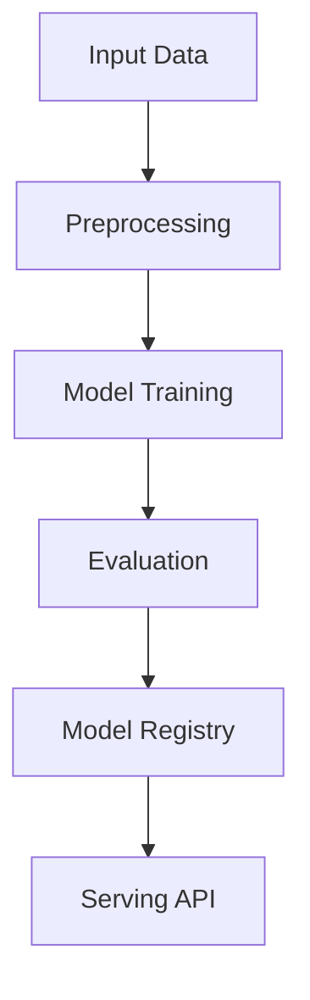

# retrieval-augmented-generation

## ∫ Mathematics & Theory

Retrieval-Augmented Generation (RAG) — Underlying equations and derivations

$$P(y | x) = \sum_{z \in \mathcal{Z}} P(y | x, z) P(z | x)$$

$$\text{sim}(q, d) = \frac{q^T d}{\|q\| \|d\|}$$

$$\text{top-}k = \arg\max_{d_i \in \mathcal{D}} \text{sim}(q, d_i)$$

### Step-by-Step Derivation

RAG combines retrieval with generation. Given a query $q$, the retriever finds top-$k$ documents $z$ from a knowledge base. The generator conditions on both the query and retrieved context. This allows the model to access up-to-date or domain-specific information without retraining.

### Interactive Visualization

Interactive retrieval pipeline; relevance score distribution; context vs generation attention alignment.

## ⚙ Architecture

Model structure, data flow, and layer breakdown

### Class Hierarchy

```
  Document
  Chunk
  TextChunker
  TFIDFEmbedding
  VectorDatabase
  Retriever
  PromptAugmenter
  SimpleRAGGenerator
  RAGGenerator
  RAGModel
```

### Data Flow



## ⚡ API Reference

FastAPI endpoints and model interfaces

| Method | Endpoint |
| --- | --- |
| `GET` | `/` |
| `GET` | `/health` |
| `GET` | `/metrics` |

## ▶ Usage

Code examples and CLI commands

### Training Script

```python
from __future__ import annotations

"""Training / indexing pipeline for Retrieval-Augmented Generation (RAG).

Covers the RAG training steps:
- Creating External Data
- Chunking and embedding
- Indexing into Vector Database
"""

import argparse
import json
import os
from pathlib import Path
from typing import Any

from ai_core.logging import get_logger, setup_logging
from ai_core.model_registry import ModelRegistry

from retrieval_augmented_generation.data import (
    DEFAULT_CHUNK_SIZE,
    DEFAULT_N_DOCS,
    DEFAULT_OVERLAP,
    load_knowledge_base,
)
from retrieval_augmented_generation.model import Document, RAGModel

logger = get_logger(__name__)

def train(
    model_dir: Path,
    data_path: Path | None = None,
    n_docs: int = DEFAULT_N_DOCS,
    chunk_size: int = DEFAULT_CHUNK_SIZE,
    overlap: int = DEFAULT_OVERLAP,
    top_k: int = 5,
    model_id: str = "rag-v1",
    model_version: str = "1.0.0",
    register_to_mlflow: bool = False,
    random_seed: int = 42,
) -> dict[str, Any]:
    logger.info(
        "Loading knowledge base",
        n_docs=n_docs,
        data_path=str(data_path) if data_path else "synthetic",
    )
    documents_data = load_knowledge_base(data_path=data_path, n_docs=n_docs)
    documents = [
        Document(doc_id=d["id"], title=d.get("title", ""), content=d.get("content", ""))
        for d in documents_data
    ]

    logger.info("Initializing RAG model")
    model = RAGModel(
        model_id=model_id,
        chunk_size=chunk_size,
        overlap=overlap,
        top_k=top_k,
        random_seed=random_seed,
    )

    logger.info("Indexing documents")
    model.index_documents(documents)

    model_dir.mkdir(parents=True, exist_ok=True)
    artifacts = {}
    chunks_path = model_dir / f"rag_chunks_v{model_version}.json"
    with open(chunks_path, "w", encoding="utf-8") as f:
        json.dump(
            [
                {
                    "chunk_id": c.chunk_id,
                    "doc_id": c.doc_id,
                    "title": c.title,
                    "text": c.text,
                }
                for c in model.chunks
            ],
            f,
            indent=2,
        )
    artifacts["chunks"] = chunks_path

    vocab_path = model_dir / f"rag_vocab_v{model_version}.json"
    with open(vocab_path, "w", encoding="utf-8") as f:
        json.dump(model.embedding_model.vocab, f, indent=2)
    artifacts["vocab"] = vocab_path

    stats = model.get_stats()
    logger.info("RAG indexing complete", stats=stats)

    registry = ModelRegistry(base_dir=model_dir)
    registry.save_model(
        model_name="rag",
        model_version=model_version,
        model_type="retrieval-augmented-generation",
        metrics={
            "documents_indexed": float(stats["documents_indexed"]),
            "chunks_indexed": float(stats["chunks_indexed"]),
            "vocab_size": float(stats["vocab_size"]),
            "vector_dim": float(stats["vector_dim"]),
        },
        parameters={
            "model_id": model_id,
            "chunk_size": chunk_size,
            "overlap": overlap,
            "top_k": top_k,
            "n_docs": n_docs,
            "random_seed": random_seed,
        },
        artifacts=artifacts,
        tags={"framework": "numpy", "task": "rag", "model_type": "RetrievalAugmentedGeneration"},
    )

    if register_to_mlflow:
        registry.log_to_mlflow(
            model_name="rag",
            model_version=model_version,
            metrics={
                "documents_indexed": float(stats["documents_indexed"]),
                "chunks_indexed": float(stats["chunks_indexed"]),
            },
            params={"model_id": model_id, "chunk_size": chunk_size, "top_k": top_k},
            artifacts={str(k): str(v) for k, v in artifacts.items()},
            tags={"model_type": "rag", "framework": "numpy"},
        )

    return stats

def main() -> None:
    parser = argparse.ArgumentParser(description="Train / index RAG model")
    parser.add_argument("--model-dir", type=Path, default=Path(os.getenv("MODEL_DIR", "/models")))
    parser.add_argument("--data-path", type=Path, default=None)
    parser.add_argument("--n-docs", type=int, default=int(os.getenv("N_DOCS", str(DEFAULT_N_DOCS))))
    parser.add_argument(
        "--chunk-size", type=int, default=int(os.getenv("CHUNK_SIZE", str(DEFAULT_CHUNK_SIZE)))
    )
    parser.add_argument(
        "--overlap", type=int, default=int(os.getenv("OVERLAP", str(DEFAULT_OVERLAP)))
    )
    parser.add_argument("--top-k", type=int, default=int(os.getenv("TOP_K", "5")))
    parser.add_argument("--model-id", type=str, default=os.getenv("MODEL_ID", "rag-v1"))
    parser.add_argument("--model-version", type=str, default=os.getenv("MODEL_VERSION", "1.0.0"))
    parser.add_argument("--random-seed", type=int, default=int(os.getenv("RANDOM_SEED", "42")))
    parser.add_argument(
        "--register-mlflow",
        action="store_true",
        default=os.getenv("REGISTER_MLFLOW", "false").lower() == "true",
    )
    parser.add_argument("--log-level", type=str, default=os.getenv("LOG_LEVEL", "INFO"))
    args = parser.parse_args()

    setup_logging(args.log_level)
    args.model_dir.mkdir(parents=True, exist_ok=True)

    stats = train(
        model_dir=args.model_dir,
        data_path=args.data_path,
        n_docs=args.n_docs,
        chunk_size=args.chunk_size,
        overlap=args.overlap,
        top_k=args.top_k,
        model_id=args.model_id,
        model_version=args.model_version,
        register_to_mlflow=args.register_mlflow,
        random_seed=args.random_seed,
    )
    logger.info("Indexing finished", stats=stats, model_dir=str(args.model_dir))

if __name__ == "__main__":
    main()
```

### API Server

```python
from __future__ import annotations

"""Serving API for Retrieval-Augmented Generation (RAG)."""

import os
import time
from contextlib import asynccontextmanager
from pathlib import Path
from typing import Any

import numpy as np
from ai_core.drift import DriftDetector
from ai_core.fastapi_middleware import add_observability_middleware
from ai_core.logging import get_logger, setup_logging
from ai_core.metrics import MetricsCollector
from ai_core.model_registry import ModelRegistry
from fastapi import FastAPI, HTTPException, Response
from pydantic import BaseModel, Field

from retrieval_augmented_generation.data import (
    DEFAULT_CHUNK_SIZE,
    DEFAULT_N_DOCS,
    DEFAULT_OVERLAP,
    generate_synthetic_knowledge_base,
    load_knowledge_base,
)
from retrieval_augmented_generation.model import Document, RAGModel

logger = get_logger(__name__)

MODEL_DIR = Path(os.getenv("MODEL_DIR", "/models"))
MODEL_VERSION = os.getenv("MODEL_VERSION", "latest")
RAG_METRICS_PORT = int(os.getenv("RAG_METRICS_PORT", "9023"))
DRIFT_THRESHOLD = float(os.getenv("DRIFT_THRESHOLD", "0.2"))

class QueryRequest(BaseModel):
    query: str = Field(..., min_length=1, description="User question to answer via RAG")

class QueryResponse(BaseModel):
    query: str
    prompt: str
    answer: str
    retrieved_chunks: list[dict[str, Any]]
    model_version: str

class IndexRequest(BaseModel):
    documents: list[dict[str, str]]
    chunk_size: int = Field(default=DEFAULT_CHUNK_SIZE, ge=50, le=1000)
    overlap: int = Field(default=DEFAULT_OVERLAP, ge=0, le=200)

class IndexResponse(BaseModel):
    indexed_docs: int
    indexed_chunks: int
    model_version: str

class StatsResponse(BaseModel):
    model_id: str
    documents_indexed: int
    chunks_indexed: int
    vocab_size: int
    vector_dim: int
    top_k: int
    chunk_size: int
    overlap: int
    model_version: str

class RefreshResponse(BaseModel):
    status: str
    total_chunks: int

_model: RAGModel | None = None
_model_version: str = "unknown"
_metrics: MetricsCollector | None = None
_drift_detector: DriftDetector | None = None
_reference_queries: np.ndarray | None = None
_recent_queries: list[list[float]] = []

@asynccontextmanager
async def lifespan(app: FastAPI):
    global _model, _model_version, _metrics, _drift_detector, _reference_queries

    setup_logging(os.getenv("LOG_LEVEL", "INFO"))
    _metrics = MetricsCollector("rag", port=RAG_METRICS_PORT)
    app.state.metrics = _metrics

    feature_names = [f"chunk_feat_{i}" for i in range(64)]
    _drift_detector = DriftDetector(
        feature_names=feature_names,
        feature_types={f: "float" for f in feature_names},
        psi_threshold=DRIFT_THRESHOLD,
    )

    _model, _model_version = _load_model()
    _metrics.set_model_version(_model_version)
    _metrics.set_model_info(
        model_name="rag",
        model_version=_model_version,
        model_type="retrieval-augmented-generation",
    )

    _reference_queries = _load_reference_queries()
    logger.info("RAG model loaded", model="rag", version=_model_version)

    yield
    logger.info("Shutting down RAG API")

def _load_model() -> tuple[RAGModel, str]:
    registry = ModelRegistry(base_dir=MODEL_DIR)
    try:
        if MODEL_VERSION == "latest":
            models = registry.list_models()
            rag_models = [m for m in models if m.get("model_name") == "rag"]
            if rag_models:
                rag_models.sort(key=lambda m: m["model_version"], reverse=True)
                latest = rag_models[0]
                model_version = latest["model_version"]
                model = RAGModel(model_id=latest.get("parameters", {}).get("model_id", "rag"))
                documents_data = load_knowledge_base()
                documents = [
                    Document(doc_id=d["id"], title=d.get("title", ""), content=d.get("content", ""))
                    for d in documents_data
                ]
                model.index_documents(documents)
                return model, model_version
        else:
            model_dir = MODEL_DIR / "rag" / MODEL_VERSION
            if model_dir.exists():
                model = RAGModel(model_id=f"rag-{MODEL_VERSION}")
                documents_data = load_knowledge_base()
                documents = [
                    Document(doc_id=d["id"], title=d.get("title", ""), content=d.get("content", ""))
                    for d in documents_data
                ]
                model.index_documents(documents)
                return model, MODEL_VERSION
    except Exception as e:
        logger.warning(f"Registry lookup failed: {e}")

    logger.warning("No pre-existing index found. Initializing baseline RAG model.")
    model = RAGModel(model_id="rag-baseline")
    documents = [
        Document(doc_id=d["id"], title=d.get("title", ""), content=d.get("content", ""))
        for d in generate_synthetic_knowledge_base(n_docs=DEFAULT_N_DOCS)
    ]
    model.index_documents(documents)
    return model, "1.0.0-baseline"

def _load_reference_queries() -> np.ndarray | None:
    try:
        docs = generate_synthetic_knowledge_base(n_docs=DEFAULT_N_DOCS)
        texts = [d["content"] for d in docs]
        return np.array([[len(t.split())] for t in texts])
    except Exception:
        return None

app = FastAPI(
    title="Retrieval-Augmented Generation API",
    description="RAG system with chunking, TF-IDF embeddings, vector search, and grounded generation",
    version="1.0.0",
    lifespan=lifespan,
)

add_observability_middleware(app)

@app.get("/")
def read_root():
    return {
        "service": "rag-api",
        "version": "1.0.0",
        "model_version": _model_version,
        "endpoints": {
            "health": "/health",
            "query": "POST /query",
            "index": "POST /index",
            "stats": "GET /stats",
            "refresh": "POST /refresh",
            "metrics": "/metrics",
        },
    }

@app.get("/health")
def health_check():
    if _model is None:
        raise HTTPException(status_code=503, detail="Model not loaded")
    return {
        "status": "healthy",
        "model_loaded": True,
        "model_version": _model_version,
        "model_id": _model.model_id if _model else "unknown",
        "documents_indexed": _model.get_stats().get("documents_indexed", 0) if _model else 0,
    }

@app.get("/metrics")
def metrics():
    from prometheus_client import CONTENT_TYPE_LATEST, generate_latest

    return Response(content=generate_latest(), media_type=CONTENT_TYPE_LATEST)

@app.post("/query", response_model=QueryResponse)
def query_rag(body: QueryRequest):
    """Answer a question using the RAG pipeline."""
    if _model is None or _metrics is None:
        raise HTTPException(status_code=503, detail="Model not loaded")

    start = time.time()
    try:
        result = _model.query(body.query)

        response = QueryResponse(
            query=result["query"],
            prompt=result["prompt"],
            answer=result["answer"],
            retrieved_chunks=result["retrieved_chunks"],
            model_version=_model_version,
        )
        duration = time.time() - start
        _metrics.record_prediction(model_version=_model_version, duration=duration)

        _recent_queries.append([float(len(body.query.split()))])
        if len(_recent_queries) > 1000:
            _recent_queries.pop(0)

        return response
    except Exception as e:
        _metrics.record_error(model_version=_model_version, error_type="query")
        logger.exception("RAG query failed", error=str(e))
        raise HTTPException(status_code=500, detail="RAG query failed") from e

@app.post("/index", response_model=IndexResponse)
def index_documents(body: IndexRequest):
    """Index new documents into the RAG knowledge base."""
    if _model is None or _metrics is None:
        raise HTTPException(status_code=503, detail="Model not loaded")

    start = time.time()
    try:
        _model.chunk_size = body.chunk_size
        _model.overlap = body.overlap
        if _model.chunker is None:
            _model._init_components()
        for doc_data in body.documents:
            _model.add_document(
                Document(
                    doc_id=doc_data.get("id", f"doc_{len(_model.documents)}"),
                    title=doc_data.get("title", ""),
                    content=doc_data.get("content", ""),
                )
            )

        response = IndexResponse(
            indexed_docs=_model.get_stats()["documents_indexed"],
            indexed_chunks=_model.get_stats()["chunks_indexed"],
            model_version=_model_version,
        )
        duration = time.time() - start
        _metrics.record_prediction(model_version=_model_version, duration=duration)
        return response
    except Exception as e:
        _metrics.record_error(model_version=_model_version, error_type="index")
        logger.exception("Document indexing failed", error=str(e))
        raise HTTPException(status_code=500, detail="Document indexing failed") from e

@app.get("/stats", response_model=StatsResponse)
def get_stats():
    if _model is None:
        raise HTTPException(status_code=503, detail="Model not loaded")
    info = _model.get_stats()
    return StatsResponse(
        model_id=_model.model_id if _model else "unknown",
        documents_indexed=info.get("documents_indexed", 0),
        chunks_indexed=info.get("chunks_indexed", 0),
        vocab_size=info.get("vocab_size", 0),
        vector_dim=info.get("vector_dim", 0),
        top_k=info.get("top_k", 5),
        chunk_size=info.get("chunk_size", DEFAULT_CHUNK_SIZE),
        overlap=info.get("overlap", DEFAULT_OVERLAP),
        model_version=_model_version,
    )

@app.post("/refresh", response_model=RefreshResponse)
def refresh_index():
    if _model is None:
        raise HTTPException(status_code=503, detail="Model not loaded")
    result = _model.refresh()
    return RefreshResponse(status=result["status"], total_chunks=result["total_chunks"])
```

### CLI Commands

```bash
uv run python -m retrieval_augmented_generation.train --model-dir ./artifacts/models
```

## 📊 Benchmarks

Test results and performance metrics

Run `pytest tests/test_models.py` and `pytest tests/test_apis.py` for detailed metrics.

### Related Apps

- [code-generation](../code-generation/README.md)

- [image-generation](../image-generation/README.md)

- [text-generation](../text-generation/README.md)

- [video-generation](../video-generation/README.md)

Generated documentation for **retrieval-augmented-generation**
