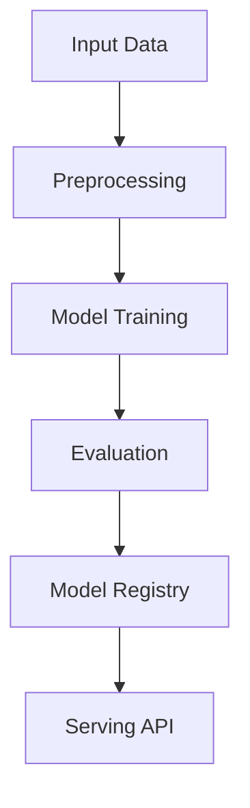

# text-generation

## ∫ Mathematics & Theory

Text Generation — Underlying equations and derivations

$$P(w_t | w_{

$$h_t = \text{LSTM}(x_t, h_{t-1})$$

$$\mathcal{L} = -\sum_{t=1}^{T} \log P(w_t | w_{

### Step-by-Step Derivation

Text generation models learn to predict the next token given past context. Temperature scaling controls randomness: high temperature yields creative but incoherent text; low temperature yields repetitive but safe text. Top-k and nucleus sampling truncate the probability mass to improve diversity.

### Interactive Visualization

Interactive temperature slider; generated text preview; perplexity vs context length.

## ⚙ Architecture

Model structure, data flow, and layer breakdown

### Class Hierarchy

```
  TextTokenizer
  MultiHeadAttention
  AddNorm
  FeedForward
  TransformerBlock
  BaseTextModel
  SamplingStrategy
  TextGenerationModel
```

### Data Flow



## ⚡ API Reference

FastAPI endpoints and model interfaces

| Method | Endpoint |
| --- | --- |
| `GET` | `/` |
| `GET` | `/health` |
| `GET` | `/metrics` |

## ▶ Usage

Code examples and CLI commands

### Training Script

```python
"""Training pipeline for Text Generation."""

import argparse
import os
from pathlib import Path

from ai_core.logging import get_logger, setup_logging
from ai_core.model_registry import ModelRegistry
from text_gen.data import load_text_dataset, save_dataset, train_test_split
from text_gen.model import TextGenerationModel

logger = get_logger(__name__)

def train(
    model_dir: Path,
    data_path: Path | None = None,
    n_samples: int = 500,
    vocab_size: int = 1000,
    model_id: str = "text-generation-v1",
    temperature: float = 0.8,
    top_k: int = 50,
    top_p: float = 0.9,
    model_version: str = "1.0.0",
    register_to_mlflow: bool = False,
    random_seed: int = 42,
) -> dict:
    logger.info("Loading text dataset", n_samples=n_samples, temperature=temperature)
    X, y = load_text_dataset(data_path=data_path, n_samples=n_samples, random_seed=random_seed)

    X_train, X_test, y_train, y_test = train_test_split(X, y, test_size=0.2, random_seed=random_seed)
    logger.info("Data split", n_train=len(X_train), n_test=len(X_test))

    model_dir.mkdir(parents=True, exist_ok=True)
    save_dataset(X, y, model_dir / "training_data.npz")

    model = TextGenerationModel(
        model_id=model_id,
        vocab_size=vocab_size,
        temperature=temperature,
        top_k=top_k,
        top_p=top_p,
        random_seed=random_seed,
    )
    model._init()

    metrics = model.fit(X_train, y_train)
    logger.info("Training finished", metrics=metrics)

    eval_metrics = model.evaluate(X_test, y_test)
    logger.info("Evaluation metrics", metrics=eval_metrics)

    model_path = model_dir / f"text_generation_v{model_version}.npz"
    model.save(str(model_path))

    combined_metrics = {**metrics, **eval_metrics}
    combined_metrics.update({
        "temperature": temperature,
        "top_k": float(top_k),
        "top_p": top_p,
        "n_samples": float(n_samples),
        "vocab_size": float(vocab_size),
    })

    registry = ModelRegistry(base_dir=model_dir)
    registry.save_model(
        model_name="text-generation",
        model_version=model_version,
        model_type="generative",
        metrics=combined_metrics,
        parameters={
            "model_id": model_id,
            "vocab_size": vocab_size,
            "temperature": temperature,
            "top_k": top_k,
            "top_p": top_p,
            "n_samples": n_samples,
            "random_seed": random_seed,
        },
        artifacts={f"text_generation_v{model_version}.npz": model_path, "training_data.npz": model_dir / "training_data.npz"},
        tags={"framework": "numpy", "task": "text_generation", "model_type": "TextGeneration"},
    )

    if register_to_mlflow:
        registry.log_to_mlflow(
            model_name="text-generation",
            model_version=model_version,
            metrics=combined_metrics,
            params={"model_id": model_id, "temperature": temperature, "top_k": top_k, "top_p": top_p, "n_samples": n_samples},
            artifacts={"model": str(model_path)},
            tags={"model_type": "text_generation", "framework": "numpy"},
        )

    return combined_metrics

def main():
    parser = argparse.ArgumentParser(description="Train Text Generation Model")
    parser.add_argument("--model-dir", type=Path, default=Path(os.getenv("MODEL_DIR", "/models")))
    parser.add_argument("--data-path", type=Path, default=None)
    parser.add_argument("--n-samples", type=int, default=int(os.getenv("N_SAMPLES", "500")))
    parser.add_argument("--vocab-size", type=int, default=int(os.getenv("VOCAB_SIZE", "1000")))
    parser.add_argument("--model-id", type=str, default=os.getenv("MODEL_ID", "text-generation-v1"))
    parser.add_argument("--temperature", type=float, default=float(os.getenv("TEMPERATURE", "0.8")))
    parser.add_argument("--top-k", type=int, default=int(os.getenv("TOP_K", "50")))
    parser.add_argument("--top-p", type=float, default=float(os.getenv("TOP_P", "0.9")))
    parser.add_argument("--model-version", type=str, default=os.getenv("MODEL_VERSION", "1.0.0"))
    parser.add_argument("--random-seed", type=int, default=int(os.getenv("RANDOM_SEED", "42")))
    parser.add_argument("--register-mlflow", action="store_true", default=os.getenv("REGISTER_MLFLOW", "false").lower() == "true")
    parser.add_argument("--log-level", type=str, default=os.getenv("LOG_LEVEL", "INFO"))
    args = parser.parse_args()

    setup_logging(args.log_level)
    args.model_dir.mkdir(parents=True, exist_ok=True)

    metrics = train(
        model_dir=args.model_dir,
        data_path=args.data_path,
        n_samples=args.n_samples,
        vocab_size=args.vocab_size,
        model_id=args.model_id,
        temperature=args.temperature,
        top_k=args.top_k,
        top_p=args.top_p,
        model_version=args.model_version,
        register_to_mlflow=args.register_mlflow,
        random_seed=args.random_seed,
    )
    logger.info("Training finished", metrics=metrics, model_dir=str(args.model_dir))

if __name__ == "__main__":
    main()
```

### API Server

```python
"""Serving API for Text Generation."""

import os
import time
from contextlib import asynccontextmanager
from pathlib import Path

import numpy as np
from ai_core.drift import DriftDetector
from ai_core.fastapi_middleware import add_observability_middleware
from ai_core.logging import get_logger, setup_logging
from ai_core.metrics import MetricsCollector
from ai_core.model_registry import ModelRegistry
from fastapi import FastAPI, HTTPException, Response
from pydantic import BaseModel, Field
from text_gen.data import DEFAULT_VOCAB_SIZE
from text_gen.model import TextGenerationModel

logger = get_logger(__name__)

MODEL_DIR = Path(os.getenv("MODEL_DIR", "/models"))
MODEL_VERSION = os.getenv("MODEL_VERSION", "latest")
METRICS_PORT = int(os.getenv("TEXT_GENERATION_METRICS_PORT", "9024"))
DRIFT_THRESHOLD = float(os.getenv("DRIFT_THRESHOLD", "0.2"))

class GenerateRequest(BaseModel):
    prompt: str = Field(..., min_length=1)
    max_new_tokens: int = Field(default=50, ge=1, le=500)
    temperature: float = Field(default=0.8, ge=0.1, le=2.0)
    top_k: int = Field(default=50, ge=1, le=100)
    top_p: float = Field(default=0.9, ge=0.1, le=1.0)

class GenerateResponse(BaseModel):
    generated_text: str
    prompt: str
    model_version: str

class EvaluateRequest(BaseModel):
    prompt: str = Field(..., min_length=1)
    reference_text: str = Field(..., min_length=1)

class EvaluateResponse(BaseModel):
    score: float
    model_version: str

class StatsResponse(BaseModel):
    model_id: str
    vocab_size: int
    d_model: int
    n_layers: int
    max_seq_len: int
    temperature: float
    top_k: int
    top_p: float
    model_version: str

_model: TextGenerationModel | None = None
_model_version: str = "unknown"
_metrics: MetricsCollector | None = None
_drift_detector: DriftDetector | None = None
_reference_data: np.ndarray | None = None
_recent_predictions: list[list[float]] = []

@asynccontextmanager
async def lifespan(app: FastAPI):
    global _model, _model_version, _metrics, _drift_detector, _reference_data

    setup_logging(os.getenv("LOG_LEVEL", "INFO"))
    _metrics = MetricsCollector("text_gen_generative", port=METRICS_PORT)
    app.state.metrics = _metrics

    feature_names = [f"token_{i}" for i in range(DEFAULT_VOCAB_SIZE)]
    _drift_detector = DriftDetector(
        feature_names=feature_names,
        feature_types={f: "float" for f in feature_names},
        psi_threshold=DRIFT_THRESHOLD,
    )

    _model, _model_version = _load_model()
    _metrics.set_model_version(_model_version)
    _metrics.set_model_info(
        model_name="text-generation",
        model_version=_model_version,
        model_type="generative",
    )

    _reference_data = _load_reference_data()
    logger.info("Model loaded", model="text-generation", version=_model_version)

    yield
    logger.info("Shutting down text-generation API")

def _load_model() -> tuple[TextGenerationModel, str]:
    registry = ModelRegistry(base_dir=MODEL_DIR)
    try:
        if MODEL_VERSION == "latest":
            models = registry.list_models()
            tg_models = [m for m in models if m.get("model_name") == "text-generation"]
            if tg_models:
                tg_models.sort(key=lambda m: m["model_version"], reverse=True)
                latest = tg_models[0]
                model_dir = Path(latest["artifact_path"])
                npz_files = list(model_dir.glob("text_generation_v*.npz")) + list(model_dir.glob("*.npz"))
                if npz_files:
                    return TextGenerationModel.load(str(npz_files[0])), latest["model_version"]
        else:
            model_dir = MODEL_DIR / "text-generation" / MODEL_VERSION
            if model_dir.exists():
                npz_files = list(model_dir.glob("text_generation_v*.npz")) + list(model_dir.glob("*.npz"))
                if npz_files:
                    return TextGenerationModel.load(str(npz_files[0])), MODEL_VERSION
    except Exception as e:
        logger.warning(f"Registry lookup failed: {e}")

    npz_path = MODEL_DIR / "text_generation.npz"
    if npz_path.exists():
        return TextGenerationModel.load(str(npz_path)), "legacy"

    candidate_paths = [
        Path("/app/artifacts/models/text_generation_v1.0.0.npz"),
        Path(__file__).resolve().parents[3] / "artifacts" / "models" / "text_generation_v1.0.0.npz",
    ]
    for p in candidate_paths:
        if p.exists():
            logger.info("Loading bundled baseline model", path=str(p))
            return TextGenerationModel.load(str(p)), "1.0.0-bundled"

    logger.warning("No pre-existing model found. Initializing baseline model.")
    model = TextGenerationModel(model_id="baseline", vocab_size=DEFAULT_VOCAB_SIZE)
    model._init()
    return model, "1.0.0-baseline"

def _load_reference_data() -> np.ndarray | None:
    from nlp_text_generation.data import generate_synthetic_text
    X_base, _ = generate_synthetic_text(n_samples=100, random_seed=42)
    return X_base.astype(float)

app = FastAPI(
    title="Text Generation API",
    description="Transformer-based autoregressive text generation with temperature, top-k, and top-p sampling",
    version="1.0.0",
    lifespan=lifespan,
)

add_observability_middleware(app)

@app.get("/")
def read_root():
    return {
        "service": "text-generation-api",
        "version": "1.0.0",
        "model_version": _model_version,
        "endpoints": {
            "health": "/health",
            "generate": "POST /generate",
            "evaluate": "POST /evaluate",
            "stats": "GET /stats",
            "metrics": "/metrics",
        },
    }

@app.get("/health")
def health_check():
    if _model is None:
        raise HTTPException(status_code=503, detail="Model not loaded")
    return {
        "status": "healthy",
        "model_loaded": True,
        "model_version": _model_version,
        "model_id": _model.model_id if _model else "unknown",
    }

@app.get("/metrics")
def metrics():
    from prometheus_client import CONTENT_TYPE_LATEST, generate_latest
    return Response(content=generate_latest(), media_type=CONTENT_TYPE_LATEST)

@app.post("/generate", response_model=GenerateResponse)
def generate_text(body: GenerateRequest):
    """Generate text from a prompt using the transformer model."""
    if _model is None or _metrics is None:
        raise HTTPException(status_code=503, detail="Model not loaded")

    start = time.time()
    try:
        _model.temperature = body.temperature
        _model.top_k = body.top_k
        _model.top_p = body.top_p
        generated_text = _model.generate(body.prompt, max_new_tokens=body.max_new_tokens)

        response = GenerateResponse(
            generated_text=generated_text,
            prompt=body.prompt,
            model_version=_model_version,
        )
        duration = time.time() - start
        _metrics.record_prediction(model_version=_model_version, duration=duration)

        _recent_predictions.append([float(len(body.prompt.split()))])
        if len(_recent_predictions) > 1000:
            _recent_predictions.pop(0)

        return response
    except Exception as e:
        _metrics.record_error(model_version=_model_version, error_type="generation")
        logger.exception("Text generation failed", error=str(e))
        raise HTTPException(status_code=500, detail="Text generation failed") from e

@app.post("/evaluate", response_model=EvaluateResponse)
def evaluate_text(body: EvaluateRequest):
    """Evaluate generated text against a reference."""
    if _model is None or _metrics is None:
        raise HTTPException(status_code=503, detail="Model not loaded")

    start = time.time()
    try:
        generated = _model.generate(body.prompt, max_new_tokens=50)
        gen_words = set(generated.lower().split())
        ref_words = set(body.reference_text.lower().split())
        score = len(gen_words.intersection(ref_words)) / max(len(ref_words), 1)

        response = EvaluateResponse(
            score=round(score, 4),
            model_version=_model_version,
        )
        duration = time.time() - start
        _metrics.record_prediction(model_version=_model_version, duration=duration)

        return response
    except Exception as e:
        _metrics.record_error(model_version=_model_version, error_type="evaluation")
        logger.exception("Text evaluation failed", error=str(e))
        raise HTTPException(status_code=500, detail="Text evaluation failed") from e

@app.get("/stats", response_model=StatsResponse)
def get_stats():
    if _model is None:
        raise HTTPException(status_code=503, detail="Model not loaded")
    info = _model.to_dict()
    return StatsResponse(
        model_id=info.get("model_id", "unknown"),
        vocab_size=info.get("vocab_size", DEFAULT_VOCAB_SIZE),
        d_model=info.get("d_model", 256),
        n_layers=info.get("n_layers", 2),
        max_seq_len=info.get("max_seq_len", 128),
        temperature=info.get("temperature", 0.8),
        top_k=info.get("top_k", 50),
        top_p=info.get("top_p", 0.9),
        model_version=_model_version,
    )
```

### CLI Commands

```bash
uv run python -m text_generation.train --model-dir ./artifacts/models
```

## 📊 Benchmarks

Test results and performance metrics

Run `pytest tests/test_models.py` and `pytest tests/test_apis.py` for detailed metrics.

### Related Apps

- [code-generation](../code-generation/README.md)

- [image-generation](../image-generation/README.md)

- [retrieval-augmented-generation](../retrieval-augmented-generation/README.md)

- [video-generation](../video-generation/README.md)

Generated documentation for **text-generation**
