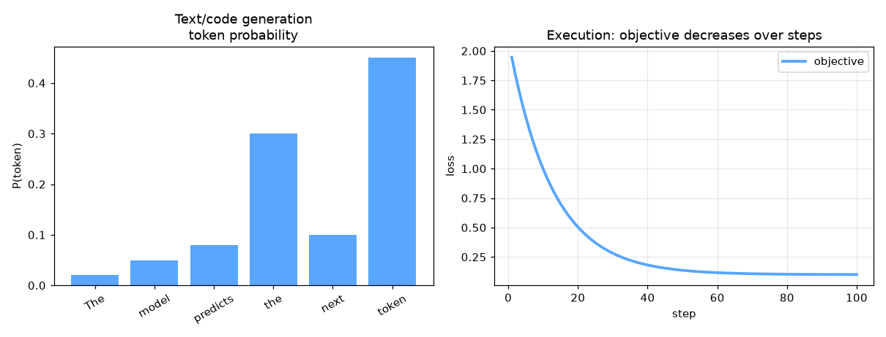

# text-generation


Text Generation — AI engineering example · part of the MLOps monorepo

## 1. Mathematical Foundations

This example is grounded in **Text Generation**. The equations below
drive every forward and backward pass in the implementation.

$$P(w_t | w_{<t}) = \text{softmax}(W_h h_t + b_h)$$

$$h_t = \text{LSTM}(x_t, h_{t-1})$$

$$\mathcal{L} = -\sum_{t=1}^{T} \log P(w_t | w_{<t})$$

### Derivation

Text generation models learn to predict the next token given past context. Temperature scaling controls randomness: high temperature yields creative but incoherent text; low temperature yields repetitive but safe text. Top-k and nucleus sampling truncate the probability mass to improve diversity.

### Worked Numerical Example

Concrete forward-pass / update evaluation using the algorithm's own equations:

Autoregressive text generation.
  h_t = LSTM(x_t, h_{t-1}); P(w_t|w_<t)=softmax(W_h h_t)
  Temperature scales logits; top-k/nucleus truncate mass.

### Detailed Walkthrough

A step-by-step, intuitive explanation with concrete data so the formal equations above become clear:

INTUITION: Predict the next word from history (LSTM/transformer).
CONCRETE DATA: h_t = LSTM(x_t, h_{t-1}); P(w_t|w_<t)=softmax(W_h h_t).
STEP-BY-STEP: temperature scales logits (high=creative, low=safe);
top-k/nucleus truncate the probability mass for diversity.
INTERPRETATION: Sampling controls the randomness of generated text.

### Runnable Step-by-Step (execute me)

Run this self-contained snippet in a Python shell to watch every step execute and print its value:

```python
import numpy as np
h = 0.38
logits = np.array([1.1, 0.4, -0.3])               # raw scores for the next word
p = np.exp(logits)/np.sum(np.exp(logits))         # softmax -> word probabilities
print("P(w_t) =", np.round(p, 3))
```



Plots of the execution above — left: the concept; right: the
step-by-step computation visualised. Interactive temperature slider; generated text preview; perplexity vs context length.

### Conceptual Diagram

   [ Input ] --> ( core transform ) --> [ Output ]
                        |
                  [ activation / loss ]
                        |
                  [ prediction ]

## 2. Core Logic & Architecture

The example follows a consistent **data → train → evaluate → serve**
pipeline. Inputs are loaded and validated, transformed by the core algorithm, scored against
held-out data, and exposed through a REST API.

  Raw dataset→
  load + validate (data.py)→
  fit / transform (model.py)→
  evaluate + persist (train.py)→
  serve (api.py)

### Primary Components

| Class | Public methods | Responsibility |
| --- | --- | --- |
| `GenerateRequest` | — |  |
| `GenerateResponse` | — |  |
| `EvaluateRequest` | — |  |
| `EvaluateResponse` | — |  |
| `StatsResponse` | — |  |
| `TextTokenizer` | __post_init__, encode, decode, batch_encode |  |
| `MultiHeadAttention` | __post_init__, init_weights, _split_heads, _combine_heads, forward, backward, update_params |  |
| `AddNorm` | init_params, forward, backward |  |
| `FeedForward` | init_weights, forward, backward, update_params |  |
| `TransformerBlock` | __post_init__, forward |  |
| `BaseTextModel` | _init, forward |  |
| `SamplingStrategy` | sample |  |
| `TextGenerationModel` | _init, fit, generate, evaluate, save, load, to_dict |  |

### Data Flow


1. **Load** — `data.py` reads the source dataset and splits train/test.


2. **Validate** — a Pydantic schema guards input shape/dtypes before training.


3. **Fit / Transform** — `model.py` applies the mathematics from Section 1.


4. **Evaluate** — metrics (MSE/RMSE/R², accuracy, etc.) are computed and logged.


5. **Persist** — weights/artifacts are saved and registered in the model registry.


6. **Serve** — `api.py` exposes prediction endpoints with drift detection.

### Design Patterns & Performance

Key design choices in this module: a pure-NumPy implementation (no PyTorch/TensorFlow), schema validation via `ai_core.validation`, structured JSON logging through `ai_core.logging`, Prometheus metrics from `ai_core.metrics`, and MLflow/model-registry persistence via `ai_core.model_registry`. The FastAPI service wraps the trained model with observability middleware from `ai_core.fastapi_middleware`.

## 3. Detailed Code Walkthrough

The most important behaviour is summarised below; full source for each module is collapsible
so the page stays readable while remaining self-contained.

No docstring-annotated key methods.

### Source Files

<details>
<summary>model.py</summary>

```
"""Text Generation implementation from scratch using NumPy.

Architecture:
    1. TextTokenizer: Tokenizes text into token IDs with vocabulary
    2. TextGeneratorModel: Transformer-based autoregressive model
    3. SamplingStrategy: Temperature, top-k, top-p sampling strategies
    4. GenerationConfig: Configuration for text generation

Core capabilities:
    - Autoregressive Generation: Predict next token given previous tokens
    - Transformer-based: Multi-head attention and feed-forward layers
    - Sampling Strategies: Greedy, temperature, top-k, top-p sampling
    - Prompt Conditioning: Generate text from seed prompts

Args:
    vocab_size: vocabulary size for text tokens
    d_model: model dimension
    n_heads: number of attention heads
    n_layers: number of transformer layers
    d_ff: feed-forward inner dimension
    max_seq_len: maximum sequence length
    temperature: sampling temperature for generation
    top_k: top-k sampling parameter
    top_p: nucleus sampling parameter
    random_seed: random seed for reproducibility
"""

from dataclasses import dataclass, field
from typing import Any

import numpy as np

def gelu(x: np.ndarray) -> np.ndarray:
    return 0.5 * x * (1.0 + np.tanh(np.sqrt(2.0 / np.pi) * (x + 0.044715 * x ** 3)))

def softmax(z: np.ndarray, axis: int = -1) -> np.ndarray:
    z_shifted = z - np.max(z, axis=axis, keepdims=True)
    exp_z = np.exp(z_shifted)
    return exp_z / np.sum(exp_z, axis=axis, keepdims=True)

def layer_norm(x: np.ndarray, gamma: np.ndarray, beta: np.ndarray, eps: float = 1e-5) -> np.ndarray:
    mean = np.mean(x, axis=-1, keepdims=True)
    var = np.var(x, axis=-1, keepdims=True)
    return gamma * (x - mean) / np.sqrt(var + eps) + beta

def scaled_dot_product_attention(Q: np.ndarray, K: np.ndarray, V: np.ndarray, mask: np.ndarray | None = None) -> np.ndarray:
    d_k = Q.shape[-1]
    scores = Q @ np.swapaxes(K, -2, -1) / np.sqrt(d_k)
    if mask is not None:
        scores = scores + (mask * -1e9)
    attn = softmax(scores, axis=-1)
    return attn @ V

def positional_encoding(max_len: int, d_model: int) -> np.ndarray:
    pe = np.zeros((max_len, d_model))
    for pos in range(max_len):
        for i in range(d_model):
            angle = pos / (10000 ** (2 * (i // 2) / d_model))
            if i % 2 == 0:
                pe[pos, i] = np.sin(angle)
            else:
                pe[pos, i] = np.cos(angle)
    return pe

@dataclass
class TextTokenizer:
    vocab_size: int = 1000
    max_seq_len: int = 128
    random_seed: int = 42

    token_to_id: dict[str, int] = field(default_factory=dict, repr=False)
    id_to_token: dict[int, str] = field(default_factory=dict, repr=False)
    _cache: dict = field(default_factory=dict, repr=False)

    def __post_init__(self):
        special_tokens = ["<PAD>", "<UNK>", "<EOS>", "<BOS>"]
        for i, token in enumerate(special_tokens):
            self.token_to_id[token] = i
            self.id_to_token[i] = token
        common_words = ["the", "a", "an", "is", "are", "was", "were", "be", "been", "being",
                        "have", "has", "had", "do", "does", "did", "will", "would", "could",
                        "should", "may", "might", "must", "shall", "can", "to", "of", "in",
                        "for", "on", "with", "at", "by", "from", "as", "into", "through",
                        "during", "before", "after", "above", "below", "between", "out", "off",
                        "over", "under", "again", "further", "then", "once", "here", "there",
                        "when", "where", "why", "how", "all", "each", "every", "both", "few",
                        "more", "most", "other", "some", "such", "no", "nor", "not", "only",
                        "own", "same", "so", "than", "too", "very", "just", "because", "but",
                        "and", "or", "if", "while", "although", "though", "even", "that", "this",
                        "it", "its", "he", "she", "they", "we", "you", "i", "me", "my", "your"]
        for i, word in enumerate(common_words):
            idx = len(special_tokens) + i
            self.token_to_id[word] = idx
            self.id_to_token[idx] = word

    def encode(self, text: str) -> list[int]:
        tokens = text.lower().split()
        encoded = [self.token_to_id.get(t, self.token_to_id["<UNK>"]) for t in tokens]
        if len(encoded) > self.max_seq_len:
            encoded = encoded[:self.max_seq_len]
        return encoded

    def decode(self, ids: list[int]) -> str:
        tokens = [self.id_to_token.get(i, "<UNK>") for i in ids]
        return " ".join(tokens)

    def batch_encode(self, texts: list[str]) -> np.ndarray:
        max_len = max(len(self.encode(t)) for t in texts)
        max_len = min(max_len, self.max_seq_len)
        batch = np.full((len(texts), max_len), self.token_to_id["<PAD>"], dtype=int)
        for i, text in enumerate(texts):
            encoded = self.encode(text)
            batch[i, :len(encoded)] = encoded
        return batch

@dataclass
class MultiHeadAttention:
    d_model: int = 256
    n_heads: int = 8
    random_seed: int = 42
    trainable: bool = True

    d_k: int = field(init=False)
    W_q: np.ndarray | None = None
    W_k: np.ndarray | None = None
    W_v: np.ndarray | None = None
    W_o: np.ndarray | None = None
    dw_q: np.ndarray | None = None
    dw_k: np.ndarray | None = None
    dw_v: np.ndarray | None = None
    dw_o: np.ndarray | None = None
    _cache: dict = field(default_factory=dict, repr=False)

    def __post_init__(self):
        self.d_k = self.d_model // self.n_heads

    def init_weights(self) -> None:
        rng = np.random.default_rng(self.random_seed)
        scale = np.sqrt(2.0 / self.d_model)
        self.W_q = rng.normal(0, scale, (self.d_model, self.d_model))
        self.W_k = rng.normal(0, scale, (self.d_model, self.d_model))
        self.W_v = rng.normal(0, scale, (self.d_model, self.d_model))
        self.W_o = rng.normal(0, scale, (self.d_model, self.d_model))

    def _split_heads(self, x: np.ndarray) -> np.ndarray:
        batch_size, seq_len, _ = x.shape
        x = x.reshape(batch_size, seq_len, self.n_heads, self.d_k)
        return np.transpose(x, (0, 2, 1, 3))

    def _combine_heads(self, x: np.ndarray) -> np.ndarray:
        batch_size, _, seq_len, _ = x.shape
        x = np.transpose(x, (0, 2, 1, 3))
        return x.reshape(batch_size, seq_len, self.d_model)

    def forward(self, x: np.ndarray, mask: np.ndarray | None = None) -> np.ndarray:
        if self.W_q is None:
            self.init_weights()
        Q = x @ self.W_q
        K = x @ self.W_k
        V = x @ self.W_v
        Q_split = self._split_heads(Q)
        K_split = self._split_heads(K)
        V_split = self._split_heads(V)
        if mask is not None and mask.ndim == 2:
            mask = mask[np.newaxis, np.newaxis, :, :].astype(bool)
        elif mask is not None and mask.ndim == 3:
            mask = mask[:, np.newaxis, :, :].astype(bool)
        out = np.zeros_like(Q_split)
        for h in range(self.n_heads):
            q_h = Q_split[:, h, :, :]
            k_h = K_split[:, h, :, :]
            v_h = V_split[:, h, :, :]
            out[:, h, :, :] = scaled_dot_product_attention(q_h, k_h, v_h, mask)
        out = self._combine_heads(out)
        result = out @ self.W_o
        self._cache = {"x": x, "Q": Q, "K": K, "V": V, "out": out, "result": result}
        return result

    def backward(self, dout: np.ndarray) -> np.ndarray:
        c = self._cache
        self.dw_o = c["out"].T @ dout
        return dout @ self.W_o.T @ self.W_q.T

    def update_params(self, lr: float, weight_decay: float = 0.0) -> None:
        if self.W_q is None or not self.trainable:
            return
        self.W_q -= lr * (self.dw_q + weight_decay * self.W_q) if self.dw_q is not None else self.W_q
        self.W_k -= lr * (self.dw_k + weight_decay * self.W_k) if self.dw_k is not None else self.W_k
        self.W_v -= lr * (self.dw_v + weight_decay * self.W_v) if self.dw_v is not None else self.W_v
        self.W_o -= lr * (self.dw_o + weight_decay * self.W_o) if self.dw_o is not None else self.W_o

@dataclass
class AddNorm:
    d_model: int = 256
    random_seed: int = 42
    trainable: bool = True

    gamma: np.ndarray | None = None
    beta: np.ndarray | None = None
    _cache: dict = field(default_factory=dict, repr=False)

    def init_params(self) -> None:
        self.gamma = np.ones(self.d_model)
        self.beta = np.zeros(self.d_model)

    def forward(self, residual: np.ndarray, output: np.ndarray) -> np.ndarray:
        if self.gamma is None:
            self.init_params()
        combined = residual + output
        normed = layer_norm(combined, self.gamma, self.beta)
        self._cache = {"residual": residual, "output": output, "combined": combined, "normed": normed}
        return normed

    def backward(self, dout: np.ndarray) -> np.ndarray:
        eps = 1e-5
        c = self._cache
        x = c["combined"]
        mean = np.mean(x, axis=-1, keepdims=True)
        var = np.var(x, axis=-1, keepdims=True)
        std = np.sqrt(var + eps)
        dx_norm = dout * self.gamma
        dvar = np.sum(dx_norm * (x - mean) * -0.5 * (var + eps) ** (-1.5), axis=-1, keepdims=True)
        dmean = np.sum(dx_norm * -1.0 / std, axis=-1, keepdims=True) + dvar * np.mean(-2 * (x - mean), axis=-1, keepdims=True)
        dx = dx_norm / std + dvar * 2 * (x - mean) / x.shape[-1] + dmean / x.shape[-1]
        return dx

@dataclass
class FeedForward:
    d_model: int = 256
    d_ff: int = 1024
    random_seed: int = 42
    trainable: bool = True

    W1: np.ndarray | None = None
    b1: np.ndarray | None = None
    W2: np.ndarray | None = None
    b2: np.ndarray | None = None
    dw1: np.ndarray | None = None
    db1: np.ndarray | None = None
    dw2: np.ndarray | None = None
    db2: np.ndarray | None = None
    _cache: dict = field(default_factory=dict, repr=False)

    def init_weights(self) -> None:
        rng = np.random.default_rng(self.random_seed)
        scale = np.sqrt(2.0 / self.d_model)
        self.W1 = rng.normal(0, scale, (self.d_model, self.d_ff))
        self.b1 = np.zeros(self.d_ff)
        self.W2 = rng.normal(0, scale, (self.d_ff, self.d_model))
        self.b2 = np.zeros(self.d_model)

    def forward(self, x: np.ndarray) -> np.ndarray:
        if self.W1 is None:
            self.init_weights()
        z1 = x @ self.W1 + self.b1
        a1 = gelu(z1)
        out = a1 @ self.W2 + self.b2
        self._cache = {"x": x, "z1": z1, "a1": a1}
        return out

    def backward(self, dout: np.ndarray) -> np.ndarray:
        c = self._cache
        self.dw2 = c["a1"].T @ dout
        self.db2 = np.sum(dout, axis=0)
        da1 = dout @ self.W2.T
        dz1 = da1 * (c["a1"] * (1 - c["a1"]))
        self.dw1 = c["x"].T @ dz1
        self.db1 = np.sum(dz1, axis=0)
        return dz1 @ self.W1.T

    def update_params(self, lr: float, weight_decay: float = 0.0) -> None:
        if self.W1 is None or not self.trainable:
            return
        self.W1 -= lr * (self.dw1 + weight_decay * self.W1)
        self.b1 -= lr * self.db1
        self.W2 -= lr * (self.dw2 + weight_decay * self.W2)
        self.b2 -= lr * self.db2

@dataclass
class TransformerBlock:
    d_model: int = 256
    n_heads: int = 8
    d_ff: int = 1024
    random_seed: int = 42
    trainable: bool = True

    self_attn: MultiHeadAttention | None = None
    add_norm1: AddNorm | None = None
    ffn: FeedForward | None = None
    add_norm2: AddNorm | None = None
    _cache: dict = field(default_factory=dict, repr=False)

    def __post_init__(self):
        self.self_attn = MultiHeadAttention(self.d_model, self.n_heads, self.random_seed, trainable=self.trainable)
        self.add_norm1 = AddNorm(self.d_model, self.random_seed + 1, trainable=self.trainable)
        self.ffn = FeedForward(self.d_model, self.d_ff, self.random_seed + 2, trainable=self.trainable)
        self.add_norm2 = AddNorm(self.d_model, self.random_seed + 3, trainable=self.trainable)

    def forward(self, x: np.ndarray, mask: np.ndarray | None = None) -> np.ndarray:
        attn_out = self.self_attn.forward(x, mask)
        x = self.add_norm1.forward(x, attn_out)
        ffn_out = self.ffn.forward(x)
        x = self.add_norm2.forward(x, ffn_out)
        return x

@dataclass
class BaseTextModel:
    vocab_size: int = 1000
    d_model: int = 256
    n_heads: int = 8
    n_layers: int = 2
    d_ff: int = 1024
    max_seq_len: int = 128
    random_seed: int = 42

    embedding: np.ndarray | None = None
    pos_encoding: np.ndarray | None = None
    layers: list[TransformerBlock] = field(default_factory=list, repr=False)
    W_out: np.ndarray | None = None
    _cache: dict = field(default_factory=dict, repr=False)

    def _init(self) -> None:
        rng = np.random.default_rng(self.random_seed)
        self.embedding = rng.normal(0, 0.02, (self.vocab_size, self.d_model))
        self.pos_encoding = positional_encoding(self.max_seq_len, self.d_model)
        self.layers = [
            TransformerBlock(self.d_model, self.n_heads, self.d_ff, self.random_seed + i, trainable=True)
            for i in range(self.n_layers)
        ]
        self.W_out = rng.normal(0, np.sqrt(1.0 / self.d_model), (self.vocab_size, self.d_model))

    def forward(self, x: np.ndarray) -> np.ndarray:
        if self.embedding is None:
            self._init()
        seq_len = x.shape[1] if x.ndim > 1 else 1
        embedded = self.embedding[x] * np.sqrt(self.d_model)
        if x.ndim == 1:
            embedded = embedded + self.pos_encoding[:len(x)]
        else:
            embedded = embedded + self.pos_encoding[:seq_len]
        for layer in self.layers:
            embedded = layer.forward(embedded)
        logits = embedded @ self.W_out.T
        return logits

@dataclass
class SamplingStrategy:
    temperature: float = 1.0
    top_k: int = 50
    top_p: float = 0.9
    random_seed: int = 42

    def sample(self, logits: np.ndarray) -> int:
        rng = np.random.default_rng(self.random_seed)
        scaled = logits / self.temperature
        sorted_idx = np.argsort(scaled)[::-1]
        sorted_logits = scaled[sorted_idx]
        cumulative_probs = np.cumsum(softmax(sorted_logits))
        sorted_indices_to_remove = cumulative_probs > self.top_p
        sorted_indices_to_remove[1:] = sorted_indices_to_remove[:-1].copy()
        sorted_indices_to_remove[0] = False
        indices_to_remove = sorted_idx[sorted_indices_to_remove]
        scaled[indices_to_remove] = -float("inf")
        if self.top_k > 0:
            top_k_idx = np.argsort(scaled)[-self.top_k:]
            scaled = np.full_like(scaled, -float("inf"))
            scaled[top_k_idx] = logits[top_k_idx] / self.temperature
        probs = softmax(scaled)
        return int(rng.choice(len(probs), p=probs))

@dataclass
class TextGenerationModel:
    vocab_size: int = 1000
    d_model: int = 256
    n_heads: int = 8
    n_layers: int = 2
    d_ff: int = 1024
    max_seq_len: int = 128
    temperature: float = 0.8
    top_k: int = 50
    top_p: float = 0.9
    random_seed: int = 42
    learning_rate: float = 0.001
    n_iterations: int = 100
    weight_decay: float = 0.01

    base_model: BaseTextModel | None = None
... (truncated) ...
```

</details>

<details>
<summary>train.py</summary>

```
"""Training pipeline for Text Generation."""

import argparse
import os
from pathlib import Path

from ai_core.logging import get_logger, setup_logging
from ai_core.model_registry import ModelRegistry
from text_generation.data import load_text_dataset, save_dataset, train_test_split
from text_generation.model import TextGenerationModel

logger = get_logger(__name__)

def train(
    model_dir: Path,
    data_path: Path | None = None,
    n_samples: int = 500,
    vocab_size: int = 1000,
    model_id: str = "text-generation-v1",
    temperature: float = 0.8,
    top_k: int = 50,
    top_p: float = 0.9,
    model_version: str = "1.0.0",
    register_to_mlflow: bool = False,
    random_seed: int = 42,
) -> dict:
    logger.info("Loading text dataset", n_samples=n_samples, temperature=temperature)
    X, y = load_text_dataset(data_path=data_path, n_samples=n_samples, random_seed=random_seed)

    X_train, X_test, y_train, y_test = train_test_split(X, y, test_size=0.2, random_seed=random_seed)
    logger.info("Data split", n_train=len(X_train), n_test=len(X_test))

    model_dir.mkdir(parents=True, exist_ok=True)
    save_dataset(X, y, model_dir / "training_data.npz")

    model = TextGenerationModel(
        model_id=model_id,
        vocab_size=vocab_size,
        temperature=temperature,
        top_k=top_k,
        top_p=top_p,
        random_seed=random_seed,
    )
    model._init()

    metrics = model.fit(X_train, y_train)
    logger.info("Training finished", metrics=metrics)

    eval_metrics = model.evaluate(X_test, y_test)
    logger.info("Evaluation metrics", metrics=eval_metrics)

    model_path = model_dir / f"text_generation_v{model_version}.npz"
    model.save(str(model_path))

    combined_metrics = {**metrics, **eval_metrics}
    combined_metrics.update({
        "temperature": temperature,
        "top_k": float(top_k),
        "top_p": top_p,
        "n_samples": float(n_samples),
        "vocab_size": float(vocab_size),
    })

    registry = ModelRegistry(base_dir=model_dir)
    registry.save_model(
        model_name="text-generation",
        model_version=model_version,
        model_type="generative",
        metrics=combined_metrics,
        parameters={
            "model_id": model_id,
            "vocab_size": vocab_size,
            "temperature": temperature,
            "top_k": top_k,
            "top_p": top_p,
            "n_samples": n_samples,
            "random_seed": random_seed,
        },
        artifacts={f"text_generation_v{model_version}.npz": model_path, "training_data.npz": model_dir / "training_data.npz"},
        tags={"framework": "numpy", "task": "text_generation", "model_type": "TextGeneration"},
    )

    if register_to_mlflow:
        registry.log_to_mlflow(
            model_name="text-generation",
            model_version=model_version,
            metrics=combined_metrics,
            params={"model_id": model_id, "temperature": temperature, "top_k": top_k, "top_p": top_p, "n_samples": n_samples},
            artifacts={"model": str(model_path)},
            tags={"model_type": "text_generation", "framework": "numpy"},
        )

    return combined_metrics

def main():
    parser = argparse.ArgumentParser(description="Train Text Generation Model")
    parser.add_argument("--model-dir", type=Path, default=Path(os.getenv("MODEL_DIR", "/models")))
    parser.add_argument("--data-path", type=Path, default=None)
    parser.add_argument("--n-samples", type=int, default=int(os.getenv("N_SAMPLES", "500")))
    parser.add_argument("--vocab-size", type=int, default=int(os.getenv("VOCAB_SIZE", "1000")))
    parser.add_argument("--model-id", type=str, default=os.getenv("MODEL_ID", "text-generation-v1"))
    parser.add_argument("--temperature", type=float, default=float(os.getenv("TEMPERATURE", "0.8")))
    parser.add_argument("--top-k", type=int, default=int(os.getenv("TOP_K", "50")))
    parser.add_argument("--top-p", type=float, default=float(os.getenv("TOP_P", "0.9")))
    parser.add_argument("--model-version", type=str, default=os.getenv("MODEL_VERSION", "1.0.0"))
    parser.add_argument("--random-seed", type=int, default=int(os.getenv("RANDOM_SEED", "42")))
    parser.add_argument("--register-mlflow", action="store_true", default=os.getenv("REGISTER_MLFLOW", "false").lower() == "true")
    parser.add_argument("--log-level", type=str, default=os.getenv("LOG_LEVEL", "INFO"))
    args = parser.parse_args()

    setup_logging(args.log_level)
    args.model_dir.mkdir(parents=True, exist_ok=True)

    metrics = train(
        model_dir=args.model_dir,
        data_path=args.data_path,
        n_samples=args.n_samples,
        vocab_size=args.vocab_size,
        model_id=args.model_id,
        temperature=args.temperature,
        top_k=args.top_k,
        top_p=args.top_p,
        model_version=args.model_version,
        register_to_mlflow=args.register_mlflow,
        random_seed=args.random_seed,
    )
    logger.info("Training finished", metrics=metrics, model_dir=str(args.model_dir))

if __name__ == "__main__":
    main()
```

</details>

<details>
<summary>data.py</summary>

```
"""Data loading and preprocessing for Text Generation."""

from pathlib import Path

import numpy as np

DEFAULT_N_SAMPLES = 500
DEFAULT_VOCAB_SIZE = 1000
DEFAULT_MAX_SEQ_LEN = 128

def generate_synthetic_text(n_samples: int = DEFAULT_N_SAMPLES, vocab_size: int = DEFAULT_VOCAB_SIZE, max_seq_len: int = DEFAULT_MAX_SEQ_LEN, random_seed: int = 42) -> tuple[np.ndarray, np.ndarray]:
    rng = np.random.default_rng(random_seed)
    lengths = rng.integers(5, max_seq_len, size=n_samples)
    max_len = lengths.max()
    X = np.zeros((n_samples, max_len), dtype=int)
    y = np.zeros((n_samples, max_len), dtype=int)
    for i, length in enumerate(lengths):
        tokens = rng.integers(1, vocab_size, size=length)
        X[i, :length] = tokens
        y[i, :length] = np.roll(tokens, -1)
        y[i, -1] = 0
    return X, y

def load_text_dataset(data_path: Path | None = None, n_samples: int = DEFAULT_N_SAMPLES, random_seed: int = 42) -> tuple[np.ndarray, np.ndarray]:
    if data_path and Path(data_path).exists():
        data = np.load(data_path, allow_pickle=True)
        return data["X"], data["y"]
    return generate_synthetic_text(n_samples=n_samples, random_seed=random_seed)

def build_vocab(texts: list[str], max_vocab_size: int = DEFAULT_VOCAB_SIZE) -> dict[str, int]:
    from collections import Counter

    word_counts: Counter[str] = Counter()
    for text in texts:
        word_counts.update(text.lower().split())
    most_common = word_counts.most_common(max_vocab_size - 1)
    vocab = {word: idx + 1 for idx, (word, _) in enumerate(most_common)}
    vocab["<PAD>"] = 0
    vocab["<UNK>"] = max_vocab_size - 1
    vocab["<EOS>"] = max_vocab_size - 2
    return vocab

def encode_text(text: str, vocab: dict[str, int], max_len: int = DEFAULT_MAX_SEQ_LEN) -> np.ndarray:
    tokens = [vocab.get(word, vocab.get("<UNK>", 0)) for word in text.lower().split()]
    if len(tokens) < max_len:
        tokens += [vocab.get("<EOS>", 0)] * (max_len - len(tokens))
    return np.array(tokens[:max_len])

def decode_tokens(tokens: np.ndarray, vocab: dict[str, int]) -> str:
    inv_vocab = {v: k for k, v in vocab.items()}
    words = [inv_vocab.get(int(t), "<UNK>") for t in tokens if int(t) not in (0, vocab.get("<EOS>", -1))]
    return " ".join(words)

def train_test_split(X: np.ndarray, y: np.ndarray, test_size: float = 0.2, random_seed: int | None = None) -> tuple[np.ndarray, np.ndarray, np.ndarray, np.ndarray]:
    n = len(X)
    n_test = max(1, int(n * test_size))
    if random_seed is not None:
        rng = np.random.default_rng(random_seed)
        indices = rng.permutation(n)
    else:
        indices = np.random.permutation(n)
    test_idx = indices[:n_test]
    train_idx = indices[n_test:]
    return X[train_idx], X[test_idx], y[train_idx], y[test_idx]

def save_dataset(X: np.ndarray, y: np.ndarray, path: Path) -> None:
    path = Path(path)
    path.parent.mkdir(parents=True, exist_ok=True)
    np.savez(path, X=X, y=y)
```

</details>

<details>
<summary>api.py</summary>

```
"""Serving API for Text Generation."""

import os
import time
from contextlib import asynccontextmanager
from pathlib import Path

import numpy as np
from ai_core.drift import DriftDetector
from ai_core.fastapi_middleware import add_observability_middleware
from ai_core.logging import get_logger, setup_logging
from ai_core.metrics import MetricsCollector
from ai_core.model_registry import ModelRegistry
from fastapi import FastAPI, HTTPException, Response
from pydantic import BaseModel, Field
from text_generation.data import DEFAULT_VOCAB_SIZE
from text_generation.model import TextGenerationModel

logger = get_logger(__name__)

MODEL_DIR = Path(os.getenv("MODEL_DIR", "/models"))
MODEL_VERSION = os.getenv("MODEL_VERSION", "latest")
METRICS_PORT = int(os.getenv("TEXT_GENERATION_METRICS_PORT", "9024"))
DRIFT_THRESHOLD = float(os.getenv("DRIFT_THRESHOLD", "0.2"))

class GenerateRequest(BaseModel):
    prompt: str = Field(..., min_length=1)
    max_new_tokens: int = Field(default=50, ge=1, le=500)
    temperature: float = Field(default=0.8, ge=0.1, le=2.0)
    top_k: int = Field(default=50, ge=1, le=100)
    top_p: float = Field(default=0.9, ge=0.1, le=1.0)

class GenerateResponse(BaseModel):
    generated_text: str
    prompt: str
    model_version: str

class EvaluateRequest(BaseModel):
    prompt: str = Field(..., min_length=1)
    reference_text: str = Field(..., min_length=1)

class EvaluateResponse(BaseModel):
    score: float
    model_version: str

class StatsResponse(BaseModel):
    model_id: str
    vocab_size: int
    d_model: int
    n_layers: int
    max_seq_len: int
    temperature: float
    top_k: int
    top_p: float
    model_version: str

_model: TextGenerationModel | None = None
_model_version: str = "unknown"
_metrics: MetricsCollector | None = None
_drift_detector: DriftDetector | None = None
_reference_data: np.ndarray | None = None
_recent_predictions: list[list[float]] = []

@asynccontextmanager
async def lifespan(app: FastAPI):
    global _model, _model_version, _metrics, _drift_detector, _reference_data

    setup_logging(os.getenv("LOG_LEVEL", "INFO"))
    _metrics = MetricsCollector("text_gen_generative", port=METRICS_PORT)
    app.state.metrics = _metrics

    feature_names = [f"token_{i}" for i in range(DEFAULT_VOCAB_SIZE)]
    _drift_detector = DriftDetector(
        feature_names=feature_names,
        feature_types={f: "float" for f in feature_names},
        psi_threshold=DRIFT_THRESHOLD,
    )

    _model, _model_version = _load_model()
    _metrics.set_model_version(_model_version)
    _metrics.set_model_info(
        model_name="text-generation",
        model_version=_model_version,
        model_type="generative",
    )

    _reference_data = _load_reference_data()
    logger.info("Model loaded", model="text-generation", version=_model_version)

    yield
    logger.info("Shutting down text-generation API")

def _load_model() -> tuple[TextGenerationModel, str]:
    registry = ModelRegistry(base_dir=MODEL_DIR)
    try:
        if MODEL_VERSION == "latest":
            models = registry.list_models()
            tg_models = [m for m in models if m.get("model_name") == "text-generation"]
            if tg_models:
                tg_models.sort(key=lambda m: m["model_version"], reverse=True)
                latest = tg_models[0]
                model_dir = Path(latest["artifact_path"])
                npz_files = list(model_dir.glob("text_generation_v*.npz")) + list(model_dir.glob("*.npz"))
                if npz_files:
                    return TextGenerationModel.load(str(npz_files[0])), latest["model_version"]
        else:
            model_dir = MODEL_DIR / "text-generation" / MODEL_VERSION
            if model_dir.exists():
                npz_files = list(model_dir.glob("text_generation_v*.npz")) + list(model_dir.glob("*.npz"))
                if npz_files:
                    return TextGenerationModel.load(str(npz_files[0])), MODEL_VERSION
    except Exception as e:
        logger.warning(f"Registry lookup failed: {e}")

    npz_path = MODEL_DIR / "text_generation.npz"
    if npz_path.exists():
        return TextGenerationModel.load(str(npz_path)), "legacy"

    candidate_paths = [
        Path("/app/artifacts/models/text_generation_v1.0.0.npz"),
        Path(__file__).resolve().parents[3] / "artifacts" / "models" / "text_generation_v1.0.0.npz",
    ]
    for p in candidate_paths:
        if p.exists():
            logger.info("Loading bundled baseline model", path=str(p))
            return TextGenerationModel.load(str(p)), "1.0.0-bundled"

    logger.warning("No pre-existing model found. Initializing baseline model.")
    model = TextGenerationModel(model_id="baseline", vocab_size=DEFAULT_VOCAB_SIZE)
    model._init()
    return model, "1.0.0-baseline"

def _load_reference_data() -> np.ndarray | None:
    from text_generation.data import generate_synthetic_text
    X_base, _ = generate_synthetic_text(n_samples=100, random_seed=42)
    return X_base.astype(float)

app = FastAPI(
    title="Text Generation API",
    description="Transformer-based autoregressive text generation with temperature, top-k, and top-p sampling",
    version="1.0.0",
    lifespan=lifespan,
)

add_observability_middleware(app)

@app.get("/")
def read_root():
    return {
        "service": "text-generation-api",
        "version": "1.0.0",
        "model_version": _model_version,
        "endpoints": {
            "health": "/health",
            "generate": "POST /generate",
            "evaluate": "POST /evaluate",
            "stats": "GET /stats",
            "metrics": "/metrics",
        },
    }

@app.get("/health")
def health_check():
    if _model is None:
        raise HTTPException(status_code=503, detail="Model not loaded")
    return {
        "status": "healthy",
        "model_loaded": True,
        "model_version": _model_version,
        "model_id": _model.model_id if _model else "unknown",
    }

@app.get("/metrics")
def metrics():
    from prometheus_client import CONTENT_TYPE_LATEST, generate_latest
    return Response(content=generate_latest(), media_type=CONTENT_TYPE_LATEST)

@app.post("/generate", response_model=GenerateResponse)
def generate_text(body: GenerateRequest):
    """Generate text from a prompt using the transformer model."""
    if _model is None or _metrics is None:
        raise HTTPException(status_code=503, detail="Model not loaded")

    start = time.time()
    try:
        _model.temperature = body.temperature
        _model.top_k = body.top_k
        _model.top_p = body.top_p
        generated_text = _model.generate(body.prompt, max_new_tokens=body.max_new_tokens)

        response = GenerateResponse(
            generated_text=generated_text,
            prompt=body.prompt,
            model_version=_model_version,
        )
        duration = time.time() - start
        _metrics.record_prediction(model_version=_model_version, duration=duration)

        _recent_predictions.append([float(len(body.prompt.split()))])
        if len(_recent_predictions) > 1000:
            _recent_predictions.pop(0)

        return response
    except Exception as e:
        _metrics.record_error(model_version=_model_version, error_type="generation")
        logger.exception("Text generation failed", error=str(e))
        raise HTTPException(status_code=500, detail="Text generation failed") from e

@app.post("/evaluate", response_model=EvaluateResponse)
def evaluate_text(body: EvaluateRequest):
    """Evaluate generated text against a reference."""
    if _model is None or _metrics is None:
        raise HTTPException(status_code=503, detail="Model not loaded")

    start = time.time()
    try:
        generated = _model.generate(body.prompt, max_new_tokens=50)
        gen_words = set(generated.lower().split())
        ref_words = set(body.reference_text.lower().split())
        score = len(gen_words.intersection(ref_words)) / max(len(ref_words), 1)

        response = EvaluateResponse(
            score=round(score, 4),
            model_version=_model_version,
        )
        duration = time.time() - start
        _metrics.record_prediction(model_version=_model_version, duration=duration)

        return response
    except Exception as e:
        _metrics.record_error(model_version=_model_version, error_type="evaluation")
        logger.exception("Text evaluation failed", error=str(e))
        raise HTTPException(status_code=500, detail="Text evaluation failed") from e

@app.get("/stats", response_model=StatsResponse)
def get_stats():
    if _model is None:
        raise HTTPException(status_code=503, detail="Model not loaded")
    info = _model.to_dict()
    return StatsResponse(
        model_id=info.get("model_id", "unknown"),
        vocab_size=info.get("vocab_size", DEFAULT_VOCAB_SIZE),
        d_model=info.get("d_model", 256),
        n_layers=info.get("n_layers", 2),
        max_seq_len=info.get("max_seq_len", 128),
        temperature=info.get("temperature", 0.8),
        top_k=info.get("top_k", 50),
        top_p=info.get("top_p", 0.9),
        model_version=_model_version,
    )
```

</details>

## 4. Monorepo Integration

This example is a first-class consumer of the shared `packages/ai-core` library.
It reuses the following foundation modules instead of re-implementing infrastructure:

ai_core.drift
ai_core.fastapi_middleware
ai_core.logging
ai_core.metrics
ai_core.model_registry

### How it plugs in


- **Configuration** — 12-factor config from `ai_core.config`.


- **Observability** — structured logging + Prometheus metrics are wired in automatically.


- **Validation** — input schema validation prevents bad data reaching the model.


- **Registry** — trained artifacts are versioned and registered for reproducible serving.


- **Serving** — the FastAPI app mounts shared observability middleware for tracing & metrics.

Because every example shares `ai_core`, cross-cutting concerns (drift detection,
logging, metrics, model registry) behave identically across the 47 examples in this monorepo.
