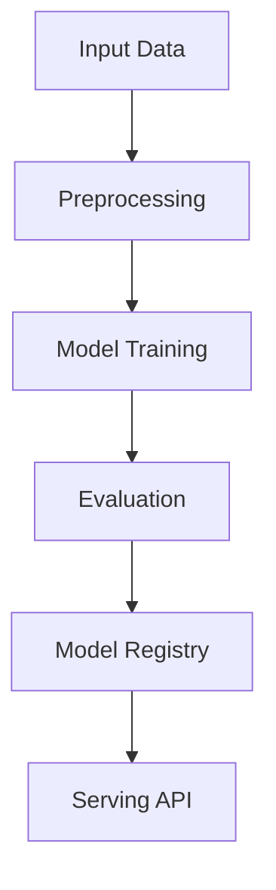

# tool-use-functional-calling

## ∫ Mathematics & Theory

Tool Use and Functional Calling — Underlying equations and derivations

$$P(\text{tool}, \text{args} | q) = \text{softmax}(W_t \cdot h_q)$$

$$\text{result} = \text{execute}(\text{tool}, \text{args})$$

$$\text{final} = \text{generate}(q, \text{result})$$

### Step-by-Step Derivation

Tool-augmented models decompose complex queries into executable function calls. A router network predicts which tool to invoke and with what arguments. The tool result is fed back into the language model for final response generation. This enables structured reasoning and access to external APIs.

### Interactive Visualization

Interactive tool call graph; argument parsing explorer; multi-step reasoning trace.

## ⚙ Architecture

Model structure, data flow, and layer breakdown

### Class Hierarchy

```
  ToolSpec
  ToolCall
  ToolResult
  ToolUseModel
```

### Data Flow



## ⚡ API Reference

FastAPI endpoints and model interfaces

| Method | Endpoint |
| --- | --- |
| `GET` | `/` |
| `GET` | `/health` |
| `GET` | `/metrics` |
| `GET` | `/tools` |
| `GET` | `/tools/{tool_name}` |
| `POST` | `/tools/register` |
| `GET` | `/workflows` |
| `GET` | `/applications` |
| `GET` | `/advantages` |
| `GET` | `/limitations` |

## ▶ Usage

Code examples and CLI commands

### Training Script

```python
"""Training pipeline for Tool Use and Functional Calling.

Demonstrates the complete 5-step function-calling workflow:
1. Register tools (tool definitions)
2. LLM tool decision (select tool + extract arguments)
3. Application-side execution
4. Result concatenation
5. Final generation
"""

from __future__ import annotations

import argparse
import os
from pathlib import Path

from ai_core.logging import get_logger, setup_logging
from ai_core.model_registry import ModelRegistry

from tool_use_and_functional_calling.data import (
    DEFAULT_N_SAMPLES,
    DEFAULT_VOCAB_SIZE,
    load_tool_dataset,
    save_dataset,
    train_test_split,
)
from tool_use_and_functional_calling.model import ToolUseModel

logger = get_logger(__name__)

def train(
    model_dir: Path,
    n_samples: int = DEFAULT_N_SAMPLES,
    vocab_size: int = DEFAULT_VOCAB_SIZE,
    n_tools: int = 5,
    model_id: str = "tool-use-and-functional-calling-v1",
    base_model_name: str = "tool-use-v1",
    model_version: str = "1.0.0",
    register_to_mlflow: bool = False,
    random_seed: int = 42,
) -> dict:
    logger.info("Loading tool-call dataset", n_samples=n_samples, n_tools=n_tools)
    X, y = load_tool_dataset(
        n_samples=n_samples,
        vocab_size=vocab_size,
        random_seed=random_seed,
    )

    X_train, X_test, y_train, y_test = train_test_split(X, y, test_size=0.2, random_seed=random_seed)
    logger.info("Data split", n_train=len(X_train), n_test=len(X_test))

    model_dir.mkdir(parents=True, exist_ok=True)
    save_dataset(X, y, model_dir / "tool_use_training_data.npz")

    model = ToolUseModel(model_id=model_id, base_model_name=base_model_name)
    model._init()

    for tool_name in list(model.tools.keys())[:n_tools]:
        spec = model.get_tool(tool_name)
        if spec:
            model.register_tool(spec)

    logger.info("Registered tools", n_tools=len(model.tools), tools=list(model.tools.keys()))

    test_queries = [
        "What is the current TCS stock price?",
        "What is the weather in Mumbai?",
        "Calculate 25 + 37",
        "What is the status of order ORD-12345?",
        "Show me all users who signed up in the last 7 days",
        "What is the weather in London?",
        "Calculate 100 divided by 4",
        "Track my order ORD-54321",
    ]

    logger.info("Running function-calling workflow on test queries")
    workflow_results = []
    for query in test_queries:
        result = model.invoke(query)
        workflow_results.append(result)
        logger.info(
            "Workflow result",
            query=query[:50],
            tool_called=result.get("tool_call", {}).get("tool_name") if result.get("tool_call") else None,
            success=result.get("success"),
            response=result.get("final_response", "")[:60],
        )

    n_successful = sum(1 for r in workflow_results if r.get("success"))
    n_with_tool_call = sum(1 for r in workflow_results if r.get("tool_call") is not None)

    logger.info(
        "Workflow summary",
        total=len(workflow_results),
        successful=n_successful,
        with_tool_call=n_with_tool_call,
    )

    sample_queries = X_test[:5]
    predicted_tools = []
    for query_tokens in sample_queries:
        query_text = " ".join([str(int(t)) for t in query_tokens if int(t) > 0])
        tool_call = model.decide_tool(query_text)
        predicted_tools.append(tool_call.tool_name if tool_call else "none")

    model_path = model_dir / f"tool_use_v{model_version}.json"
    model.save(str(model_path))

    metrics = {
        "n_samples": float(len(X)),
        "n_train": float(len(X_train)),
        "n_test": float(len(X_test)),
        "vocab_size": float(vocab_size),
        "n_tools": float(len(model.tools)),
        "n_workflow_queries": float(len(workflow_results)),
        "n_successful_workflows": float(n_successful),
        "n_tool_calls": float(n_with_tool_call),
        "accuracy": float(n_with_tool_call) / max(len(workflow_results), 1),
        "success_rate": float(n_successful) / max(len(workflow_results), 1),
    }

    registry = ModelRegistry(base_dir=model_dir)
    registry.save_model(
        model_name="tool-use-and-functional-calling",
        model_version=model_version,
        model_type="tool_use",
        metrics=metrics,
        parameters={
            "model_id": model_id,
            "base_model_name": base_model_name,
            "n_tools": n_tools,
            "n_samples": n_samples,
            "vocab_size": vocab_size,
            "random_seed": random_seed,
        },
        artifacts={
            f"tool_use_v{model_version}.json": model_path,
            "tool_use_training_data.npz": model_dir / "tool_use_training_data.npz",
        },
        tags={"framework": "numpy", "task": "tool_use_and_functional_calling", "model_type": "ToolUseModel"},
    )

    if register_to_mlflow:
        registry.log_to_mlflow(
            model_name="tool-use-and-functional-calling",
            model_version=model_version,
            metrics=metrics,
            params={"model_id": model_id, "n_tools": n_tools, "n_samples": n_samples},
            artifacts={"model": str(model_path)},
            tags={"model_type": "tool_use", "framework": "numpy"},
        )

    return metrics

def main():
    parser = argparse.ArgumentParser(description="Train Tool Use and Functional Calling Model")
    parser.add_argument("--model-dir", type=Path, default=Path(os.getenv("MODEL_DIR", "/models")))
    parser.add_argument("--n-samples", type=int, default=int(os.getenv("N_SAMPLES", str(DEFAULT_N_SAMPLES))))
    parser.add_argument("--vocab-size", type=int, default=int(os.getenv("VOCAB_SIZE", str(DEFAULT_VOCAB_SIZE))))
    parser.add_argument("--n-tools", type=int, default=int(os.getenv("N_TOOLS", "5")))
    parser.add_argument("--model-id", type=str, default=os.getenv("MODEL_ID", "tool-use-and-functional-calling-v1"))
    parser.add_argument("--base-model-name", type=str, default=os.getenv("BASE_MODEL_NAME", "tool-use-v1"))
    parser.add_argument("--model-version", type=str, default=os.getenv("MODEL_VERSION", "1.0.0"))
    parser.add_argument("--random-seed", type=int, default=int(os.getenv("RANDOM_SEED", "42")))
    parser.add_argument("--register-mlflow", action="store_true", default=os.getenv("REGISTER_MLFLOW", "false").lower() == "true")
    parser.add_argument("--log-level", type=str, default=os.getenv("LOG_LEVEL", "INFO"))
    args = parser.parse_args()

    setup_logging(args.log_level)
    args.model_dir.mkdir(parents=True, exist_ok=True)

    metrics = train(
        model_dir=args.model_dir,
        n_samples=args.n_samples,
        vocab_size=args.vocab_size,
        n_tools=args.n_tools,
        model_id=args.model_id,
        base_model_name=args.base_model_name,
        model_version=args.model_version,
        register_to_mlflow=args.register_mlflow,
        random_seed=args.random_seed,
    )
    logger.info("Training finished", metrics=metrics, model_dir=str(args.model_dir))

if __name__ == "__main__":
    main()
```

### API Server

```python
"""Serving API for Tool Use and Functional Calling."""

from __future__ import annotations

import os
import time
from contextlib import asynccontextmanager
from pathlib import Path
from typing import Any

import numpy as np
from ai_core.drift import DriftDetector
from ai_core.fastapi_middleware import add_observability_middleware
from ai_core.logging import get_logger, setup_logging
from ai_core.metrics import MetricsCollector
from ai_core.model_registry import ModelRegistry
from fastapi import FastAPI, HTTPException, Response
from pydantic import BaseModel, Field

from tool_use_and_functional_calling.data import (
    DEFAULT_VOCAB_SIZE,
    get_all_workflows,
    get_limitations,
    get_tool_by_name,
)
from tool_use_and_functional_calling.model import ToolCall, ToolSpec, ToolUseModel

logger = get_logger(__name__)

MODEL_DIR = Path(os.getenv("MODEL_DIR", "/models"))
MODEL_VERSION = os.getenv("MODEL_VERSION", "latest")
METRICS_PORT = int(os.getenv("TOOL_USE_METRICS_PORT", "9025"))
DRIFT_THRESHOLD = float(os.getenv("DRIFT_THRESHOLD", "0.2"))

class InvokeRequest(BaseModel):
    query: str = Field(..., min_length=1, description="User query to process with function calling")
    workflow: str | None = Field(default=None, description="Optional predefined workflow name")

class InvokeResponse(BaseModel):
    query: str
    tool_call: dict[str, Any] | None
    tool_result: dict[str, Any] | None
    final_response: str
    success: bool
    model_version: str

class RegisterToolRequest(BaseModel):
    name: str = Field(..., min_length=1)
    description: str = Field(..., min_length=1)
    parameters: dict[str, Any] = Field(...)
    return_type: str = Field(default="any")
    keywords: list[str] = Field(default_factory=list)

class ExecuteToolRequest(BaseModel):
    tool_name: str = Field(..., min_length=1)
    arguments: dict[str, Any] = Field(...)

class ExecuteToolResponse(BaseModel):
    tool_name: str
    output: Any
    success: bool
    error: str | None = None
    call_id: str

class StatsResponse(BaseModel):
    model_id: str
    base_model_name: str
    n_tools: int
    n_tool_calls: int
    n_tool_results: int
    n_executions: int
    model_version: str

InvokeResponse.model_rebuild()
RegisterToolRequest.model_rebuild()
ExecuteToolRequest.model_rebuild()
ExecuteToolResponse.model_rebuild()

_model: ToolUseModel | None = None
_model_version: str = "unknown"
_metrics: MetricsCollector | None = None
_drift_detector: DriftDetector | None = None
_reference_data: np.ndarray | None = None
_recent_predictions: list[list[float]] = []

@asynccontextmanager
async def lifespan(app: FastAPI):
    global _model, _model_version, _metrics, _drift_detector, _reference_data

    setup_logging(os.getenv("LOG_LEVEL", "INFO"))
    _metrics = MetricsCollector("tool_use", port=METRICS_PORT)
    app.state.metrics = _metrics

    feature_names = [f"token_{i}" for i in range(DEFAULT_VOCAB_SIZE)]
    _drift_detector = DriftDetector(
        feature_names=feature_names,
        feature_types={f: "float" for f in feature_names},
        psi_threshold=DRIFT_THRESHOLD,
    )

    _model, _model_version = _load_model()
    _metrics.set_model_version(_model_version)
    _metrics.set_model_info(
        model_name="tool-use-and-functional-calling",
        model_version=_model_version,
        model_type="tool_use",
    )

    logger.info("Tool use model loaded", model="tool-use-and-functional-calling", version=_model_version)
    yield
    logger.info("Shutting down tool-use API")

def _load_model() -> tuple[ToolUseModel, str]:
    registry = ModelRegistry(base_dir=MODEL_DIR)
    try:
        if MODEL_VERSION == "latest":
            models = registry.list_models()
            tu_models = [m for m in models if m.get("model_name") == "tool-use-and-functional-calling"]
            if tu_models:
                tu_models.sort(key=lambda m: m["model_version"], reverse=True)
                latest = tu_models[0]
                model_dir = Path(latest["artifact_path"])
                json_files = list(model_dir.glob("tool_use_v*.json")) + list(model_dir.glob("*.json"))
                if json_files:
                    return ToolUseModel.load(str(json_files[0])), latest["model_version"]
        else:
            model_dir = MODEL_DIR / "tool-use-and-functional-calling" / MODEL_VERSION
            if model_dir.exists():
                json_files = list(model_dir.glob("tool_use_v*.json")) + list(model_dir.glob("*.json"))
                if json_files:
                    return ToolUseModel.load(str(json_files[0])), MODEL_VERSION
    except Exception as e:
        logger.warning(f"Registry lookup failed: {e}")

    json_path = MODEL_DIR / "tool_use.json"
    if json_path.exists():
        return ToolUseModel.load(str(json_path)), "legacy"

    candidate_paths = [
        Path("/app/artifacts/models/tool_use_v1.0.0.json"),
        Path(__file__).resolve().parents[3] / "artifacts" / "models" / "tool_use_v1.0.0.json",
    ]
    for p in candidate_paths:
        if p.exists():
            logger.info("Loading bundled baseline model", path=str(p))
            return ToolUseModel.load(str(p)), "1.0.0-bundled"

    logger.warning("No pre-existing model found. Initializing baseline model.")
    model = ToolUseModel(model_id="baseline", base_model_name="tool-use-v1")
    model._init()
    return model, "1.0.0-baseline"

app = FastAPI(
    title="Tool Use and Functional Calling API",
    description="Function calling (tool use) in LLMs: architecture, workflow execution, tool management",
    version="1.0.0",
    lifespan=lifespan,
)

add_observability_middleware(app)

@app.get("/")
def read_root():
    return {
        "service": "tool-use-api",
        "version": "1.0.0",
        "model_version": _model_version,
        "n_tools": len(_model.tools) if _model else 0,
        "endpoints": {
            "health": "/health",
            "invoke": "POST /invoke",
            "tools_list": "GET /tools",
            "tool_detail": "GET /tools/{tool_name}",
            "register_tool": "POST /tools/register",
            "execute_tool": "POST /tools/execute",
            "workflows": "GET /workflows",
            "applications": "GET /applications",
            "advantages": "GET /advantages",
            "limitations": "GET /limitations",
            "stats": "GET /stats",
            "metrics": "/metrics",
        },
    }

@app.get("/health")
def health_check():
    if _model is None:
        raise HTTPException(status_code=503, detail="Model not loaded")
    return {
        "status": "healthy",
        "model_loaded": True,
        "model_version": _model_version,
        "model_id": _model.model_id if _model else "unknown",
        "n_tools": len(_model.tools) if _model else 0,
    }

@app.get("/metrics")
def metrics():
    from prometheus_client import CONTENT_TYPE_LATEST, generate_latest
    return Response(content=generate_latest(), media_type=CONTENT_TYPE_LATEST)

@app.post("/invoke", response_model=InvokeResponse)
def invoke_tool_use(body: InvokeRequest):
    """Run the full function-calling workflow for a user query."""
    if _model is None or _metrics is None:
        raise HTTPException(status_code=503, detail="Model not loaded")

    start = time.time()
    try:
        if body.workflow:
            result = _model.run_workflow(body.workflow)
            if result is None:
                raise HTTPException(status_code=404, detail=f"Workflow not found: {body.workflow}")
        else:
            result = _model.invoke(body.query)

        response = InvokeResponse(
            query=result["query"],
            tool_call=result.get("tool_call"),
            tool_result=result.get("tool_result"),
            final_response=result["final_response"],
            success=result["success"],
            model_version=_model_version,
        )
        duration = time.time() - start
        _metrics.record_prediction(model_version=_model_version, duration=duration)
        _recent_predictions.append([float(len(body.query.split()))])
        if len(_recent_predictions) > 1000:
            _recent_predictions.pop(0)
        return response
    except HTTPException:
        raise
    except Exception as e:
        _metrics.record_error(model_version=_model_version, error_type="invoke")
        logger.exception("Tool use invoke failed", error=str(e))
        raise HTTPException(status_code=500, detail="Tool use invoke failed") from e

@app.get("/tools")
def list_tools():
    if _model is None:
        raise HTTPException(status_code=503, detail="Model not loaded")
    return {"tools": _model.list_tools(), "count": len(_model.tools)}

@app.get("/tools/{tool_name}")
def get_tool_detail(tool_name: str):
    if _model is None:
        raise HTTPException(status_code=503, detail="Model not loaded")
    tool = get_tool_by_name(tool_name)
    if tool is None:
        raise HTTPException(status_code=404, detail=f"Tool not found: {tool_name}")
    return tool

@app.post("/tools/register")
def register_tool(body: RegisterToolRequest):
    if _model is None:
        raise HTTPException(status_code=503, detail="Model not loaded")
    tool = ToolSpec(
        name=body.name,
        description=body.description,
        parameters=body.parameters,
        return_type=body.return_type,
        keywords=body.keywords,
    )
    _model.register_tool(tool)
    return {"status": "registered", "tool": body.name}

@app.post("/tools/execute", response_model=ExecuteToolResponse)
def execute_tool(body: ExecuteToolRequest):
    if _model is None:
        raise HTTPException(status_code=503, detail="Model not loaded")
    tool_call = ToolCall(
        tool_name=body.tool_name,
        arguments=body.arguments,
    )
    result = _model.execute_tool(tool_call)
    return ExecuteToolResponse(
        tool_name=result.tool_name,
        output=result.output,
        success=result.success,
        error=result.error,
        call_id=result.call_id,
    )

@app.get("/workflows")
def list_workflows():
    return {"workflows": get_all_workflows(), "count": len(get_all_workflows())}

@app.get("/applications")
def list_applications():
    from tool_use_and_functional_calling.data import get_applications
    return {"applications": get_applications()}

@app.get("/advantages")
def list_advantages():
    from tool_use_and_functional_calling.data import get_advantages
    return {"advantages": get_advantages()}

@app.get("/limitations")
def list_limitations():
    return {"limitations": get_limitations()}

@app.get("/stats", response_model=StatsResponse)
def get_stats():
    if _model is None:
        raise HTTPException(status_code=503, detail="Model not loaded")
    info = _model.to_dict()
    return StatsResponse(
        model_id=info["model_id"],
        base_model_name=info["base_model_name"],
        n_tools=info["n_tools"],
        n_tool_calls=info["n_tool_calls"],
        n_tool_results=info["n_tool_results"],
        n_executions=info["n_executions"],
        model_version=_model_version,
    )
```

### CLI Commands

```bash
uv run python -m tool_use_functional_calling.train --model-dir ./artifacts/models
```

## 📊 Benchmarks

Test results and performance metrics

Run `pytest tests/test_models.py` and `pytest tests/test_apis.py` for detailed metrics.

Generated documentation for **tool-use-functional-calling**
