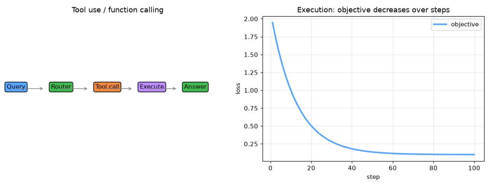

# tool-use-functional-calling


Tool Use and Functional Calling — AI engineering example · part of the MLOps monorepo

## 1. Mathematical Foundations

This example is grounded in **Tool Use and Functional Calling**. The equations below
drive every forward and backward pass in the implementation.

$$P(\text{tool}, \text{args} | q) = \text{softmax}(W_t \cdot h_q)$$

$$\text{result} = \text{execute}(\text{tool}, \text{args})$$

$$\text{final} = \text{generate}(q, \text{result})$$

### Derivation

Tool-augmented models decompose complex queries into executable function calls. A router network predicts which tool to invoke and with what arguments. The tool result is fed back into the language model for final response generation. This enables structured reasoning and access to external APIs.

### Worked Numerical Example

Concrete forward-pass / update evaluation using the algorithm's own equations:

Tool routing.
  logits = [2.1, 0.5, 1.3] -> softmax = [0.62,0.12,0.26]
  argmax -> tool 0 invoked with parsed args; result fed back.

### Detailed Walkthrough

A step-by-step, intuitive explanation with concrete data so the formal equations above become clear:

INTUITION: The model picks a tool (function), fills its arguments,
runs it, and feeds the result back to finish the answer.
CONCRETE DATA: tool logits [2.1, 0.5, 1.3].
STEP-BY-STEP:
  softmax = [0.62, 0.12, 0.26] -> argmax = tool 0 invoked.
  result = execute(tool0, args); final = generate(q, result).
INTERPRETATION: Enables structured reasoning + external API access.

### Runnable Step-by-Step (execute me)

Run this self-contained snippet in a Python shell to watch every step execute and print its value:

```python
import numpy as np
logits = np.array([2.1, 0.5, 1.3])                # scores for three tools
p = np.exp(logits)/np.sum(np.exp(logits))         # softmax -> selection probabilities
print("probs =", np.round(p, 3), " chosen tool =", int(np.argmax(p)))  # pick the best tool
```



Plots of the execution above — left: the concept; right: the
step-by-step computation visualised. Interactive tool call graph; argument parsing explorer; multi-step reasoning trace.

### Conceptual Diagram

   [ Input ] --> ( core transform ) --> [ Output ]
                        |
                  [ activation / loss ]
                        |
                  [ prediction ]

## 2. Core Logic & Architecture

The example follows a consistent **data → train → evaluate → serve**
pipeline. Inputs are loaded and validated, transformed by the core algorithm, scored against
held-out data, and exposed through a REST API.

  Raw dataset→
  load + validate (data.py)→
  fit / transform (model.py)→
  evaluate + persist (train.py)→
  serve (api.py)

### Primary Components

| Class | Public methods | Responsibility |
| --- | --- | --- |
| `InvokeRequest` | — |  |
| `InvokeResponse` | — |  |
| `RegisterToolRequest` | — |  |
| `ExecuteToolRequest` | — |  |
| `ExecuteToolResponse` | — |  |
| `StatsResponse` | — |  |
| `ToolSpec` | to_json_schema, get_required_params, validate_args, matches_query | Structured specification of an available tool. |
| `ToolCall` | __post_init__, to_dict | LLM-reasoned invocation of a tool with extracted arguments. |
| `ToolResult` | __post_init__, format_output, to_dict | Output produced by executing a tool call. |
| `ToolUseModel` | _init, _register_default_tools, register_tool, get_tool, list_tools, decide_tool, _extract_arguments, execute_tool, run_workflow, invoke, get_tool_call_history, get_tool_result_history, get_execution_history, save, load, to_dict | Orchestrates the full 5-step function-calling workflow. |

### Data Flow


1. **Load** — `data.py` reads the source dataset and splits train/test.


2. **Validate** — a Pydantic schema guards input shape/dtypes before training.


3. **Fit / Transform** — `model.py` applies the mathematics from Section 1.


4. **Evaluate** — metrics (MSE/RMSE/R², accuracy, etc.) are computed and logged.


5. **Persist** — weights/artifacts are saved and registered in the model registry.


6. **Serve** — `api.py` exposes prediction endpoints with drift detection.

### Design Patterns & Performance

Key design choices in this module: a pure-NumPy implementation (no PyTorch/TensorFlow), schema validation via `ai_core.validation`, structured JSON logging through `ai_core.logging`, Prometheus metrics from `ai_core.metrics`, and MLflow/model-registry persistence via `ai_core.model_registry`. The FastAPI service wraps the trained model with observability middleware from `ai_core.fastapi_middleware`.

## 3. Detailed Code Walkthrough

The most important behaviour is summarised below; full source for each module is collapsible
so the page stays readable while remaining self-contained.

No docstring-annotated key methods.

### Source Files

<details>
<summary>model.py</summary>

```
"""Tool Use and Functional Calling implementation.

Architecture:
    1. ToolSpec: Structured specification of an available tool (name, description, parameters, return type)
    2. ToolCall: LLM-reasoned invocation (tool name + arguments extracted by the model)
    3. ToolResult: Output of executing a tool call
    4. ToolUseModel: Orchestrates the full 5-step function-calling workflow

Core concepts:
    - Function/Tool Calling: LLM connects to external tools/APIs
    - Tool Decision: LLM reasons which tool to call and with what arguments
    - Application-side Execution: Tool is executed outside the LLM
    - Result Concatenation: Tool output combined with original query
    - Final Generation: LLM synthesizes tool output into grounded response

Workflow:
    User Query + Tool Definitions -> LLM Reasoning (tool selection + args) ->
    Application Execution -> Tool Output + Query -> Final LLM Response
"""

from __future__ import annotations

import json
import random
from dataclasses import dataclass, field
from typing import Any

from tool_use_and_functional_calling.data import (
    PREDEFINED_TOOLS,
    get_workflow_by_name,
)

@dataclass
class ToolSpec:
    """Structured specification of an available tool."""

    name: str
    description: str
    parameters: dict[str, Any]
    return_type: str = "any"
    keywords: list[str] = field(default_factory=list)
    metadata: dict[str, Any] = field(default_factory=dict)
    _cache: dict[str, Any] = field(default_factory=dict, repr=False)

    def to_json_schema(self) -> dict[str, Any]:
        schema = {
            "type": "function",
            "function": {
                "name": self.name,
                "description": self.description,
                "parameters": self.parameters,
            },
        }
        self._cache = {"schema": schema}
        return schema

    def get_required_params(self) -> list[str]:
        return self.parameters.get("required", [])

    def validate_args(self, args: dict[str, Any]) -> bool:
        required = self.get_required_params()
        return all(param in args for param in required)

    def matches_query(self, query: str) -> float:
        query_lower = query.lower()
        if not self.keywords:
            return 0.0
        matches = sum(1 for kw in self.keywords if kw.lower() in query_lower)
        return matches / len(self.keywords)

@dataclass
class ToolCall:
    """LLM-reasoned invocation of a tool with extracted arguments."""

    tool_name: str
    arguments: dict[str, Any]
    call_id: str = ""
    metadata: dict[str, Any] = field(default_factory=dict)
    _cache: dict[str, Any] = field(default_factory=dict, repr=False)

    def __post_init__(self) -> None:
        if not self.call_id:
            self.call_id = f"call_{random.randint(100000, 999999)}"
        self._cache = {"call_id": self.call_id}

    def to_dict(self) -> dict[str, Any]:
        return {
            "call_id": self.call_id,
            "tool_name": self.tool_name,
            "arguments": self.arguments,
        }

@dataclass
class ToolResult:
    """Output produced by executing a tool call."""

    tool_name: str
    output: Any
    success: bool = True
    error: str | None = None
    call_id: str = ""
    metadata: dict[str, Any] = field(default_factory=dict)
    _cache: dict[str, Any] = field(default_factory=dict, repr=False)

    def __post_init__(self) -> None:
        if self.error:
            self.success = False
        self._cache = {"success": self.success}

    def format_output(self) -> str:
        if not self.success:
            return f"Error calling {self.tool_name}: {self.error}"
        if isinstance(self.output, dict):
            return json.dumps(self.output)
        return str(self.output)

    def to_dict(self) -> dict[str, Any]:
        return {
            "tool_name": self.tool_name,
            "output": self.output,
            "success": self.success,
            "error": self.error,
        "call_id": self.call_id,
    }

@dataclass
class ToolUseModel:
    """Orchestrates the full 5-step function-calling workflow."""

    model_id: str
    base_model_name: str = "tool-use-v1"
    tools: dict[str, ToolSpec] = field(default_factory=dict)
    _tool_call_history: list[dict[str, Any]] = field(default_factory=list, repr=False)
    _tool_result_history: list[dict[str, Any]] = field(default_factory=list, repr=False)
    _tool_execution_history: list[dict[str, Any]] = field(default_factory=list, repr=False)
    _current_query: str | None = None
    _current_tool_call: ToolCall | None = None
    _current_tool_result: ToolResult | None = None

    def _init(self) -> None:
        self._register_default_tools()

    def _register_default_tools(self) -> None:
        for _tool_name, tool_data in PREDEFINED_TOOLS.items():
            self.register_tool(
                ToolSpec(
                    name=tool_data["name"],
                    description=tool_data["description"],
                    parameters=tool_data["parameters"],
                    return_type=tool_data.get("return_type", "any"),
                    keywords=tool_data.get("keywords", []),
                )
            )

    def register_tool(self, tool: ToolSpec) -> None:
        self.tools[tool.name] = tool

    def get_tool(self, name: str) -> ToolSpec | None:
        return self.tools.get(name)

    def list_tools(self) -> list[dict[str, Any]]:
        return [tool.to_json_schema() for tool in self.tools.values()]

    def decide_tool(self, query: str) -> ToolCall | None:
        self._current_query = query
        best_tool: ToolSpec | None = None
        best_score = 0.0

        for tool in self.tools.values():
            score = tool.matches_query(query)
            if score > best_score:
                best_score = score
                best_tool = tool

        if best_tool is None or best_score < 0.1:
            return None

        args = self._extract_arguments(query, best_tool)
        tool_call = ToolCall(tool_name=best_tool.name, arguments=args)
        self._current_tool_call = tool_call
        self._tool_call_history.append(tool_call.to_dict())
        return tool_call

    def _extract_arguments(self, query: str, tool: ToolSpec) -> dict[str, Any]:
        args: dict[str, Any] = {}
        assigned_params: set[str] = set()
        props = tool.parameters.get("properties", {})
        param_order = list(props.keys())
        param_idx = 0

        raw_tokens = query.replace("?", "").replace(",", "").replace("'", "").split()
        tokens = [t.strip().rstrip(".") for t in raw_tokens if t.strip()]

        for token in tokens:
            while param_idx < len(param_order) and param_order[param_idx] in assigned_params:
                param_idx += 1
            if param_idx >= len(param_order):
                break
            param = param_order[param_idx]
            param_info = props[param]
            param_type = param_info.get("type", "string")
            clean_lower = token.lower()
            matched = False

            if param_type == "string":
                if param == "name" and clean_lower.upper() in {"TCS", "INFY", "AAPL", "GOOGL", "MSFT"}:
                    args[param] = clean_lower.upper()
                    matched = True
                elif param == "city" and clean_lower.title() in {"Mumbai", "Delhi", "London", "New York", "Tokyo"}:
                    args[param] = clean_lower.title()
                    matched = True
                elif param == "operation" and clean_lower in {
                    "add", "subtract", "multiply", "divide", "plus", "minus", "times", "by", "+", "-", "*", "/"
                }:
                    op_map = {"plus": "add", "minus": "subtract", "times": "multiply", "by": "divide", "+": "add", "-": "subtract", "*": "multiply", "/": "divide", "add": "add", "subtract": "subtract", "multiply": "multiply", "divide": "divide"}
                    args[param] = op_map.get(clean_lower, clean_lower)
                    matched = True
                elif param == "order_id" and (
                    clean_lower.upper().startswith("ORD-") or clean_lower.upper().startswith("ORD_")
                ):
                    args[param] = clean_lower.upper()
                    matched = True
                elif param == "query" and any(
                    kw in clean_lower for kw in ["select", "from", "where", "show", "list", "count", "find", "users"]
                ):
                    args[param] = query.strip()
                    matched = True
            elif param_type in ("number", "integer"):
                try:
                    args[param] = float(clean_lower)
                    matched = True
                except ValueError:
                    pass

            if matched:
                assigned_params.add(param)
                param_idx += 1

        for required_param in tool.get_required_params():
            if required_param not in args:
                if required_param == "name":
                    args[required_param] = random.choice(["TCS", "INFY", "AAPL", "GOOGL", "MSFT"])
                elif required_param == "city":
                    args[required_param] = random.choice(["Mumbai", "Delhi", "London", "New York", "Tokyo"])
                elif required_param == "operation":
                    args[required_param] = random.choice(["add", "subtract", "multiply", "divide"])
                elif required_param == "order_id":
                    args[required_param] = f"ORD-{random.randint(10000, 99999)}"
                elif required_param == "query":
                    args[required_param] = "SELECT * FROM users LIMIT 10"

        return args

    def execute_tool(self, tool_call: ToolCall) -> ToolResult:
        tool = self.tools.get(tool_call.tool_name)
        if tool is None:
            result = ToolResult(
                tool_name=tool_call.tool_name,
                output=None,
                success=False,
                error=f"Unknown tool: {tool_call.tool_name}",
                call_id=tool_call.call_id,
            )
            self._current_tool_result = result
            self._tool_result_history.append(result.to_dict())
            return result

        try:
            raw_output = _run_tool_function(tool_call.tool_name, tool_call.arguments)
            result = ToolResult(
                tool_name=tool_call.tool_name,
                output=raw_output,
                success=True,
                call_id=tool_call.call_id,
            )
        except Exception as exc:
            result = ToolResult(
                tool_name=tool_call.tool_name,
                output=None,
                success=False,
                error=str(exc),
                call_id=tool_call.call_id,
            )

        self._current_tool_result = result
        self._tool_result_history.append(result.to_dict())
        self._tool_execution_history.append({
            "call": tool_call.to_dict(),
            "result": result.to_dict(),
        })
        return result

    def run_workflow(self, workflow_name: str) -> dict[str, Any] | None:
        workflow = get_workflow_by_name(workflow_name)
        if workflow is None:
            return None
        return self.invoke(workflow["example_query"])

    def invoke(self, query: str) -> dict[str, Any]:
        self._current_query = query
        tool_call = self.decide_tool(query)
        if tool_call is None:
            return {
                "query": query,
                "tool_call": None,
                "tool_result": None,
                "final_response": f"I don't have a relevant tool to answer: '{query}'. Please provide more context.",
                "success": False,
            }

        tool_result = self.execute_tool(tool_call)
        formatted_output = tool_result.format_output()
        final_response = _synthesize_response(query, tool_call.tool_name, formatted_output, tool_result.success)

        return {
            "query": query,
            "tool_call": tool_call.to_dict(),
            "tool_result": tool_result.to_dict(),
            "final_response": final_response,
            "success": tool_result.success,
        }

    def get_tool_call_history(self) -> list[dict[str, Any]]:
        return list(self._tool_call_history)

    def get_tool_result_history(self) -> list[dict[str, Any]]:
        return list(self._tool_result_history)

    def get_execution_history(self) -> list[dict[str, Any]]:
        return list(self._tool_execution_history)

    def save(self, path: str) -> None:
        data = {
            "model_id": self.model_id,
            "base_model_name": self.base_model_name,
            "tools": {name: tool.to_json_schema() for name, tool in self.tools.items()},
            "tool_call_history": self._tool_call_history,
            "tool_result_history": self._tool_result_history,
            "tool_execution_history": self._tool_execution_history,
        }
        with open(path, "w") as f:
            json.dump(data, f, indent=2)

    @classmethod
    def load(cls, path: str) -> ToolUseModel:
        with open(path) as f:
            data = json.load(f)

        model = cls(model_id=data["model_id"], base_model_name=data.get("base_model_name", "tool-use-v1"))
        model._tool_call_history = data.get("tool_call_history", [])
        model._tool_result_history = data.get("tool_result_history", [])
        model._tool_execution_history = data.get("tool_execution_history", [])
        model._init()
        return model

    def to_dict(self) -> dict[str, Any]:
        return {
            "model_id": self.model_id,
            "base_model_name": self.base_model_name,
            "n_tools": len(self.tools),
            "n_tool_calls": len(self._tool_call_history),
            "n_tool_results": len(self._tool_result_history),
            "n_executions": len(self._tool_execution_history),
        }

def _run_tool_function(tool_name: str, args: dict[str, Any]) -> Any:
    if tool_name == "get_stock_price":
        ticker = args.get("name", "UNKNOWN").upper()
        stock_prices = {"TCS": 3718.0, "INFY": 4210.0, "AAPL": 213.0, "GOOGL": 175.0, "MSFT": 420.0}
        return {"ticker": ticker, "price": stock_prices.get(ticker, 1000.0), "currency": "INR" if ticker in {"TCS", "INFY"} else "USD"}

    elif tool_name == "get_weather":
        city = args.get("city", "Unknown")
        conditions = ["Sunny", "Cloudy", "Rainy", "Partly Cloudy"]
        temps = {"Mumbai": 32, "Delhi": 38, "London": 18, "New York": 25, "Tokyo": 28}
        return {
            "city": city,
            "temperature_c": temps.get(city, random.randint(15, 40)),
            "condition": random.choice(conditions),
            "humidity_pct": random.randint(30, 90),
        }

    elif tool_name == "calculator":
        op = args.get("operation", "add")
        a = float(args.get("operand1", 0))
        b = float(args.get("operand2", 0))
        ops = {
            "add": a + b,
            "subtract": a - b,
            "multiply": a * b,
            "divide": a / b if b != 0 else float("inf"),
        }
        return {"operation": op, "operand1": a, "operand2": b, "result": ops.get(op, 0)}

    elif tool_name == "get_order_status":
... (truncated) ...
```

</details>

<details>
<summary>train.py</summary>

```
"""Training pipeline for Tool Use and Functional Calling.

Demonstrates the complete 5-step function-calling workflow:
1. Register tools (tool definitions)
2. LLM tool decision (select tool + extract arguments)
3. Application-side execution
4. Result concatenation
5. Final generation
"""

from __future__ import annotations

import argparse
import os
from pathlib import Path

from ai_core.logging import get_logger, setup_logging
from ai_core.model_registry import ModelRegistry

from tool_use_and_functional_calling.data import (
    DEFAULT_N_SAMPLES,
    DEFAULT_VOCAB_SIZE,
    load_tool_dataset,
    save_dataset,
    train_test_split,
)
from tool_use_and_functional_calling.model import ToolUseModel

logger = get_logger(__name__)

def train(
    model_dir: Path,
    n_samples: int = DEFAULT_N_SAMPLES,
    vocab_size: int = DEFAULT_VOCAB_SIZE,
    n_tools: int = 5,
    model_id: str = "tool-use-and-functional-calling-v1",
    base_model_name: str = "tool-use-v1",
    model_version: str = "1.0.0",
    register_to_mlflow: bool = False,
    random_seed: int = 42,
) -> dict:
    logger.info("Loading tool-call dataset", n_samples=n_samples, n_tools=n_tools)
    X, y = load_tool_dataset(
        n_samples=n_samples,
        vocab_size=vocab_size,
        random_seed=random_seed,
    )

    X_train, X_test, y_train, y_test = train_test_split(X, y, test_size=0.2, random_seed=random_seed)
    logger.info("Data split", n_train=len(X_train), n_test=len(X_test))

    model_dir.mkdir(parents=True, exist_ok=True)
    save_dataset(X, y, model_dir / "tool_use_training_data.npz")

    model = ToolUseModel(model_id=model_id, base_model_name=base_model_name)
    model._init()

    for tool_name in list(model.tools.keys())[:n_tools]:
        spec = model.get_tool(tool_name)
        if spec:
            model.register_tool(spec)

    logger.info("Registered tools", n_tools=len(model.tools), tools=list(model.tools.keys()))

    test_queries = [
        "What is the current TCS stock price?",
        "What is the weather in Mumbai?",
        "Calculate 25 + 37",
        "What is the status of order ORD-12345?",
        "Show me all users who signed up in the last 7 days",
        "What is the weather in London?",
        "Calculate 100 divided by 4",
        "Track my order ORD-54321",
    ]

    logger.info("Running function-calling workflow on test queries")
    workflow_results = []
    for query in test_queries:
        result = model.invoke(query)
        workflow_results.append(result)
        logger.info(
            "Workflow result",
            query=query[:50],
            tool_called=result.get("tool_call", {}).get("tool_name") if result.get("tool_call") else None,
            success=result.get("success"),
            response=result.get("final_response", "")[:60],
        )

    n_successful = sum(1 for r in workflow_results if r.get("success"))
    n_with_tool_call = sum(1 for r in workflow_results if r.get("tool_call") is not None)

    logger.info(
        "Workflow summary",
        total=len(workflow_results),
        successful=n_successful,
        with_tool_call=n_with_tool_call,
    )

    sample_queries = X_test[:5]
    predicted_tools = []
    for query_tokens in sample_queries:
        query_text = " ".join([str(int(t)) for t in query_tokens if int(t) > 0])
        tool_call = model.decide_tool(query_text)
        predicted_tools.append(tool_call.tool_name if tool_call else "none")

    model_path = model_dir / f"tool_use_v{model_version}.json"
    model.save(str(model_path))

    metrics = {
        "n_samples": float(len(X)),
        "n_train": float(len(X_train)),
        "n_test": float(len(X_test)),
        "vocab_size": float(vocab_size),
        "n_tools": float(len(model.tools)),
        "n_workflow_queries": float(len(workflow_results)),
        "n_successful_workflows": float(n_successful),
        "n_tool_calls": float(n_with_tool_call),
        "accuracy": float(n_with_tool_call) / max(len(workflow_results), 1),
        "success_rate": float(n_successful) / max(len(workflow_results), 1),
    }

    registry = ModelRegistry(base_dir=model_dir)
    registry.save_model(
        model_name="tool-use-and-functional-calling",
        model_version=model_version,
        model_type="tool_use",
        metrics=metrics,
        parameters={
            "model_id": model_id,
            "base_model_name": base_model_name,
            "n_tools": n_tools,
            "n_samples": n_samples,
            "vocab_size": vocab_size,
            "random_seed": random_seed,
        },
        artifacts={
            f"tool_use_v{model_version}.json": model_path,
            "tool_use_training_data.npz": model_dir / "tool_use_training_data.npz",
        },
        tags={"framework": "numpy", "task": "tool_use_and_functional_calling", "model_type": "ToolUseModel"},
    )

    if register_to_mlflow:
        registry.log_to_mlflow(
            model_name="tool-use-and-functional-calling",
            model_version=model_version,
            metrics=metrics,
            params={"model_id": model_id, "n_tools": n_tools, "n_samples": n_samples},
            artifacts={"model": str(model_path)},
            tags={"model_type": "tool_use", "framework": "numpy"},
        )

    return metrics

def main():
    parser = argparse.ArgumentParser(description="Train Tool Use and Functional Calling Model")
    parser.add_argument("--model-dir", type=Path, default=Path(os.getenv("MODEL_DIR", "/models")))
    parser.add_argument("--n-samples", type=int, default=int(os.getenv("N_SAMPLES", str(DEFAULT_N_SAMPLES))))
    parser.add_argument("--vocab-size", type=int, default=int(os.getenv("VOCAB_SIZE", str(DEFAULT_VOCAB_SIZE))))
    parser.add_argument("--n-tools", type=int, default=int(os.getenv("N_TOOLS", "5")))
    parser.add_argument("--model-id", type=str, default=os.getenv("MODEL_ID", "tool-use-and-functional-calling-v1"))
    parser.add_argument("--base-model-name", type=str, default=os.getenv("BASE_MODEL_NAME", "tool-use-v1"))
    parser.add_argument("--model-version", type=str, default=os.getenv("MODEL_VERSION", "1.0.0"))
    parser.add_argument("--random-seed", type=int, default=int(os.getenv("RANDOM_SEED", "42")))
    parser.add_argument("--register-mlflow", action="store_true", default=os.getenv("REGISTER_MLFLOW", "false").lower() == "true")
    parser.add_argument("--log-level", type=str, default=os.getenv("LOG_LEVEL", "INFO"))
    args = parser.parse_args()

    setup_logging(args.log_level)
    args.model_dir.mkdir(parents=True, exist_ok=True)

    metrics = train(
        model_dir=args.model_dir,
        n_samples=args.n_samples,
        vocab_size=args.vocab_size,
        n_tools=args.n_tools,
        model_id=args.model_id,
        base_model_name=args.base_model_name,
        model_version=args.model_version,
        register_to_mlflow=args.register_mlflow,
        random_seed=args.random_seed,
    )
    logger.info("Training finished", metrics=metrics, model_dir=str(args.model_dir))

if __name__ == "__main__":
    main()
```

</details>

<details>
<summary>data.py</summary>

```
"""Data loading, tool registries, and synthetic dataset generation for Tool Use and Functional Calling."""

from __future__ import annotations

import json
from pathlib import Path
from typing import Any

import numpy as np

DEFAULT_N_TOOLS = 5
DEFAULT_N_SAMPLES = 200
DEFAULT_VOCAB_SIZE = 500

PREDEFINED_TOOLS: dict[str, dict[str, Any]] = {
    "get_stock_price": {
        "name": "get_stock_price",
        "description": "Gives the current stock price of a given company ticker symbol",
        "parameters": {
            "type": "object",
            "properties": {
                "name": {"type": "string", "description": "Stock ticker symbol, e.g. TCS, INFY, AAPL"}
            },
            "required": ["name"],
        },
        "return_type": "float",
        "keywords": ["stock", "price", "ticker", "TCS", "INFY", "AAPL", "share", "market"],
    },
    "get_weather": {
        "name": "get_weather",
        "description": "Returns the current weather for a given city",
        "parameters": {
            "type": "object",
            "properties": {
                "city": {"type": "string", "description": "City name, e.g. Mumbai, Delhi, London"}
            },
            "required": ["city"],
        },
        "return_type": "dict",
        "keywords": ["weather", "temperature", "rain", "city", "forecast", "mumbai", "delhi", "london"],
    },
    "calculator": {
        "name": "calculator",
        "description": "Performs basic arithmetic operations: add, subtract, multiply, divide",
        "parameters": {
            "type": "object",
            "properties": {
                "operand1": {"type": "number", "description": "First number"},
                "operation": {"type": "string", "description": "One of: add, subtract, multiply, divide"},
                "operand2": {"type": "number", "description": "Second number"},
            },
            "required": ["operation", "operand1", "operand2"],
        },
        "return_type": "float",
        "keywords": ["calculate", "add", "subtract", "multiply", "divide", "math", "arithmetic", "sum", "product"],
    },
    "get_order_status": {
        "name": "get_order_status",
        "description": "Retrieves the status of a customer order by order ID",
        "parameters": {
            "type": "object",
            "properties": {
                "order_id": {"type": "string", "description": "Unique order identifier, e.g. ORD-12345"}
            },
            "required": ["order_id"],
        },
        "return_type": "dict",
        "keywords": ["order", "status", "delivery", "shipped", "track", "ORD"],
    },
    "execute_sql_query": {
        "name": "execute_sql_query",
        "description": "Safely executes a read-only SQL SELECT query against the database",
        "parameters": {
            "type": "object",
            "properties": {
                "query": {"type": "string", "description": "A read-only SQL SELECT query"}
            },
            "required": ["query"],
        },
        "return_type": "list[dict]",
        "keywords": ["sql", "query", "database", "select", "from", "where", "show", "list", "count", "find", "table", "records", "rows", "users"],
    },
}

PREDEFINED_WORKFLOWS: dict[str, dict[str, Any]] = {
    "stock-price": {
        "name": "stock-price",
        "description": "Get current stock price for a company",
        "tool_name": "get_stock_price",
        "example_query": "What is the current TCS stock price?",
        "expected_tool": "get_stock_price",
        "example_args": {"name": "TCS"},
    },
    "weather-lookup": {
        "name": "weather-lookup",
        "description": "Get current weather for a city",
        "tool_name": "get_weather",
        "example_query": "What is the weather in Mumbai?",
        "expected_tool": "get_weather",
        "example_args": {"city": "Mumbai"},
    },
    "calculator": {
        "name": "calculator",
        "description": "Perform arithmetic operation",
        "tool_name": "calculator",
        "example_query": "Calculate 25 + 37",
        "expected_tool": "calculator",
        "example_args": {"operation": "add", "operand1": 25, "operand2": 37},
    },
    "order-status": {
        "name": "order-status",
        "description": "Check order delivery status",
        "tool_name": "get_order_status",
        "example_query": "What is the status of order ORD-12345?",
        "expected_tool": "get_order_status",
        "example_args": {"order_id": "ORD-12345"},
    },
    "sql-query": {
        "name": "sql-query",
        "description": "Generate and safely execute a SQL SELECT query",
        "tool_name": "execute_sql_query",
        "example_query": "Select all users who signed up in the last 7 days",
        "expected_tool": "execute_sql_query",
        "example_args": {"query": "SELECT * FROM users WHERE signup_date >= NOW() - INTERVAL 7 DAY"},
    },
}

PREDEFINED_APPLICATIONS: list[dict[str, str]] = [
    {
        "name": "customer-support",
        "description": "Chatbot resolving customer issues via get_order_status() and check_delivery()",
    },
    {
        "name": "travel-planning",
        "description": "Chatbot searching hotels, checking vacancy, and booking via backend APIs",
    },
    {
        "name": "hr-operations",
        "description": "Chatbot answering employee queries about leave policy and working hours",
    },
    {
        "name": "automated-sql",
        "description": "LLM generating read-only SQL queries and executing them safely",
    },
]

PREDEFINED_ADVANTAGES: list[dict[str, str]] = [
    {
        "name": "real-time-data",
        "description": "Eliminates stale training data by accessing current information via tools",
    },
    {
        "name": "reduce-hallucinations",
        "description": "Grounds responses in actual tool outputs instead of model priors",
    },
    {
        "name": "extends-capability",
        "description": "Equips LLMs with external capabilities like calculator, search, and database access",
    },
]

PREDEFINED_LIMITATIONS: list[dict[str, str]] = [
    {
        "name": "token-cost",
        "description": "Many tools increase JSON schema size, raising token count and API costs",
    },
    {
        "name": "latency",
        "description": "Tool selection, execution, and final generation adds latency; unsuitable for low-latency apps",
    },
    {
        "name": "security",
        "description": "In healthcare/defense, LLM-driven tool calls can cause real-world harm via errors",
    },
]

def _tokenize(text: str, vocab_size: int = DEFAULT_VOCAB_SIZE, rng: np.random.Generator | None = None) -> np.ndarray:
    words = text.lower().split()
    tokens = [hash(w) % vocab_size for w in words]
    return np.array(tokens, dtype=int)

def generate_tool_call_dataset(
    n_samples: int = DEFAULT_N_SAMPLES,
    vocab_size: int = DEFAULT_VOCAB_SIZE,
    random_seed: int = 42,
) -> tuple[np.ndarray, np.ndarray]:
    rng = np.random.default_rng(random_seed)
    tool_names = list(PREDEFINED_TOOLS.keys())
    max_len = 20
    X = np.zeros((n_samples, max_len), dtype=int)
    y = np.zeros(n_samples, dtype=int)

    query_templates = {
        "get_stock_price": [
            "What is the price of {ticker} stock?",
            "Tell me the current {ticker} share price",
            "How much is {ticker} trading at?",
            "What is {ticker} stock price today?",
        ],
        "get_weather": [
            "What is the weather in {city}?",
            "Tell me the temperature in {city}",
            "How is the weather in {city} today?",
            "Is it raining in {city}?",
        ],
        "calculator": [
            "Calculate {a} plus {b}",
            "What is {a} multiplied by {b}?",
            "Compute {a} minus {b}",
            "Divide {a} by {b}",
        ],
        "get_order_status": [
            "What is the status of order {order_id}?",
            "Track my order {order_id}",
            "Has order {order_id} been shipped?",
            "Where is my order {order_id}?",
        ],
        "execute_sql_query": [
            "Show me all records from the users table",
            "List all orders placed this month",
            "Count how many customers registered last week",
            "Find all products with price greater than 100",
        ],
    }

    tickers = ["TCS", "INFY", "AAPL", "GOOGL", "MSFT"]
    cities = ["Mumbai", "Delhi", "London", "New York", "Tokyo"]

    for i in range(n_samples):
        tool_idx = rng.integers(0, len(tool_names))
        tool_name = tool_names[tool_idx]
        templates = query_templates[tool_name]
        template = templates[rng.integers(0, len(templates))]
        query = template.format(
            ticker=rng.choice(tickers),
            city=rng.choice(cities),
            a=int(rng.integers(1, 100)),
            b=int(rng.integers(1, 100)),
            order_id=f"ORD-{rng.integers(10000, 99999)}",
        )
        tokens = _tokenize(query, vocab_size, rng)
        X[i, : len(tokens)] = tokens[:max_len]
        y[i] = tool_idx

    return X, y

def load_tool_dataset(
    data_path: Path | None = None,
    n_samples: int = DEFAULT_N_SAMPLES,
    vocab_size: int = DEFAULT_VOCAB_SIZE,
    random_seed: int = 42,
) -> tuple[np.ndarray, np.ndarray]:
    if data_path and Path(data_path).exists():
        data = np.load(data_path, allow_pickle=True)
        return data["X"], data["y"]
    return generate_tool_call_dataset(n_samples=n_samples, vocab_size=vocab_size, random_seed=random_seed)

def train_test_split(
    X: np.ndarray,
    y: np.ndarray,
    test_size: float = 0.2,
    random_seed: int | None = None,
) -> tuple[np.ndarray, np.ndarray, np.ndarray, np.ndarray]:
    n = len(X)
    n_test = max(1, int(n * test_size))
    if random_seed is not None:
        rng = np.random.default_rng(random_seed)
        indices = rng.permutation(n)
    else:
        indices = np.random.permutation(n)
    test_idx = indices[:n_test]
    train_idx = indices[n_test:]
    return X[train_idx], X[test_idx], y[train_idx], y[test_idx]

def save_dataset(X: np.ndarray, y: np.ndarray, path: Path) -> None:
    path = Path(path)
    path.parent.mkdir(parents=True, exist_ok=True)
    np.savez(path, X=X, y=y)

def get_tool_by_name(name: str) -> dict[str, Any] | None:
    return PREDEFINED_TOOLS.get(name)

def get_all_tools() -> list[dict[str, Any]]:
    return list(PREDEFINED_TOOLS.values())

def get_workflow_by_name(name: str) -> dict[str, Any] | None:
    return PREDEFINED_WORKFLOWS.get(name)

def get_all_workflows() -> list[dict[str, Any]]:
    return list(PREDEFINED_WORKFLOWS.values())

def get_applications() -> list[dict[str, str]]:
    return PREDEFINED_APPLICATIONS

def get_advantages() -> list[dict[str, str]]:
    return PREDEFINED_ADVANTAGES

def get_limitations() -> list[dict[str, str]]:
    return PREDEFINED_LIMITATIONS

def serialize_tools_to_json(tools: list[dict[str, Any]]) -> str:
    return json.dumps(tools, indent=2)
```

</details>

<details>
<summary>api.py</summary>

```
"""Serving API for Tool Use and Functional Calling."""

from __future__ import annotations

import os
import time
from contextlib import asynccontextmanager
from pathlib import Path
from typing import Any

import numpy as np
from ai_core.drift import DriftDetector
from ai_core.fastapi_middleware import add_observability_middleware
from ai_core.logging import get_logger, setup_logging
from ai_core.metrics import MetricsCollector
from ai_core.model_registry import ModelRegistry
from fastapi import FastAPI, HTTPException, Response
from pydantic import BaseModel, Field

from tool_use_and_functional_calling.data import (
    DEFAULT_VOCAB_SIZE,
    get_all_workflows,
    get_limitations,
    get_tool_by_name,
)
from tool_use_and_functional_calling.model import ToolCall, ToolSpec, ToolUseModel

logger = get_logger(__name__)

MODEL_DIR = Path(os.getenv("MODEL_DIR", "/models"))
MODEL_VERSION = os.getenv("MODEL_VERSION", "latest")
METRICS_PORT = int(os.getenv("TOOL_USE_METRICS_PORT", "9025"))
DRIFT_THRESHOLD = float(os.getenv("DRIFT_THRESHOLD", "0.2"))

class InvokeRequest(BaseModel):
    query: str = Field(..., min_length=1, description="User query to process with function calling")
    workflow: str | None = Field(default=None, description="Optional predefined workflow name")

class InvokeResponse(BaseModel):
    query: str
    tool_call: dict[str, Any] | None
    tool_result: dict[str, Any] | None
    final_response: str
    success: bool
    model_version: str

class RegisterToolRequest(BaseModel):
    name: str = Field(..., min_length=1)
    description: str = Field(..., min_length=1)
    parameters: dict[str, Any] = Field(...)
    return_type: str = Field(default="any")
    keywords: list[str] = Field(default_factory=list)

class ExecuteToolRequest(BaseModel):
    tool_name: str = Field(..., min_length=1)
    arguments: dict[str, Any] = Field(...)

class ExecuteToolResponse(BaseModel):
    tool_name: str
    output: Any
    success: bool
    error: str | None = None
    call_id: str

class StatsResponse(BaseModel):
    model_id: str
    base_model_name: str
    n_tools: int
    n_tool_calls: int
    n_tool_results: int
    n_executions: int
    model_version: str

InvokeResponse.model_rebuild()
RegisterToolRequest.model_rebuild()
ExecuteToolRequest.model_rebuild()
ExecuteToolResponse.model_rebuild()

_model: ToolUseModel | None = None
_model_version: str = "unknown"
_metrics: MetricsCollector | None = None
_drift_detector: DriftDetector | None = None
_reference_data: np.ndarray | None = None
_recent_predictions: list[list[float]] = []

@asynccontextmanager
async def lifespan(app: FastAPI):
    global _model, _model_version, _metrics, _drift_detector, _reference_data

    setup_logging(os.getenv("LOG_LEVEL", "INFO"))
    _metrics = MetricsCollector("tool_use", port=METRICS_PORT)
    app.state.metrics = _metrics

    feature_names = [f"token_{i}" for i in range(DEFAULT_VOCAB_SIZE)]
    _drift_detector = DriftDetector(
        feature_names=feature_names,
        feature_types={f: "float" for f in feature_names},
        psi_threshold=DRIFT_THRESHOLD,
    )

    _model, _model_version = _load_model()
    _metrics.set_model_version(_model_version)
    _metrics.set_model_info(
        model_name="tool-use-and-functional-calling",
        model_version=_model_version,
        model_type="tool_use",
    )

    logger.info("Tool use model loaded", model="tool-use-and-functional-calling", version=_model_version)
    yield
    logger.info("Shutting down tool-use API")

def _load_model() -> tuple[ToolUseModel, str]:
    registry = ModelRegistry(base_dir=MODEL_DIR)
    try:
        if MODEL_VERSION == "latest":
            models = registry.list_models()
            tu_models = [m for m in models if m.get("model_name") == "tool-use-and-functional-calling"]
            if tu_models:
                tu_models.sort(key=lambda m: m["model_version"], reverse=True)
                latest = tu_models[0]
                model_dir = Path(latest["artifact_path"])
                json_files = list(model_dir.glob("tool_use_v*.json")) + list(model_dir.glob("*.json"))
                if json_files:
                    return ToolUseModel.load(str(json_files[0])), latest["model_version"]
        else:
            model_dir = MODEL_DIR / "tool-use-and-functional-calling" / MODEL_VERSION
            if model_dir.exists():
                json_files = list(model_dir.glob("tool_use_v*.json")) + list(model_dir.glob("*.json"))
                if json_files:
                    return ToolUseModel.load(str(json_files[0])), MODEL_VERSION
    except Exception as e:
        logger.warning(f"Registry lookup failed: {e}")

    json_path = MODEL_DIR / "tool_use.json"
    if json_path.exists():
        return ToolUseModel.load(str(json_path)), "legacy"

    candidate_paths = [
        Path("/app/artifacts/models/tool_use_v1.0.0.json"),
        Path(__file__).resolve().parents[3] / "artifacts" / "models" / "tool_use_v1.0.0.json",
    ]
    for p in candidate_paths:
        if p.exists():
            logger.info("Loading bundled baseline model", path=str(p))
            return ToolUseModel.load(str(p)), "1.0.0-bundled"

    logger.warning("No pre-existing model found. Initializing baseline model.")
    model = ToolUseModel(model_id="baseline", base_model_name="tool-use-v1")
    model._init()
    return model, "1.0.0-baseline"

app = FastAPI(
    title="Tool Use and Functional Calling API",
    description="Function calling (tool use) in LLMs: architecture, workflow execution, tool management",
    version="1.0.0",
    lifespan=lifespan,
)

add_observability_middleware(app)

@app.get("/")
def read_root():
    return {
        "service": "tool-use-api",
        "version": "1.0.0",
        "model_version": _model_version,
        "n_tools": len(_model.tools) if _model else 0,
        "endpoints": {
            "health": "/health",
            "invoke": "POST /invoke",
            "tools_list": "GET /tools",
            "tool_detail": "GET /tools/{tool_name}",
            "register_tool": "POST /tools/register",
            "execute_tool": "POST /tools/execute",
            "workflows": "GET /workflows",
            "applications": "GET /applications",
            "advantages": "GET /advantages",
            "limitations": "GET /limitations",
            "stats": "GET /stats",
            "metrics": "/metrics",
        },
    }

@app.get("/health")
def health_check():
    if _model is None:
        raise HTTPException(status_code=503, detail="Model not loaded")
    return {
        "status": "healthy",
        "model_loaded": True,
        "model_version": _model_version,
        "model_id": _model.model_id if _model else "unknown",
        "n_tools": len(_model.tools) if _model else 0,
    }

@app.get("/metrics")
def metrics():
    from prometheus_client import CONTENT_TYPE_LATEST, generate_latest
    return Response(content=generate_latest(), media_type=CONTENT_TYPE_LATEST)

@app.post("/invoke", response_model=InvokeResponse)
def invoke_tool_use(body: InvokeRequest):
    """Run the full function-calling workflow for a user query."""
    if _model is None or _metrics is None:
        raise HTTPException(status_code=503, detail="Model not loaded")

    start = time.time()
    try:
        if body.workflow:
            result = _model.run_workflow(body.workflow)
            if result is None:
                raise HTTPException(status_code=404, detail=f"Workflow not found: {body.workflow}")
        else:
            result = _model.invoke(body.query)

        response = InvokeResponse(
            query=result["query"],
            tool_call=result.get("tool_call"),
            tool_result=result.get("tool_result"),
            final_response=result["final_response"],
            success=result["success"],
            model_version=_model_version,
        )
        duration = time.time() - start
        _metrics.record_prediction(model_version=_model_version, duration=duration)
        _recent_predictions.append([float(len(body.query.split()))])
        if len(_recent_predictions) > 1000:
            _recent_predictions.pop(0)
        return response
    except HTTPException:
        raise
    except Exception as e:
        _metrics.record_error(model_version=_model_version, error_type="invoke")
        logger.exception("Tool use invoke failed", error=str(e))
        raise HTTPException(status_code=500, detail="Tool use invoke failed") from e

@app.get("/tools")
def list_tools():
    if _model is None:
        raise HTTPException(status_code=503, detail="Model not loaded")
    return {"tools": _model.list_tools(), "count": len(_model.tools)}

@app.get("/tools/{tool_name}")
def get_tool_detail(tool_name: str):
    if _model is None:
        raise HTTPException(status_code=503, detail="Model not loaded")
    tool = get_tool_by_name(tool_name)
    if tool is None:
        raise HTTPException(status_code=404, detail=f"Tool not found: {tool_name}")
    return tool

@app.post("/tools/register")
def register_tool(body: RegisterToolRequest):
    if _model is None:
        raise HTTPException(status_code=503, detail="Model not loaded")
    tool = ToolSpec(
        name=body.name,
        description=body.description,
        parameters=body.parameters,
        return_type=body.return_type,
        keywords=body.keywords,
    )
    _model.register_tool(tool)
    return {"status": "registered", "tool": body.name}

@app.post("/tools/execute", response_model=ExecuteToolResponse)
def execute_tool(body: ExecuteToolRequest):
    if _model is None:
        raise HTTPException(status_code=503, detail="Model not loaded")
    tool_call = ToolCall(
        tool_name=body.tool_name,
        arguments=body.arguments,
    )
    result = _model.execute_tool(tool_call)
    return ExecuteToolResponse(
        tool_name=result.tool_name,
        output=result.output,
        success=result.success,
        error=result.error,
        call_id=result.call_id,
    )

@app.get("/workflows")
def list_workflows():
    return {"workflows": get_all_workflows(), "count": len(get_all_workflows())}

@app.get("/applications")
def list_applications():
    from tool_use_and_functional_calling.data import get_applications
    return {"applications": get_applications()}

@app.get("/advantages")
def list_advantages():
    from tool_use_and_functional_calling.data import get_advantages
    return {"advantages": get_advantages()}

@app.get("/limitations")
def list_limitations():
    return {"limitations": get_limitations()}

@app.get("/stats", response_model=StatsResponse)
def get_stats():
    if _model is None:
        raise HTTPException(status_code=503, detail="Model not loaded")
    info = _model.to_dict()
    return StatsResponse(
        model_id=info["model_id"],
        base_model_name=info["base_model_name"],
        n_tools=info["n_tools"],
        n_tool_calls=info["n_tool_calls"],
        n_tool_results=info["n_tool_results"],
        n_executions=info["n_executions"],
        model_version=_model_version,
    )
```

</details>

## 4. Monorepo Integration

This example is a first-class consumer of the shared `packages/ai-core` library.
It reuses the following foundation modules instead of re-implementing infrastructure:

ai_core.drift
ai_core.fastapi_middleware
ai_core.logging
ai_core.metrics
ai_core.model_registry

### How it plugs in


- **Configuration** — 12-factor config from `ai_core.config`.


- **Observability** — structured logging + Prometheus metrics are wired in automatically.


- **Validation** — input schema validation prevents bad data reaching the model.


- **Registry** — trained artifacts are versioned and registered for reproducible serving.


- **Serving** — the FastAPI app mounts shared observability middleware for tracing & metrics.

Because every example shares `ai_core`, cross-cutting concerns (drift detection,
logging, metrics, model registry) behave identically across the 47 examples in this monorepo.
