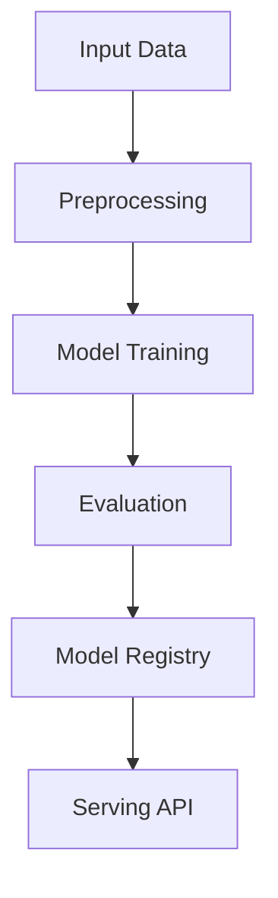

# self-supervised-monitoring

## ∫ Mathematics & Theory

Self-Supervised Learning — Underlying equations and derivations

$$\mathcal{L}_{InfoNCE} = -\log \frac{\exp(\text{sim}(z_i, z_j) / \tau)}{\sum_{k=1}^{2N} \mathbb{1}_{[k \neq i]} \exp(\text{sim}(z_i, z_k) / \tau)}$$

$$z_i = g_\theta(f_\theta(x_i))$$

$$\text{sim}(u, v) = \frac{u^T v}{\|u\| \|v\|}$$

### Step-by-Step Derivation

Self-supervised learning creates labels from the data itself via pretext tasks. Contrastive learning (e.g., SimCLR, MoCo) maximizes agreement between augmented views of the same sample. The InfoNCE loss pulls positive pairs together while pushing apart negatives. A temperature parameter $\tau$ controls the sharpness of the distribution.

### Interactive Visualization

Interactive augmentation preview; contrastive embedding t-SNE; similarity matrix heatmap.

## ⚙ Architecture

Model structure, data flow, and layer breakdown

### Class Hierarchy

```
  DenoisingAutoencoder
```

### Data Flow



## ⚡ API Reference

FastAPI endpoints and model interfaces

| Method | Endpoint |
| --- | --- |
| `GET` | `/` |
| `GET` | `/health` |
| `GET` | `/metrics` |
| `POST` | `/reload` |

## ▶ Usage

Code examples and CLI commands

### Training Script

```python
"""Production training pipeline for self-supervised server monitoring.

Trains a denoising autoencoder to reconstruct normal server metrics from
corrupted inputs. The self-supervised signal comes from the data itself -
no human labels are required for training.
"""

import argparse
import os
from pathlib import Path

import numpy as np
from ai_core.logging import get_logger, setup_logging
from ai_core.model_registry import ModelRegistry

from self_supervised_monitoring.data import (
    generate_synthetic_data,
    save_training_data,
)
from self_supervised_monitoring.model import DenoisingAutoencoder

logger = get_logger(__name__)

def train(
    model_dir: Path,
    data_path: Path | None = None,
    n_samples: int = 2000,
    hidden_dim: int = 16,
    learning_rate: float = 0.01,
    n_iterations: int = 5000,
    noise_rate: float = 0.25,
    threshold_percentile: float = 95.0,
    model_version: str = "1.0.0",
    register_to_mlflow: bool = False,
    random_seed: int = 42,
) -> dict:
    """Train the self-supervised denoising autoencoder and save artifacts.

    The model is trained on normal server metrics only. Anomalies are
    detected at inference time via high reconstruction error.

    Returns:
        Dictionary with training metrics
    """
    # Generate or load data
    # For self-supervised training, we use only the anomaly-free portion
    X_full, y_full = generate_synthetic_data(n_samples=n_samples, random_seed=random_seed)

    # Separate normal and anomalous data
    X_normal = X_full[y_full == 0]
    X_anomaly = X_full[y_full == 1]

    # Split normal data for train/validation
    rng = np.random.default_rng(random_seed)
    n_val = max(1, int(len(X_normal) * 0.2))
    val_idx = rng.choice(len(X_normal), size=n_val, replace=False)
    val_mask = np.zeros(len(X_normal), dtype=bool)
    val_mask[val_idx] = True

    X_train = X_normal[~val_mask]
    X_val = X_normal[val_mask]

    # Split anomaly data for test evaluation
    n_test_anomaly = max(1, int(len(X_anomaly) * 0.5))
    test_anom_idx = rng.choice(len(X_anomaly), size=n_test_anomaly, replace=False)
    X_test_anomaly = X_anomaly[test_anom_idx]
    y_test_anomaly = np.ones(n_test_anomaly, dtype=int)

    # Use some normal data for test too
    test_norm_idx = rng.choice(len(X_normal), size=n_test_anomaly, replace=False)
    X_test_normal = X_normal[test_norm_idx]
    y_test_normal = np.zeros(n_test_anomaly, dtype=int)

    # Combine test set
    X_test = np.vstack([X_test_normal, X_test_anomaly])
    y_test = np.concatenate([y_test_normal, y_test_anomaly])

    logger.info(
        "Loaded self-supervised training data",
        n_train=len(X_train),
        n_val=len(X_val),
        n_test=len(X_test),
        n_features=X_train.shape[1],
        training_mode="self-supervised (denoising autoencoder)",
    )

    # Save full dataset for reproducibility
    model_dir.mkdir(parents=True, exist_ok=True)
    save_training_data(X_full, y_full, model_dir / "training_data.csv")

    # Train self-supervised model
    model = DenoisingAutoencoder(
        hidden_dim=hidden_dim,
        learning_rate=learning_rate,
        n_iterations=n_iterations,
        noise_rate=noise_rate,
        random_seed=random_seed,
    )
    model.threshold_percentile = threshold_percentile
    model.fit(X_train, X_val=X_val, X_test=X_test, y_test=y_test)

    # Compute metrics
    test_metrics = model.evaluate(X_test, y_test)
    train_errors = model.reconstruction_error(X_train)
    val_errors = model.reconstruction_error(X_val)

    metrics = {
        **test_metrics,
        "training_mode": "self-supervised",
        "n_train_samples": float(len(X_train)),
        "n_val_samples": float(len(X_val)),
        "n_test_samples": float(len(X_test)),
        "n_anomaly_test": float(np.sum(y_test == 1)),
        "n_normal_test": float(np.sum(y_test == 0)),
        "train_mean_recon_error": float(np.mean(train_errors)),
        "train_max_recon_error": float(np.max(train_errors)),
        "val_mean_recon_error": float(np.mean(val_errors)),
        "final_loss": model.loss_history[-1] if model.loss_history else 0.0,
        "n_epochs_run": float(len(model.loss_history)),
        "reconstruction_threshold": float(model.threshold),
        "threshold_percentile": float(model.threshold_percentile),
        "noise_rate": float(noise_rate),
        "hidden_dim": float(hidden_dim),
        "learning_rate": float(learning_rate),
    }

    logger.info(
        "Self-supervised training complete",
        training_mode="self-supervised",
        n_epochs=len(model.loss_history),
        final_loss=model.loss_history[-1] if model.loss_history else 0.0,
        threshold=model.threshold,
        test_accuracy=test_metrics["accuracy"],
    )

    # Save model
    model_path = model_dir / f"self_supervised_monitoring_model_v{model_version}.npz"
    model.save(str(model_path))

    # Save training chart
    _save_chart(model, model_dir, model_version)

    # Register model
    registry = ModelRegistry(base_dir=model_dir)
    registry.save_model(
        model_name="self-supervised-monitoring",
        model_version=model_version,
        model_type="self_supervised_anomaly_detection",
        metrics=metrics,
        parameters={
            "hidden_dim": hidden_dim,
            "learning_rate": learning_rate,
            "n_iterations": n_iterations,
            "noise_rate": noise_rate,
            "threshold_percentile": threshold_percentile,
            "random_seed": random_seed,
        },
        artifacts={
            f"self_supervised_monitoring_model_v{model_version}.npz": model_path,
            "training_data.csv": model_dir / "training_data.csv",
        },
        tags={
            "framework": "numpy",
            "task": "self_supervised_anomaly_detection",
            "base_model": "denoising_autoencoder",
        },
    )

    if register_to_mlflow:
        registry.log_to_mlflow(
            model_name="self-supervised-monitoring",
            model_version=model_version,
            metrics=metrics,
            params={
                "hidden_dim": hidden_dim,
                "learning_rate": learning_rate,
                "n_iterations": n_iterations,
                "noise_rate": noise_rate,
                "threshold_percentile": threshold_percentile,
                "random_seed": random_seed,
            },
            artifacts={
                "model": str(model_path),
                "chart": str(model_dir / f"self_supervised_monitoring_v{model_version}.png"),
                "training_data": str(model_dir / "training_data.csv"),
            },
            tags={"model_type": "self_supervised_anomaly_detection", "framework": "numpy"},
        )
        logger.info(
            "Registered model to MLflow", model="self-supervised-monitoring", version=model_version
        )

    return metrics

def _save_chart(model: DenoisingAutoencoder, output_dir: Path, version: str) -> None:
    """Save the training loss chart."""
    import matplotlib

    matplotlib.use("Agg")
    import matplotlib.pyplot as plt

    if not model.loss_history:
        return

    fig, ax = plt.subplots(figsize=(10, 5))
    ax.plot(model.loss_history, color="steelblue", linewidth=1.5)
    ax.set_xlabel("Training Iteration")
    ax.set_ylabel("Reconstruction Loss (MSE)")
    ax.set_title("Self-Supervised Denoising Autoencoder Training Loss")
    ax.grid(True, alpha=0.3)
    ax.set_yscale("log")

    plt.tight_layout()
    chart_path = output_dir / f"self_supervised_monitoring_v{version}.png"
    plt.savefig(str(chart_path), dpi=100)
    plt.close()
    logger.info("Chart saved", path=str(chart_path))

def main():
    parser = argparse.ArgumentParser(
        description="Train self-supervised monitoring model (denoising autoencoder)"
    )
    parser.add_argument("--model-dir", type=Path, default=Path(os.getenv("MODEL_DIR", "/models")))
    parser.add_argument("--data-path", type=Path, default=None)
    parser.add_argument("--n-samples", type=int, default=int(os.getenv("N_SAMPLES", "2000")))
    parser.add_argument("--hidden-dim", type=int, default=int(os.getenv("HIDDEN_DIM", "16")))
    parser.add_argument(
        "--learning-rate", type=float, default=float(os.getenv("LEARNING_RATE", "0.01"))
    )
    parser.add_argument("--n-iterations", type=int, default=int(os.getenv("N_ITERATIONS", "5000")))
    parser.add_argument("--noise-rate", type=float, default=float(os.getenv("NOISE_RATE", "0.25")))
    parser.add_argument(
        "--threshold-percentile",
        type=float,
        default=float(os.getenv("THRESHOLD_PERCENTILE", "95.0")),
    )
    parser.add_argument("--model-version", type=str, default=os.getenv("MODEL_VERSION", "1.0.0"))
    parser.add_argument("--random-seed", type=int, default=int(os.getenv("RANDOM_SEED", "42")))
    parser.add_argument(
        "--register-mlflow",
        action="store_true",
        default=os.getenv("REGISTER_MLFLOW", "false").lower() == "true",
    )
    parser.add_argument("--log-level", type=str, default=os.getenv("LOG_LEVEL", "INFO"))
    args = parser.parse_args()

    setup_logging(args.log_level)
    args.model_dir.mkdir(parents=True, exist_ok=True)

    metrics = train(
        model_dir=args.model_dir,
        data_path=args.data_path,
        n_samples=args.n_samples,
        hidden_dim=args.hidden_dim,
        learning_rate=args.learning_rate,
        n_iterations=args.n_iterations,
        noise_rate=args.noise_rate,
        threshold_percentile=args.threshold_percentile,
        model_version=args.model_version,
        register_to_mlflow=args.register_mlflow,
        random_seed=args.random_seed,
    )

    logger.info("Training finished", metrics=metrics, model_dir=str(args.model_dir))

if __name__ == "__main__":
    main()
```

### API Server

```python
"""Production serving API for self-supervised server monitoring anomaly detection.

Uses a denoising autoencoder trained on normal server metrics to detect
anomalies via reconstruction error. The model is trained in a self-supervised
manner - no human labels are required.
"""

import os
import time
from contextlib import asynccontextmanager
from pathlib import Path

import numpy as np
from ai_core.drift import DriftDetector
from ai_core.fastapi_middleware import add_observability_middleware
from ai_core.logging import get_logger, setup_logging
from ai_core.metrics import MetricsCollector
from ai_core.model_registry import ModelRegistry
from ai_core.validation import DataValidator, create_self_supervised_monitoring_schema
from fastapi import FastAPI, HTTPException, Response
from pydantic import BaseModel, Field

from self_supervised_monitoring.data import FEATURE_NAMES
from self_supervised_monitoring.model import DenoisingAutoencoder

logger = get_logger(__name__)

# Configuration
MODEL_DIR = Path(os.getenv("MODEL_DIR", "/models"))
MODEL_VERSION = os.getenv("MODEL_VERSION", "latest")
METRICS_PORT = int(
    os.getenv("METRICS_PORT", os.getenv("SELF_SUPERVISED_MONITORING_METRICS_PORT", "8007"))
)
DRIFT_THRESHOLD = float(os.getenv("DRIFT_THRESHOLD", "0.2"))

class MetricsRequest(BaseModel):
    """Single metrics observation for anomaly detection."""

    request_count: float = Field(..., ge=0, description="Number of requests")
    bytes_per_request: float = Field(..., ge=0, description="Average bytes per request")
    cpu_usage: float = Field(..., ge=0, le=100, description="CPU usage percentage")
    memory_usage: float = Field(..., ge=0, le=100, description="Memory usage percentage")
    disk_io: float = Field(..., ge=0, description="Disk I/O operations per second")
    network_in: float = Field(..., ge=0, description="Network inbound MB/s")
    network_out: float = Field(..., ge=0, description="Network outbound MB/s")
    error_rate: float = Field(..., ge=0, le=100, description="Error rate percentage")
    connection_count: float = Field(..., ge=0, description="Active connections")
    response_time: float = Field(..., ge=0, description="Average response time in ms")

class MetricsBulkRequest(BaseModel):
    """Bulk metrics request for anomaly detection."""

    samples: list[MetricsRequest] = Field(..., min_length=1, max_length=100)

class AnomalyResponse(BaseModel):
    """Anomaly detection response for a single observation."""

    is_anomaly: bool
    anomaly_score: float
    anomaly_probability: float
    reconstruction_error: float
    anomaly_threshold: float
    model_version: str
    training_mode: str

class BulkAnomalyResponse(BaseModel):
    """Bulk anomaly detection response."""

    samples: list[AnomalyResponse]
    n_anomalies: int
    n_samples: int
    model_version: str

class StatsResponse(BaseModel):
    """Model statistics response."""

    n_features: int
    hidden_dim: int
    threshold: float
    threshold_percentile: float
    noise_rate: float
    training_mode: str
    n_train_samples: int
    final_loss: float
    n_epochs_run: int
    model_version: str

class ModelInfoResponse(BaseModel):
    """Model information response."""

    n_features: int
    hidden_dim: int
    threshold: float
    feature_names: list[str]
    training_mode: str
    model_version: str

class DriftResponse(BaseModel):
    """Drift detection response."""

    total_features: int
    drifted_features: int
    drift_ratio: float
    drifted: list[dict]
    all_results: list[dict]

# Global model state
_model: DenoisingAutoencoder | None = None
_model_version: str = "unknown"
_metrics: MetricsCollector | None = None
_validator: DataValidator | None = None
_drift_detector: DriftDetector | None = None
_reference_data: np.ndarray | None = None
_recent_predictions: list[list[float]] = []

@asynccontextmanager
async def lifespan(app: FastAPI):
    """Load model at startup and clean up at shutdown."""
    global _model, _model_version, _metrics, _validator, _drift_detector, _reference_data

    setup_logging(os.getenv("LOG_LEVEL", "INFO"))
    _metrics = MetricsCollector("self_supervised_monitoring", port=METRICS_PORT)
    app.state.metrics = _metrics

    _validator = DataValidator(create_self_supervised_monitoring_schema())
    _drift_detector = DriftDetector(
        feature_names=FEATURE_NAMES,
        feature_types={f: "float" for f in FEATURE_NAMES},
        psi_threshold=DRIFT_THRESHOLD,
    )

    _model, _model_version = _load_model()
    _metrics.set_model_version(_model_version)
    _metrics.set_model_info(
        model_name="self-supervised-monitoring",
        model_version=_model_version,
        model_type="self_supervised_anomaly_detection",
    )

    # Load reference data for drift detection
    _reference_data = _load_reference_data()
    logger.info("Model loaded", model="self-supervised-monitoring", version=_model_version)

    yield

    logger.info("Shutting down self-supervised-monitoring API")

def _load_model() -> tuple[DenoisingAutoencoder, str]:
    """Load the latest model from the registry or model directory with resilient fallback."""
    # 1. Try model registry
    registry = ModelRegistry(base_dir=MODEL_DIR)
    try:
        if MODEL_VERSION == "latest":
            models = registry.list_models()
            ss_models = [m for m in models if m.get("model_name") == "self-supervised-monitoring"]
            if ss_models:
                ss_models.sort(key=lambda m: m["model_version"], reverse=True)
                latest = ss_models[0]
                model_dir = Path(latest["artifact_path"])
                npz_files = list(model_dir.glob("self_supervised_monitoring_model_*.npz")) + list(
                    model_dir.glob("*.npz")
                )
                if npz_files:
                    return DenoisingAutoencoder.load(str(npz_files[0])), latest["model_version"]
        else:
            model_dir = MODEL_DIR / "self-supervised-monitoring" / MODEL_VERSION
            if model_dir.exists():
                npz_files = list(model_dir.glob("self_supervised_monitoring_model_*.npz")) + list(
                    model_dir.glob("*.npz")
                )
                if npz_files:
                    return DenoisingAutoencoder.load(str(npz_files[0])), MODEL_VERSION
    except Exception as e:
        logger.warning(f"Registry lookup failed: {e}")

    # 2. Try direct model in MODEL_DIR
    npz_path = MODEL_DIR / "self_supervised_monitoring_model.npz"
    if npz_path.exists():
        return DenoisingAutoencoder.load(str(npz_path)), "legacy"

    # 3. Try bundled artifacts directory
    candidate_paths = [
        Path("/app/artifacts/models/self_supervised_monitoring_model_v1.0.0.npz"),
        Path(__file__).resolve().parents[3]
        / "artifacts"
        / "models"
        / "self_supervised_monitoring_model_v1.0.0.npz",
    ]
    for p in candidate_paths:
        if p.exists():
            logger.info("Loading bundled baseline model", path=str(p))
            return DenoisingAutoencoder.load(str(p)), "1.0.0-bundled"

    # 4. In-memory baseline fallback (never crash cold start)
    logger.warning(
        "No pre-existing model found on disk. Initializing baseline self-supervised model."
    )
    from self_supervised_monitoring.data import generate_normal_data

    X_base = generate_normal_data(n_samples=2000, random_seed=42)
    model = DenoisingAutoencoder(
        hidden_dim=16,
        learning_rate=0.01,
        n_iterations=1000,
        noise_rate=0.25,
        random_seed=42,
    )
    model.fit(X_base)
    return model, "1.0.0-baseline"

def _load_reference_data() -> np.ndarray | None:
    """Load reference training data for drift detection."""
    candidate_csvs = [
        MODEL_DIR / "self-supervised-monitoring" / _model_version / "training_data.csv",
        MODEL_DIR / "training_data.csv",
        Path("/app/artifacts/models/training_data.csv"),
        Path(__file__).resolve().parents[3] / "artifacts" / "models" / "training_data.csv",
    ]
    for csv_path in candidate_csvs:
        if csv_path.exists():
            try:
                import pandas as pd

                df = pd.read_csv(csv_path)
                if all(f in df.columns for f in FEATURE_NAMES):
                    return df[FEATURE_NAMES].values
            except Exception as e:
                logger.warning("Could not read reference csv", path=str(csv_path), error=str(e))

    from self_supervised_monitoring.data import generate_normal_data

    X_base = generate_normal_data(n_samples=500, random_seed=42)
    return X_base

# Create FastAPI app
app = FastAPI(
    title="Self-Supervised Monitoring API",
    description="Self-supervised anomaly detection using a denoising autoencoder trained on normal server metrics",
    version="1.0.0",
    lifespan=lifespan,
)

# Add observability middleware
add_observability_middleware(app)

@app.get("/")
def read_root():
    """Service information."""
    return {
        "service": "self-supervised-monitoring-api",
        "version": "1.0.0",
        "model_version": _model_version,
        "training_mode": _model.training_mode if _model else "unknown",
        "features": FEATURE_NAMES,
        "endpoints": {
            "health": "/health",
            "predict": "POST /predict",
            "predict/bulk": "POST /predict/bulk",
            "stats": "GET /stats",
            "model_info": "GET /model/info",
            "drift": "GET /drift",
            "metrics": "/metrics",
        },
    }

@app.get("/health")
def health_check():
    """Kubernetes liveness/readiness probe."""
    if _model is None:
        raise HTTPException(status_code=503, detail="Model not loaded")
    return {
        "status": "healthy",
        "model_loaded": True,
        "model_version": _model_version,
        "training_mode": _model.training_mode,
    }

@app.get("/metrics")
def metrics():
    """Prometheus metrics endpoint."""
    from prometheus_client import CONTENT_TYPE_LATEST, generate_latest

    return Response(content=generate_latest(), media_type=CONTENT_TYPE_LATEST)

@app.post("/reload")
def reload_model():
    """Dynamically reload the model from disk/registry."""
    global _model, _model_version, _reference_data
    try:
        _model, _model_version = _load_model()
        if _metrics:
            _metrics.set_model_version(_model_version)
            _metrics.set_model_info(
                model_name="self-supervised-monitoring",
                model_version=_model_version,
                model_type="self_supervised_anomaly_detection",
            )
        _reference_data = _load_reference_data()
        logger.info(
            "Model reloaded dynamically", model="self-supervised-monitoring", version=_model_version
        )
        return {"status": "reloaded", "model_version": _model_version}
    except Exception as e:
        logger.exception("Model reload failed", error=str(e))
        raise HTTPException(status_code=500, detail=f"Reload failed: {e}") from e

@app.get("/drift", response_model=DriftResponse)
def drift_check():
    """Check for data drift between reference and recent predictions."""
    if _drift_detector is None or _reference_data is None:
        raise HTTPException(status_code=503, detail="Drift detection not available")

    if len(_recent_predictions) < 10:
        return DriftResponse(
            total_features=len(FEATURE_NAMES),
            drifted_features=0,
            drift_ratio=0.0,
            drifted=[],
            all_results=[],
        )

    current = np.array(_recent_predictions[-100:])
    results = _drift_detector.detect_drift(_reference_data, current)
    summary = _drift_detector.summarize(results)

    if _metrics:
        _metrics.set_drift_ratio(summary["drift_ratio"])

    return DriftResponse(**summary)

@app.get("/stats", response_model=StatsResponse)
def get_stats():
    """Return model statistics."""
    if _model is None or _model.W1 is None:
        raise HTTPException(status_code=503, detail="Model not loaded")

    return StatsResponse(
        n_features=_model.input_dim,
        hidden_dim=_model.hidden_dim,
        threshold=round(_model.threshold, 4),
        threshold_percentile=_model.threshold_percentile,
        noise_rate=_model.noise_rate,
        training_mode=_model.training_mode,
        n_train_samples=len(_reference_data) if _reference_data is not None else 0,
        final_loss=_model.loss_history[-1] if _model.loss_history else 0.0,
        n_epochs_run=len(_model.loss_history),
        model_version=_model_version,
    )

@app.get("/model/info", response_model=ModelInfoResponse)
def get_model_info():
    """Return detailed model information."""
    if _model is None or _model.W1 is None:
        raise HTTPException(status_code=503, detail="Model not loaded")

    return ModelInfoResponse(
        n_features=_model.input_dim,
        hidden_dim=_model.hidden_dim,
        threshold=round(_model.threshold, 4),
        feature_names=FEATURE_NAMES,
        training_mode=_model.training_mode,
        model_version=_model_version,
    )

def _extract_features(observation: MetricsRequest) -> list[float]:
    """Extract feature vector from request."""
    return [
        observation.request_count,
        observation.bytes_per_request,
        observation.cpu_usage,
        observation.memory_usage,
        observation.disk_io,
        observation.network_in,
        observation.network_out,
        observation.error_rate,
        observation.connection_count,
        observation.response_time,
    ]

def _compute_anomaly(observation: MetricsRequest) -> AnomalyResponse:
    """Core anomaly detection logic shared by all detection endpoints."""
    if _model is None or _metrics is None or _validator is None:
        raise HTTPException(status_code=503, detail="Model not loaded")

    features = _extract_features(observation)
    X = np.array([features])

    # Validate input
    validation = _validator.validate(X)
    if not validation.valid:
        raise HTTPException(status_code=422, detail=validation.errors)

    start = time.time()
    try:
        recon_error = float(_model.reconstruction_error(X)[0])
        is_anom = bool(_model.is_anomaly(X)[0])
        proba = float(_model.predict_proba(X)[0])
        duration = time.time() - start
        _metrics.record_prediction(model_version=_model_version, duration=duration)

        # Track for drift detection
        _recent_predictions.append(features)
        if len(_recent_predictions) > 1000:
            _recent_predictions.pop(0)

        return AnomalyResponse(
            is_anomaly=is_anom,
            anomaly_score=round(recon_error, 4),
            anomaly_probability=round(proba, 4),
            reconstruction_error=round(recon_error, 4),
            anomaly_threshold=round(_model.threshold, 4),
            model_version=_model_version,
            training_mode=_model.training_mode if _model else "unknown",
        )
    except Exception as e:
        _metrics.record_error(model_version=_model_version, error_type="prediction")
        logger.exception("Anomaly detection failed", error=str(e))
        raise HTTPException(status_code=500, detail="Anomaly detection failed") from e

@app.post("/predict", response_model=AnomalyResponse)
def predict_anomaly(body: MetricsRequest):
    """Detect anomaly for a single metrics observation."""
    return _compute_anomaly(body)

@app.post("/predict/bulk", response_model=BulkAnomalyResponse)
def predict_anomaly_bulk(body: MetricsBulkRequest):
    """Detect anomalies for multiple metrics observations."""
    global _recent_predictions
    if _model is None or _metrics is None or _validator is None:
        raise HTTPException(status_code=503, detail="Model not loaded")

    if len(body.samples) < 1 or len(body.samples) > 100:
        raise HTTPException(status_code=422, detail="Batch size must be between 1 and 100")

    X = np.array([_extract_features(s) for s in body.samples])

    # Validate input
    validation = _validator.validate(X)
    if not validation.valid:
        raise HTTPException(status_code=422, detail=validation.errors)

    start = time.time()
    try:
        recon_errors = _model.reconstruction_error(X)
        anomalies = _model.is_anomaly(X)
        probas = _model.predict_proba(X)
        duration = time.time() - start
        _metrics.record_prediction(model_version=_model_version, duration=duration)

        # Track for drift detection
        _recent_predictions.extend(X.tolist())
        if len(_recent_predictions) > 1000:
            _recent_predictions = _recent_predictions[-1000:]

        results = [
            AnomalyResponse(
                is_anomaly=bool(anom),
                anomaly_score=round(float(recon_error), 4),
                anomaly_probability=round(float(proba), 4),
                reconstruction_error=round(float(recon_error), 4),
                anomaly_threshold=round(_model.threshold, 4),
                model_version=_model_version,
                training_mode=_model.training_mode if _model else "unknown",
            )
            for anom, recon_error, proba in zip(anomalies, recon_errors, probas, strict=False)
        ]

        n_anomalies = int(np.sum(anomalies))
        return BulkAnomalyResponse(
            samples=results,
            n_anomalies=n_anomalies,
            n_samples=len(results),
            model_version=_model_version,
        )
    except Exception as e:
        _metrics.record_error(model_version=_model_version, error_type="prediction")
        logger.exception("Bulk anomaly detection failed", error=str(e))
        raise HTTPException(status_code=500, detail="Bulk anomaly detection failed") from e
```

### CLI Commands

```bash
uv run python -m self_supervised_monitoring.train --model-dir ./artifacts/models
```

## 📊 Benchmarks

Test results and performance metrics

Run `pytest tests/test_models.py` and `pytest tests/test_apis.py` for detailed metrics.

### Related Apps

- [semi-supervised-email](../semi-supervised-email/README.md)

- [self-organizing-maps](../self-organizing-maps/README.md)

Generated documentation for **self-supervised-monitoring**
