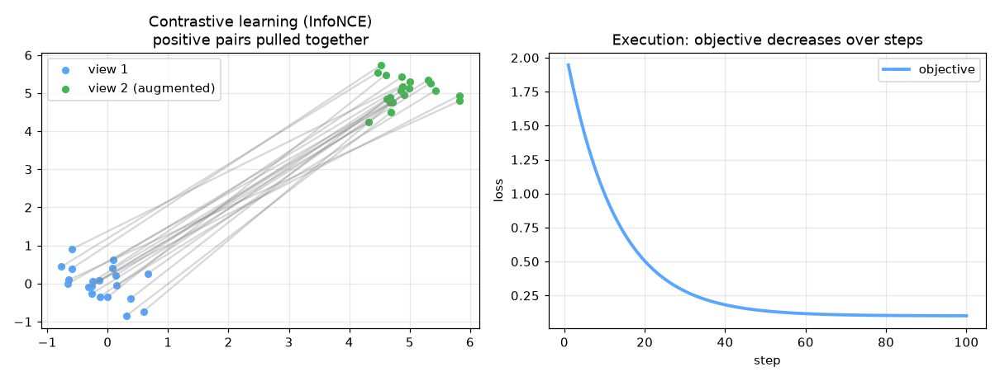

# self-supervised-monitoring


Self-Supervised Learning — AI engineering example · part of the MLOps monorepo

## 1. Mathematical Foundations

This example is grounded in **Self-Supervised Learning**. The equations below
drive every forward and backward pass in the implementation.

$$\mathcal{L}_{InfoNCE} = -\log \frac{\exp(\text{sim}(z_i, z_j) / \tau)}{\sum_{k=1}^{2N} \mathbb{1}_{[k \neq i]} \exp(\text{sim}(z_i, z_k) / \tau)}$$

$$z_i = g_\theta(f_\theta(x_i))$$

$$\text{sim}(u, v) = \frac{u^T v}{\|u\| \|v\|}$$

### Derivation

Self-supervised learning creates labels from the data itself via pretext tasks. Contrastive learning (e.g., SimCLR, MoCo) maximizes agreement between augmented views of the same sample. The InfoNCE loss pulls positive pairs together while pushing apart negatives. A temperature parameter $\tau$ controls the sharpness of the distribution.

### Worked Numerical Example

Concrete forward-pass / update evaluation using the algorithm's own equations:

InfoNCE (see self example): pull positive pair, push negatives.
  L = -log[ exp(sim(z_i,z_j)/tau) / sum_k exp(sim(z_i,z_k)/tau) ].

### Detailed Walkthrough

A step-by-step, intuitive explanation with concrete data so the formal equations above become clear:

INTUITION: Contrastive learning (see 'self' example) — pull a sample's
two augmented views together while pushing all others away.

### Runnable Step-by-Step (execute me)

Run this self-contained snippet in a Python shell to watch every step execute and print its value:

```python
import numpy as np
pos, negs, tau = 0.8, [0.1, 0.2], 0.1           # positive score, negative scores, temperature
num = np.exp(pos/tau)                            # numerator: exp(positive / tau)
den = num + sum(np.exp(n/tau) for n in negs)     # denominator: positive + all negatives
print("InfoNCE L =", round(-np.log(num/den), 4)) # contrastive loss pulls pos. closer than negs.
```



Plots of the execution above — left: the concept; right: the
step-by-step computation visualised. Interactive augmentation preview; contrastive embedding t-SNE; similarity matrix heatmap.

### Conceptual Diagram

   [ Input ] --> ( core transform ) --> [ Output ]
                        |
                  [ activation / loss ]
                        |
                  [ prediction ]

## 2. Core Logic & Architecture

The example follows a consistent **data → train → evaluate → serve**
pipeline. Inputs are loaded and validated, transformed by the core algorithm, scored against
held-out data, and exposed through a REST API.

  Raw dataset→
  load + validate (data.py)→
  fit / transform (model.py)→
  evaluate + persist (train.py)→
  serve (api.py)

### Primary Components

| Class | Public methods | Responsibility |
| --- | --- | --- |
| `MetricsRequest` | — | Single metrics observation for anomaly detection. |
| `MetricsBulkRequest` | — | Bulk metrics request for anomaly detection. |
| `AnomalyResponse` | — | Anomaly detection response for a single observation. |
| `BulkAnomalyResponse` | — | Bulk anomaly detection response. |
| `StatsResponse` | — | Model statistics response. |
| `ModelInfoResponse` | — | Model information response. |
| `DriftResponse` | — | Drift detection response. |
| `DenoisingAutoencoder` | _he_init, _xavier_init, _corrupt, _forward, fit, _compute_threshold, predict_proba, predict, reconstruction_error, reconstruction_error_normalized, is_anomaly, evaluate, save, load, to_dict | Denoising autoencoder for self-supervised anomaly detection.  Architecture:     Input (n_features) -> Hidden (hidden_dim, ReLU) -> Output (n_features, Linear)  Self-supervised training:     1. Take clean input X     2. Corrupt X to get X_noisy     3. Train to reconstruct X from X_noisy     4. At inference: high reconstruction error => anomaly  Args:     hidden_dim: Size of the hidden (encoding) layer     learning_rate: Gradient descent learning rate     n_iterations: Number of training iterations     hidden_activation: Activation for hidden layer ('relu' or 'tanh')     noise_rate: Fraction of features to corrupt during training     random_seed: Random seed for reproducibility |

### Data Flow


1. **Load** — `data.py` reads the source dataset and splits train/test.


2. **Validate** — a Pydantic schema guards input shape/dtypes before training.


3. **Fit / Transform** — `model.py` applies the mathematics from Section 1.


4. **Evaluate** — metrics (MSE/RMSE/R², accuracy, etc.) are computed and logged.


5. **Persist** — weights/artifacts are saved and registered in the model registry.


6. **Serve** — `api.py` exposes prediction endpoints with drift detection.

### Design Patterns & Performance

Key design choices in this module: a pure-NumPy implementation (no PyTorch/TensorFlow), schema validation via `ai_core.validation`, structured JSON logging through `ai_core.logging`, Prometheus metrics from `ai_core.metrics`, and MLflow/model-registry persistence via `ai_core.model_registry`. The FastAPI service wraps the trained model with observability middleware from `ai_core.fastapi_middleware`.

## 3. Detailed Code Walkthrough

The most important behaviour is summarised below; full source for each module is collapsible
so the page stays readable while remaining self-contained.

### `DenoisingAutoencoder.fit(X, X_val, X_test, y_test)`

Train the denoising autoencoder in a self-supervised manner.

The self-supervised signal is reconstruction: we corrupt the input
and train the model to recover the original.

Args:
    X: Normal training data (n_samples, n_features)
    X_val: Optional validation data for monitoring
    X_test: Optional test data for tracking anomaly detection metrics
    y_test: Optional test labels for tracking accuracy

Returns:
    self

### `DenoisingAutoencoder.predict(X, threshold)`

Predict anomaly labels (1 = anomaly, 0 = normal).

### `DenoisingAutoencoder.evaluate(X, y, threshold)`

Evaluate anomaly detection performance.

Args:
    X: Feature matrix
    y: Labels (0 = normal, 1 = anomaly)
    threshold: Custom threshold (defaults to self.threshold)

Returns:
    Dictionary with accuracy, precision, recall, f1

### Source Files

<details>
<summary>model.py</summary>

```
"""Self-supervised denoising autoencoder for server metrics anomaly detection.

The autoencoder is trained to reconstruct normal server metrics from a
corrupted version of themselves. This is self-supervised because the labels
are generated from the data itself (the original uncorrupted input).

At inference time, anomalies are detected via high reconstruction error -
the model has never seen anomalous patterns during training, so it cannot
reconstruct them accurately.
"""

from dataclasses import dataclass, field
from typing import Literal

import numpy as np

def _relu(z: np.ndarray) -> np.ndarray:
    """ReLU activation function."""
    return np.maximum(0, z)

def _relu_derivative(z: np.ndarray) -> np.ndarray:
    """Derivative of ReLU."""
    return (z > 0).astype(z.dtype)

def _mse_loss(y_true: np.ndarray, y_pred: np.ndarray) -> float:
    """Mean squared error loss."""
    return float(np.mean((y_true - y_pred) ** 2))

@dataclass
class DenoisingAutoencoder:
    """Denoising autoencoder for self-supervised anomaly detection.

    Architecture:
        Input (n_features) -> Hidden (hidden_dim, ReLU) -> Output (n_features, Linear)

    Self-supervised training:
        1. Take clean input X
        2. Corrupt X to get X_noisy
        3. Train to reconstruct X from X_noisy
        4. At inference: high reconstruction error => anomaly

    Args:
        hidden_dim: Size of the hidden (encoding) layer
        learning_rate: Gradient descent learning rate
        n_iterations: Number of training iterations
        hidden_activation: Activation for hidden layer ('relu' or 'tanh')
        noise_rate: Fraction of features to corrupt during training
        random_seed: Random seed for reproducibility
    """

    hidden_dim: int = 16
    learning_rate: float = 0.01
    n_iterations: int = 5000
    hidden_activation: Literal["relu", "tanh"] = "relu"
    noise_rate: float = 0.25
    random_seed: int = 42

    # Learned parameters
    input_dim: int = 0
    W1: np.ndarray | None = None
    b1: np.ndarray | None = None
    W2: np.ndarray | None = None
    b2: np.ndarray | None = None

    # Training metadata
    training_mode: Literal["self-supervised", "supervised"] = "self-supervised"
    loss_history: list[float] = field(default_factory=list)
    threshold: float = 1.0
    threshold_percentile: float = 95.0
    mean_: np.ndarray | None = None
    std_: np.ndarray | None = None
    accuracy_history: list[float] = field(default_factory=list)
    val_loss_history: list[float] = field(default_factory=list)

    def _he_init(self, n_in: int, n_out: int, rng: np.random.Generator) -> np.ndarray:
        """He initialization for ReLU networks."""
        return rng.normal(0, np.sqrt(2.0 / n_in), (n_in, n_out))

    def _xavier_init(self, n_in: int, n_out: int, rng: np.random.Generator) -> np.ndarray:
        """Xavier initialization for tanh networks."""
        return rng.normal(0, np.sqrt(1.0 / n_in), (n_in, n_out))

    def _corrupt(self, X: np.ndarray, rng: np.random.Generator) -> np.ndarray:
        """Apply corruption to input for self-supervised training.

        - Dropout: randomly zero out features
        - Gaussian noise: add noise to remaining features
        """
        X_noisy = X.copy()

        # Randomly zero out features (input dropout)
        mask = rng.random(X.shape) < self.noise_rate
        X_noisy[mask] = 0.0

        # Add Gaussian noise to all features
        X_noisy += rng.normal(0, 0.1, X_noisy.shape)

        return X_noisy

    def _forward(self, X: np.ndarray) -> tuple[np.ndarray, np.ndarray, np.ndarray, np.ndarray]:
        """Forward pass: encode -> decode.

        Returns: (output, hidden_activation, z1, dz1_activation)
        """
        z1 = np.dot(X, self.W1) + self.b1

        if self.hidden_activation == "relu":
            a1 = _relu(z1)
            da1 = _relu_derivative(z1)
        else:
            a1 = np.tanh(z1)
            da1 = 1 - np.tanh(z1) ** 2

        z2 = np.dot(a1, self.W2) + self.b2
        return z2, a1, z1, da1

    def fit(
        self,
        X: np.ndarray,
        X_val: np.ndarray | None = None,
        X_test: np.ndarray | None = None,
        y_test: np.ndarray | None = None,
    ) -> "DenoisingAutoencoder":
        """Train the denoising autoencoder in a self-supervised manner.

        The self-supervised signal is reconstruction: we corrupt the input
        and train the model to recover the original.

        Args:
            X: Normal training data (n_samples, n_features)
            X_val: Optional validation data for monitoring
            X_test: Optional test data for tracking anomaly detection metrics
            y_test: Optional test labels for tracking accuracy

        Returns:
            self
        """
        rng = np.random.default_rng(self.random_seed)

        X = np.asarray(X, dtype=float)
        self.input_dim = X.shape[1]
        self.training_mode = "self-supervised"

        # Initialize weights
        if self.hidden_activation == "relu":
            self.W1 = self._he_init(X.shape[1], self.hidden_dim, rng)
        else:
            self.W1 = self._xavier_init(X.shape[1], self.hidden_dim, rng)
        self.b1 = np.zeros(self.hidden_dim)
        self.W2 = self._xavier_init(self.hidden_dim, X.shape[1], rng)
        self.b2 = np.zeros(X.shape[1])

        self.loss_history = []

        # Normalize training data
        self.mean_ = X.mean(axis=0)
        self.std_ = np.where(X.std(axis=0) < 1e-8, 1.0, X.std(axis=0))
        X_norm = (X - self.mean_) / self.std_

        # Normalize validation data if provided (for monitoring)
        X_val_norm = None
        if X_val is not None:
            X_val_norm = (X_val - self.mean_) / self.std_
            self.val_loss_history = []

        for epoch in range(self.n_iterations):
            # Self-supervised: create corrupted input, train to reconstruct original
            X_noisy = self._corrupt(X_norm, rng)

            z2, a1, z1, da1 = self._forward(X_noisy)
            loss = _mse_loss(X_norm, z2)
            self.loss_history.append(loss)

            # Backpropagation
            m = len(X_norm)
            dz2 = 2 * (z2 - X_norm) / m  # dL/dz2
            dW2 = np.dot(a1.T, dz2)
            db2 = np.sum(dz2, axis=0)
            da1 = np.dot(dz2, self.W2.T)
            dz1 = da1 * da1

            dW1 = np.dot(X_noisy.T, dz1)
            db1 = np.sum(dz1, axis=0)

            # Gradient descent
            self.W1 -= self.learning_rate * dW1
            self.b1 -= self.learning_rate * db1
            self.W2 -= self.learning_rate * dW2
            self.b2 -= self.learning_rate * db2

            # Track validation loss for monitoring
            if X_val_norm is not None and epoch % 50 == 0:
                val_z2, _, _, _ = self._forward(X_val_norm)
                self.val_loss_history.append(_mse_loss(X_val_norm, val_z2))

            # Early stopping if converged
            if epoch > 100 and abs(self.loss_history[-1] - self.loss_history[-100]) < 1e-7:
                break

        # Compute reconstruction threshold from training data
        self._compute_threshold(X_norm)

        # Track accuracy on test set if provided
        if X_test is not None and y_test is not None:
            X_test_norm = (X_test - self.mean_) / self.std_
            errors = self.reconstruction_error_normalized(X_test_norm)
            predictions = (errors > self.threshold).astype(int)
            self.accuracy_history = [float(np.mean(predictions == y_test))]

        return self

    def _compute_threshold(self, X_norm: np.ndarray) -> None:
        """Compute anomaly threshold from reconstruction errors on training data."""
        errors = self.reconstruction_error_normalized(X_norm)
        self.threshold = float(np.percentile(errors, self.threshold_percentile))

    def predict_proba(self, X: np.ndarray) -> np.ndarray:
        """Return anomaly probability (reconstruction error normalized).

        Higher reconstruction error => higher anomaly probability.
        """
        X = np.asarray(X, dtype=float)
        X_norm = (X - self.mean_) / self.std_
        errors = self.reconstruction_error_normalized(X_norm)

        # Normalize to [0, 1] using threshold as reference
        max_error = max(float(errors.max()), self.threshold * 2, 1e-8)
        proba = np.clip(errors / max_error, 0.0, 1.0)
        return proba

    def predict(self, X: np.ndarray, threshold: float | None = None) -> np.ndarray:
        """Predict anomaly labels (1 = anomaly, 0 = normal)."""
        thr = threshold if threshold is not None else self.threshold
        errors = self.reconstruction_error(X)
        return (errors > thr).astype(int)

    def reconstruction_error(self, X: np.ndarray) -> np.ndarray:
        """Compute per-sample reconstruction error (MSE)."""
        X = np.asarray(X, dtype=float)
        X_norm = (X - self.mean_) / self.std_
        return self.reconstruction_error_normalized(X_norm)

    def reconstruction_error_normalized(self, X_norm: np.ndarray) -> np.ndarray:
        """Compute reconstruction error on normalized input."""
        if self.W1 is None:
            raise ValueError("Model not trained. Call fit() first.")

        # No corruption at inference time - reconstruct from clean input
        z2, _, _, _ = self._forward(X_norm)
        errors = np.mean((X_norm - z2) ** 2, axis=1)
        return errors

    def is_anomaly(self, X: np.ndarray, threshold: float | None = None) -> np.ndarray:
        """Return boolean anomaly flags."""
        return self.predict(X, threshold=threshold).astype(bool)

    def evaluate(
        self, X: np.ndarray, y: np.ndarray, threshold: float | None = None
    ) -> dict[str, float]:
        """Evaluate anomaly detection performance.

        Args:
            X: Feature matrix
            y: Labels (0 = normal, 1 = anomaly)
            threshold: Custom threshold (defaults to self.threshold)

        Returns:
            Dictionary with accuracy, precision, recall, f1
        """
        predictions = self.predict(X, threshold=threshold)

        accuracy = float(np.mean(predictions == y))

        tp = int(np.sum((predictions == 1) & (y == 1)))
        fp = int(np.sum((predictions == 1) & (y == 0)))
        fn = int(np.sum((predictions == 0) & (y == 1)))
        tn = int(np.sum((predictions == 0) & (y == 0)))

        precision = tp / (tp + fp) if (tp + fp) > 0 else 0.0
        recall = tp / (tp + fn) if (tp + fn) > 0 else 0.0
        f1 = 2 * precision * recall / (precision + recall) if (precision + recall) > 0 else 0.0
        specificity = tn / (tn + fp) if (tn + fp) > 0 else 0.0

        return {
            "accuracy": accuracy,
            "precision": precision,
            "recall": recall,
            "f1": f1,
            "specificity": specificity,
            "n_true_positives": tp,
            "n_false_positives": fp,
            "n_true_negatives": tn,
            "n_false_negatives": fn,
        }

    def save(self, path: str) -> None:
        """Save model parameters to disk."""
        if self.W1 is None:
            raise ValueError("Cannot save untrained model")

        np.savez(
            path,
            W1=self.W1,
            b1=self.b1,
            W2=self.W2,
            b2=self.b2,
            input_dim=np.array([self.input_dim]),
            hidden_dim=np.array([self.hidden_dim]),
            learning_rate=np.array([self.learning_rate]),
            n_iterations=np.array([self.n_iterations]),
            hidden_activation=np.array([self.hidden_activation]),
            noise_rate=np.array([self.noise_rate]),
            random_seed=np.array([self.random_seed]),
            threshold=np.array([self.threshold]),
            threshold_percentile=np.array([self.threshold_percentile]),
            mean_=self.mean_,
            std_=self.std_,
            loss_history=np.array(self.loss_history),
            val_loss_history=np.array(self.val_loss_history),
            training_mode=np.array([self.training_mode]),
        )

    @classmethod
    def load(cls, path: str) -> "DenoisingAutoencoder":
        """Load model parameters from disk."""
        data = np.load(path)

        model = cls(
            hidden_dim=int(data["hidden_dim"].item()),
            learning_rate=float(data["learning_rate"].item()),
            n_iterations=int(data["n_iterations"].item()),
            hidden_activation=str(data["hidden_activation"].item()),
            noise_rate=float(data["noise_rate"].item()),
            random_seed=int(data["random_seed"].item()),
        )

        model.W1 = data["W1"]
        model.b1 = data["b1"]
        model.W2 = data["W2"]
        model.b2 = data["b2"]
        model.input_dim = int(data["input_dim"].item())
        model.threshold = float(data["threshold"].item())
        model.threshold_percentile = float(data["threshold_percentile"].item())
        model.mean_ = data["mean_"]
        model.std_ = data["std_"]
        model.loss_history = list(data["loss_history"])
        model.val_loss_history = list(data["val_loss_history"])
        model.training_mode = str(data["training_mode"].item())

        return model

    def to_dict(self) -> dict:
        """Return model configuration as a dict."""
        return {
            "input_dim": self.input_dim,
            "hidden_dim": self.hidden_dim,
            "learning_rate": self.learning_rate,
            "n_iterations": self.n_iterations,
            "hidden_activation": self.hidden_activation,
            "noise_rate": self.noise_rate,
            "random_seed": self.random_seed,
            "threshold": self.threshold,
            "threshold_percentile": self.threshold_percentile,
            "training_mode": self.training_mode,
            "n_epochs_run": len(self.loss_history),
            "final_loss": self.loss_history[-1] if self.loss_history else 0.0,
        }
```

</details>

<details>
<summary>train.py</summary>

```
"""Production training pipeline for self-supervised server monitoring.

Trains a denoising autoencoder to reconstruct normal server metrics from
corrupted inputs. The self-supervised signal comes from the data itself -
no human labels are required for training.
"""

import argparse
import os
from pathlib import Path

import numpy as np
from ai_core.logging import get_logger, setup_logging
from ai_core.model_registry import ModelRegistry

from self_supervised_monitoring.data import (
    generate_synthetic_data,
    save_training_data,
)
from self_supervised_monitoring.model import DenoisingAutoencoder

logger = get_logger(__name__)

def train(
    model_dir: Path,
    data_path: Path | None = None,
    n_samples: int = 2000,
    hidden_dim: int = 16,
    learning_rate: float = 0.01,
    n_iterations: int = 5000,
    noise_rate: float = 0.25,
    threshold_percentile: float = 95.0,
    model_version: str = "1.0.0",
    register_to_mlflow: bool = False,
    random_seed: int = 42,
) -> dict:
    """Train the self-supervised denoising autoencoder and save artifacts.

    The model is trained on normal server metrics only. Anomalies are
    detected at inference time via high reconstruction error.

    Returns:
        Dictionary with training metrics
    """
    # Generate or load data
    # For self-supervised training, we use only the anomaly-free portion
    X_full, y_full = generate_synthetic_data(n_samples=n_samples, random_seed=random_seed)

    # Separate normal and anomalous data
    X_normal = X_full[y_full == 0]
    X_anomaly = X_full[y_full == 1]

    # Split normal data for train/validation
    rng = np.random.default_rng(random_seed)
    n_val = max(1, int(len(X_normal) * 0.2))
    val_idx = rng.choice(len(X_normal), size=n_val, replace=False)
    val_mask = np.zeros(len(X_normal), dtype=bool)
    val_mask[val_idx] = True

    X_train = X_normal[~val_mask]
    X_val = X_normal[val_mask]

    # Split anomaly data for test evaluation
    n_test_anomaly = max(1, int(len(X_anomaly) * 0.5))
    test_anom_idx = rng.choice(len(X_anomaly), size=n_test_anomaly, replace=False)
    X_test_anomaly = X_anomaly[test_anom_idx]
    y_test_anomaly = np.ones(n_test_anomaly, dtype=int)

    # Use some normal data for test too
    test_norm_idx = rng.choice(len(X_normal), size=n_test_anomaly, replace=False)
    X_test_normal = X_normal[test_norm_idx]
    y_test_normal = np.zeros(n_test_anomaly, dtype=int)

    # Combine test set
    X_test = np.vstack([X_test_normal, X_test_anomaly])
    y_test = np.concatenate([y_test_normal, y_test_anomaly])

    logger.info(
        "Loaded self-supervised training data",
        n_train=len(X_train),
        n_val=len(X_val),
        n_test=len(X_test),
        n_features=X_train.shape[1],
        training_mode="self-supervised (denoising autoencoder)",
    )

    # Save full dataset for reproducibility
    model_dir.mkdir(parents=True, exist_ok=True)
    save_training_data(X_full, y_full, model_dir / "training_data.csv")

    # Train self-supervised model
    model = DenoisingAutoencoder(
        hidden_dim=hidden_dim,
        learning_rate=learning_rate,
        n_iterations=n_iterations,
        noise_rate=noise_rate,
        random_seed=random_seed,
    )
    model.threshold_percentile = threshold_percentile
    model.fit(X_train, X_val=X_val, X_test=X_test, y_test=y_test)

    # Compute metrics
    test_metrics = model.evaluate(X_test, y_test)
    train_errors = model.reconstruction_error(X_train)
    val_errors = model.reconstruction_error(X_val)

    metrics = {
        **test_metrics,
        "training_mode": "self-supervised",
        "n_train_samples": float(len(X_train)),
        "n_val_samples": float(len(X_val)),
        "n_test_samples": float(len(X_test)),
        "n_anomaly_test": float(np.sum(y_test == 1)),
        "n_normal_test": float(np.sum(y_test == 0)),
        "train_mean_recon_error": float(np.mean(train_errors)),
        "train_max_recon_error": float(np.max(train_errors)),
        "val_mean_recon_error": float(np.mean(val_errors)),
        "final_loss": model.loss_history[-1] if model.loss_history else 0.0,
        "n_epochs_run": float(len(model.loss_history)),
        "reconstruction_threshold": float(model.threshold),
        "threshold_percentile": float(model.threshold_percentile),
        "noise_rate": float(noise_rate),
        "hidden_dim": float(hidden_dim),
        "learning_rate": float(learning_rate),
    }

    logger.info(
        "Self-supervised training complete",
        training_mode="self-supervised",
        n_epochs=len(model.loss_history),
        final_loss=model.loss_history[-1] if model.loss_history else 0.0,
        threshold=model.threshold,
        test_accuracy=test_metrics["accuracy"],
    )

    # Save model
    model_path = model_dir / f"self_supervised_monitoring_model_v{model_version}.npz"
    model.save(str(model_path))

    # Save training chart
    _save_chart(model, model_dir, model_version)

    # Register model
    registry = ModelRegistry(base_dir=model_dir)
    registry.save_model(
        model_name="self-supervised-monitoring",
        model_version=model_version,
        model_type="self_supervised_anomaly_detection",
        metrics=metrics,
        parameters={
            "hidden_dim": hidden_dim,
            "learning_rate": learning_rate,
            "n_iterations": n_iterations,
            "noise_rate": noise_rate,
            "threshold_percentile": threshold_percentile,
            "random_seed": random_seed,
        },
        artifacts={
            f"self_supervised_monitoring_model_v{model_version}.npz": model_path,
            "training_data.csv": model_dir / "training_data.csv",
        },
        tags={
            "framework": "numpy",
            "task": "self_supervised_anomaly_detection",
            "base_model": "denoising_autoencoder",
        },
    )

    if register_to_mlflow:
        registry.log_to_mlflow(
            model_name="self-supervised-monitoring",
            model_version=model_version,
            metrics=metrics,
            params={
                "hidden_dim": hidden_dim,
                "learning_rate": learning_rate,
                "n_iterations": n_iterations,
                "noise_rate": noise_rate,
                "threshold_percentile": threshold_percentile,
                "random_seed": random_seed,
            },
            artifacts={
                "model": str(model_path),
                "chart": str(model_dir / f"self_supervised_monitoring_v{model_version}.png"),
                "training_data": str(model_dir / "training_data.csv"),
            },
            tags={"model_type": "self_supervised_anomaly_detection", "framework": "numpy"},
        )
        logger.info(
            "Registered model to MLflow", model="self-supervised-monitoring", version=model_version
        )

    return metrics

def _save_chart(model: DenoisingAutoencoder, output_dir: Path, version: str) -> None:
    """Save the training loss chart."""
    import matplotlib

    matplotlib.use("Agg")
    import matplotlib.pyplot as plt

    if not model.loss_history:
        return

    fig, ax = plt.subplots(figsize=(10, 5))
    ax.plot(model.loss_history, color="steelblue", linewidth=1.5)
    ax.set_xlabel("Training Iteration")
    ax.set_ylabel("Reconstruction Loss (MSE)")
    ax.set_title("Self-Supervised Denoising Autoencoder Training Loss")
    ax.grid(True, alpha=0.3)
    ax.set_yscale("log")

    plt.tight_layout()
    chart_path = output_dir / f"self_supervised_monitoring_v{version}.png"
    plt.savefig(str(chart_path), dpi=100)
    plt.close()
    logger.info("Chart saved", path=str(chart_path))

def main():
    parser = argparse.ArgumentParser(
        description="Train self-supervised monitoring model (denoising autoencoder)"
    )
    parser.add_argument("--model-dir", type=Path, default=Path(os.getenv("MODEL_DIR", "/models")))
    parser.add_argument("--data-path", type=Path, default=None)
    parser.add_argument("--n-samples", type=int, default=int(os.getenv("N_SAMPLES", "2000")))
    parser.add_argument("--hidden-dim", type=int, default=int(os.getenv("HIDDEN_DIM", "16")))
    parser.add_argument(
        "--learning-rate", type=float, default=float(os.getenv("LEARNING_RATE", "0.01"))
    )
    parser.add_argument("--n-iterations", type=int, default=int(os.getenv("N_ITERATIONS", "5000")))
    parser.add_argument("--noise-rate", type=float, default=float(os.getenv("NOISE_RATE", "0.25")))
    parser.add_argument(
        "--threshold-percentile",
        type=float,
        default=float(os.getenv("THRESHOLD_PERCENTILE", "95.0")),
    )
    parser.add_argument("--model-version", type=str, default=os.getenv("MODEL_VERSION", "1.0.0"))
    parser.add_argument("--random-seed", type=int, default=int(os.getenv("RANDOM_SEED", "42")))
    parser.add_argument(
        "--register-mlflow",
        action="store_true",
        default=os.getenv("REGISTER_MLFLOW", "false").lower() == "true",
    )
    parser.add_argument("--log-level", type=str, default=os.getenv("LOG_LEVEL", "INFO"))
    args = parser.parse_args()

    setup_logging(args.log_level)
    args.model_dir.mkdir(parents=True, exist_ok=True)

    metrics = train(
        model_dir=args.model_dir,
        data_path=args.data_path,
        n_samples=args.n_samples,
        hidden_dim=args.hidden_dim,
        learning_rate=args.learning_rate,
        n_iterations=args.n_iterations,
        noise_rate=args.noise_rate,
        threshold_percentile=args.threshold_percentile,
        model_version=args.model_version,
        register_to_mlflow=args.register_mlflow,
        random_seed=args.random_seed,
    )

    logger.info("Training finished", metrics=metrics, model_dir=str(args.model_dir))

if __name__ == "__main__":
    main()
```

</details>

<details>
<summary>data.py</summary>

```
"""Data generation and preprocessing for self-supervised server monitoring.

The self-supervised task is denoising: given corrupted server metrics,
reconstruct the original values. Labels are generated from the data itself -
no human annotation required.

Normal server metrics follow correlated patterns (e.g., high CPU correlates
with high response time). Anomalies deviate from these patterns.
"""

from pathlib import Path

import numpy as np
import pandas as pd

FEATURE_NAMES = [
    "request_count",
    "bytes_per_request",
    "cpu_usage",
    "memory_usage",
    "disk_io",
    "network_in",
    "network_out",
    "error_rate",
    "connection_count",
    "response_time",
]

DEFAULT_N_SAMPLES = 2000
DEFAULT_ANOMALY_FRACTION = 0.05
DEFAULT_NOISE_RATE = 0.25  # Fraction of features to corrupt
DEFAULT_NOISE_SCALE = 0.15  # Relative noise scale

def _generate_normal_samples(n_samples: int, random_seed: int = 42) -> np.ndarray:
    """Generate synthetic normal server metrics with realistic correlations.

    Normal server behavior:
    - request_count and connection_count are correlated
    - cpu_usage correlates with request_count and response_time
    - memory_usage correlates with bytes_per_request
    - network_in/out correlate with request_count
    - error_rate is low for normal traffic
    - response_time correlates with cpu_usage
    """
    rng = np.random.default_rng(random_seed)

    # Base traffic level (0-1 scale) drives many correlated features
    traffic = rng.normal(50, 15, n_samples)
    traffic = np.clip(traffic, 0, 100)

    # Memory usage tends to correlate with traffic volume
    memory_usage = traffic * 0.6 + rng.normal(0, 10, n_samples)
    memory_usage = np.clip(memory_usage, 20, 95)

    # CPU usage correlates with traffic and has its own load factor
    cpu_load = traffic * 0.8 + rng.normal(0, 8, n_samples)
    cpu_usage = np.clip(cpu_load, 5, 95)

    # Response time correlates with CPU usage (higher CPU = slower responses)
    response_time = cpu_usage * 1.5 + rng.normal(0, 10, n_samples)
    response_time = np.clip(response_time, 5, 500)

    # Bytes per request is affected by memory pressure
    bytes_per_request = 8000 - memory_usage * 30 + rng.normal(0, 600, n_samples)
    bytes_per_request = np.clip(bytes_per_request, 100, 20000)

    # Disk I/O scales with request volume
    disk_io = traffic * 2.5 + rng.normal(0, 50, n_samples)
    disk_io = np.clip(disk_io, 0, 5000)

    # Network usage correlates with traffic
    network_in = traffic * 0.8 + rng.normal(0, 30, n_samples)
    network_in = np.clip(network_in, 0, 3000)
    network_out = traffic * 0.5 + rng.normal(0, 20, n_samples)
    network_out = np.clip(network_out, 0, 2000)

    # Error rate is low for normal traffic, slight correlation with high CPU
    error_rate = rng.normal(1.0, 0.5, n_samples)
    error_rate = np.clip(error_rate, 0, 5)

    # Connection count correlates with request count
    connection_count = traffic * 0.9 + rng.normal(0, 10, n_samples)
    connection_count = np.clip(connection_count, 0, 500)

    request_count = traffic + rng.normal(0, 10, n_samples)
    request_count = np.clip(request_count, 0, 200)

    data = np.column_stack(
        [
            request_count,
            bytes_per_request,
            cpu_usage,
            memory_usage,
            disk_io,
            network_in,
            network_out,
            error_rate,
            connection_count,
            response_time,
        ]
    )

    return data.astype(float)

def _generate_anomalous_samples(n_samples: int, random_seed: int = 99) -> np.ndarray:
    """Generate synthetic anomalous server metrics.

    Anomalies deviate from normal patterns:
    - Spikes in CPU/memory without corresponding traffic
    - Very high error rates
    - Unusual combinations (e.g., high CPU but low request count)
    """
    rng = np.random.default_rng(random_seed)

    # Normal base, then inject anomalies
    base = _generate_normal_samples(n_samples, random_seed=random_seed)
    anomaly_types = rng.integers(0, 5, size=n_samples)

    for i in range(n_samples):
        atype = anomaly_types[i]
        if atype == 0:
            # CPU spike without traffic increase
            base[i, 2] = rng.uniform(90, 100)
        elif atype == 1:
            # Memory leak pattern
            base[i, 3] = rng.uniform(90, 100)
        elif atype == 2:
            # Error storm
            base[i, 7] = rng.uniform(20, 80)
        elif atype == 3:
            # Network flood
            base[i, 5] = rng.uniform(2000, 5000)
            base[i, 6] = rng.uniform(1500, 5000)
        elif atype == 4:
            # Response time degradation without CPU increase
            base[i, 9] = rng.uniform(800, 2000)

    return base.astype(float)

def generate_synthetic_data(
    n_samples: int = DEFAULT_N_SAMPLES,
    anomaly_fraction: float = DEFAULT_ANOMALY_FRACTION,
    random_seed: int = 42,
) -> tuple[np.ndarray, np.ndarray]:
    """Generate synthetic server metrics with normal and anomalous samples.

    Returns:
        Tuple of (X, y) where X is feature matrix and y is labels
        (0 = normal, 1 = anomaly).
    """
    rng = np.random.default_rng(random_seed)

    n_anomalies = max(1, int(n_samples * anomaly_fraction))
    n_normal = n_samples - n_anomalies

    normal_data = _generate_normal_samples(n_normal, random_seed=random_seed)
    anomaly_data = _generate_anomalous_samples(n_anomalies, random_seed=random_seed + 7)

    X = np.vstack([normal_data, anomaly_data])
    y = np.concatenate(
        [
            np.zeros(n_normal, dtype=int),
            np.ones(n_anomalies, dtype=int),
        ]
    )

    # Shuffle
    indices = rng.permutation(len(X))
    return X[indices], y[indices]

def generate_normal_data(
    n_samples: int = DEFAULT_N_SAMPLES,
    random_seed: int = 42,
) -> np.ndarray:
    """Generate only normal server metrics for self-supervised training.

    Self-supervised training uses only normal data - anomalies are
    detected at inference time via high reconstruction error.
    """
    return _generate_normal_samples(n_samples, random_seed=random_seed)

def corrupt_features(
    X: np.ndarray,
    noise_rate: float = DEFAULT_NOISE_RATE,
    noise_scale: float = DEFAULT_NOISE_SCALE,
    random_seed: int = 42,
) -> np.ndarray:
    """Create corrupted version of input for self-supervised denoising task.

    Corruptions:
    - Zero out a random fraction of features (dropout-like)
    - Add Gaussian noise to remaining features

    Returns:
        Corrupted version of X.
    """
    rng = np.random.default_rng(random_seed)

    X_noisy = X.copy().astype(float)
    n_features = X.shape[1]
    n_to_corrupt = max(1, int(n_features * noise_rate))

    for i in range(len(X)):
        # Pick random features to corrupt
        mask = rng.choice(n_features, size=n_to_corrupt, replace=False)
        for j in mask:
            # Either zero out or add noise
            if rng.random() < 0.5:
                X_noisy[i, j] = 0.0
            else:
                X_noisy[i, j] += rng.normal(0, noise_scale * (abs(X[i, j]) + 1e-6))

    return X_noisy

def normalize(X: np.ndarray) -> tuple[np.ndarray, np.ndarray, np.ndarray]:
    """Standardize features to zero mean and unit variance.

    Returns:
        Tuple of (normalized_X, mean, std).
    """
    mean = X.mean(axis=0)
    std = X.std(axis=0)
    std = np.where(std < 1e-8, 1.0, std)
    return (X - mean) / std, mean, std

def denormalize(X_norm: np.ndarray, mean: np.ndarray, std: np.ndarray) -> np.ndarray:
    """Reverse normalization."""
    return X_norm * std + mean

def load_training_data(
    data_path: Path | None = None,
    n_samples: int = DEFAULT_N_SAMPLES,
    anomaly_fraction: float = DEFAULT_ANOMALY_FRACTION,
    random_seed: int = 42,
) -> tuple[np.ndarray, np.ndarray]:
    """Load or generate server metrics data for training.

    Args:
        data_path: Optional path to CSV file.
        n_samples: Number of samples to generate if no data_path.
        anomaly_fraction: Fraction of anomalous samples.
        random_seed: Random seed for reproducibility.

    Returns:
        Tuple of (X, y) where X is feature matrix and y is labels.
    """
    if data_path and Path(data_path).exists():
        df = pd.read_csv(data_path)
        X = df[FEATURE_NAMES].values.astype(float)
        y = df["label"].values.astype(int)
        return X, y

    return generate_synthetic_data(
        n_samples=n_samples,
        anomaly_fraction=anomaly_fraction,
        random_seed=random_seed,
    )

def save_training_data(X: np.ndarray, y: np.ndarray, path: Path) -> None:
    """Save training data to CSV."""
    path = Path(path)
    path.parent.mkdir(parents=True, exist_ok=True)
    df = pd.DataFrame(X, columns=FEATURE_NAMES)
    df["label"] = y
    df.to_csv(path, index=False)

def train_test_split(
    X: np.ndarray, y: np.ndarray, test_size: float = 0.2, random_seed: int | None = None
) -> tuple[np.ndarray, np.ndarray, np.ndarray, np.ndarray]:
    """Split data into train and test sets."""
    n = len(X)
    n_test = max(1, int(n * test_size))

    if random_seed is not None:
        rng = np.random.default_rng(random_seed)
        indices = rng.permutation(n)
    else:
        indices = np.random.permutation(n)

    test_idx = indices[:n_test]
    train_idx = indices[n_test:]

    return X[train_idx], X[test_idx], y[train_idx], y[test_idx]
```

</details>

<details>
<summary>api.py</summary>

```
"""Production serving API for self-supervised server monitoring anomaly detection.

Uses a denoising autoencoder trained on normal server metrics to detect
anomalies via reconstruction error. The model is trained in a self-supervised
manner - no human labels are required.
"""

import os
import time
from contextlib import asynccontextmanager
from pathlib import Path

import numpy as np
from ai_core.drift import DriftDetector
from ai_core.fastapi_middleware import add_observability_middleware
from ai_core.logging import get_logger, setup_logging
from ai_core.metrics import MetricsCollector
from ai_core.model_registry import ModelRegistry
from ai_core.validation import DataValidator, create_self_supervised_monitoring_schema
from fastapi import FastAPI, HTTPException, Response
from pydantic import BaseModel, Field

from self_supervised_monitoring.data import FEATURE_NAMES
from self_supervised_monitoring.model import DenoisingAutoencoder

logger = get_logger(__name__)

# Configuration
MODEL_DIR = Path(os.getenv("MODEL_DIR", "/models"))
MODEL_VERSION = os.getenv("MODEL_VERSION", "latest")
METRICS_PORT = int(
    os.getenv("METRICS_PORT", os.getenv("SELF_SUPERVISED_MONITORING_METRICS_PORT", "8007"))
)
DRIFT_THRESHOLD = float(os.getenv("DRIFT_THRESHOLD", "0.2"))

class MetricsRequest(BaseModel):
    """Single metrics observation for anomaly detection."""

    request_count: float = Field(..., ge=0, description="Number of requests")
    bytes_per_request: float = Field(..., ge=0, description="Average bytes per request")
    cpu_usage: float = Field(..., ge=0, le=100, description="CPU usage percentage")
    memory_usage: float = Field(..., ge=0, le=100, description="Memory usage percentage")
    disk_io: float = Field(..., ge=0, description="Disk I/O operations per second")
    network_in: float = Field(..., ge=0, description="Network inbound MB/s")
    network_out: float = Field(..., ge=0, description="Network outbound MB/s")
    error_rate: float = Field(..., ge=0, le=100, description="Error rate percentage")
    connection_count: float = Field(..., ge=0, description="Active connections")
    response_time: float = Field(..., ge=0, description="Average response time in ms")

class MetricsBulkRequest(BaseModel):
    """Bulk metrics request for anomaly detection."""

    samples: list[MetricsRequest] = Field(..., min_length=1, max_length=100)

class AnomalyResponse(BaseModel):
    """Anomaly detection response for a single observation."""

    is_anomaly: bool
    anomaly_score: float
    anomaly_probability: float
    reconstruction_error: float
    anomaly_threshold: float
    model_version: str
    training_mode: str

class BulkAnomalyResponse(BaseModel):
    """Bulk anomaly detection response."""

    samples: list[AnomalyResponse]
    n_anomalies: int
    n_samples: int
    model_version: str

class StatsResponse(BaseModel):
    """Model statistics response."""

    n_features: int
    hidden_dim: int
    threshold: float
    threshold_percentile: float
    noise_rate: float
    training_mode: str
    n_train_samples: int
    final_loss: float
    n_epochs_run: int
    model_version: str

class ModelInfoResponse(BaseModel):
    """Model information response."""

    n_features: int
    hidden_dim: int
    threshold: float
    feature_names: list[str]
    training_mode: str
    model_version: str

class DriftResponse(BaseModel):
    """Drift detection response."""

    total_features: int
    drifted_features: int
    drift_ratio: float
    drifted: list[dict]
    all_results: list[dict]

# Global model state
_model: DenoisingAutoencoder | None = None
_model_version: str = "unknown"
_metrics: MetricsCollector | None = None
_validator: DataValidator | None = None
_drift_detector: DriftDetector | None = None
_reference_data: np.ndarray | None = None
_recent_predictions: list[list[float]] = []

@asynccontextmanager
async def lifespan(app: FastAPI):
    """Load model at startup and clean up at shutdown."""
    global _model, _model_version, _metrics, _validator, _drift_detector, _reference_data

    setup_logging(os.getenv("LOG_LEVEL", "INFO"))
    _metrics = MetricsCollector("self_supervised_monitoring", port=METRICS_PORT)
    app.state.metrics = _metrics

    _validator = DataValidator(create_self_supervised_monitoring_schema())
    _drift_detector = DriftDetector(
        feature_names=FEATURE_NAMES,
        feature_types={f: "float" for f in FEATURE_NAMES},
        psi_threshold=DRIFT_THRESHOLD,
    )

    _model, _model_version = _load_model()
    _metrics.set_model_version(_model_version)
    _metrics.set_model_info(
        model_name="self-supervised-monitoring",
        model_version=_model_version,
        model_type="self_supervised_anomaly_detection",
    )

    # Load reference data for drift detection
    _reference_data = _load_reference_data()
    logger.info("Model loaded", model="self-supervised-monitoring", version=_model_version)

    yield

    logger.info("Shutting down self-supervised-monitoring API")

def _load_model() -> tuple[DenoisingAutoencoder, str]:
    """Load the latest model from the registry or model directory with resilient fallback."""
    # 1. Try model registry
    registry = ModelRegistry(base_dir=MODEL_DIR)
    try:
        if MODEL_VERSION == "latest":
            models = registry.list_models()
            ss_models = [m for m in models if m.get("model_name") == "self-supervised-monitoring"]
            if ss_models:
                ss_models.sort(key=lambda m: m["model_version"], reverse=True)
                latest = ss_models[0]
                model_dir = Path(latest["artifact_path"])
                npz_files = list(model_dir.glob("self_supervised_monitoring_model_*.npz")) + list(
                    model_dir.glob("*.npz")
                )
                if npz_files:
                    return DenoisingAutoencoder.load(str(npz_files[0])), latest["model_version"]
        else:
            model_dir = MODEL_DIR / "self-supervised-monitoring" / MODEL_VERSION
            if model_dir.exists():
                npz_files = list(model_dir.glob("self_supervised_monitoring_model_*.npz")) + list(
                    model_dir.glob("*.npz")
                )
                if npz_files:
                    return DenoisingAutoencoder.load(str(npz_files[0])), MODEL_VERSION
    except Exception as e:
        logger.warning(f"Registry lookup failed: {e}")

    # 2. Try direct model in MODEL_DIR
    npz_path = MODEL_DIR / "self_supervised_monitoring_model.npz"
    if npz_path.exists():
        return DenoisingAutoencoder.load(str(npz_path)), "legacy"

    # 3. Try bundled artifacts directory
    candidate_paths = [
        Path("/app/artifacts/models/self_supervised_monitoring_model_v1.0.0.npz"),
        Path(__file__).resolve().parents[3]
        / "artifacts"
        / "models"
        / "self_supervised_monitoring_model_v1.0.0.npz",
    ]
    for p in candidate_paths:
        if p.exists():
            logger.info("Loading bundled baseline model", path=str(p))
            return DenoisingAutoencoder.load(str(p)), "1.0.0-bundled"

    # 4. In-memory baseline fallback (never crash cold start)
    logger.warning(
        "No pre-existing model found on disk. Initializing baseline self-supervised model."
    )
    from self_supervised_monitoring.data import generate_normal_data

    X_base = generate_normal_data(n_samples=2000, random_seed=42)
    model = DenoisingAutoencoder(
        hidden_dim=16,
        learning_rate=0.01,
        n_iterations=1000,
        noise_rate=0.25,
        random_seed=42,
    )
    model.fit(X_base)
    return model, "1.0.0-baseline"

def _load_reference_data() -> np.ndarray | None:
    """Load reference training data for drift detection."""
    candidate_csvs = [
        MODEL_DIR / "self-supervised-monitoring" / _model_version / "training_data.csv",
        MODEL_DIR / "training_data.csv",
        Path("/app/artifacts/models/training_data.csv"),
        Path(__file__).resolve().parents[3] / "artifacts" / "models" / "training_data.csv",
    ]
    for csv_path in candidate_csvs:
        if csv_path.exists():
            try:
                import pandas as pd

                df = pd.read_csv(csv_path)
                if all(f in df.columns for f in FEATURE_NAMES):
                    return df[FEATURE_NAMES].values
            except Exception as e:
                logger.warning("Could not read reference csv", path=str(csv_path), error=str(e))

    from self_supervised_monitoring.data import generate_normal_data

    X_base = generate_normal_data(n_samples=500, random_seed=42)
    return X_base

# Create FastAPI app
app = FastAPI(
    title="Self-Supervised Monitoring API",
    description="Self-supervised anomaly detection using a denoising autoencoder trained on normal server metrics",
    version="1.0.0",
    lifespan=lifespan,
)

# Add observability middleware
add_observability_middleware(app)

@app.get("/")
def read_root():
    """Service information."""
    return {
        "service": "self-supervised-monitoring-api",
        "version": "1.0.0",
        "model_version": _model_version,
        "training_mode": _model.training_mode if _model else "unknown",
        "features": FEATURE_NAMES,
        "endpoints": {
            "health": "/health",
            "predict": "POST /predict",
            "predict/bulk": "POST /predict/bulk",
            "stats": "GET /stats",
            "model_info": "GET /model/info",
            "drift": "GET /drift",
            "metrics": "/metrics",
        },
    }

@app.get("/health")
def health_check():
    """Kubernetes liveness/readiness probe."""
    if _model is None:
        raise HTTPException(status_code=503, detail="Model not loaded")
    return {
        "status": "healthy",
        "model_loaded": True,
        "model_version": _model_version,
        "training_mode": _model.training_mode,
    }

@app.get("/metrics")
def metrics():
    """Prometheus metrics endpoint."""
    from prometheus_client import CONTENT_TYPE_LATEST, generate_latest

    return Response(content=generate_latest(), media_type=CONTENT_TYPE_LATEST)

@app.post("/reload")
def reload_model():
    """Dynamically reload the model from disk/registry."""
    global _model, _model_version, _reference_data
    try:
        _model, _model_version = _load_model()
        if _metrics:
            _metrics.set_model_version(_model_version)
            _metrics.set_model_info(
                model_name="self-supervised-monitoring",
                model_version=_model_version,
                model_type="self_supervised_anomaly_detection",
            )
        _reference_data = _load_reference_data()
        logger.info(
            "Model reloaded dynamically", model="self-supervised-monitoring", version=_model_version
        )
        return {"status": "reloaded", "model_version": _model_version}
    except Exception as e:
        logger.exception("Model reload failed", error=str(e))
        raise HTTPException(status_code=500, detail=f"Reload failed: {e}") from e

@app.get("/drift", response_model=DriftResponse)
def drift_check():
    """Check for data drift between reference and recent predictions."""
    if _drift_detector is None or _reference_data is None:
        raise HTTPException(status_code=503, detail="Drift detection not available")

    if len(_recent_predictions) < 10:
        return DriftResponse(
            total_features=len(FEATURE_NAMES),
            drifted_features=0,
            drift_ratio=0.0,
            drifted=[],
            all_results=[],
        )

    current = np.array(_recent_predictions[-100:])
    results = _drift_detector.detect_drift(_reference_data, current)
    summary = _drift_detector.summarize(results)

    if _metrics:
        _metrics.set_drift_ratio(summary["drift_ratio"])

    return DriftResponse(**summary)

@app.get("/stats", response_model=StatsResponse)
def get_stats():
    """Return model statistics."""
    if _model is None or _model.W1 is None:
        raise HTTPException(status_code=503, detail="Model not loaded")

    return StatsResponse(
        n_features=_model.input_dim,
        hidden_dim=_model.hidden_dim,
        threshold=round(_model.threshold, 4),
        threshold_percentile=_model.threshold_percentile,
        noise_rate=_model.noise_rate,
        training_mode=_model.training_mode,
        n_train_samples=len(_reference_data) if _reference_data is not None else 0,
        final_loss=_model.loss_history[-1] if _model.loss_history else 0.0,
        n_epochs_run=len(_model.loss_history),
        model_version=_model_version,
    )

@app.get("/model/info", response_model=ModelInfoResponse)
def get_model_info():
    """Return detailed model information."""
    if _model is None or _model.W1 is None:
        raise HTTPException(status_code=503, detail="Model not loaded")

    return ModelInfoResponse(
        n_features=_model.input_dim,
        hidden_dim=_model.hidden_dim,
        threshold=round(_model.threshold, 4),
        feature_names=FEATURE_NAMES,
        training_mode=_model.training_mode,
        model_version=_model_version,
    )

def _extract_features(observation: MetricsRequest) -> list[float]:
    """Extract feature vector from request."""
    return [
        observation.request_count,
        observation.bytes_per_request,
        observation.cpu_usage,
        observation.memory_usage,
        observation.disk_io,
        observation.network_in,
        observation.network_out,
        observation.error_rate,
        observation.connection_count,
        observation.response_time,
    ]

... (truncated) ...
```

</details>

## 4. Monorepo Integration

This example is a first-class consumer of the shared `packages/ai-core` library.
It reuses the following foundation modules instead of re-implementing infrastructure:

ai_core.drift
ai_core.fastapi_middleware
ai_core.logging
ai_core.metrics
ai_core.model_registry
ai_core.validation

### How it plugs in


- **Configuration** — 12-factor config from `ai_core.config`.


- **Observability** — structured logging + Prometheus metrics are wired in automatically.


- **Validation** — input schema validation prevents bad data reaching the model.


- **Registry** — trained artifacts are versioned and registered for reproducible serving.


- **Serving** — the FastAPI app mounts shared observability middleware for tracing & metrics.

Because every example shares `ai_core`, cross-cutting concerns (drift detection,
logging, metrics, model registry) behave identically across the 47 examples in this monorepo.
