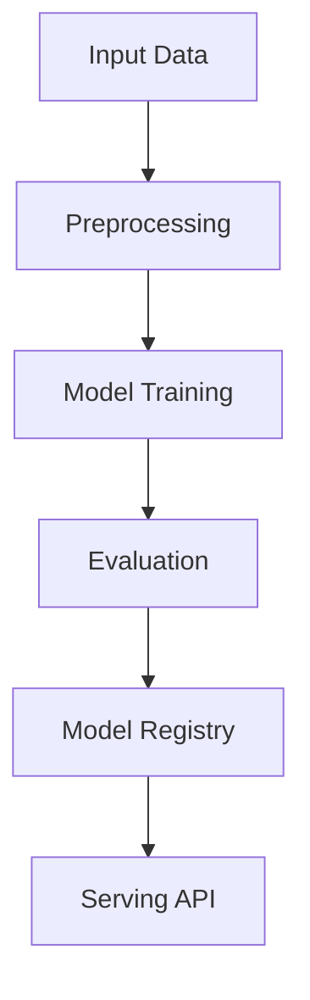

# semi-supervised-email

## ∫ Mathematics & Theory

Semi-Supervised Learning — Underlying equations and derivations

$$\mathcal{L} = \mathcal{L}_{sup} + \lambda_t \mathcal{L}_{unsup}$$

$$\mathcal{L}_{unsup} = \text{MSE}(f_\theta(x'), f_\theta(x)) \quad \text{(Mean Teacher)}$$

$$p_t = \min\left(1, \frac{T}{T_0}\right)$$

### Step-by-Step Derivation

Semi-supervised learning leverages unlabeled data by enforcing consistency. Given an input $x$, augmented views $x'$ should produce similar predictions. The total loss combines supervised cross-entropy on labeled data and consistency regularization on all data. A time-dependent weight $\lambda_t$ ramps up the unsupervised loss.

### Interactive Visualization

Interactive pseudo-label confidence distribution; labeled vs unlabeled loss curves; decision boundary animation.

## ⚙ Architecture

Model structure, data flow, and layer breakdown

### Class Hierarchy

```
  LogisticRegression
  SelfTrainingClassifier
```

### Data Flow



## ⚡ API Reference

FastAPI endpoints and model interfaces

| Method | Endpoint |
| --- | --- |
| `GET` | `/` |
| `GET` | `/health` |
| `GET` | `/metrics` |
| `POST` | `/reload` |

## ▶ Usage

Code examples and CLI commands

### Training Script

```python
"""Production training pipeline for semi-supervised email classification."""

import argparse
import os
from pathlib import Path

import numpy as np
from ai_core.logging import get_logger, setup_logging
from ai_core.model_registry import ModelRegistry

from semi_supervised_email.data import (
    load_training_data,
    save_training_data,
)
from semi_supervised_email.model import SelfTrainingClassifier

logger = get_logger(__name__)

def train(
    model_dir: Path,
    data_path: Path,
    labeled_ratio: float,
    confidence_threshold: float,
    max_iterations: int,
    model_version: str,
    register_to_mlflow: bool = False,
    random_seed: int = 42,
) -> dict:
    """Train the semi-supervised email classification model and save artifacts.

    Returns:
        Dictionary with training metrics
    """
    # Load semi-supervised training data
    X, y, is_labeled = load_training_data(
        data_path=data_path if data_path and data_path.exists() else None,
        labeled_ratio=labeled_ratio,
        random_seed=random_seed,
    )
    logger.info(
        "Loaded semi-supervised training data",
        n_samples=len(X),
        n_features=X.shape[1],
        n_labeled=int(np.sum(is_labeled)),
        n_unlabeled=int(np.sum(~is_labeled)),
        labeled_ratio=labeled_ratio,
    )

    # Save training data for reproducibility
    save_training_data(X, y, is_labeled, model_dir / "training_data.csv")

    # Train self-training model
    model = SelfTrainingClassifier(
        confidence_threshold=confidence_threshold,
        max_iterations=max_iterations,
        random_seed=random_seed,
    )
    model.fit(X, y)

    training_mode = model.training_mode
    n_iterations = model.n_iterations_used
    n_labeled_final = model.n_labeled_history[-1] if model.n_labeled_history else np.sum(is_labeled)

    logger.info(
        "Self-training complete",
        training_mode=training_mode,
        n_iterations=n_iterations,
        n_labeled_initial=int(np.sum(is_labeled)),
        n_labeled_final=n_labeled_final,
        n_pseudo_labeled=n_labeled_final - int(np.sum(is_labeled)),
    )

    # Evaluate on all labeled data
    X_labeled, y_labeled = _get_labeled_data(X, y)
    metrics = model.evaluate(X_labeled, y_labeled)

    # Add semi-supervised specific metrics
    metrics.update(
        {
            "training_mode": float(training_mode == "semi-supervised"),
            "n_labeled_initial": float(np.sum(is_labeled)),
            "n_labeled_final": float(n_labeled_final),
            "n_pseudo_labeled": float(n_labeled_final - np.sum(is_labeled)),
            "n_unlabeled_initial": float(np.sum(~is_labeled)),
            "n_iterations": float(n_iterations),
            "confidence_threshold": confidence_threshold,
            "labeled_ratio": labeled_ratio,
        }
    )

    # Save model
    model_path = model_dir / f"semi_supervised_email_model_v{model_version}.npz"
    model.save(str(model_path))

    # Save training chart
    _save_chart(model, model_dir, model_version)

    # Register model
    registry = ModelRegistry(base_dir=model_dir)
    registry.save_model(
        model_name="semi-supervised-email",
        model_version=model_version,
        model_type="semi_supervised_classification",
        metrics=metrics,
        parameters={
            "labeled_ratio": labeled_ratio,
            "confidence_threshold": confidence_threshold,
            "max_iterations": max_iterations,
            "random_seed": random_seed,
        },
        artifacts={
            f"semi_supervised_email_model_v{model_version}.npz": model_path,
            "training_data.csv": model_dir / "training_data.csv",
        },
        tags={
            "framework": "numpy",
            "task": "semi_supervised_classification",
            "base_model": "logistic_regression",
        },
    )

    if register_to_mlflow:
        registry.log_to_mlflow(
            model_name="semi-supervised-email",
            model_version=model_version,
            metrics=metrics,
            params={
                "labeled_ratio": labeled_ratio,
                "confidence_threshold": confidence_threshold,
                "max_iterations": max_iterations,
                "random_seed": random_seed,
            },
            artifacts={
                "model": str(model_path),
                "chart": str(model_dir / f"semi_supervised_email_v{model_version}.png"),
                "training_data": str(model_dir / "training_data.csv"),
            },
            tags={"model_type": "semi_supervised_classification", "framework": "numpy"},
        )
        logger.info(
            "Registered model to MLflow", model="semi-supervised-email", version=model_version
        )

    return metrics

def _get_labeled_data(X: np.ndarray, y: np.ndarray) -> tuple[np.ndarray, np.ndarray]:
    """Extract only the labeled subset of the data."""
    mask = y != -1
    return X[mask], y[mask]

def _save_chart(model: SelfTrainingClassifier, output_dir: Path, version: str) -> None:
    """Save the semi-supervised training chart."""
    import matplotlib

    matplotlib.use("Agg")
    import matplotlib.pyplot as plt

    if not model.n_labeled_history:
        return

    fig, (ax1, ax2) = plt.subplots(1, 2, figsize=(14, 5))

    # Plot 1: Labeled samples over iterations
    iterations = list(range(len(model.n_labeled_history)))
    ax1.plot(iterations, model.n_labeled_history, marker="o", color="steelblue", linewidth=2)
    ax1.set_xlabel("Self-Training Iteration")
    ax1.set_ylabel("Number of Labeled Samples")
    ax1.set_title("Labeled Samples Growth")
    ax1.grid(True, alpha=0.3)

    # Plot 2: Accuracy over iterations (if available)
    if model.accuracy_history:
        ax2.plot(
            iterations[: len(model.accuracy_history)],
            model.accuracy_history,
            marker="s",
            color="green",
            linewidth=2,
        )
        ax2.set_xlabel("Self-Training Iteration")
        ax2.set_ylabel("Accuracy")
        ax2.set_title("Model Accuracy During Self-Training")
        ax2.set_ylim([0, 1.05])
        ax2.grid(True, alpha=0.3)
    else:
        ax2.text(
            0.5,
            0.5,
            "No accuracy data available",
            ha="center",
            va="center",
            transform=ax2.transAxes,
        )
        ax2.set_title("Model Accuracy During Self-Training")

    plt.tight_layout()

    chart_path = output_dir / f"semi_supervised_email_v{version}.png"
    plt.savefig(str(chart_path), dpi=100)
    plt.close()
    logger.info("Chart saved", path=str(chart_path))

def main():
    parser = argparse.ArgumentParser(description="Train semi-supervised email classification model")
    parser.add_argument("--model-dir", type=Path, default=Path(os.getenv("MODEL_DIR", "/models")))
    parser.add_argument("--data-path", type=Path, default=None)
    parser.add_argument(
        "--labeled-ratio", type=float, default=float(os.getenv("LABELED_RATIO", "0.1"))
    )
    parser.add_argument(
        "--confidence-threshold",
        type=float,
        default=float(os.getenv("CONFIDENCE_THRESHOLD", "0.95")),
    )
    parser.add_argument(
        "--max-iterations", type=int, default=int(os.getenv("MAX_ITERATIONS", "10"))
    )
    parser.add_argument("--model-version", type=str, default=os.getenv("MODEL_VERSION", "1.0.0"))
    parser.add_argument("--random-seed", type=int, default=int(os.getenv("RANDOM_SEED", "42")))
    parser.add_argument(
        "--register-mlflow",
        action="store_true",
        default=os.getenv("REGISTER_MLFLOW", "false").lower() == "true",
    )
    parser.add_argument("--log-level", type=str, default=os.getenv("LOG_LEVEL", "INFO"))
    args = parser.parse_args()

    setup_logging(args.log_level)
    args.model_dir.mkdir(parents=True, exist_ok=True)

    metrics = train(
        model_dir=args.model_dir,
        data_path=args.data_path,
        labeled_ratio=args.labeled_ratio,
        confidence_threshold=args.confidence_threshold,
        max_iterations=args.max_iterations,
        model_version=args.model_version,
        register_to_mlflow=args.register_mlflow,
        random_seed=args.random_seed,
    )

    logger.info("Training finished", metrics=metrics, model_dir=str(args.model_dir))

if __name__ == "__main__":
    main()
```

### API Server

```python
"""Production serving API for semi-supervised email classification."""

import os
import time
from contextlib import asynccontextmanager
from pathlib import Path

import numpy as np
from ai_core.drift import DriftDetector
from ai_core.fastapi_middleware import add_observability_middleware
from ai_core.logging import get_logger, setup_logging
from ai_core.metrics import MetricsCollector
from ai_core.model_registry import ModelRegistry
from ai_core.validation import DataValidator, create_semi_supervised_email_schema
from fastapi import FastAPI, HTTPException, Response
from pydantic import BaseModel, Field

from semi_supervised_email.data import FEATURE_NAMES
from semi_supervised_email.model import SelfTrainingClassifier

logger = get_logger(__name__)

# Configuration
MODEL_DIR = Path(os.getenv("MODEL_DIR", "/models"))
MODEL_VERSION = os.getenv("MODEL_VERSION", "latest")
METRICS_PORT = int(os.getenv("METRICS_PORT", os.getenv("SEMI_SUPERVISED_METRICS_PORT", "8006")))
DRIFT_THRESHOLD = float(os.getenv("DRIFT_THRESHOLD", "0.2"))

class PredictRequest(BaseModel):
    """Single email classification request."""

    has_free: int = Field(..., ge=0, le=1, description="Contains 'free' keyword")
    has_win: int = Field(..., ge=0, le=1, description="Contains 'win' keyword")
    has_link: int = Field(..., ge=0, le=1, description="Contains a link")
    has_exclamation: int = Field(..., ge=0, le=1, description="Contains 3+ exclamation marks")
    has_meeting: int = Field(..., ge=0, le=1, description="Contains 'meeting' keyword")
    length_score: int = Field(..., ge=1, le=10, description="Email length score (1-10)")
    has_caps: int = Field(..., ge=0, le=1, description="Contains excessive caps")

class PredictResponse(BaseModel):
    """Email classification response."""

    is_spam: bool
    spam_probability: float
    label: str
    model_version: str
    training_mode: str

class BulkPredictResponse(BaseModel):
    """Bulk email classification response."""

    predictions: list[PredictResponse]
    model_version: str

class StatsResponse(BaseModel):
    """Model statistics response."""

    n_features: int
    confidence_threshold: float
    max_iterations: int
    n_iterations_used: int
    training_mode: str
    n_labeled_initial: int
    n_labeled_final: int
    n_pseudo_labeled: int
    accuracy_history: list[float]
    model_version: str

class DriftResponse(BaseModel):
    """Drift detection response."""

    total_features: int
    drifted_features: int
    drift_ratio: float
    drifted: list[dict]
    all_results: list[dict]

# Global model state
_model: SelfTrainingClassifier | None = None
_model_version: str = "unknown"
_metrics: MetricsCollector | None = None
_validator: DataValidator | None = None
_drift_detector: DriftDetector | None = None
_reference_data: np.ndarray | None = None
_recent_predictions: list[list[float]] = []

@asynccontextmanager
async def lifespan(app: FastAPI):
    """Load model at startup and clean up at shutdown."""
    global _model, _model_version, _metrics, _validator, _drift_detector, _reference_data

    setup_logging(os.getenv("LOG_LEVEL", "INFO"))
    _metrics = MetricsCollector("semi_supervised_email", port=METRICS_PORT)
    app.state.metrics = _metrics

    _validator = DataValidator(create_semi_supervised_email_schema())
    _drift_detector = DriftDetector(
        feature_names=FEATURE_NAMES,
        feature_types={f: "float" for f in FEATURE_NAMES},
        psi_threshold=DRIFT_THRESHOLD,
    )

    _model, _model_version = _load_model()
    _metrics.set_model_version(_model_version)
    _metrics.set_model_info(
        model_name="semi-supervised-email",
        model_version=_model_version,
        model_type="semi_supervised_classification",
    )

    # Load reference data for drift detection
    _reference_data = _load_reference_data()
    logger.info("Model loaded", model="semi-supervised-email", version=_model_version)

    yield

    logger.info("Shutting down semi-supervised-email API")

def _load_model() -> tuple[SelfTrainingClassifier, str]:
    """Load the latest model from the registry or model directory with resilient fallback."""
    # 1. Try model registry
    registry = ModelRegistry(base_dir=MODEL_DIR)
    try:
        if MODEL_VERSION == "latest":
            models = registry.list_models()
            ss_models = [m for m in models if m.get("model_name") == "semi-supervised-email"]
            if ss_models:
                ss_models.sort(key=lambda m: m["model_version"], reverse=True)
                latest = ss_models[0]
                model_dir = Path(latest["artifact_path"])
                npz_files = list(model_dir.glob("semi_supervised_email_model_*.npz")) + list(
                    model_dir.glob("*.npz")
                )
                if npz_files:
                    return SelfTrainingClassifier.load(str(npz_files[0])), latest["model_version"]
        else:
            model_dir = MODEL_DIR / "semi-supervised-email" / MODEL_VERSION
            if model_dir.exists():
                npz_files = list(model_dir.glob("semi_supervised_email_model_*.npz")) + list(
                    model_dir.glob("*.npz")
                )
                if npz_files:
                    return SelfTrainingClassifier.load(str(npz_files[0])), MODEL_VERSION
    except Exception as e:
        logger.warning(f"Registry lookup failed: {e}")

    # 2. Try direct model in MODEL_DIR
    npz_path = MODEL_DIR / "semi_supervised_email_model.npz"
    if npz_path.exists():
        return SelfTrainingClassifier.load(str(npz_path)), "legacy"

    # 3. Try bundled artifacts directory
    candidate_paths = [
        Path("/app/artifacts/models/semi_supervised_email_model_v1.0.0.npz"),
        Path(__file__).resolve().parents[3]
        / "artifacts"
        / "models"
        / "semi_supervised_email_model_v1.0.0.npz",
    ]
    for p in candidate_paths:
        if p.exists():
            logger.info("Loading bundled baseline model", path=str(p))
            return SelfTrainingClassifier.load(str(p)), "1.0.0-bundled"

    # 4. In-memory baseline fallback (never crash cold start)
    logger.warning(
        "No pre-existing model found on disk. Initializing baseline self-training model."
    )
    from semi_supervised_email.data import load_training_data

    X_base, y_base, _ = load_training_data(None, labeled_ratio=0.1, random_seed=42)
    model = SelfTrainingClassifier(confidence_threshold=0.95, max_iterations=10, random_seed=42)
    model.fit(X_base, y_base)
    return model, "1.0.0-baseline"

def _load_reference_data() -> np.ndarray | None:
    """Load reference training data for drift detection."""
    candidate_csvs = [
        MODEL_DIR / "semi-supervised-email" / _model_version / "training_data.csv",
        MODEL_DIR / "training_data.csv",
        Path("/app/artifacts/models/training_data.csv"),
        Path(__file__).resolve().parents[3] / "artifacts" / "models" / "training_data.csv",
    ]
    for csv_path in candidate_csvs:
        if csv_path.exists():
            try:
                import pandas as pd

                df = pd.read_csv(csv_path)
                if all(f in df.columns for f in FEATURE_NAMES):
                    return df[FEATURE_NAMES].values
            except Exception as e:
                logger.warning("Could not read reference csv", path=str(csv_path), error=str(e))

    from semi_supervised_email.data import load_training_data

    X_base, _, _ = load_training_data(None, labeled_ratio=0.1, random_seed=42)
    return X_base

# Create FastAPI app
app = FastAPI(
    title="Semi-Supervised Email Classification API",
    description="Self-training semi-supervised learning for email spam classification",
    version="1.0.0",
    lifespan=lifespan,
)

# Add observability middleware
add_observability_middleware(app)

@app.get("/")
def read_root():
    """Service information."""
    return {
        "service": "semi-supervised-email-api",
        "version": "1.0.0",
        "model_version": _model_version,
        "training_mode": _model.training_mode if _model else "unknown",
        "features": FEATURE_NAMES,
        "endpoints": {
            "health": "/health",
            "predict": "POST /predict",
            "predict/bulk": "POST /predict/bulk",
            "stats": "GET /stats",
            "drift": "GET /drift",
            "metrics": "/metrics",
        },
    }

@app.get("/health")
def health_check():
    """Kubernetes liveness/readiness probe."""
    if _model is None:
        raise HTTPException(status_code=503, detail="Model not loaded")
    return {
        "status": "healthy",
        "model_loaded": True,
        "model_version": _model_version,
        "training_mode": _model.training_mode,
    }

@app.get("/metrics")
def metrics():
    """Prometheus metrics endpoint."""
    from prometheus_client import CONTENT_TYPE_LATEST, generate_latest

    return Response(content=generate_latest(), media_type=CONTENT_TYPE_LATEST)

@app.post("/reload")
def reload_model():
    """Dynamically reload the model from disk/registry."""
    global _model, _model_version, _reference_data
    try:
        _model, _model_version = _load_model()
        if _metrics:
            _metrics.set_model_version(_model_version)
            _metrics.set_model_info(
                model_name="semi-supervised-email",
                model_version=_model_version,
                model_type="semi_supervised_classification",
            )
        _reference_data = _load_reference_data()
        logger.info(
            "Model reloaded dynamically", model="semi-supervised-email", version=_model_version
        )
        return {"status": "reloaded", "model_version": _model_version}
    except Exception as e:
        logger.exception("Model reload failed", error=str(e))
        raise HTTPException(status_code=500, detail=f"Reload failed: {e}") from e

@app.get("/drift", response_model=DriftResponse)
def drift_check():
    """Check for data drift between reference and recent predictions."""
    if _drift_detector is None or _reference_data is None:
        raise HTTPException(status_code=503, detail="Drift detection not available")

    if len(_recent_predictions) < 10:
        return DriftResponse(
            total_features=len(FEATURE_NAMES),
            drifted_features=0,
            drift_ratio=0.0,
            drifted=[],
            all_results=[],
        )

    current = np.array(_recent_predictions[-100:])
    results = _drift_detector.detect_drift(_reference_data, current)
    summary = _drift_detector.summarize(results)

    if _metrics:
        _metrics.set_drift_ratio(summary["drift_ratio"])

    return DriftResponse(**summary)

@app.get("/stats", response_model=StatsResponse)
def get_stats():
    """Return model statistics."""
    if _model is None or _model.model is None:
        raise HTTPException(status_code=503, detail="Model not loaded")

    return StatsResponse(
        n_features=_model.n_features,
        confidence_threshold=_model.confidence_threshold,
        max_iterations=_model.max_iterations,
        n_iterations_used=_model.n_iterations_used,
        training_mode=_model.training_mode,
        n_labeled_initial=_model.n_labeled_history[0] if _model.n_labeled_history else 0,
        n_labeled_final=_model.n_labeled_history[-1] if _model.n_labeled_history else 0,
        n_pseudo_labeled=(_model.n_labeled_history[-1] - _model.n_labeled_history[0])
        if _model.n_labeled_history
        else 0,
        accuracy_history=_model.accuracy_history,
        model_version=_model_version,
    )

def _compute_prediction(features: PredictRequest) -> PredictResponse:
    """Core classification logic shared by all prediction endpoints."""
    if _model is None or _metrics is None or _validator is None:
        raise HTTPException(status_code=503, detail="Model not loaded")

    # Validate input
    X = np.array(
        [
            [
                features.has_free,
                features.has_win,
                features.has_link,
                features.has_exclamation,
                features.has_meeting,
                features.length_score,
                features.has_caps,
            ]
        ]
    )
    validation = _validator.validate(X)
    if not validation.valid:
        raise HTTPException(status_code=422, detail=validation.errors)

    start = time.time()
    try:
        proba = float(_model.predict_proba(X)[0])
        is_spam = bool(_model.predict(X)[0])
        duration = time.time() - start
        _metrics.record_prediction(model_version=_model_version, duration=duration)

        # Track for drift detection
        _recent_predictions.append(
            [
                features.has_free,
                features.has_win,
                features.has_link,
                features.has_exclamation,
                features.has_meeting,
                features.length_score,
                features.has_caps,
            ]
        )
        if len(_recent_predictions) > 1000:
            _recent_predictions.pop(0)

        return PredictResponse(
            is_spam=is_spam,
            spam_probability=round(proba, 4),
            label="SPAM" if is_spam else "NOT spam",
            model_version=_model_version,
            training_mode=_model.training_mode if _model else "unknown",
        )
    except Exception as e:
        _metrics.record_error(model_version=_model_version, error_type="prediction")
        logger.exception("Classification failed", error=str(e))
        raise HTTPException(status_code=500, detail="Classification failed") from e

@app.post("/predict", response_model=PredictResponse)
def predict_single(body: PredictRequest):
    """Classify a single email."""
    return _compute_prediction(body)

@app.post("/predict/bulk", response_model=BulkPredictResponse)
def predict_bulk(body: list[PredictRequest]):
    """Classify multiple emails (1 to 100)."""
    global _recent_predictions
    if _model is None or _metrics is None or _validator is None:
        raise HTTPException(status_code=503, detail="Model not loaded")

    if len(body) < 1 or len(body) > 100:
        raise HTTPException(status_code=422, detail="Batch size must be between 1 and 100")

    X = np.array(
        [
            [
                r.has_free,
                r.has_win,
                r.has_link,
                r.has_exclamation,
                r.has_meeting,
                r.length_score,
                r.has_caps,
            ]
            for r in body
        ]
    )

    validation = _validator.validate(X)
    if not validation.valid:
        raise HTTPException(status_code=422, detail=validation.errors)

    start = time.time()
    try:
        probas = _model.predict_proba(X)
        predictions = _model.predict(X)
        duration = time.time() - start
        _metrics.record_prediction(model_version=_model_version, duration=duration)

        # Track for drift detection
        _recent_predictions.extend(X.tolist())
        if len(_recent_predictions) > 1000:
            _recent_predictions = _recent_predictions[-1000:]

        responses = [
            PredictResponse(
                is_spam=bool(pred),
                spam_probability=round(float(prob), 4),
                label="SPAM" if pred else "NOT spam",
                model_version=_model_version,
                training_mode=_model.training_mode if _model else "unknown",
            )
            for pred, prob in zip(predictions, probas, strict=False)
        ]
        return BulkPredictResponse(predictions=responses, model_version=_model_version)
    except Exception as e:
        _metrics.record_error(model_version=_model_version, error_type="prediction")
        logger.exception("Bulk classification failed", error=str(e))
        raise HTTPException(status_code=500, detail="Bulk classification failed") from e
```

### CLI Commands

```bash
uv run python -m semi_supervised_email.train --model-dir ./artifacts/models
```

## 📊 Benchmarks

Test results and performance metrics

Run `pytest tests/test_models.py` and `pytest tests/test_apis.py` for detailed metrics.

### Related Apps

- [self-supervised-monitoring](../self-supervised-monitoring/README.md)

- [classification-email-spam](../classification-email-spam/README.md)

Generated documentation for **semi-supervised-email**
