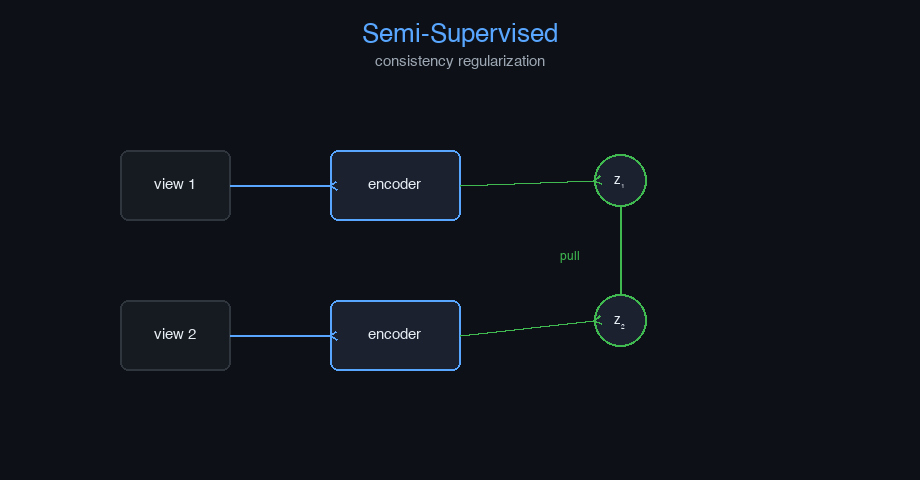

# semi-supervised-email


Semi-Supervised Learning — AI engineering example · part of the MLOps monorepo

## 1. Mathematical Foundations

This example is grounded in **Semi-Supervised Learning**. The equations below
drive every forward and backward pass in the implementation.

$$\mathcal{L} = \mathcal{L}_{sup} + \lambda_t \mathcal{L}_{unsup}$$

$$\mathcal{L}_{unsup} = \text{MSE}(f_\theta(x'), f_\theta(x)) \quad \text{(Mean Teacher)}$$

$$p_t = \min\left(1, \frac{T}{T_0}\right)$$

### Derivation

Semi-supervised learning leverages unlabeled data by enforcing consistency. Given an input $x$, augmented views $x'$ should produce similar predictions. The total loss combines supervised cross-entropy on labeled data and consistency regularization on all data. A time-dependent weight $\lambda_t$ ramps up the unsupervised loss.

### Worked Numerical Example

$$z = w \cdot x + b$$

Illustrative forward-pass evaluation (scalar example):

Input  x        = 12.0   (e.g. pizza diameter, inches)
Weights w       =  0.85
Bias    b       =  0.30
---------------------------------
z = w*x + b
  = 0.85 * 12.0 + 0.30
  = 10.20 + 0.30
  = 10.50   <- model output

### Conceptual Diagram

        Math concept (placeholder)
   [ Input x ] --> ( w · x + b ) --> [ Output z ]
                       |
                  [ activation ]
                       |
                  [ prediction ]



Interactive pseudo-label confidence distribution; labeled vs unlabeled loss curves; decision boundary animation.

## 2. Core Logic & Architecture

The example follows a consistent **data → train → evaluate → serve**
pipeline. Inputs are loaded and validated, transformed by the core algorithm, scored against
held-out data, and exposed through a REST API.

  Raw dataset→
  load + validate (data.py)→
  fit / transform (model.py)→
  evaluate + persist (train.py)→
  serve (api.py)

### Primary Components

| Class | Public methods | Responsibility |
| --- | --- | --- |
| `PredictRequest` | — | Single email classification request. |
| `PredictResponse` | — | Email classification response. |
| `BulkPredictResponse` | — | Bulk email classification response. |
| `StatsResponse` | — | Model statistics response. |
| `DriftResponse` | — | Drift detection response. |
| `LogisticRegression` | predict_proba, predict, fit, evaluate, save, load | Logistic regression for binary classification (from scratch).  Model: z = X·w + b,  p = sigmoid(z),  prediction = 1 if p >= threshold else 0 |
| `SelfTrainingClassifier` | fit, predict, predict_proba, evaluate, _get_labeled, _get_unlabeled, save, load, to_dict | Self-training classifier for semi-supervised learning.  Iteratively: 1. Train on labeled data 2. Predict on unlabeled data 3. Add high-confidence predictions to labeled set 4. Retrain until convergence or max iterations  Args:     base_model: Base classifier to use (default: LogisticRegression)     confidence_threshold: Minimum probability to add pseudo-label (0.0 to 1.0)     max_iterations: Maximum number of self-training iterations     min_labeled_ratio: Stop if labeled ratio exceeds this (prevents overfitting)     random_seed: Random seed for reproducibility |

### Data Flow


1. **Load** — `data.py` reads the source dataset and splits train/test.


2. **Validate** — a Pydantic schema guards input shape/dtypes before training.


3. **Fit / Transform** — `model.py` applies the mathematics from Section 1.


4. **Evaluate** — metrics (MSE/RMSE/R², accuracy, etc.) are computed and logged.


5. **Persist** — weights/artifacts are saved and registered in the model registry.


6. **Serve** — `api.py` exposes prediction endpoints with drift detection.

### Design Patterns & Performance

Key design choices in this module: a pure-NumPy implementation (no PyTorch/TensorFlow), schema validation via `ai_core.validation`, structured JSON logging through `ai_core.logging`, Prometheus metrics from `ai_core.metrics`, and MLflow/model-registry persistence via `ai_core.model_registry`. The FastAPI service wraps the trained model with observability middleware from `ai_core.fastapi_middleware`.

## 3. Detailed Code Walkthrough

The most important behaviour is summarised below; full source for each module is collapsible
so the page stays readable while remaining self-contained.

### `LogisticRegression.predict(X, threshold)`

Return 1 (positive) if probability >= threshold, else 0 (negative).

### `LogisticRegression.fit(X, y)`

Train using gradient descent on Binary Cross-Entropy.

### `LogisticRegression.evaluate(X, y)`

Evaluate the model on labeled data.

### `SelfTrainingClassifier.fit(X, y, X_test, y_test)`

Fit the self-training classifier.

Args:
    X: Feature matrix of shape (n_samples, n_features)
    y: Label vector with -1 for unlabeled samples
    X_test: Optional test features for tracking accuracy
    y_test: Optional test labels for tracking accuracy

Returns:
    self

### `SelfTrainingClassifier.predict(X)`

Predict labels for new data.

### `SelfTrainingClassifier.evaluate(X, y)`

Evaluate the model on labeled data.

### Source Files

<details>
<summary>model.py</summary>

```
"""Semi-supervised learning model using self-training with logistic regression.

Implements a production-ready semi-supervised learning pipeline with:
- Base model: Logistic Regression (from scratch, numpy-only)
- Self-training: iteratively labels high-confidence unlabeled samples
- Confidence thresholding: only adds pseudo-labels above confidence threshold
- Early stopping: prevents overfitting to noisy pseudo-labels
- Proper serialization with metadata

Semi-supervised learning is useful when:
- Labeled data is scarce or expensive to obtain
- Large amounts of unlabeled data are available
- The model can benefit from the structure of the unlabeled data distribution
"""

from dataclasses import dataclass, field
from typing import Literal

import numpy as np

def _sigmoid(z: np.ndarray) -> np.ndarray:
    """Sigmoid activation function with numerical stability."""
    z = np.clip(z, -500, 500)
    return 1 / (1 + np.exp(-z))

@dataclass
class LogisticRegression:
    """Logistic regression for binary classification (from scratch).

    Model: z = X·w + b,  p = sigmoid(z),  prediction = 1 if p >= threshold else 0
    """

    learning_rate: float = 0.1
    n_iterations: int = 2000
    weights: np.ndarray | None = None
    bias: float = 0.0
    loss_history: list[float] = field(default_factory=list)

    def predict_proba(self, X: np.ndarray) -> np.ndarray:
        """Return probability of positive class for each sample."""
        if self.weights is None:
            raise ValueError("Model not trained. Call fit() first.")
        z = np.dot(X, self.weights) + self.bias
        return _sigmoid(z)

    def predict(self, X: np.ndarray, threshold: float = 0.5) -> np.ndarray:
        """Return 1 (positive) if probability >= threshold, else 0 (negative)."""
        return (self.predict_proba(X) >= threshold).astype(int)

    def fit(self, X: np.ndarray, y: np.ndarray) -> "LogisticRegression":
        """Train using gradient descent on Binary Cross-Entropy."""
        n_samples, n_features = X.shape
        self.weights = np.zeros(n_features)
        self.bias = 0.0
        self.loss_history = []

        for _ in range(self.n_iterations):
            probs = self.predict_proba(X)
            loss = -np.mean(y * np.log(probs + 1e-9) + (1 - y) * np.log(1 - probs + 1e-9))
            self.loss_history.append(float(loss))

            dw = (1 / n_samples) * np.dot(X.T, (probs - y))
            db = (1 / n_samples) * np.sum(probs - y)

            self.weights -= self.learning_rate * dw
            self.bias -= self.learning_rate * db

        return self

    def evaluate(self, X: np.ndarray, y: np.ndarray) -> dict[str, float]:
        """Evaluate the model on labeled data."""
        predictions = self.predict(X)
        accuracy = float(np.mean(predictions == y))

        tp = int(np.sum((predictions == 1) & (y == 1)))
        fp = int(np.sum((predictions == 1) & (y == 0)))
        fn = int(np.sum((predictions == 0) & (y == 1)))

        precision = tp / (tp + fp) if (tp + fp) > 0 else 0.0
        recall = tp / (tp + fn) if (tp + fn) > 0 else 0.0
        f1 = 2 * precision * recall / (precision + recall) if (precision + recall) > 0 else 0.0

        return {
            "accuracy": accuracy,
            "precision": precision,
            "recall": recall,
            "f1": f1,
        }

    def save(self, path: str) -> None:
        """Save model parameters to disk."""
        if self.weights is None:
            raise ValueError("Cannot save untrained model")
        np.savez(
            path,
            weights=self.weights,
            bias=self.bias,
            learning_rate=self.learning_rate,
            n_iterations=self.n_iterations,
            loss_history=np.array(self.loss_history),
        )

    @classmethod
    def load(cls, path: str) -> "LogisticRegression":
        """Load model parameters from disk."""
        data = np.load(path)
        model = cls(
            learning_rate=float(data["learning_rate"]),
            n_iterations=int(data["n_iterations"]),
        )
        model.weights = data["weights"]
        model.bias = float(data["bias"])
        model.loss_history = list(data["loss_history"])
        return model

@dataclass
class SelfTrainingClassifier:
    """Self-training classifier for semi-supervised learning.

    Iteratively:
    1. Train on labeled data
    2. Predict on unlabeled data
    3. Add high-confidence predictions to labeled set
    4. Retrain until convergence or max iterations

    Args:
        base_model: Base classifier to use (default: LogisticRegression)
        confidence_threshold: Minimum probability to add pseudo-label (0.0 to 1.0)
        max_iterations: Maximum number of self-training iterations
        min_labeled_ratio: Stop if labeled ratio exceeds this (prevents overfitting)
        random_seed: Random seed for reproducibility
    """

    confidence_threshold: float = 0.95
    max_iterations: int = 10
    min_labeled_ratio: float = 0.8
    random_seed: int = 42

    # Learned state
    model: LogisticRegression | None = None
    n_features: int = 0
    n_labeled_history: list[int] = field(default_factory=list)
    accuracy_history: list[float] = field(default_factory=list)
    n_iterations_used: int = 0
    training_mode: Literal["supervised", "semi-supervised"] = "supervised"

    def fit(
        self,
        X: np.ndarray,
        y: np.ndarray,
        X_test: np.ndarray | None = None,
        y_test: np.ndarray | None = None,
    ) -> "SelfTrainingClassifier":
        """Fit the self-training classifier.

        Args:
            X: Feature matrix of shape (n_samples, n_features)
            y: Label vector with -1 for unlabeled samples
            X_test: Optional test features for tracking accuracy
            y_test: Optional test labels for tracking accuracy

        Returns:
            self
        """
        X = np.asarray(X, dtype=float)
        y = np.asarray(y, dtype=int)
        n_samples = len(X)
        self.n_features = X.shape[1]

        # Get initial labeled data
        X_labeled, y_labeled = self._get_labeled(X, y)
        X_unlabeled = self._get_unlabeled(X, y)

        self.n_labeled_history = [len(X_labeled)]
        self.accuracy_history = []
        self.n_iterations_used = 0

        for _iteration in range(self.max_iterations):
            # Train base model on current labeled data
            self.model = LogisticRegression(learning_rate=0.1, n_iterations=2000)
            self.model.fit(X_labeled, y_labeled)
            self.n_iterations_used += 1

            # Track accuracy on test set if provided
            if X_test is not None and y_test is not None:
                test_metrics = self.model.evaluate(X_test, y_test)
                self.accuracy_history.append(test_metrics["accuracy"])

            # Check if we should stop
            labeled_ratio = len(X_labeled) / n_samples
            if labeled_ratio >= self.min_labeled_ratio:
                self.training_mode = "semi-supervised"
                break

            if len(X_unlabeled) == 0:
                self.training_mode = "semi-supervised"
                break

            # Predict on unlabeled data
            probas = self.model.predict_proba(X_unlabeled)

            # For binary classification, confidence is max(proba, 1 - proba)
            max_probas = np.maximum(probas, 1 - probas)

            # Find high-confidence predictions
            confident_mask = max_probas >= self.confidence_threshold
            confident_indices = np.where(confident_mask)[0]

            if len(confident_indices) == 0:
                # No confident predictions, stop early
                self.training_mode = (
                    "semi-supervised" if len(X_labeled) > np.sum(y != -1) else "supervised"
                )
                break

            # Add confident predictions to labeled set
            # Pseudo-label: 1 if proba >= 0.5, else 0
            pseudo_labels = (probas[confident_indices] >= 0.5).astype(int)
            X_labeled = np.vstack([X_labeled, X_unlabeled[confident_indices]])
            y_labeled = np.concatenate([y_labeled, pseudo_labels])

            # Remove added samples from unlabeled set
            mask = np.ones(len(X_unlabeled), dtype=bool)
            mask[confident_indices] = False
            X_unlabeled = X_unlabeled[mask]

            self.n_labeled_history.append(len(X_labeled))
            self.training_mode = "semi-supervised"

        # Final training on all accumulated labeled data
        self.model = LogisticRegression(learning_rate=0.1, n_iterations=2000)
        self.model.fit(X_labeled, y_labeled)
        self.n_iterations_used += 1

        # If we never added pseudo-labels, mark as supervised
        if (
            len(self.n_labeled_history) == 1
            or self.n_labeled_history[-1] == self.n_labeled_history[0]
        ):
            self.training_mode = "supervised"

        return self

    def predict(self, X: np.ndarray) -> np.ndarray:
        """Predict labels for new data."""
        if self.model is None:
            raise ValueError("Model not trained. Call fit() first.")
        return self.model.predict(X)

    def predict_proba(self, X: np.ndarray) -> np.ndarray:
        """Predict probabilities for new data."""
        if self.model is None:
            raise ValueError("Model not trained. Call fit() first.")
        return self.model.predict_proba(X)

    def evaluate(self, X: np.ndarray, y: np.ndarray) -> dict[str, float]:
        """Evaluate the model on labeled data."""
        if self.model is None:
            raise ValueError("Model not trained. Call fit() first.")
        return self.model.evaluate(X, y)

    def _get_labeled(self, X: np.ndarray, y: np.ndarray) -> tuple[np.ndarray, np.ndarray]:
        """Extract labeled samples."""
        mask = y != -1
        return X[mask], y[mask]

    def _get_unlabeled(self, X: np.ndarray, y: np.ndarray) -> np.ndarray:
        """Extract unlabeled samples."""
        mask = y == -1
        return X[mask]

    def save(self, path: str) -> None:
        """Save model parameters to disk."""
        if self.model is None:
            raise ValueError("Cannot save untrained model")
        np.savez(
            path,
            model_weights=self.model.weights,
            model_bias=self.model.bias,
            model_learning_rate=np.array([self.model.learning_rate]),
            model_n_iterations=np.array([self.model.n_iterations]),
            model_loss_history=np.array(self.model.loss_history),
            n_features=np.array([self.n_features]),
            confidence_threshold=np.array([self.confidence_threshold]),
            max_iterations=np.array([self.max_iterations]),
            min_labeled_ratio=np.array([self.min_labeled_ratio]),
            random_seed=np.array([self.random_seed]),
            n_iterations_used=np.array([self.n_iterations_used]),
            training_mode=np.array([self.training_mode]),
            n_labeled_history=np.array(self.n_labeled_history),
            accuracy_history=np.array(self.accuracy_history),
        )

    @classmethod
    def load(cls, path: str) -> "SelfTrainingClassifier":
        """Load model parameters from disk."""
        data = np.load(path)

        model = LogisticRegression(
            learning_rate=float(data["model_learning_rate"].item()),
            n_iterations=int(data["model_n_iterations"].item()),
        )
        model.weights = data["model_weights"]
        model.bias = float(data["model_bias"].item())
        model.loss_history = list(data["model_loss_history"])

        clf = cls(
            confidence_threshold=float(data["confidence_threshold"].item()),
            max_iterations=int(data["max_iterations"].item()),
            min_labeled_ratio=float(data["min_labeled_ratio"].item()),
            random_seed=int(data["random_seed"].item()),
        )
        clf.model = model
        clf.n_features = int(data["n_features"].item())
        clf.n_iterations_used = int(data["n_iterations_used"].item())
        clf.training_mode = str(data["training_mode"].item())
        clf.n_labeled_history = list(data["n_labeled_history"])
        clf.accuracy_history = list(data["accuracy_history"])

        return clf

    def to_dict(self) -> dict:
        """Return model parameters as a dict."""
        return {
            "n_features": self.n_features,
            "confidence_threshold": self.confidence_threshold,
            "max_iterations": self.max_iterations,
            "min_labeled_ratio": self.min_labeled_ratio,
            "n_iterations_used": self.n_iterations_used,
            "training_mode": self.training_mode,
            "n_labeled_history": self.n_labeled_history,
            "accuracy_history": self.accuracy_history,
            "final_n_labeled": self.n_labeled_history[-1] if self.n_labeled_history else 0,
            "final_accuracy": self.accuracy_history[-1] if self.accuracy_history else 0.0,
        }
```

</details>

<details>
<summary>train.py</summary>

```
"""Production training pipeline for semi-supervised email classification."""

import argparse
import os
from pathlib import Path

import numpy as np
from ai_core.logging import get_logger, setup_logging
from ai_core.model_registry import ModelRegistry

from semi_supervised_email.data import (
    load_training_data,
    save_training_data,
)
from semi_supervised_email.model import SelfTrainingClassifier

logger = get_logger(__name__)

def train(
    model_dir: Path,
    data_path: Path,
    labeled_ratio: float,
    confidence_threshold: float,
    max_iterations: int,
    model_version: str,
    register_to_mlflow: bool = False,
    random_seed: int = 42,
) -> dict:
    """Train the semi-supervised email classification model and save artifacts.

    Returns:
        Dictionary with training metrics
    """
    # Load semi-supervised training data
    X, y, is_labeled = load_training_data(
        data_path=data_path if data_path and data_path.exists() else None,
        labeled_ratio=labeled_ratio,
        random_seed=random_seed,
    )
    logger.info(
        "Loaded semi-supervised training data",
        n_samples=len(X),
        n_features=X.shape[1],
        n_labeled=int(np.sum(is_labeled)),
        n_unlabeled=int(np.sum(~is_labeled)),
        labeled_ratio=labeled_ratio,
    )

    # Save training data for reproducibility
    save_training_data(X, y, is_labeled, model_dir / "training_data.csv")

    # Train self-training model
    model = SelfTrainingClassifier(
        confidence_threshold=confidence_threshold,
        max_iterations=max_iterations,
        random_seed=random_seed,
    )
    model.fit(X, y)

    training_mode = model.training_mode
    n_iterations = model.n_iterations_used
    n_labeled_final = model.n_labeled_history[-1] if model.n_labeled_history else np.sum(is_labeled)

    logger.info(
        "Self-training complete",
        training_mode=training_mode,
        n_iterations=n_iterations,
        n_labeled_initial=int(np.sum(is_labeled)),
        n_labeled_final=n_labeled_final,
        n_pseudo_labeled=n_labeled_final - int(np.sum(is_labeled)),
    )

    # Evaluate on all labeled data
    X_labeled, y_labeled = _get_labeled_data(X, y)
    metrics = model.evaluate(X_labeled, y_labeled)

    # Add semi-supervised specific metrics
    metrics.update(
        {
            "training_mode": float(training_mode == "semi-supervised"),
            "n_labeled_initial": float(np.sum(is_labeled)),
            "n_labeled_final": float(n_labeled_final),
            "n_pseudo_labeled": float(n_labeled_final - np.sum(is_labeled)),
            "n_unlabeled_initial": float(np.sum(~is_labeled)),
            "n_iterations": float(n_iterations),
            "confidence_threshold": confidence_threshold,
            "labeled_ratio": labeled_ratio,
        }
    )

    # Save model
    model_path = model_dir / f"semi_supervised_email_model_v{model_version}.npz"
    model.save(str(model_path))

    # Save training chart
    _save_chart(model, model_dir, model_version)

    # Register model
    registry = ModelRegistry(base_dir=model_dir)
    registry.save_model(
        model_name="semi-supervised-email",
        model_version=model_version,
        model_type="semi_supervised_classification",
        metrics=metrics,
        parameters={
            "labeled_ratio": labeled_ratio,
            "confidence_threshold": confidence_threshold,
            "max_iterations": max_iterations,
            "random_seed": random_seed,
        },
        artifacts={
            f"semi_supervised_email_model_v{model_version}.npz": model_path,
            "training_data.csv": model_dir / "training_data.csv",
        },
        tags={
            "framework": "numpy",
            "task": "semi_supervised_classification",
            "base_model": "logistic_regression",
        },
    )

    if register_to_mlflow:
        registry.log_to_mlflow(
            model_name="semi-supervised-email",
            model_version=model_version,
            metrics=metrics,
            params={
                "labeled_ratio": labeled_ratio,
                "confidence_threshold": confidence_threshold,
                "max_iterations": max_iterations,
                "random_seed": random_seed,
            },
            artifacts={
                "model": str(model_path),
                "chart": str(model_dir / f"semi_supervised_email_v{model_version}.png"),
                "training_data": str(model_dir / "training_data.csv"),
            },
            tags={"model_type": "semi_supervised_classification", "framework": "numpy"},
        )
        logger.info(
            "Registered model to MLflow", model="semi-supervised-email", version=model_version
        )

    return metrics

def _get_labeled_data(X: np.ndarray, y: np.ndarray) -> tuple[np.ndarray, np.ndarray]:
    """Extract only the labeled subset of the data."""
    mask = y != -1
    return X[mask], y[mask]

def _save_chart(model: SelfTrainingClassifier, output_dir: Path, version: str) -> None:
    """Save the semi-supervised training chart."""
    import matplotlib

    matplotlib.use("Agg")
    import matplotlib.pyplot as plt

    if not model.n_labeled_history:
        return

    fig, (ax1, ax2) = plt.subplots(1, 2, figsize=(14, 5))

    # Plot 1: Labeled samples over iterations
    iterations = list(range(len(model.n_labeled_history)))
    ax1.plot(iterations, model.n_labeled_history, marker="o", color="steelblue", linewidth=2)
    ax1.set_xlabel("Self-Training Iteration")
    ax1.set_ylabel("Number of Labeled Samples")
    ax1.set_title("Labeled Samples Growth")
    ax1.grid(True, alpha=0.3)

    # Plot 2: Accuracy over iterations (if available)
    if model.accuracy_history:
        ax2.plot(
            iterations[: len(model.accuracy_history)],
            model.accuracy_history,
            marker="s",
            color="green",
            linewidth=2,
        )
        ax2.set_xlabel("Self-Training Iteration")
        ax2.set_ylabel("Accuracy")
        ax2.set_title("Model Accuracy During Self-Training")
        ax2.set_ylim([0, 1.05])
        ax2.grid(True, alpha=0.3)
    else:
        ax2.text(
            0.5,
            0.5,
            "No accuracy data available",
            ha="center",
            va="center",
            transform=ax2.transAxes,
        )
        ax2.set_title("Model Accuracy During Self-Training")

    plt.tight_layout()

    chart_path = output_dir / f"semi_supervised_email_v{version}.png"
    plt.savefig(str(chart_path), dpi=100)
    plt.close()
    logger.info("Chart saved", path=str(chart_path))

def main():
    parser = argparse.ArgumentParser(description="Train semi-supervised email classification model")
    parser.add_argument("--model-dir", type=Path, default=Path(os.getenv("MODEL_DIR", "/models")))
    parser.add_argument("--data-path", type=Path, default=None)
    parser.add_argument(
        "--labeled-ratio", type=float, default=float(os.getenv("LABELED_RATIO", "0.1"))
    )
    parser.add_argument(
        "--confidence-threshold",
        type=float,
        default=float(os.getenv("CONFIDENCE_THRESHOLD", "0.95")),
    )
    parser.add_argument(
        "--max-iterations", type=int, default=int(os.getenv("MAX_ITERATIONS", "10"))
    )
    parser.add_argument("--model-version", type=str, default=os.getenv("MODEL_VERSION", "1.0.0"))
    parser.add_argument("--random-seed", type=int, default=int(os.getenv("RANDOM_SEED", "42")))
    parser.add_argument(
        "--register-mlflow",
        action="store_true",
        default=os.getenv("REGISTER_MLFLOW", "false").lower() == "true",
    )
    parser.add_argument("--log-level", type=str, default=os.getenv("LOG_LEVEL", "INFO"))
    args = parser.parse_args()

    setup_logging(args.log_level)
    args.model_dir.mkdir(parents=True, exist_ok=True)

    metrics = train(
        model_dir=args.model_dir,
        data_path=args.data_path,
        labeled_ratio=args.labeled_ratio,
        confidence_threshold=args.confidence_threshold,
        max_iterations=args.max_iterations,
        model_version=args.model_version,
        register_to_mlflow=args.register_mlflow,
        random_seed=args.random_seed,
    )

    logger.info("Training finished", metrics=metrics, model_dir=str(args.model_dir))

if __name__ == "__main__":
    main()
```

</details>

<details>
<summary>data.py</summary>

```
"""Data loading and preprocessing for semi-supervised email classification.

Generates a realistic synthetic email dataset with:
- A small labeled subset (10-20% of data)
- A large unlabeled subset (80-90% of data)
- Email text features: keyword presence, length, special characters
- Binary labels: 1 = spam, 0 = ham

This demonstrates semi-supervised learning where the model leverages
both labeled and unlabeled data to improve classification accuracy.
"""

from pathlib import Path

import numpy as np
import pandas as pd

# Feature order MUST match what was used during training
FEATURE_NAMES = [
    "has_free",
    "has_win",
    "has_link",
    "has_exclamation",
    "has_meeting",
    "length_score",
    "has_caps",
]

# Default labeled ratio (fraction of data that is labeled)
DEFAULT_LABELED_RATIO = 0.1
DEFAULT_N_SAMPLES = 1000

def _generate_synthetic_emails(
    n_samples: int = DEFAULT_N_SAMPLES,
    random_seed: int = 42,
) -> tuple[np.ndarray, np.ndarray]:
    """Generate synthetic email feature data with known spam/ham patterns.

    Returns:
        Tuple of (X, y) where X is feature matrix and y is labels.
        All data is initially labeled.
    """
    rng = np.random.default_rng(random_seed)

    X = []
    y = []

    for _i in range(n_samples):
        is_spam = rng.random() < 0.4  # 40% spam, 60% ham

        if is_spam:
            features = [
                1 if rng.random() < 0.8 else 0,  # has_free
                1 if rng.random() < 0.7 else 0,  # has_win
                1 if rng.random() < 0.6 else 0,  # has_link
                1 if rng.random() < 0.75 else 0,  # has_exclamation
                0 if rng.random() < 0.7 else 1,  # has_meeting
                rng.integers(5, 10),  # length_score (spam tends to be longer)
                1 if rng.random() < 0.6 else 0,  # has_caps
            ]
        else:
            features = [
                0 if rng.random() < 0.7 else 1,  # has_free
                0 if rng.random() < 0.8 else 1,  # has_win
                0 if rng.random() < 0.8 else 1,  # has_link
                0 if rng.random() < 0.8 else 1,  # has_exclamation
                1 if rng.random() < 0.6 else 0,  # has_meeting
                rng.integers(1, 5),  # length_score (ham tends to be shorter)
                0 if rng.random() < 0.8 else 1,  # has_caps
            ]

        X.append(features)
        y.append(1 if is_spam else 0)

    return np.array(X, dtype=float), np.array(y, dtype=int)

def load_training_data(
    data_path: Path | None = None,
    labeled_ratio: float = DEFAULT_LABELED_RATIO,
    n_samples: int = DEFAULT_N_SAMPLES,
    random_seed: int = 42,
) -> tuple[np.ndarray, np.ndarray, np.ndarray | None]:
    """Load semi-supervised email data with labeled and unlabeled subsets.

    Args:
        data_path: Optional path to CSV file. If provided, loads from CSV.
        labeled_ratio: Fraction of data to keep labeled (0.0 to 1.0).
        n_samples: Number of samples to generate if no data_path.
        random_seed: Random seed for reproducibility.

    Returns:
        Tuple of (X, y, is_labeled) where:
        - X: Feature matrix of shape (n_samples, n_features)
        - y: Label vector of shape (n_samples,). Unlabeled samples have label -1.
        - is_labeled: Boolean mask of shape (n_samples,) indicating labeled samples.
    """
    if data_path and Path(data_path).exists():
        df = pd.read_csv(data_path)
        X = df[FEATURE_NAMES].values.astype(float)
        y_raw = df["label"].values.astype(int)

        # If CSV has "is_labeled" column, use it; otherwise treat all as labeled
        if "is_labeled" in df.columns:
            is_labeled = df["is_labeled"].values.astype(bool)
            y = np.where(is_labeled, y_raw, -1)
        else:
            is_labeled = np.ones(len(X), dtype=bool)
            y = y_raw

        return X, y, is_labeled

    # Generate synthetic data
    X, y_full = _generate_synthetic_emails(n_samples=n_samples, random_seed=random_seed)

    # Create labeled/unlabeled split
    rng = np.random.default_rng(random_seed)
    n_labeled = max(1, int(n_samples * labeled_ratio))
    labeled_indices = rng.choice(n_samples, size=n_labeled, replace=False)
    is_labeled = np.zeros(n_samples, dtype=bool)
    is_labeled[labeled_indices] = True

    # Unlabeled samples get label -1
    y = np.where(is_labeled, y_full, -1)

    return X, y, is_labeled

def get_labeled_data(X: np.ndarray, y: np.ndarray) -> tuple[np.ndarray, np.ndarray]:
    """Extract only the labeled subset of the data.

    Args:
        X: Feature matrix of shape (n_samples, n_features)
        y: Label vector of shape (n_samples,) with -1 for unlabeled

    Returns:
        Tuple of (X_labeled, y_labeled) with only labeled samples
    """
    mask = y != -1
    return X[mask], y[mask]

def get_unlabeled_data(X: np.ndarray, y: np.ndarray) -> np.ndarray:
    """Extract only the unlabeled subset of the data.

    Args:
        X: Feature matrix of shape (n_samples, n_features)
        y: Label vector of shape (n_samples,) with -1 for unlabeled

    Returns:
        X_unlabeled with only unlabeled samples
    """
    mask = y == -1
    return X[mask]

def save_training_data(X: np.ndarray, y: np.ndarray, is_labeled: np.ndarray, path: Path) -> None:
    """Save semi-supervised training data to CSV for reproducibility."""
    path = Path(path)
    path.parent.mkdir(parents=True, exist_ok=True)
    df = pd.DataFrame(X, columns=FEATURE_NAMES)
    df["label"] = y
    df["is_labeled"] = is_labeled.astype(int)
    df.to_csv(path, index=False)

def train_test_split(
    X: np.ndarray, y: np.ndarray, test_size: float = 0.2, random_seed: int | None = None
) -> tuple[np.ndarray, np.ndarray, np.ndarray, np.ndarray]:
    """Split data into train and test sets."""
    n = len(X)
    n_test = max(1, int(n * test_size))

    if random_seed is not None:
        rng = np.random.default_rng(random_seed)
        indices = rng.permutation(n)
    else:
        indices = np.random.permutation(n)

    test_idx = indices[:n_test]
    train_idx = indices[n_test:]

    return X[train_idx], X[test_idx], y[train_idx], y[test_idx]
```

</details>

<details>
<summary>api.py</summary>

```
"""Production serving API for semi-supervised email classification."""

import os
import time
from contextlib import asynccontextmanager
from pathlib import Path

import numpy as np
from ai_core.drift import DriftDetector
from ai_core.fastapi_middleware import add_observability_middleware
from ai_core.logging import get_logger, setup_logging
from ai_core.metrics import MetricsCollector
from ai_core.model_registry import ModelRegistry
from ai_core.validation import DataValidator, create_semi_supervised_email_schema
from fastapi import FastAPI, HTTPException, Response
from pydantic import BaseModel, Field

from semi_supervised_email.data import FEATURE_NAMES
from semi_supervised_email.model import SelfTrainingClassifier

logger = get_logger(__name__)

# Configuration
MODEL_DIR = Path(os.getenv("MODEL_DIR", "/models"))
MODEL_VERSION = os.getenv("MODEL_VERSION", "latest")
METRICS_PORT = int(os.getenv("METRICS_PORT", os.getenv("SEMI_SUPERVISED_METRICS_PORT", "8006")))
DRIFT_THRESHOLD = float(os.getenv("DRIFT_THRESHOLD", "0.2"))

class PredictRequest(BaseModel):
    """Single email classification request."""

    has_free: int = Field(..., ge=0, le=1, description="Contains 'free' keyword")
    has_win: int = Field(..., ge=0, le=1, description="Contains 'win' keyword")
    has_link: int = Field(..., ge=0, le=1, description="Contains a link")
    has_exclamation: int = Field(..., ge=0, le=1, description="Contains 3+ exclamation marks")
    has_meeting: int = Field(..., ge=0, le=1, description="Contains 'meeting' keyword")
    length_score: int = Field(..., ge=1, le=10, description="Email length score (1-10)")
    has_caps: int = Field(..., ge=0, le=1, description="Contains excessive caps")

class PredictResponse(BaseModel):
    """Email classification response."""

    is_spam: bool
    spam_probability: float
    label: str
    model_version: str
    training_mode: str

class BulkPredictResponse(BaseModel):
    """Bulk email classification response."""

    predictions: list[PredictResponse]
    model_version: str

class StatsResponse(BaseModel):
    """Model statistics response."""

    n_features: int
    confidence_threshold: float
    max_iterations: int
    n_iterations_used: int
    training_mode: str
    n_labeled_initial: int
    n_labeled_final: int
    n_pseudo_labeled: int
    accuracy_history: list[float]
    model_version: str

class DriftResponse(BaseModel):
    """Drift detection response."""

    total_features: int
    drifted_features: int
    drift_ratio: float
    drifted: list[dict]
    all_results: list[dict]

# Global model state
_model: SelfTrainingClassifier | None = None
_model_version: str = "unknown"
_metrics: MetricsCollector | None = None
_validator: DataValidator | None = None
_drift_detector: DriftDetector | None = None
_reference_data: np.ndarray | None = None
_recent_predictions: list[list[float]] = []

@asynccontextmanager
async def lifespan(app: FastAPI):
    """Load model at startup and clean up at shutdown."""
    global _model, _model_version, _metrics, _validator, _drift_detector, _reference_data

    setup_logging(os.getenv("LOG_LEVEL", "INFO"))
    _metrics = MetricsCollector("semi_supervised_email", port=METRICS_PORT)
    app.state.metrics = _metrics

    _validator = DataValidator(create_semi_supervised_email_schema())
    _drift_detector = DriftDetector(
        feature_names=FEATURE_NAMES,
        feature_types={f: "float" for f in FEATURE_NAMES},
        psi_threshold=DRIFT_THRESHOLD,
    )

    _model, _model_version = _load_model()
    _metrics.set_model_version(_model_version)
    _metrics.set_model_info(
        model_name="semi-supervised-email",
        model_version=_model_version,
        model_type="semi_supervised_classification",
    )

    # Load reference data for drift detection
    _reference_data = _load_reference_data()
    logger.info("Model loaded", model="semi-supervised-email", version=_model_version)

    yield

    logger.info("Shutting down semi-supervised-email API")

def _load_model() -> tuple[SelfTrainingClassifier, str]:
    """Load the latest model from the registry or model directory with resilient fallback."""
    # 1. Try model registry
    registry = ModelRegistry(base_dir=MODEL_DIR)
    try:
        if MODEL_VERSION == "latest":
            models = registry.list_models()
            ss_models = [m for m in models if m.get("model_name") == "semi-supervised-email"]
            if ss_models:
                ss_models.sort(key=lambda m: m["model_version"], reverse=True)
                latest = ss_models[0]
                model_dir = Path(latest["artifact_path"])
                npz_files = list(model_dir.glob("semi_supervised_email_model_*.npz")) + list(
                    model_dir.glob("*.npz")
                )
                if npz_files:
                    return SelfTrainingClassifier.load(str(npz_files[0])), latest["model_version"]
        else:
            model_dir = MODEL_DIR / "semi-supervised-email" / MODEL_VERSION
            if model_dir.exists():
                npz_files = list(model_dir.glob("semi_supervised_email_model_*.npz")) + list(
                    model_dir.glob("*.npz")
                )
                if npz_files:
                    return SelfTrainingClassifier.load(str(npz_files[0])), MODEL_VERSION
    except Exception as e:
        logger.warning(f"Registry lookup failed: {e}")

    # 2. Try direct model in MODEL_DIR
    npz_path = MODEL_DIR / "semi_supervised_email_model.npz"
    if npz_path.exists():
        return SelfTrainingClassifier.load(str(npz_path)), "legacy"

    # 3. Try bundled artifacts directory
    candidate_paths = [
        Path("/app/artifacts/models/semi_supervised_email_model_v1.0.0.npz"),
        Path(__file__).resolve().parents[3]
        / "artifacts"
        / "models"
        / "semi_supervised_email_model_v1.0.0.npz",
    ]
    for p in candidate_paths:
        if p.exists():
            logger.info("Loading bundled baseline model", path=str(p))
            return SelfTrainingClassifier.load(str(p)), "1.0.0-bundled"

    # 4. In-memory baseline fallback (never crash cold start)
    logger.warning(
        "No pre-existing model found on disk. Initializing baseline self-training model."
    )
    from semi_supervised_email.data import load_training_data

    X_base, y_base, _ = load_training_data(None, labeled_ratio=0.1, random_seed=42)
    model = SelfTrainingClassifier(confidence_threshold=0.95, max_iterations=10, random_seed=42)
    model.fit(X_base, y_base)
    return model, "1.0.0-baseline"

def _load_reference_data() -> np.ndarray | None:
    """Load reference training data for drift detection."""
    candidate_csvs = [
        MODEL_DIR / "semi-supervised-email" / _model_version / "training_data.csv",
        MODEL_DIR / "training_data.csv",
        Path("/app/artifacts/models/training_data.csv"),
        Path(__file__).resolve().parents[3] / "artifacts" / "models" / "training_data.csv",
    ]
    for csv_path in candidate_csvs:
        if csv_path.exists():
            try:
                import pandas as pd

                df = pd.read_csv(csv_path)
                if all(f in df.columns for f in FEATURE_NAMES):
                    return df[FEATURE_NAMES].values
            except Exception as e:
                logger.warning("Could not read reference csv", path=str(csv_path), error=str(e))

    from semi_supervised_email.data import load_training_data

    X_base, _, _ = load_training_data(None, labeled_ratio=0.1, random_seed=42)
    return X_base

# Create FastAPI app
app = FastAPI(
    title="Semi-Supervised Email Classification API",
    description="Self-training semi-supervised learning for email spam classification",
    version="1.0.0",
    lifespan=lifespan,
)

# Add observability middleware
add_observability_middleware(app)

@app.get("/")
def read_root():
    """Service information."""
    return {
        "service": "semi-supervised-email-api",
        "version": "1.0.0",
        "model_version": _model_version,
        "training_mode": _model.training_mode if _model else "unknown",
        "features": FEATURE_NAMES,
        "endpoints": {
            "health": "/health",
            "predict": "POST /predict",
            "predict/bulk": "POST /predict/bulk",
            "stats": "GET /stats",
            "drift": "GET /drift",
            "metrics": "/metrics",
        },
    }

@app.get("/health")
def health_check():
    """Kubernetes liveness/readiness probe."""
    if _model is None:
        raise HTTPException(status_code=503, detail="Model not loaded")
    return {
        "status": "healthy",
        "model_loaded": True,
        "model_version": _model_version,
        "training_mode": _model.training_mode,
    }

@app.get("/metrics")
def metrics():
    """Prometheus metrics endpoint."""
    from prometheus_client import CONTENT_TYPE_LATEST, generate_latest

    return Response(content=generate_latest(), media_type=CONTENT_TYPE_LATEST)

@app.post("/reload")
def reload_model():
    """Dynamically reload the model from disk/registry."""
    global _model, _model_version, _reference_data
    try:
        _model, _model_version = _load_model()
        if _metrics:
            _metrics.set_model_version(_model_version)
            _metrics.set_model_info(
                model_name="semi-supervised-email",
                model_version=_model_version,
                model_type="semi_supervised_classification",
            )
        _reference_data = _load_reference_data()
        logger.info(
            "Model reloaded dynamically", model="semi-supervised-email", version=_model_version
        )
        return {"status": "reloaded", "model_version": _model_version}
    except Exception as e:
        logger.exception("Model reload failed", error=str(e))
        raise HTTPException(status_code=500, detail=f"Reload failed: {e}") from e

@app.get("/drift", response_model=DriftResponse)
def drift_check():
    """Check for data drift between reference and recent predictions."""
    if _drift_detector is None or _reference_data is None:
        raise HTTPException(status_code=503, detail="Drift detection not available")

    if len(_recent_predictions) < 10:
        return DriftResponse(
            total_features=len(FEATURE_NAMES),
            drifted_features=0,
            drift_ratio=0.0,
            drifted=[],
            all_results=[],
        )

    current = np.array(_recent_predictions[-100:])
    results = _drift_detector.detect_drift(_reference_data, current)
    summary = _drift_detector.summarize(results)

    if _metrics:
        _metrics.set_drift_ratio(summary["drift_ratio"])

    return DriftResponse(**summary)

@app.get("/stats", response_model=StatsResponse)
def get_stats():
    """Return model statistics."""
    if _model is None or _model.model is None:
        raise HTTPException(status_code=503, detail="Model not loaded")

    return StatsResponse(
        n_features=_model.n_features,
        confidence_threshold=_model.confidence_threshold,
        max_iterations=_model.max_iterations,
        n_iterations_used=_model.n_iterations_used,
        training_mode=_model.training_mode,
        n_labeled_initial=_model.n_labeled_history[0] if _model.n_labeled_history else 0,
        n_labeled_final=_model.n_labeled_history[-1] if _model.n_labeled_history else 0,
        n_pseudo_labeled=(_model.n_labeled_history[-1] - _model.n_labeled_history[0])
        if _model.n_labeled_history
        else 0,
        accuracy_history=_model.accuracy_history,
        model_version=_model_version,
    )

def _compute_prediction(features: PredictRequest) -> PredictResponse:
    """Core classification logic shared by all prediction endpoints."""
    if _model is None or _metrics is None or _validator is None:
        raise HTTPException(status_code=503, detail="Model not loaded")

    # Validate input
    X = np.array(
        [
            [
                features.has_free,
                features.has_win,
                features.has_link,
                features.has_exclamation,
                features.has_meeting,
                features.length_score,
                features.has_caps,
            ]
        ]
    )
    validation = _validator.validate(X)
    if not validation.valid:
        raise HTTPException(status_code=422, detail=validation.errors)

    start = time.time()
    try:
        proba = float(_model.predict_proba(X)[0])
        is_spam = bool(_model.predict(X)[0])
        duration = time.time() - start
        _metrics.record_prediction(model_version=_model_version, duration=duration)

        # Track for drift detection
        _recent_predictions.append(
            [
                features.has_free,
                features.has_win,
                features.has_link,
                features.has_exclamation,
                features.has_meeting,
                features.length_score,
                features.has_caps,
            ]
        )
        if len(_recent_predictions) > 1000:
            _recent_predictions.pop(0)

        return PredictResponse(
            is_spam=is_spam,
            spam_probability=round(proba, 4),
            label="SPAM" if is_spam else "NOT spam",
            model_version=_model_version,
            training_mode=_model.training_mode if _model else "unknown",
        )
    except Exception as e:
        _metrics.record_error(model_version=_model_version, error_type="prediction")
        logger.exception("Classification failed", error=str(e))
        raise HTTPException(status_code=500, detail="Classification failed") from e

@app.post("/predict", response_model=PredictResponse)
def predict_single(body: PredictRequest):
    """Classify a single email."""
    return _compute_prediction(body)

@app.post("/predict/bulk", response_model=BulkPredictResponse)
def predict_bulk(body: list[PredictRequest]):
    """Classify multiple emails (1 to 100)."""
    global _recent_predictions
... (truncated) ...
```

</details>

## 4. Monorepo Integration

This example is a first-class consumer of the shared `packages/ai-core` library.
It reuses the following foundation modules instead of re-implementing infrastructure:

ai_core.drift
ai_core.fastapi_middleware
ai_core.logging
ai_core.metrics
ai_core.model_registry
ai_core.validation

### How it plugs in


- **Configuration** — 12-factor config from `ai_core.config`.


- **Observability** — structured logging + Prometheus metrics are wired in automatically.


- **Validation** — input schema validation prevents bad data reaching the model.


- **Registry** — trained artifacts are versioned and registered for reproducible serving.


- **Serving** — the FastAPI app mounts shared observability middleware for tracing & metrics.

Because every example shares `ai_core`, cross-cutting concerns (drift detection,
logging, metrics, model registry) behave identically across the 47 examples in this monorepo.
