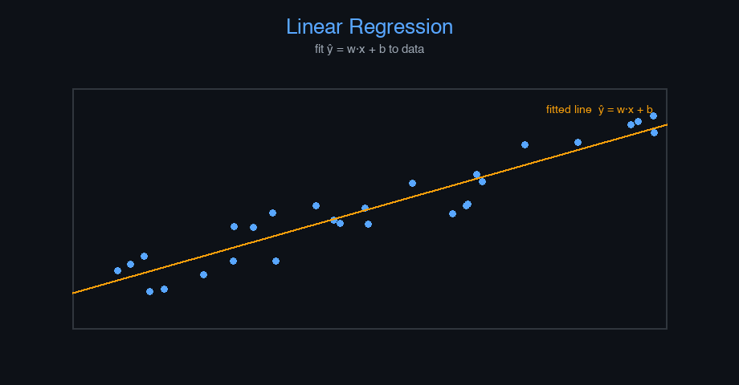

# pizza-price


Linear Regression — AI engineering example · part of the MLOps monorepo

## 1. Mathematical Foundations

This example is grounded in **Linear Regression**. The equations below
drive every forward and backward pass in the implementation.

$$\hat{y} = w \cdot x + b$$

$$\mathcal{L}_{MSE} = \frac{1}{n} \sum_{i=1}^{n} (y_i - \hat{y}_i)^2$$

$$\frac{\partial \mathcal{L}}{\partial w} = -\frac{2}{n} \sum_{i=1}^{n} x_i(y_i - \hat{y}_i)$$

$$\frac{\partial \mathcal{L}}{\partial b} = -\frac{2}{n} \sum_{i=1}^{n} (y_i - \hat{y}_i)$$

$$w \leftarrow w - \alpha \cdot \frac{\partial \mathcal{L}}{\partial w}, \quad b \leftarrow b - \alpha \cdot \frac{\partial \mathcal{L}}{\partial b}$$

### Derivation

Starting from the hypothesis $h(x) = wx + b$, we minimize the MSE loss. Taking partial derivatives w.r.t. $w$ and $b$ and applying gradient descent yields the update rules. The learning rate $\alpha$ controls step size; too large causes divergence, too small causes slow convergence.

### Worked Numerical Example

$$z = w \cdot x + b$$

Illustrative forward-pass evaluation (scalar example):

Input  x        = 12.0   (e.g. pizza diameter, inches)
Weights w       =  0.85
Bias    b       =  0.30
---------------------------------
z = w*x + b
  = 0.85 * 12.0 + 0.30
  = 10.20 + 0.30
  = 10.50   <- model output

### Conceptual Diagram

        Math concept (placeholder)
   [ Input x ] --> ( w · x + b ) --> [ Output z ]
                       |
                  [ activation ]
                       |
                  [ prediction ]



Interactive scatter plot with regression line, showing loss descent over iterations.

## 2. Core Logic & Architecture

The example follows a consistent **data → train → evaluate → serve**
pipeline. Inputs are loaded and validated, transformed by the core algorithm, scored against
held-out data, and exposed through a REST API.

  Raw dataset→
  load + validate (data.py)→
  fit / transform (model.py)→
  evaluate + persist (train.py)→
  serve (api.py)

### Primary Components

| Class | Public methods | Responsibility |
| --- | --- | --- |
| `PredictRequest` | — | Single pizza price prediction request. |
| `PredictBulkRequest` | — | Bulk pizza price prediction request. |
| `PredictResponse` | — | Prediction response. |
| `BulkPredictResponse` | — | Bulk prediction response. |
| `DriftResponse` | — | Drift detection response. |
| `LinearRegression` | predict, fit, mse, rmse, r2_score, mae, evaluate, save, load, to_dict | Linear regression: price = weight * diameter + bias, trained via MSE gradient descent. |

### Data Flow


1. **Load** — `data.py` reads the source dataset and splits train/test.


2. **Validate** — a Pydantic schema guards input shape/dtypes before training.


3. **Fit / Transform** — `model.py` applies the mathematics from Section 1.


4. **Evaluate** — metrics (MSE/RMSE/R², accuracy, etc.) are computed and logged.


5. **Persist** — weights/artifacts are saved and registered in the model registry.


6. **Serve** — `api.py` exposes prediction endpoints with drift detection.

### Design Patterns & Performance

Key design choices in this module: a pure-NumPy implementation (no PyTorch/TensorFlow), schema validation via `ai_core.validation`, structured JSON logging through `ai_core.logging`, Prometheus metrics from `ai_core.metrics`, and MLflow/model-registry persistence via `ai_core.model_registry`. The FastAPI service wraps the trained model with observability middleware from `ai_core.fastapi_middleware`.

## 3. Detailed Code Walkthrough

The most important behaviour is summarised below; full source for each module is collapsible
so the page stays readable while remaining self-contained.

### `LinearRegression.predict(X)`

Forward pass: y_hat = w * x + b.

### `LinearRegression.fit(X, y)`

Train using gradient descent on Mean Squared Error.

### `LinearRegression.evaluate(X, y)`

Compute all evaluation metrics.

### Source Files

<details>
<summary>model.py</summary>

```
"""Linear Regression model for pizza price prediction.

Implements a production-ready linear regression with:
- Gradient descent training
- R² score computation
- Feature scaling
- Proper serialization with metadata
"""

from dataclasses import dataclass, field

import numpy as np

@dataclass
class LinearRegression:
    """Linear regression: price = weight * diameter + bias, trained via MSE gradient descent."""

    learning_rate: float = 0.001
    n_iterations: int = 2000
    weight: float = 0.0
    bias: float = 0.0
    loss_history: list[float] = field(default_factory=list)

    def predict(self, X: np.ndarray) -> np.ndarray:
        """Forward pass: y_hat = w * x + b."""
        return self.weight * X + self.bias

    def fit(self, X: np.ndarray, y: np.ndarray) -> "LinearRegression":
        """Train using gradient descent on Mean Squared Error."""
        n = len(X)
        self.loss_history = []
        for _ in range(self.n_iterations):
            y_pred = self.predict(X)
            loss = np.mean((y_pred - y) ** 2)
            self.loss_history.append(float(loss))

            dw = (2 / n) * np.sum(X * (y_pred - y))
            db = (2 / n) * np.sum(y_pred - y)

            self.weight -= self.learning_rate * dw
            self.bias -= self.learning_rate * db

        return self

    # ---------- Metrics ----------

    def mse(self, X: np.ndarray, y: np.ndarray) -> float:
        """Compute Mean Squared Error on given data."""
        return float(np.mean((self.predict(X) - y) ** 2))

    def rmse(self, X: np.ndarray, y: np.ndarray) -> float:
        """Compute Root Mean Squared Error."""
        return float(np.sqrt(self.mse(X, y)))

    def r2_score(self, X: np.ndarray, y: np.ndarray) -> float:
        """Compute R² (coefficient of determination) score."""
        y_pred = self.predict(X)
        ss_res = np.sum((y - y_pred) ** 2)
        ss_tot = np.sum((y - np.mean(y)) ** 2)
        if ss_tot == 0:
            return 1.0 if ss_res == 0 else 0.0
        return float(1 - ss_res / ss_tot)

    def mae(self, X: np.ndarray, y: np.ndarray) -> float:
        """Compute Mean Absolute Error."""
        return float(np.mean(np.abs(self.predict(X) - y)))

    def evaluate(self, X: np.ndarray, y: np.ndarray) -> dict[str, float]:
        """Compute all evaluation metrics."""
        return {
            "mse": self.mse(X, y),
            "rmse": self.rmse(X, y),
            "mae": self.mae(X, y),
            "r2": self.r2_score(X, y),
        }

    # ---------- Serialization ----------

    def save(self, path: str) -> None:
        """Save model parameters to disk."""
        np.savez(
            path,
            weight=self.weight,
            bias=self.bias,
            learning_rate=self.learning_rate,
            n_iterations=self.n_iterations,
            loss_history=np.array(self.loss_history),
        )

    @classmethod
    def load(cls, path: str) -> "LinearRegression":
        """Load model parameters from disk."""
        data = np.load(path)
        model = cls(
            learning_rate=float(data["learning_rate"]),
            n_iterations=int(data["n_iterations"]),
        )
        model.weight = float(data["weight"])
        model.bias = float(data["bias"])
        model.loss_history = list(data["loss_history"])
        return model

    def to_dict(self) -> dict[str, float]:
        """Return model parameters as a dict."""
        return {
            "weight": self.weight,
            "bias": self.bias,
            "learning_rate": self.learning_rate,
            "n_iterations": self.n_iterations,
        }
```

</details>

<details>
<summary>train.py</summary>

```
"""Production training pipeline for pizza price prediction."""

import argparse
import os
from pathlib import Path

import numpy as np
from ai_core.logging import get_logger, setup_logging
from ai_core.model_registry import ModelRegistry
from ai_core.validation import DataValidator, create_pizza_schema

from pizza_price.data import load_training_data, save_training_data, train_test_split
from pizza_price.model import LinearRegression

logger = get_logger(__name__)

def train(
    model_dir: Path,
    data_path: Path,
    learning_rate: float,
    n_iterations: int,
    model_version: str,
    register_to_mlflow: bool = False,
    test_size: float = 0.2,
    random_seed: int = 42,
) -> dict:
    """Train the pizza price model and save artifacts."""
    # Load training data
    X, y = load_training_data(data_path)
    logger.info("Loaded training data", n_samples=len(X), data_path=str(data_path))

    # Validate training data
    validator = DataValidator(create_pizza_schema())
    validation = validator.validate(X, y)
    if not validation.valid:
        logger.error("Training data validation failed", errors=validation.errors)
        raise ValueError(f"Training data validation failed: {validation.errors}")
    logger.info("Training data validated", stats=validation.stats)

    # Split train/test
    X_train, X_test, y_train, y_test = train_test_split(
        X, y, test_size=test_size, random_seed=random_seed
    )
    logger.info(
        "Data split",
        n_train=len(X_train),
        n_test=len(X_test),
        test_size=test_size,
        random_seed=random_seed,
    )

    # Save training data for reproducibility
    save_training_data(X, y, model_dir / "training_data.csv")

    # Train model
    model = LinearRegression(learning_rate=learning_rate, n_iterations=n_iterations)
    model.fit(X_train, y_train)

    # Evaluate on train and test
    train_metrics = model.evaluate(X_train, y_train)
    test_metrics = model.evaluate(X_test, y_test)

    logger.info(
        "Training complete",
        weight=model.weight,
        bias=model.bias,
        train_metrics=train_metrics,
        test_metrics=test_metrics,
        iterations=n_iterations,
    )

    # Model validation - check metrics meet thresholds
    if test_metrics["rmse"] > 5.0:
        logger.warning("Model RMSE above threshold", rmse=test_metrics["rmse"], threshold=5.0)

    # Save model
    model_path = model_dir / f"pizza_model_v{model_version}.npz"
    model.save(str(model_path))

    # Save training chart
    _save_chart(model, X, y, model_dir, model_version)

    # Combined metrics for registry
    metrics = {
        "mse": test_metrics["mse"],
        "rmse": test_metrics["rmse"],
        "mae": test_metrics["mae"],
        "r2": test_metrics["r2"],
        "train_mse": train_metrics["mse"],
        "train_r2": train_metrics["r2"],
        "weight": model.weight,
        "bias": model.bias,
        "n_samples": len(X),
        "n_train": len(X_train),
        "n_test": len(X_test),
    }

    # Register model
    registry = ModelRegistry(base_dir=model_dir)
    registry.save_model(
        model_name="pizza-price",
        model_version=model_version,
        model_type="regression",
        metrics=metrics,
        parameters={
            "learning_rate": learning_rate,
            "n_iterations": n_iterations,
            "random_seed": random_seed,
        },
        artifacts={
            f"pizza_model_v{model_version}.npz": model_path,
            "training_data.csv": model_dir / "training_data.csv",
        },
        tags={"framework": "numpy", "task": "regression"},
    )

    if register_to_mlflow:
        registry.log_to_mlflow(
            model_name="pizza-price",
            model_version=model_version,
            metrics=metrics,
            params={
                "learning_rate": learning_rate,
                "n_iterations": n_iterations,
                "random_seed": random_seed,
            },
            artifacts={
                "model": str(model_path),
                "chart": str(model_dir / f"pizza_regression_v{model_version}.png"),
                "training_data": str(model_dir / "training_data.csv"),
            },
            tags={"model_type": "regression", "framework": "numpy"},
        )
        logger.info("Registered model to MLflow", model="pizza-price", version=model_version)

    return metrics

def _save_chart(
    model: LinearRegression, X: np.ndarray, y: np.ndarray, output_dir: Path, version: str
) -> None:
    """Save the regression chart."""
    import matplotlib

    matplotlib.use("Agg")
    import matplotlib.pyplot as plt

    plt.figure(figsize=(10, 6))
    plt.scatter(X, y, color="blue", s=100, label="Training data")

    line_x = np.linspace(min(X) - 1, max(X) + 1, 100)
    line_y = model.predict(line_x)
    plt.plot(line_x, line_y, color="red", linewidth=2, label="Fitted line")

    plt.xlabel("Pizza Diameter (inches)")
    plt.ylabel("Price (USD)")
    plt.title(f"Pizza Price vs Diameter - Trained Model v{version}")
    plt.grid(True, alpha=0.3)
    plt.legend()

    chart_path = output_dir / f"pizza_regression_v{version}.png"
    plt.tight_layout()
    plt.savefig(str(chart_path), dpi=100)
    plt.close()
    logger.info("Chart saved", path=str(chart_path))

def main():
    parser = argparse.ArgumentParser(description="Train pizza price prediction model")
    parser.add_argument("--model-dir", type=Path, default=Path(os.getenv("MODEL_DIR", "/models")))
    parser.add_argument("--data-path", type=Path, default=None)
    parser.add_argument(
        "--learning-rate", type=float, default=float(os.getenv("LEARNING_RATE", "0.001"))
    )
    parser.add_argument("--n-iterations", type=int, default=int(os.getenv("N_ITERATIONS", "2000")))
    parser.add_argument("--model-version", type=str, default=os.getenv("MODEL_VERSION", "1.0.0"))
    parser.add_argument("--test-size", type=float, default=float(os.getenv("TEST_SIZE", "0.2")))
    parser.add_argument("--random-seed", type=int, default=int(os.getenv("RANDOM_SEED", "42")))
    parser.add_argument(
        "--register-mlflow",
        action="store_true",
        default=os.getenv("REGISTER_MLFLOW", "false").lower() == "true",
    )
    parser.add_argument("--log-level", type=str, default=os.getenv("LOG_LEVEL", "INFO"))
    args = parser.parse_args()

    setup_logging(args.log_level)
    args.model_dir.mkdir(parents=True, exist_ok=True)

    metrics = train(
        model_dir=args.model_dir,
        data_path=args.data_path,
        learning_rate=args.learning_rate,
        n_iterations=args.n_iterations,
        model_version=args.model_version,
        register_to_mlflow=args.register_mlflow,
        test_size=args.test_size,
        random_seed=args.random_seed,
    )

    logger.info("Training finished", metrics=metrics, model_dir=str(args.model_dir))

if __name__ == "__main__":
    main()
```

</details>

<details>
<summary>data.py</summary>

```
"""Data loading and preprocessing for pizza price prediction."""

from pathlib import Path

import numpy as np
import pandas as pd

def load_training_data(data_path: Path | None = None) -> tuple[np.ndarray, np.ndarray]:
    """Load pizza training data from CSV or use built-in dataset.

    Expected CSV format:
        diameter,price
        6,7.0
        8,9.0
        ...
    """
    if data_path and Path(data_path).exists():
        df = pd.read_csv(data_path)
        X = df["diameter"].values.astype(float)
        y = df["price"].values.astype(float)
        return X, y

    # Built-in training data
    X = np.array([6, 8, 10, 14, 18], dtype=float)
    y = np.array([7.0, 9.0, 13.0, 17.5, 18.0], dtype=float)
    return X, y

def train_test_split(
    X: np.ndarray, y: np.ndarray, test_size: float = 0.2, random_seed: int | None = None
) -> tuple[np.ndarray, np.ndarray, np.ndarray, np.ndarray]:
    """Split data into train and test sets."""
    n = len(X)
    n_test = max(1, int(n * test_size))

    if random_seed is not None:
        rng = np.random.default_rng(random_seed)
        indices = rng.permutation(n)
    else:
        indices = np.random.permutation(n)

    test_idx = indices[:n_test]
    train_idx = indices[n_test:]

    return X[train_idx], X[test_idx], y[train_idx], y[test_idx]

def save_training_data(X: np.ndarray, y: np.ndarray, path: Path) -> None:
    """Save training data to CSV for reproducibility."""
    path = Path(path)
    path.parent.mkdir(parents=True, exist_ok=True)
    df = pd.DataFrame({"diameter": X, "price": y})
    df.to_csv(path, index=False)
```

</details>

<details>
<summary>api.py</summary>

```
"""Production serving API for pizza price prediction."""

import os
import time
from contextlib import asynccontextmanager
from pathlib import Path

import numpy as np
from ai_core.drift import DriftDetector
from ai_core.fastapi_middleware import add_observability_middleware
from ai_core.logging import get_logger, setup_logging
from ai_core.metrics import MetricsCollector
from ai_core.model_registry import ModelRegistry
from ai_core.validation import DataValidator, create_pizza_schema
from fastapi import FastAPI, HTTPException, Response
from pydantic import BaseModel, Field

from pizza_price.model import LinearRegression

logger = get_logger(__name__)

# Configuration
MODEL_DIR = Path(os.getenv("MODEL_DIR", "/models"))
MODEL_VERSION = os.getenv("MODEL_VERSION", "latest")
METRICS_PORT = int(os.getenv("METRICS_PORT", os.getenv("PIZZA_METRICS_PORT", "8001")))
DRIFT_THRESHOLD = float(os.getenv("DRIFT_THRESHOLD", "0.2"))

class PredictRequest(BaseModel):
    """Single pizza price prediction request."""

    diameter: float = Field(..., gt=0, le=50, description="Pizza diameter in inches")

class PredictBulkRequest(BaseModel):
    """Bulk pizza price prediction request."""

    diameters: list[float] = Field(..., min_length=1, max_length=100)

class PredictResponse(BaseModel):
    """Prediction response."""

    diameter: float
    predicted_price: float
    equation: str
    model_version: str

class BulkPredictResponse(BaseModel):
    """Bulk prediction response."""

    predictions: list[PredictResponse]
    model_version: str

class DriftResponse(BaseModel):
    """Drift detection response."""

    total_features: int
    drifted_features: int
    drift_ratio: float
    drifted: list[dict]
    all_results: list[dict]

# Global model state
_model: LinearRegression | None = None
_model_version: str = "unknown"
_metrics: MetricsCollector | None = None
_validator: DataValidator | None = None
_drift_detector: DriftDetector | None = None
_reference_data: np.ndarray | None = None
_recent_predictions: list[float] = []

@asynccontextmanager
async def lifespan(app: FastAPI):
    """Load model at startup and clean up at shutdown."""
    global _model, _model_version, _metrics, _validator, _drift_detector, _reference_data

    setup_logging(os.getenv("LOG_LEVEL", "INFO"))
    _metrics = MetricsCollector("pizza_price", port=METRICS_PORT)
    app.state.metrics = _metrics

    _validator = DataValidator(create_pizza_schema())
    _drift_detector = DriftDetector(
        feature_names=["diameter"],
        feature_types={"diameter": "float"},
        psi_threshold=DRIFT_THRESHOLD,
    )

    _model, _model_version = _load_model()
    _metrics.set_model_version(_model_version)
    _metrics.set_model_info(
        model_name="pizza-price", model_version=_model_version, model_type="regression"
    )

    # Load reference data for drift detection
    _reference_data = _load_reference_data()
    logger.info("Model loaded", model="pizza-price", version=_model_version)

    yield

    logger.info("Shutting down pizza-price API")

def _load_model() -> tuple[LinearRegression, str]:
    """Load the latest model from the registry or model directory with resilient fallback."""
    # 1. Try model registry
    registry = ModelRegistry(base_dir=MODEL_DIR)
    try:
        if MODEL_VERSION == "latest":
            models = registry.list_models()
            pizza_models = [m for m in models if m.get("model_name") == "pizza-price"]
            if pizza_models:
                pizza_models.sort(key=lambda m: m["model_version"], reverse=True)
                latest = pizza_models[0]
                model_dir = Path(latest["artifact_path"])
                npz_files = list(model_dir.glob("pizza_model_*.npz")) + list(
                    model_dir.glob("*.npz")
                )
                if npz_files:
                    return LinearRegression.load(str(npz_files[0])), latest["model_version"]
        else:
            model_dir = MODEL_DIR / "pizza-price" / MODEL_VERSION
            if model_dir.exists():
                npz_files = list(model_dir.glob("pizza_model_*.npz")) + list(
                    model_dir.glob("*.npz")
                )
                if npz_files:
                    return LinearRegression.load(str(npz_files[0])), MODEL_VERSION
    except Exception as e:
        logger.warning(f"Registry lookup failed: {e}")

    # 2. Try direct model in MODEL_DIR
    npz_path = MODEL_DIR / "pizza_model.npz"
    if npz_path.exists():
        return LinearRegression.load(str(npz_path)), "legacy"

    # 3. Try bundled artifacts directory
    candidate_paths = [
        Path("/app/artifacts/models/pizza_model_v1.0.0.npz"),
        Path(__file__).resolve().parents[3] / "artifacts" / "models" / "pizza_model_v1.0.0.npz",
    ]
    for p in candidate_paths:
        if p.exists():
            logger.info("Loading bundled baseline model", path=str(p))
            return LinearRegression.load(str(p)), "1.0.0-bundled"

    # 4. In-memory baseline fallback (never crash cold start)
    logger.warning("No pre-existing model found on disk. Initializing baseline linear model.")
    from pizza_price.data import load_training_data

    X_base, y_base = load_training_data(None)
    model = LinearRegression(learning_rate=0.001, n_iterations=2000)
    model.fit(X_base, y_base)
    return model, "1.0.0-baseline"

def _load_reference_data() -> np.ndarray | None:
    """Load reference training data for drift detection."""
    candidate_csvs = [
        MODEL_DIR / "pizza-price" / _model_version / "training_data.csv",
        MODEL_DIR / "training_data.csv",
        Path("/app/artifacts/models/training_data.csv"),
        Path(__file__).resolve().parents[3] / "artifacts" / "models" / "training_data.csv",
    ]
    for csv_path in candidate_csvs:
        if csv_path.exists():
            try:
                import pandas as pd

                df = pd.read_csv(csv_path)
                if "diameter" in df.columns:
                    return df[["diameter"]].values
            except Exception as e:
                logger.warning("Could not read reference csv", path=str(csv_path), error=str(e))

    from pizza_price.data import load_training_data

    X_base, _ = load_training_data(None)
    return X_base.reshape(-1, 1)

# Create FastAPI app
app = FastAPI(
    title="Pizza Price Prediction API",
    description="Linear Regression model for predicting pizza prices from diameter",
    version="1.0.0",
    lifespan=lifespan,
)

# Add observability middleware
add_observability_middleware(app)

@app.get("/")
def read_root():
    """Service information."""
    return {
        "service": "pizza-price-api",
        "version": "1.0.0",
        "model_version": _model_version,
        "endpoints": {
            "health": "/health",
            "predict": "POST /predict",
            "predict_bulk": "POST /predict/bulk",
            "drift": "GET /drift",
            "metrics": "/metrics",
        },
    }

@app.get("/health")
def health_check():
    """Kubernetes liveness/readiness probe."""
    if _model is None:
        raise HTTPException(status_code=503, detail="Model not loaded")
    return {
        "status": "healthy",
        "model_loaded": True,
        "model_version": _model_version,
    }

@app.get("/metrics")
def metrics():
    """Prometheus metrics endpoint."""
    from prometheus_client import CONTENT_TYPE_LATEST, generate_latest

    return Response(content=generate_latest(), media_type=CONTENT_TYPE_LATEST)

@app.post("/reload")
def reload_model():
    """Dynamically reload the model from disk/registry."""
    global _model, _model_version, _reference_data
    try:
        _model, _model_version = _load_model()
        if _metrics:
            _metrics.set_model_version(_model_version)
            _metrics.set_model_info(
                model_name="pizza-price", model_version=_model_version, model_type="regression"
            )
        _reference_data = _load_reference_data()
        logger.info("Model reloaded dynamically", model="pizza-price", version=_model_version)
        return {"status": "reloaded", "model_version": _model_version}
    except Exception as e:
        logger.exception("Model reload failed", error=str(e))
        raise HTTPException(status_code=500, detail=f"Reload failed: {e}") from e

@app.get("/drift", response_model=DriftResponse)
def drift_check():
    """Check for data drift between reference and recent predictions."""
    if _drift_detector is None or _reference_data is None:
        raise HTTPException(status_code=503, detail="Drift detection not available")

    if len(_recent_predictions) < 10:
        return DriftResponse(
            total_features=1,
            drifted_features=0,
            drift_ratio=0.0,
            drifted=[],
            all_results=[],
        )

    current = np.array(_recent_predictions[-100:]).reshape(-1, 1)
    results = _drift_detector.detect_drift(_reference_data, current)
    summary = _drift_detector.summarize(results)

    return DriftResponse(**summary)

@app.post("/predict", response_model=PredictResponse)
def predict(body: PredictRequest):
    """Predict pizza price for a single diameter."""
    if _model is None or _metrics is None or _validator is None:
        raise HTTPException(status_code=503, detail="Model not loaded")

    # Validate input
    validation = _validator.validate(np.array([body.diameter]))
    if not validation.valid:
        raise HTTPException(status_code=422, detail=validation.errors)

    start = time.time()
    try:
        price = _model.predict(np.array([body.diameter]))[0]
        duration = time.time() - start
        _metrics.record_prediction(model_version=_model_version, duration=duration)

        # Track for drift detection
        _recent_predictions.append(body.diameter)
        if len(_recent_predictions) > 1000:
            _recent_predictions.pop(0)

        return PredictResponse(
            diameter=body.diameter,
            predicted_price=round(float(price), 2),
            equation=f"price = {_model.weight:.4f} * diameter + {_model.bias:.4f}",
            model_version=_model_version,
        )
    except Exception as e:
        _metrics.record_error(model_version=_model_version)
        logger.exception("Prediction failed", error=str(e))
        raise HTTPException(status_code=500, detail="Prediction failed") from e

@app.post("/predict/bulk", response_model=BulkPredictResponse)
def predict_bulk(body: PredictBulkRequest):
    """Predict pizza prices for multiple diameters."""
    global _recent_predictions
    if _model is None or _metrics is None or _validator is None:
        raise HTTPException(status_code=503, detail="Model not loaded")

    # Validate input
    validation = _validator.validate(np.array(body.diameters))
    if not validation.valid:
        raise HTTPException(status_code=422, detail=validation.errors)

    start = time.time()
    try:
        diameters = np.array(body.diameters)
        prices = _model.predict(diameters)
        duration = time.time() - start
        _metrics.record_prediction(model_version=_model_version, duration=duration)

        # Track for drift detection
        _recent_predictions.extend(body.diameters)
        if len(_recent_predictions) > 1000:
            _recent_predictions = _recent_predictions[-1000:]

        predictions = [
            PredictResponse(
                diameter=float(d),
                predicted_price=round(float(p), 2),
                equation=f"price = {_model.weight:.4f} * diameter + {_model.bias:.4f}",
                model_version=_model_version,
            )
            for d, p in zip(diameters, prices, strict=False)
        ]
        return BulkPredictResponse(predictions=predictions, model_version=_model_version)
    except Exception as e:
        _metrics.record_error(model_version=_model_version)
        logger.exception("Bulk prediction failed", error=str(e))
        raise HTTPException(status_code=500, detail="Bulk prediction failed") from e
```

</details>

## 4. Monorepo Integration

This example is a first-class consumer of the shared `packages/ai-core` library.
It reuses the following foundation modules instead of re-implementing infrastructure:

ai_core.drift
ai_core.fastapi_middleware
ai_core.logging
ai_core.metrics
ai_core.model_registry
ai_core.validation

### How it plugs in


- **Configuration** — 12-factor config from `ai_core.config`.


- **Observability** — structured logging + Prometheus metrics are wired in automatically.


- **Validation** — input schema validation prevents bad data reaching the model.


- **Registry** — trained artifacts are versioned and registered for reproducible serving.


- **Serving** — the FastAPI app mounts shared observability middleware for tracing & metrics.

Because every example shares `ai_core`, cross-cutting concerns (drift detection,
logging, metrics, model registry) behave identically across the 47 examples in this monorepo.
