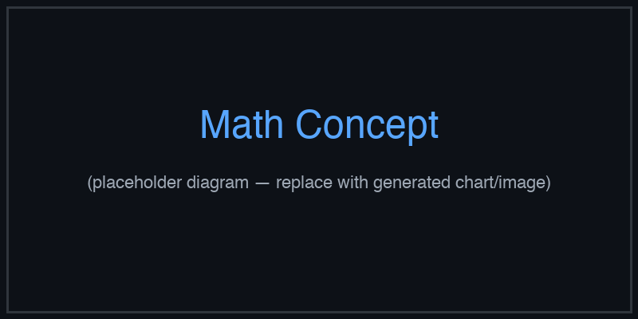

# spam-classification


Logistic Regression — AI engineering example · part of the MLOps monorepo

## 1. Mathematical Foundations

This example is grounded in **Logistic Regression**. The equations below
drive every forward and backward pass in the implementation.

$$z = w \cdot x + b$$

$$\hat{y} = \sigma(z) = \frac{1}{1 + e^{-z}}$$

$$\mathcal{L}_{BCE} = -\frac{1}{n} \sum_{i=1}^{n} [y_i \log(\hat{y}_i) + (1-y_i)\log(1-\hat{y}_i)]$$

$$\frac{\partial \mathcal{L}}{\partial w} = \frac{1}{n} \sum_{i=1}^{n} (\hat{y}_i - y_i)x_i$$

### Derivation

Logistic regression models $P(y=1|x)$ via the sigmoid function. Binary cross-entropy loss penalizes confident wrong predictions. The gradient simplifies to $\hat{y} - y$, enabling efficient SGD.

### Worked Numerical Example

$$z = w \cdot x + b$$

Illustrative forward-pass evaluation (scalar example):

Input  x        = 12.0   (e.g. pizza diameter, inches)
Weights w       =  0.85
Bias    b       =  0.30
---------------------------------
z = w*x + b
  = 0.85 * 12.0 + 0.30
  = 10.20 + 0.30
  = 10.50   <- model output

### Conceptual Diagram

        Core transformation flow
   [ Input x ] --> ( w · x + b ) --> [ Output z ]
                       |
                  [ activation ]
                       |
                  [ prediction ]



Sigmoid curve with decision boundary overlay; ROC and precision-recall curves.

## 2. Core Logic & Architecture

The example follows a consistent **data → train → evaluate → serve**
pipeline. Inputs are loaded and validated, transformed by the core algorithm, scored against
held-out data, and exposed through a REST API.

  Raw dataset→
  load + validate (data.py)→
  fit / transform (model.py)→
  evaluate + persist (train.py)→
  serve (api.py)

### Primary Components

| Class | Public methods | Responsibility |
| --- | --- | --- |
| `PredictRequest` | — | Request with explicit feature values. |
| `EmailRequest` | — | Request with raw email text (features are auto-extracted). |
| `PredictResponse` | — | Response with prediction and probability. |
| `DriftResponse` | — | Drift detection response. |
| `LogisticRegression` | _sigmoid, predict_proba, predict, fit, accuracy, precision, recall, f1_score, roc_auc, evaluate, save, load | Logistic regression for binary classification (spam / not spam).  Model: z = X·w + b,  p = sigmoid(z),  prediction = 1 if p >= threshold else 0 |

### Data Flow


1. **Load** — `data.py` reads the source dataset and splits train/test.


2. **Validate** — a Pydantic schema guards input shape/dtypes before training.


3. **Fit / Transform** — `model.py` applies the mathematics from Section 1.


4. **Evaluate** — metrics (MSE/RMSE/R², accuracy, etc.) are computed and logged.


5. **Persist** — weights/artifacts are saved and registered in the model registry.


6. **Serve** — `api.py` exposes prediction endpoints with drift detection.

### Design Patterns & Performance

Key design choices in this module: a pure-NumPy implementation (no PyTorch/TensorFlow), schema validation via `ai_core.validation`, structured JSON logging through `ai_core.logging`, Prometheus metrics from `ai_core.metrics`, and MLflow/model-registry persistence via `ai_core.model_registry`. The FastAPI service wraps the trained model with observability middleware from `ai_core.fastapi_middleware`.

## 3. Detailed Code Walkthrough

The most important behaviour is summarised below; full source for each module is collapsible
so the page stays readable while remaining self-contained.

### `LogisticRegression.predict(X, threshold)`

Return 1 (spam) if probability >= threshold, else 0 (not spam).

### `LogisticRegression.fit(X, y)`

Train using gradient descent on Binary Cross-Entropy.

### `LogisticRegression.evaluate(X, y)`

Compute all evaluation metrics.

### Source Files

<details>
<summary>model.py</summary>

```
"""Logistic Regression model for spam email classification."""

from dataclasses import dataclass, field

import numpy as np

@dataclass
class LogisticRegression:
    """Logistic regression for binary classification (spam / not spam).

    Model: z = X·w + b,  p = sigmoid(z),  prediction = 1 if p >= threshold else 0
    """

    learning_rate: float = 0.1
    n_iterations: int = 2000
    weights: np.ndarray | None = None
    bias: float = 0.0
    loss_history: list[float] = field(default_factory=list)

    def _sigmoid(self, z: np.ndarray) -> np.ndarray:
        """Sigmoid activation function with numerical stability."""
        z = np.clip(z, -500, 500)
        return 1 / (1 + np.exp(-z))

    def predict_proba(self, X: np.ndarray) -> np.ndarray:
        """Return probability of spam for each email."""
        if self.weights is None:
            raise ValueError("Model not trained. Call fit() first.")
        z = np.dot(X, self.weights) + self.bias
        return self._sigmoid(z)

    def predict(self, X: np.ndarray, threshold: float = 0.5) -> np.ndarray:
        """Return 1 (spam) if probability >= threshold, else 0 (not spam)."""
        return (self.predict_proba(X) >= threshold).astype(int)

    def fit(self, X: np.ndarray, y: np.ndarray) -> "LogisticRegression":
        """Train using gradient descent on Binary Cross-Entropy."""
        n_samples, n_features = X.shape
        self.weights = np.zeros(n_features)
        self.bias = 0.0

        for _ in range(self.n_iterations):
            probs = self.predict_proba(X)
            loss = -np.mean(y * np.log(probs + 1e-9) + (1 - y) * np.log(1 - probs + 1e-9))
            self.loss_history.append(float(loss))

            dw = (1 / n_samples) * np.dot(X.T, (probs - y))
            db = (1 / n_samples) * np.sum(probs - y)

            self.weights -= self.learning_rate * dw
            self.bias -= self.learning_rate * db

        return self

    def accuracy(self, X: np.ndarray, y: np.ndarray) -> float:
        """Compute classification accuracy."""
        predictions = self.predict(X)
        return float(np.mean(predictions == y))

    def precision(self, X: np.ndarray, y: np.ndarray) -> float:
        """Compute precision (positive predictive value)."""
        predictions = self.predict(X)
        tp = np.sum((predictions == 1) & (y == 1))
        fp = np.sum((predictions == 1) & (y == 0))
        if tp + fp == 0:
            return 0.0
        return float(tp / (tp + fp))

    def recall(self, X: np.ndarray, y: np.ndarray) -> float:
        """Compute recall (sensitivity)."""
        predictions = self.predict(X)
        tp = np.sum((predictions == 1) & (y == 1))
        fn = np.sum((predictions == 0) & (y == 1))
        if tp + fn == 0:
            return 0.0
        return float(tp / (tp + fn))

    def f1_score(self, X: np.ndarray, y: np.ndarray) -> float:
        """Compute F1 score."""
        p = self.precision(X, y)
        r = self.recall(X, y)
        if p + r == 0:
            return 0.0
        return float(2 * p * r / (p + r))

    def roc_auc(self, X: np.ndarray, y: np.ndarray) -> float:
        """Compute ROC AUC approximation."""
        probs = self.predict_proba(X)
        n_pos = np.sum(y == 1)
        n_neg = np.sum(y == 0)
        if n_pos == 0 or n_neg == 0:
            return 0.5
        rankings = np.argsort(-probs)
        sorted_y = y[rankings]
        rank_sum = np.sum(np.where(sorted_y == 1)[0] + 1)
        auc = (rank_sum - n_pos * (n_pos + 1) / 2) / (n_pos * n_neg)
        return float(auc)

    def evaluate(self, X: np.ndarray, y: np.ndarray) -> dict[str, float]:
        """Compute all evaluation metrics."""
        return {
            "accuracy": self.accuracy(X, y),
            "precision": self.precision(X, y),
            "recall": self.recall(X, y),
            "f1": self.f1_score(X, y),
            "roc_auc": self.roc_auc(X, y),
        }

    def save(self, path: str) -> None:
        """Save model parameters to disk."""
        if self.weights is None:
            raise ValueError("Cannot save untrained model")
        np.savez(
            path,
            weights=self.weights,
            bias=self.bias,
            learning_rate=self.learning_rate,
            n_iterations=self.n_iterations,
            loss_history=np.array(self.loss_history),
        )

    @classmethod
    def load(cls, path: str) -> "LogisticRegression":
        """Load model parameters from disk."""
        data = np.load(path)
        model = cls(
            learning_rate=float(data["learning_rate"]),
            n_iterations=int(data["n_iterations"]),
        )
        model.weights = data["weights"]
        model.bias = float(data["bias"])
        model.loss_history = list(data["loss_history"])
        return model
```

</details>

<details>
<summary>train.py</summary>

```
"""Production training pipeline for spam email classification."""

import argparse
import os
from pathlib import Path

import numpy as np
from ai_core.logging import get_logger, setup_logging
from ai_core.model_registry import ModelRegistry
from ai_core.validation import DataValidator, create_spam_schema

from spam_classification.data import (
    FEATURE_NAMES,
    load_training_data,
    save_training_data,
    train_test_split,
)
from spam_classification.model import LogisticRegression

logger = get_logger(__name__)

def train(
    model_dir: Path,
    data_path: Path,
    learning_rate: float,
    n_iterations: int,
    model_version: str,
    register_to_mlflow: bool = False,
    test_size: float = 0.2,
    random_seed: int = 42,
) -> dict:
    """Train the spam classification model and save artifacts.

    Returns:
        Dictionary with training metrics
    """
    # Load training data
    X, y = load_training_data(data_path)
    logger.info("Loaded training data", n_samples=len(X), n_features=X.shape[1])

    # Validate training data
    validator = DataValidator(create_spam_schema())
    validation = validator.validate(X, y)
    if not validation.valid:
        logger.error("Training data validation failed", errors=validation.errors)
        raise ValueError(f"Training data validation failed: {validation.errors}")
    logger.info("Training data validated", stats=validation.stats)

    # Save training data for reproducibility
    save_training_data(X, y, model_dir / "training_data.csv")

    # Split train/test
    X_train, X_test, y_train, y_test = train_test_split(
        X, y, test_size=test_size, random_seed=random_seed
    )
    logger.info(
        "Data split",
        n_train=len(X_train),
        n_test=len(X_test),
        test_size=test_size,
        random_seed=random_seed,
    )

    # Train model
    model = LogisticRegression(learning_rate=learning_rate, n_iterations=n_iterations)
    model.fit(X_train, y_train)

    # Evaluate on train and test
    train_metrics = model.evaluate(X_train, y_train)
    test_metrics = model.evaluate(X_test, y_test)

    logger.info(
        "Training complete",
        weights=model.weights.tolist() if model.weights is not None else None,
        bias=model.bias,
        train_metrics=train_metrics,
        test_metrics=test_metrics,
        iterations=n_iterations,
    )

    # Model validation - check metrics meet thresholds
    if test_metrics["accuracy"] < 0.8:
        logger.warning(
            "Model accuracy below threshold", accuracy=test_metrics["accuracy"], threshold=0.8
        )

    # Save model
    model_path = model_dir / f"spam_model_v{model_version}.npz"
    model.save(str(model_path))

    # Save training chart
    _save_chart(model, X, y, model_dir, model_version)

    # Compute metrics
    metrics = {
        "accuracy": test_metrics["accuracy"],
        "precision": test_metrics["precision"],
        "recall": test_metrics["recall"],
        "f1": test_metrics["f1"],
        "roc_auc": test_metrics["roc_auc"],
        "train_accuracy": train_metrics["accuracy"],
        "n_samples": len(X),
        "n_train": len(X_train),
        "n_test": len(X_test),
        "n_features": X.shape[1],
    }

    # Register model
    registry = ModelRegistry(base_dir=model_dir)
    registry.save_model(
        model_name="spam-classification",
        model_version=model_version,
        model_type="classification",
        metrics=metrics,
        parameters={
            "learning_rate": learning_rate,
            "n_iterations": n_iterations,
            "random_seed": random_seed,
        },
        artifacts={
            f"spam_model_v{model_version}.npz": model_path,
            "training_data.csv": model_dir / "training_data.csv",
        },
        tags={"framework": "numpy", "task": "classification"},
    )

    if register_to_mlflow:
        registry.log_to_mlflow(
            model_name="spam-classification",
            model_version=model_version,
            metrics=metrics,
            params={
                "learning_rate": learning_rate,
                "n_iterations": n_iterations,
                "random_seed": random_seed,
            },
            artifacts={
                "model": str(model_path),
                "chart": str(model_dir / f"spam_classification_v{model_version}.png"),
                "training_data": str(model_dir / "training_data.csv"),
            },
            tags={"model_type": "classification", "framework": "numpy"},
        )
        logger.info(
            "Registered model to MLflow", model="spam-classification", version=model_version
        )

    return metrics

def _save_chart(
    model: LogisticRegression, X: np.ndarray, y: np.ndarray, output_dir: Path, version: str
) -> None:
    """Save the classification chart."""
    import matplotlib

    matplotlib.use("Agg")
    import matplotlib.pyplot as plt

    if model.weights is None:
        return

    plt.figure(figsize=(10, 6))

    # Plot feature weights
    feature_names = FEATURE_NAMES
    weights = model.weights

    colors = ["green" if w > 0 else "red" for w in weights]
    plt.bar(feature_names, weights, color=colors)
    plt.axhline(y=0, color="black", linewidth=0.5)
    plt.xlabel("Features")
    plt.ylabel("Weight")
    plt.title(f"Spam Classification Feature Weights - v{version}")
    plt.xticks(rotation=45)
    plt.grid(True, alpha=0.3)

    chart_path = output_dir / f"spam_classification_v{version}.png"
    plt.tight_layout()
    plt.savefig(str(chart_path), dpi=100)
    plt.close()
    logger.info("Chart saved", path=str(chart_path))

def main():
    parser = argparse.ArgumentParser(description="Train spam classification model")
    parser.add_argument("--model-dir", type=Path, default=Path(os.getenv("MODEL_DIR", "/models")))
    parser.add_argument("--data-path", type=Path, default=None)
    parser.add_argument(
        "--learning-rate", type=float, default=float(os.getenv("LEARNING_RATE", "0.1"))
    )
    parser.add_argument("--n-iterations", type=int, default=int(os.getenv("N_ITERATIONS", "2000")))
    parser.add_argument("--model-version", type=str, default=os.getenv("MODEL_VERSION", "1.0.0"))
    parser.add_argument("--test-size", type=float, default=float(os.getenv("TEST_SIZE", "0.2")))
    parser.add_argument("--random-seed", type=int, default=int(os.getenv("RANDOM_SEED", "42")))
    parser.add_argument(
        "--register-mlflow",
        action="store_true",
        default=os.getenv("REGISTER_MLFLOW", "false").lower() == "true",
    )
    parser.add_argument("--log-level", type=str, default=os.getenv("LOG_LEVEL", "INFO"))
    args = parser.parse_args()

    setup_logging(args.log_level)
    args.model_dir.mkdir(parents=True, exist_ok=True)

    metrics = train(
        model_dir=args.model_dir,
        data_path=args.data_path,
        learning_rate=args.learning_rate,
        n_iterations=args.n_iterations,
        model_version=args.model_version,
        register_to_mlflow=args.register_mlflow,
        test_size=args.test_size,
        random_seed=args.random_seed,
    )

    logger.info("Training finished", metrics=metrics, model_dir=str(args.model_dir))

if __name__ == "__main__":
    main()
```

</details>

<details>
<summary>data.py</summary>

```
"""Data loading and preprocessing for spam email classification."""

from pathlib import Path

import numpy as np
import pandas as pd

# Feature order MUST match what was used during training
FEATURE_NAMES = ["free", "win", "link", "!!!", "meeting"]

def load_training_data(data_path: Path | None = None) -> tuple[np.ndarray, np.ndarray]:
    """Load spam training data from CSV or use built-in dataset.

    Expected CSV format:
        free,win,link,!!!,meeting,label
        1,1,1,1,0,1
        ...
    """
    if data_path and Path(data_path).exists():
        df = pd.read_csv(data_path)
        X = df[FEATURE_NAMES].values.astype(float)
        y = df["label"].values.astype(int)
        return X, y

    # Built-in training data
    emails = np.array(
        [
            [1, 1, 1, 1, 0],  # SPAM
            [0, 0, 0, 0, 1],  # NOT
            [1, 0, 1, 0, 0],  # SPAM
            [0, 0, 0, 0, 1],  # NOT
            [0, 1, 1, 1, 0],  # SPAM
            [0, 0, 0, 0, 1],  # NOT
            [1, 1, 1, 1, 0],  # SPAM
            [0, 0, 0, 0, 1],  # NOT
            [0, 1, 1, 0, 0],  # SPAM
            [0, 0, 0, 0, 1],  # NOT
        ],
        dtype=float,
    )

    labels = np.array([1, 0, 1, 0, 1, 0, 1, 0, 1, 0], dtype=int)
    return emails, labels

def train_test_split(
    X: np.ndarray, y: np.ndarray, test_size: float = 0.2, random_seed: int | None = None
) -> tuple[np.ndarray, np.ndarray, np.ndarray, np.ndarray]:
    """Split data into train and test sets."""
    n = len(X)
    n_test = max(1, int(n * test_size))

    if random_seed is not None:
        rng = np.random.default_rng(random_seed)
        indices = rng.permutation(n)
    else:
        indices = np.random.permutation(n)

    test_idx = indices[:n_test]
    train_idx = indices[n_test:]

    return X[train_idx], X[test_idx], y[train_idx], y[test_idx]

def save_training_data(X: np.ndarray, y: np.ndarray, path: Path) -> None:
    """Save training data to CSV for reproducibility."""
    path = Path(path)
    path.parent.mkdir(parents=True, exist_ok=True)
    df = pd.DataFrame(X, columns=FEATURE_NAMES)
    df["label"] = y
    df.to_csv(path, index=False)
```

</details>

<details>
<summary>api.py</summary>

```
"""Production serving API for spam email classification."""

import os
import re
import time
from contextlib import asynccontextmanager
from pathlib import Path

import numpy as np
from ai_core.drift import DriftDetector
from ai_core.fastapi_middleware import add_observability_middleware
from ai_core.logging import get_logger, setup_logging
from ai_core.metrics import MetricsCollector
from ai_core.model_registry import ModelRegistry
from ai_core.validation import DataValidator, create_spam_schema
from fastapi import FastAPI, HTTPException
from pydantic import BaseModel, Field

from spam_classification.data import FEATURE_NAMES
from spam_classification.model import LogisticRegression

logger = get_logger(__name__)

# Configuration
MODEL_DIR = Path(os.getenv("MODEL_DIR", "/models"))
MODEL_VERSION = os.getenv("MODEL_VERSION", "latest")
SPAM_THRESHOLD = float(os.getenv("SPAM_THRESHOLD", "0.5"))
METRICS_PORT = int(os.getenv("METRICS_PORT", os.getenv("SPAM_METRICS_PORT", "8002")))
DRIFT_THRESHOLD = float(os.getenv("DRIFT_THRESHOLD", "0.2"))

class PredictRequest(BaseModel):
    """Request with explicit feature values."""

    features: list[int] = Field(
        ..., min_length=5, max_length=5, description="[free, win, link, !!!, meeting]"
    )
    threshold: float | None = SPAM_THRESHOLD

class EmailRequest(BaseModel):
    """Request with raw email text (features are auto-extracted)."""

    text: str = Field(..., min_length=1, max_length=10000)
    threshold: float | None = SPAM_THRESHOLD

class PredictResponse(BaseModel):
    """Response with prediction and probability."""

    is_spam: bool
    spam_probability: float
    threshold: float
    features: list[int]
    feature_names: list[str]
    label: str
    model_version: str

class DriftResponse(BaseModel):
    """Drift detection response."""

    total_features: int
    drifted_features: int
    drift_ratio: float
    drifted: list[dict]
    all_results: list[dict]

# Global model state
_model: LogisticRegression | None = None
_model_version: str = "unknown"
_metrics: MetricsCollector | None = None
_validator: DataValidator | None = None
_drift_detector: DriftDetector | None = None
_reference_data: np.ndarray | None = None
_recent_predictions: list[list[int]] = []

@asynccontextmanager
async def lifespan(app: FastAPI):
    """Load model at startup and clean up at shutdown."""
    global _model, _model_version, _metrics, _validator, _drift_detector, _reference_data

    setup_logging(os.getenv("LOG_LEVEL", "INFO"))
    _metrics = MetricsCollector("spam_classification", port=METRICS_PORT)
    app.state.metrics = _metrics

    _validator = DataValidator(create_spam_schema())
    _drift_detector = DriftDetector(
        feature_names=FEATURE_NAMES,
        feature_types={f: "binary" for f in FEATURE_NAMES},
        psi_threshold=DRIFT_THRESHOLD,
    )

    _model, _model_version = _load_model()
    _metrics.set_model_version(_model_version)
    _metrics.set_model_info(
        model_name="spam-classification", model_version=_model_version, model_type="classification"
    )

    # Load reference data for drift detection
    _reference_data = _load_reference_data()
    logger.info("Model loaded", model="spam-classification", version=_model_version)

    yield

    logger.info("Shutting down spam-classification API")

def _load_model() -> tuple[LogisticRegression, str]:
    """Load the latest model from the registry or model directory with resilient fallback."""
    # 1. Try model registry
    registry = ModelRegistry(base_dir=MODEL_DIR)
    try:
        if MODEL_VERSION == "latest":
            models = registry.list_models()
            spam_models = [m for m in models if m.get("model_name") == "spam-classification"]
            if spam_models:
                spam_models.sort(key=lambda m: m["model_version"], reverse=True)
                latest = spam_models[0]
                model_dir = Path(latest["artifact_path"])
                npz_files = list(model_dir.glob("spam_model_*.npz")) + list(model_dir.glob("*.npz"))
                if npz_files:
                    return LogisticRegression.load(str(npz_files[0])), latest["model_version"]
        else:
            model_dir = MODEL_DIR / "spam-classification" / MODEL_VERSION
            if model_dir.exists():
                npz_files = list(model_dir.glob("spam_model_*.npz")) + list(model_dir.glob("*.npz"))
                if npz_files:
                    return LogisticRegression.load(str(npz_files[0])), MODEL_VERSION
    except Exception as e:
        logger.warning(f"Registry lookup failed: {e}")

    # 2. Try direct model in MODEL_DIR
    npz_path = MODEL_DIR / "spam_model.npz"
    if npz_path.exists():
        return LogisticRegression.load(str(npz_path)), "legacy"

    # 3. Try bundled artifacts directory
    candidate_paths = [
        Path("/app/artifacts/models/spam_model_v1.0.0.npz"),
        Path(__file__).resolve().parents[3] / "artifacts" / "models" / "spam_model_v1.0.0.npz",
    ]
    for p in candidate_paths:
        if p.exists():
            logger.info("Loading bundled baseline model", path=str(p))
            return LogisticRegression.load(str(p)), "1.0.0-bundled"

    # 4. In-memory baseline fallback (never crash cold start)
    logger.warning(
        "No pre-existing model found on disk. Initializing baseline spam classification model."
    )
    from spam_classification.data import load_training_data

    X_base, y_base = load_training_data(None)
    model = LogisticRegression(learning_rate=0.1, n_iterations=2000)
    model.fit(X_base, y_base)
    return model, "1.0.0-baseline"

def _load_reference_data() -> np.ndarray | None:
    """Load reference training data for drift detection."""
    candidate_csvs = [
        MODEL_DIR / "spam-classification" / _model_version / "training_data.csv",
        MODEL_DIR / "training_data.csv",
        Path("/app/artifacts/models/training_data.csv"),
        Path(__file__).resolve().parents[3] / "artifacts" / "models" / "training_data.csv",
    ]
    for csv_path in candidate_csvs:
        if csv_path.exists():
            try:
                import pandas as pd

                df = pd.read_csv(csv_path)
                if all(f in df.columns for f in FEATURE_NAMES):
                    return df[FEATURE_NAMES].values
            except Exception as e:
                logger.warning("Could not read reference csv", path=str(csv_path), error=str(e))

    from spam_classification.data import load_training_data

    X_base, _ = load_training_data(None)
    return X_base

def extract_features(text: str) -> list[int]:
    """Extract 5 binary features from raw email text."""
    text_lower = text.lower()
    return [
        1 if "free" in text_lower else 0,
        1 if re.search(r"\bwin\b", text_lower) else 0,
        1 if re.search(r"https?://|www\.", text_lower) else 0,
        1 if text.count("!") >= 3 else 0,
        1 if "meeting" in text_lower else 0,
    ]

# Create FastAPI app
app = FastAPI(
    title="Spam Email Detection API",
    description="Logistic Regression model for classifying emails as SPAM or NOT spam",
    version="1.0.0",
    lifespan=lifespan,
)

# Add observability middleware
add_observability_middleware(app)

@app.get("/")
def read_root():
    """Service information."""
    return {
        "service": "spam-classification-api",
        "version": "1.0.0",
        "model_version": _model_version,
        "threshold": SPAM_THRESHOLD,
        "features": FEATURE_NAMES,
        "endpoints": {
            "health": "/health",
            "predict": "POST /predict",
            "predict_email": "POST /predict/email",
            "drift": "GET /drift",
            "metrics": "/metrics",
        },
    }

@app.get("/health")
def health_check():
    """Kubernetes liveness/readiness probe."""
    if _model is None:
        raise HTTPException(status_code=503, detail="Model not loaded")
    return {
        "status": "healthy",
        "model_loaded": True,
        "model_version": _model_version,
    }

@app.get("/metrics")
def metrics():
    """Prometheus metrics endpoint."""
    from fastapi import Response
    from prometheus_client import CONTENT_TYPE_LATEST, generate_latest

    return Response(content=generate_latest(), media_type=CONTENT_TYPE_LATEST)

@app.post("/reload")
def reload_model():
    """Dynamically reload the model from disk/registry."""
    global _model, _model_version, _reference_data
    try:
        _model, _model_version = _load_model()
        if _metrics:
            _metrics.set_model_version(_model_version)
            _metrics.set_model_info(
                model_name="spam-classification",
                model_version=_model_version,
                model_type="classification",
            )
        _reference_data = _load_reference_data()
        logger.info(
            "Model reloaded dynamically", model="spam-classification", version=_model_version
        )
        return {"status": "reloaded", "model_version": _model_version}
    except Exception as e:
        logger.exception("Model reload failed", error=str(e))
        raise HTTPException(status_code=500, detail=f"Reload failed: {e}") from e

@app.get("/drift", response_model=DriftResponse)
def drift_check():
    """Check for data drift between reference and recent predictions."""
    if _drift_detector is None or _reference_data is None:
        raise HTTPException(status_code=503, detail="Drift detection not available")

    if len(_recent_predictions) < 10:
        return DriftResponse(
            total_features=len(FEATURE_NAMES),
            drifted_features=0,
            drift_ratio=0.0,
            drifted=[],
            all_results=[],
        )

    current = np.array(_recent_predictions[-100:])
    results = _drift_detector.detect_drift(_reference_data, current)
    summary = _drift_detector.summarize(results)

    if _metrics:
        _metrics.set_drift_ratio(summary["drift_ratio"])

    return DriftResponse(**summary)

def _compute_prediction(features_list: list[int], threshold: float) -> PredictResponse:
    """Core prediction logic shared by all predict endpoints."""
    if _model is None or _metrics is None or _validator is None:
        raise HTTPException(status_code=503, detail="Model not loaded")

    if len(features_list) != len(FEATURE_NAMES):
        raise HTTPException(
            status_code=400,
            detail=f"Expected {len(FEATURE_NAMES)} features, got {len(features_list)}",
        )

    # Validate input
    validation = _validator.validate(np.array([features_list]))
    if not validation.valid:
        raise HTTPException(status_code=422, detail=validation.errors)

    start = time.time()
    try:
        X = np.array(features_list, dtype=float).reshape(1, -1)
        prob = float(_model.predict_proba(X)[0])
        is_spam = prob >= threshold
        duration = time.time() - start
        _metrics.record_prediction(model_version=_model_version, duration=duration)

        # Track for drift detection
        _recent_predictions.append(features_list)
        if len(_recent_predictions) > 1000:
            _recent_predictions.pop(0)

        return PredictResponse(
            is_spam=is_spam,
            spam_probability=round(prob, 4),
            threshold=threshold,
            features=[int(f) for f in features_list],
            feature_names=FEATURE_NAMES,
            label="SPAM" if is_spam else "NOT spam",
            model_version=_model_version,
        )
    except Exception as e:
        _metrics.record_error(model_version=_model_version, error_type="prediction")
        logger.exception("Prediction failed", error=str(e))
        raise HTTPException(status_code=500, detail="Prediction failed") from e

@app.post("/predict", response_model=PredictResponse)
def predict_features(body: PredictRequest):
    """Classify an email given explicit feature values."""
    return _compute_prediction(body.features, body.threshold)

@app.post("/predict/email", response_model=PredictResponse)
def predict_email(body: EmailRequest):
    """Classify an email given raw text. Features are auto-extracted."""
    features = extract_features(body.text)
    return _compute_prediction(features, body.threshold)
```

</details>

## 4. Monorepo Integration

This example is a first-class consumer of the shared `packages/ai-core` library.
It reuses the following foundation modules instead of re-implementing infrastructure:

ai_core.drift
ai_core.fastapi_middleware
ai_core.logging
ai_core.metrics
ai_core.model_registry
ai_core.validation

### How it plugs in


- **Configuration** — 12-factor config from `ai_core.config`.


- **Observability** — structured logging + Prometheus metrics are wired in automatically.


- **Validation** — input schema validation prevents bad data reaching the model.


- **Registry** — trained artifacts are versioned and registered for reproducible serving.


- **Serving** — the FastAPI app mounts shared observability middleware for tracing & metrics.

Because every example shares `ai_core`, cross-cutting concerns (drift detection,
logging, metrics, model registry) behave identically across the 47 examples in this monorepo.
