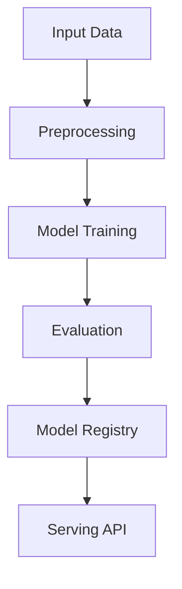

# anomaly-detection-pca

## ∫ Mathematics & Theory

Anomaly Detection / PCA — Underlying equations and derivations

$$X_{\text{centered}} = X - \bar{x}$$

$$\Sigma = \frac{1}{n} X_{\text{centered}}^T X_{\text{centered}}$$

$$\Sigma v = \lambda v$$

$$X_{\text{reduced}} = X_{\text{centered}} V_k$$

$$\text{recon error} = \|X - X_{\text{reconstructed}}\|^2$$

### Step-by-Step Derivation

PCA finds orthogonal directions of maximum variance. By computing the SVD of centered data $X = U\Sigma V^T$, the right singular vectors $V$ are the principal components. Anomalies are detected from large reconstruction error after projection.

### Interactive Visualization

Interactive 2D/3D PCA projection; explained variance scree plot; anomaly score distribution.

## ⚙ Architecture

Model structure, data flow, and layer breakdown

### Class Hierarchy

```
  PCAAnomalyDetector
```

### Data Flow



## ⚡ API Reference

FastAPI endpoints and model interfaces

| Method | Endpoint |
| --- | --- |
| `GET` | `/` |
| `GET` | `/health` |
| `GET` | `/metrics` |
| `POST` | `/reload` |

## ▶ Usage

Code examples and CLI commands

### Training Script

```python
"""Production training pipeline for PCA-based anomaly detection."""

import argparse
import os
from pathlib import Path

import numpy as np
from ai_core.logging import get_logger, setup_logging
from ai_core.model_registry import ModelRegistry
from ai_core.validation import DataValidator, create_anomaly_detection_schema

from anomaly_detection.data import load_training_data, save_training_data
from anomaly_detection.model import PCAAnomalyDetector

logger = get_logger(__name__)

def train(
    model_dir: Path,
    data_path: Path,
    n_components: int | float,
    threshold_method: str,
    threshold_percentile: float,
    threshold_iqr_multiplier: float,
    model_version: str,
    register_to_mlflow: bool = False,
    random_seed: int = 42,
) -> dict:
    """Train the PCA anomaly detection model and save artifacts.

    Args:
        model_dir: Directory to save model artifacts
        data_path: Optional path to CSV data
        n_components: Number of PCA components or variance ratio to retain
        threshold_method: Method for anomaly threshold ("percentile", "iqr", "fixed")
        threshold_percentile: Percentile for threshold if method="percentile"
        threshold_iqr_multiplier: IQR multiplier if method="iqr"
        model_version: Model version string
        register_to_mlflow: Whether to register to MLflow
        random_seed: Random seed for reproducibility

    Returns:
        Dictionary with training metrics
    """
    # Load training data
    X, y = load_training_data(data_path, random_seed=random_seed)
    logger.info("Loaded training data", n_samples=len(X), n_features=X.shape[1])

    # Validate training data
    validator = DataValidator(create_anomaly_detection_schema())
    validation = validator.validate(X)
    if not validation.valid:
        logger.error("Training data validation failed", errors=validation.errors)
        raise ValueError(f"Training data validation failed: {validation.errors}")
    logger.info("Training data validated", stats=validation.stats)

    # Save training data for reproducibility
    save_training_data(X, y, model_dir / "training_data.csv")

    # Use only normal samples for PCA training (unsupervised anomaly detection)
    X_normal = X[y == 0]
    logger.info("Training on normal samples", n_normal=len(X_normal), n_anomaly=int(np.sum(y)))

    # Train model
    model = PCAAnomalyDetector(
        n_components=n_components,
        threshold_method=threshold_method,
        threshold_percentile=threshold_percentile,
        threshold_iqr_multiplier=threshold_iqr_multiplier,
        random_seed=random_seed,
    )
    model.fit(X_normal)

    # Evaluate on all data
    metrics = model.evaluate(X, y)
    logger.info(
        "Training complete",
        n_components=model.n_components_selected,
        explained_variance=metrics["explained_variance_ratio"],
        threshold=model.threshold,
        mean_error=metrics["mean_reconstruction_error"],
        max_error=metrics["max_reconstruction_error"],
    )

    if "accuracy" in metrics:
        logger.info(
            "Evaluation metrics",
            accuracy=metrics["accuracy"],
            precision=metrics["precision"],
            recall=metrics["recall"],
            f1=metrics["f1"],
        )

    # Save model
    model_path = model_dir / f"anomaly_detection_model_v{model_version}.npz"
    model.save(str(model_path))

    # Save training chart
    _save_chart(model, X, y, model_dir, model_version)

    # Combined metrics for registry
    training_metrics = {
        "mean_reconstruction_error": metrics["mean_reconstruction_error"],
        "std_reconstruction_error": metrics["std_reconstruction_error"],
        "max_reconstruction_error": metrics["max_reconstruction_error"],
        "threshold": model.threshold,
        "n_components": float(model.n_components_selected),
        "explained_variance_ratio": metrics["explained_variance_ratio"],
        "n_samples": float(len(X)),
        "n_normal": float(len(X_normal)),
        "n_anomaly": float(int(np.sum(y))),
    }

    if "accuracy" in metrics:
        training_metrics.update(
            {
                "accuracy": metrics["accuracy"],
                "precision": metrics["precision"],
                "recall": metrics["recall"],
                "f1": metrics["f1"],
                "false_positive_rate": metrics["false_positive_rate"],
                "true_positives": metrics["true_positives"],
                "false_positives": metrics["false_positives"],
                "true_negatives": metrics["true_negatives"],
                "false_negatives": metrics["false_negatives"],
            }
        )

    # Register model
    registry = ModelRegistry(base_dir=model_dir)
    registry.save_model(
        model_name="anomaly-detection",
        model_version=model_version,
        model_type="anomaly_detection",
        metrics=training_metrics,
        parameters={
            "n_components": n_components,
            "threshold_method": threshold_method,
            "threshold_percentile": threshold_percentile,
            "threshold_iqr_multiplier": threshold_iqr_multiplier,
            "random_seed": random_seed,
        },
        artifacts={
            f"anomaly_detection_model_v{model_version}.npz": model_path,
            "training_data.csv": model_dir / "training_data.csv",
        },
        tags={"framework": "numpy", "task": "anomaly_detection", "method": "pca"},
    )

    if register_to_mlflow:
        registry.log_to_mlflow(
            model_name="anomaly-detection",
            model_version=model_version,
            metrics=training_metrics,
            params={
                "n_components": n_components,
                "threshold_method": threshold_method,
                "threshold_percentile": threshold_percentile,
                "threshold_iqr_multiplier": threshold_iqr_multiplier,
                "random_seed": random_seed,
            },
            artifacts={
                "model": str(model_path),
                "chart": str(model_dir / f"anomaly_detection_v{model_version}.png"),
                "training_data": str(model_dir / "training_data.csv"),
            },
            tags={"model_type": "anomaly_detection", "framework": "numpy", "method": "pca"},
        )
        logger.info("Registered model to MLflow", model="anomaly-detection", version=model_version)

    return training_metrics

def _save_chart(
    model: PCAAnomalyDetector,
    X: np.ndarray,
    y: np.ndarray,
    output_dir: Path,
    version: str,
) -> None:
    """Save the anomaly detection visualization chart."""
    import matplotlib

    matplotlib.use("Agg")
    import matplotlib.pyplot as plt

    if model.components is None:
        return

    # Project data to 2D using first 2 principal components
    projected = model.transform(X)
    errors = model.reconstruction_error(X)

    fig, axes = plt.subplots(1, 2, figsize=(14, 6))

    # Plot 1: PCA projection colored by anomaly
    ax1 = axes[0]
    normal_mask = y == 0
    anomaly_mask = y == 1

    ax1.scatter(
        projected[normal_mask, 0],
        projected[normal_mask, 1],
        c="steelblue",
        s=30,
        alpha=0.5,
        label="Normal",
    )
    ax1.scatter(
        projected[anomaly_mask, 0],
        projected[anomaly_mask, 1],
        c="crimson",
        s=50,
        alpha=0.8,
        marker="x",
        label="Anomaly",
    )
    ax1.set_xlabel(f"PC1 ({model.explained_variance_ratio[0]:.1%} variance)")
    ax1.set_ylabel(f"PC2 ({model.explained_variance_ratio[1]:.1%} variance)")
    ax1.set_title(f"PCA Projection - v{version}")
    ax1.grid(True, alpha=0.3)
    ax1.legend()

    # Plot 2: Reconstruction error histogram with threshold
    ax2 = axes[1]
    ax2.hist(
        errors[normal_mask],
        bins=50,
        alpha=0.6,
        label="Normal",
        color="steelblue",
        density=True,
    )
    ax2.hist(
        errors[anomaly_mask],
        bins=50,
        alpha=0.6,
        label="Anomaly",
        color="crimson",
        density=True,
    )
    ax2.axvline(
        model.threshold,
        color="black",
        linestyle="--",
        linewidth=2,
        label=f"Threshold ({model.threshold:.2f})",
    )
    ax2.set_xlabel("Reconstruction Error")
    ax2.set_ylabel("Density")
    ax2.set_title(f"Reconstruction Error Distribution - v{version}")
    ax2.grid(True, alpha=0.3)
    ax2.legend()

    plt.tight_layout()
    chart_path = output_dir / f"anomaly_detection_v{version}.png"
    plt.savefig(str(chart_path), dpi=100)
    plt.close()
    logger.info("Chart saved", path=str(chart_path))

def main():
    parser = argparse.ArgumentParser(description="Train PCA anomaly detection model")
    parser.add_argument("--model-dir", type=Path, default=Path(os.getenv("MODEL_DIR", "/models")))
    parser.add_argument("--data-path", type=Path, default=None)
    parser.add_argument("--n-components", type=str, default=os.getenv("N_COMPONENTS", "0.95"))
    parser.add_argument(
        "--threshold-method", type=str, default=os.getenv("THRESHOLD_METHOD", "percentile")
    )
    parser.add_argument(
        "--threshold-percentile", type=float, default=float(os.getenv("THRESHOLD_PERCENTILE", "95"))
    )
    parser.add_argument(
        "--threshold-iqr-multiplier",
        type=float,
        default=float(os.getenv("THRESHOLD_IQR_MULTIPLIER", "1.5")),
    )
    parser.add_argument("--model-version", type=str, default=os.getenv("MODEL_VERSION", "1.0.0"))
    parser.add_argument("--random-seed", type=int, default=int(os.getenv("RANDOM_SEED", "42")))
    parser.add_argument(
        "--register-mlflow",
        action="store_true",
        default=os.getenv("REGISTER_MLFLOW", "false").lower() == "true",
    )
    parser.add_argument("--log-level", type=str, default=os.getenv("LOG_LEVEL", "INFO"))
    args = parser.parse_args()

    # Parse n_components (could be int or float)
    n_components: int | float
    try:
        n_components = int(args.n_components)
    except ValueError:
        n_components = float(args.n_components)

    setup_logging(args.log_level)
    args.model_dir.mkdir(parents=True, exist_ok=True)

    metrics = train(
        model_dir=args.model_dir,
        data_path=args.data_path,
        n_components=n_components,
        threshold_method=args.threshold_method,
        threshold_percentile=args.threshold_percentile,
        threshold_iqr_multiplier=args.threshold_iqr_multiplier,
        model_version=args.model_version,
        register_to_mlflow=args.register_mlflow,
        random_seed=args.random_seed,
    )

    logger.info("Training finished", metrics=metrics, model_dir=str(args.model_dir))

if __name__ == "__main__":
    main()
```

### API Server

```python
"""Production serving API for PCA-based anomaly detection."""

import os
import time
from contextlib import asynccontextmanager
from pathlib import Path

import numpy as np
from ai_core.drift import DriftDetector
from ai_core.fastapi_middleware import add_observability_middleware
from ai_core.logging import get_logger, setup_logging
from ai_core.metrics import MetricsCollector
from ai_core.model_registry import ModelRegistry
from ai_core.validation import DataValidator, create_anomaly_detection_schema
from fastapi import FastAPI, HTTPException, Response
from pydantic import BaseModel, Field

from anomaly_detection.data import FEATURE_NAMES
from anomaly_detection.model import PCAAnomalyDetector

logger = get_logger(__name__)

# Configuration
MODEL_DIR = Path(os.getenv("MODEL_DIR", "/models"))
MODEL_VERSION = os.getenv("MODEL_VERSION", "latest")
METRICS_PORT = int(os.getenv("METRICS_PORT", os.getenv("ANOMALY_METRICS_PORT", "8005")))
DRIFT_THRESHOLD = float(os.getenv("DRIFT_THRESHOLD", "0.2"))

class MetricsRequest(BaseModel):
    """Single metrics observation for anomaly detection."""

    request_count: float = Field(..., ge=0, description="Number of requests")
    bytes_per_request: float = Field(..., ge=0, description="Average bytes per request")
    cpu_usage: float = Field(..., ge=0, le=100, description="CPU usage percentage")
    memory_usage: float = Field(..., ge=0, le=100, description="Memory usage percentage")
    disk_io: float = Field(..., ge=0, description="Disk I/O operations per second")
    network_in: float = Field(..., ge=0, description="Network inbound MB/s")
    network_out: float = Field(..., ge=0, description="Network outbound MB/s")
    error_rate: float = Field(..., ge=0, le=100, description="Error rate percentage")
    connection_count: float = Field(..., ge=0, description="Active connections")
    response_time: float = Field(..., ge=0, description="Average response time in ms")

class MetricsBulkRequest(BaseModel):
    """Bulk metrics request for anomaly detection."""

    samples: list[MetricsRequest] = Field(..., min_length=1, max_length=100)

class AnomalyResponse(BaseModel):
    """Anomaly detection response for a single observation."""

    is_anomaly: bool
    anomaly_score: float
    anomaly_probability: float
    reconstruction_error: float
    anomaly_threshold: float
    model_version: str

class BulkAnomalyResponse(BaseModel):
    """Bulk anomaly detection response."""

    samples: list[AnomalyResponse]
    n_anomalies: int
    n_samples: int
    model_version: str

class StatsResponse(BaseModel):
    """Model statistics response."""

    n_features: int
    n_components: int
    explained_variance_ratio: float
    reconstruction_threshold: float
    threshold_method: str
    mean_reconstruction_error: float
    max_reconstruction_error: float
    model_version: str

class ModelInfoResponse(BaseModel):
    """Model information response."""

    n_components: int
    n_features: int
    feature_names: list[str]
    cumulative_variance_ratio: float
    reconstruction_threshold: float
    model_version: str

class DriftResponse(BaseModel):
    """Drift detection response."""

    total_features: int
    drifted_features: int
    drift_ratio: float
    drifted: list[dict]
    all_results: list[dict]

# Global model state
_model: PCAAnomalyDetector | None = None
_model_version: str = "unknown"
_metrics: MetricsCollector | None = None
_validator: DataValidator | None = None
_drift_detector: DriftDetector | None = None
_reference_data: np.ndarray | None = None
_recent_predictions: list[list[float]] = []

@asynccontextmanager
async def lifespan(app: FastAPI):
    """Load model at startup and clean up at shutdown."""
    global _model, _model_version, _metrics, _validator, _drift_detector, _reference_data

    setup_logging(os.getenv("LOG_LEVEL", "INFO"))
    _metrics = MetricsCollector("anomaly_detection", port=METRICS_PORT)
    app.state.metrics = _metrics

    _validator = DataValidator(create_anomaly_detection_schema())
    _drift_detector = DriftDetector(
        feature_names=FEATURE_NAMES,
        feature_types={f: "float" for f in FEATURE_NAMES},
        psi_threshold=DRIFT_THRESHOLD,
    )

    _model, _model_version = _load_model()
    _metrics.set_model_version(_model_version)
    _metrics.set_model_info(
        model_name="anomaly-detection", model_version=_model_version, model_type="anomaly_detection"
    )

    # Load reference data for drift detection
    _reference_data = _load_reference_data()
    logger.info("Model loaded", model="anomaly-detection", version=_model_version)

    yield

    logger.info("Shutting down anomaly-detection API")

def _load_model() -> tuple[PCAAnomalyDetector, str]:
    """Load the latest model from the registry or model directory with resilient fallback."""
    # 1. Try model registry
    registry = ModelRegistry(base_dir=MODEL_DIR)
    try:
        if MODEL_VERSION == "latest":
            models = registry.list_models()
            ad_models = [m for m in models if m.get("model_name") == "anomaly-detection"]
            if ad_models:
                ad_models.sort(key=lambda m: m["model_version"], reverse=True)
                latest = ad_models[0]
                model_dir = Path(latest["artifact_path"])
                npz_files = list(model_dir.glob("anomaly_detection_model_*.npz")) + list(
                    model_dir.glob("*.npz")
                )
                if npz_files:
                    return PCAAnomalyDetector.load(str(npz_files[0])), latest["model_version"]
        else:
            model_dir = MODEL_DIR / "anomaly-detection" / MODEL_VERSION
            if model_dir.exists():
                npz_files = list(model_dir.glob("anomaly_detection_model_*.npz")) + list(
                    model_dir.glob("*.npz")
                )
                if npz_files:
                    return PCAAnomalyDetector.load(str(npz_files[0])), MODEL_VERSION
    except Exception as e:
        logger.warning(f"Registry lookup failed: {e}")

    # 2. Try direct model in MODEL_DIR
    npz_path = MODEL_DIR / "anomaly_detection_model.npz"
    if npz_path.exists():
        return PCAAnomalyDetector.load(str(npz_path)), "legacy"

    # 3. Try bundled artifacts directory
    candidate_paths = [
        Path("/app/artifacts/models/anomaly_detection_model_v1.0.0.npz"),
        Path(__file__).resolve().parents[3]
        / "artifacts"
        / "models"
        / "anomaly_detection_model_v1.0.0.npz",
    ]
    for p in candidate_paths:
        if p.exists():
            logger.info("Loading bundled baseline model", path=str(p))
            return PCAAnomalyDetector.load(str(p)), "1.0.0-bundled"

    # 4. In-memory baseline fallback (never crash cold start)
    logger.warning("No pre-existing model found on disk. Initializing baseline PCA model.")
    from anomaly_detection.data import load_training_data

    X_base, y_base = load_training_data(None)
    X_normal = X_base[y_base == 0]
    model = PCAAnomalyDetector(n_components=0.95, threshold_method="percentile", random_seed=42)
    model.fit(X_normal)
    return model, "1.0.0-baseline"

def _load_reference_data() -> np.ndarray | None:
    """Load reference training data for drift detection."""
    candidate_csvs = [
        MODEL_DIR / "anomaly-detection" / _model_version / "training_data.csv",
        MODEL_DIR / "training_data.csv",
        Path("/app/artifacts/models/training_data.csv"),
        Path(__file__).resolve().parents[3] / "artifacts" / "models" / "training_data.csv",
    ]
    for csv_path in candidate_csvs:
        if csv_path.exists():
            try:
                import pandas as pd

                df = pd.read_csv(csv_path)
                if all(f in df.columns for f in FEATURE_NAMES):
                    return df[FEATURE_NAMES].values
            except Exception as e:
                logger.warning("Could not read reference csv", path=str(csv_path), error=str(e))

    from anomaly_detection.data import load_training_data

    X_base, _ = load_training_data(None)
    return X_base

# Create FastAPI app
app = FastAPI(
    title="Anomaly Detection API",
    description="PCA-based anomaly detection using dimensionality reduction",
    version="1.0.0",
    lifespan=lifespan,
)

# Add observability middleware
add_observability_middleware(app)

@app.get("/")
def read_root():
    """Service information."""
    return {
        "service": "anomaly-detection-api",
        "version": "1.0.0",
        "model_version": _model_version,
        "features": FEATURE_NAMES,
        "endpoints": {
            "health": "/health",
            "predict": "POST /predict",
            "predict_bulk": "POST /predict/bulk",
            "stats": "GET /stats",
            "model_info": "GET /model/info",
            "drift": "GET /drift",
            "metrics": "/metrics",
        },
    }

@app.get("/health")
def health_check():
    """Kubernetes liveness/readiness probe."""
    if _model is None:
        raise HTTPException(status_code=503, detail="Model not loaded")
    return {
        "status": "healthy",
        "model_loaded": True,
        "model_version": _model_version,
    }

@app.get("/metrics")
def metrics():
    """Prometheus metrics endpoint."""
    from prometheus_client import CONTENT_TYPE_LATEST, generate_latest

    return Response(content=generate_latest(), media_type=CONTENT_TYPE_LATEST)

@app.post("/reload")
def reload_model():
    """Dynamically reload the model from disk/registry."""
    global _model, _model_version, _reference_data
    try:
        _model, _model_version = _load_model()
        if _metrics:
            _metrics.set_model_version(_model_version)
            _metrics.set_model_info(
                model_name="anomaly-detection",
                model_version=_model_version,
                model_type="anomaly_detection",
            )
        _reference_data = _load_reference_data()
        logger.info("Model reloaded dynamically", model="anomaly-detection", version=_model_version)
        return {"status": "reloaded", "model_version": _model_version}
    except Exception as e:
        logger.exception("Model reload failed", error=str(e))
        raise HTTPException(status_code=500, detail=f"Reload failed: {e}") from e

@app.get("/drift", response_model=DriftResponse)
def drift_check():
    """Check for data drift between reference and recent predictions."""
    if _drift_detector is None or _reference_data is None:
        raise HTTPException(status_code=503, detail="Drift detection not available")

    if len(_recent_predictions) < 10:
        return DriftResponse(
            total_features=len(FEATURE_NAMES),
            drifted_features=0,
            drift_ratio=0.0,
            drifted=[],
            all_results=[],
        )

    current = np.array(_recent_predictions[-100:])
    results = _drift_detector.detect_drift(_reference_data, current)
    summary = _drift_detector.summarize(results)

    if _metrics:
        _metrics.set_drift_ratio(summary["drift_ratio"])

    return DriftResponse(**summary)

@app.get("/stats", response_model=StatsResponse)
def get_stats():
    """Return model statistics."""
    if _model is None:
        raise HTTPException(status_code=503, detail="Model not loaded")

    evr = _model.explained_variance_ratio

    return StatsResponse(
        n_features=_model.n_features,
        n_components=_model.n_components_selected,
        explained_variance_ratio=float(
            np.sum(evr[: _model.n_components_selected]) if evr is not None else 0.0
        ),
        reconstruction_threshold=round(_model.threshold, 4),
        threshold_method=_model.threshold_method,
        mean_reconstruction_error=float(
            np.mean(_model.reconstruction_error(_reference_data))
            if _reference_data is not None
            else 0.0
        ),
        max_reconstruction_error=float(
            np.max(_model.reconstruction_error(_reference_data))
            if _reference_data is not None
            else 0.0
        ),
        model_version=_model_version,
    )

@app.get("/model/info", response_model=ModelInfoResponse)
def get_model_info():
    """Return detailed model information."""
    if _model is None:
        raise HTTPException(status_code=503, detail="Model not loaded")

    return ModelInfoResponse(
        n_components=_model.n_components_selected,
        n_features=_model.n_features,
        feature_names=FEATURE_NAMES,
        cumulative_variance_ratio=_model.cumulative_variance_ratio,
        reconstruction_threshold=round(_model.threshold, 4),
        model_version=_model_version,
    )

def _compute_anomaly(observation: MetricsRequest) -> AnomalyResponse:
    """Core anomaly detection logic shared by all detection endpoints."""
    if _model is None or _metrics is None or _validator is None:
        raise HTTPException(status_code=503, detail="Model not loaded")

    # Validate input
    X = np.array(
        [
            [
                observation.request_count,
                observation.bytes_per_request,
                observation.cpu_usage,
                observation.memory_usage,
                observation.disk_io,
                observation.network_in,
                observation.network_out,
                observation.error_rate,
                observation.connection_count,
                observation.response_time,
            ]
        ]
    )
    validation = _validator.validate(X)
    if not validation.valid:
        raise HTTPException(status_code=422, detail=validation.errors)

    start = time.time()
    try:
        recon_error = float(_model.reconstruction_error(X)[0])
        is_anom = bool(_model.is_anomaly(X)[0])
        proba = float(_model.predict_proba(X)[0])
        duration = time.time() - start
        _metrics.record_prediction(model_version=_model_version, duration=duration)

        # Track for drift detection
        _recent_predictions.append(
            [
                observation.request_count,
                observation.bytes_per_request,
                observation.cpu_usage,
                observation.memory_usage,
                observation.disk_io,
                observation.network_in,
                observation.network_out,
                observation.error_rate,
                observation.connection_count,
                observation.response_time,
            ]
        )
        if len(_recent_predictions) > 1000:
            _recent_predictions.pop(0)

        return AnomalyResponse(
            is_anomaly=is_anom,
            anomaly_score=round(recon_error, 4),
            anomaly_probability=round(proba, 4),
            reconstruction_error=round(recon_error, 4),
            anomaly_threshold=round(_model.threshold, 4),
            model_version=_model_version,
        )
    except Exception as e:
        _metrics.record_error(model_version=_model_version, error_type="prediction")
        logger.exception("Anomaly detection failed", error=str(e))
        raise HTTPException(status_code=500, detail="Anomaly detection failed") from e

@app.post("/predict", response_model=AnomalyResponse)
def predict_anomaly(body: MetricsRequest):
    """Detect anomaly for a single metrics observation."""
    return _compute_anomaly(body)

@app.post("/predict/bulk", response_model=BulkAnomalyResponse)
def predict_anomaly_bulk(body: MetricsBulkRequest):
    """Detect anomalies for multiple metrics observations."""
    global _recent_predictions
    if _model is None or _metrics is None or _validator is None:
        raise HTTPException(status_code=503, detail="Model not loaded")

    X = np.array(
        [
            [
                obs.request_count,
                obs.bytes_per_request,
                obs.cpu_usage,
                obs.memory_usage,
                obs.disk_io,
                obs.network_in,
                obs.network_out,
                obs.error_rate,
                obs.connection_count,
                obs.response_time,
            ]
            for obs in body.samples
        ]
    )

    validation = _validator.validate(X)
    if not validation.valid:
        raise HTTPException(status_code=422, detail=validation.errors)

    start = time.time()
    try:
        recon_errors = _model.reconstruction_error(X)
        anomalies = _model.is_anomaly(X)
        probas = _model.predict_proba(X)
        duration = time.time() - start
        _metrics.record_prediction(model_version=_model_version, duration=duration)

        # Track for drift detection
        _recent_predictions.extend(X.tolist())
        if len(_recent_predictions) > 1000:
            _recent_predictions = _recent_predictions[-1000:]

        results = [
            AnomalyResponse(
                is_anomaly=bool(anom),
                anomaly_score=round(float(recon_error), 4),
                anomaly_probability=round(float(proba), 4),
                reconstruction_error=round(float(recon_error), 4),
                anomaly_threshold=round(_model.threshold, 4),
                model_version=_model_version,
            )
            for anom, proba, recon_error in zip(anomalies, probas, recon_errors, strict=False)
        ]

        n_anomalies = int(np.sum(anomalies))
        return BulkAnomalyResponse(
            samples=results,
            n_anomalies=n_anomalies,
            n_samples=len(results),
            model_version=_model_version,
        )
    except Exception as e:
        _metrics.record_error(model_version=_model_version, error_type="prediction")
        logger.exception("Bulk anomaly detection failed", error=str(e))
        raise HTTPException(status_code=500, detail="Bulk anomaly detection failed") from e
```

### CLI Commands

```bash
uv run python -m anomaly_detection_pca.train --model-dir ./artifacts/models
```

## 📊 Benchmarks

Test results and performance metrics

Run `pytest tests/test_models.py` and `pytest tests/test_apis.py` for detailed metrics.

### Related Apps

- [anomaly-detection-fraud](../anomaly-detection-fraud/README.md)

Generated documentation for **anomaly-detection-pca**
