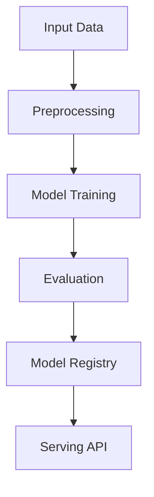

# market-segmentation

## ∫ Mathematics & Theory

Market Segmentation (K-Means) — Underlying equations and derivations

$$\min_S \sum_{i=1}^{k} \sum_{x \in S_i} \|x - \mu_i\|^2$$

$$\mu_i = \frac{1}{|S_i|} \sum_{x \in S_i} x$$

$$J = \sum_{i=1}^{n} \|x^{(i)} - \mu_{c^{(i)}}\|^2$$

### Step-by-Step Derivation

K-Means partitions data into $k$ clusters by minimizing within-cluster sum of squares. The Expectation-Maximization (EM) algorithm alternates between: (1) assigning each point to the nearest centroid, and (2) recomputing centroids as the mean of assigned points. Convergence is guaranteed but the solution depends on initialization.

### Interactive Visualization

Interactive elbow method plot; cluster visualization with centroids; silhouette score explorer.

## ⚙ Architecture

Model structure, data flow, and layer breakdown

### Class Hierarchy

```
  KMeans
```

### Data Flow



## ⚡ API Reference

FastAPI endpoints and model interfaces

| Method | Endpoint |
| --- | --- |
| `GET` | `/` |
| `GET` | `/health` |
| `GET` | `/metrics` |
| `POST` | `/reload` |

## ▶ Usage

Code examples and CLI commands

### Training Script

```python
"""Production training pipeline for market segmentation (unsupervised K-Means)."""

import argparse
import os
from pathlib import Path

import numpy as np
from ai_core.logging import get_logger, setup_logging
from ai_core.model_registry import ModelRegistry
from ai_core.validation import DataValidator, create_market_segmentation_schema

from market_segmentation.data import load_training_data, save_training_data
from market_segmentation.model import KMeans

logger = get_logger(__name__)

def train(
    model_dir: Path,
    data_path: Path,
    n_clusters: int,
    max_iterations: int,
    n_init: int,
    model_version: str,
    register_to_mlflow: bool = False,
    random_seed: int = 42,
) -> dict:
    """Train the market segmentation K-Means model and save artifacts.

    Returns:
        Dictionary with training metrics
    """
    # Load training data
    X, y = load_training_data(data_path)
    logger.info("Loaded training data", n_samples=len(X), n_features=X.shape[1])

    # Validate training data
    validator = DataValidator(create_market_segmentation_schema())
    validation = validator.validate(X)
    if not validation.valid:
        logger.error("Training data validation failed", errors=validation.errors)
        raise ValueError(f"Training data validation failed: {validation.errors}")
    logger.info("Training data validated", stats=validation.stats)

    # Save training data for reproducibility
    save_training_data(X, y, model_dir / "training_data.csv")

    # Train model
    model = KMeans(
        n_clusters=n_clusters,
        max_iterations=max_iterations,
        n_init=n_init,
        random_seed=random_seed,
    )
    model.fit(X)

    # Evaluate clustering quality
    metrics = model.evaluate(X)
    logger.info(
        "Training complete",
        n_clusters=model.n_clusters,
        inertia=model.inertia,
        silhouette=metrics["silhouette"],
        n_iterations_used=model.n_iterations_used,
    )

    # Model validation - check silhouette score
    if metrics["silhouette"] < 0.1:
        logger.warning(
            "Model silhouette score below threshold",
            silhouette=metrics["silhouette"],
            threshold=0.1,
        )

    # Save model
    model_path = model_dir / f"market_segmentation_model_v{model_version}.npz"
    model.save(str(model_path))

    # Save training chart
    _save_chart(model, X, model_dir, model_version)

    # Combined metrics for registry
    training_metrics = {
        "inertia": metrics["inertia"],
        "silhouette": metrics["silhouette"],
        "n_clusters": float(n_clusters),
        "n_samples": len(X),
        "n_iterations_used": float(model.n_iterations_used),
    }

    # Register model
    registry = ModelRegistry(base_dir=model_dir)
    registry.save_model(
        model_name="market-segmentation",
        model_version=model_version,
        model_type="clustering",
        metrics=training_metrics,
        parameters={
            "n_clusters": n_clusters,
            "max_iterations": max_iterations,
            "n_init": n_init,
            "random_seed": random_seed,
        },
        artifacts={
            f"market_segmentation_model_v{model_version}.npz": model_path,
            "training_data.csv": model_dir / "training_data.csv",
        },
        tags={"framework": "numpy", "task": "clustering"},
    )

    if register_to_mlflow:
        registry.log_to_mlflow(
            model_name="market-segmentation",
            model_version=model_version,
            metrics=training_metrics,
            params={
                "n_clusters": n_clusters,
                "max_iterations": max_iterations,
                "n_init": n_init,
                "random_seed": random_seed,
            },
            artifacts={
                "model": str(model_path),
                "chart": str(model_dir / f"market_segmentation_v{model_version}.png"),
                "training_data": str(model_dir / "training_data.csv"),
            },
            tags={"model_type": "clustering", "framework": "numpy"},
        )
        logger.info(
            "Registered model to MLflow", model="market-segmentation", version=model_version
        )

    return training_metrics

def _save_chart(model: KMeans, X: np.ndarray, output_dir: Path, version: str) -> None:
    """Save the clustering chart."""
    import matplotlib

    matplotlib.use("Agg")
    import matplotlib.pyplot as plt

    if model.centroids is None:
        return

    plt.figure(figsize=(10, 6))

    # Plot data points colored by cluster
    labels = model.predict(X)
    scatter = plt.scatter(
        X[:, 0],
        X[:, 1],
        c=labels,
        cmap="viridis",
        s=50,
        alpha=0.6,
        label="Customers",
    )

    # Plot centroids
    # Need to unstandardize centroids for plotting
    if model.feature_mean is not None and model.feature_std is not None:
        centroids_orig = model.centroids * model.feature_std + model.feature_mean
        plt.scatter(
            centroids_orig[:, 0],
            centroids_orig[:, 1],
            c="red",
            marker="X",
            s=200,
            edgecolors="black",
            linewidths=2,
            label="Centroids",
        )

    plt.colorbar(scatter, label="Cluster")
    plt.xlabel("Annual Income (k$)")
    plt.ylabel("Spending Score (0-100)")
    plt.title(f"Market Segmentation Clusters - v{version}")
    plt.grid(True, alpha=0.3)
    plt.legend()

    chart_path = output_dir / f"market_segmentation_v{version}.png"
    plt.tight_layout()
    plt.savefig(str(chart_path), dpi=100)
    plt.close()
    logger.info("Chart saved", path=str(chart_path))

def main():
    parser = argparse.ArgumentParser(description="Train market segmentation K-Means model")
    parser.add_argument("--model-dir", type=Path, default=Path(os.getenv("MODEL_DIR", "/models")))
    parser.add_argument("--data-path", type=Path, default=None)
    parser.add_argument("--n-clusters", type=int, default=int(os.getenv("N_CLUSTERS", "5")))
    parser.add_argument(
        "--max-iterations", type=int, default=int(os.getenv("MAX_ITERATIONS", "300"))
    )
    parser.add_argument("--n-init", type=int, default=int(os.getenv("N_INIT", "10")))
    parser.add_argument("--model-version", type=str, default=os.getenv("MODEL_VERSION", "1.0.0"))
    parser.add_argument("--random-seed", type=int, default=int(os.getenv("RANDOM_SEED", "42")))
    parser.add_argument(
        "--register-mlflow",
        action="store_true",
        default=os.getenv("REGISTER_MLFLOW", "false").lower() == "true",
    )
    parser.add_argument("--log-level", type=str, default=os.getenv("LOG_LEVEL", "INFO"))
    args = parser.parse_args()

    setup_logging(args.log_level)
    args.model_dir.mkdir(parents=True, exist_ok=True)

    metrics = train(
        model_dir=args.model_dir,
        data_path=args.data_path,
        n_clusters=args.n_clusters,
        max_iterations=args.max_iterations,
        n_init=args.n_init,
        model_version=args.model_version,
        register_to_mlflow=args.register_mlflow,
        random_seed=args.random_seed,
    )

    logger.info("Training finished", metrics=metrics, model_dir=str(args.model_dir))

if __name__ == "__main__":
    main()
```

### API Server

```python
"""Production serving API for market segmentation (unsupervised K-Means)."""

import os
import time
from contextlib import asynccontextmanager
from pathlib import Path

import numpy as np
from ai_core.drift import DriftDetector
from ai_core.fastapi_middleware import add_observability_middleware
from ai_core.logging import get_logger, setup_logging
from ai_core.metrics import MetricsCollector
from ai_core.model_registry import ModelRegistry
from ai_core.validation import DataValidator, create_market_segmentation_schema
from fastapi import FastAPI, HTTPException, Response
from pydantic import BaseModel, Field

from market_segmentation.data import FEATURE_NAMES
from market_segmentation.model import KMeans

logger = get_logger(__name__)

# Configuration
MODEL_DIR = Path(os.getenv("MODEL_DIR", "/models"))
MODEL_VERSION = os.getenv("MODEL_VERSION", "latest")
METRICS_PORT = int(os.getenv("METRICS_PORT", os.getenv("MARKET_METRICS_PORT", "8003")))
DRIFT_THRESHOLD = float(os.getenv("DRIFT_THRESHOLD", "0.2"))

class SegmentRequest(BaseModel):
    """Single customer segmentation request."""

    annual_income: float = Field(
        ..., gt=0, le=200, description="Annual income in thousands of dollars"
    )
    spending_score: float = Field(..., ge=0, le=100, description="Spending score (0-100)")

class SegmentBulkRequest(BaseModel):
    """Bulk customer segmentation request."""

    customers: list[SegmentRequest] = Field(..., min_length=1, max_length=100)

class SegmentResponse(BaseModel):
    """Segmentation response for a single customer."""

    annual_income: float
    spending_score: float
    segment: int
    segment_name: str
    confidence: float
    model_version: str

class BulkSegmentResponse(BaseModel):
    """Bulk segmentation response."""

    segments: list[SegmentResponse]
    model_version: str

class ProfilesResponse(BaseModel):
    """Cluster profiles for business interpretation."""

    n_clusters: int
    profiles: list[dict]
    model_version: str

class DriftResponse(BaseModel):
    """Drift detection response."""

    total_features: int
    drifted_features: int
    drift_ratio: float
    drifted: list[dict]
    all_results: list[dict]

# Human-readable segment names (assigned by cluster index after training)
SEGMENT_NAMES = [
    "Premium Shoppers",
    "Cautious High-Earners",
    "Impulsive Shoppers",
    "Budget-Conscious",
    "Average Shoppers",
]

# Global model state
_model: KMeans | None = None
_model_version: str = "unknown"
_metrics: MetricsCollector | None = None
_validator: DataValidator | None = None
_drift_detector: DriftDetector | None = None
_reference_data: np.ndarray | None = None
_recent_predictions: list[list[float]] = []

@asynccontextmanager
async def lifespan(app: FastAPI):
    """Load model at startup and clean up at shutdown."""
    global _model, _model_version, _metrics, _validator, _drift_detector, _reference_data

    setup_logging(os.getenv("LOG_LEVEL", "INFO"))
    _metrics = MetricsCollector("market_segmentation", port=METRICS_PORT)
    app.state.metrics = _metrics

    _validator = DataValidator(create_market_segmentation_schema())
    _drift_detector = DriftDetector(
        feature_names=FEATURE_NAMES,
        feature_types={"annual_income": "float", "spending_score": "float"},
        psi_threshold=DRIFT_THRESHOLD,
    )

    _model, _model_version = _load_model()
    _metrics.set_model_version(_model_version)
    _metrics.set_model_info(
        model_name="market-segmentation", model_version=_model_version, model_type="clustering"
    )

    # Load reference data for drift detection
    _reference_data = _load_reference_data()
    logger.info("Model loaded", model="market-segmentation", version=_model_version)

    yield

    logger.info("Shutting down market-segmentation API")

def _load_model() -> tuple[KMeans, str]:
    """Load the latest model from the registry or model directory with resilient fallback."""
    # 1. Try model registry
    registry = ModelRegistry(base_dir=MODEL_DIR)
    try:
        if MODEL_VERSION == "latest":
            models = registry.list_models()
            seg_models = [m for m in models if m.get("model_name") == "market-segmentation"]
            if seg_models:
                seg_models.sort(key=lambda m: m["model_version"], reverse=True)
                latest = seg_models[0]
                model_dir = Path(latest["artifact_path"])
                npz_files = list(model_dir.glob("market_segmentation_model_*.npz")) + list(
                    model_dir.glob("*.npz")
                )
                if npz_files:
                    return KMeans.load(str(npz_files[0])), latest["model_version"]
        else:
            model_dir = MODEL_DIR / "market-segmentation" / MODEL_VERSION
            if model_dir.exists():
                npz_files = list(model_dir.glob("market_segmentation_model_*.npz")) + list(
                    model_dir.glob("*.npz")
                )
                if npz_files:
                    return KMeans.load(str(npz_files[0])), MODEL_VERSION
    except Exception as e:
        logger.warning(f"Registry lookup failed: {e}")

    # 2. Try direct model in MODEL_DIR
    npz_path = MODEL_DIR / "market_segmentation_model.npz"
    if npz_path.exists():
        return KMeans.load(str(npz_path)), "legacy"

    # 3. Try bundled artifacts directory
    candidate_paths = [
        Path("/app/artifacts/models/market_segmentation_model_v1.0.0.npz"),
        Path(__file__).resolve().parents[3]
        / "artifacts"
        / "models"
        / "market_segmentation_model_v1.0.0.npz",
    ]
    for p in candidate_paths:
        if p.exists():
            logger.info("Loading bundled baseline model", path=str(p))
            return KMeans.load(str(p)), "1.0.0-bundled"

    # 4. In-memory baseline fallback (never crash cold start)
    logger.warning("No pre-existing model found on disk. Initializing baseline K-Means model.")
    from market_segmentation.data import load_training_data

    X_base, _ = load_training_data(None)
    model = KMeans(n_clusters=5, max_iterations=300, n_init=10, random_seed=42)
    model.fit(X_base)
    return model, "1.0.0-baseline"

def _load_reference_data() -> np.ndarray | None:
    """Load reference training data for drift detection."""
    candidate_csvs = [
        MODEL_DIR / "market-segmentation" / _model_version / "training_data.csv",
        MODEL_DIR / "training_data.csv",
        Path("/app/artifacts/models/training_data.csv"),
        Path(__file__).resolve().parents[3] / "artifacts" / "models" / "training_data.csv",
    ]
    for csv_path in candidate_csvs:
        if csv_path.exists():
            try:
                import pandas as pd

                df = pd.read_csv(csv_path)
                if all(f in df.columns for f in FEATURE_NAMES):
                    return df[FEATURE_NAMES].values
            except Exception as e:
                logger.warning("Could not read reference csv", path=str(csv_path), error=str(e))

    from market_segmentation.data import load_training_data

    X_base, _ = load_training_data(None)
    return X_base

def _segment_name(segment: int) -> str:
    """Return a human-readable name for a segment index."""
    if 0 <= segment < len(SEGMENT_NAMES):
        return SEGMENT_NAMES[segment]
    return f"Segment {segment}"

# Create FastAPI app
app = FastAPI(
    title="Market Segmentation API",
    description="Unsupervised K-Means clustering for customer market segmentation",
    version="1.0.0",
    lifespan=lifespan,
)

# Add observability middleware
add_observability_middleware(app)

@app.get("/")
def read_root():
    """Service information."""
    return {
        "service": "market-segmentation-api",
        "version": "1.0.0",
        "model_version": _model_version,
        "features": FEATURE_NAMES,
        "endpoints": {
            "health": "/health",
            "segment": "POST /segment",
            "segment_bulk": "POST /segment/bulk",
            "profiles": "GET /profiles",
            "drift": "GET /drift",
            "metrics": "/metrics",
        },
    }

@app.get("/health")
def health_check():
    """Kubernetes liveness/readiness probe."""
    if _model is None:
        raise HTTPException(status_code=503, detail="Model not loaded")
    return {
        "status": "healthy",
        "model_loaded": True,
        "model_version": _model_version,
    }

@app.get("/metrics")
def metrics():
    """Prometheus metrics endpoint."""
    from prometheus_client import CONTENT_TYPE_LATEST, generate_latest

    return Response(content=generate_latest(), media_type=CONTENT_TYPE_LATEST)

@app.post("/reload")
def reload_model():
    """Dynamically reload the model from disk/registry."""
    global _model, _model_version, _reference_data
    try:
        _model, _model_version = _load_model()
        if _metrics:
            _metrics.set_model_version(_model_version)
            _metrics.set_model_info(
                model_name="market-segmentation",
                model_version=_model_version,
                model_type="clustering",
            )
        _reference_data = _load_reference_data()
        logger.info(
            "Model reloaded dynamically", model="market-segmentation", version=_model_version
        )
        return {"status": "reloaded", "model_version": _model_version}
    except Exception as e:
        logger.exception("Model reload failed", error=str(e))
        raise HTTPException(status_code=500, detail=f"Reload failed: {e}") from e

@app.get("/drift", response_model=DriftResponse)
def drift_check():
    """Check for data drift between reference and recent predictions."""
    if _drift_detector is None or _reference_data is None:
        raise HTTPException(status_code=503, detail="Drift detection not available")

    if len(_recent_predictions) < 10:
        return DriftResponse(
            total_features=len(FEATURE_NAMES),
            drifted_features=0,
            drift_ratio=0.0,
            drifted=[],
            all_results=[],
        )

    current = np.array(_recent_predictions[-100:])
    results = _drift_detector.detect_drift(_reference_data, current)
    summary = _drift_detector.summarize(results)

    if _metrics:
        _metrics.set_drift_ratio(summary["drift_ratio"])

    return DriftResponse(**summary)

@app.get("/profiles", response_model=ProfilesResponse)
def get_profiles():
    """Return cluster profiles for business interpretation."""
    if _model is None:
        raise HTTPException(status_code=503, detail="Model not loaded")

    # Recompute profiles from reference data
    profiles = _model.cluster_profiles(_reference_data) if _reference_data is not None else []

    return ProfilesResponse(
        n_clusters=_model.n_clusters,
        profiles=profiles,
        model_version=_model_version,
    )

def _compute_segment(customer: SegmentRequest) -> SegmentResponse:
    """Core segmentation logic shared by all segment endpoints."""
    if _model is None or _metrics is None or _validator is None:
        raise HTTPException(status_code=503, detail="Model not loaded")

    # Validate input
    X = np.array([[customer.annual_income, customer.spending_score]])
    validation = _validator.validate(X)
    if not validation.valid:
        raise HTTPException(status_code=422, detail=validation.errors)

    start = time.time()
    try:
        segment = int(_model.predict(X)[0])
        confidence = float(_model.predict_confidence(X)[0])
        duration = time.time() - start
        _metrics.record_prediction(model_version=_model_version, duration=duration)

        # Track for drift detection
        _recent_predictions.append([customer.annual_income, customer.spending_score])
        if len(_recent_predictions) > 1000:
            _recent_predictions.pop(0)

        return SegmentResponse(
            annual_income=customer.annual_income,
            spending_score=customer.spending_score,
            segment=segment,
            segment_name=_segment_name(segment),
            confidence=round(confidence, 4),
            model_version=_model_version,
        )
    except Exception as e:
        _metrics.record_error(model_version=_model_version, error_type="prediction")
        logger.exception("Segmentation failed", error=str(e))
        raise HTTPException(status_code=500, detail="Segmentation failed") from e

@app.post("/segment", response_model=SegmentResponse)
def segment_customer(body: SegmentRequest):
    """Segment a single customer."""
    return _compute_segment(body)

@app.post("/segment/bulk", response_model=BulkSegmentResponse)
def segment_bulk(body: SegmentBulkRequest):
    """Segment multiple customers."""
    global _recent_predictions
    if _model is None or _metrics is None or _validator is None:
        raise HTTPException(status_code=503, detail="Model not loaded")

    X = np.array([[c.annual_income, c.spending_score] for c in body.customers])
    validation = _validator.validate(X)
    if not validation.valid:
        raise HTTPException(status_code=422, detail=validation.errors)

    start = time.time()
    try:
        segments = _model.predict(X)
        confidences = _model.predict_confidence(X)
        duration = time.time() - start
        _metrics.record_prediction(model_version=_model_version, duration=duration)

        # Track for drift detection
        _recent_predictions.extend(X.tolist())
        if len(_recent_predictions) > 1000:
            _recent_predictions = _recent_predictions[-1000:]

        responses = [
            SegmentResponse(
                annual_income=c.annual_income,
                spending_score=c.spending_score,
                segment=int(seg),
                segment_name=_segment_name(int(seg)),
                confidence=round(float(conf), 4),
                model_version=_model_version,
            )
            for c, seg, conf in zip(body.customers, segments, confidences, strict=False)
        ]
        return BulkSegmentResponse(segments=responses, model_version=_model_version)
    except Exception as e:
        _metrics.record_error(model_version=_model_version, error_type="prediction")
        logger.exception("Bulk segmentation failed", error=str(e))
        raise HTTPException(status_code=500, detail="Bulk segmentation failed") from e
```

### CLI Commands

```bash
uv run python -m market_segmentation.train --model-dir ./artifacts/models
```

## 📊 Benchmarks

Test results and performance metrics

Run `pytest tests/test_models.py` and `pytest tests/test_apis.py` for detailed metrics.

### Related Apps

- [advanced-semantic-segmentation](../advanced-semantic-segmentation/README.md)

Generated documentation for **market-segmentation**
