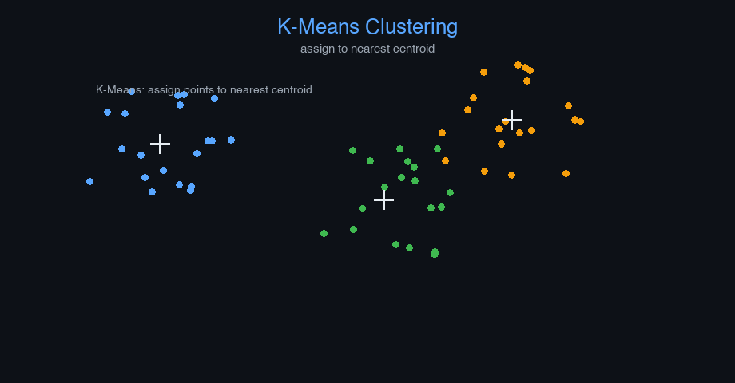

# market-segmentation


Market Segmentation (K-Means) — AI engineering example · part of the MLOps monorepo

## 1. Mathematical Foundations

This example is grounded in **Market Segmentation (K-Means)**. The equations below
drive every forward and backward pass in the implementation.

$$\min_S \sum_{i=1}^{k} \sum_{x \in S_i} \|x - \mu_i\|^2$$

$$\mu_i = \frac{1}{|S_i|} \sum_{x \in S_i} x$$

$$J = \sum_{i=1}^{n} \|x^{(i)} - \mu_{c^{(i)}}\|^2$$

### Derivation

K-Means partitions data into $k$ clusters by minimizing within-cluster sum of squares. The Expectation-Maximization (EM) algorithm alternates between: (1) assigning each point to the nearest centroid, and (2) recomputing centroids as the mean of assigned points. Convergence is guaranteed but the solution depends on initialization.

### Worked Numerical Example

$$z = w \cdot x + b$$

Illustrative forward-pass evaluation (scalar example):

Input  x        = 12.0   (e.g. pizza diameter, inches)
Weights w       =  0.85
Bias    b       =  0.30
---------------------------------
z = w*x + b
  = 0.85 * 12.0 + 0.30
  = 10.20 + 0.30
  = 10.50   <- model output

### Conceptual Diagram

        Core transformation flow
   [ Input x ] --> ( w · x + b ) --> [ Output z ]
                       |
                  [ activation ]
                       |
                  [ prediction ]



Interactive elbow method plot; cluster visualization with centroids; silhouette score explorer.

## 2. Core Logic & Architecture

The example follows a consistent **data → train → evaluate → serve**
pipeline. Inputs are loaded and validated, transformed by the core algorithm, scored against
held-out data, and exposed through a REST API.

  Raw dataset→
  load + validate (data.py)→
  fit / transform (model.py)→
  evaluate + persist (train.py)→
  serve (api.py)

### Primary Components

| Class | Public methods | Responsibility |
| --- | --- | --- |
| `SegmentRequest` | — | Single customer segmentation request. |
| `SegmentBulkRequest` | — | Bulk customer segmentation request. |
| `SegmentResponse` | — | Segmentation response for a single customer. |
| `BulkSegmentResponse` | — | Bulk segmentation response. |
| `ProfilesResponse` | — | Cluster profiles for business interpretation. |
| `DriftResponse` | — | Drift detection response. |
| `KMeans` | _standardize, _compute_distances, _fit_once, fit, predict, predict_confidence, cluster_profiles, evaluate, _compute_silhouette, save, load, to_dict | K-Means clustering for customer market segmentation.  Uses Lloyd's algorithm with multiple random initializations (n_init) and picks the run with the lowest inertia. |

### Data Flow


1. **Load** — `data.py` reads the source dataset and splits train/test.


2. **Validate** — a Pydantic schema guards input shape/dtypes before training.


3. **Fit / Transform** — `model.py` applies the mathematics from Section 1.


4. **Evaluate** — metrics (MSE/RMSE/R², accuracy, etc.) are computed and logged.


5. **Persist** — weights/artifacts are saved and registered in the model registry.


6. **Serve** — `api.py` exposes prediction endpoints with drift detection.

### Design Patterns & Performance

Key design choices in this module: a pure-NumPy implementation (no PyTorch/TensorFlow), schema validation via `ai_core.validation`, structured JSON logging through `ai_core.logging`, Prometheus metrics from `ai_core.metrics`, and MLflow/model-registry persistence via `ai_core.model_registry`. The FastAPI service wraps the trained model with observability middleware from `ai_core.fastapi_middleware`.

## 3. Detailed Code Walkthrough

The most important behaviour is summarised below; full source for each module is collapsible
so the page stays readable while remaining self-contained.

### `KMeans.fit(X)`

Train the K-Means model on the given data.

Args:
    X: array of shape (n_samples, n_features)

Returns:
    self

### `KMeans.predict(X)`

Assign each sample to the nearest cluster centroid.

Args:
    X: array of shape (n_samples, n_features)

Returns:
    Array of cluster indices with shape (n_samples,)

### `KMeans.evaluate(X)`

Compute unsupervised clustering evaluation metrics.

Args:
    X: array of shape (n_samples, n_features)

Returns:
    Dict with 'inertia', 'silhouette', and 'n_clusters'

### Source Files

<details>
<summary>model.py</summary>

```
"""K-Means clustering model for market segmentation.

Implements a production-ready K-Means clustering model with:
- Standard K-Means training with multiple initializations
- Feature standardization
- Confidence scoring based on distance to nearest centroid
- Proper serialization with metadata
- Cluster profiling for business interpretation
"""

from dataclasses import dataclass

import numpy as np

@dataclass
class KMeans:
    """K-Means clustering for customer market segmentation.

    Uses Lloyd's algorithm with multiple random initializations (n_init)
    and picks the run with the lowest inertia.
    """

    n_clusters: int = 5
    max_iterations: int = 300
    n_init: int = 10
    random_seed: int = 42
    centroids: np.ndarray | None = None
    labels: np.ndarray | None = None
    feature_mean: np.ndarray | None = None
    feature_std: np.ndarray | None = None
    inertia: float = 0.0
    n_iterations_used: int = 0

    def _standardize(self, X: np.ndarray) -> np.ndarray:
        """Standardize features to zero mean and unit variance."""
        if self.feature_mean is None or self.feature_std is None:
            raise ValueError("Model not trained. Call fit() first.")
        return (X - self.feature_mean) / (self.feature_std + 1e-8)

    def _compute_distances(self, X: np.ndarray, centroids: np.ndarray) -> np.ndarray:
        """Compute squared Euclidean distances from each point to each centroid."""
        # X: (n_samples, n_features), centroids: (n_clusters, n_features)
        # Returns: (n_samples, n_clusters)
        return np.sum((X[:, np.newaxis, :] - centroids[np.newaxis, :, :]) ** 2, axis=2)

    def _fit_once(
        self, X: np.ndarray, rng: np.random.Generator
    ) -> tuple[np.ndarray, np.ndarray, float, int]:
        """Run K-Means once with a single random initialization."""
        n_samples, n_features = X.shape

        # Random initialization: pick k random points as initial centroids
        indices = rng.choice(n_samples, size=self.n_clusters, replace=False)
        centroids = X[indices].copy()

        labels = np.zeros(n_samples, dtype=int)
        inertia = 0.0
        n_iter = 0

        for _ in range(self.max_iterations):
            n_iter += 1
            # Assign points to nearest centroid
            distances = self._compute_distances(X, centroids)
            new_labels = np.argmin(distances, axis=1)

            # Check convergence
            if np.array_equal(new_labels, labels):
                labels = new_labels
                break
            labels = new_labels

            # Update centroids
            new_centroids = centroids.copy()
            for k in range(self.n_clusters):
                mask = labels == k
                if np.any(mask):
                    new_centroids[k] = np.mean(X[mask], axis=0)

            # Check centroid convergence
            if np.allclose(new_centroids, centroids, atol=1e-6):
                centroids = new_centroids
                break
            centroids = new_centroids

        # Compute final inertia
        distances = self._compute_distances(X, centroids)
        min_distances = np.min(distances, axis=1)
        inertia = float(np.sum(min_distances))

        return centroids, labels, inertia, n_iter

    def fit(self, X: np.ndarray) -> "KMeans":
        """Train the K-Means model on the given data.

        Args:
            X: array of shape (n_samples, n_features)

        Returns:
            self
        """
        X = np.asarray(X, dtype=float)
        if X.ndim != 2:
            raise ValueError(f"Expected 2D array, got {X.ndim}D")

        # Compute feature statistics for standardization
        self.feature_mean = np.mean(X, axis=0)
        self.feature_std = np.std(X, axis=0)
        X_std = self._standardize(X)

        rng = np.random.default_rng(self.random_seed)

        best_centroids = None
        best_labels = None
        best_inertia = float("inf")
        best_n_iter = 0

        for _ in range(self.n_init):
            centroids, labels, inertia, n_iter = self._fit_once(X_std, rng)
            if inertia < best_inertia:
                best_centroids = centroids
                best_labels = labels
                best_inertia = inertia
                best_n_iter = n_iter

        self.centroids = best_centroids
        self.labels = best_labels
        self.inertia = best_inertia
        self.n_iterations_used = best_n_iter

        return self

    def predict(self, X: np.ndarray) -> np.ndarray:
        """Assign each sample to the nearest cluster centroid.

        Args:
            X: array of shape (n_samples, n_features)

        Returns:
            Array of cluster indices with shape (n_samples,)
        """
        if self.centroids is None:
            raise ValueError("Model not trained. Call fit() first.")

        X = np.asarray(X, dtype=float)
        if X.ndim == 1:
            X = X.reshape(1, -1)

        X_std = self._standardize(X)
        distances = self._compute_distances(X_std, self.centroids)
        return np.argmin(distances, axis=1)

    def predict_confidence(self, X: np.ndarray) -> np.ndarray:
        """Compute confidence scores for each prediction.

        Confidence is based on the relative distance to the nearest vs
        second-nearest centroid. A value of 1.0 means the point is very
        close to its assigned centroid relative to others.

        Args:
            X: array of shape (n_samples, n_features)

        Returns:
            Array of confidence scores in [0, 1] with shape (n_samples,)
        """
        if self.centroids is None:
            raise ValueError("Model not trained. Call fit() first.")

        X = np.asarray(X, dtype=float)
        if X.ndim == 1:
            X = X.reshape(1, -1)

        X_std = self._standardize(X)
        distances = self._compute_distances(X_std, self.centroids)

        # Sort distances to get nearest and second-nearest
        sorted_distances = np.sort(distances, axis=1)
        nearest = sorted_distances[:, 0]
        second_nearest = sorted_distances[:, 1]

        # Confidence: 1 - (nearest / second_nearest), clipped to [0, 1]
        # If second_nearest is 0 (duplicate points), confidence is 1.0
        with np.errstate(divide="ignore", invalid="ignore"):
            ratio = np.where(second_nearest > 0, nearest / second_nearest, 0.0)
        confidence = np.clip(1.0 - ratio, 0.0, 1.0)

        return confidence

    def cluster_profiles(self, X: np.ndarray) -> list[dict]:
        """Compute cluster profiles for business interpretation.

        Args:
            X: array of shape (n_samples, n_features) - typically reference data

        Returns:
            List of dicts with cluster statistics
        """
        if self.centroids is None:
            raise ValueError("Model not trained. Call fit() first.")

        X = np.asarray(X, dtype=float)
        labels = self.predict(X)

        profiles = []
        for k in range(self.n_clusters):
            mask = labels == k
            cluster_points = X[mask]
            n_members = int(np.sum(mask))

            if n_members > 0:
                profile = {
                    "cluster": k,
                    "n_members": n_members,
                    "percentage": round(float(n_members / len(X) * 100), 2),
                    "annual_income_mean": round(float(np.mean(cluster_points[:, 0])), 2),
                    "annual_income_std": round(float(np.std(cluster_points[:, 0])), 2),
                    "spending_score_mean": round(float(np.mean(cluster_points[:, 1])), 2),
                    "spending_score_std": round(float(np.std(cluster_points[:, 1])), 2),
                }
            else:
                profile = {
                    "cluster": k,
                    "n_members": 0,
                    "percentage": 0.0,
                    "annual_income_mean": 0.0,
                    "annual_income_std": 0.0,
                    "spending_score_mean": 0.0,
                    "spending_score_std": 0.0,
                }
            profiles.append(profile)

        return profiles

    def evaluate(self, X: np.ndarray) -> dict[str, float]:
        """Compute unsupervised clustering evaluation metrics.

        Args:
            X: array of shape (n_samples, n_features)

        Returns:
            Dict with 'inertia', 'silhouette', and 'n_clusters'
        """
        if self.centroids is None:
            raise ValueError("Model not trained. Call fit() first.")

        X = np.asarray(X, dtype=float)
        labels = self.predict(X)

        # Inertia (within-cluster sum of squares)
        X_std = self._standardize(X)
        distances = self._compute_distances(X_std, self.centroids)
        min_distances = np.min(distances, axis=1)
        inertia = float(np.sum(min_distances))

        # Silhouette score (simplified computation)
        silhouette = self._compute_silhouette(X_std, labels)

        return {
            "inertia": inertia,
            "silhouette": silhouette,
            "n_clusters": float(self.n_clusters),
        }

    def _compute_silhouette(self, X_std: np.ndarray, labels: np.ndarray) -> float:
        """Compute the average silhouette score."""
        n_samples = len(X_std)
        if n_samples < 2 or self.n_clusters < 2:
            return 0.0

        # Compute pairwise distances
        # For efficiency, use a simplified approach with cluster centroids
        silhouette_sum = 0.0
        n_valid = 0

        for i in range(n_samples):
            label = labels[i]
            point = X_std[i]

            # Compute mean distance to own cluster (a)
            own_mask = labels == label
            if np.sum(own_mask) <= 1:
                continue  # Singleton cluster
            own_points = X_std[own_mask]
            a = np.mean(np.sqrt(np.sum((own_points - point) ** 2, axis=1)))

            # Compute mean distance to nearest other cluster (b)
            b = float("inf")
            for k in range(self.n_clusters):
                if k == label:
                    continue
                other_mask = labels == k
                if np.sum(other_mask) == 0:
                    continue
                other_points = X_std[other_mask]
                dist = np.mean(np.sqrt(np.sum((other_points - point) ** 2, axis=1)))
                b = min(b, dist)

            if b == float("inf"):
                continue

            # Silhouette for this point
            s = (b - a) / max(a, b)
            silhouette_sum += s
            n_valid += 1

        if n_valid == 0:
            return 0.0

        return float(silhouette_sum / n_valid)

    # ---------- Serialization ----------

    def save(self, path: str) -> None:
        """Save model parameters to disk."""
        if self.centroids is None:
            raise ValueError("Cannot save untrained model")

        np.savez(
            path,
            centroids=self.centroids,
            feature_mean=self.feature_mean,
            feature_std=self.feature_std,
            n_clusters=self.n_clusters,
            max_iterations=self.max_iterations,
            n_init=self.n_init,
            random_seed=self.random_seed,
            inertia=self.inertia,
            n_iterations_used=self.n_iterations_used,
        )

    @classmethod
    def load(cls, path: str) -> "KMeans":
        """Load model parameters from disk."""
        data = np.load(path)
        model = cls(
            n_clusters=int(data["n_clusters"]),
            max_iterations=int(data["max_iterations"]),
            n_init=int(data["n_init"]),
            random_seed=int(data["random_seed"]),
        )
        model.centroids = data["centroids"]
        model.feature_mean = data["feature_mean"]
        model.feature_std = data["feature_std"]
        model.inertia = float(data["inertia"])
        model.n_iterations_used = int(data["n_iterations_used"])
        return model

    def to_dict(self) -> dict:
        """Return model parameters as a dict."""
        return {
            "n_clusters": self.n_clusters,
            "max_iterations": self.max_iterations,
            "n_init": self.n_init,
            "random_seed": self.random_seed,
            "inertia": self.inertia,
            "n_iterations_used": self.n_iterations_used,
        }
```

</details>

<details>
<summary>train.py</summary>

```
"""Production training pipeline for market segmentation (unsupervised K-Means)."""

import argparse
import os
from pathlib import Path

import numpy as np
from ai_core.logging import get_logger, setup_logging
from ai_core.model_registry import ModelRegistry
from ai_core.validation import DataValidator, create_market_segmentation_schema

from market_segmentation.data import load_training_data, save_training_data
from market_segmentation.model import KMeans

logger = get_logger(__name__)

def train(
    model_dir: Path,
    data_path: Path,
    n_clusters: int,
    max_iterations: int,
    n_init: int,
    model_version: str,
    register_to_mlflow: bool = False,
    random_seed: int = 42,
) -> dict:
    """Train the market segmentation K-Means model and save artifacts.

    Returns:
        Dictionary with training metrics
    """
    # Load training data
    X, y = load_training_data(data_path)
    logger.info("Loaded training data", n_samples=len(X), n_features=X.shape[1])

    # Validate training data
    validator = DataValidator(create_market_segmentation_schema())
    validation = validator.validate(X)
    if not validation.valid:
        logger.error("Training data validation failed", errors=validation.errors)
        raise ValueError(f"Training data validation failed: {validation.errors}")
    logger.info("Training data validated", stats=validation.stats)

    # Save training data for reproducibility
    save_training_data(X, y, model_dir / "training_data.csv")

    # Train model
    model = KMeans(
        n_clusters=n_clusters,
        max_iterations=max_iterations,
        n_init=n_init,
        random_seed=random_seed,
    )
    model.fit(X)

    # Evaluate clustering quality
    metrics = model.evaluate(X)
    logger.info(
        "Training complete",
        n_clusters=model.n_clusters,
        inertia=model.inertia,
        silhouette=metrics["silhouette"],
        n_iterations_used=model.n_iterations_used,
    )

    # Model validation - check silhouette score
    if metrics["silhouette"] < 0.1:
        logger.warning(
            "Model silhouette score below threshold",
            silhouette=metrics["silhouette"],
            threshold=0.1,
        )

    # Save model
    model_path = model_dir / f"market_segmentation_model_v{model_version}.npz"
    model.save(str(model_path))

    # Save training chart
    _save_chart(model, X, model_dir, model_version)

    # Combined metrics for registry
    training_metrics = {
        "inertia": metrics["inertia"],
        "silhouette": metrics["silhouette"],
        "n_clusters": float(n_clusters),
        "n_samples": len(X),
        "n_iterations_used": float(model.n_iterations_used),
    }

    # Register model
    registry = ModelRegistry(base_dir=model_dir)
    registry.save_model(
        model_name="market-segmentation",
        model_version=model_version,
        model_type="clustering",
        metrics=training_metrics,
        parameters={
            "n_clusters": n_clusters,
            "max_iterations": max_iterations,
            "n_init": n_init,
            "random_seed": random_seed,
        },
        artifacts={
            f"market_segmentation_model_v{model_version}.npz": model_path,
            "training_data.csv": model_dir / "training_data.csv",
        },
        tags={"framework": "numpy", "task": "clustering"},
    )

    if register_to_mlflow:
        registry.log_to_mlflow(
            model_name="market-segmentation",
            model_version=model_version,
            metrics=training_metrics,
            params={
                "n_clusters": n_clusters,
                "max_iterations": max_iterations,
                "n_init": n_init,
                "random_seed": random_seed,
            },
            artifacts={
                "model": str(model_path),
                "chart": str(model_dir / f"market_segmentation_v{model_version}.png"),
                "training_data": str(model_dir / "training_data.csv"),
            },
            tags={"model_type": "clustering", "framework": "numpy"},
        )
        logger.info(
            "Registered model to MLflow", model="market-segmentation", version=model_version
        )

    return training_metrics

def _save_chart(model: KMeans, X: np.ndarray, output_dir: Path, version: str) -> None:
    """Save the clustering chart."""
    import matplotlib

    matplotlib.use("Agg")
    import matplotlib.pyplot as plt

    if model.centroids is None:
        return

    plt.figure(figsize=(10, 6))

    # Plot data points colored by cluster
    labels = model.predict(X)
    scatter = plt.scatter(
        X[:, 0],
        X[:, 1],
        c=labels,
        cmap="viridis",
        s=50,
        alpha=0.6,
        label="Customers",
    )

    # Plot centroids
    # Need to unstandardize centroids for plotting
    if model.feature_mean is not None and model.feature_std is not None:
        centroids_orig = model.centroids * model.feature_std + model.feature_mean
        plt.scatter(
            centroids_orig[:, 0],
            centroids_orig[:, 1],
            c="red",
            marker="X",
            s=200,
            edgecolors="black",
            linewidths=2,
            label="Centroids",
        )

    plt.colorbar(scatter, label="Cluster")
    plt.xlabel("Annual Income (k$)")
    plt.ylabel("Spending Score (0-100)")
    plt.title(f"Market Segmentation Clusters - v{version}")
    plt.grid(True, alpha=0.3)
    plt.legend()

    chart_path = output_dir / f"market_segmentation_v{version}.png"
    plt.tight_layout()
    plt.savefig(str(chart_path), dpi=100)
    plt.close()
    logger.info("Chart saved", path=str(chart_path))

def main():
    parser = argparse.ArgumentParser(description="Train market segmentation K-Means model")
    parser.add_argument("--model-dir", type=Path, default=Path(os.getenv("MODEL_DIR", "/models")))
    parser.add_argument("--data-path", type=Path, default=None)
    parser.add_argument("--n-clusters", type=int, default=int(os.getenv("N_CLUSTERS", "5")))
    parser.add_argument(
        "--max-iterations", type=int, default=int(os.getenv("MAX_ITERATIONS", "300"))
    )
    parser.add_argument("--n-init", type=int, default=int(os.getenv("N_INIT", "10")))
    parser.add_argument("--model-version", type=str, default=os.getenv("MODEL_VERSION", "1.0.0"))
    parser.add_argument("--random-seed", type=int, default=int(os.getenv("RANDOM_SEED", "42")))
    parser.add_argument(
        "--register-mlflow",
        action="store_true",
        default=os.getenv("REGISTER_MLFLOW", "false").lower() == "true",
    )
    parser.add_argument("--log-level", type=str, default=os.getenv("LOG_LEVEL", "INFO"))
    args = parser.parse_args()

    setup_logging(args.log_level)
    args.model_dir.mkdir(parents=True, exist_ok=True)

    metrics = train(
        model_dir=args.model_dir,
        data_path=args.data_path,
        n_clusters=args.n_clusters,
        max_iterations=args.max_iterations,
        n_init=args.n_init,
        model_version=args.model_version,
        register_to_mlflow=args.register_mlflow,
        random_seed=args.random_seed,
    )

    logger.info("Training finished", metrics=metrics, model_dir=str(args.model_dir))

if __name__ == "__main__":
    main()
```

</details>

<details>
<summary>data.py</summary>

```
"""Data loading and preprocessing for market segmentation.

Generates a realistic synthetic customer dataset with distinct behavioural
segments, designed for unsupervised K-Means clustering:

Segments:
  1. Premium Shoppers    - high income, high spending
  2. Cautious High-Earners - high income, low spending
  3. Impulsive Shoppers  - low income, high spending
  4. Budget-Conscious    - low income, low spending
  5. Average Shoppers    - medium income, medium spending
"""

from pathlib import Path

import numpy as np
import pandas as pd

# Feature order MUST match what was used during training
FEATURE_NAMES = ["annual_income", "spending_score"]

# Number of synthetic customers generated when no CSV is provided
DEFAULT_N_SAMPLES = 500

def _generate_customer_data(
    n_samples: int = DEFAULT_N_SAMPLES,
    random_seed: int = 42,
) -> tuple[np.ndarray, np.ndarray]:
    """Generate synthetic customer data with 5 distinct segments.

    Returns:
        X: array of shape (n_samples, 2) - [annual_income(k$), spending_score(0-100)]
        true_labels: ground-truth segment assignment for evaluation
    """
    rng = np.random.default_rng(random_seed)

    # Define the 5 segment centers (annual_income, spending_score)
    segments = [
        {"center": [70, 85], "std": [6.0, 7.0], "weight": 0.20},  # Premium Shoppers
        {"center": [80, 25], "std": [7.0, 7.0], "weight": 0.20},  # Cautious High-Earners
        {"center": [35, 80], "std": [7.0, 7.0], "weight": 0.20},  # Impulsive Shoppers
        {"center": [30, 30], "std": [6.0, 7.0], "weight": 0.20},  # Budget-Conscious
        {"center": [55, 55], "std": [8.0, 8.0], "weight": 0.20},  # Average Shoppers
    ]

    # Sample from a mixture of gaussians
    weights = np.array([s["weight"] for s in segments])
    n_per_segment = rng.multinomial(n_samples, weights)

    X_list: list[np.ndarray] = []
    labels: list[np.ndarray] = []
    for seg_idx, (seg, n_seg) in enumerate(zip(segments, n_per_segment, strict=False)):
        income = rng.normal(loc=seg["center"][0], scale=seg["std"][0], size=n_seg)
        spending = rng.normal(loc=seg["center"][1], scale=seg["std"][1], size=n_seg)

        # Clip to realistic ranges
        income = np.clip(income, 15, 120)
        spending = np.clip(spending, 1, 99)

        X_list.append(np.column_stack([income, spending]))
        labels.append(np.full(n_seg, seg_idx, dtype=int))

    X = np.vstack(X_list)
    true_labels = np.concatenate(labels)

    # Shuffle the data
    perm = rng.permutation(n_samples)
    X = X[perm]
    true_labels = true_labels[perm]

    return X, true_labels

def load_training_data(
    data_path: Path | None = None,
    n_samples: int = DEFAULT_N_SAMPLES,
    random_seed: int = 42,
) -> tuple[np.ndarray, np.ndarray]:
    """Load customer data from CSV or generate a synthetic dataset.

    Expected CSV format:
        annual_income,spending_score
        75.4,82.3
        23.1,45.0
        ...

    Returns:
        X: array of shape (n_samples, 2) with features
        y: ground-truth segment labels (used only for evaluation in
           unsupervised learning; the model itself never sees them)
    """
    if data_path and Path(data_path).exists():
        df = pd.read_csv(data_path)
        X = df[FEATURE_NAMES].values.astype(float)
        y = df.get("segment", np.zeros(len(df), dtype=int)).values.astype(int)
        return X, y

    return _generate_customer_data(n_samples=n_samples, random_seed=random_seed)

def save_training_data(X: np.ndarray, y: np.ndarray, path: Path) -> None:
    """Save training data to CSV for reproducibility."""
    path = Path(path)
    path.parent.mkdir(parents=True, exist_ok=True)
    df = pd.DataFrame(X, columns=FEATURE_NAMES)
    df["segment"] = y
    df.to_csv(path, index=False)
```

</details>

<details>
<summary>api.py</summary>

```
"""Production serving API for market segmentation (unsupervised K-Means)."""

import os
import time
from contextlib import asynccontextmanager
from pathlib import Path

import numpy as np
from ai_core.drift import DriftDetector
from ai_core.fastapi_middleware import add_observability_middleware
from ai_core.logging import get_logger, setup_logging
from ai_core.metrics import MetricsCollector
from ai_core.model_registry import ModelRegistry
from ai_core.validation import DataValidator, create_market_segmentation_schema
from fastapi import FastAPI, HTTPException, Response
from pydantic import BaseModel, Field

from market_segmentation.data import FEATURE_NAMES
from market_segmentation.model import KMeans

logger = get_logger(__name__)

# Configuration
MODEL_DIR = Path(os.getenv("MODEL_DIR", "/models"))
MODEL_VERSION = os.getenv("MODEL_VERSION", "latest")
METRICS_PORT = int(os.getenv("METRICS_PORT", os.getenv("MARKET_METRICS_PORT", "8003")))
DRIFT_THRESHOLD = float(os.getenv("DRIFT_THRESHOLD", "0.2"))

class SegmentRequest(BaseModel):
    """Single customer segmentation request."""

    annual_income: float = Field(
        ..., gt=0, le=200, description="Annual income in thousands of dollars"
    )
    spending_score: float = Field(..., ge=0, le=100, description="Spending score (0-100)")

class SegmentBulkRequest(BaseModel):
    """Bulk customer segmentation request."""

    customers: list[SegmentRequest] = Field(..., min_length=1, max_length=100)

class SegmentResponse(BaseModel):
    """Segmentation response for a single customer."""

    annual_income: float
    spending_score: float
    segment: int
    segment_name: str
    confidence: float
    model_version: str

class BulkSegmentResponse(BaseModel):
    """Bulk segmentation response."""

    segments: list[SegmentResponse]
    model_version: str

class ProfilesResponse(BaseModel):
    """Cluster profiles for business interpretation."""

    n_clusters: int
    profiles: list[dict]
    model_version: str

class DriftResponse(BaseModel):
    """Drift detection response."""

    total_features: int
    drifted_features: int
    drift_ratio: float
    drifted: list[dict]
    all_results: list[dict]

# Human-readable segment names (assigned by cluster index after training)
SEGMENT_NAMES = [
    "Premium Shoppers",
    "Cautious High-Earners",
    "Impulsive Shoppers",
    "Budget-Conscious",
    "Average Shoppers",
]

# Global model state
_model: KMeans | None = None
_model_version: str = "unknown"
_metrics: MetricsCollector | None = None
_validator: DataValidator | None = None
_drift_detector: DriftDetector | None = None
_reference_data: np.ndarray | None = None
_recent_predictions: list[list[float]] = []

@asynccontextmanager
async def lifespan(app: FastAPI):
    """Load model at startup and clean up at shutdown."""
    global _model, _model_version, _metrics, _validator, _drift_detector, _reference_data

    setup_logging(os.getenv("LOG_LEVEL", "INFO"))
    _metrics = MetricsCollector("market_segmentation", port=METRICS_PORT)
    app.state.metrics = _metrics

    _validator = DataValidator(create_market_segmentation_schema())
    _drift_detector = DriftDetector(
        feature_names=FEATURE_NAMES,
        feature_types={"annual_income": "float", "spending_score": "float"},
        psi_threshold=DRIFT_THRESHOLD,
    )

    _model, _model_version = _load_model()
    _metrics.set_model_version(_model_version)
    _metrics.set_model_info(
        model_name="market-segmentation", model_version=_model_version, model_type="clustering"
    )

    # Load reference data for drift detection
    _reference_data = _load_reference_data()
    logger.info("Model loaded", model="market-segmentation", version=_model_version)

    yield

    logger.info("Shutting down market-segmentation API")

def _load_model() -> tuple[KMeans, str]:
    """Load the latest model from the registry or model directory with resilient fallback."""
    # 1. Try model registry
    registry = ModelRegistry(base_dir=MODEL_DIR)
    try:
        if MODEL_VERSION == "latest":
            models = registry.list_models()
            seg_models = [m for m in models if m.get("model_name") == "market-segmentation"]
            if seg_models:
                seg_models.sort(key=lambda m: m["model_version"], reverse=True)
                latest = seg_models[0]
                model_dir = Path(latest["artifact_path"])
                npz_files = list(model_dir.glob("market_segmentation_model_*.npz")) + list(
                    model_dir.glob("*.npz")
                )
                if npz_files:
                    return KMeans.load(str(npz_files[0])), latest["model_version"]
        else:
            model_dir = MODEL_DIR / "market-segmentation" / MODEL_VERSION
            if model_dir.exists():
                npz_files = list(model_dir.glob("market_segmentation_model_*.npz")) + list(
                    model_dir.glob("*.npz")
                )
                if npz_files:
                    return KMeans.load(str(npz_files[0])), MODEL_VERSION
    except Exception as e:
        logger.warning(f"Registry lookup failed: {e}")

    # 2. Try direct model in MODEL_DIR
    npz_path = MODEL_DIR / "market_segmentation_model.npz"
    if npz_path.exists():
        return KMeans.load(str(npz_path)), "legacy"

    # 3. Try bundled artifacts directory
    candidate_paths = [
        Path("/app/artifacts/models/market_segmentation_model_v1.0.0.npz"),
        Path(__file__).resolve().parents[3]
        / "artifacts"
        / "models"
        / "market_segmentation_model_v1.0.0.npz",
    ]
    for p in candidate_paths:
        if p.exists():
            logger.info("Loading bundled baseline model", path=str(p))
            return KMeans.load(str(p)), "1.0.0-bundled"

    # 4. In-memory baseline fallback (never crash cold start)
    logger.warning("No pre-existing model found on disk. Initializing baseline K-Means model.")
    from market_segmentation.data import load_training_data

    X_base, _ = load_training_data(None)
    model = KMeans(n_clusters=5, max_iterations=300, n_init=10, random_seed=42)
    model.fit(X_base)
    return model, "1.0.0-baseline"

def _load_reference_data() -> np.ndarray | None:
    """Load reference training data for drift detection."""
    candidate_csvs = [
        MODEL_DIR / "market-segmentation" / _model_version / "training_data.csv",
        MODEL_DIR / "training_data.csv",
        Path("/app/artifacts/models/training_data.csv"),
        Path(__file__).resolve().parents[3] / "artifacts" / "models" / "training_data.csv",
    ]
    for csv_path in candidate_csvs:
        if csv_path.exists():
            try:
                import pandas as pd

                df = pd.read_csv(csv_path)
                if all(f in df.columns for f in FEATURE_NAMES):
                    return df[FEATURE_NAMES].values
            except Exception as e:
                logger.warning("Could not read reference csv", path=str(csv_path), error=str(e))

    from market_segmentation.data import load_training_data

    X_base, _ = load_training_data(None)
    return X_base

def _segment_name(segment: int) -> str:
    """Return a human-readable name for a segment index."""
    if 0 <= segment < len(SEGMENT_NAMES):
        return SEGMENT_NAMES[segment]
    return f"Segment {segment}"

# Create FastAPI app
app = FastAPI(
    title="Market Segmentation API",
    description="Unsupervised K-Means clustering for customer market segmentation",
    version="1.0.0",
    lifespan=lifespan,
)

# Add observability middleware
add_observability_middleware(app)

@app.get("/")
def read_root():
    """Service information."""
    return {
        "service": "market-segmentation-api",
        "version": "1.0.0",
        "model_version": _model_version,
        "features": FEATURE_NAMES,
        "endpoints": {
            "health": "/health",
            "segment": "POST /segment",
            "segment_bulk": "POST /segment/bulk",
            "profiles": "GET /profiles",
            "drift": "GET /drift",
            "metrics": "/metrics",
        },
    }

@app.get("/health")
def health_check():
    """Kubernetes liveness/readiness probe."""
    if _model is None:
        raise HTTPException(status_code=503, detail="Model not loaded")
    return {
        "status": "healthy",
        "model_loaded": True,
        "model_version": _model_version,
    }

@app.get("/metrics")
def metrics():
    """Prometheus metrics endpoint."""
    from prometheus_client import CONTENT_TYPE_LATEST, generate_latest

    return Response(content=generate_latest(), media_type=CONTENT_TYPE_LATEST)

@app.post("/reload")
def reload_model():
    """Dynamically reload the model from disk/registry."""
    global _model, _model_version, _reference_data
    try:
        _model, _model_version = _load_model()
        if _metrics:
            _metrics.set_model_version(_model_version)
            _metrics.set_model_info(
                model_name="market-segmentation",
                model_version=_model_version,
                model_type="clustering",
            )
        _reference_data = _load_reference_data()
        logger.info(
            "Model reloaded dynamically", model="market-segmentation", version=_model_version
        )
        return {"status": "reloaded", "model_version": _model_version}
    except Exception as e:
        logger.exception("Model reload failed", error=str(e))
        raise HTTPException(status_code=500, detail=f"Reload failed: {e}") from e

@app.get("/drift", response_model=DriftResponse)
def drift_check():
    """Check for data drift between reference and recent predictions."""
    if _drift_detector is None or _reference_data is None:
        raise HTTPException(status_code=503, detail="Drift detection not available")

    if len(_recent_predictions) < 10:
        return DriftResponse(
            total_features=len(FEATURE_NAMES),
            drifted_features=0,
            drift_ratio=0.0,
            drifted=[],
            all_results=[],
        )

    current = np.array(_recent_predictions[-100:])
    results = _drift_detector.detect_drift(_reference_data, current)
    summary = _drift_detector.summarize(results)

    if _metrics:
        _metrics.set_drift_ratio(summary["drift_ratio"])

    return DriftResponse(**summary)

@app.get("/profiles", response_model=ProfilesResponse)
def get_profiles():
    """Return cluster profiles for business interpretation."""
    if _model is None:
        raise HTTPException(status_code=503, detail="Model not loaded")

    # Recompute profiles from reference data
    profiles = _model.cluster_profiles(_reference_data) if _reference_data is not None else []

    return ProfilesResponse(
        n_clusters=_model.n_clusters,
        profiles=profiles,
        model_version=_model_version,
    )

def _compute_segment(customer: SegmentRequest) -> SegmentResponse:
    """Core segmentation logic shared by all segment endpoints."""
    if _model is None or _metrics is None or _validator is None:
        raise HTTPException(status_code=503, detail="Model not loaded")

    # Validate input
    X = np.array([[customer.annual_income, customer.spending_score]])
    validation = _validator.validate(X)
    if not validation.valid:
        raise HTTPException(status_code=422, detail=validation.errors)

    start = time.time()
    try:
        segment = int(_model.predict(X)[0])
        confidence = float(_model.predict_confidence(X)[0])
        duration = time.time() - start
        _metrics.record_prediction(model_version=_model_version, duration=duration)

        # Track for drift detection
        _recent_predictions.append([customer.annual_income, customer.spending_score])
        if len(_recent_predictions) > 1000:
            _recent_predictions.pop(0)

        return SegmentResponse(
            annual_income=customer.annual_income,
            spending_score=customer.spending_score,
            segment=segment,
            segment_name=_segment_name(segment),
            confidence=round(confidence, 4),
            model_version=_model_version,
        )
    except Exception as e:
        _metrics.record_error(model_version=_model_version, error_type="prediction")
        logger.exception("Segmentation failed", error=str(e))
        raise HTTPException(status_code=500, detail="Segmentation failed") from e

@app.post("/segment", response_model=SegmentResponse)
def segment_customer(body: SegmentRequest):
    """Segment a single customer."""
    return _compute_segment(body)

@app.post("/segment/bulk", response_model=BulkSegmentResponse)
def segment_bulk(body: SegmentBulkRequest):
    """Segment multiple customers."""
    global _recent_predictions
    if _model is None or _metrics is None or _validator is None:
        raise HTTPException(status_code=503, detail="Model not loaded")

    X = np.array([[c.annual_income, c.spending_score] for c in body.customers])
    validation = _validator.validate(X)
    if not validation.valid:
        raise HTTPException(status_code=422, detail=validation.errors)

    start = time.time()
    try:
        segments = _model.predict(X)
        confidences = _model.predict_confidence(X)
        duration = time.time() - start
        _metrics.record_prediction(model_version=_model_version, duration=duration)

        # Track for drift detection
        _recent_predictions.extend(X.tolist())
        if len(_recent_predictions) > 1000:
            _recent_predictions = _recent_predictions[-1000:]
... (truncated) ...
```

</details>

## 4. Monorepo Integration

This example is a first-class consumer of the shared `packages/ai-core` library.
It reuses the following foundation modules instead of re-implementing infrastructure:

ai_core.drift
ai_core.fastapi_middleware
ai_core.logging
ai_core.metrics
ai_core.model_registry
ai_core.validation

### How it plugs in


- **Configuration** — 12-factor config from `ai_core.config`.


- **Observability** — structured logging + Prometheus metrics are wired in automatically.


- **Validation** — input schema validation prevents bad data reaching the model.


- **Registry** — trained artifacts are versioned and registered for reproducible serving.


- **Serving** — the FastAPI app mounts shared observability middleware for tracing & metrics.

Because every example shares `ai_core`, cross-cutting concerns (drift detection,
logging, metrics, model registry) behave identically across the 47 examples in this monorepo.
