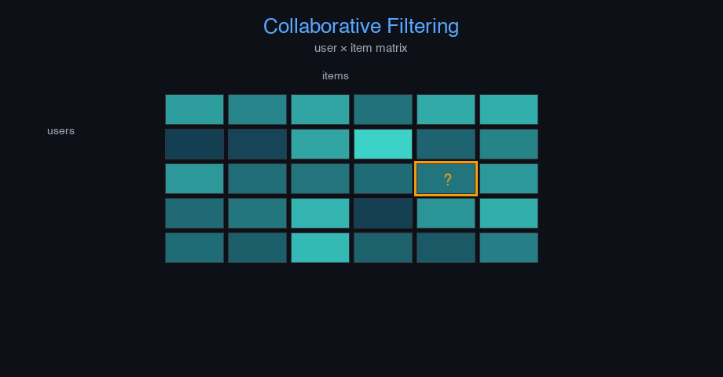

# recommendation-engine


Recommendation Engine (Collaborative Filtering) — AI engineering example · part of the MLOps monorepo

## 1. Mathematical Foundations

This example is grounded in **Recommendation Engine (Collaborative Filtering)**. The equations below
drive every forward and backward pass in the implementation.

$$\hat{r}_{ui} = \mu + b_u + b_i + q_i^T p_u$$

$$\min_{b^*} \sum_{(u,i) \in \mathcal{K}} (r_{ui} - \mu - b_u - b_i)^2 + \lambda(\|b_u\|^2 + \|b_i\|^2)$$

$$\text{cosine}(u,v) = \frac{u \cdot v}{\|u\| \|v\|}$$

### Derivation

Matrix factorization decomposes the user-item interaction matrix into latent factors. Bias terms capture global mean and user/item-specific offsets. Regularization prevents overfitting. Similarity metrics enable neighborhood-based recommendations.

### Worked Numerical Example

$$z = w \cdot x + b$$

Illustrative forward-pass evaluation (scalar example):

Input  x        = 12.0   (e.g. pizza diameter, inches)
Weights w       =  0.85
Bias    b       =  0.30
---------------------------------
z = w*x + b
  = 0.85 * 12.0 + 0.30
  = 10.20 + 0.30
  = 10.50   <- model output

### Conceptual Diagram

        Math concept (placeholder)
   [ Input x ] --> ( w · x + b ) --> [ Output z ]
                       |
                  [ activation ]
                       |
                  [ prediction ]



Interactive embedding scatter plot; recommendation coverage vs diversity trade-off; top-k recall curve.

## 2. Core Logic & Architecture

The example follows a consistent **data → train → evaluate → serve**
pipeline. Inputs are loaded and validated, transformed by the core algorithm, scored against
held-out data, and exposed through a REST API.

  Raw dataset→
  load + validate (data.py)→
  fit / transform (model.py)→
  evaluate + persist (train.py)→
  serve (api.py)

### Primary Components

| Class | Public methods | Responsibility |
| --- | --- | --- |
| `RecommendRequest` | — | Recommendation request with items in the basket. |
| `RecommendResponse` | — | Recommendation response. |
| `RulesResponse` | — | Association rules response. |
| `RulesForItemResponse` | — | Association rules for a specific item. |
| `StatsResponse` | — | Model statistics response. |
| `DriftResponse` | — | Drift detection response. |
| `AssociationRule` | to_dict | An association rule: antecedent -> consequent. |
| `Apriori` | fit, _find_frequent_itemsets, _generate_candidates, _has_frequent_subsets, _generate_rules, recommend, get_rules_for_item, get_rules_with_item, evaluate, save, load, to_dict | Apriori algorithm for mining association rules from transaction data.  Args:     min_support: Minimum support threshold (0.0-1.0)     min_confidence: Minimum confidence threshold (0.0-1.0)     min_lift: Minimum lift threshold (>= 1.0)     max_itemset_size: Maximum size of itemsets to consider |

### Data Flow


1. **Load** — `data.py` reads the source dataset and splits train/test.


2. **Validate** — a Pydantic schema guards input shape/dtypes before training.


3. **Fit / Transform** — `model.py` applies the mathematics from Section 1.


4. **Evaluate** — metrics (MSE/RMSE/R², accuracy, etc.) are computed and logged.


5. **Persist** — weights/artifacts are saved and registered in the model registry.


6. **Serve** — `api.py` exposes prediction endpoints with drift detection.

### Design Patterns & Performance

Key design choices in this module: a pure-NumPy implementation (no PyTorch/TensorFlow), schema validation via `ai_core.validation`, structured JSON logging through `ai_core.logging`, Prometheus metrics from `ai_core.metrics`, and MLflow/model-registry persistence via `ai_core.model_registry`. The FastAPI service wraps the trained model with observability middleware from `ai_core.fastapi_middleware`.

## 3. Detailed Code Walkthrough

The most important behaviour is summarised below; full source for each module is collapsible
so the page stays readable while remaining self-contained.

### `Apriori.fit(transactions)`

Mine frequent itemsets and generate association rules.

Args:
    transactions: List of transactions, each a list of product names

Returns:
    self

### `Apriori.evaluate(transactions)`

Evaluate the quality of mined rules.

Args:
    transactions: Transaction data to evaluate against

Returns:
    Dict with evaluation metrics

### Source Files

<details>
<summary>model.py</summary>

```
"""Apriori algorithm for association rule mining in recommendation engines.

Implements a production-ready Apriori algorithm with:
- Frequent itemset mining using the Apriori principle
- Association rule generation with support, confidence, and lift metrics
- Proper serialization with metadata
- Recommendation generation from learned rules
"""

from dataclasses import dataclass, field
from itertools import combinations
from typing import Any

import numpy as np

@dataclass(frozen=True)
class AssociationRule:
    """An association rule: antecedent -> consequent."""

    antecedent: frozenset[str]
    consequent: frozenset[str]
    support: float
    confidence: float
    lift: float
    conviction: float

    def to_dict(self) -> dict[str, Any]:
        return {
            "antecedent": sorted(self.antecedent),
            "consequent": sorted(self.consequent),
            "support": round(self.support, 4),
            "confidence": round(self.confidence, 4),
            "lift": round(self.lift, 4),
            "conviction": round(self.conviction, 4),
        }

@dataclass
class Apriori:
    """Apriori algorithm for mining association rules from transaction data.

    Args:
        min_support: Minimum support threshold (0.0-1.0)
        min_confidence: Minimum confidence threshold (0.0-1.0)
        min_lift: Minimum lift threshold (>= 1.0)
        max_itemset_size: Maximum size of itemsets to consider
    """

    min_support: float = 0.05
    min_confidence: float = 0.5
    min_lift: float = 1.0
    max_itemset_size: int = 4

    # Learned state
    frequent_itemsets: dict[frozenset[str], float] = field(default_factory=dict)
    rules: list[AssociationRule] = field(default_factory=list)
    n_transactions: int = 0
    products: list[str] = field(default_factory=list)

    def fit(self, transactions: list[list[str]]) -> "Apriori":
        """Mine frequent itemsets and generate association rules.

        Args:
            transactions: List of transactions, each a list of product names

        Returns:
            self
        """
        self.n_transactions = len(transactions)
        self.products = sorted(set(item for t in transactions for item in t))

        # Convert transactions to frozensets for efficient operations
        transaction_sets = [frozenset(t) for t in transactions]

        # Step 1: Find frequent itemsets using Apriori
        self.frequent_itemsets = self._find_frequent_itemsets(transaction_sets)

        # Step 2: Generate association rules
        self.rules = self._generate_rules(transaction_sets)

        return self

    def _find_frequent_itemsets(
        self, transaction_sets: list[frozenset[str]]
    ) -> dict[frozenset[str], float]:
        """Find all frequent itemsets using the Apriori algorithm."""
        frequent_itemsets: dict[frozenset[str], float] = {}

        # Generate candidate 1-itemsets
        candidates: set[frozenset[str]] = set()
        for t in transaction_sets:
            for item in t:
                candidates.add(frozenset([item]))

        k = 1
        while candidates and k <= self.max_itemset_size:
            # Count support for each candidate
            support_counts: dict[frozenset[str], int] = {}
            for itemset in candidates:
                count = sum(1 for t in transaction_sets if itemset.issubset(t))
                support_counts[itemset] = count

            # Filter by minimum support
            frequent_k: dict[frozenset[str], float] = {}
            for itemset, count in support_counts.items():
                support = count / self.n_transactions
                if support >= self.min_support:
                    frequent_k[itemset] = support

            if not frequent_k:
                break

            frequent_itemsets.update(frequent_k)

            # Generate next candidates using Apriori principle
            candidates = self._generate_candidates(list(frequent_k.keys()), k + 1)
            k += 1

        return frequent_itemsets

    def _generate_candidates(
        self, frequent_itemsets: list[frozenset[str]], k: int
    ) -> set[frozenset[str]]:
        """Generate candidate itemsets of size k from frequent itemsets of size k-1."""
        candidates: set[frozenset[str]] = set()
        n = len(frequent_itemsets)

        for i in range(n):
            for j in range(i + 1, n):
                itemset1 = frequent_itemsets[i]
                itemset2 = frequent_itemsets[j]

                # Join step: combine if first k-2 items are the same
                list1 = sorted(itemset1)
                list2 = sorted(itemset2)
                if list1[:-1] == list2[:-1]:
                    new_itemset = itemset1 | itemset2
                    if len(new_itemset) == k and self._has_frequent_subsets(
                        new_itemset, frequent_itemsets
                    ):
                        # Prune step: all subsets must be frequent
                        candidates.add(new_itemset)

        return candidates

    def _has_frequent_subsets(
        self, itemset: frozenset[str], frequent_itemsets: list[frozenset[str]]
    ) -> bool:
        """Check if all (k-1)-subsets of the itemset are frequent."""
        frequent_set = set(frequent_itemsets)
        for subset in combinations(itemset, len(itemset) - 1):
            if frozenset(subset) not in frequent_set:
                return False
        return True

    def _generate_rules(self, transaction_sets: list[frozenset[str]]) -> list[AssociationRule]:
        """Generate association rules from frequent itemsets."""
        rules: list[AssociationRule] = []

        for itemset, support in self.frequent_itemsets.items():
            if len(itemset) < 2:
                continue

            # Generate all possible antecedent/consequent splits
            items = list(itemset)
            for r in range(1, len(items)):
                for antecedent_tuple in combinations(items, r):
                    antecedent = frozenset(antecedent_tuple)
                    consequent = itemset - antecedent

                    if not consequent:
                        continue

                    # Compute confidence
                    antecedent_support = self.frequent_itemsets.get(antecedent, 0.0)
                    if antecedent_support == 0:
                        continue

                    confidence = support / antecedent_support

                    # Compute lift
                    consequent_support = self.frequent_itemsets.get(consequent, 0.0)
                    if consequent_support == 0:
                        continue

                    lift = confidence / consequent_support

                    # Compute conviction
                    if confidence < 1.0:
                        conviction = (1 - consequent_support) / (1 - confidence)
                    else:
                        conviction = float("inf")

                    # Apply thresholds
                    if confidence >= self.min_confidence and lift >= self.min_lift:
                        rules.append(
                            AssociationRule(
                                antecedent=antecedent,
                                consequent=consequent,
                                support=support,
                                confidence=confidence,
                                lift=lift,
                                conviction=conviction,
                            )
                        )

        # Sort by lift (descending) then confidence (descending)
        rules.sort(key=lambda r: (r.lift, r.confidence), reverse=True)
        return rules

    def recommend(
        self,
        items: list[str],
        top_k: int = 5,
        exclude_purchased: bool = True,
    ) -> list[dict[str, Any]]:
        """Generate recommendations based on the items in the basket.

        Args:
            items: List of items in the user's basket
            top_k: Number of recommendations to return
            exclude_purchased: Whether to exclude items already in the basket

        Returns:
            List of recommendation dicts with item, rule, and metrics
        """
        basket = frozenset(items)
        recommendations: dict[str, dict[str, Any]] = {}

        for rule in self.rules:
            # Check if the antecedent is a subset of the basket
            if rule.antecedent.issubset(basket):
                for item in rule.consequent:
                    if exclude_purchased and item in basket:
                        continue

                    # Score: weighted combination of lift, confidence, and support
                    score = rule.lift * rule.confidence * (1 + rule.support)

                    if item not in recommendations or score > recommendations[item]["score"]:
                        recommendations[item] = {
                            "item": item,
                            "score": round(score, 4),
                            "lift": round(rule.lift, 4),
                            "confidence": round(rule.confidence, 4),
                            "support": round(rule.support, 4),
                            "rule": f"{sorted(rule.antecedent)} -> {item}",
                        }

        # Sort by score descending and return top_k
        sorted_recs = sorted(recommendations.values(), key=lambda r: r["score"], reverse=True)
        return sorted_recs[:top_k]

    def get_rules_for_item(self, item: str, top_k: int = 10) -> list[dict[str, Any]]:
        """Get association rules where the item appears in the consequent."""
        matching = [rule.to_dict() for rule in self.rules if item in rule.consequent]
        return matching[:top_k]

    def get_rules_with_item(self, item: str, top_k: int = 10) -> list[dict[str, Any]]:
        """Get association rules where the item appears in the antecedent."""
        matching = [rule.to_dict() for rule in self.rules if item in rule.antecedent]
        return matching[:top_k]

    def evaluate(self, transactions: list[list[str]]) -> dict[str, float]:
        """Evaluate the quality of mined rules.

        Args:
            transactions: Transaction data to evaluate against

        Returns:
            Dict with evaluation metrics
        """
        n_transactions = len(transactions)
        transaction_sets = [frozenset(t) for t in transactions]

        # Coverage: fraction of transactions that match at least one rule antecedent
        covered = 0
        for t in transaction_sets:
            for rule in self.rules:
                if rule.antecedent.issubset(t):
                    covered += 1
                    break

        coverage = covered / n_transactions if n_transactions > 0 else 0.0

        # Average metrics across rules
        if self.rules:
            avg_confidence = np.mean([r.confidence for r in self.rules])
            avg_lift = np.mean([r.lift for r in self.rules])
            avg_support = np.mean([r.support for r in self.rules])
        else:
            avg_confidence = 0.0
            avg_lift = 0.0
            avg_support = 0.0

        return {
            "n_rules": float(len(self.rules)),
            "n_frequent_itemsets": float(len(self.frequent_itemsets)),
            "coverage": float(coverage),
            "avg_confidence": float(avg_confidence),
            "avg_lift": float(avg_lift),
            "avg_support": float(avg_support),
        }

    # ---------- Serialization ----------

    def save(self, path: str) -> None:
        """Save model parameters to disk."""
        np.savez(
            path,
            min_support=self.min_support,
            min_confidence=self.min_confidence,
            min_lift=self.min_lift,
            max_itemset_size=self.max_itemset_size,
            n_transactions=self.n_transactions,
            products=np.array(self.products, dtype=object),
            # Serialize frequent itemsets as JSON-compatible data
            frequent_itemsets_items=np.array(
                [sorted(keyset) for keyset in self.frequent_itemsets], dtype=object
            ),
            frequent_itemsets_supports=np.array(
                [self.frequent_itemsets[keyset] for keyset in self.frequent_itemsets]
            ),
            # Serialize rules
            rules_antecedent=np.array([sorted(r.antecedent) for r in self.rules], dtype=object),
            rules_consequent=np.array([sorted(r.consequent) for r in self.rules], dtype=object),
            rules_support=np.array([r.support for r in self.rules]),
            rules_confidence=np.array([r.confidence for r in self.rules]),
            rules_lift=np.array([r.lift for r in self.rules]),
            rules_conviction=np.array([r.conviction for r in self.rules]),
        )

    @classmethod
    def load(cls, path: str) -> "Apriori":
        """Load model parameters from disk."""
        data = np.load(path, allow_pickle=True)

        model = cls(
            min_support=float(data["min_support"]),
            min_confidence=float(data["min_confidence"]),
            min_lift=float(data["min_lift"]),
            max_itemset_size=int(data["max_itemset_size"]),
        )
        model.n_transactions = int(data["n_transactions"])
        model.products = [str(p) for p in data["products"]]

        # Restore frequent itemsets
        itemsets_items = data["frequent_itemsets_items"]
        itemsets_supports = data["frequent_itemsets_supports"]
        model.frequent_itemsets = {}
        for items, support in zip(itemsets_items, itemsets_supports, strict=False):
            model.frequent_itemsets[frozenset(str(i) for i in items)] = float(support)

        # Restore rules
        antecedents = data["rules_antecedent"]
        consequents = data["rules_consequent"]
        supports = data["rules_support"]
        confidences = data["rules_confidence"]
        lifts = data["rules_lift"]
        convictions = data["rules_conviction"]

        model.rules = []
        for ant, cons, sup, conf, lift, conv in zip(
            antecedents,
            consequents,
            supports,
            confidences,
            lifts,
            convictions,
            strict=False,
        ):
            model.rules.append(
                AssociationRule(
                    antecedent=frozenset(str(i) for i in ant),
                    consequent=frozenset(str(i) for i in cons),
                    support=float(sup),
                    confidence=float(conf),
                    lift=float(lift),
                    conviction=float(conv),
                )
            )

        return model

    def to_dict(self) -> dict[str, Any]:
        """Return model parameters as a dict."""
        return {
            "min_support": self.min_support,
            "min_confidence": self.min_confidence,
            "min_lift": self.min_lift,
            "max_itemset_size": self.max_itemset_size,
            "n_transactions": self.n_transactions,
            "n_products": len(self.products),
            "n_frequent_itemsets": len(self.frequent_itemsets),
            "n_rules": len(self.rules),
        }
```

</details>

<details>
<summary>train.py</summary>

```
"""Production training pipeline for the recommendation engine (Apriori)."""

import argparse
import os
from pathlib import Path

from ai_core.logging import get_logger, setup_logging
from ai_core.model_registry import ModelRegistry

from recommendation_engine.data import load_training_data, save_training_data
from recommendation_engine.model import Apriori

logger = get_logger(__name__)

def train(
    model_dir: Path,
    data_path: Path,
    min_support: float,
    min_confidence: float,
    min_lift: float,
    max_itemset_size: int,
    model_version: str,
    register_to_mlflow: bool = False,
    random_seed: int = 42,
) -> dict:
    """Train the recommendation engine Apriori model and save artifacts.

    Returns:
        Dictionary with training metrics
    """
    # Load training data
    transactions = load_training_data(data_path, random_seed=random_seed)
    logger.info("Loaded training data", n_transactions=len(transactions))

    # Save training data for reproducibility
    save_training_data(transactions, model_dir / "training_data.csv")

    # Train model
    model = Apriori(
        min_support=min_support,
        min_confidence=min_confidence,
        min_lift=min_lift,
        max_itemset_size=max_itemset_size,
    )
    model.fit(transactions)

    # Evaluate model quality
    metrics = model.evaluate(transactions)
    logger.info(
        "Training complete",
        n_rules=metrics["n_rules"],
        n_frequent_itemsets=metrics["n_frequent_itemsets"],
        coverage=metrics["coverage"],
        avg_confidence=metrics["avg_confidence"],
        avg_lift=metrics["avg_lift"],
    )

    # Model validation - check rule quality
    if metrics["n_rules"] == 0:
        logger.warning(
            "No rules generated. Consider lowering min_support or min_confidence.",
            min_support=min_support,
            min_confidence=min_confidence,
        )

    # Save model
    model_path = model_dir / f"recommendation_model_v{model_version}.npz"
    model.save(str(model_path))

    # Save training chart
    _save_chart(model, transactions, model_dir, model_version)

    # Combined metrics for registry
    training_metrics = {
        "n_rules": metrics["n_rules"],
        "n_frequent_itemsets": metrics["n_frequent_itemsets"],
        "coverage": metrics["coverage"],
        "avg_confidence": metrics["avg_confidence"],
        "avg_lift": metrics["avg_lift"],
        "avg_support": metrics["avg_support"],
        "n_transactions": float(len(transactions)),
        "n_products": float(len(model.products)),
    }

    # Register model
    registry = ModelRegistry(base_dir=model_dir)
    registry.save_model(
        model_name="recommendation-engine",
        model_version=model_version,
        model_type="association_rules",
        metrics=training_metrics,
        parameters={
            "min_support": min_support,
            "min_confidence": min_confidence,
            "min_lift": min_lift,
            "max_itemset_size": max_itemset_size,
            "random_seed": random_seed,
        },
        artifacts={
            f"recommendation_model_v{model_version}.npz": model_path,
            "training_data.csv": model_dir / "training_data.csv",
        },
        tags={"framework": "numpy", "task": "association_rules"},
    )

    if register_to_mlflow:
        registry.log_to_mlflow(
            model_name="recommendation-engine",
            model_version=model_version,
            metrics=training_metrics,
            params={
                "min_support": min_support,
                "min_confidence": min_confidence,
                "min_lift": min_lift,
                "max_itemset_size": max_itemset_size,
                "random_seed": random_seed,
            },
            artifacts={
                "model": str(model_path),
                "chart": str(model_dir / f"recommendation_engine_v{model_version}.png"),
                "training_data": str(model_dir / "training_data.csv"),
            },
            tags={"model_type": "association_rules", "framework": "numpy"},
        )
        logger.info(
            "Registered model to MLflow", model="recommendation-engine", version=model_version
        )

    return training_metrics

def _save_chart(
    model: Apriori,
    transactions: list[list[str]],
    output_dir: Path,
    version: str,
) -> None:
    """Save the association rules chart."""
    import matplotlib

    matplotlib.use("Agg")
    import matplotlib.pyplot as plt

    if not model.rules:
        return

    plt.figure(figsize=(12, 6))

    # Plot top rules by lift
    top_rules = model.rules[:15]
    labels = [
        f"{'+'.join(sorted(r.antecedent))} -> {'+'.join(sorted(r.consequent))}" for r in top_rules
    ]
    lifts = [r.lift for r in top_rules]
    confidences = [r.confidence for r in top_rules]

    x = range(len(top_rules))
    bars = plt.bar(x, lifts, color="steelblue", alpha=0.7, label="Lift")

    # Add confidence as text on bars
    for _i, (bar, conf) in enumerate(zip(bars, confidences, strict=False)):
        plt.text(
            bar.get_x() + bar.get_width() / 2,
            bar.get_height() + 0.05,
            f"conf={conf:.2f}",
            ha="center",
            va="bottom",
            fontsize=8,
        )

    plt.xlabel("Association Rule")
    plt.ylabel("Lift")
    plt.title(f"Top Association Rules by Lift - v{version}")
    plt.xticks(x, labels, rotation=45, ha="right", fontsize=8)
    plt.grid(True, alpha=0.3, axis="y")
    plt.legend()
    plt.tight_layout()

    chart_path = output_dir / f"recommendation_engine_v{version}.png"
    plt.savefig(str(chart_path), dpi=100)
    plt.close()
    logger.info("Chart saved", path=str(chart_path))

def main():
    parser = argparse.ArgumentParser(description="Train recommendation engine Apriori model")
    parser.add_argument("--model-dir", type=Path, default=Path(os.getenv("MODEL_DIR", "/models")))
    parser.add_argument("--data-path", type=Path, default=None)
    parser.add_argument(
        "--min-support", type=float, default=float(os.getenv("MIN_SUPPORT", "0.05"))
    )
    parser.add_argument(
        "--min-confidence", type=float, default=float(os.getenv("MIN_CONFIDENCE", "0.5"))
    )
    parser.add_argument("--min-lift", type=float, default=float(os.getenv("MIN_LIFT", "1.0")))
    parser.add_argument(
        "--max-itemset-size", type=int, default=int(os.getenv("MAX_ITEMSET_SIZE", "4"))
    )
    parser.add_argument("--model-version", type=str, default=os.getenv("MODEL_VERSION", "1.0.0"))
    parser.add_argument("--random-seed", type=int, default=int(os.getenv("RANDOM_SEED", "42")))
    parser.add_argument(
        "--register-mlflow",
        action="store_true",
        default=os.getenv("REGISTER_MLFLOW", "false").lower() == "true",
    )
    parser.add_argument("--log-level", type=str, default=os.getenv("LOG_LEVEL", "INFO"))
    args = parser.parse_args()

    setup_logging(args.log_level)
    args.model_dir.mkdir(parents=True, exist_ok=True)

    metrics = train(
        model_dir=args.model_dir,
        data_path=args.data_path,
        min_support=args.min_support,
        min_confidence=args.min_confidence,
        min_lift=args.min_lift,
        max_itemset_size=args.max_itemset_size,
        model_version=args.model_version,
        register_to_mlflow=args.register_mlflow,
        random_seed=args.random_seed,
    )

    logger.info("Training finished", metrics=metrics, model_dir=str(args.model_dir))

if __name__ == "__main__":
    main()
```

</details>

<details>
<summary>data.py</summary>

```
"""Data loading and preprocessing for the recommendation engine.

Generates a realistic synthetic grocery transaction dataset with
known product associations, designed for Apriori association rule mining.

Product categories and their associations:
- Bread, Milk, Butter  - breakfast staples (frequently bought together)
- Beer, Diapers, Chips - classic "beer & diapers" association
- Coffee, Sugar, Cream - coffee lovers
- Pasta, Sauce, Cheese - Italian dinner
- Shampoo, Soap, Toothpaste - personal care
"""

from pathlib import Path

import numpy as np
import pandas as pd

# All possible products in the catalog
PRODUCTS = [
    "Bread",
    "Milk",
    "Butter",
    "Beer",
    "Diapers",
    "Chips",
    "Coffee",
    "Sugar",
    "Cream",
    "Pasta",
    "Sauce",
    "Cheese",
    "Shampoo",
    "Soap",
    "Toothpaste",
    "Eggs",
    "Juice",
    "Cereal",
    "Yogurt",
    "Chocolate",
    "Fruit",
    "Granola",
]

# Product groups with strong associations (for generating realistic data)
PRODUCT_GROUPS = [
    ["Bread", "Milk", "Butter"],
    ["Beer", "Diapers", "Chips"],
    ["Coffee", "Sugar", "Cream"],
    ["Pasta", "Sauce", "Cheese"],
    ["Shampoo", "Soap", "Toothpaste"],
    ["Eggs", "Milk", "Bread"],
    ["Cereal", "Milk", "Sugar"],
    ["Yogurt", "Fruit", "Granola"],
    ["Chocolate", "Milk", "Sugar"],
    ["Juice", "Cereal", "Bread"],
]

# Default number of transactions
DEFAULT_N_TRANSACTIONS = 1000

# Maximum items per transaction
MAX_ITEMS_PER_TRANSACTION = 8

def _generate_transactions(
    n_transactions: int = DEFAULT_N_TRANSACTIONS,
    random_seed: int = 42,
) -> list[list[str]]:
    """Generate synthetic transaction data with known product associations.

    Returns:
        List of transactions, where each transaction is a list of product names
    """
    rng = np.random.default_rng(random_seed)

    transactions: list[list[str]] = []

    for _ in range(n_transactions):
        # Each transaction has 1-8 items
        n_items = rng.integers(1, MAX_ITEMS_PER_TRANSACTION + 1)

        # 70% chance to pick from a product group (creates strong associations)
        if rng.random() < 0.7:
            group = PRODUCT_GROUPS[rng.integers(0, len(PRODUCT_GROUPS))]
            # Pick 2-3 items from the group
            n_group_items = rng.integers(2, min(4, len(group) + 1))
            items = list(rng.choice(group, size=n_group_items, replace=False))
        else:
            items = []

        # Fill remaining slots with random products
        while len(items) < n_items:
            product = PRODUCTS[rng.integers(0, len(PRODUCTS))]
            if product not in items:
                items.append(product)

        transactions.append(items)

    return transactions

def load_training_data(
    data_path: Path | None = None,
    n_transactions: int = DEFAULT_N_TRANSACTIONS,
    random_seed: int = 42,
) -> list[list[str]]:
    """Load transaction data from CSV or generate a synthetic dataset.

    Expected CSV format (one transaction per row, comma-separated items):
        Bread,Milk,Butter
        Beer,Diapers,Chips
        ...

    Returns:
        List of transactions, where each transaction is a list of product names
    """
    if data_path and Path(data_path).exists():
        df = pd.read_csv(data_path, header=None)
        transactions = []
        for _, row in df.iterrows():
            items = [str(item).strip() for item in row.dropna().tolist() if str(item).strip()]
            if items:
                transactions.append(items)
        return transactions

    return _generate_transactions(n_transactions=n_transactions, random_seed=random_seed)

def save_training_data(transactions: list[list[str]], path: Path) -> None:
    """Save transaction data to CSV for reproducibility."""
    path = Path(path)
    path.parent.mkdir(parents=True, exist_ok=True)

    # Pad transactions to same length for CSV
    max_len = max(len(t) for t in transactions)
    padded = [t + [""] * (max_len - len(t)) for t in transactions]
    df = pd.DataFrame(padded)
    df.to_csv(path, index=False, header=False)

def transactions_to_onehot(
    transactions: list[list[str]],
    products: list[str] | None = None,
) -> tuple[np.ndarray, list[str]]:
    """Convert transactions to a one-hot encoded matrix.

    Args:
        transactions: List of transactions (each a list of product names)
        products: Optional list of all products. If None, derived from data.

    Returns:
        Tuple of (one-hot matrix, product names)
    """
    if products is None:
        products = sorted(set(item for t in transactions for item in t))

    product_to_idx = {p: i for i, p in enumerate(products)}
    n_transactions = len(transactions)
    n_products = len(products)

    X = np.zeros((n_transactions, n_products), dtype=int)
    for i, t in enumerate(transactions):
        for item in t:
            if item in product_to_idx:
                X[i, product_to_idx[item]] = 1

    return X, products
```

</details>

<details>
<summary>api.py</summary>

```
"""Production serving API for the recommendation engine (Apriori)."""

import os
import time
from contextlib import asynccontextmanager
from pathlib import Path

import numpy as np
from ai_core.drift import DriftDetector
from ai_core.fastapi_middleware import add_observability_middleware
from ai_core.logging import get_logger, setup_logging
from ai_core.metrics import MetricsCollector
from ai_core.model_registry import ModelRegistry
from fastapi import FastAPI, HTTPException, Response
from pydantic import BaseModel, Field

from recommendation_engine.data import PRODUCTS, load_training_data
from recommendation_engine.model import Apriori

logger = get_logger(__name__)

# Configuration
MODEL_DIR = Path(os.getenv("MODEL_DIR", "/models"))
MODEL_VERSION = os.getenv("MODEL_VERSION", "latest")
METRICS_PORT = int(os.getenv("METRICS_PORT", os.getenv("RECOMMENDATION_METRICS_PORT", "8004")))
DRIFT_THRESHOLD = float(os.getenv("DRIFT_THRESHOLD", "0.2"))

class RecommendRequest(BaseModel):
    """Recommendation request with items in the basket."""

    items: list[str] = Field(
        ..., min_length=1, max_length=50, description="Items in the user's basket"
    )
    top_k: int = Field(5, ge=1, le=20, description="Number of recommendations to return")
    exclude_purchased: bool = Field(True, description="Exclude items already in the basket")

class RecommendResponse(BaseModel):
    """Recommendation response."""

    recommendations: list[dict]
    model_version: str

class RulesResponse(BaseModel):
    """Association rules response."""

    n_rules: int
    rules: list[dict]
    model_version: str

class RulesForItemResponse(BaseModel):
    """Association rules for a specific item."""

    item: str
    n_rules: int
    rules: list[dict]
    model_version: str

class StatsResponse(BaseModel):
    """Model statistics response."""

    n_transactions: int
    n_products: int
    n_frequent_itemsets: int
    n_rules: int
    min_support: float
    min_confidence: float
    min_lift: float
    model_version: str

class DriftResponse(BaseModel):
    """Drift detection response."""

    total_features: int
    drifted_features: int
    drift_ratio: float
    drifted: list[dict]
    all_results: list[dict]

# Global model state
_model: Apriori | None = None
_model_version: str = "unknown"
_metrics: MetricsCollector | None = None
_drift_detector: DriftDetector | None = None
_reference_data: np.ndarray | None = None
_recent_predictions: list[list[str]] = []

@asynccontextmanager
async def lifespan(app: FastAPI):
    """Load model at startup and clean up at shutdown."""
    global _model, _model_version, _metrics, _drift_detector, _reference_data

    setup_logging(os.getenv("LOG_LEVEL", "INFO"))
    _metrics = MetricsCollector("recommendation_engine", port=METRICS_PORT)
    app.state.metrics = _metrics

    _drift_detector = DriftDetector(
        feature_names=PRODUCTS,
        feature_types={p: "binary" for p in PRODUCTS},
        psi_threshold=DRIFT_THRESHOLD,
    )

    _model, _model_version = _load_model()
    _metrics.set_model_version(_model_version)
    _metrics.set_model_info(
        model_name="recommendation-engine",
        model_version=_model_version,
        model_type="association_rules",
    )

    # Load reference data for drift detection
    _reference_data = _load_reference_data()
    logger.info("Model loaded", model="recommendation-engine", version=_model_version)

    yield

    logger.info("Shutting down recommendation-engine API")

def _load_model() -> tuple[Apriori, str]:
    """Load the latest model from the registry or model directory with resilient fallback."""
    # 1. Try model registry
    registry = ModelRegistry(base_dir=MODEL_DIR)
    try:
        if MODEL_VERSION == "latest":
            models = registry.list_models()
            rec_models = [m for m in models if m.get("model_name") == "recommendation-engine"]
            if rec_models:
                rec_models.sort(key=lambda m: m["model_version"], reverse=True)
                latest = rec_models[0]
                model_dir = Path(latest["artifact_path"])
                npz_files = list(model_dir.glob("recommendation_model_*.npz")) + list(
                    model_dir.glob("*.npz")
                )
                if npz_files:
                    return Apriori.load(str(npz_files[0])), latest["model_version"]
        else:
            model_dir = MODEL_DIR / "recommendation-engine" / MODEL_VERSION
            if model_dir.exists():
                npz_files = list(model_dir.glob("recommendation_model_*.npz")) + list(
                    model_dir.glob("*.npz")
                )
                if npz_files:
                    return Apriori.load(str(npz_files[0])), MODEL_VERSION
    except Exception as e:
        logger.warning(f"Registry lookup failed: {e}")

    # 2. Try direct model in MODEL_DIR
    npz_path = MODEL_DIR / "recommendation_model.npz"
    if npz_path.exists():
        return Apriori.load(str(npz_path)), "legacy"

    # 3. Try bundled artifacts directory
    candidate_paths = [
        Path("/app/artifacts/models/recommendation_model_v1.0.0.npz"),
        Path(__file__).resolve().parents[3]
        / "artifacts"
        / "models"
        / "recommendation_model_v1.0.0.npz",
    ]
    for p in candidate_paths:
        if p.exists():
            logger.info("Loading bundled baseline model", path=str(p))
            return Apriori.load(str(p)), "1.0.0-bundled"

    # 4. In-memory baseline fallback (never crash cold start)
    logger.warning("No pre-existing model found on disk. Initializing baseline Apriori model.")
    transactions = load_training_data(None)
    model = Apriori(min_support=0.05, min_confidence=0.5, min_lift=1.0, max_itemset_size=4)
    model.fit(transactions)
    return model, "1.0.0-baseline"

def _load_reference_data() -> np.ndarray | None:
    """Load reference training data for drift detection."""
    candidate_csvs = [
        MODEL_DIR / "recommendation-engine" / _model_version / "training_data.csv",
        MODEL_DIR / "training_data.csv",
        Path("/app/artifacts/models/training_data.csv"),
        Path(__file__).resolve().parents[3] / "artifacts" / "models" / "training_data.csv",
    ]
    for csv_path in candidate_csvs:
        if csv_path.exists():
            try:
                import pandas as pd

                df = pd.read_csv(csv_path, header=None)
                # Convert to one-hot matrix
                transactions = []
                for _, row in df.iterrows():
                    items = [
                        str(item).strip() for item in row.dropna().tolist() if str(item).strip()
                    ]
                    if items:
                        transactions.append(items)
                if transactions:
                    from recommendation_engine.data import transactions_to_onehot

                    X, _ = transactions_to_onehot(transactions, PRODUCTS)
                    return X
            except Exception as e:
                logger.warning("Could not read reference csv", path=str(csv_path), error=str(e))

    # Generate reference data
    transactions = load_training_data(None)
    from recommendation_engine.data import transactions_to_onehot

    X, _ = transactions_to_onehot(transactions, PRODUCTS)
    return X

# Create FastAPI app
app = FastAPI(
    title="Recommendation Engine API",
    description="Association Rule Learning with Apriori Algorithm for product recommendations",
    version="1.0.0",
    lifespan=lifespan,
)

# Add observability middleware
add_observability_middleware(app)

@app.get("/")
def read_root():
    """Service information."""
    return {
        "service": "recommendation-engine-api",
        "version": "1.0.0",
        "model_version": _model_version,
        "endpoints": {
            "health": "/health",
            "recommend": "POST /recommend",
            "rules": "GET /rules",
            "rules_for_item": "GET /rules/{item}",
            "stats": "GET /stats",
            "drift": "GET /drift",
            "metrics": "/metrics",
        },
    }

@app.get("/health")
def health_check():
    """Kubernetes liveness/readiness probe."""
    if _model is None:
        raise HTTPException(status_code=503, detail="Model not loaded")
    return {
        "status": "healthy",
        "model_loaded": True,
        "model_version": _model_version,
    }

@app.get("/metrics")
def metrics():
    """Prometheus metrics endpoint."""
    from prometheus_client import CONTENT_TYPE_LATEST, generate_latest

    return Response(content=generate_latest(), media_type=CONTENT_TYPE_LATEST)

@app.post("/reload")
def reload_model():
    """Dynamically reload the model from disk/registry."""
    global _model, _model_version, _reference_data
    try:
        _model, _model_version = _load_model()
        if _metrics:
            _metrics.set_model_version(_model_version)
            _metrics.set_model_info(
                model_name="recommendation-engine",
                model_version=_model_version,
                model_type="association_rules",
            )
        _reference_data = _load_reference_data()
        logger.info(
            "Model reloaded dynamically", model="recommendation-engine", version=_model_version
        )
        return {"status": "reloaded", "model_version": _model_version}
    except Exception as e:
        logger.exception("Model reload failed", error=str(e))
        raise HTTPException(status_code=500, detail=f"Reload failed: {e}") from e

@app.get("/drift", response_model=DriftResponse)
def drift_check():
    """Check for data drift between reference and recent predictions."""
    if _drift_detector is None or _reference_data is None:
        raise HTTPException(status_code=503, detail="Drift detection not available")

    if len(_recent_predictions) < 10:
        return DriftResponse(
            total_features=len(PRODUCTS),
            drifted_features=0,
            drift_ratio=0.0,
            drifted=[],
            all_results=[],
        )

    # Convert recent predictions to one-hot
    from recommendation_engine.data import transactions_to_onehot

    current, _ = transactions_to_onehot(_recent_predictions[-100:], PRODUCTS)
    results = _drift_detector.detect_drift(_reference_data, current)
    summary = _drift_detector.summarize(results)

    if _metrics:
        _metrics.set_drift_ratio(summary["drift_ratio"])

    return DriftResponse(**summary)

@app.get("/stats", response_model=StatsResponse)
def get_stats():
    """Return model statistics."""
    if _model is None:
        raise HTTPException(status_code=503, detail="Model not loaded")

    return StatsResponse(
        n_transactions=_model.n_transactions,
        n_products=len(_model.products),
        n_frequent_itemsets=len(_model.frequent_itemsets),
        n_rules=len(_model.rules),
        min_support=_model.min_support,
        min_confidence=_model.min_confidence,
        min_lift=_model.min_lift,
        model_version=_model_version,
    )

@app.get("/rules", response_model=RulesResponse)
def get_rules(limit: int = 50):
    """Return the top association rules."""
    if _model is None:
        raise HTTPException(status_code=503, detail="Model not loaded")

    rules = [r.to_dict() for r in _model.rules[:limit]]
    return RulesResponse(
        n_rules=len(_model.rules),
        rules=rules,
        model_version=_model_version,
    )

@app.get("/rules/{item}", response_model=RulesForItemResponse)
def get_rules_for_item(item: str, limit: int = 10):
    """Return association rules where the item appears in the consequent."""
    if _model is None:
        raise HTTPException(status_code=503, detail="Model not loaded")

    rules = _model.get_rules_for_item(item, top_k=limit)
    return RulesForItemResponse(
        item=item,
        n_rules=len(rules),
        rules=rules,
        model_version=_model_version,
    )

@app.post("/recommend", response_model=RecommendResponse)
def recommend(body: RecommendRequest):
    """Generate product recommendations based on basket items."""
    if _model is None or _metrics is None:
        raise HTTPException(status_code=503, detail="Model not loaded")

    # Validate items exist in the product catalog
    unknown_items = [item for item in body.items if item not in _model.products]
    if unknown_items:
        raise HTTPException(
            status_code=422,
            detail=f"Unknown items: {unknown_items}. Available products: {sorted(_model.products)}",
        )

    start = time.time()
    try:
        recommendations = _model.recommend(
            items=body.items,
            top_k=body.top_k,
            exclude_purchased=body.exclude_purchased,
        )
        duration = time.time() - start
        _metrics.record_prediction(model_version=_model_version, duration=duration)

        # Track for drift detection
        _recent_predictions.append(body.items)
        if len(_recent_predictions) > 1000:
            _recent_predictions.pop(0)

        return RecommendResponse(
            recommendations=recommendations,
            model_version=_model_version,
        )
... (truncated) ...
```

</details>

## 4. Monorepo Integration

This example is a first-class consumer of the shared `packages/ai-core` library.
It reuses the following foundation modules instead of re-implementing infrastructure:

ai_core.drift
ai_core.fastapi_middleware
ai_core.logging
ai_core.metrics
ai_core.model_registry

### How it plugs in


- **Configuration** — 12-factor config from `ai_core.config`.


- **Observability** — structured logging + Prometheus metrics are wired in automatically.


- **Validation** — input schema validation prevents bad data reaching the model.


- **Registry** — trained artifacts are versioned and registered for reproducible serving.


- **Serving** — the FastAPI app mounts shared observability middleware for tracing & metrics.

Because every example shares `ai_core`, cross-cutting concerns (drift detection,
logging, metrics, model registry) behave identically across the 47 examples in this monorepo.
