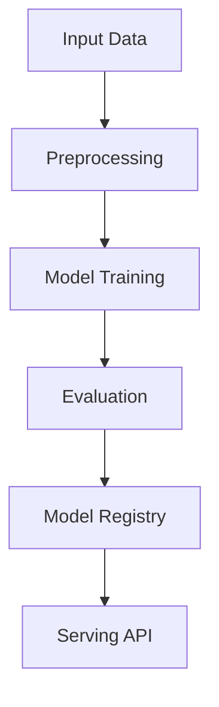

# recommendation-engine

## ∫ Mathematics & Theory

Recommendation Engine (Collaborative Filtering) — Underlying equations and derivations

$$\hat{r}_{ui} = \mu + b_u + b_i + q_i^T p_u$$

$$\min_{b^*} \sum_{(u,i) \in \mathcal{K}} (r_{ui} - \mu - b_u - b_i)^2 + \lambda(\|b_u\|^2 + \|b_i\|^2)$$

$$\text{cosine}(u,v) = \frac{u \cdot v}{\|u\| \|v\|}$$

### Step-by-Step Derivation

Matrix factorization decomposes the user-item interaction matrix into latent factors. Bias terms capture global mean and user/item-specific offsets. Regularization prevents overfitting. Similarity metrics enable neighborhood-based recommendations.

### Interactive Visualization

Interactive embedding scatter plot; recommendation coverage vs diversity trade-off; top-k recall curve.

## ⚙ Architecture

Model structure, data flow, and layer breakdown

### Class Hierarchy

```
  AssociationRule
  Apriori
```

### Data Flow



## ⚡ API Reference

FastAPI endpoints and model interfaces

| Method | Endpoint |
| --- | --- |
| `GET` | `/` |
| `GET` | `/health` |
| `GET` | `/metrics` |
| `POST` | `/reload` |

## ▶ Usage

Code examples and CLI commands

### Training Script

```python
"""Production training pipeline for the recommendation engine (Apriori)."""

import argparse
import os
from pathlib import Path

from ai_core.logging import get_logger, setup_logging
from ai_core.model_registry import ModelRegistry

from recommendation_engine.data import load_training_data, save_training_data
from recommendation_engine.model import Apriori

logger = get_logger(__name__)

def train(
    model_dir: Path,
    data_path: Path,
    min_support: float,
    min_confidence: float,
    min_lift: float,
    max_itemset_size: int,
    model_version: str,
    register_to_mlflow: bool = False,
    random_seed: int = 42,
) -> dict:
    """Train the recommendation engine Apriori model and save artifacts.

    Returns:
        Dictionary with training metrics
    """
    # Load training data
    transactions = load_training_data(data_path, random_seed=random_seed)
    logger.info("Loaded training data", n_transactions=len(transactions))

    # Save training data for reproducibility
    save_training_data(transactions, model_dir / "training_data.csv")

    # Train model
    model = Apriori(
        min_support=min_support,
        min_confidence=min_confidence,
        min_lift=min_lift,
        max_itemset_size=max_itemset_size,
    )
    model.fit(transactions)

    # Evaluate model quality
    metrics = model.evaluate(transactions)
    logger.info(
        "Training complete",
        n_rules=metrics["n_rules"],
        n_frequent_itemsets=metrics["n_frequent_itemsets"],
        coverage=metrics["coverage"],
        avg_confidence=metrics["avg_confidence"],
        avg_lift=metrics["avg_lift"],
    )

    # Model validation - check rule quality
    if metrics["n_rules"] == 0:
        logger.warning(
            "No rules generated. Consider lowering min_support or min_confidence.",
            min_support=min_support,
            min_confidence=min_confidence,
        )

    # Save model
    model_path = model_dir / f"recommendation_model_v{model_version}.npz"
    model.save(str(model_path))

    # Save training chart
    _save_chart(model, transactions, model_dir, model_version)

    # Combined metrics for registry
    training_metrics = {
        "n_rules": metrics["n_rules"],
        "n_frequent_itemsets": metrics["n_frequent_itemsets"],
        "coverage": metrics["coverage"],
        "avg_confidence": metrics["avg_confidence"],
        "avg_lift": metrics["avg_lift"],
        "avg_support": metrics["avg_support"],
        "n_transactions": float(len(transactions)),
        "n_products": float(len(model.products)),
    }

    # Register model
    registry = ModelRegistry(base_dir=model_dir)
    registry.save_model(
        model_name="recommendation-engine",
        model_version=model_version,
        model_type="association_rules",
        metrics=training_metrics,
        parameters={
            "min_support": min_support,
            "min_confidence": min_confidence,
            "min_lift": min_lift,
            "max_itemset_size": max_itemset_size,
            "random_seed": random_seed,
        },
        artifacts={
            f"recommendation_model_v{model_version}.npz": model_path,
            "training_data.csv": model_dir / "training_data.csv",
        },
        tags={"framework": "numpy", "task": "association_rules"},
    )

    if register_to_mlflow:
        registry.log_to_mlflow(
            model_name="recommendation-engine",
            model_version=model_version,
            metrics=training_metrics,
            params={
                "min_support": min_support,
                "min_confidence": min_confidence,
                "min_lift": min_lift,
                "max_itemset_size": max_itemset_size,
                "random_seed": random_seed,
            },
            artifacts={
                "model": str(model_path),
                "chart": str(model_dir / f"recommendation_engine_v{model_version}.png"),
                "training_data": str(model_dir / "training_data.csv"),
            },
            tags={"model_type": "association_rules", "framework": "numpy"},
        )
        logger.info(
            "Registered model to MLflow", model="recommendation-engine", version=model_version
        )

    return training_metrics

def _save_chart(
    model: Apriori,
    transactions: list[list[str]],
    output_dir: Path,
    version: str,
) -> None:
    """Save the association rules chart."""
    import matplotlib

    matplotlib.use("Agg")
    import matplotlib.pyplot as plt

    if not model.rules:
        return

    plt.figure(figsize=(12, 6))

    # Plot top rules by lift
    top_rules = model.rules[:15]
    labels = [
        f"{'+'.join(sorted(r.antecedent))} -> {'+'.join(sorted(r.consequent))}" for r in top_rules
    ]
    lifts = [r.lift for r in top_rules]
    confidences = [r.confidence for r in top_rules]

    x = range(len(top_rules))
    bars = plt.bar(x, lifts, color="steelblue", alpha=0.7, label="Lift")

    # Add confidence as text on bars
    for _i, (bar, conf) in enumerate(zip(bars, confidences, strict=False)):
        plt.text(
            bar.get_x() + bar.get_width() / 2,
            bar.get_height() + 0.05,
            f"conf={conf:.2f}",
            ha="center",
            va="bottom",
            fontsize=8,
        )

    plt.xlabel("Association Rule")
    plt.ylabel("Lift")
    plt.title(f"Top Association Rules by Lift - v{version}")
    plt.xticks(x, labels, rotation=45, ha="right", fontsize=8)
    plt.grid(True, alpha=0.3, axis="y")
    plt.legend()
    plt.tight_layout()

    chart_path = output_dir / f"recommendation_engine_v{version}.png"
    plt.savefig(str(chart_path), dpi=100)
    plt.close()
    logger.info("Chart saved", path=str(chart_path))

def main():
    parser = argparse.ArgumentParser(description="Train recommendation engine Apriori model")
    parser.add_argument("--model-dir", type=Path, default=Path(os.getenv("MODEL_DIR", "/models")))
    parser.add_argument("--data-path", type=Path, default=None)
    parser.add_argument(
        "--min-support", type=float, default=float(os.getenv("MIN_SUPPORT", "0.05"))
    )
    parser.add_argument(
        "--min-confidence", type=float, default=float(os.getenv("MIN_CONFIDENCE", "0.5"))
    )
    parser.add_argument("--min-lift", type=float, default=float(os.getenv("MIN_LIFT", "1.0")))
    parser.add_argument(
        "--max-itemset-size", type=int, default=int(os.getenv("MAX_ITEMSET_SIZE", "4"))
    )
    parser.add_argument("--model-version", type=str, default=os.getenv("MODEL_VERSION", "1.0.0"))
    parser.add_argument("--random-seed", type=int, default=int(os.getenv("RANDOM_SEED", "42")))
    parser.add_argument(
        "--register-mlflow",
        action="store_true",
        default=os.getenv("REGISTER_MLFLOW", "false").lower() == "true",
    )
    parser.add_argument("--log-level", type=str, default=os.getenv("LOG_LEVEL", "INFO"))
    args = parser.parse_args()

    setup_logging(args.log_level)
    args.model_dir.mkdir(parents=True, exist_ok=True)

    metrics = train(
        model_dir=args.model_dir,
        data_path=args.data_path,
        min_support=args.min_support,
        min_confidence=args.min_confidence,
        min_lift=args.min_lift,
        max_itemset_size=args.max_itemset_size,
        model_version=args.model_version,
        register_to_mlflow=args.register_mlflow,
        random_seed=args.random_seed,
    )

    logger.info("Training finished", metrics=metrics, model_dir=str(args.model_dir))

if __name__ == "__main__":
    main()
```

### API Server

```python
"""Production serving API for the recommendation engine (Apriori)."""

import os
import time
from contextlib import asynccontextmanager
from pathlib import Path

import numpy as np
from ai_core.drift import DriftDetector
from ai_core.fastapi_middleware import add_observability_middleware
from ai_core.logging import get_logger, setup_logging
from ai_core.metrics import MetricsCollector
from ai_core.model_registry import ModelRegistry
from fastapi import FastAPI, HTTPException, Response
from pydantic import BaseModel, Field

from recommendation_engine.data import PRODUCTS, load_training_data
from recommendation_engine.model import Apriori

logger = get_logger(__name__)

# Configuration
MODEL_DIR = Path(os.getenv("MODEL_DIR", "/models"))
MODEL_VERSION = os.getenv("MODEL_VERSION", "latest")
METRICS_PORT = int(os.getenv("METRICS_PORT", os.getenv("RECOMMENDATION_METRICS_PORT", "8004")))
DRIFT_THRESHOLD = float(os.getenv("DRIFT_THRESHOLD", "0.2"))

class RecommendRequest(BaseModel):
    """Recommendation request with items in the basket."""

    items: list[str] = Field(
        ..., min_length=1, max_length=50, description="Items in the user's basket"
    )
    top_k: int = Field(5, ge=1, le=20, description="Number of recommendations to return")
    exclude_purchased: bool = Field(True, description="Exclude items already in the basket")

class RecommendResponse(BaseModel):
    """Recommendation response."""

    recommendations: list[dict]
    model_version: str

class RulesResponse(BaseModel):
    """Association rules response."""

    n_rules: int
    rules: list[dict]
    model_version: str

class RulesForItemResponse(BaseModel):
    """Association rules for a specific item."""

    item: str
    n_rules: int
    rules: list[dict]
    model_version: str

class StatsResponse(BaseModel):
    """Model statistics response."""

    n_transactions: int
    n_products: int
    n_frequent_itemsets: int
    n_rules: int
    min_support: float
    min_confidence: float
    min_lift: float
    model_version: str

class DriftResponse(BaseModel):
    """Drift detection response."""

    total_features: int
    drifted_features: int
    drift_ratio: float
    drifted: list[dict]
    all_results: list[dict]

# Global model state
_model: Apriori | None = None
_model_version: str = "unknown"
_metrics: MetricsCollector | None = None
_drift_detector: DriftDetector | None = None
_reference_data: np.ndarray | None = None
_recent_predictions: list[list[str]] = []

@asynccontextmanager
async def lifespan(app: FastAPI):
    """Load model at startup and clean up at shutdown."""
    global _model, _model_version, _metrics, _drift_detector, _reference_data

    setup_logging(os.getenv("LOG_LEVEL", "INFO"))
    _metrics = MetricsCollector("recommendation_engine", port=METRICS_PORT)
    app.state.metrics = _metrics

    _drift_detector = DriftDetector(
        feature_names=PRODUCTS,
        feature_types={p: "binary" for p in PRODUCTS},
        psi_threshold=DRIFT_THRESHOLD,
    )

    _model, _model_version = _load_model()
    _metrics.set_model_version(_model_version)
    _metrics.set_model_info(
        model_name="recommendation-engine",
        model_version=_model_version,
        model_type="association_rules",
    )

    # Load reference data for drift detection
    _reference_data = _load_reference_data()
    logger.info("Model loaded", model="recommendation-engine", version=_model_version)

    yield

    logger.info("Shutting down recommendation-engine API")

def _load_model() -> tuple[Apriori, str]:
    """Load the latest model from the registry or model directory with resilient fallback."""
    # 1. Try model registry
    registry = ModelRegistry(base_dir=MODEL_DIR)
    try:
        if MODEL_VERSION == "latest":
            models = registry.list_models()
            rec_models = [m for m in models if m.get("model_name") == "recommendation-engine"]
            if rec_models:
                rec_models.sort(key=lambda m: m["model_version"], reverse=True)
                latest = rec_models[0]
                model_dir = Path(latest["artifact_path"])
                npz_files = list(model_dir.glob("recommendation_model_*.npz")) + list(
                    model_dir.glob("*.npz")
                )
                if npz_files:
                    return Apriori.load(str(npz_files[0])), latest["model_version"]
        else:
            model_dir = MODEL_DIR / "recommendation-engine" / MODEL_VERSION
            if model_dir.exists():
                npz_files = list(model_dir.glob("recommendation_model_*.npz")) + list(
                    model_dir.glob("*.npz")
                )
                if npz_files:
                    return Apriori.load(str(npz_files[0])), MODEL_VERSION
    except Exception as e:
        logger.warning(f"Registry lookup failed: {e}")

    # 2. Try direct model in MODEL_DIR
    npz_path = MODEL_DIR / "recommendation_model.npz"
    if npz_path.exists():
        return Apriori.load(str(npz_path)), "legacy"

    # 3. Try bundled artifacts directory
    candidate_paths = [
        Path("/app/artifacts/models/recommendation_model_v1.0.0.npz"),
        Path(__file__).resolve().parents[3]
        / "artifacts"
        / "models"
        / "recommendation_model_v1.0.0.npz",
    ]
    for p in candidate_paths:
        if p.exists():
            logger.info("Loading bundled baseline model", path=str(p))
            return Apriori.load(str(p)), "1.0.0-bundled"

    # 4. In-memory baseline fallback (never crash cold start)
    logger.warning("No pre-existing model found on disk. Initializing baseline Apriori model.")
    transactions = load_training_data(None)
    model = Apriori(min_support=0.05, min_confidence=0.5, min_lift=1.0, max_itemset_size=4)
    model.fit(transactions)
    return model, "1.0.0-baseline"

def _load_reference_data() -> np.ndarray | None:
    """Load reference training data for drift detection."""
    candidate_csvs = [
        MODEL_DIR / "recommendation-engine" / _model_version / "training_data.csv",
        MODEL_DIR / "training_data.csv",
        Path("/app/artifacts/models/training_data.csv"),
        Path(__file__).resolve().parents[3] / "artifacts" / "models" / "training_data.csv",
    ]
    for csv_path in candidate_csvs:
        if csv_path.exists():
            try:
                import pandas as pd

                df = pd.read_csv(csv_path, header=None)
                # Convert to one-hot matrix
                transactions = []
                for _, row in df.iterrows():
                    items = [
                        str(item).strip() for item in row.dropna().tolist() if str(item).strip()
                    ]
                    if items:
                        transactions.append(items)
                if transactions:
                    from recommendation_engine.data import transactions_to_onehot

                    X, _ = transactions_to_onehot(transactions, PRODUCTS)
                    return X
            except Exception as e:
                logger.warning("Could not read reference csv", path=str(csv_path), error=str(e))

    # Generate reference data
    transactions = load_training_data(None)
    from recommendation_engine.data import transactions_to_onehot

    X, _ = transactions_to_onehot(transactions, PRODUCTS)
    return X

# Create FastAPI app
app = FastAPI(
    title="Recommendation Engine API",
    description="Association Rule Learning with Apriori Algorithm for product recommendations",
    version="1.0.0",
    lifespan=lifespan,
)

# Add observability middleware
add_observability_middleware(app)

@app.get("/")
def read_root():
    """Service information."""
    return {
        "service": "recommendation-engine-api",
        "version": "1.0.0",
        "model_version": _model_version,
        "endpoints": {
            "health": "/health",
            "recommend": "POST /recommend",
            "rules": "GET /rules",
            "rules_for_item": "GET /rules/{item}",
            "stats": "GET /stats",
            "drift": "GET /drift",
            "metrics": "/metrics",
        },
    }

@app.get("/health")
def health_check():
    """Kubernetes liveness/readiness probe."""
    if _model is None:
        raise HTTPException(status_code=503, detail="Model not loaded")
    return {
        "status": "healthy",
        "model_loaded": True,
        "model_version": _model_version,
    }

@app.get("/metrics")
def metrics():
    """Prometheus metrics endpoint."""
    from prometheus_client import CONTENT_TYPE_LATEST, generate_latest

    return Response(content=generate_latest(), media_type=CONTENT_TYPE_LATEST)

@app.post("/reload")
def reload_model():
    """Dynamically reload the model from disk/registry."""
    global _model, _model_version, _reference_data
    try:
        _model, _model_version = _load_model()
        if _metrics:
            _metrics.set_model_version(_model_version)
            _metrics.set_model_info(
                model_name="recommendation-engine",
                model_version=_model_version,
                model_type="association_rules",
            )
        _reference_data = _load_reference_data()
        logger.info(
            "Model reloaded dynamically", model="recommendation-engine", version=_model_version
        )
        return {"status": "reloaded", "model_version": _model_version}
    except Exception as e:
        logger.exception("Model reload failed", error=str(e))
        raise HTTPException(status_code=500, detail=f"Reload failed: {e}") from e

@app.get("/drift", response_model=DriftResponse)
def drift_check():
    """Check for data drift between reference and recent predictions."""
    if _drift_detector is None or _reference_data is None:
        raise HTTPException(status_code=503, detail="Drift detection not available")

    if len(_recent_predictions) < 10:
        return DriftResponse(
            total_features=len(PRODUCTS),
            drifted_features=0,
            drift_ratio=0.0,
            drifted=[],
            all_results=[],
        )

    # Convert recent predictions to one-hot
    from recommendation_engine.data import transactions_to_onehot

    current, _ = transactions_to_onehot(_recent_predictions[-100:], PRODUCTS)
    results = _drift_detector.detect_drift(_reference_data, current)
    summary = _drift_detector.summarize(results)

    if _metrics:
        _metrics.set_drift_ratio(summary["drift_ratio"])

    return DriftResponse(**summary)

@app.get("/stats", response_model=StatsResponse)
def get_stats():
    """Return model statistics."""
    if _model is None:
        raise HTTPException(status_code=503, detail="Model not loaded")

    return StatsResponse(
        n_transactions=_model.n_transactions,
        n_products=len(_model.products),
        n_frequent_itemsets=len(_model.frequent_itemsets),
        n_rules=len(_model.rules),
        min_support=_model.min_support,
        min_confidence=_model.min_confidence,
        min_lift=_model.min_lift,
        model_version=_model_version,
    )

@app.get("/rules", response_model=RulesResponse)
def get_rules(limit: int = 50):
    """Return the top association rules."""
    if _model is None:
        raise HTTPException(status_code=503, detail="Model not loaded")

    rules = [r.to_dict() for r in _model.rules[:limit]]
    return RulesResponse(
        n_rules=len(_model.rules),
        rules=rules,
        model_version=_model_version,
    )

@app.get("/rules/{item}", response_model=RulesForItemResponse)
def get_rules_for_item(item: str, limit: int = 10):
    """Return association rules where the item appears in the consequent."""
    if _model is None:
        raise HTTPException(status_code=503, detail="Model not loaded")

    rules = _model.get_rules_for_item(item, top_k=limit)
    return RulesForItemResponse(
        item=item,
        n_rules=len(rules),
        rules=rules,
        model_version=_model_version,
    )

@app.post("/recommend", response_model=RecommendResponse)
def recommend(body: RecommendRequest):
    """Generate product recommendations based on basket items."""
    if _model is None or _metrics is None:
        raise HTTPException(status_code=503, detail="Model not loaded")

    # Validate items exist in the product catalog
    unknown_items = [item for item in body.items if item not in _model.products]
    if unknown_items:
        raise HTTPException(
            status_code=422,
            detail=f"Unknown items: {unknown_items}. Available products: {sorted(_model.products)}",
        )

    start = time.time()
    try:
        recommendations = _model.recommend(
            items=body.items,
            top_k=body.top_k,
            exclude_purchased=body.exclude_purchased,
        )
        duration = time.time() - start
        _metrics.record_prediction(model_version=_model_version, duration=duration)

        # Track for drift detection
        _recent_predictions.append(body.items)
        if len(_recent_predictions) > 1000:
            _recent_predictions.pop(0)

        return RecommendResponse(
            recommendations=recommendations,
            model_version=_model_version,
        )
    except Exception as e:
        _metrics.record_error(model_version=_model_version, error_type="prediction")
        logger.exception("Recommendation failed", error=str(e))
        raise HTTPException(status_code=500, detail="Recommendation failed") from e
```

### CLI Commands

```bash
uv run python -m recommendation_engine.train --model-dir ./artifacts/models
```

## 📊 Benchmarks

Test results and performance metrics

Run `pytest tests/test_models.py` and `pytest tests/test_apis.py` for detailed metrics.

Generated documentation for **recommendation-engine**
