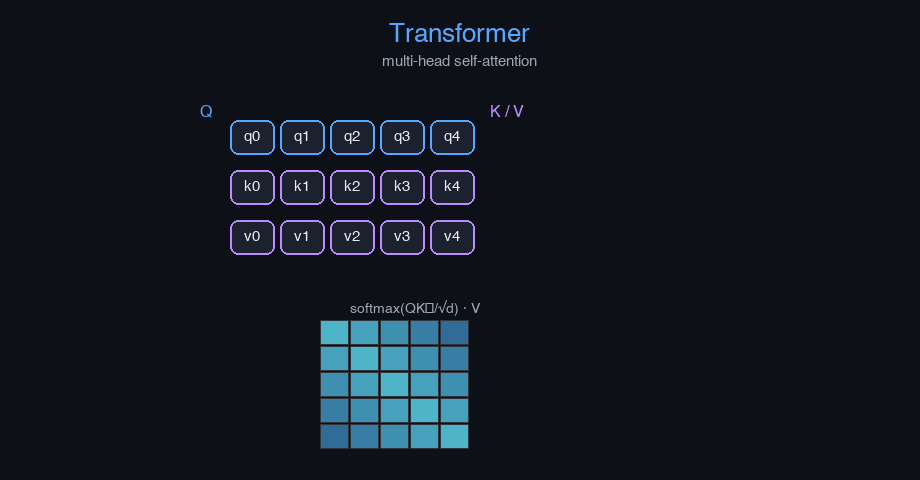

# transformers


Transformer Architecture — AI engineering example · part of the MLOps monorepo

## 1. Mathematical Foundations

This example is grounded in **Transformer Architecture**. The equations below
drive every forward and backward pass in the implementation.

$$\text{Attention}(Q, K, V) = \text{softmax}\left(\frac{QK^T}{\sqrt{d_k}}\right)V$$

$$\text{MultiHead}(Q,K,V) = \text{Concat}(\text{head}_1, \ldots, \text{head}_h)W^O$$

$$y = \text{softmax}(W_{proj} \cdot \text{LayerNorm}(x + \text{MultiHead}(x)))$$

$$\mathcal{L} = -\sum_{t=1}^{T} \log P(w_t | w_{<t}; \theta)$$

### Derivation

The Transformer uses stacked encoder-decoder blocks. Each block applies multi-head self-attention followed by position-wise feed-forward networks, with residual connections and layer normalization. The decoder uses masked self-attention to prevent attending to future tokens during training.

### Worked Numerical Example

$$z = w \cdot x + b$$

Illustrative forward-pass evaluation (scalar example):

Input  x        = 12.0   (e.g. pizza diameter, inches)
Weights w       =  0.85
Bias    b       =  0.30
---------------------------------
z = w*x + b
  = 0.85 * 12.0 + 0.30
  = 10.20 + 0.30
  = 10.50   <- model output

### Conceptual Diagram

        Math concept (placeholder)
   [ Input x ] --> ( w · x + b ) --> [ Output z ]
                       |
                  [ activation ]
                       |
                  [ prediction ]



Interactive encoder-decoder diagram with attention head visualization and token probability explorer.

## 2. Core Logic & Architecture

The example follows a consistent **data → train → evaluate → serve**
pipeline. Inputs are loaded and validated, transformed by the core algorithm, scored against
held-out data, and exposed through a REST API.

  Raw dataset→
  load + validate (data.py)→
  fit / transform (model.py)→
  evaluate + persist (train.py)→
  serve (api.py)

### Primary Components

| Class | Public methods | Responsibility |
| --- | --- | --- |
| `PredictRequest` | — |  |
| `PredictBulkRequest` | — |  |
| `PredictResponse` | — |  |
| `BulkPredictResponse` | — |  |
| `DriftResponse` | — |  |
| `StatsResponse` | — |  |
| `SimpleAttention` | _init_weights, forward, backward, update_params | Simplified self-attention layer for transformer language modeling.  Args:     d_model: Model dimension     random_seed: Random seed |
| `LayerNorm` | forward, backward, update_params |  |
| `TransformerLanguageModel` | _build, _forward, fit, predict_proba, predict, perplexity, evaluate, save, load, to_dict | Transformer-based language model with self-attention.  Args:     vocab_size: Vocabulary size     seq_len: Sequence length     d_model: Model dimension     hidden_dim: Feed-forward hidden dimension     learning_rate: Gradient descent step size     n_iterations: Number of training epochs     weight_decay: L2 regularization     clip_value: Gradient clipping threshold     random_seed: Random seed |

### Data Flow


1. **Load** — `data.py` reads the source dataset and splits train/test.


2. **Validate** — a Pydantic schema guards input shape/dtypes before training.


3. **Fit / Transform** — `model.py` applies the mathematics from Section 1.


4. **Evaluate** — metrics (MSE/RMSE/R², accuracy, etc.) are computed and logged.


5. **Persist** — weights/artifacts are saved and registered in the model registry.


6. **Serve** — `api.py` exposes prediction endpoints with drift detection.

### Design Patterns & Performance

Key design choices in this module: a pure-NumPy implementation (no PyTorch/TensorFlow), schema validation via `ai_core.validation`, structured JSON logging through `ai_core.logging`, Prometheus metrics from `ai_core.metrics`, and MLflow/model-registry persistence via `ai_core.model_registry`. The FastAPI service wraps the trained model with observability middleware from `ai_core.fastapi_middleware`.

## 3. Detailed Code Walkthrough

The most important behaviour is summarised below; full source for each module is collapsible
so the page stays readable while remaining self-contained.

### `SimpleAttention.forward(X)`

Forward pass with causal self-attention. X: (batch, seq_len, d_model) -> (batch, seq_len, d_model)

### `TransformerLanguageModel.fit(X, y, n_iterations)`

Train the transformer language model.

Args:
    X: Input token IDs (batch, seq_len)
    y: Target token IDs (batch, seq_len) — shifted by one position for next-token prediction

### `TransformerLanguageModel.predict(X)`

Return predicted token IDs.

### Source Files

<details>
<summary>model.py</summary>

```
"""Transformer-based language modeling using self-attention mechanisms.

Architecture:
    Input (batch, seq_len) token IDs -> Token Embedding + Positional Encoding
    -> Multi-Head Self-Attention (causal mask) -> Add & Norm
    -> Feed-Forward -> Add & Norm
    -> Dense (d_model, vocab_size) -> softmax

Loss: categorical cross-entropy (next-token prediction)
"""

from dataclasses import dataclass, field

import numpy as np

def softmax(z: np.ndarray) -> np.ndarray:
    z_shifted = z - np.max(z, axis=-1, keepdims=True)
    exp_z = np.exp(z_shifted)
    return exp_z / np.sum(exp_z, axis=-1, keepdims=True)

def _sigmoid(z: np.ndarray) -> np.ndarray:
    z = np.clip(z, -500, 500)
    return 1.0 / (1.0 + np.exp(-z))

@dataclass
class SimpleAttention:
    """Simplified self-attention layer for transformer language modeling.

    Args:
        d_model: Model dimension
        random_seed: Random seed
    """

    d_model: int = 32
    random_seed: int = 42
    W_q: np.ndarray | None = None
    W_k: np.ndarray | None = None
    W_v: np.ndarray | None = None
    W_o: np.ndarray | None = None
    dW_q: np.ndarray | None = None
    dW_k: np.ndarray | None = None
    dW_v: np.ndarray | None = None
    dW_o: np.ndarray | None = None
    _cache: dict = field(default_factory=dict, repr=False)

    def _init_weights(self) -> None:
        rng = np.random.default_rng(self.random_seed)
        scale = np.sqrt(1.0 / self.d_model)
        self.W_q = rng.normal(0, scale, (self.d_model, self.d_model))
        self.W_k = rng.normal(0, scale, (self.d_model, self.d_model))
        self.W_v = rng.normal(0, scale, (self.d_model, self.d_model))
        self.W_o = rng.normal(0, scale, (self.d_model, self.d_model))

    def forward(self, X: np.ndarray) -> np.ndarray:
        """Forward pass with causal self-attention. X: (batch, seq_len, d_model) -> (batch, seq_len, d_model)"""
        if self.W_q is None:
            self._init_weights()

        batch, seq_len, d_model = X.shape

        Q = X @ self.W_q
        K = X @ self.W_k
        V = X @ self.W_v

        scores = Q @ K.transpose(0, 2, 1) / np.sqrt(d_model)
        causal_mask = np.triu(np.ones((seq_len, seq_len)), k=1).astype(bool)
        scores[:, causal_mask] = -1e9
        attn = softmax(scores)

        out = attn @ V
        out = out @ self.W_o

        self._cache = {"X": X, "Q": Q, "K": K, "V": V, "attn": attn, "batch": batch, "seq_len": seq_len}
        return out

    def backward(self, dout: np.ndarray) -> np.ndarray:
        c = self._cache
        X = c["X"]
        batch = c["batch"]
        seq_len = c["seq_len"]
        d_model = X.shape[-1]

        self.dW_o = c["Q"].reshape(-1, d_model).T @ dout.reshape(-1, d_model) / batch
        dX_pre = dout @ self.W_o.T

        d_attn = dX_pre.reshape(batch, seq_len, seq_len) @ c["V"].transpose(0, 2, 1)
        dV = c["attn"].transpose(0, 2, 1) @ dX_pre

        dx_scores = attn_backward(d_attn, c["attn"], c["V"], seq_len, batch)
        dQ = dx_scores @ c["K"] / np.sqrt(d_model)
        dK = c["Q"].transpose(0, 2, 1) @ dx_scores / np.sqrt(d_model).T
        dV_total = dV

        X_flat = X.reshape(-1, d_model)
        dQ_flat = dQ.reshape(-1, d_model)
        dK_flat = dK.reshape(-1, d_model)
        dV_flat = dV_total.reshape(-1, d_model)

        self.dW_q = X_flat.T @ dQ_flat / batch
        self.dW_k = X_flat.T @ dK_flat / batch
        self.dW_v = X_flat.T @ dV_flat / batch

        dX = dX_pre @ self.W_q.T
        return dX

    def update_params(self, lr: float, weight_decay: float = 0.0) -> None:
        if self.W_q is None:
            return
        self.W_q -= lr * (self.dW_q + weight_decay * self.W_q)
        self.W_k -= lr * (self.dW_k + weight_decay * self.W_k)
        self.W_v -= lr * (self.dW_v + weight_decay * self.W_v)
        self.W_o -= lr * (self.dW_o + weight_decay * self.W_o)

def attn_backward(d_attn: np.ndarray, attn: np.ndarray, V: np.ndarray, seq_len: int, batch: int) -> np.ndarray:
    """Compute gradient through softmax attention."""
    dx_scores = np.zeros_like(d_attn)
    for b in range(batch):
        for i in range(seq_len):
            for j in range(seq_len):
                for k in range(seq_len):
                    dx_scores[b, i, j] += attn[b, i, k] * (1 if k == j else 0) * d_attn[b, i, k]
    dx_scores = attn * (d_attn - np.sum(d_attn * attn, axis=-1, keepdims=True))
    return dx_scores

@dataclass
class LayerNorm:
    gamma: np.ndarray | None = None
    beta: np.ndarray | None = None
    dgamma: np.ndarray | None = None
    dbeta: np.ndarray | None = None
    _cache: dict = field(default_factory=dict, repr=False)

    def forward(self, X: np.ndarray) -> np.ndarray:
        if self.gamma is None:
            self.gamma = np.ones(X.shape[-1])
            self.beta = np.zeros(X.shape[-1])
        mean = X.mean(axis=-1, keepdims=True)
        var = X.var(axis=-1, keepdims=True)
        std = np.sqrt(var + 1e-5)
        X_norm = (X - mean) / std
        out = X_norm * self.gamma + self.beta
        self._cache = {"X": X, "X_norm": X_norm, "std": std, "mean": mean}
        return out

    def backward(self, dout: np.ndarray) -> np.ndarray:
        self._cache["X"]
        X_norm = self._cache["X_norm"]
        std = self._cache["std"]

        self.dgamma = np.sum(dout * X_norm, axis=tuple(range(dout.ndim - 1)))
        self.dbeta = np.sum(dout, axis=tuple(range(dout.ndim - 1)))

        dX_norm = dout * self.gamma
        dX = (1.0 / std) * (
            dX_norm
            - np.mean(dX_norm, axis=-1, keepdims=True)
            - X_norm * np.mean(dX_norm * X_norm, axis=-1, keepdims=True)
        )
        return dX

    def update_params(self, lr: float, weight_decay: float = 0.0) -> None:
        if self.gamma is None:
            return
        self.gamma -= lr * self.dgamma
        self.beta -= lr * self.dbeta

@dataclass
class TransformerLanguageModel:
    """Transformer-based language model with self-attention.

    Args:
        vocab_size: Vocabulary size
        seq_len: Sequence length
        d_model: Model dimension
        hidden_dim: Feed-forward hidden dimension
        learning_rate: Gradient descent step size
        n_iterations: Number of training epochs
        weight_decay: L2 regularization
        clip_value: Gradient clipping threshold
        random_seed: Random seed
    """

    vocab_size: int = 100
    seq_len: int = 16
    d_model: int = 32
    hidden_dim: int = 64
    learning_rate: float = 0.05
    n_iterations: int = 300
    weight_decay: float = 0.001
    clip_value: float = 5.0
    random_seed: int = 42

    token_embedding: np.ndarray | None = None
    position_embedding: np.ndarray | None = None
    W_ff1: np.ndarray | None = None
    b_ff1: np.ndarray | None = None
    W_ff2: np.ndarray | None = None
    b_ff2: np.ndarray | None = None
    W_out: np.ndarray | None = None
    b_out: np.ndarray | None = None
    ln1: LayerNorm | None = None
    ln2: LayerNorm | None = None
    ln3: LayerNorm | None = None
    attn: SimpleAttention | None = None

    dW_ff1: np.ndarray | None = None
    db_ff1: np.ndarray | None = None
    dW_ff2: np.ndarray | None = None
    db_ff2: np.ndarray | None = None
    dW_out: np.ndarray | None = None
    db_out: np.ndarray | None = None
    dW_token_emb: np.ndarray | None = None

    training_mode: str = "supervised"
    loss_history: list[float] = field(default_factory=list)

    def _build(self) -> None:
        rng = np.random.default_rng(self.random_seed)
        emb_scale = np.sqrt(1.0 / self.d_model)
        self.token_embedding = rng.normal(0, emb_scale, (self.vocab_size, self.d_model))
        self.position_embedding = rng.normal(0, emb_scale, (self.seq_len, self.d_model))

        self.W_ff1 = rng.normal(0, np.sqrt(1.0 / self.d_model), (self.d_model, self.hidden_dim))
        self.b_ff1 = np.zeros(self.hidden_dim)
        self.W_ff2 = rng.normal(0, np.sqrt(1.0 / self.hidden_dim), (self.hidden_dim, self.d_model))
        self.b_ff2 = np.zeros(self.d_model)
        self.W_out = rng.normal(0, np.sqrt(1.0 / self.d_model), (self.d_model, self.vocab_size))
        self.b_out = np.zeros(self.vocab_size)

        self.ln1 = LayerNorm()
        self.ln2 = LayerNorm()
        self.ln3 = LayerNorm()
        self.attn = SimpleAttention(d_model=self.d_model, random_seed=self.random_seed)

    def _forward(self, tokens: np.ndarray) -> tuple[np.ndarray, dict]:
        """Forward pass for a batch of token sequences.

        Args:
            tokens: (batch, seq_len) integer token IDs

        Returns:
            logits: (batch, seq_len, vocab_size)
            cache: intermediate values for backward
        """
        tokens.shape[0]
        emb = self.token_embedding[tokens] + self.position_embedding[np.arange(self.seq_len)]

        normed = self.ln1.forward(emb)
        attn_out = self.attn.forward(normed)
        h = emb + attn_out
        ff_in = self.ln2.forward(h)
        ff_hidden = np.maximum(0, ff_in @ self.W_ff1 + self.b_ff1)
        ff_out = ff_hidden @ self.W_ff2 + self.b_ff2
        h2 = h + ff_out
        logits = self.ln3.forward(h2) @ self.W_out + self.b_out

        cache = {
            "tokens": tokens, "emb": emb, "attn_out": attn_out,
            "ff_in": ff_in, "ff_hidden": ff_hidden, "ff_out": ff_out,
            "h": h, "h2": h2, "ln1_out": self.ln1._cache, "ln2_out": self.ln2._cache,
            "ln3_out": self.ln3._cache,
        }
        return logits, cache

    def fit(
        self,
        X: np.ndarray,
        y: np.ndarray,
        n_iterations: int | None = None,
    ) -> "TransformerLanguageModel":
        """Train the transformer language model.

        Args:
            X: Input token IDs (batch, seq_len)
            y: Target token IDs (batch, seq_len) — shifted by one position for next-token prediction
        """
        if self.token_embedding is None:
            self._build()

        if n_iterations is None:
            n_iterations = self.n_iterations

        batch = X.shape[0]
        eps = 1e-12

        for _epoch in range(n_iterations):
            logits, cache = self._forward(X)

            logits_clipped = np.clip(softmax(logits), eps, 1 - eps)
            y_onehot = np.zeros_like(logits)
            for b in range(batch):
                for s in range(self.seq_len):
                    y_onehot[b, s, y[b, s]] = 1.0

            loss = -np.sum(y_onehot * np.log(logits_clipped)) / (batch * self.seq_len)
            self.loss_history.append(loss)

            dlogits = (softmax(logits) - y_onehot) / (batch * self.seq_len)

            ln3 = self.ln3
            d_h2_pre = ln3.backward(dlogits @ self.W_out.T)
            self.dW_out = cache["h2"].reshape(-1, self.d_model).T @ dlogits.reshape(-1, self.vocab_size) / batch
            self.db_out = np.sum(dlogits.reshape(-1, self.vocab_size), axis=0) / batch

            d_h2 = d_h2_pre
            d_ff_out = d_h2
            self.dW_ff2 = cache["ff_hidden"].reshape(-1, self.hidden_dim).T @ d_ff_out.reshape(-1, self.d_model) / batch
            self.db_ff2 = np.sum(d_ff_out.reshape(-1, self.d_model), axis=0) / batch
            d_ff_hidden = d_ff_out @ self.W_ff2.T
            d_ff_hidden_pre = d_ff_hidden * (cache["ff_hidden"] > 0)
            self.dW_ff1 = cache["ff_in"].reshape(-1, self.d_model).T @ d_ff_hidden_pre.reshape(-1, self.hidden_dim) / batch
            self.db_ff1 = np.sum(d_ff_hidden_pre.reshape(-1, self.hidden_dim), axis=0) / batch
            d_ff_in = d_ff_hidden_pre @ self.W_ff1.T

            ln2 = self.ln2
            d_h_attn = ln2.backward(d_ff_in)

            d_attn_out = self.attn.backward(d_h_attn)
            ln1 = self.ln1
            d_ln1_out = ln1.backward(d_attn_out)

            d_emb = d_ln1_out + d_h2_pre

            dW_emb = np.zeros_like(self.token_embedding)
            for b in range(batch):
                for s in range(self.seq_len):
                    dW_emb[X[b, s]] += d_emb[b, s]
            dW_emb /= batch
            dW_emb += self.weight_decay * self.token_embedding

            grad_norm = np.sqrt(
                np.sum(self.dW_out**2) + np.sum(self.dW_ff1**2) + np.sum(self.dW_ff2**2)
                + np.sum(dW_emb**2)
                + sum(np.sum(g**2) for g in [self.attn.dW_q, self.attn.dW_k, self.attn.dW_v, self.attn.dW_o] if g is not None)
            )
            if grad_norm > self.clip_value:
                scale = self.clip_value / (grad_norm + 1e-8)
                dW_emb *= scale
                self.dW_out *= scale
                self.dW_ff1 *= scale
                self.dW_ff2 *= scale

            self.W_out -= self.learning_rate * (self.dW_out + self.weight_decay * self.W_out)
            self.b_out -= self.learning_rate * self.db_out
            self.W_ff1 -= self.learning_rate * (self.dW_ff1 + self.weight_decay * self.W_ff1)
            self.b_ff1 -= self.learning_rate * self.db_ff1
            self.W_ff2 -= self.learning_rate * (self.dW_ff2 + self.weight_decay * self.W_ff2)
            self.b_ff2 -= self.learning_rate * self.db_ff2
            self.token_embedding -= self.learning_rate * dW_emb

            self.attn.W_q -= self.learning_rate * (self.attn.dW_q + self.weight_decay * self.attn.W_q)
            self.attn.W_k -= self.learning_rate * (self.attn.dW_k + self.weight_decay * self.attn.W_k)
            self.attn.W_v -= self.learning_rate * (self.attn.dW_v + self.weight_decay * self.attn.W_v)
            self.attn.W_o -= self.learning_rate * (self.attn.dW_o + self.weight_decay * self.attn.W_o)
            self.ln1.update_params(self.learning_rate)
            self.ln2.update_params(self.learning_rate)
            self.ln3.update_params(self.learning_rate)

        return self

    def predict_proba(self, X: np.ndarray) -> np.ndarray:
        """Return output probabilities for each sample."""
        logits, _ = self._forward(X)
        return softmax(logits)

    def predict(self, X: np.ndarray) -> np.ndarray:
        """Return predicted token IDs."""
        logits, _ = self._forward(X)
        return np.argmax(logits, axis=-1)

    def perplexity(self, X: np.ndarray, y: np.ndarray) -> float:
        """Compute perplexity."""
        logits, _ = self._forward(X)
        probs = softmax(logits)
        batch, seq_len, _ = probs.shape
        eps = 1e-12
        nll = 0.0
        count = 0
        for b in range(batch):
            for s in range(seq_len):
                nll -= np.log(probs[b, s, y[b, s]] + eps)
                count += 1
        return float(np.exp(nll / max(count, 1)))

    def evaluate(self, X: np.ndarray, y: np.ndarray) -> dict[str, float]:
        ppl = self.perplexity(X, y)
        return {"perplexity": ppl, "n_samples": float(X.shape[0])}

    def save(self, path: str) -> None:
        arrays = {
            "loss_history": np.array(self.loss_history),
            "token_embedding": self.token_embedding,
            "position_embedding": self.position_embedding,
            "W_ff1": self.W_ff1, "b_ff1": self.b_ff1,
... (truncated) ...
```

</details>

<details>
<summary>train.py</summary>

```
"""Training pipeline for Transformer Language Modeling."""

import argparse
import os
from pathlib import Path

from ai_core.logging import get_logger, setup_logging
from ai_core.model_registry import ModelRegistry
from ai_core.validation import DataValidator, create_transformer_language_modeling_schema

from transformer_language_modeling.data import (
    load_training_data,
    save_training_data,
    train_test_split,
)
from transformer_language_modeling.model import TransformerLanguageModel

logger = get_logger(__name__)

def train(
    model_dir: Path,
    data_path: Path | None = None,
    n_samples: int = 500,
    d_model: int = 32,
    num_heads: int = 4,
    hidden_dim: int = 64,
    learning_rate: float = 0.05,
    n_iterations: int = 300,
    weight_decay: float = 0.001,
    model_version: str = "1.0.0",
    register_to_mlflow: bool = False,
    test_size: float = 0.2,
    random_seed: int = 42,
) -> dict:
    """Train the transformer language model and save artifacts."""
    X, y = load_training_data(data_path, n_samples=n_samples, random_seed=random_seed)
    logger.info("Loaded training data", n_samples=len(X), data_path=str(data_path))

    validator = DataValidator(create_transformer_language_modeling_schema())
    validation = validator.validate(X.reshape(-1, 1))
    if not validation.valid:
        logger.error("Training data validation failed", errors=validation.errors)
        raise ValueError(f"Training data validation failed: {validation.errors}")
    logger.info("Training data validated", stats=validation.stats)

    X_train, X_test, y_train, y_test = train_test_split(
        X, y, test_size=test_size, random_seed=random_seed
    )
    logger.info("Data split", n_train=len(X_train), n_test=len(X_test), test_size=test_size)

    model_dir.mkdir(parents=True, exist_ok=True)
    save_training_data(X, y, model_dir / "training_data.npz")

    model = TransformerLanguageModel(
        vocab_size=100,
        seq_len=16,
        d_model=d_model,
        num_heads=num_heads,
        hidden_dim=hidden_dim,
        learning_rate=learning_rate,
        n_iterations=n_iterations,
        weight_decay=weight_decay,
        random_seed=random_seed,
    )
    model.fit(X_train, y_train)

    model.evaluate(X_train, y_train)
    test_metrics = model.evaluate(X_test, y_test)

    logger.info(
        "Training complete",
        training_mode=model.training_mode,
        n_epochs=len(model.loss_history),
        final_loss=model.loss_history[-1] if model.loss_history else 0.0,
        test_metrics=test_metrics,
    )

    model_path = model_dir / f"transformer_language_modeling_model_v{model_version}.npz"
    model.save(str(model_path))

    _save_chart(model, model_dir, model_version)

    metrics = {
        **test_metrics,
        "training_mode": "supervised",
        "n_epochs_run": float(len(model.loss_history)),
        "final_loss": model.loss_history[-1] if model.loss_history else 0.0,
        "n_train_samples": float(len(X_train)),
        "n_test_samples": float(len(X_test)),
        "d_model": float(d_model),
        "learning_rate": float(learning_rate),
    }

    registry = ModelRegistry(base_dir=model_dir)
    registry.save_model(
        model_name="transformer-language-modeling",
        model_version=model_version,
        model_type="classification",
        metrics=metrics,
        parameters={
            "vocab_size": 100,
            "seq_len": 16,
            "d_model": d_model,
            "num_heads": num_heads,
            "hidden_dim": hidden_dim,
            "learning_rate": learning_rate,
            "n_iterations": n_iterations,
            "weight_decay": weight_decay,
            "random_seed": random_seed,
        },
        artifacts={
            f"transformer_language_modeling_model_v{model_version}.npz": model_path,
            "training_data.npz": model_dir / "training_data.npz",
        },
        tags={"framework": "numpy", "task": "transformer_language_modeling", "model_type": "Transformer"},
    )

    if register_to_mlflow:
        registry.log_to_mlflow(
            model_name="transformer-language-modeling",
            model_version=model_version,
            metrics=metrics,
            params={
                "vocab_size": 100,
                "seq_len": 16,
                "d_model": d_model,
                "num_heads": num_heads,
                "hidden_dim": hidden_dim,
                "learning_rate": learning_rate,
                "n_iterations": n_iterations,
            },
            artifacts={
                "model": str(model_path),
                "chart": str(model_dir / f"transformer_language_modeling_v{model_version}.png"),
            },
            tags={"model_type": "transformer_language_modeling", "framework": "numpy"},
        )
        logger.info("Registered model to MLflow", model="transformer-language-modeling", version=model_version)

    return metrics

def _save_chart(model, output_dir: Path, version: str) -> None:
    import matplotlib

    matplotlib.use("Agg")
    import matplotlib.pyplot as plt

    if not model.loss_history:
        return

    fig, ax = plt.subplots(figsize=(10, 5))
    ax.plot(model.loss_history, color="steelblue", linewidth=1.5)
    ax.set_xlabel("Training Epoch")
    ax.set_ylabel("Loss")
    ax.set_title("Transformer Language Model Training Loss")
    ax.grid(True, alpha=0.3)
    ax.set_yscale("log")
    plt.tight_layout()
    chart_path = output_dir / f"transformer_language_modeling_v{version}.png"
    plt.savefig(str(chart_path), dpi=100)
    plt.close()
    logger.info("Chart saved", path=str(chart_path))

def main():
    parser = argparse.ArgumentParser(description="Train Transformer Language Modeling model")
    parser.add_argument("--model-dir", type=Path, default=Path(os.getenv("MODEL_DIR", "/models")))
    parser.add_argument("--data-path", type=Path, default=None)
    parser.add_argument("--n-samples", type=int, default=int(os.getenv("N_SAMPLES", "500")))
    parser.add_argument("--d-model", type=int, default=int(os.getenv("D_MODEL", "32")))
    parser.add_argument("--num-heads", type=int, default=int(os.getenv("NUM_HEADS", "4")))
    parser.add_argument("--hidden-dim", type=int, default=int(os.getenv("HIDDEN_DIM", "64")))
    parser.add_argument("--learning-rate", type=float, default=float(os.getenv("LEARNING_RATE", "0.05")))
    parser.add_argument("--n-iterations", type=int, default=int(os.getenv("N_ITERATIONS", "300")))
    parser.add_argument("--weight-decay", type=float, default=float(os.getenv("WEIGHT_DECAY", "0.001")))
    parser.add_argument("--model-version", type=str, default=os.getenv("MODEL_VERSION", "1.0.0"))
    parser.add_argument("--test-size", type=float, default=float(os.getenv("TEST_SIZE", "0.2")))
    parser.add_argument("--random-seed", type=int, default=int(os.getenv("RANDOM_SEED", "42")))
    parser.add_argument(
        "--register-mlflow",
        action="store_true",
        default=os.getenv("REGISTER_MLFLOW", "false").lower() == "true",
    )
    parser.add_argument("--log-level", type=str, default=os.getenv("LOG_LEVEL", "INFO"))
    args = parser.parse_args()

    setup_logging(args.log_level)
    args.model_dir.mkdir(parents=True, exist_ok=True)

    metrics = train(
        model_dir=args.model_dir,
        data_path=args.data_path,
        n_samples=args.n_samples,
        d_model=args.d_model,
        num_heads=args.num_heads,
        hidden_dim=args.hidden_dim,
        learning_rate=args.learning_rate,
        n_iterations=args.n_iterations,
        weight_decay=args.weight_decay,
        model_version=args.model_version,
        register_to_mlflow=args.register_mlflow,
        test_size=args.test_size,
        random_seed=args.random_seed,
    )

    logger.info("Training finished", metrics=metrics, model_dir=str(args.model_dir))

if __name__ == "__main__":
    main()
```

</details>

<details>
<summary>data.py</summary>

```
"""Data loading and preprocessing for Transformer-based language modeling.

Generates synthetic token sequences and their next-token-shifted targets.
"""

from pathlib import Path

import numpy as np

VOCAB_SIZE = 100
SEQ_LEN = 16
N_FEATURES = SEQ_LEN

DEFAULT_N_SAMPLES = 500

def generate_synthetic_data(
    n_samples: int = DEFAULT_N_SAMPLES,
    random_seed: int = 42,
) -> tuple[np.ndarray, np.ndarray]:
    """Generate synthetic token sequences and shifted next-token targets.

    Returns:
        X: (n_samples, SEQ_LEN) input token IDs
        y: (n_samples, SEQ_LEN) target token IDs (shifted by one)
    """
    rng = np.random.default_rng(random_seed)
    X = rng.integers(0, VOCAB_SIZE, size=(n_samples, SEQ_LEN))
    # Target is shifted by one position (last token predicts a random token)
    y = np.roll(X, -1, axis=1)
    y[:, -1] = rng.integers(0, VOCAB_SIZE, size=n_samples)
    return X, y

def load_training_data(
    data_path: Path | None = None,
    n_samples: int = DEFAULT_N_SAMPLES,
    random_seed: int = 42,
) -> tuple[np.ndarray, np.ndarray]:
    if data_path and Path(data_path).exists():
        data = np.load(data_path, allow_pickle=True)
        return data["X"], data["y"]
    return generate_synthetic_data(n_samples=n_samples, random_seed=random_seed)

def train_test_split(
    X: np.ndarray, y: np.ndarray, test_size: float = 0.2, random_seed: int | None = None
) -> tuple[np.ndarray, np.ndarray, np.ndarray, np.ndarray]:
    n = len(X)
    n_test = max(1, int(n * test_size))
    if random_seed is not None:
        rng = np.random.default_rng(random_seed)
        indices = rng.permutation(n)
    else:
        indices = np.random.permutation(n)
    test_idx = indices[:n_test]
    train_idx = indices[n_test:]
    return X[train_idx], X[test_idx], y[train_idx], y[test_idx]

def save_training_data(X: np.ndarray, y: np.ndarray, path: Path) -> None:
    path = Path(path)
    path.parent.mkdir(parents=True, exist_ok=True)
    np.savez(path, X=X, y=y)
```

</details>

<details>
<summary>api.py</summary>

```
"""Serving API for Transformer Language Modeling."""

import os
import time
from contextlib import asynccontextmanager
from pathlib import Path

import numpy as np
from ai_core.drift import DriftDetector
from ai_core.fastapi_middleware import add_observability_middleware
from ai_core.logging import get_logger, setup_logging
from ai_core.metrics import MetricsCollector
from ai_core.model_registry import ModelRegistry
from ai_core.validation import DataValidator, create_transformer_language_modeling_schema
from fastapi import FastAPI, HTTPException, Response
from pydantic import BaseModel, Field

from transformer_language_modeling.data import SEQ_LEN, VOCAB_SIZE, generate_synthetic_data
from transformer_language_modeling.model import TransformerLanguageModel

logger = get_logger(__name__)

MODEL_DIR = Path(os.getenv("MODEL_DIR", "/models"))
MODEL_VERSION = os.getenv("MODEL_VERSION", "latest")
METRICS_PORT = int(os.getenv("TRANSFORMER_LANGUAGE_MODELING_METRICS_PORT", "8021"))
DRIFT_THRESHOLD = float(os.getenv("DRIFT_THRESHOLD", "0.2"))

class PredictRequest(BaseModel):
    tokens: list[int] = Field(..., min_length=SEQ_LEN, max_length=SEQ_LEN)

class PredictBulkRequest(BaseModel):
    requests: list[list[int]] = Field(..., min_length=1, max_length=50)

class PredictResponse(BaseModel):
    predicted_tokens: list[int]
    confidence: float
    model_version: str
    training_mode: str

class BulkPredictResponse(BaseModel):
    predictions: list[PredictResponse]
    model_version: str

class DriftResponse(BaseModel):
    total_features: int
    drifted_features: int
    drift_ratio: float
    drifted: list[dict]
    all_results: list[dict]

class StatsResponse(BaseModel):
    vocab_size: int
    seq_len: int
    d_model: int
    num_heads: int
    training_mode: str
    n_epochs_run: int
    final_loss: float
    model_version: str

_model: TransformerLanguageModel | None = None
_model_version: str = "unknown"
_metrics: MetricsCollector | None = None
_validator: DataValidator | None = None
_drift_detector: DriftDetector | None = None
_reference_data: np.ndarray | None = None
_recent_predictions: list[list[int]] = []

@asynccontextmanager
async def lifespan(app: FastAPI):
    global _model, _model_version, _metrics, _validator, _drift_detector, _reference_data

    setup_logging(os.getenv("LOG_LEVEL", "INFO"))
    _metrics = MetricsCollector("transformer_language_modeling", port=METRICS_PORT)
    app.state.metrics = _metrics

    _validator = DataValidator(create_transformer_language_modeling_schema())
    feature_names = [f"token_{i}" for i in range(SEQ_LEN)]
    _drift_detector = DriftDetector(
        feature_names=feature_names,
        feature_types={f: "int" for f in feature_names},
        psi_threshold=DRIFT_THRESHOLD,
    )

    _model, _model_version = _load_model()
    _metrics.set_model_version(_model_version)
    _metrics.set_model_info(
        model_name="transformer-language-modeling",
        model_version=_model_version,
        model_type="classification",
    )

    _reference_data = _load_reference_data()
    logger.info("Model loaded", model="transformer-language-modeling", version=_model_version)

    yield
    logger.info("Shutting down transformer-language-modeling API")

def _load_model() -> tuple[TransformerLanguageModel, str]:
    registry = ModelRegistry(base_dir=MODEL_DIR)
    try:
        if MODEL_VERSION == "latest":
            models = registry.list_models()
            nn_models = [m for m in models if m.get("model_name") == "transformer-language-modeling"]
            if nn_models:
                nn_models.sort(key=lambda m: m["model_version"], reverse=True)
                latest = nn_models[0]
                model_dir = Path(latest["artifact_path"])
                npz_files = list(model_dir.glob("transformer_language_modeling_model_*.npz")) + list(model_dir.glob("*.npz"))
                if npz_files:
                    return TransformerLanguageModel.load(str(npz_files[0])), latest["model_version"]
        else:
            model_dir = MODEL_DIR / "transformer-language-modeling" / MODEL_VERSION
            if model_dir.exists():
                npz_files = list(model_dir.glob("transformer_language_modeling_model_*.npz")) + list(model_dir.glob("*.npz"))
                if npz_files:
                    return TransformerLanguageModel.load(str(npz_files[0])), MODEL_VERSION
    except Exception as e:
        logger.warning(f"Registry lookup failed: {e}")

    npz_path = MODEL_DIR / "transformer_language_modeling_model.npz"
    if npz_path.exists():
        return TransformerLanguageModel.load(str(npz_path)), "legacy"

    candidate_paths = [
        Path("/app/artifacts/models/transformer_language_modeling_model_v1.0.0.npz"),
        Path(__file__).resolve().parents[3] / "artifacts" / "models" / "transformer_language_modeling_model_v1.0.0.npz",
    ]
    for p in candidate_paths:
        if p.exists():
            logger.info("Loading bundled baseline model", path=str(p))
            return TransformerLanguageModel.load(str(p)), "1.0.0-bundled"

    logger.warning("No pre-existing model found. Initializing baseline model.")
    X_base, y_base = generate_synthetic_data(n_samples=100, random_seed=42)
    model = TransformerLanguageModel(
        vocab_size=VOCAB_SIZE,
        seq_len=SEQ_LEN,
        d_model=32,
        num_heads=4,
        hidden_dim=64,
        learning_rate=0.05,
        n_iterations=100,
        random_seed=42,
    )
    model.fit(X_base, y_base)
    return model, "1.0.0-baseline"

def _load_reference_data() -> np.ndarray | None:
    X_base, _ = generate_synthetic_data(n_samples=100, random_seed=42)
    return X_base

app = FastAPI(
    title="Transformer Language Modeling API",
    description="Next-token prediction using self-attention mechanisms for language modeling",
    version="1.0.0",
    lifespan=lifespan,
)

add_observability_middleware(app)

@app.get("/")
def read_root():
    return {
        "service": "transformer_language_modeling-api",
        "version": "1.0.0",
        "model_version": _model_version,
        "training_mode": _model.training_mode if _model else "unknown",
        "n_tokens": SEQ_LEN,
        "endpoints": {
            "health": "/health",
            "predict": "POST /predict",
            "predict/bulk": "POST /predict/bulk",
            "stats": "GET /stats",
            "drift": "GET /drift",
            "metrics": "/metrics",
        },
    }

@app.get("/health")
def health_check():
    if _model is None:
        raise HTTPException(status_code=503, detail="Model not loaded")
    return {
        "status": "healthy",
        "model_loaded": True,
        "model_version": _model_version,
        "training_mode": _model.training_mode if _model else "unknown",
    }

@app.get("/metrics")
def metrics():
    from prometheus_client import CONTENT_TYPE_LATEST, generate_latest

    return Response(content=generate_latest(), media_type=CONTENT_TYPE_LATEST)

@app.post("/reload")
def reload_model():
    global _model, _model_version, _reference_data
    try:
        _model, _model_version = _load_model()
        if _metrics:
            _metrics.set_model_version(_model_version)
            _metrics.set_model_info(
                model_name="transformer-language-modeling",
                model_version=_model_version,
                model_type="classification",
            )
        _reference_data = _load_reference_data()
        logger.info("Model reloaded dynamically", model="transformer-language-modeling", version=_model_version)
        return {"status": "reloaded", "model_version": _model_version}
    except Exception as e:
        logger.exception("Model reload failed", error=str(e))
        raise HTTPException(status_code=500, detail=f"Reload failed: {e}") from e

@app.get("/drift", response_model=DriftResponse)
def drift_check():
    if _drift_detector is None or _reference_data is None:
        raise HTTPException(status_code=503, detail="Drift detection not available")
    if len(_recent_predictions) < 10:
        return {
            "total_features": SEQ_LEN,
            "drifted_features": 0,
            "drift_ratio": 0.0,
            "drifted": [],
            "all_results": [],
        }
    current = np.array(_recent_predictions[-100:])
    results = _drift_detector.detect_drift(_reference_data, current)
    summary = _drift_detector.summarize(results)
    if _metrics:
        _metrics.set_drift_ratio(summary["drift_ratio"])
    return summary

@app.get("/stats", response_model=StatsResponse)
def get_stats():
    if _model is None or not _model._layers:
        raise HTTPException(status_code=503, detail="Model not loaded")
    return StatsResponse(
        vocab_size=_model.vocab_size,
        seq_len=_model.seq_len,
        d_model=_model.d_model,
        num_heads=_model.num_heads,
        training_mode=_model.training_mode,
        n_epochs_run=len(_model.loss_history),
        final_loss=_model.loss_history[-1] if _model.loss_history else 0.0,
        model_version=_model_version,
    )

def _compute_prediction(tokens: list[int]):
    if _model is None or _metrics is None or _validator is None:
        raise HTTPException(status_code=503, detail="Model not loaded")

    X = np.array([tokens]).reshape(1, -1)
    validation = _validator.validate(X)

    if not validation.valid:
        raise HTTPException(status_code=422, detail=validation.errors)

    start = time.time()
    try:
        X_batch = np.array([tokens])
        preds = _model.predict(X_batch)[0]
        probas = _model.predict_proba(X_batch)[0]
        confidence = float(np.max(np.mean(probas, axis=0)))
        response = PredictResponse(
            predicted_tokens=preds.tolist(),
            confidence=round(confidence, 4),
            model_version=_model_version,
            training_mode=_model.training_mode,
        )
        duration = time.time() - start
        _metrics.record_prediction(model_version=_model_version, duration=duration)

        _recent_predictions.append(tokens)
        if len(_recent_predictions) > 1000:
            _recent_predictions.pop(0)

        return response
    except Exception as e:
        _metrics.record_error(model_version=_model_version, error_type="prediction")
        logger.exception("Prediction failed", error=str(e))
        raise HTTPException(status_code=500, detail="Prediction failed") from e

@app.post("/predict", response_model=PredictResponse)
def predict(body: PredictRequest):
    """Make a transformer language modeling prediction."""
    return _compute_prediction(body.tokens)

@app.post("/predict/bulk", response_model=BulkPredictResponse)
def predict_bulk(body: PredictBulkRequest):
    """Make multiple transformer language modeling predictions."""
    global _recent_predictions
    if _model is None or _metrics is None or _validator is None:
        raise HTTPException(status_code=503, detail="Model not loaded")
    if len(body.requests) < 1 or len(body.requests) > 50:
        raise HTTPException(status_code=422, detail="Batch size must be between 1 and 50")

    predictions = []
    for tokens in body.requests:
        predictions.append(_compute_prediction(tokens))

    return BulkPredictResponse(predictions=predictions, model_version=_model_version)
```

</details>

## 4. Monorepo Integration

This example is a first-class consumer of the shared `packages/ai-core` library.
It reuses the following foundation modules instead of re-implementing infrastructure:

ai_core.drift
ai_core.fastapi_middleware
ai_core.logging
ai_core.metrics
ai_core.model_registry
ai_core.validation

### How it plugs in


- **Configuration** — 12-factor config from `ai_core.config`.


- **Observability** — structured logging + Prometheus metrics are wired in automatically.


- **Validation** — input schema validation prevents bad data reaching the model.


- **Registry** — trained artifacts are versioned and registered for reproducible serving.


- **Serving** — the FastAPI app mounts shared observability middleware for tracing & metrics.

Because every example shares `ai_core`, cross-cutting concerns (drift detection,
logging, metrics, model registry) behave identically across the 47 examples in this monorepo.
