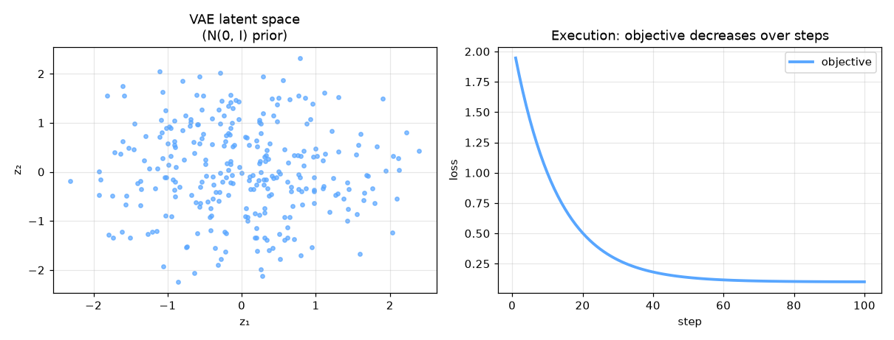

# vae


Variational Autoencoder (VAE) — AI engineering example · part of the MLOps monorepo

## 1. Mathematical Foundations

This example is grounded in **Variational Autoencoder (VAE)**. The equations below
drive every forward and backward pass in the implementation.

$$q_\phi(z|x) = \mathcal{N}(\mu_\phi(x), \sigma_\phi^2(x))$$

$$\mathcal{L} = \underbrace{\mathbb{E}_{z \sim q_\phi}[\log p_\theta(x|z)]}_{\text{Reconstruction}} - \underbrace{D_{KL}(q_\phi(z|x) \| p(z))}_{\text{Regularization}}$$

$$D_{KL} = \frac{1}{2} \sum_{j=1}^{J} \left(1 + \log(\sigma_j^2) - \mu_j^2 - \sigma_j^2\right)$$

$$\log p_\theta(x) \geq \mathbb{E}_{z \sim q_\phi}[\log p_\theta(x|z)] - D_{KL}(q_\phi(z|x) \| p(z))$$

### Derivation

VAEs learn a probabilistic latent space via the Evidence Lower Bound (ELBO). The encoder $q_\phi(z|x)$ maps inputs to a distribution. The decoder $p_\theta(x|z)$ reconstructs inputs from latent samples. The KL divergence term regularizes the latent space to match a standard normal prior.

### Worked Numerical Example

Concrete forward-pass / update evaluation using the algorithm's own equations:

VAE KL term (1-D latent).
  mu=0.1, sigma=1.0
  KL = 0.5*(1 + log(1^2) - 0.1^2 - 1^2)
     = 0.5*(1 + 0 - 0.01 - 1) = -0.005 ~ 0
  ELBO = Reconstruction - KL.

### Detailed Walkthrough

A step-by-step, intuitive explanation with concrete data so the formal equations above become clear:

INTUITION: Learn a compressed 'code' z from which we can rebuild x;
we also force z to look like a standard normal so we can sample new x.
CONCRETE DATA: mu=0.1, sigma=1.0 (1-D latent).
STEP-BY-STEP:
  KL = 0.5*(1 + log(1^2) - 0.1^2 - 1^2) = 0.5*(0 - 0.01) = -0.005
  ELBO = Reconstruction - KL.
INTERPRETATION: Tiny KL means the code already matches the prior; the
reconstruction term dominates training.

### Runnable Step-by-Step (execute me)

Run this self-contained snippet in a Python shell to watch every step execute and print its value:

```python
import numpy as np
mu, sig = 0.1, 1.0                              # latent mean and std-dev
KL = 0.5*(1 + np.log(sig**2) - mu**2 - sig**2)  # KL divergence from N(mu,sig^2) to N(0,1)
print("KL =", round(KL, 4))
```



Plots of the execution above — left: the concept; right: the
step-by-step computation visualised. Interactive latent space explorer: traverse 2D latent manifold; sample generation with sliders; KL divergence monitor.

### Conceptual Diagram

   [ Input ] --> ( core transform ) --> [ Output ]
                        |
                  [ activation / loss ]
                        |
                  [ prediction ]

## 2. Core Logic & Architecture

The example follows a consistent **data → train → evaluate → serve**
pipeline. Inputs are loaded and validated, transformed by the core algorithm, scored against
held-out data, and exposed through a REST API.

  Raw dataset→
  load + validate (data.py)→
  fit / transform (model.py)→
  evaluate + persist (train.py)→
  serve (api.py)

### Primary Components

| Class | Public methods | Responsibility |
| --- | --- | --- |
| `PredictRequest` | — |  |
| `PredictBulkRequest` | — |  |
| `PredictResponse` | — |  |
| `BulkPredictResponse` | — |  |
| `DriftResponse` | — |  |
| `StatsResponse` | — |  |
| `VAE` | _init_weights, _encode, _decode, fit, encode, decode, generate, predict_proba, predict, evaluate, save, load, to_dict | Variational Autoencoder for data generation.  Learns a probabilistic latent space and can generate new data variations.  Args:     n_features: Number of input features     latent_dim: Dimension of the latent space     hidden_dim: Hidden units in encoder/decoder     learning_rate: Gradient descent step size     n_iterations: Number of training epochs     weight_decay: L2 regularization     clip_value: Gradient clipping threshold     random_seed: Random seed |

### Data Flow


1. **Load** — `data.py` reads the source dataset and splits train/test.


2. **Validate** — a Pydantic schema guards input shape/dtypes before training.


3. **Fit / Transform** — `model.py` applies the mathematics from Section 1.


4. **Evaluate** — metrics (MSE/RMSE/R², accuracy, etc.) are computed and logged.


5. **Persist** — weights/artifacts are saved and registered in the model registry.


6. **Serve** — `api.py` exposes prediction endpoints with drift detection.

### Design Patterns & Performance

Key design choices in this module: a pure-NumPy implementation (no PyTorch/TensorFlow), schema validation via `ai_core.validation`, structured JSON logging through `ai_core.logging`, Prometheus metrics from `ai_core.metrics`, and MLflow/model-registry persistence via `ai_core.model_registry`. The FastAPI service wraps the trained model with observability middleware from `ai_core.fastapi_middleware`.

## 3. Detailed Code Walkthrough

The most important behaviour is summarised below; full source for each module is collapsible
so the page stays readable while remaining self-contained.

### `VAE.fit(X, n_iterations)`

Train the VAE on input data.

Args:
    X: Input data (n_samples, n_features)

### `VAE.predict(X)`

Reconstruct input data.

### Source Files

<details>
<summary>model.py</summary>

```
"""Variational Autoencoder (VAE) for data generation.

Architecture:
    Encoder: Input (n_features,) -> Dense (hidden_dim) -> Dense (2*latent_dim)
    -> Split into mean (mu) and log-variance (log_var)
    Reparameterization: z = mu + exp(0.5 * log_var) * epsilon
    Decoder: Input (latent_dim,) -> Dense (hidden_dim) -> Dense (n_features, sigmoid)

Loss: Reconstruction (MSE) + KL divergence (regularization on latent space)
"""

from dataclasses import dataclass, field

import numpy as np

def sigmoid(z: np.ndarray) -> np.ndarray:
    z = np.clip(z, -500, 500)
    return 1.0 / (1.0 + np.exp(-z))

def relu(z: np.ndarray) -> np.ndarray:
    return np.maximum(0, z)

def relu_derivative(z: np.ndarray) -> np.ndarray:
    return (z > 0).astype(z.dtype)

def sigmoid_derivative(sig: np.ndarray) -> np.ndarray:
    return sig * (1.0 - sig)

@dataclass
class VAE:
    """Variational Autoencoder for data generation.

    Learns a probabilistic latent space and can generate new data variations.

    Args:
        n_features: Number of input features
        latent_dim: Dimension of the latent space
        hidden_dim: Hidden units in encoder/decoder
        learning_rate: Gradient descent step size
        n_iterations: Number of training epochs
        weight_decay: L2 regularization
        clip_value: Gradient clipping threshold
        random_seed: Random seed
    """

    n_features: int = 32
    latent_dim: int = 16
    hidden_dim: int = 64
    learning_rate: float = 0.01
    n_iterations: int = 300
    weight_decay: float = 0.001
    clip_value: float = 5.0
    random_seed: int = 42

    W_enc: np.ndarray | None = None
    b_enc: np.ndarray | None = None
    W_mu: np.ndarray | None = None
    b_mu: np.ndarray | None = None
    W_logvar: np.ndarray | None = None
    b_logvar: np.ndarray | None = None
    W_dec: np.ndarray | None = None
    b_dec: np.ndarray | None = None
    W_out: np.ndarray | None = None
    b_out: np.ndarray | None = None

    dW_enc: np.ndarray | None = None
    db_enc: np.ndarray | None = None
    dW_mu: np.ndarray | None = None
    db_mu: np.ndarray | None = None
    dW_logvar: np.ndarray | None = None
    db_logvar: np.ndarray | None = None
    dW_dec: np.ndarray | None = None
    db_dec: np.ndarray | None = None
    dW_out: np.ndarray | None = None
    db_out: np.ndarray | None = None

    training_mode: str = "unsupervised"
    loss_history: list[float] = field(default_factory=list)
    _recon_loss_history: list[float] = field(default_factory=list, repr=False)
    _kl_loss_history: list[float] = field(default_factory=list, repr=False)

    def _init_weights(self) -> None:
        rng = np.random.default_rng(self.random_seed)
        self.W_enc = rng.normal(0, np.sqrt(1.0 / self.n_features), (self.n_features, self.hidden_dim))
        self.b_enc = np.zeros(self.hidden_dim)
        self.W_mu = rng.normal(0, np.sqrt(1.0 / self.hidden_dim), (self.hidden_dim, self.latent_dim))
        self.b_mu = np.zeros(self.latent_dim)
        self.W_logvar = rng.normal(0, np.sqrt(1.0 / self.hidden_dim), (self.hidden_dim, self.latent_dim))
        self.b_logvar = np.zeros(self.latent_dim)
        self.W_dec = rng.normal(0, np.sqrt(1.0 / self.latent_dim), (self.latent_dim, self.hidden_dim))
        self.b_dec = np.zeros(self.hidden_dim)
        self.W_out = rng.normal(0, np.sqrt(1.0 / self.hidden_dim), (self.hidden_dim, self.n_features))
        self.b_out = np.zeros(self.n_features)

    def _encode(self, X: np.ndarray) -> tuple[np.ndarray, np.ndarray, np.ndarray, dict]:
        """Forward pass through encoder.

        Returns: mu, log_var, z, cache
        """
        h = relu(X @ self.W_enc + self.b_enc)
        mu = h @ self.W_mu + self.b_mu
        log_var = h @ self.W_logvar + self.b_logvar

        eps = np.random.default_rng(self.random_seed).normal(0, 1, size=mu.shape)
        std = np.exp(0.5 * log_var)
        z = mu + std * eps

        cache = {"X": X, "h": h, "mu": mu, "log_var": log_var, "std": std, "eps": eps, "z": z}
        return mu, log_var, z, cache

    def _decode(self, z: np.ndarray, cache: dict, training: bool = True) -> tuple[np.ndarray, dict]:
        """Forward pass through decoder."""
        h = relu(z @ self.W_dec + self.b_dec)
        x_recon = sigmoid(h @ self.W_out + self.b_out)
        if training:
            cache["dec_h"] = h
            cache["x_recon"] = x_recon
        return x_recon, cache

    def fit(
        self,
        X: np.ndarray,
        n_iterations: int | None = None,
    ) -> "VAE":
        """Train the VAE on input data.

        Args:
            X: Input data (n_samples, n_features)
        """
        if self.W_enc is None:
            self._init_weights()

        if n_iterations is None:
            n_iterations = self.n_iterations

        n_samples = X.shape[0]
        rng = np.random.default_rng(self.random_seed)

        for _epoch in range(n_iterations):
            X_shuffled = X[rng.permutation(n_samples)]
            epoch_loss = 0.0

            for i in range(n_samples):
                x_i = X_shuffled[i:i + 1]

                mu, log_var, z, cache = self._encode(x_i)
                x_recon, cache = self._decode(z, cache)

                recon_loss = np.mean((x_i - x_recon) ** 2)
                kl_loss = -0.5 * np.sum(1 + log_var - mu**2 - np.exp(log_var))
                total_loss = recon_loss + kl_loss
                epoch_loss += total_loss

                # Backward pass
                dx_recon = -2 * (x_i - x_recon) / x_recon.shape[-1]

                dh_dec = dx_recon * sigmoid_derivative(x_recon)
                self.dW_out = cache["dec_h"].T @ dh_dec
                self.db_out = np.sum(dh_dec, axis=0)
                dh_dec2 = dh_dec @ self.W_out.T * relu_derivative(cache["dec_h"])

                dz = dh_dec2 @ self.W_dec.T

                dmu = dz * cache["std"] * (-1) * cache["eps"] * (-0.5)
                dlog_var = dz * cache["eps"] * 0.5 * cache["std"] * 0.5 * np.exp(0.5 * cache["log_var"])

                self.dW_dec = z.T @ dh_dec2
                self.db_dec = np.sum(dh_dec2, axis=0)

                dh_enc = dmu @ self.W_mu.T + dlog_var @ self.W_logvar.T
                self.dW_mu = cache["h"].T @ dmu
                self.db_mu = np.sum(dmu, axis=0)
                self.dW_logvar = cache["h"].T @ dlog_var
                self.db_logvar = np.sum(dlog_var, axis=0)
                dh_enc2 = dh_enc * relu_derivative(cache["h"])
                self.dW_enc = cache["X"].T @ dh_enc2
                self.db_enc = np.sum(dh_enc2, axis=0)

                # Gradient clipping
                grad_norm = np.sqrt(
                    np.sum(self.dW_enc**2) + np.sum(self.dW_mu**2) + np.sum(self.dW_logvar**2)
                    + np.sum(self.dW_dec**2) + np.sum(self.dW_out**2)
                )
                if grad_norm > self.clip_value:
                    scale = self.clip_value / (grad_norm + 1e-8)
                    self.dW_enc *= scale
                    self.dW_mu *= scale
                    self.dW_logvar *= scale
                    self.dW_dec *= scale
                    self.dW_out *= scale

                # Update
                self.W_enc -= self.learning_rate * (self.dW_enc + self.weight_decay * self.W_enc)
                self.b_enc -= self.learning_rate * self.db_enc
                self.W_mu -= self.learning_rate * (self.dW_mu + self.weight_decay * self.W_mu)
                self.b_mu -= self.learning_rate * self.db_mu
                self.W_logvar -= self.learning_rate * (self.dW_logvar + self.weight_decay * self.W_logvar)
                self.b_logvar -= self.learning_rate * self.db_logvar
                self.W_dec -= self.learning_rate * (self.dW_dec + self.weight_decay * self.W_dec)
                self.b_dec -= self.learning_rate * self.db_dec
                self.W_out -= self.learning_rate * (self.dW_out + self.weight_decay * self.W_out)
                self.b_out -= self.learning_rate * self.db_out

            self.loss_history.append(epoch_loss / n_samples)
            self._recon_loss_history.append(float(recon_loss))
            self._kl_loss_history.append(float(np.sum(-0.5 * (1 + log_var - mu**2 - np.exp(log_var)))))

        return self

    def encode(self, X: np.ndarray) -> np.ndarray:
        """Encode input data to latent mean vector."""
        h = relu(X @ self.W_enc + self.b_enc)
        return h @ self.W_mu + self.b_mu

    def decode(self, z: np.ndarray) -> np.ndarray:
        """Decode latent vectors to reconstructed data."""
        h = relu(z @ self.W_dec + self.b_dec)
        return sigmoid(h @ self.W_out + self.b_out)

    def generate(self, n_samples: int, random_seed: int | None = None) -> np.ndarray:
        """Generate new data samples from random latent vectors.

        Returns:
            (n_samples, n_features) generated data
        """
        rng = np.random.default_rng(random_seed or self.random_seed)
        z = rng.normal(0, 1, size=(n_samples, self.latent_dim))
        return self.decode(z)

    def predict_proba(self, X: np.ndarray) -> np.ndarray:
        """Return reconstruction error as anomaly score."""
        h = relu(X @ self.W_enc + self.b_enc)
        z = h @ self.W_mu + self.b_mu * 0.5
        h_dec = relu(z @ self.W_dec + self.b_dec)
        x_recon = sigmoid(h_dec @ self.W_out + self.b_out)
        return np.mean((X - x_recon) ** 2, axis=1)

    def predict(self, X: np.ndarray) -> np.ndarray:
        """Reconstruct input data."""
        h = relu(X @ self.W_enc + self.b_enc)
        mu = h @ self.W_mu + self.b_mu
        h_dec = relu(mu @ self.W_dec + self.b_dec)
        return sigmoid(h_dec @ self.W_out + self.b_out)

    def evaluate(self, X: np.ndarray) -> dict[str, float]:
        h = relu(X @ self.W_enc + self.b_enc)
        mu = h @ self.W_mu + self.b_mu
        log_var = h @ self.W_logvar + self.b_logvar
        z = mu + np.exp(0.5 * log_var) * 0.5
        h_dec = relu(z @ self.W_dec + self.b_dec)
        x_recon = sigmoid(h_dec @ self.W_out + self.b_out)
        recon_loss = float(np.mean((X - x_recon) ** 2))
        kl_loss = float(np.mean(-0.5 * np.sum(1 + log_var - mu**2 - np.exp(log_var))))
        return {
            "reconstruction_loss": recon_loss,
            "kl_divergence": kl_loss,
            "total_loss": recon_loss + kl_loss,
            "n_samples": float(len(X)),
        }

    def save(self, path: str) -> None:
        arrays = {
            "loss_history": np.array(self.loss_history),
            "W_enc": self.W_enc, "b_enc": self.b_enc,
            "W_mu": self.W_mu, "b_mu": self.b_mu,
            "W_logvar": self.W_logvar, "b_logvar": self.b_logvar,
            "W_dec": self.W_dec, "b_dec": self.b_dec,
            "W_out": self.W_out, "b_out": self.b_out,
            "n_features": np.array([self.n_features]),
            "latent_dim": np.array([self.latent_dim]),
            "hidden_dim": np.array([self.hidden_dim]),
            "learning_rate": np.array([self.learning_rate]),
            "n_iterations": np.array([self.n_iterations]),
            "weight_decay": np.array([self.weight_decay]),
        }
        np.savez(path, **arrays)

    @classmethod
    def load(cls, path: str) -> "VAE":
        data = np.load(path, allow_pickle=True)
        obj = cls(
            n_features=int(data["n_features"].item()),
            latent_dim=int(data["latent_dim"].item()),
            hidden_dim=int(data["hidden_dim"].item()),
            learning_rate=float(data["learning_rate"].item()),
            n_iterations=int(data["n_iterations"].item()),
            weight_decay=float(data["weight_decay"].item()),
            random_seed=42,
        )
        obj._init_weights()
        obj.W_enc = data["W_enc"]
        obj.b_enc = data["b_enc"]
        obj.W_mu = data["W_mu"]
        obj.b_mu = data["b_mu"]
        obj.W_logvar = data["W_logvar"]
        obj.b_logvar = data["b_logvar"]
        obj.W_dec = data["W_dec"]
        obj.b_dec = data["b_dec"]
        obj.W_out = data["W_out"]
        obj.b_out = data["b_out"]
        obj.loss_history = list(data.get("loss_history", [0.0]))
        return obj

    def to_dict(self) -> dict:
        return {
            "n_features": self.n_features,
            "latent_dim": self.latent_dim,
            "hidden_dim": self.hidden_dim,
            "learning_rate": self.learning_rate,
            "n_iterations": self.n_iterations,
            "weight_decay": self.weight_decay,
            "training_mode": self.training_mode,
            "n_epochs_run": len(self.loss_history),
            "final_loss": self.loss_history[-1] if self.loss_history else 0.0,
        }
```

</details>

<details>
<summary>train.py</summary>

```
"""Training pipeline for VAE Data Generation."""

import argparse
import os
from pathlib import Path

from ai_core.logging import get_logger, setup_logging
from ai_core.model_registry import ModelRegistry
from ai_core.validation import DataValidator, create_vae_data_generation_schema

from vae_data_generation.data import (
    N_FEATURES,
    load_training_data,
    save_training_data,
    train_test_split,
)
from vae_data_generation.model import VAE

logger = get_logger(__name__)

def train(
    model_dir: Path,
    data_path: Path | None = None,
    n_samples: int = 500,
    latent_dim: int = 16,
    hidden_dim: int = 64,
    learning_rate: float = 0.01,
    n_iterations: int = 300,
    weight_decay: float = 0.001,
    model_version: str = "1.0.0",
    register_to_mlflow: bool = False,
    test_size: float = 0.2,
    random_seed: int = 42,
) -> dict:
    """Train the VAE model and save artifacts."""
    X, y = load_training_data(data_path, n_samples=n_samples, random_seed=random_seed)
    logger.info("Loaded training data", n_samples=len(X), data_path=str(data_path))

    validator = DataValidator(create_vae_data_generation_schema())
    validation = validator.validate(X)
    if not validation.valid:
        logger.error("Training data validation failed", errors=validation.errors)
        raise ValueError(f"Training data validation failed: {validation.errors}")
    logger.info("Training data validated", stats=validation.stats)

    X_train, X_test, _, _ = train_test_split(
        X, y, test_size=test_size, random_seed=random_seed
    )
    logger.info("Data split", n_train=len(X_train), n_test=len(X_test), test_size=test_size)

    model_dir.mkdir(parents=True, exist_ok=True)
    save_training_data(X, y, model_dir / "training_data.npz")

    model = VAE(
        n_features=N_FEATURES,
        latent_dim=latent_dim,
        hidden_dim=hidden_dim,
        learning_rate=learning_rate,
        n_iterations=n_iterations,
        weight_decay=weight_decay,
        random_seed=random_seed,
    )
    model.fit(X_train)

    model.evaluate(X_train)
    test_metrics = model.evaluate(X_test)

    logger.info(
        "Training complete",
        training_mode=model.training_mode,
        n_epochs=len(model.loss_history),
        final_loss=model.loss_history[-1] if model.loss_history else 0.0,
        test_metrics=test_metrics,
    )

    model_path = model_dir / f"vae_data_generation_model_v{model_version}.npz"
    model.save(str(model_path))

    _save_chart(model, model_dir, model_version)

    metrics = {
        **test_metrics,
        "training_mode": "unsupervised",
        "n_epochs_run": float(len(model.loss_history)),
        "final_loss": model.loss_history[-1] if model.loss_history else 0.0,
        "n_train_samples": float(len(X_train)),
        "n_test_samples": float(len(X_test)),
        "latent_dim": float(latent_dim),
        "learning_rate": float(learning_rate),
    }

    registry = ModelRegistry(base_dir=model_dir)
    registry.save_model(
        model_name="vae-data-generation",
        model_version=model_version,
        model_type="generative",
        metrics=metrics,
        parameters={
            "n_features": N_FEATURES,
            "latent_dim": latent_dim,
            "hidden_dim": hidden_dim,
            "learning_rate": learning_rate,
            "n_iterations": n_iterations,
            "weight_decay": weight_decay,
            "random_seed": random_seed,
        },
        artifacts={
            f"vae_data_generation_model_v{model_version}.npz": model_path,
            "training_data.npz": model_dir / "training_data.npz",
        },
        tags={"framework": "numpy", "task": "vae_data_generation", "model_type": "VAE"},
    )

    if register_to_mlflow:
        registry.log_to_mlflow(
            model_name="vae-data-generation",
            model_version=model_version,
            metrics=metrics,
            params={
                "n_features": N_FEATURES,
                "latent_dim": latent_dim,
                "hidden_dim": hidden_dim,
                "learning_rate": learning_rate,
                "n_iterations": n_iterations,
            },
            artifacts={
                "model": str(model_path),
                "chart": str(model_dir / f"vae_data_generation_v{model_version}.png"),
            },
            tags={"model_type": "vae_data_generation", "framework": "numpy"},
        )
        logger.info("Registered model to MLflow", model="vae-data-generation", version=model_version)

    return metrics

def _save_chart(model, output_dir: Path, version: str) -> None:
    import matplotlib

    matplotlib.use("Agg")
    import matplotlib.pyplot as plt

    if not model.loss_history:
        return

    fig, ax = plt.subplots(figsize=(10, 5))
    ax.plot(model.loss_history, color="steelblue", linewidth=1.5, label="Total Loss")
    if model._recon_loss_history:
        ax.plot(model._recon_loss_history, color="orange", linewidth=1.0, label="Reconstruction Loss")
    if model._kl_loss_history:
        ax.plot(model._kl_loss_history, color="green", linewidth=1.0, label="KL Divergence")
    ax.set_xlabel("Training Epoch")
    ax.set_ylabel("Loss")
    ax.set_title("VAE Data Generation Training Loss")
    ax.legend()
    ax.grid(True, alpha=0.3)
    plt.tight_layout()
    chart_path = output_dir / f"vae_data_generation_v{version}.png"
    plt.savefig(str(chart_path), dpi=100)
    plt.close()
    logger.info("Chart saved", path=str(chart_path))

def main():
    parser = argparse.ArgumentParser(description="Train VAE Data Generation model")
    parser.add_argument("--model-dir", type=Path, default=Path(os.getenv("MODEL_DIR", "/models")))
    parser.add_argument("--data-path", type=Path, default=None)
    parser.add_argument("--n-samples", type=int, default=int(os.getenv("N_SAMPLES", "500")))
    parser.add_argument("--latent-dim", type=int, default=int(os.getenv("LATENT_DIM", "16")))
    parser.add_argument("--hidden-dim", type=int, default=int(os.getenv("HIDDEN_DIM", "64")))
    parser.add_argument("--learning-rate", type=float, default=float(os.getenv("LEARNING_RATE", "0.01")))
    parser.add_argument("--n-iterations", type=int, default=int(os.getenv("N_ITERATIONS", "300")))
    parser.add_argument("--weight-decay", type=float, default=float(os.getenv("WEIGHT_DECAY", "0.001")))
    parser.add_argument("--model-version", type=str, default=os.getenv("MODEL_VERSION", "1.0.0"))
    parser.add_argument("--test-size", type=float, default=float(os.getenv("TEST_SIZE", "0.2")))
    parser.add_argument("--random-seed", type=int, default=int(os.getenv("RANDOM_SEED", "42")))
    parser.add_argument(
        "--register-mlflow",
        action="store_true",
        default=os.getenv("REGISTER_MLFLOW", "false").lower() == "true",
    )
    parser.add_argument("--log-level", type=str, default=os.getenv("LOG_LEVEL", "INFO"))
    args = parser.parse_args()

    setup_logging(args.log_level)
    args.model_dir.mkdir(parents=True, exist_ok=True)

    metrics = train(
        model_dir=args.model_dir,
        data_path=args.data_path,
        n_samples=args.n_samples,
        latent_dim=args.latent_dim,
        hidden_dim=args.hidden_dim,
        learning_rate=args.learning_rate,
        n_iterations=args.n_iterations,
        weight_decay=args.weight_decay,
        model_version=args.model_version,
        register_to_mlflow=args.register_mlflow,
        test_size=args.test_size,
        random_seed=args.random_seed,
    )

    logger.info("Training finished", metrics=metrics, model_dir=str(args.model_dir))

if __name__ == "__main__":
    main()
```

</details>

<details>
<summary>data.py</summary>

```
"""Data loading and preprocessing for VAE-based data generation.

Generates synthetic feature data for training the Variational Autoencoder.
"""

from pathlib import Path

import numpy as np

N_FEATURES = 32
LATENT_DIM = 16

DEFAULT_N_SAMPLES = 500

def generate_synthetic_data(
    n_samples: int = DEFAULT_N_SAMPLES,
    noise_level: float = 0.1,
    random_seed: int = 42,
) -> tuple[np.ndarray, np.ndarray]:
    """Generate synthetic feature data for VAE training.

    Returns:
        X: (n_samples, N_FEATURES) feature vectors in [0, 1]
        y: (n_samples,) uniform labels (placeholder, not used by unsupervised VAE)
    """
    rng = np.random.default_rng(random_seed)
    X = np.zeros((n_samples, N_FEATURES), dtype=float)

    for i in range(n_samples):
        pattern = rng.integers(0, 4)
        if pattern == 0:
            X[i, :N_FEATURES // 2] = 0.8 + rng.normal(0, noise_level, N_FEATURES // 2)
        elif pattern == 1:
            X[i, N_FEATURES // 2:] = 0.8 + rng.normal(0, noise_level, N_FEATURES // 2)
        elif pattern == 2:
            idx = rng.choice(N_FEATURES, N_FEATURES // 4, replace=False)
            X[i, idx] = 0.9 + rng.normal(0, noise_level, N_FEATURES // 4)
        else:
            X[i, :] = rng.normal(0.4, 0.2, N_FEATURES)

        X[i, :] = np.clip(X[i, :], 0, 1)

    y = np.ones(n_samples, dtype=int)
    perm = rng.permutation(n_samples)
    return X[perm], y[perm]

def load_training_data(
    data_path: Path | None = None,
    n_samples: int = DEFAULT_N_SAMPLES,
    noise_level: float = 0.1,
    random_seed: int = 42,
) -> tuple[np.ndarray, np.ndarray]:
    if data_path and Path(data_path).exists():
        data = np.load(data_path, allow_pickle=True)
        return data["X"], data["y"]
    return generate_synthetic_data(n_samples=n_samples, noise_level=noise_level, random_seed=random_seed)

def train_test_split(
    X: np.ndarray, y: np.ndarray, test_size: float = 0.2, random_seed: int | None = None
) -> tuple[np.ndarray, np.ndarray, np.ndarray, np.ndarray]:
    n = len(X)
    n_test = max(1, int(n * test_size))
    if random_seed is not None:
        rng = np.random.default_rng(random_seed)
        indices = rng.permutation(n)
    else:
        indices = np.random.permutation(n)
    test_idx = indices[:n_test]
    train_idx = indices[n_test:]
    return X[train_idx], X[test_idx], y[train_idx], y[test_idx]

def save_training_data(X: np.ndarray, y: np.ndarray, path: Path) -> None:
    path = Path(path)
    path.parent.mkdir(parents=True, exist_ok=True)
    np.savez(path, X=X, y=y)
```

</details>

<details>
<summary>api.py</summary>

```
"""Serving API for VAE Data Generation."""

import os
import time
from contextlib import asynccontextmanager
from pathlib import Path

import numpy as np
from ai_core.drift import DriftDetector
from ai_core.fastapi_middleware import add_observability_middleware
from ai_core.logging import get_logger, setup_logging
from ai_core.metrics import MetricsCollector
from ai_core.model_registry import ModelRegistry
from ai_core.validation import DataValidator, create_vae_data_generation_schema
from fastapi import FastAPI, HTTPException, Response
from pydantic import BaseModel, Field

from vae_data_generation.data import N_FEATURES, generate_synthetic_data
from vae_data_generation.model import VAE

logger = get_logger(__name__)

MODEL_DIR = Path(os.getenv("MODEL_DIR", "/models"))
MODEL_VERSION = os.getenv("MODEL_VERSION", "latest")
METRICS_PORT = int(os.getenv("VAE_DATA_GENERATION_METRICS_PORT", "8023"))
DRIFT_THRESHOLD = float(os.getenv("DRIFT_THRESHOLD", "0.2"))

class PredictRequest(BaseModel):
    features: list[float] = Field(..., min_length=N_FEATURES, max_length=N_FEATURES)

class PredictBulkRequest(BaseModel):
    requests: list[list[float]] = Field(..., min_length=1, max_length=50)

class PredictResponse(BaseModel):
    reconstructed: list[float]
    anomaly_score: float
    model_version: str
    training_mode: str

class BulkPredictResponse(BaseModel):
    predictions: list[PredictResponse]
    model_version: str

class DriftResponse(BaseModel):
    total_features: int
    drifted_features: int
    drift_ratio: float
    drifted: list[dict]
    all_results: list[dict]

class StatsResponse(BaseModel):
    n_features: int
    latent_dim: int
    hidden_dim: int
    training_mode: str
    n_epochs_run: int
    final_loss: float
    model_version: str

_model: VAE | None = None
_model_version: str = "unknown"
_metrics: MetricsCollector | None = None
_validator: DataValidator | None = None
_drift_detector: DriftDetector | None = None
_reference_data: np.ndarray | None = None
_recent_predictions: list[list[float]] = []

@asynccontextmanager
async def lifespan(app: FastAPI):
    global _model, _model_version, _metrics, _validator, _drift_detector, _reference_data

    setup_logging(os.getenv("LOG_LEVEL", "INFO"))
    _metrics = MetricsCollector("vae_data_generation", port=METRICS_PORT)
    app.state.metrics = _metrics

    _validator = DataValidator(create_vae_data_generation_schema())
    feature_names = [f"feature_{i}" for i in range(N_FEATURES)]
    _drift_detector = DriftDetector(
        feature_names=feature_names,
        feature_types={f: "float" for f in feature_names},
        psi_threshold=DRIFT_THRESHOLD,
    )

    _model, _model_version = _load_model()
    _metrics.set_model_version(_model_version)
    _metrics.set_model_info(
        model_name="vae-data-generation",
        model_version=_model_version,
        model_type="generative",
    )

    _reference_data = _load_reference_data()
    logger.info("Model loaded", model="vae-data-generation", version=_model_version)

    yield
    logger.info("Shutting down vae-data-generation API")

def _load_model() -> tuple[VAE, str]:
    registry = ModelRegistry(base_dir=MODEL_DIR)
    try:
        if MODEL_VERSION == "latest":
            models = registry.list_models()
            nn_models = [m for m in models if m.get("model_name") == "vae-data-generation"]
            if nn_models:
                nn_models.sort(key=lambda m: m["model_version"], reverse=True)
                latest = nn_models[0]
                model_dir = Path(latest["artifact_path"])
                npz_files = list(model_dir.glob("vae_data_generation_model_*.npz")) + list(model_dir.glob("*.npz"))
                if npz_files:
                    return VAE.load(str(npz_files[0])), latest["model_version"]
        else:
            model_dir = MODEL_DIR / "vae-data-generation" / MODEL_VERSION
            if model_dir.exists():
                npz_files = list(model_dir.glob("vae_data_generation_model_*.npz")) + list(model_dir.glob("*.npz"))
                if npz_files:
                    return VAE.load(str(npz_files[0])), MODEL_VERSION
    except Exception as e:
        logger.warning(f"Registry lookup failed: {e}")

    npz_path = MODEL_DIR / "vae_data_generation_model.npz"
    if npz_path.exists():
        return VAE.load(str(npz_path)), "legacy"

    candidate_paths = [
        Path("/app/artifacts/models/vae_data_generation_model_v1.0.0.npz"),
        Path(__file__).resolve().parents[3] / "artifacts" / "models" / "vae_data_generation_model_v1.0.0.npz",
    ]
    for p in candidate_paths:
        if p.exists():
            logger.info("Loading bundled baseline model", path=str(p))
            return VAE.load(str(p)), "1.0.0-bundled"

    logger.warning("No pre-existing model found. Initializing baseline model.")
    X_base, _ = generate_synthetic_data(n_samples=100, random_seed=42)
    model = VAE(
        n_features=N_FEATURES,
        latent_dim=16,
        hidden_dim=64,
        learning_rate=0.01,
        n_iterations=100,
        random_seed=42,
    )
    model.fit(X_base)
    return model, "1.0.0-baseline"

def _load_reference_data() -> np.ndarray | None:
    X_base, _ = generate_synthetic_data(n_samples=100, random_seed=42)
    return X_base

app = FastAPI(
    title="VAE Data Generation API",
    description="Generates new data variations by sampling from a learned probabilistic latent space",
    version="1.0.0",
    lifespan=lifespan,
)

add_observability_middleware(app)

@app.get("/")
def read_root():
    return {
        "service": "vae_data_generation-api",
        "version": "1.0.0",
        "model_version": _model_version,
        "training_mode": _model.training_mode if _model else "unknown",
        "n_features": N_FEATURES,
        "endpoints": {
            "health": "/health",
            "predict": "POST /predict",
            "predict/bulk": "POST /predict/bulk",
            "stats": "GET /stats",
            "drift": "GET /drift",
            "metrics": "/metrics",
        },
    }

@app.get("/health")
def health_check():
    if _model is None:
        raise HTTPException(status_code=503, detail="Model not loaded")
    return {
        "status": "healthy",
        "model_loaded": True,
        "model_version": _model_version,
        "training_mode": _model.training_mode if _model else "unknown",
    }

@app.get("/metrics")
def metrics():
    from prometheus_client import CONTENT_TYPE_LATEST, generate_latest

    return Response(content=generate_latest(), media_type=CONTENT_TYPE_LATEST)

@app.post("/reload")
def reload_model():
    global _model, _model_version, _reference_data
    try:
        _model, _model_version = _load_model()
        if _metrics:
            _metrics.set_model_version(_model_version)
            _metrics.set_model_info(
                model_name="vae-data-generation",
                model_version=_model_version,
                model_type="generative",
            )
        _reference_data = _load_reference_data()
        logger.info("Model reloaded dynamically", model="vae-data-generation", version=_model_version)
        return {"status": "reloaded", "model_version": _model_version}
    except Exception as e:
        logger.exception("Model reload failed", error=str(e))
        raise HTTPException(status_code=500, detail=f"Reload failed: {e}") from e

@app.get("/drift", response_model=DriftResponse)
def drift_check():
    if _drift_detector is None or _reference_data is None:
        raise HTTPException(status_code=503, detail="Drift detection not available")
    if len(_recent_predictions) < 10:
        return {
            "total_features": N_FEATURES,
            "drifted_features": 0,
            "drift_ratio": 0.0,
            "drifted": [],
            "all_results": [],
        }
    current = np.array(_recent_predictions[-100:])
    results = _drift_detector.detect_drift(_reference_data, current)
    summary = _drift_detector.summarize(results)
    if _metrics:
        _metrics.set_drift_ratio(summary["drift_ratio"])
    return summary

@app.get("/stats", response_model=StatsResponse)
def get_stats():
    if _model is None or _model.W_enc is None:
        raise HTTPException(status_code=503, detail="Model not loaded")
    return StatsResponse(
        n_features=_model.n_features,
        latent_dim=_model.latent_dim,
        hidden_dim=_model.hidden_dim,
        training_mode=_model.training_mode,
        n_epochs_run=len(_model.loss_history),
        final_loss=_model.loss_history[-1] if _model.loss_history else 0.0,
        model_version=_model_version,
    )

def _compute_prediction(features: list[float]):
    if _model is None or _metrics is None or _validator is None:
        raise HTTPException(status_code=503, detail="Model not loaded")

    X = np.array([features]).reshape(1, -1)
    validation = _validator.validate(X)

    if not validation.valid:
        raise HTTPException(status_code=422, detail=validation.errors)

    start = time.time()
    try:
        recon = _model.predict(X)[0]
        scores = _model.predict_proba(X)
        response = PredictResponse(
            reconstructed=recon.flatten().tolist(),
            anomaly_score=round(float(scores[0]), 4),
            model_version=_model_version,
            training_mode=_model.training_mode,
        )
        duration = time.time() - start
        _metrics.record_prediction(model_version=_model_version, duration=duration)

        _recent_predictions.append(features)
        if len(_recent_predictions) > 1000:
            _recent_predictions.pop(0)

        return response
    except Exception as e:
        _metrics.record_error(model_version=_model_version, error_type="prediction")
        logger.exception("Prediction failed", error=str(e))
        raise HTTPException(status_code=500, detail="Prediction failed") from e

@app.post("/predict", response_model=PredictResponse)
def predict(body: PredictRequest):
    """Reconstruct input data and return anomaly score."""
    return _compute_prediction(body.features)

@app.post("/predict/bulk", response_model=BulkPredictResponse)
def predict_bulk(body: PredictBulkRequest):
    """Make multiple VAE predictions."""
    global _recent_predictions
    if _model is None or _metrics is None or _validator is None:
        raise HTTPException(status_code=503, detail="Model not loaded")
    if len(body.requests) < 1 or len(body.requests) > 50:
        raise HTTPException(status_code=422, detail="Batch size must be between 1 and 50")

    predictions = []
    for features in body.requests:
        predictions.append(_compute_prediction(features))

    return BulkPredictResponse(predictions=predictions, model_version=_model_version)
```

</details>

## 4. Monorepo Integration

This example is a first-class consumer of the shared `packages/ai-core` library.
It reuses the following foundation modules instead of re-implementing infrastructure:

ai_core.drift
ai_core.fastapi_middleware
ai_core.logging
ai_core.metrics
ai_core.model_registry
ai_core.validation

### How it plugs in


- **Configuration** — 12-factor config from `ai_core.config`.


- **Observability** — structured logging + Prometheus metrics are wired in automatically.


- **Validation** — input schema validation prevents bad data reaching the model.


- **Registry** — trained artifacts are versioned and registered for reproducible serving.


- **Serving** — the FastAPI app mounts shared observability middleware for tracing & metrics.

Because every example shares `ai_core`, cross-cutting concerns (drift detection,
logging, metrics, model registry) behave identically across the 47 examples in this monorepo.
