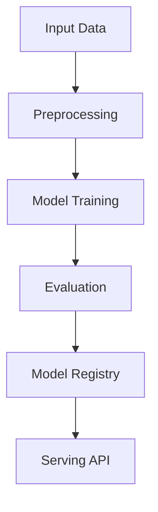

# cnn-medical-imaging

## ∫ Mathematics & Theory

Convolutional Neural Network — Underlying equations and derivations

$$Z^{(l)} = W^{(l)} * X^{(l)} + b^{(l)}$$

$$A^{(l)} = \text{ReLU}(Z^{(l)})$$

$$\text{MaxPool}(X)_{i,j} = \max_{m \in \mathcal{R}_i, n \in \mathcal{R}_j} X_{m,n}$$

$$\text{Softmax}(z)_j = \frac{e^{z_j}}{\sum_{k=1}^{K} e^{z_k}}$$

$$\mathcal{L}_{CE} = -\sum_{i=1}^{C} y_i \log(\hat{y}_i)$$

### Step-by-Step Derivation

CNNs apply learned filters across spatial dimensions. Convolution slides a kernel $W$ over the input, computing dot products at each position. ReLU introduces non-linearity. Pooling reduces spatial dimensions. The softmax converts final logits to class probabilities.

### Interactive Visualization

Interactive filter visualization; feature map heatmap; receptive field calculator; Grad-CAM overlay.

## ⚙ Architecture

Model structure, data flow, and layer breakdown

### Class Hierarchy

```
  MedicalImagingCNN
```

### Data Flow



## ⚡ API Reference

FastAPI endpoints and model interfaces

| Method | Endpoint |
| --- | --- |
| `GET` | `/` |
| `GET` | `/health` |
| `GET` | `/metrics` |
| `POST` | `/reload` |

## ▶ Usage

Code examples and CLI commands

### Training Script

```python
"""Training pipeline for Medical Imaging Diagnosis (CNN)."""

import argparse
import os
from pathlib import Path

from ai_core.logging import get_logger, setup_logging
from ai_core.model_registry import ModelRegistry
from ai_core.validation import DataValidator, create_medical_imaging_schema

from cnn_medical_imaging.data import (
    load_training_data,
    save_training_data,
    train_test_split,
)
from cnn_medical_imaging.model import MedicalImagingCNN

logger = get_logger(__name__)

def train(
    model_dir: Path,
    data_path: Path | None = None,
    n_samples: int = 500,
    n_filters: int = 8,
    kernel_size: int = 3,
    hidden_dim: int = 32,
    learning_rate: float = 0.05,
    n_iterations: int = 300,
    weight_decay: float = 0.001,
    model_version: str = "1.0.0",
    register_to_mlflow: bool = False,
    test_size: float = 0.2,
    random_seed: int = 42,
) -> dict:
    """Train the medical imaging diagnosis model and save artifacts."""
    X, y = load_training_data(data_path, n_samples=n_samples, random_seed=random_seed)
    logger.info("Loaded training data", n_samples=len(X), data_path=str(data_path))

    if "classification" in ("classification", "binary_classification"):
        validator = DataValidator(create_medical_imaging_schema())
        validation = validator.validate(X.reshape(-1, 1))
        if not validation.valid:
            logger.error("Training data validation failed", errors=validation.errors)
            raise ValueError(f"Training data validation failed: {validation.errors}")
        logger.info("Training data validated", stats=validation.stats)

    X_train, X_test, y_train, y_test = train_test_split(
        X, y, test_size=test_size, random_seed=random_seed
    )
    logger.info("Data split", n_train=len(X_train), n_test=len(X_test), test_size=test_size)

    model_dir.mkdir(parents=True, exist_ok=True)
    save_training_data(X, y, model_dir / "training_data.npz")

    model = MedicalImagingCNN(
        IMG_SIZE=8,
        N_CHANNELS=1,
        n_filters=n_filters,
        kernel_size=kernel_size,
        hidden_dim=hidden_dim,
        learning_rate=learning_rate,
        n_iterations=n_iterations,
        weight_decay=weight_decay,
        random_seed=random_seed,
    )
    model.fit(X_train, y_train, X_val=X_test, y_val=y_test)

    model.evaluate(X_train, y_train)
    test_metrics = model.evaluate(X_test, y_test)

    logger.info(
        "Training complete",
        training_mode=model.training_mode,
        n_epochs=len(model.loss_history),
        final_loss=model.loss_history[-1] if model.loss_history else 0.0,
        test_metrics=test_metrics,
    )

    model_path = model_dir / f"medical_imaging_model_v{model_version}.npz"
    model.save(str(model_path))

    _save_chart(model, model_dir, model_version)

    metrics = {
        **test_metrics,
        "training_mode": "supervised",
        "n_epochs_run": float(len(model.loss_history)),
        "final_loss": model.loss_history[-1] if model.loss_history else 0.0,
        "n_train_samples": float(len(X_train)),
        "n_test_samples": float(len(X_test)),
        "n_filters": float(n_filters),
        "learning_rate": float(learning_rate),
    }

    registry = ModelRegistry(base_dir=model_dir)
    registry.save_model(
        model_name="medical-imaging",
        model_version=model_version,
        model_type="classification",
        metrics=metrics,
        parameters={
            "img_size": 8,
            "n_channels": 1,
            "n_filters": n_filters,
            "kernel_size": kernel_size,
            "learning_rate": learning_rate,
            "n_iterations": n_iterations,
            "weight_decay": weight_decay,
            "random_seed": random_seed,
        },
        artifacts={
            f"medical_imaging_model_v{model_version}.npz": model_path,
            "training_data.npz": model_dir / "training_data.npz",
        },
        tags={"framework": "numpy", "task": "medical_imaging", "model_type": "CNN"},
    )

    if register_to_mlflow:
        registry.log_to_mlflow(
            model_name="medical-imaging",
            model_version=model_version,
            metrics=metrics,
            params={
                "img_size": 8,
                "n_filters": n_filters,
                "learning_rate": learning_rate,
                "n_iterations": n_iterations,
            },
            artifacts={
                "model": str(model_path),
                "chart": str(model_dir / f"medical_imaging_v{model_version}.png"),
            },
            tags={"model_type": "medical_imaging", "framework": "numpy"},
        )
        logger.info("Registered model to MLflow", model="medical-imaging", version=model_version)

    return metrics

def _save_chart(model, output_dir: Path, version: str) -> None:
    import matplotlib
    matplotlib.use("Agg")
    import matplotlib.pyplot as plt

    if not model.loss_history:
        return

    fig, ax = plt.subplots(figsize=(10, 5))
    ax.plot(model.loss_history, color="steelblue", linewidth=1.5)
    ax.set_xlabel("Training Epoch")
    ax.set_ylabel("Loss")
    ax.set_title("Medical Imaging Diagnosis CNN Training Loss")
    ax.grid(True, alpha=0.3)
    ax.set_yscale("log")
    plt.tight_layout()
    chart_path = output_dir / f"medical_imaging_v{version}.png"
    plt.savefig(str(chart_path), dpi=100)
    plt.close()
    logger.info("Chart saved", path=str(chart_path))

def main():
    parser = argparse.ArgumentParser(description="Train Medical Imaging Diagnosis model")
    parser.add_argument("--model-dir", type=Path, default=Path(os.getenv("MODEL_DIR", "/models")))
    parser.add_argument("--data-path", type=Path, default=None)
    parser.add_argument("--n-samples", type=int, default=int(os.getenv("N_SAMPLES", "500")))
    parser.add_argument("--n-filters", type=int, default=int(os.getenv("N_FILTERS", "8")))
    parser.add_argument("--kernel-size", type=int, default=int(os.getenv("KERNEL_SIZE", "3")))
    parser.add_argument("--hidden-dim", type=int, default=int(os.getenv("HIDDEN_DIM", "32")))
    parser.add_argument("--learning-rate", type=float, default=float(os.getenv("LEARNING_RATE", "0.05")))
    parser.add_argument("--n-iterations", type=int, default=int(os.getenv("N_ITERATIONS", "300")))
    parser.add_argument("--weight-decay", type=float, default=float(os.getenv("WEIGHT_DECAY", "0.001")))
    parser.add_argument("--model-version", type=str, default=os.getenv("MODEL_VERSION", "1.0.0"))
    parser.add_argument("--test-size", type=float, default=float(os.getenv("TEST_SIZE", "0.2")))
    parser.add_argument("--random-seed", type=int, default=int(os.getenv("RANDOM_SEED", "42")))
    parser.add_argument(
        "--register-mlflow",
        action="store_true",
        default=os.getenv("REGISTER_MLFLOW", "false").lower() == "true",
    )
    parser.add_argument("--log-level", type=str, default=os.getenv("LOG_LEVEL", "INFO"))
    args = parser.parse_args()

    setup_logging(args.log_level)
    args.model_dir.mkdir(parents=True, exist_ok=True)

    metrics = train(
        model_dir=args.model_dir,
        data_path=args.data_path,
        n_samples=args.n_samples,
        n_filters=args.n_filters,
        kernel_size=args.kernel_size,
        hidden_dim=args.hidden_dim,
        learning_rate=args.learning_rate,
        n_iterations=args.n_iterations,
        weight_decay=args.weight_decay,
        model_version=args.model_version,
        register_to_mlflow=args.register_mlflow,
        test_size=args.test_size,
        random_seed=args.random_seed,
    )

    logger.info("Training finished", metrics=metrics, model_dir=str(args.model_dir))

if __name__ == "__main__":
    main()
```

### API Server

```python
"""Serving API for Medical Imaging Diagnosis (CNN)."""

import os
import time
from contextlib import asynccontextmanager
from pathlib import Path

import numpy as np
from ai_core.drift import DriftDetector
from ai_core.fastapi_middleware import add_observability_middleware
from ai_core.logging import get_logger, setup_logging
from ai_core.metrics import MetricsCollector
from ai_core.model_registry import ModelRegistry
from ai_core.validation import DataValidator, create_medical_imaging_schema
from fastapi import FastAPI, HTTPException, Response
from pydantic import BaseModel, Field

from cnn_medical_imaging.data import IMAGE_SIZE, N_CHANNELS, generate_synthetic_data
from cnn_medical_imaging.model import MedicalImagingCNN

logger = get_logger(__name__)

MODEL_DIR = Path(os.getenv("MODEL_DIR", "/models"))
MODEL_VERSION = os.getenv("MODEL_VERSION", "latest")
METRICS_PORT = int(os.getenv("MEDICAL_IMAGING_METRICS_PORT", "8016"))
DRIFT_THRESHOLD = float(os.getenv("DRIFT_THRESHOLD", "0.2"))

class PredictRequest(BaseModel):
    condition: list[float] = Field(..., min_length=64, max_length=64)

class PredictBulkRequest(BaseModel):
    requests: list[list[float]] = Field(..., min_length=1, max_length=50)

class PredictResponse(BaseModel):
    condition: str | list[float] | bool
    confidence: float
    model_version: str
    training_mode: str

class BulkPredictResponse(BaseModel):
    predictions: list[PredictResponse]
    model_version: str

class DriftResponse(BaseModel):
    total_features: int
    drifted_features: int
    drift_ratio: float
    drifted: list[dict]
    all_results: list[dict]

class StatsResponse(BaseModel):
    img_size: int
    n_channels: int
    n_filters: int
    training_mode: str
    n_epochs_run: int
    final_loss: float
    model_version: str

_model: MedicalImagingCNN | None = None
_model_version: str = "unknown"
_metrics: MetricsCollector | None = None
_validator: DataValidator | None = None
_drift_detector: DriftDetector | None = None
_reference_data: np.ndarray | None = None
_recent_predictions: list[list[float]] = []

@asynccontextmanager
async def lifespan(app: FastAPI):
    global _model, _model_version, _metrics, _validator, _drift_detector, _reference_data

    setup_logging(os.getenv("LOG_LEVEL", "INFO"))
    _metrics = MetricsCollector("medical_imaging", port=METRICS_PORT)
    app.state.metrics = _metrics

    _validator = DataValidator(create_medical_imaging_schema())
    feature_names = [f"pixel_{i}" for i in range(64)]
    _drift_detector = DriftDetector(
        feature_names=feature_names,
        feature_types={f: "float" for f in feature_names},
        psi_threshold=DRIFT_THRESHOLD,
    )

    _model, _model_version = _load_model()
    _metrics.set_model_version(_model_version)
    _metrics.set_model_info(
        model_name="medical-imaging",
        model_version=_model_version,
        model_type="classification",
    )

    _reference_data = _load_reference_data()
    logger.info("Model loaded", model="medical-imaging", version=_model_version)

    yield
    logger.info("Shutting down medical-imaging API")

def _load_model() -> tuple[MedicalImagingCNN, str]:
    registry = ModelRegistry(base_dir=MODEL_DIR)
    try:
        if MODEL_VERSION == "latest":
            models = registry.list_models()
            nn_models = [m for m in models if m.get("model_name") == "medical-imaging"]
            if nn_models:
                nn_models.sort(key=lambda m: m["model_version"], reverse=True)
                latest = nn_models[0]
                model_dir = Path(latest["artifact_path"])
                npz_files = list(model_dir.glob("medical_imaging_model_*.npz")) + list(model_dir.glob("*.npz"))
                if npz_files:
                    return MedicalImagingCNN.load(str(npz_files[0])), latest["model_version"]
        else:
            model_dir = MODEL_DIR / "medical-imaging" / MODEL_VERSION
            if model_dir.exists():
                npz_files = list(model_dir.glob("medical_imaging_model_*.npz")) + list(model_dir.glob("*.npz"))
                if npz_files:
                    return MedicalImagingCNN.load(str(npz_files[0])), MODEL_VERSION
    except Exception as e:
        logger.warning(f"Registry lookup failed: {e}")

    npz_path = MODEL_DIR / "medical_imaging_model.npz"
    if npz_path.exists():
        return MedicalImagingCNN.load(str(npz_path)), "legacy"

    candidate_paths = [
        Path("/app/artifacts/models/medical_imaging_model_v1.0.0.npz"),
        Path(__file__).resolve().parents[3] / "artifacts" / "models" / "medical_imaging_model_v1.0.0.npz",
    ]
    for p in candidate_paths:
        if p.exists():
            logger.info("Loading bundled baseline model", path=str(p))
            return MedicalImagingCNN.load(str(p)), "1.0.0-bundled"

    logger.warning("No pre-existing model found. Initializing baseline model.")
    X_base, y_base = generate_synthetic_data(n_samples=100, random_seed=42)
    model = MedicalImagingCNN(
        IMG_SIZE=8,
        N_CHANNELS=1,
        n_filters=8,
        kernel_size=3,
        hidden_dim=32,
        learning_rate=0.05,
        n_iterations=100,
        random_seed=42,
    )
    model.fit(X_base, y_base)
    return model, "1.0.0-baseline"

def _load_reference_data() -> np.ndarray | None:
    X_base, _ = generate_synthetic_data(n_samples=100, random_seed=42)
    return X_base

app = FastAPI(
    title="Medical Imaging Diagnosis API",
    description="Detects tumors or fractures in synthetic medical X-ray, MRI, and CT scan images",
    version="1.0.0",
    lifespan=lifespan,
)

add_observability_middleware(app)

@app.get("/")
def read_root():
    return {
        "service": "medical_imaging-api",
        "version": "1.0.0",
        "model_version": _model_version,
        "training_mode": _model.training_mode if _model else "unknown",
        "n_features": 64,
        "endpoints": {
            "health": "/health",
            "predict": "POST /predict",
            "predict/bulk": "POST /predict/bulk",
            "stats": "GET /stats",
            "drift": "GET /drift",
            "metrics": "/metrics",
        },
    }

@app.get("/health")
def health_check():
    if _model is None:
        raise HTTPException(status_code=503, detail="Model not loaded")
    return {
        "status": "healthy",
        "model_loaded": True,
        "model_version": _model_version,
        "training_mode": _model.training_mode if _model else "unknown",
    }

@app.get("/metrics")
def metrics():
    from prometheus_client import CONTENT_TYPE_LATEST, generate_latest

    return Response(content=generate_latest(), media_type=CONTENT_TYPE_LATEST)

@app.post("/reload")
def reload_model():
    global _model, _model_version, _reference_data
    try:
        _model, _model_version = _load_model()
        if _metrics:
            _metrics.set_model_version(_model_version)
            _metrics.set_model_info(
                model_name="medical-imaging",
                model_version=_model_version,
                model_type="classification",
            )
        _reference_data = _load_reference_data()
        logger.info("Model reloaded dynamically", model="medical-imaging", version=_model_version)
        return {"status": "reloaded", "model_version": _model_version}
    except Exception as e:
        logger.exception("Model reload failed", error=str(e))
        raise HTTPException(status_code=500, detail=f"Reload failed: {e}") from e

@app.get("/drift", response_model=DriftResponse)
def drift_check():
    if _drift_detector is None or _reference_data is None:
        raise HTTPException(status_code=503, detail="Drift detection not available")
    if len(_recent_predictions) < 10:
        return {
            "total_features": 64,
            "drifted_features": 0,
            "drift_ratio": 0.0,
            "drifted": [],
            "all_results": [],
        }
    current = np.array(_recent_predictions[-100:])
    results = _drift_detector.detect_drift(_reference_data, current)
    summary = _drift_detector.summarize(results)
    if _metrics:
        _metrics.set_drift_ratio(summary["drift_ratio"])
    return summary

@app.get("/stats", response_model=StatsResponse)
def get_stats():
    if _model is None or getattr(_model, "model", None) is None:
        raise HTTPException(status_code=503, detail="Model not loaded")
    return StatsResponse(
        img_size=IMAGE_SIZE,
        n_channels=N_CHANNELS,
        n_filters=getattr(_model, "n_filters", 8),
        training_mode=_model.training_mode,
        n_epochs_run=len(_model.loss_history),
        final_loss=_model.loss_history[-1] if _model.loss_history else 0.0,
        model_version=_model_version,
    )

def _compute_prediction(condition: list[float]):
    if _model is None or _metrics is None or _validator is None:
        raise HTTPException(status_code=503, detail="Model not loaded")

    X = np.array([condition]).reshape(1, -1)

    if "classification" in ("classification", "binary_classification"):
        validation = _validator.validate(X)
    else:
        validation = _validator.validate(X)

    if not validation.valid:
        raise HTTPException(status_code=422, detail=validation.errors)

    start = time.time()
    try:
        probas = _model.predict_proba(X)[0]
        pred_idx = int(np.argmax(probas))
        confidence = float(np.max(probas))
        response = PredictResponse(
            condition=str(pred_idx),
            confidence=round(confidence, 4),
            model_version=_model_version,
            training_mode=_model.training_mode,
        )
        duration = time.time() - start
        _metrics.record_prediction(model_version=_model_version, duration=duration)

        _recent_predictions.append(condition)
        if len(_recent_predictions) > 1000:
            _recent_predictions.pop(0)

        return response
    except Exception as e:
        _metrics.record_error(model_version=_model_version, error_type="prediction")
        logger.exception("Prediction failed", error=str(e))
        raise HTTPException(status_code=500, detail="Prediction failed") from e

@app.post("/predict", response_model=PredictResponse)
def predict(body: PredictRequest):
    """Make a medical imaging diagnosis prediction."""
    return _compute_prediction(body.condition)

@app.post("/predict/bulk", response_model=BulkPredictResponse)
def predict_bulk(body: PredictBulkRequest):
    """Make multiple medical imaging diagnosis predictions."""
    global _recent_predictions
    if _model is None or _metrics is None or _validator is None:
        raise HTTPException(status_code=503, detail="Model not loaded")
    if len(body.requests) < 1 or len(body.requests) > 50:
        raise HTTPException(status_code=422, detail="Batch size must be between 1 and 50")

    predictions = []
    for condition in body.requests:
        predictions.append(_compute_prediction(condition))

    return BulkPredictResponse(predictions=predictions, model_version=_model_version)
```

### CLI Commands

```bash
uv run python -m cnn_medical_imaging.train --model-dir ./artifacts/models
```

## 📊 Benchmarks

Test results and performance metrics

Run `pytest tests/test_models.py` and `pytest tests/test_apis.py` for detailed metrics.

### Related Apps

- [capsnet-medical-scan](../capsnet-medical-scan/README.md)

- [cnn-facial-recognition](../cnn-facial-recognition/README.md)

- [cnn-video-surveillance](../cnn-video-surveillance/README.md)

Generated documentation for **cnn-medical-imaging**
