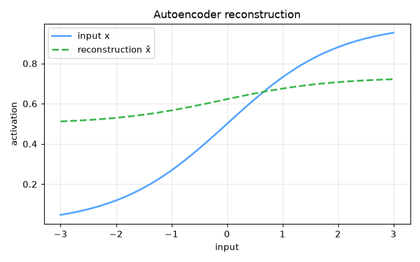

# anomaly-detection-fraud


Anomaly Detection / Autoencoder — AI engineering example · part of the MLOps monorepo

## 1. Mathematical Foundations

This example is grounded in **Anomaly Detection / Autoencoder**. The equations below
drive every forward and backward pass in the implementation.

$$z = f(x) = \sigma(W_e x + b_e) \quad \text{(encoder)}$$

$$\hat{x} = g(z) = \sigma(W_d z + b_d) \quad \text{(decoder)}$$

$$\mathcal{L} = \|x - \hat{x}\|^2 + \lambda (\|W_e\|^2 + \|W_d\|^2)$$

$$\text{anomaly score} = \|x - \hat{x}\|^2$$

### Derivation

Autoencoders learn compressed representations by minimizing reconstruction error. The encoder maps input $x$ to a latent code $z$. The decoder reconstructs $\hat{x}$ from $z$. L2 regularization and bottleneck architecture prevent trivial identity solutions.

### Worked Numerical Example

Concrete forward-pass / update evaluation using the algorithm's own equations:

Autoencoder anomaly scoring (see autoencoder example).
  score = ||x - x_hat||^2; threshold e.g. 0.01 flags fraud.

### Conceptual Diagram

        Math concept (placeholder)
   [ Input x ] --> ( w · x + b ) --> [ Output z ]
                       |
                  [ activation ]
                       |
                  [ prediction ]



Interactive latent space traversal; reconstruction error vs latent dimension; bottleneck visualization.

## 2. Core Logic & Architecture

The example follows a consistent **data → train → evaluate → serve**
pipeline. Inputs are loaded and validated, transformed by the core algorithm, scored against
held-out data, and exposed through a REST API.

  Raw dataset→
  load + validate (data.py)→
  fit / transform (model.py)→
  evaluate + persist (train.py)→
  serve (api.py)

### Primary Components

| Class | Public methods | Responsibility |
| --- | --- | --- |
| `FraudRequest` | — | Single credit card transaction for fraud detection. |
| `FraudBulkRequest` | — | Bulk fraud detection request. |
| `FraudResponse` | — | Fraud detection response for a single transaction. |
| `BulkFraudResponse` | — | Bulk fraud detection response. |
| `DriftResponse` | — | Drift detection response. |
| `StatsResponse` | — | Model statistics response. |
| `FraudDetectionAutoencoder` | _he_init, _xavier_init, _forward, fit, _compute_threshold, reconstruction_error, reconstruction_error_normalized, predict_proba, predict, is_fraud, accuracy, precision, recall, f1_score, false_positive_rate, evaluate, save, load, to_dict | Feedforward autoencoder for credit card fraud detection.  The model is trained on normal transactions only. Fraudulent transactions are detected via high reconstruction error — the model has never learned to reconstruct anomalous patterns.  Architecture: Input -> Hidden (ReLU) -> Output (Linear, same dim as input)  Args:     hidden_dim: Size of the hidden (encoding) layer     learning_rate: Gradient descent step size     n_iterations: Maximum number of training iterations     threshold_percentile: Percentile for anomaly threshold     weight_decay: L2 regularization strength     hidden_activation: Activation for hidden layer ('relu' or 'tanh')     random_seed: Random seed for reproducibility |

### Data Flow


1. **Load** — `data.py` reads the source dataset and splits train/test.


2. **Validate** — a Pydantic schema guards input shape/dtypes before training.


3. **Fit / Transform** — `model.py` applies the mathematics from Section 1.


4. **Evaluate** — metrics (MSE/RMSE/R², accuracy, etc.) are computed and logged.


5. **Persist** — weights/artifacts are saved and registered in the model registry.


6. **Serve** — `api.py` exposes prediction endpoints with drift detection.

### Design Patterns & Performance

Key design choices in this module: a pure-NumPy implementation (no PyTorch/TensorFlow), schema validation via `ai_core.validation`, structured JSON logging through `ai_core.logging`, Prometheus metrics from `ai_core.metrics`, and MLflow/model-registry persistence via `ai_core.model_registry`. The FastAPI service wraps the trained model with observability middleware from `ai_core.fastapi_middleware`.

## 3. Detailed Code Walkthrough

The most important behaviour is summarised below; full source for each module is collapsible
so the page stays readable while remaining self-contained.

### `FraudDetectionAutoencoder.fit(X, X_val, X_test, y_test)`

Train the autoencoder on normal transactions.

Args:
    X: Normal transaction data (n_samples, n_features)
    X_val: Optional validation data
    X_test: Optional test data (with both normal and fraud)
    y_test: Optional test labels

Returns:
    self

### `FraudDetectionAutoencoder.predict(X, threshold)`

Return 1 (fraud) if reconstruction error > threshold, else 0.

### `FraudDetectionAutoencoder.evaluate(X, y)`

Compute all evaluation metrics for fraud detection.

### Source Files

<details>
<summary>model.py</summary>

```
"""Feedforward neural network for credit card fraud detection via reconstruction error.

Uses an autoencoder architecture: the model learns to reconstruct normal
transactions. At inference time, fraudulent transactions (which deviate from
normal patterns) produce high reconstruction errors and are flagged as anomalies.

Architecture:
    Input (n_features) -> Hidden (hidden_dim, ReLU) -> Output (n_features, Linear)

Loss: Mean Squared Error (reconstruction loss)
Optimizer: Gradient Descent with He initialization (from scratch with NumPy)
"""

from dataclasses import dataclass, field
from typing import Literal

import numpy as np

def _relu(z: np.ndarray) -> np.ndarray:
    """ReLU activation function."""
    return np.maximum(0, z)

def _relu_derivative(z: np.ndarray) -> np.ndarray:
    """Derivative of ReLU."""
    return (z > 0).astype(z.dtype)

def _tanh(z: np.ndarray) -> np.ndarray:
    """Tanh activation function."""
    return np.tanh(z)

def _mse_loss(y_true: np.ndarray, y_pred: np.ndarray) -> float:
    """Mean squared error loss."""
    return float(np.mean((y_true - y_pred) ** 2))

@dataclass
class FraudDetectionAutoencoder:
    """Feedforward autoencoder for credit card fraud detection.

    The model is trained on normal transactions only. Fraudulent transactions
    are detected via high reconstruction error — the model has never learned
    to reconstruct anomalous patterns.

    Architecture: Input -> Hidden (ReLU) -> Output (Linear, same dim as input)

    Args:
        hidden_dim: Size of the hidden (encoding) layer
        learning_rate: Gradient descent step size
        n_iterations: Maximum number of training iterations
        threshold_percentile: Percentile for anomaly threshold
        weight_decay: L2 regularization strength
        hidden_activation: Activation for hidden layer ('relu' or 'tanh')
        random_seed: Random seed for reproducibility
    """

    hidden_dim: int = 8
    learning_rate: float = 0.001
    n_iterations: int = 2000
    threshold_percentile: float = 95.0
    weight_decay: float = 0.0001
    hidden_activation: Literal["relu", "tanh"] = "relu"
    random_seed: int = 42

    # Learned parameters
    input_dim: int = 0
    W1: np.ndarray | None = None
    b1: np.ndarray | None = None
    W2: np.ndarray | None = None
    b2: np.ndarray | None = None

    # Training metadata
    training_mode: str = "supervised"
    loss_history: list[float] = field(default_factory=list)
    val_loss_history: list[float] = field(default_factory=list)
    mean_: np.ndarray | None = None
    std_: np.ndarray | None = None
    threshold: float = 1.0
    accuracy_history: list[float] = field(default_factory=list)

    def _he_init(self, n_in: int, n_out: int, rng: np.random.Generator) -> np.ndarray:
        """He initialization for ReLU networks."""
        return rng.normal(0, np.sqrt(2.0 / n_in), (n_in, n_out))

    def _xavier_init(self, n_in: int, n_out: int, rng: np.random.Generator) -> np.ndarray:
        """Xavier initialization for tanh networks."""
        return rng.normal(0, np.sqrt(1.0 / n_in), (n_in, n_out))

    def _forward(self, X: np.ndarray) -> tuple[np.ndarray, np.ndarray, np.ndarray]:
        """Forward pass through the autoencoder.

        Returns: (reconstruction, hidden_activations, z1)
        """
        z1 = np.dot(X, self.W1) + self.b1

        a1 = _relu(z1) if self.hidden_activation == "relu" else _tanh(z1)

        z2 = np.dot(a1, self.W2) + self.b2
        return z2, a1, z1

    def fit(
        self,
        X: np.ndarray,
        X_val: np.ndarray | None = None,
        X_test: np.ndarray | None = None,
        y_test: np.ndarray | None = None,
    ) -> "FraudDetectionAutoencoder":
        """Train the autoencoder on normal transactions.

        Args:
            X: Normal transaction data (n_samples, n_features)
            X_val: Optional validation data
            X_test: Optional test data (with both normal and fraud)
            y_test: Optional test labels

        Returns:
            self
        """
        rng = np.random.default_rng(self.random_seed)

        X = np.asarray(X, dtype=float)
        n_samples, n_features = X.shape
        self.input_dim = n_features

        # Normalize features
        self.mean_ = X.mean(axis=0)
        self.std_ = np.where(X.std(axis=0) < 1e-8, 1.0, X.std(axis=0))
        X_norm = (X - self.mean_) / self.std_

        X_val_norm = None
        if X_val is not None:
            X_val_norm = (X_val - self.mean_) / self.std_
            self.val_loss_history = []

        # Initialize weights
        if self.hidden_activation == "relu":
            self.W1 = self._he_init(n_features, self.hidden_dim, rng)
        else:
            self.W1 = self._xavier_init(n_features, self.hidden_dim, rng)
        self.b1 = np.zeros(self.hidden_dim)
        self.W2 = self._xavier_init(self.hidden_dim, n_features, rng)
        self.b2 = np.zeros(n_features)

        self.loss_history = []

        for epoch in range(self.n_iterations):
            # Forward pass (reconstruct input from itself)
            recon, a1, z1 = self._forward(X_norm)
            loss = _mse_loss(X_norm, recon)

            # L2 regularization
            l2_penalty = self.weight_decay * (np.sum(self.W1**2) + np.sum(self.W2**2))
            loss += l2_penalty
            self.loss_history.append(loss)

            # Backpropagation
            m = n_samples
            dz2 = 2 * (recon - X_norm) / m
            dW2 = np.dot(a1.T, dz2) + self.weight_decay * self.W2
            db2 = np.sum(dz2, axis=0)

            da1 = np.dot(dz2, self.W2.T)
            if self.hidden_activation == "relu":
                dz1 = da1 * _relu_derivative(z1)
            else:
                dz1 = da1 * (1 - _tanh(z1) ** 2)

            dW1 = np.dot(X_norm.T, dz1) + self.weight_decay * self.W1
            db1 = np.sum(dz1, axis=0)

            # Gradient descent
            self.W1 -= self.learning_rate * dW1
            self.b1 -= self.learning_rate * db1
            self.W2 -= self.learning_rate * dW2
            self.b2 -= self.learning_rate * db2

            # Track validation loss
            if X_val_norm is not None and epoch % 50 == 0:
                val_recon, _, _ = self._forward(X_val_norm)
                val_loss = _mse_loss(X_val_norm, val_recon)
                self.val_loss_history.append(val_loss)

            # Early stopping
            if epoch > 100 and abs(self.loss_history[-1] - self.loss_history[-100]) < 1e-7:
                break

        # Compute anomaly threshold from training data
        self._compute_threshold(X_norm)

        # Track accuracy on test set if provided
        if X_test is not None and y_test is not None:
            X_test_norm = (X_test - self.mean_) / self.std_
            errors = self.reconstruction_error_normalized(X_test_norm)
            predictions = (errors > self.threshold).astype(int)
            self.accuracy_history = [float(np.mean(predictions == y_test))]

        return self

    def _compute_threshold(self, X_norm: np.ndarray) -> None:
        """Compute anomaly threshold from reconstruction errors on training data."""
        errors = self.reconstruction_error_normalized(X_norm)
        self.threshold = float(np.percentile(errors, self.threshold_percentile))

    def reconstruction_error(self, X: np.ndarray) -> np.ndarray:
        """Compute per-sample reconstruction error (MSE)."""
        X = np.asarray(X, dtype=float)
        X_norm = (X - self.mean_) / self.std_
        return self.reconstruction_error_normalized(X_norm)

    def reconstruction_error_normalized(self, X_norm: np.ndarray) -> np.ndarray:
        """Compute reconstruction error on normalized input."""
        if self.W1 is None:
            raise ValueError("Model not trained. Call fit() first.")
        recon, _, _ = self._forward(X_norm)
        errors = np.mean((X_norm - recon) ** 2, axis=1)
        return errors

    def predict_proba(self, X: np.ndarray) -> np.ndarray:
        """Return fraud probability (normalized reconstruction error)."""
        X = np.asarray(X, dtype=float)
        X_norm = (X - self.mean_) / self.std_
        errors = self.reconstruction_error_normalized(X_norm)

        max_error = max(float(errors.max()), self.threshold * 2, 1e-8)
        proba = np.clip(errors / max_error, 0.0, 1.0)
        return proba

    def predict(self, X: np.ndarray, threshold: float | None = None) -> np.ndarray:
        """Return 1 (fraud) if reconstruction error > threshold, else 0."""
        thr = threshold if threshold is not None else self.threshold
        errors = self.reconstruction_error(X)
        return (errors > thr).astype(int)

    def is_fraud(self, X: np.ndarray, threshold: float | None = None) -> np.ndarray:
        """Return boolean fraud flags."""
        return self.predict(X, threshold=threshold).astype(bool)

    def accuracy(self, X: np.ndarray, y: np.ndarray) -> float:
        """Compute classification accuracy."""
        predictions = self.predict(X)
        return float(np.mean(predictions == y))

    def precision(self, X: np.ndarray, y: np.ndarray) -> float:
        """Compute precision."""
        predictions = self.predict(X)
        tp = np.sum((predictions == 1) & (y == 1))
        fp = np.sum((predictions == 1) & (y == 0))
        if tp + fp == 0:
            return 0.0
        return float(tp / (tp + fp))

    def recall(self, X: np.ndarray, y: np.ndarray) -> float:
        """Compute recall."""
        predictions = self.predict(X)
        tp = np.sum((predictions == 1) & (y == 1))
        fn = np.sum((predictions == 0) & (y == 1))
        if tp + fn == 0:
            return 0.0
        return float(tp / (tp + fn))

    def f1_score(self, X: np.ndarray, y: np.ndarray) -> float:
        """Compute F1 score."""
        p = self.precision(X, y)
        r = self.recall(X, y)
        if p + r == 0:
            return 0.0
        return float(2 * p * r / (p + r))

    def false_positive_rate(self, X: np.ndarray, y: np.ndarray) -> float:
        """Compute false positive rate."""
        predictions = self.predict(X)
        fp = np.sum((predictions == 1) & (y == 0))
        tn = np.sum((predictions == 0) & (y == 0))
        if fp + tn == 0:
            return 0.0
        return float(fp / (fp + tn))

    def evaluate(self, X: np.ndarray, y: np.ndarray) -> dict[str, float]:
        """Compute all evaluation metrics for fraud detection."""
        predictions = self.predict(X)

        tp = int(np.sum((predictions == 1) & (y == 1)))
        fp = int(np.sum((predictions == 1) & (y == 0)))
        fn = int(np.sum((predictions == 0) & (y == 1)))
        tn = int(np.sum((predictions == 0) & (y == 0)))

        accuracy = float(np.mean(predictions == y))
        precision = tp / (tp + fp) if (tp + fp) > 0 else 0.0
        recall = tp / (tp + fn) if (tp + fn) > 0 else 0.0
        f1 = 2 * precision * recall / (precision + recall) if (precision + recall) > 0 else 0.0
        fpr = fp / (fp + tn) if (fp + tn) > 0 else 0.0

        return {
            "accuracy": accuracy,
            "precision": precision,
            "recall": recall,
            "f1": f1,
            "false_positive_rate": fpr,
            "anomaly_threshold": float(self.threshold),
            "n_true_positives": tp,
            "n_false_positives": fp,
            "n_true_negatives": tn,
            "n_false_negatives": fn,
        }

    def save(self, path: str) -> None:
        """Save model parameters to disk."""
        if self.W1 is None:
            raise ValueError("Cannot save untrained model")

        np.savez(
            path,
            W1=self.W1,
            b1=self.b1,
            W2=self.W2,
            b2=self.b2,
            input_dim=np.array([self.input_dim]),
            hidden_dim=np.array([self.hidden_dim]),
            learning_rate=np.array([self.learning_rate]),
            n_iterations=np.array([self.n_iterations]),
            threshold_percentile=np.array([self.threshold_percentile]),
            weight_decay=np.array([self.weight_decay]),
            hidden_activation=np.array([self.hidden_activation]),
            random_seed=np.array([self.random_seed]),
            threshold=np.array([self.threshold]),
            mean_=self.mean_,
            std_=self.std_,
            loss_history=np.array(self.loss_history),
            val_loss_history=np.array(self.val_loss_history),
            accuracy_history=np.array(self.accuracy_history),
            training_mode=np.array([self.training_mode]),
        )

    @classmethod
    def load(cls, path: str) -> "FraudDetectionAutoencoder":
        """Load model parameters from disk."""
        data = np.load(path)

        model = cls(
            hidden_dim=int(data["hidden_dim"].item()),
            learning_rate=float(data["learning_rate"].item()),
            n_iterations=int(data["n_iterations"].item()),
            threshold_percentile=float(data["threshold_percentile"].item()),
            weight_decay=float(data["weight_decay"].item()),
            hidden_activation=str(data["hidden_activation"].item()),
            random_seed=int(data["random_seed"].item()),
        )

        model.W1 = data["W1"]
        model.b1 = data["b1"]
        model.W2 = data["W2"]
        model.b2 = data["b2"]
        model.input_dim = int(data["input_dim"].item())
        model.threshold = float(data["threshold"].item())
        model.mean_ = data["mean_"]
        model.std_ = data["std_"]
        model.loss_history = list(data["loss_history"])
        model.val_loss_history = list(data["val_loss_history"])
        model.accuracy_history = list(data["accuracy_history"])
        model.training_mode = str(data["training_mode"].item())

        return model

    def to_dict(self) -> dict:
        """Return model configuration as a dict."""
        return {
            "input_dim": self.input_dim,
            "hidden_dim": self.hidden_dim,
            "learning_rate": self.learning_rate,
            "n_iterations": self.n_iterations,
            "threshold_percentile": self.threshold_percentile,
            "weight_decay": self.weight_decay,
            "hidden_activation": self.hidden_activation,
            "random_seed": self.random_seed,
            "training_mode": self.training_mode,
            "threshold": self.threshold,
            "n_epochs_run": len(self.loss_history),
            "final_loss": self.loss_history[-1] if self.loss_history else 0.0,
        }
```

</details>

<details>
<summary>train.py</summary>

```
"""Training pipeline for credit card fraud detection using a feedforward autoencoder."""

import argparse
import os
from pathlib import Path

import numpy as np
from ai_core.logging import get_logger, setup_logging
from ai_core.model_registry import ModelRegistry

from anomaly_detection_fraud.data import generate_synthetic_data, save_training_data
from anomaly_detection_fraud.model import FraudDetectionAutoencoder

logger = get_logger(__name__)

def train(
    model_dir: Path,
    data_path: Path | None = None,
    n_samples: int = 2000,
    anomaly_fraction: float = 0.05,
    hidden_dim: int = 8,
    learning_rate: float = 0.001,
    n_iterations: int = 2000,
    threshold_percentile: float = 95.0,
    weight_decay: float = 0.0001,
    model_version: str = "1.0.0",
    register_to_mlflow: bool = False,
    random_seed: int = 42,
) -> dict:
    """Train the fraud detection autoencoder and save artifacts.

    The model is trained on normal transactions only. Fraudulent transactions
    are detected at inference time via high reconstruction error.
    """
    X_full, y_full = generate_synthetic_data(
        n_samples=n_samples, anomaly_fraction=anomaly_fraction, random_seed=random_seed
    )

    n_normal = int(np.sum(y_full == 0))
    n_fraud = int(np.sum(y_full == 1))
    logger.info(
        "Loaded training data",
        n_total=len(X_full),
        n_normal=n_normal,
        n_fraud=n_fraud,
        data_path=str(data_path),
    )

    # Split: training on normal only, test with both
    X_normal = X_full[y_full == 0]
    X_anomaly = X_full[y_full == 1]

    rng = np.random.default_rng(random_seed)
    n_val = max(1, int(len(X_normal) * 0.2))
    val_idx = rng.choice(len(X_normal), size=n_val, replace=False)
    val_mask = np.zeros(len(X_normal), dtype=bool)
    val_mask[val_idx] = True

    X_train = X_normal[~val_mask]
    X_val = X_normal[val_mask]

    # Split anomaly data for test evaluation
    n_test_anomaly = max(1, int(len(X_anomaly) * 0.5))
    test_anom_idx = rng.choice(len(X_anomaly), size=n_test_anomaly, replace=False)
    X_test_anomaly = X_anomaly[test_anom_idx]
    y_test_anomaly = np.ones(n_test_anomaly, dtype=int)

    test_norm_idx = rng.choice(len(X_normal), size=n_test_anomaly, replace=False)
    X_test_normal = X_normal[test_norm_idx]
    y_test_normal = np.zeros(n_test_anomaly, dtype=int)

    X_test = np.vstack([X_test_normal, X_test_anomaly])
    y_test = np.concatenate([y_test_normal, y_test_anomaly])

    logger.info(
        "Data split for anomaly detection",
        n_train=len(X_train),
        n_val=len(X_val),
        n_test=len(X_test),
        n_features=X_train.shape[1],
        training_mode="autoencoder (normal data only)",
    )

    # Save training data for reproducibility
    model_dir.mkdir(parents=True, exist_ok=True)
    save_training_data(X_full, y_full, model_dir / "training_data.csv")

    # Train model
    model = FraudDetectionAutoencoder(
        hidden_dim=hidden_dim,
        learning_rate=learning_rate,
        n_iterations=n_iterations,
        threshold_percentile=threshold_percentile,
        weight_decay=weight_decay,
        random_seed=random_seed,
    )
    model.fit(X_train, X_val=X_val, X_test=X_test, y_test=y_test)

    # Evaluate
    test_metrics = model.evaluate(X_test, y_test)

    logger.info(
        "Training complete",
        training_mode=model.training_mode,
        n_epochs=len(model.loss_history),
        final_loss=model.loss_history[-1] if model.loss_history else 0.0,
        threshold=model.threshold,
        test_metrics=test_metrics,
    )

    # Save model
    model_path = model_dir / f"fraud_detection_model_v{model_version}.npz"
    model.save(str(model_path))

    # Save training chart
    _save_chart(model, model_dir, model_version)

    # Combined metrics for registry
    train_errors = model.reconstruction_error(X_train)
    metrics = {
        **test_metrics,
        "training_mode": "anomaly_detection",
        "n_epochs_run": float(len(model.loss_history)),
        "final_loss": model.loss_history[-1] if model.loss_history else 0.0,
        "anomaly_threshold": float(model.threshold),
        "threshold_percentile": float(threshold_percentile),
        "n_train_samples": float(len(X_train)),
        "n_val_samples": float(len(X_val)),
        "n_test_samples": float(len(X_test)),
        "n_normal_train": float(len(X_train)),
        "n_fraud_detected": float(test_metrics["n_true_positives"]),
        "hidden_dim": float(hidden_dim),
        "learning_rate": float(learning_rate),
        "weight_decay": float(weight_decay),
        "train_mean_recon_error": float(np.mean(train_errors)),
        "n_features": float(X_train.shape[1]),
    }

    # Register model
    registry = ModelRegistry(base_dir=model_dir)
    registry.save_model(
        model_name="credit-card-fraud-detection",
        model_version=model_version,
        model_type="anomaly_detection",
        metrics=metrics,
        parameters={
            "hidden_dim": hidden_dim,
            "learning_rate": learning_rate,
            "n_iterations": n_iterations,
            "threshold_percentile": threshold_percentile,
            "weight_decay": weight_decay,
            "random_seed": random_seed,
        },
        artifacts={
            f"fraud_detection_model_v{model_version}.npz": model_path,
            "training_data.csv": model_dir / "training_data.csv",
        },
        tags={
            "framework": "numpy",
            "task": "anomaly_detection",
            "model_type": "feedforward_neural_network",
        },
    )

    if register_to_mlflow:
        registry.log_to_mlflow(
            model_name="credit-card-fraud-detection",
            model_version=model_version,
            metrics=metrics,
            params={
                "hidden_dim": hidden_dim,
                "learning_rate": learning_rate,
                "n_iterations": n_iterations,
                "threshold_percentile": threshold_percentile,
                "weight_decay": weight_decay,
                "random_seed": random_seed,
            },
            artifacts={
                "model": str(model_path),
                "chart": str(model_dir / f"fraud_detection_v{model_version}.png"),
                "training_data": str(model_dir / "training_data.csv"),
            },
            tags={"model_type": "anomaly_detection", "framework": "numpy"},
        )
        logger.info(
            "Registered model to MLflow", model="credit-card-fraud-detection", version=model_version
        )

    return metrics

def _save_chart(model: FraudDetectionAutoencoder, output_dir: Path, version: str) -> None:
    """Save the training loss chart."""
    import matplotlib

    matplotlib.use("Agg")
    import matplotlib.pyplot as plt

    if not model.loss_history:
        return

    fig, ax = plt.subplots(figsize=(10, 5))
    ax.plot(model.loss_history, color="steelblue", linewidth=1.5)
    ax.set_xlabel("Training Iteration")
    ax.set_ylabel("Loss (MSE + L2)")
    ax.set_title("Credit Card Fraud Detection Autoencoder Training Loss")
    ax.grid(True, alpha=0.3)
    ax.set_yscale("log")

    plt.tight_layout()
    chart_path = output_dir / f"fraud_detection_v{version}.png"
    plt.savefig(str(chart_path), dpi=100)
    plt.close()
    logger.info("Chart saved", path=str(chart_path))

def main():
    parser = argparse.ArgumentParser(description="Train credit card fraud detection neural network")
    parser.add_argument("--model-dir", type=Path, default=Path(os.getenv("MODEL_DIR", "/models")))
    parser.add_argument("--data-path", type=Path, default=None)
    parser.add_argument("--n-samples", type=int, default=int(os.getenv("N_SAMPLES", "2000")))
    parser.add_argument("--hidden-dim", type=int, default=int(os.getenv("HIDDEN_DIM", "8")))
    parser.add_argument(
        "--learning-rate", type=float, default=float(os.getenv("LEARNING_RATE", "0.001"))
    )
    parser.add_argument("--n-iterations", type=int, default=int(os.getenv("N_ITERATIONS", "2000")))
    parser.add_argument(
        "--threshold-percentile",
        type=float,
        default=float(os.getenv("THRESHOLD_PERCENTILE", "95.0")),
    )
    parser.add_argument(
        "--weight-decay", type=float, default=float(os.getenv("WEIGHT_DECAY", "0.0001"))
    )
    parser.add_argument("--model-version", type=str, default=os.getenv("MODEL_VERSION", "1.0.0"))
    parser.add_argument("--random-seed", type=int, default=int(os.getenv("RANDOM_SEED", "42")))
    parser.add_argument(
        "--register-mlflow",
        action="store_true",
        default=os.getenv("REGISTER_MLFLOW", "false").lower() == "true",
    )
    parser.add_argument("--log-level", type=str, default=os.getenv("LOG_LEVEL", "INFO"))
    args = parser.parse_args()

    setup_logging(args.log_level)
    args.model_dir.mkdir(parents=True, exist_ok=True)

    metrics = train(
        model_dir=args.model_dir,
        data_path=args.data_path,
        n_samples=args.n_samples,
        hidden_dim=args.hidden_dim,
        learning_rate=args.learning_rate,
        n_iterations=args.n_iterations,
        threshold_percentile=args.threshold_percentile,
        weight_decay=args.weight_decay,
        model_version=args.model_version,
        register_to_mlflow=args.register_mlflow,
        random_seed=args.random_seed,
    )

    logger.info("Training finished", metrics=metrics, model_dir=str(args.model_dir))

if __name__ == "__main__":
    main()
```

</details>

<details>
<summary>data.py</summary>

```
"""Data generation and preprocessing for credit card fraud detection."""

from pathlib import Path

import numpy as np
import pandas as pd

FEATURE_NAMES = [
    "time_since_last_transaction",
    "transaction_amount",
    "merchant_category",
    "merchant_risk_score",
    "cardholder_risk_score",
    "distance_from_home",
    "is_online",
    "is_foreign",
    "hour_of_day",
    "day_of_week",
    "account_age_days",
    "recent_transaction_count",
    "avg_transaction_amount_24h",
    "device_risk_score",
    "ip_risk_score",
]

DEFAULT_N_SAMPLES = 2000
DEFAULT_ANOMALY_FRACTION = 0.05

def generate_synthetic_data(
    n_samples: int = DEFAULT_N_SAMPLES,
    anomaly_fraction: float = DEFAULT_ANOMALY_FRACTION,
    random_seed: int = 42,
) -> tuple[np.ndarray, np.ndarray]:
    """Generate synthetic credit card transaction data with fraud labels.

    Returns:
        Tuple of (X, y) where X is feature matrix and y is labels (1=fraud, 0=legit).
    """
    rng = np.random.default_rng(random_seed)

    n_fraud = max(1, int(n_samples * anomaly_fraction))
    n_normal = n_samples - n_fraud

    normal_data = _generate_normal_transactions(n_normal, rng)
    fraud_data = _generate_fraud_transactions(n_fraud, rng)

    X = np.vstack([normal_data, fraud_data])
    y = np.concatenate([np.zeros(n_normal, dtype=int), np.ones(n_fraud, dtype=int)])

    indices = rng.permutation(len(X))
    return X[indices], y[indices]

def _generate_normal_transactions(n: int, rng: np.random.Generator) -> np.ndarray:
    """Generate legitimate credit card transactions."""
    return np.column_stack(
        [
            rng.uniform(0, 1440, n),  # time_since_last_transaction (minutes)
            rng.uniform(5, 500, n),  # transaction_amount
            rng.integers(0, 12, n),  # merchant_category
            rng.uniform(0.1, 0.4, n),  # merchant_risk_score
            rng.uniform(0.1, 0.3, n),  # cardholder_risk_score
            rng.uniform(0, 5, n),  # distance_from_home (miles)
            rng.integers(0, 2, n),  # is_online
            rng.choice(2, size=n, p=[0.9, 0.1]),  # is_foreign
            rng.integers(8, 22, n),  # hour_of_day
            rng.integers(0, 7, n),  # day_of_week
            rng.integers(30, 3650, n),  # account_age_days
            rng.integers(0, 15, n),  # recent_transaction_count
            rng.uniform(20, 200, n),  # avg_transaction_amount_24h
            rng.uniform(0.05, 0.3, n),  # device_risk_score
            rng.uniform(0.05, 0.3, n),  # ip_risk_score
        ]
    ).astype(float)

def _generate_fraud_transactions(n: int, rng: np.random.Generator) -> np.ndarray:
    """Generate fraudulent credit card transactions."""
    return np.column_stack(
        [
            rng.uniform(0, 30, n),  # time_since_last_transaction (unusual bursts)
            rng.uniform(300, 5000, n),  # transaction_amount (large)
            rng.integers(0, 12, n),  # merchant_category
            rng.uniform(0.6, 0.95, n),  # merchant_risk_score (high)
            rng.uniform(0.6, 0.95, n),  # cardholder_risk_score (high)
            rng.uniform(50, 500, n),  # distance_from_home (far)
            rng.choice(2, size=n, p=[0.3, 0.7]),  # is_online (more likely online)
            rng.choice(2, size=n, p=[0.3, 0.7]),  # is_foreign (more likely foreign)
            rng.integers(0, 6, n),  # hour_of_day (late night) or 0-5
            rng.integers(0, 7, n),  # day_of_week
            rng.integers(0, 30, n),  # account_age_days (new accounts)
            rng.integers(15, 50, n),  # recent_transaction_count (bursts)
            rng.uniform(500, 5000, n),  # avg_transaction_amount_24h (high)
            rng.uniform(0.7, 0.95, n),  # device_risk_score (high)
            rng.uniform(0.7, 0.95, n),  # ip_risk_score (high)
        ]
    ).astype(float)

def generate_normal_data(
    n_samples: int = DEFAULT_N_SAMPLES,
    random_seed: int = 42,
) -> np.ndarray:
    """Generate only normal transactions for unsupervised/anomaly training."""
    return _generate_normal_transactions(n_samples, np.random.default_rng(random_seed))

def load_training_data(
    data_path: Path | None = None,
    n_samples: int = DEFAULT_N_SAMPLES,
    anomaly_fraction: float = DEFAULT_ANOMALY_FRACTION,
    random_seed: int = 42,
) -> tuple[np.ndarray, np.ndarray]:
    """Load or generate credit card transaction data for training."""
    if data_path and Path(data_path).exists():
        df = pd.read_csv(data_path)
        X = df[FEATURE_NAMES].values.astype(float)
        y = df["is_fraud"].values.astype(int)
        return X, y

    return generate_synthetic_data(
        n_samples=n_samples,
        anomaly_fraction=anomaly_fraction,
        random_seed=random_seed,
    )

def save_training_data(X: np.ndarray, y: np.ndarray, path: Path) -> None:
    """Save training data to CSV."""
    path = Path(path)
    path.parent.mkdir(parents=True, exist_ok=True)
    df = pd.DataFrame(X, columns=FEATURE_NAMES)
    df["is_fraud"] = y
    df.to_csv(path, index=False)

def train_test_split(
    X: np.ndarray, y: np.ndarray, test_size: float = 0.2, random_seed: int | None = None
) -> tuple[np.ndarray, np.ndarray, np.ndarray, np.ndarray]:
    """Split data into train and test sets."""
    n = len(X)
    n_test = max(1, int(n * test_size))

    if random_seed is not None:
        rng = np.random.default_rng(random_seed)
        indices = rng.permutation(n)
    else:
        indices = np.random.permutation(n)

    test_idx = indices[:n_test]
    train_idx = indices[n_test:]

    return X[train_idx], X[test_idx], y[train_idx], y[test_idx]
```

</details>

<details>
<summary>api.py</summary>

```
"""Production serving API for credit card fraud detection via autoencoder reconstruction error."""

import os
import time
from contextlib import asynccontextmanager
from pathlib import Path

import numpy as np
from ai_core.drift import DriftDetector
from ai_core.fastapi_middleware import add_observability_middleware
from ai_core.logging import get_logger, setup_logging
from ai_core.metrics import MetricsCollector
from ai_core.model_registry import ModelRegistry
from fastapi import FastAPI, HTTPException, Response
from pydantic import BaseModel, Field

from anomaly_detection_fraud.data import FEATURE_NAMES
from anomaly_detection_fraud.model import FraudDetectionAutoencoder

logger = get_logger(__name__)

# Configuration
MODEL_DIR = Path(os.getenv("MODEL_DIR", "/models"))
MODEL_VERSION = os.getenv("MODEL_VERSION", "latest")
METRICS_PORT = int(os.getenv("METRICS_PORT", os.getenv("FRAUD_DETECTION_METRICS_PORT", "8010")))
DRIFT_THRESHOLD = float(os.getenv("DRIFT_THRESHOLD", "0.2"))

class FraudRequest(BaseModel):
    """Single credit card transaction for fraud detection."""

    time_since_last_transaction: float = Field(
        ..., ge=0, description="Minutes since last transaction"
    )
    transaction_amount: float = Field(..., ge=0, description="Transaction amount in USD")
    merchant_category: float = Field(..., ge=0, le=11, description="Merchant category code (0-11)")
    merchant_risk_score: float = Field(..., ge=0, le=1, description="Merchant risk score (0-1)")
    cardholder_risk_score: float = Field(..., ge=0, le=1, description="Cardholder risk score (0-1)")
    distance_from_home: float = Field(..., ge=0, description="Distance from home in miles")
    is_online: float = Field(..., ge=0, le=1, description="Whether transaction is online (0/1)")
    is_foreign: float = Field(..., ge=0, le=1, description="Whether transaction is foreign (0/1)")
    hour_of_day: float = Field(..., ge=0, le=23, description="Hour of day (0-23)")
    day_of_week: float = Field(..., ge=0, le=6, description="Day of week (0-6)")
    account_age_days: float = Field(..., ge=0, description="Account age in days")
    recent_transaction_count: float = Field(..., ge=0, description="Recent transaction count")
    avg_transaction_amount_24h: float = Field(..., ge=0, description="Avg transaction amount (24h)")
    device_risk_score: float = Field(..., ge=0, le=1, description="Device risk score (0-1)")
    ip_risk_score: float = Field(..., ge=0, le=1, description="IP risk score (0-1)")

class FraudBulkRequest(BaseModel):
    """Bulk fraud detection request."""

    samples: list[FraudRequest] = Field(..., min_length=1, max_length=100)

class FraudResponse(BaseModel):
    """Fraud detection response for a single transaction."""

    is_fraud: bool
    fraud_probability: float
    reconstruction_error: float
    anomaly_threshold: float
    model_version: str
    training_mode: str

class BulkFraudResponse(BaseModel):
    """Bulk fraud detection response."""

    samples: list[FraudResponse]
    n_frauds: int
    n_samples: int
    model_version: str

class DriftResponse(BaseModel):
    """Drift detection response."""

    total_features: int
    drifted_features: int
    drift_ratio: float
    drifted: list[dict]
    all_results: list[dict]

class StatsResponse(BaseModel):
    """Model statistics response."""

    n_features: int
    hidden_dim: int
    training_mode: str
    n_epochs_run: int
    final_loss: float
    threshold: float
    model_version: str

# Global model state
_model: FraudDetectionAutoencoder | None = None
_model_version: str = "unknown"
_metrics: MetricsCollector | None = None
_drift_detector: DriftDetector | None = None
_reference_data: np.ndarray | None = None
_recent_predictions: list[list[float]] = []

@asynccontextmanager
async def lifespan(app: FastAPI):
    global _model, _model_version, _metrics, _drift_detector, _reference_data

    setup_logging(os.getenv("LOG_LEVEL", "INFO"))
    _metrics = MetricsCollector("credit_card_fraud_detection", port=METRICS_PORT)
    app.state.metrics = _metrics

    _drift_detector = DriftDetector(
        feature_names=FEATURE_NAMES,
        feature_types={f: "float" for f in FEATURE_NAMES},
        psi_threshold=DRIFT_THRESHOLD,
    )

    _model, _model_version = _load_model()
    _metrics.set_model_version(_model_version)
    _metrics.set_model_info(
        model_name="credit-card-fraud-detection",
        model_version=_model_version,
        model_type="anomaly_detection",
    )

    _reference_data = _load_reference_data()
    logger.info("Model loaded", model="credit-card-fraud-detection", version=_model_version)

    yield

    logger.info("Shutting down credit-card-fraud-detection API")

def _load_model() -> tuple[FraudDetectionAutoencoder, str]:
    registry = ModelRegistry(base_dir=MODEL_DIR)
    try:
        if MODEL_VERSION == "latest":
            models = registry.list_models()
            fraud_models = [
                m for m in models if m.get("model_name") == "credit-card-fraud-detection"
            ]
            if fraud_models:
                fraud_models.sort(key=lambda m: m["model_version"], reverse=True)
                latest = fraud_models[0]
                model_dir = Path(latest["artifact_path"])
                npz_files = list(model_dir.glob("fraud_detection_model_*.npz")) + list(
                    model_dir.glob("*.npz")
                )
                if npz_files:
                    return FraudDetectionAutoencoder.load(str(npz_files[0])), latest[
                        "model_version"
                    ]
        else:
            model_dir = MODEL_DIR / "credit-card-fraud-detection" / MODEL_VERSION
            if model_dir.exists():
                npz_files = list(model_dir.glob("fraud_detection_model_*.npz")) + list(
                    model_dir.glob("*.npz")
                )
                if npz_files:
                    return FraudDetectionAutoencoder.load(str(npz_files[0])), MODEL_VERSION
    except Exception as e:
        logger.warning(f"Registry lookup failed: {e}")

    npz_path = MODEL_DIR / "fraud_detection_model.npz"
    if npz_path.exists():
        return FraudDetectionAutoencoder.load(str(npz_path)), "legacy"

    candidate_paths = [
        Path("/app/artifacts/models/fraud_detection_model_v1.0.0.npz"),
        Path(__file__).resolve().parents[3]
        / "artifacts"
        / "models"
        / "fraud_detection_model_v1.0.0.npz",
    ]
    for p in candidate_paths:
        if p.exists():
            logger.info("Loading bundled baseline model", path=str(p))
            return FraudDetectionAutoencoder.load(str(p)), "1.0.0-bundled"

    logger.warning("No pre-existing model found on disk. Initializing baseline model.")
    from anomaly_detection_fraud.data import generate_normal_data

    X_base = generate_normal_data(n_samples=2000, random_seed=42)
    model = FraudDetectionAutoencoder(
        hidden_dim=8, learning_rate=0.001, n_iterations=500, random_seed=42
    )
    model.fit(X_base)
    return model, "1.0.0-baseline"

def _load_reference_data() -> np.ndarray | None:
    candidate_csvs = [
        MODEL_DIR / "credit-card-fraud-detection" / _model_version / "training_data.csv",
        MODEL_DIR / "training_data.csv",
        Path("/app/artifacts/models/training_data.csv"),
        Path(__file__).resolve().parents[3] / "artifacts" / "models" / "training_data.csv",
    ]
    for csv_path in candidate_csvs:
        if csv_path.exists():
            try:
                import pandas as pd

                df = pd.read_csv(csv_path)
                if all(f in df.columns for f in FEATURE_NAMES):
                    return df[FEATURE_NAMES].values
            except Exception as e:
                logger.warning("Could not read reference csv", path=str(csv_path), error=str(e))

    from anomaly_detection_fraud.data import generate_normal_data

    X_base = generate_normal_data(n_samples=500, random_seed=42)
    return X_base

app = FastAPI(
    title="Credit Card Fraud Detection API",
    description="Feedforward autoencoder for detecting fraudulent credit card transactions",
    version="1.0.0",
    lifespan=lifespan,
)

add_observability_middleware(app)

@app.get("/")
def read_root():
    return {
        "service": "credit-card-fraud-detection-api",
        "version": "1.0.0",
        "model_version": _model_version,
        "training_mode": _model.training_mode if _model else "unknown",
        "features": FEATURE_NAMES,
        "endpoints": {
            "health": "/health",
            "predict": "POST /predict",
            "predict/bulk": "POST /predict/bulk",
            "stats": "GET /stats",
            "drift": "GET /drift",
            "metrics": "/metrics",
        },
    }

@app.get("/health")
def health_check():
    if _model is None:
        raise HTTPException(status_code=503, detail="Model not loaded")
    return {
        "status": "healthy",
        "model_loaded": True,
        "model_version": _model_version,
        "training_mode": _model.training_mode if _model else "unknown",
    }

@app.get("/metrics")
def metrics():
    from prometheus_client import CONTENT_TYPE_LATEST, generate_latest

    return Response(content=generate_latest(), media_type=CONTENT_TYPE_LATEST)

@app.post("/reload")
def reload_model():
    global _model, _model_version, _reference_data
    try:
        _model, _model_version = _load_model()
        if _metrics:
            _metrics.set_model_version(_model_version)
            _metrics.set_model_info(
                model_name="credit-card-fraud-detection",
                model_version=_model_version,
                model_type="anomaly_detection",
            )
        _reference_data = _load_reference_data()
        logger.info(
            "Model reloaded dynamically",
            model="credit-card-fraud-detection",
            version=_model_version,
        )
        return {"status": "reloaded", "model_version": _model_version}
    except Exception as e:
        logger.exception("Model reload failed", error=str(e))
        raise HTTPException(status_code=500, detail=f"Reload failed: {e}") from e

@app.get("/drift", response_model=DriftResponse)
def drift_check():
    if _drift_detector is None or _reference_data is None:
        raise HTTPException(status_code=503, detail="Drift detection not available")

    if len(_recent_predictions) < 10:
        return DriftResponse(
            total_features=len(FEATURE_NAMES),
            drifted_features=0,
            drift_ratio=0.0,
            drifted=[],
            all_results=[],
        )

    current = np.array(_recent_predictions[-100:])
    results = _drift_detector.detect_drift(_reference_data, current)
    summary = _drift_detector.summarize(results)

    if _metrics:
        _metrics.set_drift_ratio(summary["drift_ratio"])

    return DriftResponse(**summary)

@app.get("/stats", response_model=StatsResponse)
def get_stats():
    if _model is None or _model.W1 is None:
        raise HTTPException(status_code=503, detail="Model not loaded")

    return StatsResponse(
        n_features=_model.input_dim,
        hidden_dim=_model.hidden_dim,
        training_mode=_model.training_mode,
        n_epochs_run=len(_model.loss_history),
        final_loss=_model.loss_history[-1] if _model.loss_history else 0.0,
        threshold=_model.threshold,
        model_version=_model_version,
    )

def _extract_features(obs: FraudRequest) -> list[float]:
    return [
        obs.time_since_last_transaction,
        obs.transaction_amount,
        obs.merchant_category,
        obs.merchant_risk_score,
        obs.cardholder_risk_score,
        obs.distance_from_home,
        obs.is_online,
        obs.is_foreign,
        obs.hour_of_day,
        obs.day_of_week,
        obs.account_age_days,
        obs.recent_transaction_count,
        obs.avg_transaction_amount_24h,
        obs.device_risk_score,
        obs.ip_risk_score,
    ]

def _compute_fraud(obs: FraudRequest) -> FraudResponse:
    if _model is None or _metrics is None:
        raise HTTPException(status_code=503, detail="Model not loaded")

    features = _extract_features(obs)
    X = np.array([features])

    start = time.time()
    try:
        recon_error = float(_model.reconstruction_error(X)[0])
        is_fraud = bool(_model.is_fraud(X)[0])
        proba = float(_model.predict_proba(X)[0])
        duration = time.time() - start
        _metrics.record_prediction(model_version=_model_version, duration=duration)

        _recent_predictions.append(features)
        if len(_recent_predictions) > 1000:
            _recent_predictions.pop(0)

        return FraudResponse(
            is_fraud=is_fraud,
            fraud_probability=round(proba, 4),
            reconstruction_error=round(recon_error, 4),
            anomaly_threshold=round(_model.threshold, 4),
            model_version=_model_version,
            training_mode=_model.training_mode if _model else "unknown",
        )
    except Exception as e:
        _metrics.record_error(model_version=_model_version, error_type="prediction")
        logger.exception("Fraud detection failed", error=str(e))
        raise HTTPException(status_code=500, detail="Fraud detection failed") from e

@app.post("/predict", response_model=FraudResponse)
def predict_fraud(body: FraudRequest):
    """Detect fraud for a single transaction."""
    return _compute_fraud(body)

@app.post("/predict/bulk", response_model=BulkFraudResponse)
def predict_fraud_bulk(body: FraudBulkRequest):
    """Detect fraud for multiple transactions."""
    global _recent_predictions
    if _model is None or _metrics is None:
        raise HTTPException(status_code=503, detail="Model not loaded")

    if len(body.samples) < 1 or len(body.samples) > 100:
        raise HTTPException(status_code=422, detail="Batch size must be between 1 and 100")

    X = np.array([_extract_features(s) for s in body.samples])
... (truncated) ...
```

</details>

## 4. Monorepo Integration

This example is a first-class consumer of the shared `packages/ai-core` library.
It reuses the following foundation modules instead of re-implementing infrastructure:

ai_core.drift
ai_core.fastapi_middleware
ai_core.logging
ai_core.metrics
ai_core.model_registry

### How it plugs in


- **Configuration** — 12-factor config from `ai_core.config`.


- **Observability** — structured logging + Prometheus metrics are wired in automatically.


- **Validation** — input schema validation prevents bad data reaching the model.


- **Registry** — trained artifacts are versioned and registered for reproducible serving.


- **Serving** — the FastAPI app mounts shared observability middleware for tracing & metrics.

Because every example shares `ai_core`, cross-cutting concerns (drift detection,
logging, metrics, model registry) behave identically across the 47 examples in this monorepo.
