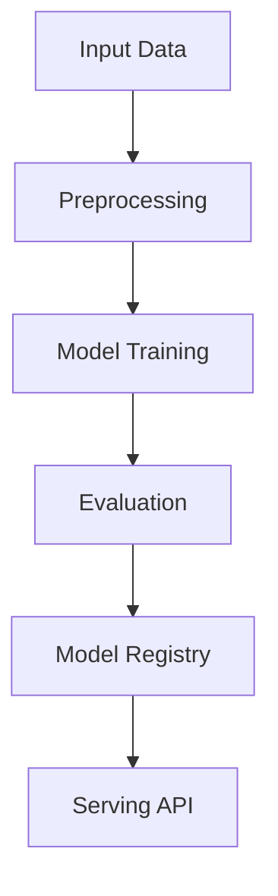

# anomaly-detection-fraud

## ∫ Mathematics & Theory

Anomaly Detection / Autoencoder — Underlying equations and derivations

$$z = f(x) = \sigma(W_e x + b_e) \quad \text{(encoder)}$$

$$\hat{x} = g(z) = \sigma(W_d z + b_d) \quad \text{(decoder)}$$

$$\mathcal{L} = \|x - \hat{x}\|^2 + \lambda (\|W_e\|^2 + \|W_d\|^2)$$

$$\text{anomaly score} = \|x - \hat{x}\|^2$$

### Step-by-Step Derivation

Autoencoders learn compressed representations by minimizing reconstruction error. The encoder maps input $x$ to a latent code $z$. The decoder reconstructs $\hat{x}$ from $z$. L2 regularization and bottleneck architecture prevent trivial identity solutions.

### Interactive Visualization

Interactive latent space traversal; reconstruction error vs latent dimension; bottleneck visualization.

## ⚙ Architecture

Model structure, data flow, and layer breakdown

### Class Hierarchy

```
  FraudDetectionAutoencoder
```

### Data Flow



## ⚡ API Reference

FastAPI endpoints and model interfaces

| Method | Endpoint |
| --- | --- |
| `GET` | `/` |
| `GET` | `/health` |
| `GET` | `/metrics` |
| `POST` | `/reload` |

## ▶ Usage

Code examples and CLI commands

### Training Script

```python
"""Training pipeline for credit card fraud detection using a feedforward autoencoder."""

import argparse
import os
from pathlib import Path

import numpy as np
from ai_core.logging import get_logger, setup_logging
from ai_core.model_registry import ModelRegistry

from anomaly_detection_fraud.data import generate_synthetic_data, save_training_data
from anomaly_detection_fraud.model import FraudDetectionAutoencoder

logger = get_logger(__name__)

def train(
    model_dir: Path,
    data_path: Path | None = None,
    n_samples: int = 2000,
    anomaly_fraction: float = 0.05,
    hidden_dim: int = 8,
    learning_rate: float = 0.001,
    n_iterations: int = 2000,
    threshold_percentile: float = 95.0,
    weight_decay: float = 0.0001,
    model_version: str = "1.0.0",
    register_to_mlflow: bool = False,
    random_seed: int = 42,
) -> dict:
    """Train the fraud detection autoencoder and save artifacts.

    The model is trained on normal transactions only. Fraudulent transactions
    are detected at inference time via high reconstruction error.
    """
    X_full, y_full = generate_synthetic_data(
        n_samples=n_samples, anomaly_fraction=anomaly_fraction, random_seed=random_seed
    )

    n_normal = int(np.sum(y_full == 0))
    n_fraud = int(np.sum(y_full == 1))
    logger.info(
        "Loaded training data",
        n_total=len(X_full),
        n_normal=n_normal,
        n_fraud=n_fraud,
        data_path=str(data_path),
    )

    # Split: training on normal only, test with both
    X_normal = X_full[y_full == 0]
    X_anomaly = X_full[y_full == 1]

    rng = np.random.default_rng(random_seed)
    n_val = max(1, int(len(X_normal) * 0.2))
    val_idx = rng.choice(len(X_normal), size=n_val, replace=False)
    val_mask = np.zeros(len(X_normal), dtype=bool)
    val_mask[val_idx] = True

    X_train = X_normal[~val_mask]
    X_val = X_normal[val_mask]

    # Split anomaly data for test evaluation
    n_test_anomaly = max(1, int(len(X_anomaly) * 0.5))
    test_anom_idx = rng.choice(len(X_anomaly), size=n_test_anomaly, replace=False)
    X_test_anomaly = X_anomaly[test_anom_idx]
    y_test_anomaly = np.ones(n_test_anomaly, dtype=int)

    test_norm_idx = rng.choice(len(X_normal), size=n_test_anomaly, replace=False)
    X_test_normal = X_normal[test_norm_idx]
    y_test_normal = np.zeros(n_test_anomaly, dtype=int)

    X_test = np.vstack([X_test_normal, X_test_anomaly])
    y_test = np.concatenate([y_test_normal, y_test_anomaly])

    logger.info(
        "Data split for anomaly detection",
        n_train=len(X_train),
        n_val=len(X_val),
        n_test=len(X_test),
        n_features=X_train.shape[1],
        training_mode="autoencoder (normal data only)",
    )

    # Save training data for reproducibility
    model_dir.mkdir(parents=True, exist_ok=True)
    save_training_data(X_full, y_full, model_dir / "training_data.csv")

    # Train model
    model = FraudDetectionAutoencoder(
        hidden_dim=hidden_dim,
        learning_rate=learning_rate,
        n_iterations=n_iterations,
        threshold_percentile=threshold_percentile,
        weight_decay=weight_decay,
        random_seed=random_seed,
    )
    model.fit(X_train, X_val=X_val, X_test=X_test, y_test=y_test)

    # Evaluate
    test_metrics = model.evaluate(X_test, y_test)

    logger.info(
        "Training complete",
        training_mode=model.training_mode,
        n_epochs=len(model.loss_history),
        final_loss=model.loss_history[-1] if model.loss_history else 0.0,
        threshold=model.threshold,
        test_metrics=test_metrics,
    )

    # Save model
    model_path = model_dir / f"fraud_detection_model_v{model_version}.npz"
    model.save(str(model_path))

    # Save training chart
    _save_chart(model, model_dir, model_version)

    # Combined metrics for registry
    train_errors = model.reconstruction_error(X_train)
    metrics = {
        **test_metrics,
        "training_mode": "anomaly_detection",
        "n_epochs_run": float(len(model.loss_history)),
        "final_loss": model.loss_history[-1] if model.loss_history else 0.0,
        "anomaly_threshold": float(model.threshold),
        "threshold_percentile": float(threshold_percentile),
        "n_train_samples": float(len(X_train)),
        "n_val_samples": float(len(X_val)),
        "n_test_samples": float(len(X_test)),
        "n_normal_train": float(len(X_train)),
        "n_fraud_detected": float(test_metrics["n_true_positives"]),
        "hidden_dim": float(hidden_dim),
        "learning_rate": float(learning_rate),
        "weight_decay": float(weight_decay),
        "train_mean_recon_error": float(np.mean(train_errors)),
        "n_features": float(X_train.shape[1]),
    }

    # Register model
    registry = ModelRegistry(base_dir=model_dir)
    registry.save_model(
        model_name="credit-card-fraud-detection",
        model_version=model_version,
        model_type="anomaly_detection",
        metrics=metrics,
        parameters={
            "hidden_dim": hidden_dim,
            "learning_rate": learning_rate,
            "n_iterations": n_iterations,
            "threshold_percentile": threshold_percentile,
            "weight_decay": weight_decay,
            "random_seed": random_seed,
        },
        artifacts={
            f"fraud_detection_model_v{model_version}.npz": model_path,
            "training_data.csv": model_dir / "training_data.csv",
        },
        tags={
            "framework": "numpy",
            "task": "anomaly_detection",
            "model_type": "feedforward_neural_network",
        },
    )

    if register_to_mlflow:
        registry.log_to_mlflow(
            model_name="credit-card-fraud-detection",
            model_version=model_version,
            metrics=metrics,
            params={
                "hidden_dim": hidden_dim,
                "learning_rate": learning_rate,
                "n_iterations": n_iterations,
                "threshold_percentile": threshold_percentile,
                "weight_decay": weight_decay,
                "random_seed": random_seed,
            },
            artifacts={
                "model": str(model_path),
                "chart": str(model_dir / f"fraud_detection_v{model_version}.png"),
                "training_data": str(model_dir / "training_data.csv"),
            },
            tags={"model_type": "anomaly_detection", "framework": "numpy"},
        )
        logger.info(
            "Registered model to MLflow", model="credit-card-fraud-detection", version=model_version
        )

    return metrics

def _save_chart(model: FraudDetectionAutoencoder, output_dir: Path, version: str) -> None:
    """Save the training loss chart."""
    import matplotlib

    matplotlib.use("Agg")
    import matplotlib.pyplot as plt

    if not model.loss_history:
        return

    fig, ax = plt.subplots(figsize=(10, 5))
    ax.plot(model.loss_history, color="steelblue", linewidth=1.5)
    ax.set_xlabel("Training Iteration")
    ax.set_ylabel("Loss (MSE + L2)")
    ax.set_title("Credit Card Fraud Detection Autoencoder Training Loss")
    ax.grid(True, alpha=0.3)
    ax.set_yscale("log")

    plt.tight_layout()
    chart_path = output_dir / f"fraud_detection_v{version}.png"
    plt.savefig(str(chart_path), dpi=100)
    plt.close()
    logger.info("Chart saved", path=str(chart_path))

def main():
    parser = argparse.ArgumentParser(description="Train credit card fraud detection neural network")
    parser.add_argument("--model-dir", type=Path, default=Path(os.getenv("MODEL_DIR", "/models")))
    parser.add_argument("--data-path", type=Path, default=None)
    parser.add_argument("--n-samples", type=int, default=int(os.getenv("N_SAMPLES", "2000")))
    parser.add_argument("--hidden-dim", type=int, default=int(os.getenv("HIDDEN_DIM", "8")))
    parser.add_argument(
        "--learning-rate", type=float, default=float(os.getenv("LEARNING_RATE", "0.001"))
    )
    parser.add_argument("--n-iterations", type=int, default=int(os.getenv("N_ITERATIONS", "2000")))
    parser.add_argument(
        "--threshold-percentile",
        type=float,
        default=float(os.getenv("THRESHOLD_PERCENTILE", "95.0")),
    )
    parser.add_argument(
        "--weight-decay", type=float, default=float(os.getenv("WEIGHT_DECAY", "0.0001"))
    )
    parser.add_argument("--model-version", type=str, default=os.getenv("MODEL_VERSION", "1.0.0"))
    parser.add_argument("--random-seed", type=int, default=int(os.getenv("RANDOM_SEED", "42")))
    parser.add_argument(
        "--register-mlflow",
        action="store_true",
        default=os.getenv("REGISTER_MLFLOW", "false").lower() == "true",
    )
    parser.add_argument("--log-level", type=str, default=os.getenv("LOG_LEVEL", "INFO"))
    args = parser.parse_args()

    setup_logging(args.log_level)
    args.model_dir.mkdir(parents=True, exist_ok=True)

    metrics = train(
        model_dir=args.model_dir,
        data_path=args.data_path,
        n_samples=args.n_samples,
        hidden_dim=args.hidden_dim,
        learning_rate=args.learning_rate,
        n_iterations=args.n_iterations,
        threshold_percentile=args.threshold_percentile,
        weight_decay=args.weight_decay,
        model_version=args.model_version,
        register_to_mlflow=args.register_mlflow,
        random_seed=args.random_seed,
    )

    logger.info("Training finished", metrics=metrics, model_dir=str(args.model_dir))

if __name__ == "__main__":
    main()
```

### API Server

```python
"""Production serving API for credit card fraud detection via autoencoder reconstruction error."""

import os
import time
from contextlib import asynccontextmanager
from pathlib import Path

import numpy as np
from ai_core.drift import DriftDetector
from ai_core.fastapi_middleware import add_observability_middleware
from ai_core.logging import get_logger, setup_logging
from ai_core.metrics import MetricsCollector
from ai_core.model_registry import ModelRegistry
from fastapi import FastAPI, HTTPException, Response
from pydantic import BaseModel, Field

from anomaly_detection_fraud.data import FEATURE_NAMES
from anomaly_detection_fraud.model import FraudDetectionAutoencoder

logger = get_logger(__name__)

# Configuration
MODEL_DIR = Path(os.getenv("MODEL_DIR", "/models"))
MODEL_VERSION = os.getenv("MODEL_VERSION", "latest")
METRICS_PORT = int(os.getenv("METRICS_PORT", os.getenv("FRAUD_DETECTION_METRICS_PORT", "8010")))
DRIFT_THRESHOLD = float(os.getenv("DRIFT_THRESHOLD", "0.2"))

class FraudRequest(BaseModel):
    """Single credit card transaction for fraud detection."""

    time_since_last_transaction: float = Field(
        ..., ge=0, description="Minutes since last transaction"
    )
    transaction_amount: float = Field(..., ge=0, description="Transaction amount in USD")
    merchant_category: float = Field(..., ge=0, le=11, description="Merchant category code (0-11)")
    merchant_risk_score: float = Field(..., ge=0, le=1, description="Merchant risk score (0-1)")
    cardholder_risk_score: float = Field(..., ge=0, le=1, description="Cardholder risk score (0-1)")
    distance_from_home: float = Field(..., ge=0, description="Distance from home in miles")
    is_online: float = Field(..., ge=0, le=1, description="Whether transaction is online (0/1)")
    is_foreign: float = Field(..., ge=0, le=1, description="Whether transaction is foreign (0/1)")
    hour_of_day: float = Field(..., ge=0, le=23, description="Hour of day (0-23)")
    day_of_week: float = Field(..., ge=0, le=6, description="Day of week (0-6)")
    account_age_days: float = Field(..., ge=0, description="Account age in days")
    recent_transaction_count: float = Field(..., ge=0, description="Recent transaction count")
    avg_transaction_amount_24h: float = Field(..., ge=0, description="Avg transaction amount (24h)")
    device_risk_score: float = Field(..., ge=0, le=1, description="Device risk score (0-1)")
    ip_risk_score: float = Field(..., ge=0, le=1, description="IP risk score (0-1)")

class FraudBulkRequest(BaseModel):
    """Bulk fraud detection request."""

    samples: list[FraudRequest] = Field(..., min_length=1, max_length=100)

class FraudResponse(BaseModel):
    """Fraud detection response for a single transaction."""

    is_fraud: bool
    fraud_probability: float
    reconstruction_error: float
    anomaly_threshold: float
    model_version: str
    training_mode: str

class BulkFraudResponse(BaseModel):
    """Bulk fraud detection response."""

    samples: list[FraudResponse]
    n_frauds: int
    n_samples: int
    model_version: str

class DriftResponse(BaseModel):
    """Drift detection response."""

    total_features: int
    drifted_features: int
    drift_ratio: float
    drifted: list[dict]
    all_results: list[dict]

class StatsResponse(BaseModel):
    """Model statistics response."""

    n_features: int
    hidden_dim: int
    training_mode: str
    n_epochs_run: int
    final_loss: float
    threshold: float
    model_version: str

# Global model state
_model: FraudDetectionAutoencoder | None = None
_model_version: str = "unknown"
_metrics: MetricsCollector | None = None
_drift_detector: DriftDetector | None = None
_reference_data: np.ndarray | None = None
_recent_predictions: list[list[float]] = []

@asynccontextmanager
async def lifespan(app: FastAPI):
    global _model, _model_version, _metrics, _drift_detector, _reference_data

    setup_logging(os.getenv("LOG_LEVEL", "INFO"))
    _metrics = MetricsCollector("credit_card_fraud_detection", port=METRICS_PORT)
    app.state.metrics = _metrics

    _drift_detector = DriftDetector(
        feature_names=FEATURE_NAMES,
        feature_types={f: "float" for f in FEATURE_NAMES},
        psi_threshold=DRIFT_THRESHOLD,
    )

    _model, _model_version = _load_model()
    _metrics.set_model_version(_model_version)
    _metrics.set_model_info(
        model_name="credit-card-fraud-detection",
        model_version=_model_version,
        model_type="anomaly_detection",
    )

    _reference_data = _load_reference_data()
    logger.info("Model loaded", model="credit-card-fraud-detection", version=_model_version)

    yield

    logger.info("Shutting down credit-card-fraud-detection API")

def _load_model() -> tuple[FraudDetectionAutoencoder, str]:
    registry = ModelRegistry(base_dir=MODEL_DIR)
    try:
        if MODEL_VERSION == "latest":
            models = registry.list_models()
            fraud_models = [
                m for m in models if m.get("model_name") == "credit-card-fraud-detection"
            ]
            if fraud_models:
                fraud_models.sort(key=lambda m: m["model_version"], reverse=True)
                latest = fraud_models[0]
                model_dir = Path(latest["artifact_path"])
                npz_files = list(model_dir.glob("fraud_detection_model_*.npz")) + list(
                    model_dir.glob("*.npz")
                )
                if npz_files:
                    return FraudDetectionAutoencoder.load(str(npz_files[0])), latest[
                        "model_version"
                    ]
        else:
            model_dir = MODEL_DIR / "credit-card-fraud-detection" / MODEL_VERSION
            if model_dir.exists():
                npz_files = list(model_dir.glob("fraud_detection_model_*.npz")) + list(
                    model_dir.glob("*.npz")
                )
                if npz_files:
                    return FraudDetectionAutoencoder.load(str(npz_files[0])), MODEL_VERSION
    except Exception as e:
        logger.warning(f"Registry lookup failed: {e}")

    npz_path = MODEL_DIR / "fraud_detection_model.npz"
    if npz_path.exists():
        return FraudDetectionAutoencoder.load(str(npz_path)), "legacy"

    candidate_paths = [
        Path("/app/artifacts/models/fraud_detection_model_v1.0.0.npz"),
        Path(__file__).resolve().parents[3]
        / "artifacts"
        / "models"
        / "fraud_detection_model_v1.0.0.npz",
    ]
    for p in candidate_paths:
        if p.exists():
            logger.info("Loading bundled baseline model", path=str(p))
            return FraudDetectionAutoencoder.load(str(p)), "1.0.0-bundled"

    logger.warning("No pre-existing model found on disk. Initializing baseline model.")
    from anomaly_detection_fraud.data import generate_normal_data

    X_base = generate_normal_data(n_samples=2000, random_seed=42)
    model = FraudDetectionAutoencoder(
        hidden_dim=8, learning_rate=0.001, n_iterations=500, random_seed=42
    )
    model.fit(X_base)
    return model, "1.0.0-baseline"

def _load_reference_data() -> np.ndarray | None:
    candidate_csvs = [
        MODEL_DIR / "credit-card-fraud-detection" / _model_version / "training_data.csv",
        MODEL_DIR / "training_data.csv",
        Path("/app/artifacts/models/training_data.csv"),
        Path(__file__).resolve().parents[3] / "artifacts" / "models" / "training_data.csv",
    ]
    for csv_path in candidate_csvs:
        if csv_path.exists():
            try:
                import pandas as pd

                df = pd.read_csv(csv_path)
                if all(f in df.columns for f in FEATURE_NAMES):
                    return df[FEATURE_NAMES].values
            except Exception as e:
                logger.warning("Could not read reference csv", path=str(csv_path), error=str(e))

    from anomaly_detection_fraud.data import generate_normal_data

    X_base = generate_normal_data(n_samples=500, random_seed=42)
    return X_base

app = FastAPI(
    title="Credit Card Fraud Detection API",
    description="Feedforward autoencoder for detecting fraudulent credit card transactions",
    version="1.0.0",
    lifespan=lifespan,
)

add_observability_middleware(app)

@app.get("/")
def read_root():
    return {
        "service": "credit-card-fraud-detection-api",
        "version": "1.0.0",
        "model_version": _model_version,
        "training_mode": _model.training_mode if _model else "unknown",
        "features": FEATURE_NAMES,
        "endpoints": {
            "health": "/health",
            "predict": "POST /predict",
            "predict/bulk": "POST /predict/bulk",
            "stats": "GET /stats",
            "drift": "GET /drift",
            "metrics": "/metrics",
        },
    }

@app.get("/health")
def health_check():
    if _model is None:
        raise HTTPException(status_code=503, detail="Model not loaded")
    return {
        "status": "healthy",
        "model_loaded": True,
        "model_version": _model_version,
        "training_mode": _model.training_mode if _model else "unknown",
    }

@app.get("/metrics")
def metrics():
    from prometheus_client import CONTENT_TYPE_LATEST, generate_latest

    return Response(content=generate_latest(), media_type=CONTENT_TYPE_LATEST)

@app.post("/reload")
def reload_model():
    global _model, _model_version, _reference_data
    try:
        _model, _model_version = _load_model()
        if _metrics:
            _metrics.set_model_version(_model_version)
            _metrics.set_model_info(
                model_name="credit-card-fraud-detection",
                model_version=_model_version,
                model_type="anomaly_detection",
            )
        _reference_data = _load_reference_data()
        logger.info(
            "Model reloaded dynamically",
            model="credit-card-fraud-detection",
            version=_model_version,
        )
        return {"status": "reloaded", "model_version": _model_version}
    except Exception as e:
        logger.exception("Model reload failed", error=str(e))
        raise HTTPException(status_code=500, detail=f"Reload failed: {e}") from e

@app.get("/drift", response_model=DriftResponse)
def drift_check():
    if _drift_detector is None or _reference_data is None:
        raise HTTPException(status_code=503, detail="Drift detection not available")

    if len(_recent_predictions) < 10:
        return DriftResponse(
            total_features=len(FEATURE_NAMES),
            drifted_features=0,
            drift_ratio=0.0,
            drifted=[],
            all_results=[],
        )

    current = np.array(_recent_predictions[-100:])
    results = _drift_detector.detect_drift(_reference_data, current)
    summary = _drift_detector.summarize(results)

    if _metrics:
        _metrics.set_drift_ratio(summary["drift_ratio"])

    return DriftResponse(**summary)

@app.get("/stats", response_model=StatsResponse)
def get_stats():
    if _model is None or _model.W1 is None:
        raise HTTPException(status_code=503, detail="Model not loaded")

    return StatsResponse(
        n_features=_model.input_dim,
        hidden_dim=_model.hidden_dim,
        training_mode=_model.training_mode,
        n_epochs_run=len(_model.loss_history),
        final_loss=_model.loss_history[-1] if _model.loss_history else 0.0,
        threshold=_model.threshold,
        model_version=_model_version,
    )

def _extract_features(obs: FraudRequest) -> list[float]:
    return [
        obs.time_since_last_transaction,
        obs.transaction_amount,
        obs.merchant_category,
        obs.merchant_risk_score,
        obs.cardholder_risk_score,
        obs.distance_from_home,
        obs.is_online,
        obs.is_foreign,
        obs.hour_of_day,
        obs.day_of_week,
        obs.account_age_days,
        obs.recent_transaction_count,
        obs.avg_transaction_amount_24h,
        obs.device_risk_score,
        obs.ip_risk_score,
    ]

def _compute_fraud(obs: FraudRequest) -> FraudResponse:
    if _model is None or _metrics is None:
        raise HTTPException(status_code=503, detail="Model not loaded")

    features = _extract_features(obs)
    X = np.array([features])

    start = time.time()
    try:
        recon_error = float(_model.reconstruction_error(X)[0])
        is_fraud = bool(_model.is_fraud(X)[0])
        proba = float(_model.predict_proba(X)[0])
        duration = time.time() - start
        _metrics.record_prediction(model_version=_model_version, duration=duration)

        _recent_predictions.append(features)
        if len(_recent_predictions) > 1000:
            _recent_predictions.pop(0)

        return FraudResponse(
            is_fraud=is_fraud,
            fraud_probability=round(proba, 4),
            reconstruction_error=round(recon_error, 4),
            anomaly_threshold=round(_model.threshold, 4),
            model_version=_model_version,
            training_mode=_model.training_mode if _model else "unknown",
        )
    except Exception as e:
        _metrics.record_error(model_version=_model_version, error_type="prediction")
        logger.exception("Fraud detection failed", error=str(e))
        raise HTTPException(status_code=500, detail="Fraud detection failed") from e

@app.post("/predict", response_model=FraudResponse)
def predict_fraud(body: FraudRequest):
    """Detect fraud for a single transaction."""
    return _compute_fraud(body)

@app.post("/predict/bulk", response_model=BulkFraudResponse)
def predict_fraud_bulk(body: FraudBulkRequest):
    """Detect fraud for multiple transactions."""
    global _recent_predictions
    if _model is None or _metrics is None:
        raise HTTPException(status_code=503, detail="Model not loaded")

    if len(body.samples) < 1 or len(body.samples) > 100:
        raise HTTPException(status_code=422, detail="Batch size must be between 1 and 100")

    X = np.array([_extract_features(s) for s in body.samples])

    start = time.time()
    try:
        recon_errors = _model.reconstruction_error(X)
        anomalies = _model.is_fraud(X)
        probas = _model.predict_proba(X)
        duration = time.time() - start
        _metrics.record_prediction(model_version=_model_version, duration=duration)

        _recent_predictions.extend(X.tolist())
        if len(_recent_predictions) > 1000:
            _recent_predictions = _recent_predictions[-1000:]

        results = [
            FraudResponse(
                is_fraud=bool(anom),
                fraud_probability=round(float(proba), 4),
                reconstruction_error=round(float(recon_error), 4),
                anomaly_threshold=round(_model.threshold, 4),
                model_version=_model_version,
                training_mode=_model.training_mode if _model else "unknown",
            )
            for anom, recon_error, proba in zip(anomalies, recon_errors, probas, strict=False)
        ]

        return BulkFraudResponse(
            samples=results,
            n_frauds=int(np.sum(anomalies)),
            n_samples=len(results),
            model_version=_model_version,
        )
    except Exception as e:
        _metrics.record_error(model_version=_model_version, error_type="prediction")
        logger.exception("Bulk fraud detection failed", error=str(e))
        raise HTTPException(status_code=500, detail="Bulk fraud detection failed") from e
```

### CLI Commands

```bash
uv run python -m anomaly_detection_fraud.train --model-dir ./artifacts/models
```

## 📊 Benchmarks

Test results and performance metrics

Run `pytest tests/test_models.py` and `pytest tests/test_apis.py` for detailed metrics.

### Related Apps

- [anomaly-detection-pca](../anomaly-detection-pca/README.md)

Generated documentation for **anomaly-detection-fraud**
