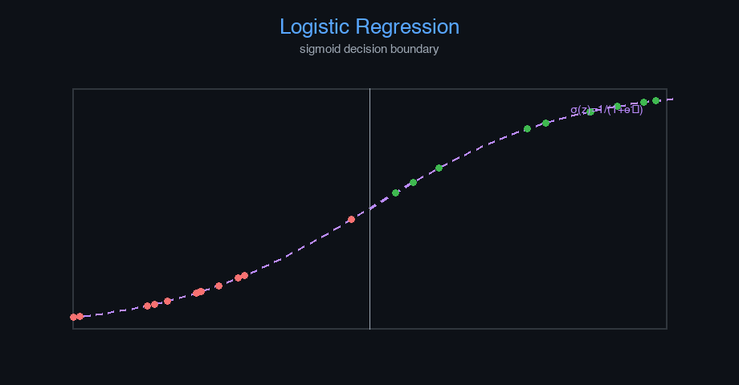

# classification-email-spam


Logistic Regression — AI engineering example · part of the MLOps monorepo

## 1. Mathematical Foundations

This example is grounded in **Logistic Regression**. The equations below
drive every forward and backward pass in the implementation.

$$z = w \cdot x + b$$

$$\hat{y} = \sigma(z) = \frac{1}{1 + e^{-z}}$$

$$\mathcal{L}_{BCE} = -\frac{1}{n} \sum_{i=1}^{n} [y_i \log(\hat{y}_i) + (1-y_i)\log(1-\hat{y}_i)]$$

$$\frac{\partial \mathcal{L}}{\partial w} = \frac{1}{n} \sum_{i=1}^{n} (\hat{y}_i - y_i)x_i$$

### Derivation

Logistic regression models $P(y=1|x)$ via the sigmoid function. Binary cross-entropy loss penalizes confident wrong predictions. The gradient simplifies to $\hat{y} - y$, enabling efficient SGD.

### Worked Numerical Example

$$z = w \cdot x + b$$

Illustrative forward-pass evaluation (scalar example):

Input  x        = 12.0   (e.g. pizza diameter, inches)
Weights w       =  0.85
Bias    b       =  0.30
---------------------------------
z = w*x + b
  = 0.85 * 12.0 + 0.30
  = 10.20 + 0.30
  = 10.50   <- model output

### Conceptual Diagram

        Math concept (placeholder)
   [ Input x ] --> ( w · x + b ) --> [ Output z ]
                       |
                  [ activation ]
                       |
                  [ prediction ]



Sigmoid curve with decision boundary overlay; ROC and precision-recall curves.

## 2. Core Logic & Architecture

The example follows a consistent **data → train → evaluate → serve**
pipeline. Inputs are loaded and validated, transformed by the core algorithm, scored against
held-out data, and exposed through a REST API.

  Raw dataset→
  load + validate (data.py)→
  fit / transform (model.py)→
  evaluate + persist (train.py)→
  serve (api.py)

### Primary Components

| Class | Public methods | Responsibility |
| --- | --- | --- |
| `PredictRequest` | — | Single email spam prediction request. |
| `PredictBulkRequest` | — | Bulk email spam prediction request. |
| `PredictResponse` | — | Prediction response. |
| `BulkPredictResponse` | — | Bulk prediction response. |
| `DriftResponse` | — | Drift detection response. |
| `StatsResponse` | — | Model statistics response. |
| `SpamDetectionNN` | _he_init, _xavier_init, _forward, fit, predict_proba, predict, accuracy, precision, recall, f1_score, roc_auc, evaluate, save, load, to_dict | Feedforward neural network for binary spam classification.  Architecture: Input -> Hidden (ReLU) -> Output (Sigmoid)  Args:     hidden_dim: Number of neurons in the hidden layer     learning_rate: Gradient descent step size     n_iterations: Maximum number of training iterations     weight_decay: L2 regularization strength     random_seed: Random seed for reproducibility |

### Data Flow


1. **Load** — `data.py` reads the source dataset and splits train/test.


2. **Validate** — a Pydantic schema guards input shape/dtypes before training.


3. **Fit / Transform** — `model.py` applies the mathematics from Section 1.


4. **Evaluate** — metrics (MSE/RMSE/R², accuracy, etc.) are computed and logged.


5. **Persist** — weights/artifacts are saved and registered in the model registry.


6. **Serve** — `api.py` exposes prediction endpoints with drift detection.

### Design Patterns & Performance

Key design choices in this module: a pure-NumPy implementation (no PyTorch/TensorFlow), schema validation via `ai_core.validation`, structured JSON logging through `ai_core.logging`, Prometheus metrics from `ai_core.metrics`, and MLflow/model-registry persistence via `ai_core.model_registry`. The FastAPI service wraps the trained model with observability middleware from `ai_core.fastapi_middleware`.

## 3. Detailed Code Walkthrough

The most important behaviour is summarised below; full source for each module is collapsible
so the page stays readable while remaining self-contained.

### `SpamDetectionNN.fit(X, y, X_val, y_val)`

Train the neural network using batch gradient descent.

Args:
    X: Training features (n_samples, n_features)
    y: Training labels (n_samples,) — 1=spam, 0=ham
    X_val: Optional validation features
    y_val: Optional validation labels

Returns:
    self

### `SpamDetectionNN.predict(X, threshold)`

Return 1 (spam) if probability >= threshold, else 0 (ham).

### `SpamDetectionNN.evaluate(X, y)`

Compute all evaluation metrics.

### Source Files

<details>
<summary>model.py</summary>

```
"""Feedforward neural network for email spam classification.

A multi-layer perceptron (MLP) with one hidden layer, trained via
backpropagation and batch gradient descent. Built from scratch with NumPy.

Architecture:
    Input (n_features) -> Hidden (hidden_dim, ReLU) -> Output (1, Sigmoid)

Loss: Binary Cross-Entropy
Optimizer: Gradient Descent with He initialization
"""

from dataclasses import dataclass, field
from typing import Literal

import numpy as np

def _relu(z: np.ndarray) -> np.ndarray:
    """ReLU activation function."""
    return np.maximum(0, z)

def _relu_derivative(z: np.ndarray) -> np.ndarray:
    """Derivative of ReLU."""
    return (z > 0).astype(z.dtype)

def _sigmoid(z: np.ndarray) -> np.ndarray:
    """Sigmoid activation with numerical stability."""
    z = np.clip(z, -500, 500)
    return 1 / (1 + np.exp(-z))

def _binary_cross_entropy(y_true: np.ndarray, y_pred: np.ndarray) -> float:
    """Binary cross-entropy loss."""
    eps = 1e-9
    y_pred = np.clip(y_pred, eps, 1 - eps)
    return float(-np.mean(y_true * np.log(y_pred) + (1 - y_true) * np.log(1 - y_pred)))

@dataclass
class SpamDetectionNN:
    """Feedforward neural network for binary spam classification.

    Architecture: Input -> Hidden (ReLU) -> Output (Sigmoid)

    Args:
        hidden_dim: Number of neurons in the hidden layer
        learning_rate: Gradient descent step size
        n_iterations: Maximum number of training iterations
        weight_decay: L2 regularization strength
        random_seed: Random seed for reproducibility
    """

    hidden_dim: int = 16
    learning_rate: float = 0.01
    n_iterations: int = 1000
    weight_decay: float = 0.001
    hidden_activation: Literal["relu", "tanh"] = "relu"
    random_seed: int = 42

    # Learned parameters
    input_dim: int = 0
    W1: np.ndarray | None = None
    b1: np.ndarray | None = None
    W2: np.ndarray | None = None
    b2: float | None = None

    # Training metadata
    training_mode: str = "supervised"
    loss_history: list[float] = field(default_factory=list)
    val_accuracy_history: list[float] = field(default_factory=list)
    mean_: np.ndarray | None = None
    std_: np.ndarray | None = None

    def _he_init(self, n_in: int, n_out: int, rng: np.random.Generator) -> np.ndarray:
        """He initialization for ReLU networks."""
        return rng.normal(0, np.sqrt(2.0 / n_in), (n_in, n_out))

    def _xavier_init(self, n_in: int, n_out: int, rng: np.random.Generator) -> np.ndarray:
        """Xavier initialization for tanh networks."""
        return rng.normal(0, np.sqrt(1.0 / n_in), (n_in, n_out))

    def _forward(self, X: np.ndarray) -> tuple[np.ndarray, np.ndarray, np.ndarray]:
        """Forward pass through the network.

        Returns: (output_probs, hidden_activations, z1)
        """
        z1 = np.dot(X, self.W1) + self.b1

        a1 = _relu(z1) if self.hidden_activation == "relu" else np.tanh(z1)

        z2 = np.dot(a1, self.W2) + self.b2
        output = _sigmoid(z2)
        return output, a1, z1

    def fit(
        self,
        X: np.ndarray,
        y: np.ndarray,
        X_val: np.ndarray | None = None,
        y_val: np.ndarray | None = None,
    ) -> "SpamDetectionNN":
        """Train the neural network using batch gradient descent.

        Args:
            X: Training features (n_samples, n_features)
            y: Training labels (n_samples,) — 1=spam, 0=ham
            X_val: Optional validation features
            y_val: Optional validation labels

        Returns:
            self
        """
        rng = np.random.default_rng(self.random_seed)

        X = np.asarray(X, dtype=float)
        y = np.asarray(y, dtype=float).flatten()

        n_samples, n_features = X.shape
        self.input_dim = n_features

        # Normalize features
        self.mean_ = X.mean(axis=0)
        self.std_ = np.where(X.std(axis=0) < 1e-8, 1.0, X.std(axis=0))
        X_norm = (X - self.mean_) / self.std_

        # Normalize validation set
        X_val_norm = None
        if X_val is not None and y_val is not None:
            X_val_norm = (X_val - self.mean_) / self.std_
            self.val_accuracy_history = []

        # Initialize weights
        if self.hidden_activation == "relu":
            self.W1 = self._he_init(n_features, self.hidden_dim, rng)
        else:
            self.W1 = self._xavier_init(n_features, self.hidden_dim, rng)
        self.b1 = np.zeros(self.hidden_dim)
        self.W2 = self._xavier_init(self.hidden_dim, 1, rng)
        self.b2 = 0.0

        self.loss_history = []

        for epoch in range(self.n_iterations):
            # Forward pass
            output, a1, z1 = self._forward(X_norm)
            loss = _binary_cross_entropy(y, output.flatten())

            # L2 regularization term
            l2_penalty = self.weight_decay * (np.sum(self.W1**2) + np.sum(self.W2**2))
            loss += l2_penalty

            self.loss_history.append(loss)

            # Backpropagation
            m = n_samples
            dz2 = (output.flatten() - y) / m  # dL/dz2
            dW2 = np.dot(a1.T, dz2.reshape(-1, 1)) + self.weight_decay * self.W2
            db2 = float(np.sum(dz2))

            da1 = np.dot(dz2.reshape(-1, 1), self.W2.T)
            if self.hidden_activation == "relu":
                dz1 = da1 * _relu_derivative(z1)
            else:
                dz1 = da1 * (1 - np.tanh(z1) ** 2)

            dW1 = np.dot(X_norm.T, dz1) + self.weight_decay * self.W1
            db1 = np.sum(dz1, axis=0)

            # Gradient descent
            self.W1 -= self.learning_rate * dW1
            self.b1 -= self.learning_rate * db1
            self.W2 -= self.learning_rate * dW2
            self.b2 -= self.learning_rate * db2

            # Track validation accuracy
            if X_val_norm is not None and y_val is not None and epoch % 50 == 0:
                val_acc = self.accuracy(X_val_norm, y_val)
                self.val_accuracy_history.append(val_acc)

            # Early stopping
            if epoch > 100 and abs(self.loss_history[-1] - self.loss_history[-100]) < 1e-7:
                break

        return self

    def predict_proba(self, X: np.ndarray) -> np.ndarray:
        """Return spam probability for each email."""
        X = np.asarray(X, dtype=float)
        X_norm = (X - self.mean_) / self.std_
        probs, _, _ = self._forward(X_norm)
        return probs.flatten()

    def predict(self, X: np.ndarray, threshold: float = 0.5) -> np.ndarray:
        """Return 1 (spam) if probability >= threshold, else 0 (ham)."""
        return (self.predict_proba(X) >= threshold).astype(int)

    def accuracy(self, X: np.ndarray, y: np.ndarray) -> float:
        """Compute classification accuracy."""
        return float(np.mean(self.predict(X) == y))

    def precision(self, X: np.ndarray, y: np.ndarray) -> float:
        """Compute precision (positive predictive value)."""
        predictions = self.predict(X)
        tp = np.sum((predictions == 1) & (y == 1))
        fp = np.sum((predictions == 1) & (y == 0))
        if tp + fp == 0:
            return 0.0
        return float(tp / (tp + fp))

    def recall(self, X: np.ndarray, y: np.ndarray) -> float:
        """Compute recall (sensitivity)."""
        predictions = self.predict(X)
        tp = np.sum((predictions == 1) & (y == 1))
        fn = np.sum((predictions == 0) & (y == 1))
        if tp + fn == 0:
            return 0.0
        return float(tp / (tp + fn))

    def f1_score(self, X: np.ndarray, y: np.ndarray) -> float:
        """Compute F1 score."""
        p = self.precision(X, y)
        r = self.recall(X, y)
        if p + r == 0:
            return 0.0
        return float(2 * p * r / (p + r))

    def roc_auc(self, X: np.ndarray, y: np.ndarray) -> float:
        """Compute ROC AUC approximation."""
        probs = self.predict_proba(X)
        n_pos = np.sum(y == 1)
        n_neg = np.sum(y == 0)
        if n_pos == 0 or n_neg == 0:
            return 0.5
        rankings = np.argsort(-probs)
        sorted_y = y[rankings]
        rank_sum = np.sum(np.where(sorted_y == 1)[0] + 1)
        auc = (rank_sum - n_pos * (n_pos + 1) / 2) / (n_pos * n_neg)
        return float(auc)

    def evaluate(self, X: np.ndarray, y: np.ndarray) -> dict[str, float]:
        """Compute all evaluation metrics."""
        return {
            "accuracy": self.accuracy(X, y),
            "precision": self.precision(X, y),
            "recall": self.recall(X, y),
            "f1": self.f1_score(X, y),
            "roc_auc": self.roc_auc(X, y),
        }

    def save(self, path: str) -> None:
        """Save model parameters to disk."""
        if self.W1 is None:
            raise ValueError("Cannot save untrained model")

        np.savez(
            path,
            W1=self.W1,
            b1=self.b1,
            W2=self.W2,
            b2=np.array([self.b2]) if self.b2 is not None else np.array([0.0]),
            input_dim=np.array([self.input_dim]),
            hidden_dim=np.array([self.hidden_dim]),
            learning_rate=np.array([self.learning_rate]),
            n_iterations=np.array([self.n_iterations]),
            weight_decay=np.array([self.weight_decay]),
            hidden_activation=np.array([self.hidden_activation]),
            random_seed=np.array([self.random_seed]),
            mean_=self.mean_,
            std_=self.std_,
            loss_history=np.array(self.loss_history),
            val_accuracy_history=np.array(self.val_accuracy_history),
            training_mode=np.array([self.training_mode]),
        )

    @classmethod
    def load(cls, path: str) -> "SpamDetectionNN":
        """Load model parameters from disk."""
        data = np.load(path)

        model = cls(
            hidden_dim=int(data["hidden_dim"].item()),
            learning_rate=float(data["learning_rate"].item()),
            n_iterations=int(data["n_iterations"].item()),
            weight_decay=float(data["weight_decay"].item()),
            hidden_activation=str(data["hidden_activation"].item()),
            random_seed=int(data["random_seed"].item()),
        )

        model.W1 = data["W1"]
        model.b1 = data["b1"]
        model.W2 = data["W2"]
        model.b2 = float(data["b2"].item())
        model.input_dim = int(data["input_dim"].item())
        model.mean_ = data["mean_"]
        model.std_ = data["std_"]
        model.loss_history = list(data["loss_history"])
        model.val_accuracy_history = list(data["val_accuracy_history"])
        model.training_mode = str(data["training_mode"].item())

        return model

    def to_dict(self) -> dict:
        """Return model configuration as a dict."""
        return {
            "input_dim": self.input_dim,
            "hidden_dim": self.hidden_dim,
            "learning_rate": self.learning_rate,
            "n_iterations": self.n_iterations,
            "weight_decay": self.weight_decay,
            "hidden_activation": self.hidden_activation,
            "random_seed": self.random_seed,
            "training_mode": self.training_mode,
            "n_epochs_run": len(self.loss_history),
            "final_loss": self.loss_history[-1] if self.loss_history else 0.0,
        }
```

</details>

<details>
<summary>train.py</summary>

```
"""Training pipeline for email spam detection using a feedforward neural network."""

import argparse
import os
from pathlib import Path

from ai_core.logging import get_logger, setup_logging
from ai_core.model_registry import ModelRegistry
from ai_core.validation import DataValidator, create_email_spam_schema

from classification_email_spam.data import load_training_data, save_training_data, train_test_split
from classification_email_spam.model import SpamDetectionNN

logger = get_logger(__name__)

def train(
    model_dir: Path,
    data_path: Path | None = None,
    n_samples: int = 1000,
    hidden_dim: int = 16,
    learning_rate: float = 0.01,
    n_iterations: int = 1000,
    weight_decay: float = 0.001,
    threshold_percentile: float = 95.0,
    model_version: str = "1.0.0",
    register_to_mlflow: bool = False,
    test_size: float = 0.2,
    random_seed: int = 42,
) -> dict:
    """Train the spam detection neural network and save artifacts."""
    X, y = load_training_data(data_path, n_samples=n_samples, random_seed=random_seed)
    logger.info("Loaded training data", n_samples=len(X), data_path=str(data_path))

    # Validate training data
    validator = DataValidator(create_email_spam_schema())
    validation = validator.validate(X, y)
    if not validation.valid:
        logger.error("Training data validation failed", errors=validation.errors)
        raise ValueError(f"Training data validation failed: {validation.errors}")
    logger.info("Training data validated", stats=validation.stats)

    # Split train/test
    X_train, X_test, y_train, y_test = train_test_split(
        X, y, test_size=test_size, random_seed=random_seed
    )
    logger.info(
        "Data split",
        n_train=len(X_train),
        n_test=len(X_test),
        test_size=test_size,
        random_seed=random_seed,
    )

    # Save training data for reproducibility
    model_dir.mkdir(parents=True, exist_ok=True)
    save_training_data(X, y, model_dir / "training_data.csv")

    # Train model
    model = SpamDetectionNN(
        hidden_dim=hidden_dim,
        learning_rate=learning_rate,
        n_iterations=n_iterations,
        weight_decay=weight_decay,
        random_seed=random_seed,
    )
    model.fit(X_train, y_train, X_val=X_test, y_val=y_test)

    # Evaluate
    train_metrics = model.evaluate(X_train, y_train)
    test_metrics = model.evaluate(X_test, y_test)

    logger.info(
        "Training complete",
        training_mode=model.training_mode,
        n_epochs=len(model.loss_history),
        final_loss=model.loss_history[-1] if model.loss_history else 0.0,
        train_metrics=train_metrics,
        test_metrics=test_metrics,
    )

    # Save model
    model_path = model_dir / f"spam_detection_model_v{model_version}.npz"
    model.save(str(model_path))

    # Save training chart
    _save_chart(model, model_dir, model_version)

    # Combined metrics for registry
    metrics = {
        **test_metrics,
        "training_mode": "supervised",
        "n_epochs_run": float(len(model.loss_history)),
        "final_loss": model.loss_history[-1] if model.loss_history else 0.0,
        "train_accuracy": train_metrics["accuracy"],
        "train_f1": train_metrics["f1"],
        "n_train_samples": float(len(X_train)),
        "n_test_samples": float(len(X_test)),
        "hidden_dim": float(hidden_dim),
        "learning_rate": float(learning_rate),
        "weight_decay": float(weight_decay),
        "n_features": float(X_train.shape[1]),
    }

    # Register model
    registry = ModelRegistry(base_dir=model_dir)
    registry.save_model(
        model_name="email-spam-detection",
        model_version=model_version,
        model_type="supervised_classification",
        metrics=metrics,
        parameters={
            "hidden_dim": hidden_dim,
            "learning_rate": learning_rate,
            "n_iterations": n_iterations,
            "weight_decay": weight_decay,
            "random_seed": random_seed,
        },
        artifacts={
            f"spam_detection_model_v{model_version}.npz": model_path,
            "training_data.csv": model_dir / "training_data.csv",
        },
        tags={
            "framework": "numpy",
            "task": "classification",
            "model_type": "feedforward_neural_network",
        },
    )

    if register_to_mlflow:
        registry.log_to_mlflow(
            model_name="email-spam-detection",
            model_version=model_version,
            metrics=metrics,
            params={
                "hidden_dim": hidden_dim,
                "learning_rate": learning_rate,
                "n_iterations": n_iterations,
                "weight_decay": weight_decay,
                "random_seed": random_seed,
            },
            artifacts={
                "model": str(model_path),
                "chart": str(model_dir / f"spam_classification_v{model_version}.png"),
                "training_data": str(model_dir / "training_data.csv"),
            },
            tags={"model_type": "classification", "framework": "numpy"},
        )
        logger.info(
            "Registered model to MLflow", model="email-spam-detection", version=model_version
        )

    return metrics

def _save_chart(model: SpamDetectionNN, output_dir: Path, version: str) -> None:
    """Save the training loss chart."""
    import matplotlib

    matplotlib.use("Agg")
    import matplotlib.pyplot as plt

    if not model.loss_history:
        return

    fig, ax = plt.subplots(figsize=(10, 5))
    ax.plot(model.loss_history, color="steelblue", linewidth=1.5)
    ax.set_xlabel("Training Iteration")
    ax.set_ylabel("Loss (Binary Cross-Entropy + L2)")
    ax.set_title("Email Spam Detection NN Training Loss")
    ax.grid(True, alpha=0.3)
    ax.set_yscale("log")

    plt.tight_layout()
    chart_path = output_dir / f"spam_classification_v{version}.png"
    plt.savefig(str(chart_path), dpi=100)
    plt.close()
    logger.info("Chart saved", path=str(chart_path))

def main():
    parser = argparse.ArgumentParser(description="Train email spam detection neural network")
    parser.add_argument("--model-dir", type=Path, default=Path(os.getenv("MODEL_DIR", "/models")))
    parser.add_argument("--data-path", type=Path, default=None)
    parser.add_argument("--n-samples", type=int, default=int(os.getenv("N_SAMPLES", "1000")))
    parser.add_argument("--hidden-dim", type=int, default=int(os.getenv("HIDDEN_DIM", "16")))
    parser.add_argument(
        "--learning-rate", type=float, default=float(os.getenv("LEARNING_RATE", "0.01"))
    )
    parser.add_argument("--n-iterations", type=int, default=int(os.getenv("N_ITERATIONS", "1000")))
    parser.add_argument(
        "--weight-decay", type=float, default=float(os.getenv("WEIGHT_DECAY", "0.001"))
    )
    parser.add_argument("--model-version", type=str, default=os.getenv("MODEL_VERSION", "1.0.0"))
    parser.add_argument("--test-size", type=float, default=float(os.getenv("TEST_SIZE", "0.2")))
    parser.add_argument("--random-seed", type=int, default=int(os.getenv("RANDOM_SEED", "42")))
    parser.add_argument(
        "--register-mlflow",
        action="store_true",
        default=os.getenv("REGISTER_MLFLOW", "false").lower() == "true",
    )
    parser.add_argument("--log-level", type=str, default=os.getenv("LOG_LEVEL", "INFO"))
    args = parser.parse_args()

    setup_logging(args.log_level)
    args.model_dir.mkdir(parents=True, exist_ok=True)

    metrics = train(
        model_dir=args.model_dir,
        data_path=args.data_path,
        n_samples=args.n_samples,
        hidden_dim=args.hidden_dim,
        learning_rate=args.learning_rate,
        n_iterations=args.n_iterations,
        weight_decay=args.weight_decay,
        model_version=args.model_version,
        register_to_mlflow=args.register_mlflow,
        test_size=args.test_size,
        random_seed=args.random_seed,
    )

    logger.info("Training finished", metrics=metrics, model_dir=str(args.model_dir))

if __name__ == "__main__":
    main()
```

</details>

<details>
<summary>data.py</summary>

```
"""Data loading and preprocessing for email spam detection."""

from pathlib import Path

import numpy as np
import pandas as pd

FEATURE_NAMES = [
    "has_free",
    "has_win",
    "has_link",
    "has_exclamation",
    "has_meeting",
    "email_length",
    "has_caps",
    "has_money",
    "num_links",
    "num_exclamations",
    "has_urgent",
    "sender_reputation",
]

DEFAULT_N_SAMPLES = 1000

def generate_synthetic_data(
    n_samples: int = DEFAULT_N_SAMPLES,
    random_seed: int = 42,
) -> tuple[np.ndarray, np.ndarray]:
    """Generate synthetic email features with spam/ham labels.

    Returns:
        Tuple of (X, y) where X is feature matrix and y is labels (1=spam, 0=ham).
    """
    rng = np.random.default_rng(random_seed)

    n_spam = n_samples // 2
    n_ham = n_samples - n_spam

    spam_emails = _generate_spam(n_spam, rng)
    ham_emails = _generate_ham(n_ham, rng)

    X = np.vstack([spam_emails, ham_emails])
    y = np.concatenate([np.ones(n_spam, dtype=int), np.zeros(n_ham, dtype=int)])

    indices = rng.permutation(len(X))
    return X[indices], y[indices]

def _generate_spam(n: int, rng: np.random.Generator) -> np.ndarray:
    """Generate synthetic spam email feature vectors."""
    return np.column_stack(
        [
            rng.integers(0, 2, n),
            rng.integers(0, 2, n),
            rng.integers(0, 2, n),
            rng.integers(0, 2, n),
            rng.integers(0, 2, n),
            rng.integers(5, 50, n),
            rng.integers(0, 2, n),
            rng.integers(0, 2, n),
            rng.integers(3, 15, n),
            rng.integers(5, 20, n),
            rng.integers(0, 2, n),
            rng.uniform(0.0, 0.3, n),
        ]
    ).astype(float)

def _generate_ham(n: int, rng: np.random.Generator) -> np.ndarray:
    """Generate synthetic legitimate email feature vectors."""
    return np.column_stack(
        [
            rng.choice(2, size=n, p=[0.7, 0.3]),
            rng.choice(2, size=n, p=[0.9, 0.1]),
            rng.choice(2, size=n, p=[0.6, 0.4]),
            rng.choice(2, size=n, p=[0.5, 0.5]),
            rng.choice(2, size=n, p=[0.3, 0.7]),
            rng.integers(20, 100, n),
            rng.choice(2, size=n, p=[0.3, 0.7]),
            rng.choice(2, size=n, p=[0.1, 0.9]),
            rng.integers(0, 5, n),
            rng.integers(0, 3, n),
            rng.choice(2, size=n, p=[0.9, 0.1]),
            rng.uniform(0.7, 1.0, n),
        ]
    ).astype(float)

def load_training_data(
    data_path: Path | None = None,
    n_samples: int = DEFAULT_N_SAMPLES,
    random_seed: int = 42,
) -> tuple[np.ndarray, np.ndarray]:
    """Load or generate email data for training."""
    if data_path and Path(data_path).exists():
        df = pd.read_csv(data_path)
        X = df[FEATURE_NAMES].values.astype(float)
        y = df["is_spam"].values.astype(int)
        return X, y

    return generate_synthetic_data(n_samples=n_samples, random_seed=random_seed)

def save_training_data(X: np.ndarray, y: np.ndarray, path: Path) -> None:
    """Save training data to CSV."""
    path = Path(path)
    path.parent.mkdir(parents=True, exist_ok=True)
    df = pd.DataFrame(X, columns=FEATURE_NAMES)
    df["is_spam"] = y
    df.to_csv(path, index=False)

def train_test_split(
    X: np.ndarray, y: np.ndarray, test_size: float = 0.2, random_seed: int | None = None
) -> tuple[np.ndarray, np.ndarray, np.ndarray, np.ndarray]:
    """Split data into train and test sets."""
    n = len(X)
    n_test = max(1, int(n * test_size))

    if random_seed is not None:
        rng = np.random.default_rng(random_seed)
        indices = rng.permutation(n)
    else:
        indices = np.random.permutation(n)

    test_idx = indices[:n_test]
    train_idx = indices[n_test:]

    return X[train_idx], X[test_idx], y[train_idx], y[test_idx]
```

</details>

<details>
<summary>api.py</summary>

```
"""Production serving API for email spam detection via feedforward neural network."""

import os
import time
from contextlib import asynccontextmanager
from pathlib import Path

import numpy as np
from ai_core.drift import DriftDetector
from ai_core.fastapi_middleware import add_observability_middleware
from ai_core.logging import get_logger, setup_logging
from ai_core.metrics import MetricsCollector
from ai_core.model_registry import ModelRegistry
from ai_core.validation import DataValidator, create_email_spam_schema
from fastapi import FastAPI, HTTPException, Response
from pydantic import BaseModel, Field

from classification_email_spam.data import FEATURE_NAMES
from classification_email_spam.model import SpamDetectionNN

logger = get_logger(__name__)

# Configuration
MODEL_DIR = Path(os.getenv("MODEL_DIR", "/models"))
MODEL_VERSION = os.getenv("MODEL_VERSION", "latest")
METRICS_PORT = int(os.getenv("METRICS_PORT", os.getenv("SPAM_NN_METRICS_PORT", "8008")))
DRIFT_THRESHOLD = float(os.getenv("DRIFT_THRESHOLD", "0.2"))

class PredictRequest(BaseModel):
    """Single email spam prediction request."""

    features: list[float] = Field(..., min_length=12, max_length=12)

class PredictBulkRequest(BaseModel):
    """Bulk email spam prediction request."""

    requests: list[list[float]] = Field(..., min_length=1, max_length=100)

class PredictResponse(BaseModel):
    """Prediction response."""

    is_spam: bool
    spam_probability: float
    label: str
    model_version: str
    training_mode: str

class BulkPredictResponse(BaseModel):
    """Bulk prediction response."""

    predictions: list[PredictResponse]
    model_version: str

class DriftResponse(BaseModel):
    """Drift detection response."""

    total_features: int
    drifted_features: int
    drift_ratio: float
    drifted: list[dict]
    all_results: list[dict]

class StatsResponse(BaseModel):
    """Model statistics response."""

    n_features: int
    hidden_dim: int
    training_mode: str
    n_epochs_run: int
    final_loss: float
    model_version: str

# Global model state
_model: SpamDetectionNN | None = None
_model_version: str = "unknown"
_metrics: MetricsCollector | None = None
_validator: DataValidator | None = None
_drift_detector: DriftDetector | None = None
_reference_data: np.ndarray | None = None
_recent_predictions: list[list[float]] = []

@asynccontextmanager
async def lifespan(app: FastAPI):
    """Load model at startup and clean up at shutdown."""
    global _model, _model_version, _metrics, _validator, _drift_detector, _reference_data

    setup_logging(os.getenv("LOG_LEVEL", "INFO"))
    _metrics = MetricsCollector("email_spam_detection", port=METRICS_PORT)
    app.state.metrics = _metrics

    _validator = DataValidator(create_email_spam_schema())
    _drift_detector = DriftDetector(
        feature_names=FEATURE_NAMES,
        feature_types={f: "float" for f in FEATURE_NAMES},
        psi_threshold=DRIFT_THRESHOLD,
    )

    _model, _model_version = _load_model()
    _metrics.set_model_version(_model_version)
    _metrics.set_model_info(
        model_name="email-spam-detection",
        model_version=_model_version,
        model_type="supervised_classification",
    )

    _reference_data = _load_reference_data()
    logger.info("Model loaded", model="email-spam-detection", version=_model_version)

    yield

    logger.info("Shutting down email-spam-detection API")

def _load_model() -> tuple[SpamDetectionNN, str]:
    """Load the latest model from the registry or model directory with resilient fallback."""
    registry = ModelRegistry(base_dir=MODEL_DIR)
    try:
        if MODEL_VERSION == "latest":
            models = registry.list_models()
            spam_models = [m for m in models if m.get("model_name") == "email-spam-detection"]
            if spam_models:
                spam_models.sort(key=lambda m: m["model_version"], reverse=True)
                latest = spam_models[0]
                model_dir = Path(latest["artifact_path"])
                npz_files = list(model_dir.glob("spam_detection_model_*.npz")) + list(
                    model_dir.glob("*.npz")
                )
                if npz_files:
                    return SpamDetectionNN.load(str(npz_files[0])), latest["model_version"]
        else:
            model_dir = MODEL_DIR / "email-spam-detection" / MODEL_VERSION
            if model_dir.exists():
                npz_files = list(model_dir.glob("spam_detection_model_*.npz")) + list(
                    model_dir.glob("*.npz")
                )
                if npz_files:
                    return SpamDetectionNN.load(str(npz_files[0])), MODEL_VERSION
    except Exception as e:
        logger.warning(f"Registry lookup failed: {e}")

    # Try direct model in MODEL_DIR
    npz_path = MODEL_DIR / "spam_detection_model.npz"
    if npz_path.exists():
        return SpamDetectionNN.load(str(npz_path)), "legacy"

    # Try bundled artifacts directory
    candidate_paths = [
        Path("/app/artifacts/models/spam_detection_model_v1.0.0.npz"),
        Path(__file__).resolve().parents[3]
        / "artifacts"
        / "models"
        / "spam_detection_model_v1.0.0.npz",
    ]
    for p in candidate_paths:
        if p.exists():
            logger.info("Loading bundled baseline model", path=str(p))
            return SpamDetectionNN.load(str(p)), "1.0.0-bundled"

    # In-memory baseline fallback
    logger.warning("No pre-existing model found on disk. Initializing baseline NN model.")
    from classification_email_spam.data import generate_synthetic_data

    X_base, y_base = generate_synthetic_data(n_samples=200, random_seed=42)
    model = SpamDetectionNN(hidden_dim=16, learning_rate=0.01, n_iterations=500, random_seed=42)
    model.fit(X_base, y_base)
    return model, "1.0.0-baseline"

def _load_reference_data() -> np.ndarray | None:
    """Load reference training data for drift detection."""
    candidate_csvs = [
        MODEL_DIR / "email-spam-detection" / _model_version / "training_data.csv",
        MODEL_DIR / "training_data.csv",
        Path("/app/artifacts/models/training_data.csv"),
        Path(__file__).resolve().parents[3] / "artifacts" / "models" / "training_data.csv",
    ]
    for csv_path in candidate_csvs:
        if csv_path.exists():
            try:
                import pandas as pd

                df = pd.read_csv(csv_path)
                if all(f in df.columns for f in FEATURE_NAMES):
                    return df[FEATURE_NAMES].values
            except Exception as e:
                logger.warning("Could not read reference csv", path=str(csv_path), error=str(e))

    from classification_email_spam.data import generate_synthetic_data

    X_base, _ = generate_synthetic_data(n_samples=200, random_seed=42)
    return X_base

# Create FastAPI app
app = FastAPI(
    title="Email Spam Detection API",
    description="Feedforward neural network for classifying emails as spam or ham",
    version="1.0.0",
    lifespan=lifespan,
)

add_observability_middleware(app)

@app.get("/")
def read_root():
    """Service information."""
    return {
        "service": "email-spam-detection-api",
        "version": "1.0.0",
        "model_version": _model_version,
        "training_mode": _model.training_mode if _model else "unknown",
        "features": FEATURE_NAMES,
        "endpoints": {
            "health": "/health",
            "predict": "POST /predict",
            "predict/bulk": "POST /predict/bulk",
            "stats": "GET /stats",
            "drift": "GET /drift",
            "metrics": "/metrics",
        },
    }

@app.get("/health")
def health_check():
    """Kubernetes liveness/readiness probe."""
    if _model is None:
        raise HTTPException(status_code=503, detail="Model not loaded")
    return {
        "status": "healthy",
        "model_loaded": True,
        "model_version": _model_version,
        "training_mode": _model.training_mode if _model else "unknown",
    }

@app.get("/metrics")
def metrics():
    """Prometheus metrics endpoint."""
    from prometheus_client import CONTENT_TYPE_LATEST, generate_latest

    return Response(content=generate_latest(), media_type=CONTENT_TYPE_LATEST)

@app.post("/reload")
def reload_model():
    """Dynamically reload the model from disk/registry."""
    global _model, _model_version, _reference_data
    try:
        _model, _model_version = _load_model()
        if _metrics:
            _metrics.set_model_version(_model_version)
            _metrics.set_model_info(
                model_name="email-spam-detection",
                model_version=_model_version,
                model_type="supervised_classification",
            )
        _reference_data = _load_reference_data()
        logger.info(
            "Model reloaded dynamically", model="email-spam-detection", version=_model_version
        )
        return {"status": "reloaded", "model_version": _model_version}
    except Exception as e:
        logger.exception("Model reload failed", error=str(e))
        raise HTTPException(status_code=500, detail=f"Reload failed: {e}") from e

@app.get("/drift", response_model=DriftResponse)
def drift_check():
    """Check for data drift between reference and recent predictions."""
    if _drift_detector is None or _reference_data is None:
        raise HTTPException(status_code=503, detail="Drift detection not available")

    if len(_recent_predictions) < 10:
        return DriftResponse(
            total_features=len(FEATURE_NAMES),
            drifted_features=0,
            drift_ratio=0.0,
            drifted=[],
            all_results=[],
        )

    current = np.array(_recent_predictions[-100:])
    results = _drift_detector.detect_drift(_reference_data, current)
    summary = _drift_detector.summarize(results)

    if _metrics:
        _metrics.set_drift_ratio(summary["drift_ratio"])

    return DriftResponse(**summary)

@app.get("/stats", response_model=StatsResponse)
def get_stats():
    """Return model statistics."""
    if _model is None or _model.W1 is None:
        raise HTTPException(status_code=503, detail="Model not loaded")

    return StatsResponse(
        n_features=_model.input_dim,
        hidden_dim=_model.hidden_dim,
        training_mode=_model.training_mode,
        n_epochs_run=len(_model.loss_history),
        final_loss=_model.loss_history[-1] if _model.loss_history else 0.0,
        model_version=_model_version,
    )

def _compute_prediction(features: list[float]) -> PredictResponse:
    """Core prediction logic shared by all prediction endpoints."""
    if _model is None or _metrics is None or _validator is None:
        raise HTTPException(status_code=503, detail="Model not loaded")

    X = np.array([features])

    validation = _validator.validate(X)
    if not validation.valid:
        raise HTTPException(status_code=422, detail=validation.errors)

    start = time.time()
    try:
        proba = float(_model.predict_proba(X)[0])
        is_spam = bool(proba >= 0.5)
        duration = time.time() - start
        _metrics.record_prediction(model_version=_model_version, duration=duration)

        _recent_predictions.append(features)
        if len(_recent_predictions) > 1000:
            _recent_predictions.pop(0)

        return PredictResponse(
            is_spam=is_spam,
            spam_probability=round(proba, 4),
            label="SPAM" if is_spam else "NOT spam",
            model_version=_model_version,
            training_mode=_model.training_mode if _model else "unknown",
        )
    except Exception as e:
        _metrics.record_error(model_version=_model_version, error_type="prediction")
        logger.exception("Prediction failed", error=str(e))
        raise HTTPException(status_code=500, detail="Prediction failed") from e

@app.post("/predict", response_model=PredictResponse)
def predict(body: PredictRequest):
    """Classify a single email as spam or ham."""
    return _compute_prediction(body.features)

@app.post("/predict/bulk", response_model=BulkPredictResponse)
def predict_bulk(body: PredictBulkRequest):
    """Classify multiple emails as spam or ham."""
    global _recent_predictions
    if _model is None or _metrics is None or _validator is None:
        raise HTTPException(status_code=503, detail="Model not loaded")

    if len(body.requests) < 1 or len(body.requests) > 100:
        raise HTTPException(status_code=422, detail="Batch size must be between 1 and 100")

    X = np.array(body.requests)

    validation = _validator.validate(X)
    if not validation.valid:
        raise HTTPException(status_code=422, detail=validation.errors)

    start = time.time()
    try:
        probas = _model.predict_proba(X)
        duration = time.time() - start
        _metrics.record_prediction(model_version=_model_version, duration=duration)

        _recent_predictions.extend(body.requests)
        if len(_recent_predictions) > 1000:
            _recent_predictions = _recent_predictions[-1000:]

        predictions = [
            PredictResponse(
                is_spam=bool(proba >= 0.5),
                spam_probability=round(float(proba), 4),
                label="SPAM" if proba >= 0.5 else "NOT spam",
                model_version=_model_version,
                training_mode=_model.training_mode if _model else "unknown",
            )
            for proba in probas
        ]
        return BulkPredictResponse(predictions=predictions, model_version=_model_version)
    except Exception as e:
        _metrics.record_error(model_version=_model_version, error_type="prediction")
        logger.exception("Bulk prediction failed", error=str(e))
        raise HTTPException(status_code=500, detail="Bulk prediction failed") from e
```

</details>

## 4. Monorepo Integration

This example is a first-class consumer of the shared `packages/ai-core` library.
It reuses the following foundation modules instead of re-implementing infrastructure:

ai_core.drift
ai_core.fastapi_middleware
ai_core.logging
ai_core.metrics
ai_core.model_registry
ai_core.validation

### How it plugs in


- **Configuration** — 12-factor config from `ai_core.config`.


- **Observability** — structured logging + Prometheus metrics are wired in automatically.


- **Validation** — input schema validation prevents bad data reaching the model.


- **Registry** — trained artifacts are versioned and registered for reproducible serving.


- **Serving** — the FastAPI app mounts shared observability middleware for tracing & metrics.

Because every example shares `ai_core`, cross-cutting concerns (drift detection,
logging, metrics, model registry) behave identically across the 47 examples in this monorepo.
