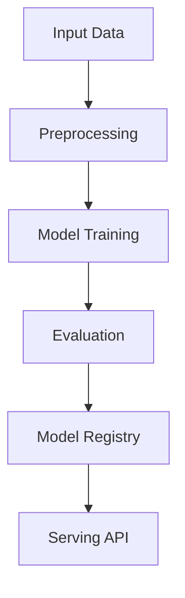

# classification-email-spam

## ∫ Mathematics & Theory

Logistic Regression — Underlying equations and derivations

$$z = w \cdot x + b$$

$$\hat{y} = \sigma(z) = \frac{1}{1 + e^{-z}}$$

$$\mathcal{L}_{BCE} = -\frac{1}{n} \sum_{i=1}^{n} [y_i \log(\hat{y}_i) + (1-y_i)\log(1-\hat{y}_i)]$$

$$\frac{\partial \mathcal{L}}{\partial w} = \frac{1}{n} \sum_{i=1}^{n} (\hat{y}_i - y_i)x_i$$

### Step-by-Step Derivation

Logistic regression models $P(y=1|x)$ via the sigmoid function. Binary cross-entropy loss penalizes confident wrong predictions. The gradient simplifies to $\hat{y} - y$, enabling efficient SGD.

### Interactive Visualization

Sigmoid curve with decision boundary overlay; ROC and precision-recall curves.

## ⚙ Architecture

Model structure, data flow, and layer breakdown

### Class Hierarchy

```
  SpamDetectionNN
```

### Data Flow



## ⚡ API Reference

FastAPI endpoints and model interfaces

| Method | Endpoint |
| --- | --- |
| `GET` | `/` |
| `GET` | `/health` |
| `GET` | `/metrics` |
| `POST` | `/reload` |

## ▶ Usage

Code examples and CLI commands

### Training Script

```python
"""Training pipeline for email spam detection using a feedforward neural network."""

import argparse
import os
from pathlib import Path

from ai_core.logging import get_logger, setup_logging
from ai_core.model_registry import ModelRegistry
from ai_core.validation import DataValidator, create_email_spam_schema

from classification_email_spam.data import load_training_data, save_training_data, train_test_split
from classification_email_spam.model import SpamDetectionNN

logger = get_logger(__name__)

def train(
    model_dir: Path,
    data_path: Path | None = None,
    n_samples: int = 1000,
    hidden_dim: int = 16,
    learning_rate: float = 0.01,
    n_iterations: int = 1000,
    weight_decay: float = 0.001,
    threshold_percentile: float = 95.0,
    model_version: str = "1.0.0",
    register_to_mlflow: bool = False,
    test_size: float = 0.2,
    random_seed: int = 42,
) -> dict:
    """Train the spam detection neural network and save artifacts."""
    X, y = load_training_data(data_path, n_samples=n_samples, random_seed=random_seed)
    logger.info("Loaded training data", n_samples=len(X), data_path=str(data_path))

    # Validate training data
    validator = DataValidator(create_email_spam_schema())
    validation = validator.validate(X, y)
    if not validation.valid:
        logger.error("Training data validation failed", errors=validation.errors)
        raise ValueError(f"Training data validation failed: {validation.errors}")
    logger.info("Training data validated", stats=validation.stats)

    # Split train/test
    X_train, X_test, y_train, y_test = train_test_split(
        X, y, test_size=test_size, random_seed=random_seed
    )
    logger.info(
        "Data split",
        n_train=len(X_train),
        n_test=len(X_test),
        test_size=test_size,
        random_seed=random_seed,
    )

    # Save training data for reproducibility
    model_dir.mkdir(parents=True, exist_ok=True)
    save_training_data(X, y, model_dir / "training_data.csv")

    # Train model
    model = SpamDetectionNN(
        hidden_dim=hidden_dim,
        learning_rate=learning_rate,
        n_iterations=n_iterations,
        weight_decay=weight_decay,
        random_seed=random_seed,
    )
    model.fit(X_train, y_train, X_val=X_test, y_val=y_test)

    # Evaluate
    train_metrics = model.evaluate(X_train, y_train)
    test_metrics = model.evaluate(X_test, y_test)

    logger.info(
        "Training complete",
        training_mode=model.training_mode,
        n_epochs=len(model.loss_history),
        final_loss=model.loss_history[-1] if model.loss_history else 0.0,
        train_metrics=train_metrics,
        test_metrics=test_metrics,
    )

    # Save model
    model_path = model_dir / f"spam_detection_model_v{model_version}.npz"
    model.save(str(model_path))

    # Save training chart
    _save_chart(model, model_dir, model_version)

    # Combined metrics for registry
    metrics = {
        **test_metrics,
        "training_mode": "supervised",
        "n_epochs_run": float(len(model.loss_history)),
        "final_loss": model.loss_history[-1] if model.loss_history else 0.0,
        "train_accuracy": train_metrics["accuracy"],
        "train_f1": train_metrics["f1"],
        "n_train_samples": float(len(X_train)),
        "n_test_samples": float(len(X_test)),
        "hidden_dim": float(hidden_dim),
        "learning_rate": float(learning_rate),
        "weight_decay": float(weight_decay),
        "n_features": float(X_train.shape[1]),
    }

    # Register model
    registry = ModelRegistry(base_dir=model_dir)
    registry.save_model(
        model_name="email-spam-detection",
        model_version=model_version,
        model_type="supervised_classification",
        metrics=metrics,
        parameters={
            "hidden_dim": hidden_dim,
            "learning_rate": learning_rate,
            "n_iterations": n_iterations,
            "weight_decay": weight_decay,
            "random_seed": random_seed,
        },
        artifacts={
            f"spam_detection_model_v{model_version}.npz": model_path,
            "training_data.csv": model_dir / "training_data.csv",
        },
        tags={
            "framework": "numpy",
            "task": "classification",
            "model_type": "feedforward_neural_network",
        },
    )

    if register_to_mlflow:
        registry.log_to_mlflow(
            model_name="email-spam-detection",
            model_version=model_version,
            metrics=metrics,
            params={
                "hidden_dim": hidden_dim,
                "learning_rate": learning_rate,
                "n_iterations": n_iterations,
                "weight_decay": weight_decay,
                "random_seed": random_seed,
            },
            artifacts={
                "model": str(model_path),
                "chart": str(model_dir / f"spam_classification_v{model_version}.png"),
                "training_data": str(model_dir / "training_data.csv"),
            },
            tags={"model_type": "classification", "framework": "numpy"},
        )
        logger.info(
            "Registered model to MLflow", model="email-spam-detection", version=model_version
        )

    return metrics

def _save_chart(model: SpamDetectionNN, output_dir: Path, version: str) -> None:
    """Save the training loss chart."""
    import matplotlib

    matplotlib.use("Agg")
    import matplotlib.pyplot as plt

    if not model.loss_history:
        return

    fig, ax = plt.subplots(figsize=(10, 5))
    ax.plot(model.loss_history, color="steelblue", linewidth=1.5)
    ax.set_xlabel("Training Iteration")
    ax.set_ylabel("Loss (Binary Cross-Entropy + L2)")
    ax.set_title("Email Spam Detection NN Training Loss")
    ax.grid(True, alpha=0.3)
    ax.set_yscale("log")

    plt.tight_layout()
    chart_path = output_dir / f"spam_classification_v{version}.png"
    plt.savefig(str(chart_path), dpi=100)
    plt.close()
    logger.info("Chart saved", path=str(chart_path))

def main():
    parser = argparse.ArgumentParser(description="Train email spam detection neural network")
    parser.add_argument("--model-dir", type=Path, default=Path(os.getenv("MODEL_DIR", "/models")))
    parser.add_argument("--data-path", type=Path, default=None)
    parser.add_argument("--n-samples", type=int, default=int(os.getenv("N_SAMPLES", "1000")))
    parser.add_argument("--hidden-dim", type=int, default=int(os.getenv("HIDDEN_DIM", "16")))
    parser.add_argument(
        "--learning-rate", type=float, default=float(os.getenv("LEARNING_RATE", "0.01"))
    )
    parser.add_argument("--n-iterations", type=int, default=int(os.getenv("N_ITERATIONS", "1000")))
    parser.add_argument(
        "--weight-decay", type=float, default=float(os.getenv("WEIGHT_DECAY", "0.001"))
    )
    parser.add_argument("--model-version", type=str, default=os.getenv("MODEL_VERSION", "1.0.0"))
    parser.add_argument("--test-size", type=float, default=float(os.getenv("TEST_SIZE", "0.2")))
    parser.add_argument("--random-seed", type=int, default=int(os.getenv("RANDOM_SEED", "42")))
    parser.add_argument(
        "--register-mlflow",
        action="store_true",
        default=os.getenv("REGISTER_MLFLOW", "false").lower() == "true",
    )
    parser.add_argument("--log-level", type=str, default=os.getenv("LOG_LEVEL", "INFO"))
    args = parser.parse_args()

    setup_logging(args.log_level)
    args.model_dir.mkdir(parents=True, exist_ok=True)

    metrics = train(
        model_dir=args.model_dir,
        data_path=args.data_path,
        n_samples=args.n_samples,
        hidden_dim=args.hidden_dim,
        learning_rate=args.learning_rate,
        n_iterations=args.n_iterations,
        weight_decay=args.weight_decay,
        model_version=args.model_version,
        register_to_mlflow=args.register_mlflow,
        test_size=args.test_size,
        random_seed=args.random_seed,
    )

    logger.info("Training finished", metrics=metrics, model_dir=str(args.model_dir))

if __name__ == "__main__":
    main()
```

### API Server

```python
"""Production serving API for email spam detection via feedforward neural network."""

import os
import time
from contextlib import asynccontextmanager
from pathlib import Path

import numpy as np
from ai_core.drift import DriftDetector
from ai_core.fastapi_middleware import add_observability_middleware
from ai_core.logging import get_logger, setup_logging
from ai_core.metrics import MetricsCollector
from ai_core.model_registry import ModelRegistry
from ai_core.validation import DataValidator, create_email_spam_schema
from fastapi import FastAPI, HTTPException, Response
from pydantic import BaseModel, Field

from classification_email_spam.data import FEATURE_NAMES
from classification_email_spam.model import SpamDetectionNN

logger = get_logger(__name__)

# Configuration
MODEL_DIR = Path(os.getenv("MODEL_DIR", "/models"))
MODEL_VERSION = os.getenv("MODEL_VERSION", "latest")
METRICS_PORT = int(os.getenv("METRICS_PORT", os.getenv("SPAM_NN_METRICS_PORT", "8008")))
DRIFT_THRESHOLD = float(os.getenv("DRIFT_THRESHOLD", "0.2"))

class PredictRequest(BaseModel):
    """Single email spam prediction request."""

    features: list[float] = Field(..., min_length=12, max_length=12)

class PredictBulkRequest(BaseModel):
    """Bulk email spam prediction request."""

    requests: list[list[float]] = Field(..., min_length=1, max_length=100)

class PredictResponse(BaseModel):
    """Prediction response."""

    is_spam: bool
    spam_probability: float
    label: str
    model_version: str
    training_mode: str

class BulkPredictResponse(BaseModel):
    """Bulk prediction response."""

    predictions: list[PredictResponse]
    model_version: str

class DriftResponse(BaseModel):
    """Drift detection response."""

    total_features: int
    drifted_features: int
    drift_ratio: float
    drifted: list[dict]
    all_results: list[dict]

class StatsResponse(BaseModel):
    """Model statistics response."""

    n_features: int
    hidden_dim: int
    training_mode: str
    n_epochs_run: int
    final_loss: float
    model_version: str

# Global model state
_model: SpamDetectionNN | None = None
_model_version: str = "unknown"
_metrics: MetricsCollector | None = None
_validator: DataValidator | None = None
_drift_detector: DriftDetector | None = None
_reference_data: np.ndarray | None = None
_recent_predictions: list[list[float]] = []

@asynccontextmanager
async def lifespan(app: FastAPI):
    """Load model at startup and clean up at shutdown."""
    global _model, _model_version, _metrics, _validator, _drift_detector, _reference_data

    setup_logging(os.getenv("LOG_LEVEL", "INFO"))
    _metrics = MetricsCollector("email_spam_detection", port=METRICS_PORT)
    app.state.metrics = _metrics

    _validator = DataValidator(create_email_spam_schema())
    _drift_detector = DriftDetector(
        feature_names=FEATURE_NAMES,
        feature_types={f: "float" for f in FEATURE_NAMES},
        psi_threshold=DRIFT_THRESHOLD,
    )

    _model, _model_version = _load_model()
    _metrics.set_model_version(_model_version)
    _metrics.set_model_info(
        model_name="email-spam-detection",
        model_version=_model_version,
        model_type="supervised_classification",
    )

    _reference_data = _load_reference_data()
    logger.info("Model loaded", model="email-spam-detection", version=_model_version)

    yield

    logger.info("Shutting down email-spam-detection API")

def _load_model() -> tuple[SpamDetectionNN, str]:
    """Load the latest model from the registry or model directory with resilient fallback."""
    registry = ModelRegistry(base_dir=MODEL_DIR)
    try:
        if MODEL_VERSION == "latest":
            models = registry.list_models()
            spam_models = [m for m in models if m.get("model_name") == "email-spam-detection"]
            if spam_models:
                spam_models.sort(key=lambda m: m["model_version"], reverse=True)
                latest = spam_models[0]
                model_dir = Path(latest["artifact_path"])
                npz_files = list(model_dir.glob("spam_detection_model_*.npz")) + list(
                    model_dir.glob("*.npz")
                )
                if npz_files:
                    return SpamDetectionNN.load(str(npz_files[0])), latest["model_version"]
        else:
            model_dir = MODEL_DIR / "email-spam-detection" / MODEL_VERSION
            if model_dir.exists():
                npz_files = list(model_dir.glob("spam_detection_model_*.npz")) + list(
                    model_dir.glob("*.npz")
                )
                if npz_files:
                    return SpamDetectionNN.load(str(npz_files[0])), MODEL_VERSION
    except Exception as e:
        logger.warning(f"Registry lookup failed: {e}")

    # Try direct model in MODEL_DIR
    npz_path = MODEL_DIR / "spam_detection_model.npz"
    if npz_path.exists():
        return SpamDetectionNN.load(str(npz_path)), "legacy"

    # Try bundled artifacts directory
    candidate_paths = [
        Path("/app/artifacts/models/spam_detection_model_v1.0.0.npz"),
        Path(__file__).resolve().parents[3]
        / "artifacts"
        / "models"
        / "spam_detection_model_v1.0.0.npz",
    ]
    for p in candidate_paths:
        if p.exists():
            logger.info("Loading bundled baseline model", path=str(p))
            return SpamDetectionNN.load(str(p)), "1.0.0-bundled"

    # In-memory baseline fallback
    logger.warning("No pre-existing model found on disk. Initializing baseline NN model.")
    from classification_email_spam.data import generate_synthetic_data

    X_base, y_base = generate_synthetic_data(n_samples=200, random_seed=42)
    model = SpamDetectionNN(hidden_dim=16, learning_rate=0.01, n_iterations=500, random_seed=42)
    model.fit(X_base, y_base)
    return model, "1.0.0-baseline"

def _load_reference_data() -> np.ndarray | None:
    """Load reference training data for drift detection."""
    candidate_csvs = [
        MODEL_DIR / "email-spam-detection" / _model_version / "training_data.csv",
        MODEL_DIR / "training_data.csv",
        Path("/app/artifacts/models/training_data.csv"),
        Path(__file__).resolve().parents[3] / "artifacts" / "models" / "training_data.csv",
    ]
    for csv_path in candidate_csvs:
        if csv_path.exists():
            try:
                import pandas as pd

                df = pd.read_csv(csv_path)
                if all(f in df.columns for f in FEATURE_NAMES):
                    return df[FEATURE_NAMES].values
            except Exception as e:
                logger.warning("Could not read reference csv", path=str(csv_path), error=str(e))

    from classification_email_spam.data import generate_synthetic_data

    X_base, _ = generate_synthetic_data(n_samples=200, random_seed=42)
    return X_base

# Create FastAPI app
app = FastAPI(
    title="Email Spam Detection API",
    description="Feedforward neural network for classifying emails as spam or ham",
    version="1.0.0",
    lifespan=lifespan,
)

add_observability_middleware(app)

@app.get("/")
def read_root():
    """Service information."""
    return {
        "service": "email-spam-detection-api",
        "version": "1.0.0",
        "model_version": _model_version,
        "training_mode": _model.training_mode if _model else "unknown",
        "features": FEATURE_NAMES,
        "endpoints": {
            "health": "/health",
            "predict": "POST /predict",
            "predict/bulk": "POST /predict/bulk",
            "stats": "GET /stats",
            "drift": "GET /drift",
            "metrics": "/metrics",
        },
    }

@app.get("/health")
def health_check():
    """Kubernetes liveness/readiness probe."""
    if _model is None:
        raise HTTPException(status_code=503, detail="Model not loaded")
    return {
        "status": "healthy",
        "model_loaded": True,
        "model_version": _model_version,
        "training_mode": _model.training_mode if _model else "unknown",
    }

@app.get("/metrics")
def metrics():
    """Prometheus metrics endpoint."""
    from prometheus_client import CONTENT_TYPE_LATEST, generate_latest

    return Response(content=generate_latest(), media_type=CONTENT_TYPE_LATEST)

@app.post("/reload")
def reload_model():
    """Dynamically reload the model from disk/registry."""
    global _model, _model_version, _reference_data
    try:
        _model, _model_version = _load_model()
        if _metrics:
            _metrics.set_model_version(_model_version)
            _metrics.set_model_info(
                model_name="email-spam-detection",
                model_version=_model_version,
                model_type="supervised_classification",
            )
        _reference_data = _load_reference_data()
        logger.info(
            "Model reloaded dynamically", model="email-spam-detection", version=_model_version
        )
        return {"status": "reloaded", "model_version": _model_version}
    except Exception as e:
        logger.exception("Model reload failed", error=str(e))
        raise HTTPException(status_code=500, detail=f"Reload failed: {e}") from e

@app.get("/drift", response_model=DriftResponse)
def drift_check():
    """Check for data drift between reference and recent predictions."""
    if _drift_detector is None or _reference_data is None:
        raise HTTPException(status_code=503, detail="Drift detection not available")

    if len(_recent_predictions) < 10:
        return DriftResponse(
            total_features=len(FEATURE_NAMES),
            drifted_features=0,
            drift_ratio=0.0,
            drifted=[],
            all_results=[],
        )

    current = np.array(_recent_predictions[-100:])
    results = _drift_detector.detect_drift(_reference_data, current)
    summary = _drift_detector.summarize(results)

    if _metrics:
        _metrics.set_drift_ratio(summary["drift_ratio"])

    return DriftResponse(**summary)

@app.get("/stats", response_model=StatsResponse)
def get_stats():
    """Return model statistics."""
    if _model is None or _model.W1 is None:
        raise HTTPException(status_code=503, detail="Model not loaded")

    return StatsResponse(
        n_features=_model.input_dim,
        hidden_dim=_model.hidden_dim,
        training_mode=_model.training_mode,
        n_epochs_run=len(_model.loss_history),
        final_loss=_model.loss_history[-1] if _model.loss_history else 0.0,
        model_version=_model_version,
    )

def _compute_prediction(features: list[float]) -> PredictResponse:
    """Core prediction logic shared by all prediction endpoints."""
    if _model is None or _metrics is None or _validator is None:
        raise HTTPException(status_code=503, detail="Model not loaded")

    X = np.array([features])

    validation = _validator.validate(X)
    if not validation.valid:
        raise HTTPException(status_code=422, detail=validation.errors)

    start = time.time()
    try:
        proba = float(_model.predict_proba(X)[0])
        is_spam = bool(proba >= 0.5)
        duration = time.time() - start
        _metrics.record_prediction(model_version=_model_version, duration=duration)

        _recent_predictions.append(features)
        if len(_recent_predictions) > 1000:
            _recent_predictions.pop(0)

        return PredictResponse(
            is_spam=is_spam,
            spam_probability=round(proba, 4),
            label="SPAM" if is_spam else "NOT spam",
            model_version=_model_version,
            training_mode=_model.training_mode if _model else "unknown",
        )
    except Exception as e:
        _metrics.record_error(model_version=_model_version, error_type="prediction")
        logger.exception("Prediction failed", error=str(e))
        raise HTTPException(status_code=500, detail="Prediction failed") from e

@app.post("/predict", response_model=PredictResponse)
def predict(body: PredictRequest):
    """Classify a single email as spam or ham."""
    return _compute_prediction(body.features)

@app.post("/predict/bulk", response_model=BulkPredictResponse)
def predict_bulk(body: PredictBulkRequest):
    """Classify multiple emails as spam or ham."""
    global _recent_predictions
    if _model is None or _metrics is None or _validator is None:
        raise HTTPException(status_code=503, detail="Model not loaded")

    if len(body.requests) < 1 or len(body.requests) > 100:
        raise HTTPException(status_code=422, detail="Batch size must be between 1 and 100")

    X = np.array(body.requests)

    validation = _validator.validate(X)
    if not validation.valid:
        raise HTTPException(status_code=422, detail=validation.errors)

    start = time.time()
    try:
        probas = _model.predict_proba(X)
        duration = time.time() - start
        _metrics.record_prediction(model_version=_model_version, duration=duration)

        _recent_predictions.extend(body.requests)
        if len(_recent_predictions) > 1000:
            _recent_predictions = _recent_predictions[-1000:]

        predictions = [
            PredictResponse(
                is_spam=bool(proba >= 0.5),
                spam_probability=round(float(proba), 4),
                label="SPAM" if proba >= 0.5 else "NOT spam",
                model_version=_model_version,
                training_mode=_model.training_mode if _model else "unknown",
            )
            for proba in probas
        ]
        return BulkPredictResponse(predictions=predictions, model_version=_model_version)
    except Exception as e:
        _metrics.record_error(model_version=_model_version, error_type="prediction")
        logger.exception("Bulk prediction failed", error=str(e))
        raise HTTPException(status_code=500, detail="Bulk prediction failed") from e
```

### CLI Commands

```bash
uv run python -m classification_email_spam.train --model-dir ./artifacts/models
```

## 📊 Benchmarks

Test results and performance metrics

Run `pytest tests/test_models.py` and `pytest tests/test_apis.py` for detailed metrics.

### Related Apps

- [semi-supervised-email](../semi-supervised-email/README.md)

- [spam-classification](../spam-classification/README.md)

- [snn-image-classification](../snn-image-classification/README.md)

Generated documentation for **classification-email-spam**
