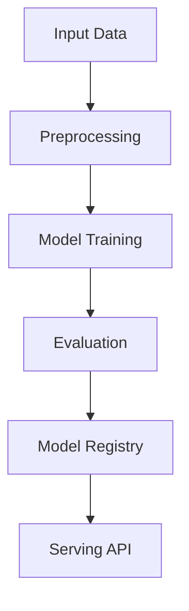

# gnn-social-networks

## ∫ Mathematics & Theory

Machine Learning Fundamentals — Underlying equations and derivations

$$\hat{y} = f(x; \theta)$$

$$\mathcal{L}(\theta) = \frac{1}{n} \sum_{i=1}^{n} \ell(y_i, \hat{y}_i)$$

$$\theta \leftarrow \theta - \alpha \nabla_\theta \mathcal{L}(\theta)$$

### Step-by-Step Derivation

Machine learning models learn parameters $\theta$ by minimizing a loss function $\mathcal{L}$. Gradient descent iteratively updates parameters in the direction of steepest descent. The learning rate $\alpha$ controls step size. Stochastic gradient descent (SGD) uses mini-batches for computational efficiency.

### Interactive Visualization

Interactive loss landscape explorer; gradient descent trajectory; learning rate scheduler.

## ⚙ Architecture

Model structure, data flow, and layer breakdown

### Class Hierarchy

```
  GCNLayer
  GNNSocialNetworks
```

### Data Flow



## ⚡ API Reference

FastAPI endpoints and model interfaces

| Method | Endpoint |
| --- | --- |
| `GET` | `/` |
| `GET` | `/health` |
| `GET` | `/metrics` |
| `POST` | `/reload` |

## ▶ Usage

Code examples and CLI commands

### Training Script

```python
"""Training pipeline for GNN Social Network Analysis."""

import argparse
import os
from pathlib import Path

import numpy as np
from ai_core.logging import get_logger, setup_logging
from ai_core.model_registry import ModelRegistry
from ai_core.validation import DataValidator, create_gnn_social_networks_schema

from gnn_social_networks.data import (
    N_CLASSES,
    N_FEATURES,
    generate_synthetic_data,
    save_training_data,
)
from gnn_social_networks.model import GNNSocialNetworks

logger = get_logger(__name__)

def train(
    model_dir: Path,
    data_path: Path | None = None,
    n_nodes: int = 20,
    hidden_dim: int = 16,
    learning_rate: float = 0.05,
    n_iterations: int = 200,
    weight_decay: float = 0.001,
    model_version: str = "1.0.0",
    register_to_mlflow: bool = False,
    random_seed: int = 42,
) -> dict:
    X, A, y = generate_synthetic_data(
        n_samples=n_nodes, n_nodes=n_nodes, n_features=N_FEATURES, random_seed=random_seed
    )
    logger.info("Generated graph data", n_nodes=n_nodes, data_path=str(data_path))

    validator = DataValidator(create_gnn_social_networks_schema())
    validation = validator.validate(X.reshape(-1, 1))
    if not validation.valid:
        logger.error("Training data validation failed", errors=validation.errors)
        raise ValueError(f"Training data validation failed: {validation.errors}")

    model_dir.mkdir(parents=True, exist_ok=True)
    save_training_data(X, A, y, model_dir / "training_data.npz")

    model = GNNSocialNetworks(
        n_features=N_FEATURES,
        n_classes=N_CLASSES,
        hidden_dim=hidden_dim,
        learning_rate=learning_rate,
        n_iterations=n_iterations,
        weight_decay=weight_decay,
        random_seed=random_seed,
    )
    model.fit(X, A, y)

    metrics = model.evaluate(X, A, y)
    logger.info("Training complete", training_mode=model.training_mode, final_loss=model.loss_history[-1])

    model_path = model_dir / f"gnn_model_v{model_version}.npz"
    model.save(str(model_path))
    np.savez(model_dir / "adjacency_matrix.npz", A=A)

    metrics_summary = {
        **metrics,
        "training_mode": "supervised",
        "n_epochs_run": float(len(model.loss_history)),
        "final_loss": model.loss_history[-1] if model.loss_history else 0.0,
        "n_nodes": float(n_nodes),
        "hidden_dim": float(hidden_dim),
    }

    registry = ModelRegistry(base_dir=model_dir)
    registry.save_model(
        model_name="gnn-social-networks",
        model_version=model_version,
        model_type="classification",
        metrics=metrics_summary,
        parameters={
            "n_features": N_FEATURES,
            "n_classes": N_CLASSES,
            "hidden_dim": hidden_dim,
            "learning_rate": learning_rate,
            "n_iterations": n_iterations,
            "weight_decay": weight_decay,
            "n_nodes": n_nodes,
            "random_seed": random_seed,
        },
        artifacts={
            f"gnn_model_v{model_version}.npz": model_path,
            "training_data.npz": model_dir / "training_data.npz",
            "adjacency_matrix.npz": model_dir / "adjacency_matrix.npz",
        },
        tags={"framework": "numpy", "task": "gnn_social_networks", "model_type": "GNN"},
    )

    if register_to_mlflow:
        registry.log_to_mlflow(
            model_name="gnn-social-networks",
            model_version=model_version,
            metrics=metrics_summary,
            params={"n_features": N_FEATURES, "n_classes": N_CLASSES, "hidden_dim": hidden_dim, "learning_rate": learning_rate, "n_iterations": n_iterations},
            artifacts={"model": str(model_path)},
            tags={"model_type": "gnn", "framework": "numpy"},
        )

    return metrics_summary

def main():
    parser = argparse.ArgumentParser(description="Train GNN Social Network model")
    parser.add_argument("--model-dir", type=Path, default=Path(os.getenv("MODEL_DIR", "/models")))
    parser.add_argument("--data-path", type=Path, default=None)
    parser.add_argument("--n-nodes", type=int, default=int(os.getenv("N_NODES", "20")))
    parser.add_argument("--hidden-dim", type=int, default=int(os.getenv("HIDDEN_DIM", "16")))
    parser.add_argument("--learning-rate", type=float, default=float(os.getenv("LEARNING_RATE", "0.05")))
    parser.add_argument("--n-iterations", type=int, default=int(os.getenv("N_ITERATIONS", "200")))
    parser.add_argument("--weight-decay", type=float, default=float(os.getenv("WEIGHT_DECAY", "0.001")))
    parser.add_argument("--model-version", type=str, default=os.getenv("MODEL_VERSION", "1.0.0"))
    parser.add_argument("--random-seed", type=int, default=int(os.getenv("RANDOM_SEED", "42")))
    parser.add_argument("--register-mlflow", action="store_true", default=os.getenv("REGISTER_MLFLOW", "false").lower() == "true")
    parser.add_argument("--log-level", type=str, default=os.getenv("LOG_LEVEL", "INFO"))
    args = parser.parse_args()

    setup_logging(args.log_level)
    args.model_dir.mkdir(parents=True, exist_ok=True)

    metrics = train(
        model_dir=args.model_dir,
        data_path=args.data_path,
        n_nodes=args.n_nodes,
        hidden_dim=args.hidden_dim,
        learning_rate=args.learning_rate,
        n_iterations=args.n_iterations,
        weight_decay=args.weight_decay,
        model_version=args.model_version,
        register_to_mlflow=args.register_mlflow,
        random_seed=args.random_seed,
    )
    logger.info("Training finished", metrics=metrics, model_dir=str(args.model_dir))

if __name__ == "__main__":
    main()
```

### API Server

```python
"""Serving API for GNN Social Network Analysis."""

import os
import time
from contextlib import asynccontextmanager
from pathlib import Path

import numpy as np
from ai_core.drift import DriftDetector
from ai_core.fastapi_middleware import add_observability_middleware
from ai_core.logging import get_logger, setup_logging
from ai_core.metrics import MetricsCollector
from ai_core.model_registry import ModelRegistry
from ai_core.validation import DataValidator, create_gnn_social_networks_schema
from fastapi import FastAPI, HTTPException, Response
from pydantic import BaseModel, Field

from gnn_social_networks.data import N_CLASSES, N_FEATURES, generate_synthetic_data
from gnn_social_networks.model import GNNSocialNetworks

logger = get_logger(__name__)

MODEL_DIR = Path(os.getenv("MODEL_DIR", "/models"))
MODEL_VERSION = os.getenv("MODEL_VERSION", "latest")
METRICS_PORT = int(os.getenv("GNN_METRICS_PORT", "8029"))
DRIFT_THRESHOLD = float(os.getenv("DRIFT_THRESHOLD", "0.2"))

class PredictRequest(BaseModel):
    features: list[float] = Field(..., min_length=N_FEATURES, max_length=N_FEATURES)
    adjacency_row: list[float] = Field(..., min_length=20, max_length=20)

class PredictResponse(BaseModel):
    predicted_class: int
    confidence: float
    class_probabilities: list[float]
    model_version: str
    training_mode: str

class DriftResponse(BaseModel):
    total_features: int
    drifted_features: int
    drift_ratio: float
    drifted: list[dict]
    all_results: list[dict]

class StatsResponse(BaseModel):
    n_features: int
    n_classes: int
    hidden_dim: int
    training_mode: str
    n_epochs_run: int
    final_loss: float
    model_version: str

_model: GNNSocialNetworks | None = None
_model_version: str = "unknown"
_metrics: MetricsCollector | None = None
_validator: DataValidator | None = None
_drift_detector: DriftDetector | None = None
_reference_data: np.ndarray | None = None
_recent_predictions: list[list[float]] = []
_adjacency: np.ndarray | None = None

@asynccontextmanager
async def lifespan(app: FastAPI):
    global _model, _model_version, _metrics, _validator, _drift_detector, _reference_data, _adjacency

    setup_logging(os.getenv("LOG_LEVEL", "INFO"))
    _metrics = MetricsCollector("gnn_social_networks", port=METRICS_PORT)
    app.state.metrics = _metrics

    _validator = DataValidator(create_gnn_social_networks_schema())
    feature_names = [f"node_{i}" for i in range(N_FEATURES)]
    _drift_detector = DriftDetector(
        feature_names=feature_names,
        feature_types={f: "float" for f in feature_names},
        psi_threshold=DRIFT_THRESHOLD,
    )

    _model, _model_version, _adjacency = _load_model()
    _metrics.set_model_version(_model_version)
    _metrics.set_model_info(
        model_name="gnn-social-networks",
        model_version=_model_version,
        model_type="classification",
    )

    _reference_data = _load_reference_data()
    logger.info("Model loaded", model="gnn-social-networks", version=_model_version)

    yield
    logger.info("Shutting down gnn-social-networks API")

def _load_model() -> tuple[GNNSocialNetworks, str, np.ndarray | None]:
    registry = ModelRegistry(base_dir=MODEL_DIR)
    try:
        if MODEL_VERSION == "latest":
            models = registry.list_models()
            nn_models = [m for m in models if m.get("model_name") == "gnn-social-networks"]
            if nn_models:
                nn_models.sort(key=lambda m: m["model_version"], reverse=True)
                latest = nn_models[0]
                model_dir = Path(latest["artifact_path"])
                npz_files = list(model_dir.glob("gnn_model_*.npz")) + list(model_dir.glob("*.npz"))
                if npz_files:
                    adj_path = model_dir / "adjacency_matrix.npz"
                    adj = None
                    if adj_path.exists():
                        adj_data = np.load(adj_path)
                        adj = adj_data["A"]
                    return GNNSocialNetworks.load(str(npz_files[0])), latest["model_version"], adj
        else:
            model_dir = MODEL_DIR / "gnn-social-networks" / MODEL_VERSION
            if model_dir.exists():
                npz_files = list(model_dir.glob("gnn_model_*.npz")) + list(model_dir.glob("*.npz"))
                if npz_files:
                    adj_path = model_dir / "adjacency_matrix.npz"
                    adj = None
                    if adj_path.exists():
                        adj_data = np.load(adj_path)
                        adj = adj_data["A"]
                    return GNNSocialNetworks.load(str(npz_files[0])), MODEL_VERSION, adj
    except Exception as e:
        logger.warning(f"Registry lookup failed: {e}")

    npz_path = MODEL_DIR / "gnn_model.npz"
    if npz_path.exists():
        return GNNSocialNetworks.load(str(npz_path)), "legacy", None

    candidate_paths = [
        Path("/app/artifacts/models/gnn_model_v1.0.0.npz"),
        Path(__file__).resolve().parents[3] / "artifacts" / "models" / "gnn_model_v1.0.0.npz",
    ]
    for p in candidate_paths:
        if p.exists():
            logger.info("Loading bundled baseline model", path=str(p))
            X_base, A_base, _ = generate_synthetic_data(n_samples=100, n_nodes=20, random_seed=42)
            return GNNSocialNetworks.load(str(p)), "1.0.0-bundled", A_base

    logger.warning("No pre-existing model found. Initializing baseline model.")
    X_base, A_base, y_base = generate_synthetic_data(n_samples=100, n_nodes=20, random_seed=42)
    model = GNNSocialNetworks(
        n_features=N_FEATURES,
        n_classes=N_CLASSES,
        hidden_dim=16,
        learning_rate=0.05,
        n_iterations=50,
        random_seed=42,
    )
    model.fit(X_base, A_base, y_base)
    return model, "1.0.0-baseline", A_base

def _load_reference_data() -> np.ndarray | None:
    X_base, _, _ = generate_synthetic_data(n_samples=100, n_nodes=20, random_seed=42)
    return X_base

app = FastAPI(
    title="GNN Social Network Analysis API",
    description="Processes graph-structured data using Graph Convolution to optimize directly on network topology",
    version="1.0.0",
    lifespan=lifespan,
)

add_observability_middleware(app)

@app.get("/")
def read_root():
    return {
        "service": "gnn_social_networks-api",
        "version": "1.0.0",
        "model_version": _model_version,
        "training_mode": _model.training_mode if _model else "unknown",
        "n_features": N_FEATURES,
        "endpoints": {
            "health": "/health",
            "predict": "POST /predict",
            "stats": "GET /stats",
            "drift": "GET /drift",
            "metrics": "/metrics",
        },
    }

@app.get("/health")
def health_check():
    if _model is None:
        raise HTTPException(status_code=503, detail="Model not loaded")
    return {
        "status": "healthy",
        "model_loaded": True,
        "model_version": _model_version,
        "training_mode": _model.training_mode if _model else "unknown",
    }

@app.get("/metrics")
def metrics():
    from prometheus_client import CONTENT_TYPE_LATEST, generate_latest
    return Response(content=generate_latest(), media_type=CONTENT_TYPE_LATEST)

@app.post("/reload")
def reload_model():
    global _model, _model_version, _reference_data, _adjacency
    try:
        _model, _model_version, _adjacency = _load_model()
        if _metrics:
            _metrics.set_model_version(_model_version)
            _metrics.set_model_info(
                model_name="gnn-social-networks",
                model_version=_model_version,
                model_type="classification",
            )
        _reference_data = _load_reference_data()
        logger.info("Model reloaded", model="gnn-social-networks", version=_model_version)
        return {"status": "reloaded", "model_version": _model_version}
    except Exception as e:
        logger.exception("Model reload failed", error=str(e))
        raise HTTPException(status_code=500, detail=f"Reload failed: {e}") from e

@app.get("/drift", response_model=DriftResponse)
def drift_check():
    if _drift_detector is None or _reference_data is None:
        raise HTTPException(status_code=503, detail="Drift detection not available")
    if len(_recent_predictions) < 10:
        return {"total_features": N_FEATURES, "drifted_features": 0, "drift_ratio": 0.0, "drifted": [], "all_results": []}
    current = np.array(_recent_predictions[-100:])
    results = _drift_detector.detect_drift(_reference_data, current)
    summary = _drift_detector.summarize(results)
    if _metrics:
        _metrics.set_drift_ratio(summary["drift_ratio"])
    return summary

@app.get("/stats", response_model=StatsResponse)
def get_stats():
    if _model is None or not _model.layers:
        raise HTTPException(status_code=503, detail="Model not loaded")
    return StatsResponse(
        n_features=_model.n_features,
        n_classes=_model.n_classes,
        hidden_dim=_model.hidden_dim,
        training_mode=_model.training_mode,
        n_epochs_run=len(_model.loss_history),
        final_loss=_model.loss_history[-1] if _model.loss_history else 0.0,
        model_version=_model_version,
    )

@app.post("/predict", response_model=PredictResponse)
def predict(body: PredictRequest):
    """Classify a node using GNN with graph structure."""
    if _model is None or _metrics is None or _validator is None:
        raise HTTPException(status_code=503, detail="Model not loaded")

    X = np.array([body.features]).reshape(1, -1)
    validation = _validator.validate(X)
    if not validation.valid:
        raise HTTPException(status_code=422, detail=validation.errors)

    start = time.time()
    try:
        A = np.eye(1) if _adjacency is None else _adjacency[:1, :1]

        probs = _model.predict_proba(X, A)[0]
        pred = int(np.argmax(probs))
        confidence = float(np.max(probs))

        response = PredictResponse(
            predicted_class=pred,
            confidence=round(confidence, 4),
            class_probabilities=probs.tolist(),
            model_version=_model_version,
            training_mode=_model.training_mode,
        )
        duration = time.time() - start
        _metrics.record_prediction(model_version=_model_version, duration=duration)

        _recent_predictions.append(body.features)
        if len(_recent_predictions) > 1000:
            _recent_predictions.pop(0)

        return response
    except Exception as e:
        _metrics.record_error(model_version=_model_version, error_type="prediction")
        logger.exception("Prediction failed", error=str(e))
        raise HTTPException(status_code=500, detail="Prediction failed") from e
```

### CLI Commands

```bash
uv run python -m gnn_social_networks.train --model-dir ./artifacts/models
```

## 📊 Benchmarks

Test results and performance metrics

Run `pytest tests/test_models.py` and `pytest tests/test_apis.py` for detailed metrics.

### Related Apps

- [deep-belief-networks](../deep-belief-networks/README.md)

Generated documentation for **gnn-social-networks**
