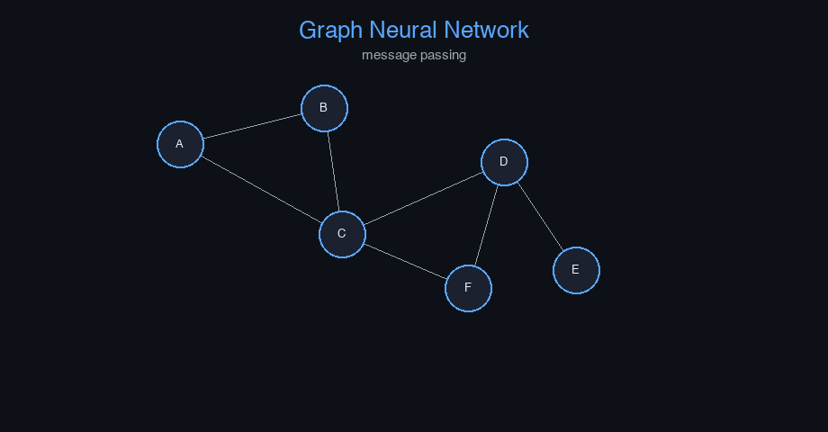

# gnn-social-networks


Graph Neural Network (GNN) — AI engineering example · part of the MLOps monorepo

## 1. Mathematical Foundations

This example is grounded in **Graph Neural Network (GNN)**. The equations below
drive every forward and backward pass in the implementation.

$$h_v^{(k+1)} = \sigma\left( W^{(k)} \cdot \text{AGGREGATE}_k \left( \{ h_u^{(k)} : u \in \mathcal{N}(v) \} \right) \right)$$

$$\text{AGGREGATE}_k = \text{mean} \left( \{ h_u^{(k)} : u \in \mathcal{N}(v) \} \right)$$

$$\text{GAT}: \alpha_{uv} = \frac{\exp(\text{LeakyReLU}(a^T [Wh_u \| Wh_v]))}{\sum_{k \in \mathcal{N}(v)} \exp(\text{LeakyReLU}(a^T [Wh_u \| Wh_k]))}$$

$$h_v^{(k+1)} = \sigma\left( \sum_{u \in \mathcal{N}(v)} \alpha_{uv} W h_u^{(k)} \right)$$

### Derivation

GNNs generalize convolutions to graph-structured data. Each node updates its representation by aggregating messages from neighbors. After $K$ rounds of message passing, each node embeds its $K$-hop neighborhood. GATs introduce attention weights $\alpha_{uv}$ to prioritize important neighbors.

### Worked Numerical Example

$$z = w \cdot x + b$$

Illustrative forward-pass evaluation (scalar example):

Input  x        = 12.0   (e.g. pizza diameter, inches)
Weights w       =  0.85
Bias    b       =  0.30
---------------------------------
z = w*x + b
  = 0.85 * 12.0 + 0.30
  = 10.20 + 0.30
  = 10.50   <- model output

### Conceptual Diagram

        Math concept (placeholder)
   [ Input x ] --> ( w · x + b ) --> [ Output z ]
                       |
                  [ activation ]
                       |
                  [ prediction ]



Interactive graph with animated message passing; node embedding t-SNE projection; attention weight heatmap.

## 2. Core Logic & Architecture

The example follows a consistent **data → train → evaluate → serve**
pipeline. Inputs are loaded and validated, transformed by the core algorithm, scored against
held-out data, and exposed through a REST API.

  Raw dataset→
  load + validate (data.py)→
  fit / transform (model.py)→
  evaluate + persist (train.py)→
  serve (api.py)

### Primary Components

| Class | Public methods | Responsibility |
| --- | --- | --- |
| `PredictRequest` | — |  |
| `PredictResponse` | — |  |
| `DriftResponse` | — |  |
| `StatsResponse` | — |  |
| `GCNLayer` | init_weights, forward, backward, update_params | Graph Convolutional Network layer.  Args:     input_dim: Input feature dimension     output_dim: Output feature dimension     random_seed: Random seed |
| `GNNSocialNetworks` | _build, _forward, fit, predict_proba, predict, evaluate, save, load, to_dict | Graph Neural Network for social network analysis.  Uses Graph Convolution to process node features and adjacency relationships. Can perform node classification or graph-level prediction.  Args:     n_features: Number of input features per node     n_classes: Number of output classes (for node classification)     hidden_dim: Hidden dimension for GCN layers     learning_rate: Gradient descent step size     n_iterations: Number of training epochs     weight_decay: L2 regularization     clip_value: Gradient clipping threshold     random_seed: Random seed |

### Data Flow


1. **Load** — `data.py` reads the source dataset and splits train/test.


2. **Validate** — a Pydantic schema guards input shape/dtypes before training.


3. **Fit / Transform** — `model.py` applies the mathematics from Section 1.


4. **Evaluate** — metrics (MSE/RMSE/R², accuracy, etc.) are computed and logged.


5. **Persist** — weights/artifacts are saved and registered in the model registry.


6. **Serve** — `api.py` exposes prediction endpoints with drift detection.

### Design Patterns & Performance

Key design choices in this module: a pure-NumPy implementation (no PyTorch/TensorFlow), schema validation via `ai_core.validation`, structured JSON logging through `ai_core.logging`, Prometheus metrics from `ai_core.metrics`, and MLflow/model-registry persistence via `ai_core.model_registry`. The FastAPI service wraps the trained model with observability middleware from `ai_core.fastapi_middleware`.

## 3. Detailed Code Walkthrough

The most important behaviour is summarised below; full source for each module is collapsible
so the page stays readable while remaining self-contained.

### `GCNLayer.forward(H, A_norm)`

Forward pass.

Args:
    H: Node features (n_nodes, input_dim)
    A_norm: Normalized adjacency matrix (n_nodes, n_nodes)

Returns:
    Output features (n_nodes, output_dim)

### `GNNSocialNetworks.fit(X, A, y, n_iterations)`

Train the GNN on graph-structured data.

Args:
    X: Node features (n_nodes, n_features)
    A: Adjacency matrix (n_nodes, n_nodes)
    y: Node labels (n_nodes,)

### Source Files

<details>
<summary>model.py</summary>

```
"""Graph Neural Network for social network analysis.

Architecture:
    Graph Convolution: H^{(l+1)} = sigma(A_norm * H^{(l)} * W^{(l)})
    Where A_norm is the normalized adjacency matrix and W is learnable weights.

    Input: node features (n_nodes, n_features) + adjacency matrix (n_nodes, n_nodes)
    -> GCN layer (n_features -> hidden_dim, ReLU)
    -> GCN layer (hidden_dim -> hidden_dim, ReLU)
    -> Dense (hidden_dim -> n_classes, softmax)

Loss: cross-entropy (node classification) or MSE (reconstruction)
"""

from dataclasses import dataclass, field

import numpy as np

def relu(z: np.ndarray) -> np.ndarray:
    return np.maximum(0, z)

def relu_derivative(z: np.ndarray) -> np.ndarray:
    return (z > 0).astype(z.dtype)

def softmax(z: np.ndarray) -> np.ndarray:
    z_shifted = z - np.max(z, axis=-1, keepdims=True)
    exp_z = np.exp(z_shifted)
    return exp_z / np.sum(exp_z, axis=-1, keepdims=True)

def normalize_adjacency(A: np.ndarray) -> np.ndarray:
    """Compute normalized adjacency matrix: A_norm = (A + I) * D^{-1/2}"""
    A_eye = A + np.eye(A.shape[0])
    D = np.diag(np.sum(A_eye, axis=1))
    D_inv_sqrt = np.diag(1.0 / np.sqrt(np.diag(D) + 1e-8))
    return D_inv_sqrt @ A_eye @ D_inv_sqrt

@dataclass
class GCNLayer:
    """Graph Convolutional Network layer.

    Args:
        input_dim: Input feature dimension
        output_dim: Output feature dimension
        random_seed: Random seed
    """

    input_dim: int = 32
    output_dim: int = 16
    random_seed: int = 42
    W: np.ndarray | None = None
    dW: np.ndarray | None = None
    _cache: dict = field(default_factory=dict, repr=False)

    def init_weights(self) -> None:
        rng = np.random.default_rng(self.random_seed)
        self.W = rng.normal(0, np.sqrt(2.0 / self.input_dim), (self.input_dim, self.output_dim))

    def forward(self, H: np.ndarray, A_norm: np.ndarray) -> np.ndarray:
        """Forward pass.

        Args:
            H: Node features (n_nodes, input_dim)
            A_norm: Normalized adjacency matrix (n_nodes, n_nodes)

        Returns:
            Output features (n_nodes, output_dim)
        """
        if self.W is None:
            self.init_weights()

        out = A_norm @ H @ self.W
        self._cache = {"H": H, "A_norm": A_norm}
        return out

    def backward(self, dout: np.ndarray) -> np.ndarray:
        c = self._cache
        H = c["H"]
        A_norm = c["A_norm"]

        self.dW = H.T @ (A_norm.T @ dout)
        dH = A_norm @ dout @ self.W.T
        return dH

    def update_params(self, lr: float, weight_decay: float = 0.0) -> None:
        if self.W is None:
            return
        self.W -= lr * (self.dW + weight_decay * self.W)

@dataclass
class GNNSocialNetworks:
    """Graph Neural Network for social network analysis.

    Uses Graph Convolution to process node features and adjacency relationships.
    Can perform node classification or graph-level prediction.

    Args:
        n_features: Number of input features per node
        n_classes: Number of output classes (for node classification)
        hidden_dim: Hidden dimension for GCN layers
        learning_rate: Gradient descent step size
        n_iterations: Number of training epochs
        weight_decay: L2 regularization
        clip_value: Gradient clipping threshold
        random_seed: Random seed
    """

    n_features: int = 32
    n_classes: int = 2
    hidden_dim: int = 16
    learning_rate: float = 0.05
    n_iterations: int = 200
    weight_decay: float = 0.001
    clip_value: float = 5.0
    random_seed: int = 42

    layers: list = field(default_factory=list, repr=False)
    W_out: np.ndarray | None = None
    b_out: np.ndarray | None = None
    training_mode: str = "supervised"
    loss_history: list[float] = field(default_factory=list)

    def _build(self) -> None:
        rng = np.random.default_rng(self.random_seed + 100)
        self.layers = [
            GCNLayer(input_dim=self.n_features, output_dim=self.hidden_dim, random_seed=self.random_seed),
            "relu",
            GCNLayer(input_dim=self.hidden_dim, output_dim=self.hidden_dim, random_seed=self.random_seed + 1),
            "relu",
        ]
        self.W_out = rng.normal(0, np.sqrt(1.0 / self.hidden_dim), (self.hidden_dim, self.n_classes))
        self.b_out = np.zeros(self.n_classes)

    def _forward(self, X: np.ndarray, A_norm: np.ndarray) -> tuple[np.ndarray, dict]:
        """Forward pass.

        Args:
            X: Node features (n_nodes, n_features)
            A_norm: Normalized adjacency matrix (n_nodes, n_nodes)

        Returns:
            logits: Class logits per node (n_nodes, n_classes)
            cache: intermediate values
        """
        gcn1: GCNLayer = self.layers[0]
        h1 = gcn1.forward(X, A_norm)
        h1 = relu(h1)

        gcn2: GCNLayer = self.layers[2]
        h2 = gcn2.forward(h1, A_norm)
        h2 = relu(h2)

        logits = h2 @ self.W_out + self.b_out

        cache = {"X": X, "h1": h1, "h2": h2, "gcn1_cache": gcn1._cache, "gcn2_cache": gcn2._cache}
        return logits, cache

    def fit(
        self,
        X: np.ndarray,
        A: np.ndarray,
        y: np.ndarray,
        n_iterations: int | None = None,
    ) -> "GNNSocialNetworks":
        """Train the GNN on graph-structured data.

        Args:
            X: Node features (n_nodes, n_features)
            A: Adjacency matrix (n_nodes, n_nodes)
            y: Node labels (n_nodes,)
        """
        if not self.layers:
            self._build()

        if n_iterations is None:
            n_iterations = self.n_iterations

        A_norm = normalize_adjacency(A)
        n_nodes = X.shape[0]
        eps = 1e-12

        y_onehot = np.zeros((n_nodes, self.n_classes))
        y_onehot[np.arange(n_nodes), y.astype(int)] = 1.0

        for _epoch in range(n_iterations):
            logits, cache = self._forward(X, A_norm)

            probs = softmax(logits)
            loss = -np.sum(y_onehot * np.log(np.clip(probs, eps, 1))) / n_nodes
            self.loss_history.append(loss)

            dlogits = (probs - y_onehot) / n_nodes

            dW_out = cache["h2"].T @ dlogits
            db_out = np.sum(dlogits, axis=0)
            dh2 = dlogits @ self.W_out.T * relu_derivative(cache["h2"])

            gcn2: GCNLayer = self.layers[2]
            dh2_pre = gcn2.backward(dh2)
            dh1 = dh2_pre @ gcn2.W.T * relu_derivative(cache["h1"])

            gcn1: GCNLayer = self.layers[0]
            _ = gcn1.backward(dh1)

            grad_norm = np.sqrt(
                np.sum(gcn1.dW**2) + np.sum(gcn2.dW**2) + np.sum(dW_out**2)
            )
            if grad_norm > self.clip_value:
                scale = self.clip_value / (grad_norm + 1e-8)
                gcn1.dW *= scale
                gcn2.dW *= scale
                dW_out *= scale

            lr = self.learning_rate
            wd = self.weight_decay
            gcn1.W -= lr * (gcn1.dW + wd * gcn1.W)
            gcn2.W -= lr * (gcn2.dW + wd * gcn2.W)
            self.W_out -= lr * (dW_out + wd * self.W_out)
            self.b_out -= lr * db_out

        return self

    def predict_proba(self, X: np.ndarray, A: np.ndarray) -> np.ndarray:
        A_norm = normalize_adjacency(A)
        logits, _ = self._forward(X, A_norm)
        return softmax(logits)

    def predict(self, X: np.ndarray, A: np.ndarray) -> np.ndarray:
        probs = self.predict_proba(X, A)
        return np.argmax(probs, axis=-1)

    def evaluate(self, X: np.ndarray, A: np.ndarray, y: np.ndarray) -> dict[str, float]:
        preds = self.predict(X, A)
        accuracy = float(np.mean(preds == y))
        return {"accuracy": accuracy, "n_nodes": float(len(y))}

    def save(self, path: str) -> None:
        arrays = {
            "loss_history": np.array(self.loss_history),
            "W_out": self.W_out, "b_out": self.b_out,
            "gcn1_W": self.layers[0].W,
            "gcn2_W": self.layers[2].W,
            "n_features": np.array([self.n_features]),
            "n_classes": np.array([self.n_classes]),
            "hidden_dim": np.array([self.hidden_dim]),
            "learning_rate": np.array([self.learning_rate]),
            "n_iterations": np.array([self.n_iterations]),
            "weight_decay": np.array([self.weight_decay]),
        }
        np.savez(path, **arrays)

    @classmethod
    def load(cls, path: str) -> "GNNSocialNetworks":
        data = np.load(path, allow_pickle=True)
        obj = cls(
            n_features=int(data["n_features"].item()),
            n_classes=int(data["n_classes"].item()),
            hidden_dim=int(data["hidden_dim"].item()),
            learning_rate=float(data["learning_rate"].item()),
            n_iterations=int(data["n_iterations"].item()),
            weight_decay=float(data["weight_decay"].item()),
            random_seed=42,
        )
        obj._build()
        obj.W_out = data["W_out"]
        obj.b_out = data["b_out"]
        obj.layers[0].W = data["gcn1_W"]
        obj.layers[2].W = data["gcn2_W"]
        obj.loss_history = list(data.get("loss_history", [0.0]))
        return obj

    def to_dict(self) -> dict:
        return {
            "n_features": self.n_features,
            "n_classes": self.n_classes,
            "hidden_dim": self.hidden_dim,
            "learning_rate": self.learning_rate,
            "n_iterations": self.n_iterations,
            "weight_decay": self.weight_decay,
            "training_mode": self.training_mode,
            "n_epochs_run": len(self.loss_history),
            "final_loss": self.loss_history[-1] if self.loss_history else 0.0,
        }
```

</details>

<details>
<summary>train.py</summary>

```
"""Training pipeline for GNN Social Network Analysis."""

import argparse
import os
from pathlib import Path

import numpy as np
from ai_core.logging import get_logger, setup_logging
from ai_core.model_registry import ModelRegistry
from ai_core.validation import DataValidator, create_gnn_social_networks_schema

from gnn_social_networks.data import (
    N_CLASSES,
    N_FEATURES,
    generate_synthetic_data,
    save_training_data,
)
from gnn_social_networks.model import GNNSocialNetworks

logger = get_logger(__name__)

def train(
    model_dir: Path,
    data_path: Path | None = None,
    n_nodes: int = 20,
    hidden_dim: int = 16,
    learning_rate: float = 0.05,
    n_iterations: int = 200,
    weight_decay: float = 0.001,
    model_version: str = "1.0.0",
    register_to_mlflow: bool = False,
    random_seed: int = 42,
) -> dict:
    X, A, y = generate_synthetic_data(
        n_samples=n_nodes, n_nodes=n_nodes, n_features=N_FEATURES, random_seed=random_seed
    )
    logger.info("Generated graph data", n_nodes=n_nodes, data_path=str(data_path))

    validator = DataValidator(create_gnn_social_networks_schema())
    validation = validator.validate(X.reshape(-1, 1))
    if not validation.valid:
        logger.error("Training data validation failed", errors=validation.errors)
        raise ValueError(f"Training data validation failed: {validation.errors}")

    model_dir.mkdir(parents=True, exist_ok=True)
    save_training_data(X, A, y, model_dir / "training_data.npz")

    model = GNNSocialNetworks(
        n_features=N_FEATURES,
        n_classes=N_CLASSES,
        hidden_dim=hidden_dim,
        learning_rate=learning_rate,
        n_iterations=n_iterations,
        weight_decay=weight_decay,
        random_seed=random_seed,
    )
    model.fit(X, A, y)

    metrics = model.evaluate(X, A, y)
    logger.info("Training complete", training_mode=model.training_mode, final_loss=model.loss_history[-1])

    model_path = model_dir / f"gnn_model_v{model_version}.npz"
    model.save(str(model_path))
    np.savez(model_dir / "adjacency_matrix.npz", A=A)

    metrics_summary = {
        **metrics,
        "training_mode": "supervised",
        "n_epochs_run": float(len(model.loss_history)),
        "final_loss": model.loss_history[-1] if model.loss_history else 0.0,
        "n_nodes": float(n_nodes),
        "hidden_dim": float(hidden_dim),
    }

    registry = ModelRegistry(base_dir=model_dir)
    registry.save_model(
        model_name="gnn-social-networks",
        model_version=model_version,
        model_type="classification",
        metrics=metrics_summary,
        parameters={
            "n_features": N_FEATURES,
            "n_classes": N_CLASSES,
            "hidden_dim": hidden_dim,
            "learning_rate": learning_rate,
            "n_iterations": n_iterations,
            "weight_decay": weight_decay,
            "n_nodes": n_nodes,
            "random_seed": random_seed,
        },
        artifacts={
            f"gnn_model_v{model_version}.npz": model_path,
            "training_data.npz": model_dir / "training_data.npz",
            "adjacency_matrix.npz": model_dir / "adjacency_matrix.npz",
        },
        tags={"framework": "numpy", "task": "gnn_social_networks", "model_type": "GNN"},
    )

    if register_to_mlflow:
        registry.log_to_mlflow(
            model_name="gnn-social-networks",
            model_version=model_version,
            metrics=metrics_summary,
            params={"n_features": N_FEATURES, "n_classes": N_CLASSES, "hidden_dim": hidden_dim, "learning_rate": learning_rate, "n_iterations": n_iterations},
            artifacts={"model": str(model_path)},
            tags={"model_type": "gnn", "framework": "numpy"},
        )

    return metrics_summary

def main():
    parser = argparse.ArgumentParser(description="Train GNN Social Network model")
    parser.add_argument("--model-dir", type=Path, default=Path(os.getenv("MODEL_DIR", "/models")))
    parser.add_argument("--data-path", type=Path, default=None)
    parser.add_argument("--n-nodes", type=int, default=int(os.getenv("N_NODES", "20")))
    parser.add_argument("--hidden-dim", type=int, default=int(os.getenv("HIDDEN_DIM", "16")))
    parser.add_argument("--learning-rate", type=float, default=float(os.getenv("LEARNING_RATE", "0.05")))
    parser.add_argument("--n-iterations", type=int, default=int(os.getenv("N_ITERATIONS", "200")))
    parser.add_argument("--weight-decay", type=float, default=float(os.getenv("WEIGHT_DECAY", "0.001")))
    parser.add_argument("--model-version", type=str, default=os.getenv("MODEL_VERSION", "1.0.0"))
    parser.add_argument("--random-seed", type=int, default=int(os.getenv("RANDOM_SEED", "42")))
    parser.add_argument("--register-mlflow", action="store_true", default=os.getenv("REGISTER_MLFLOW", "false").lower() == "true")
    parser.add_argument("--log-level", type=str, default=os.getenv("LOG_LEVEL", "INFO"))
    args = parser.parse_args()

    setup_logging(args.log_level)
    args.model_dir.mkdir(parents=True, exist_ok=True)

    metrics = train(
        model_dir=args.model_dir,
        data_path=args.data_path,
        n_nodes=args.n_nodes,
        hidden_dim=args.hidden_dim,
        learning_rate=args.learning_rate,
        n_iterations=args.n_iterations,
        weight_decay=args.weight_decay,
        model_version=args.model_version,
        register_to_mlflow=args.register_mlflow,
        random_seed=args.random_seed,
    )
    logger.info("Training finished", metrics=metrics, model_dir=str(args.model_dir))

if __name__ == "__main__":
    main()
```

</details>

<details>
<summary>data.py</summary>

```
"""Data loading and preprocessing for GNN social network analysis."""

from pathlib import Path

import numpy as np

N_FEATURES = 32
N_CLASSES = 2
N_NODES = 20

DEFAULT_N_SAMPLES = 500

def generate_synthetic_data(
    n_samples: int = DEFAULT_N_SAMPLES,
    n_nodes: int = N_NODES,
    n_features: int = N_FEATURES,
    random_seed: int = 42,
) -> tuple[np.ndarray, np.ndarray, np.ndarray]:
    """Generate synthetic social network data.

    Creates a random graph with clustered node features where connected
    nodes tend to share similar labels (community structure).

    Returns:
        X: (n_nodes, n_features) node features
        A: (n_nodes, n_nodes) adjacency matrix
        y: (n_nodes,) node labels
    """
    rng = np.random.default_rng(random_seed)
    X = rng.random((n_nodes, n_features))

    A = np.zeros((n_nodes, n_nodes))
    n_communities = 4
    nodes_per_comm = n_nodes // n_communities
    for comm in range(n_communities):
        start = comm * nodes_per_comm
        end = start + nodes_per_comm
        comm_nodes = list(range(start, end))
        for i in range(len(comm_nodes)):
            for j in range(i + 1, len(comm_nodes)):
                if rng.random() > 0.3:
                    A[comm_nodes[i], comm_nodes[j]] = 1.0
                    A[comm_nodes[j], comm_nodes[i]] = 1.0

    for i in range(n_nodes):
        for j in range(i + 1, n_nodes):
            if rng.random() > 0.9:
                A[i, j] = 1.0
                A[j, i] = 1.0

    y = np.zeros(n_nodes, dtype=int)
    for comm in range(n_communities):
        start = comm * nodes_per_comm
        end = start + nodes_per_comm
        y[start:end] = comm % N_CLASSES

    perm = rng.permutation(n_nodes)
    X = X[perm]
    y = y[perm]
    A = A[np.ix_(perm, perm)]

    return X, A, y

def load_training_data(
    data_path: Path | None = None,
    n_samples: int = DEFAULT_N_SAMPLES,
    random_seed: int = 42,
) -> tuple[np.ndarray, np.ndarray, np.ndarray]:
    if data_path and Path(data_path).exists():
        data = np.load(data_path, allow_pickle=True)
        return data["X"], data["A"], data["y"]
    return generate_synthetic_data(n_samples=n_samples, random_seed=random_seed)

def train_test_split_graph(
    X: np.ndarray, A: np.ndarray, y: np.ndarray, test_ratio: float = 0.2, random_seed: int | None = None
) -> tuple[np.ndarray, np.ndarray, np.ndarray, np.ndarray, np.ndarray, np.ndarray, np.ndarray, np.ndarray]:
    n = len(X)
    n_test = max(1, int(n * test_ratio))
    if random_seed is not None:
        rng = np.random.default_rng(random_seed)
        indices = rng.permutation(n)
    else:
        indices = np.random.permutation(n)
    test_mask = np.zeros(n, dtype=bool)
    test_mask[indices[:n_test]] = True
    train_mask = ~test_mask

    return X[train_mask], A[np.ix_(train_mask, train_mask)], y[train_mask], X[test_mask], A[np.ix_(test_mask, test_mask)], y[test_mask], train_mask, test_mask

def save_training_data(X: np.ndarray, A: np.ndarray, y: np.ndarray, path: Path) -> None:
    path = Path(path)
    path.parent.mkdir(parents=True, exist_ok=True)
    np.savez(path, X=X, A=A, y=y)
```

</details>

<details>
<summary>api.py</summary>

```
"""Serving API for GNN Social Network Analysis."""

import os
import time
from contextlib import asynccontextmanager
from pathlib import Path

import numpy as np
from ai_core.drift import DriftDetector
from ai_core.fastapi_middleware import add_observability_middleware
from ai_core.logging import get_logger, setup_logging
from ai_core.metrics import MetricsCollector
from ai_core.model_registry import ModelRegistry
from ai_core.validation import DataValidator, create_gnn_social_networks_schema
from fastapi import FastAPI, HTTPException, Response
from pydantic import BaseModel, Field

from gnn_social_networks.data import N_CLASSES, N_FEATURES, generate_synthetic_data
from gnn_social_networks.model import GNNSocialNetworks

logger = get_logger(__name__)

MODEL_DIR = Path(os.getenv("MODEL_DIR", "/models"))
MODEL_VERSION = os.getenv("MODEL_VERSION", "latest")
METRICS_PORT = int(os.getenv("GNN_METRICS_PORT", "8029"))
DRIFT_THRESHOLD = float(os.getenv("DRIFT_THRESHOLD", "0.2"))

class PredictRequest(BaseModel):
    features: list[float] = Field(..., min_length=N_FEATURES, max_length=N_FEATURES)
    adjacency_row: list[float] = Field(..., min_length=20, max_length=20)

class PredictResponse(BaseModel):
    predicted_class: int
    confidence: float
    class_probabilities: list[float]
    model_version: str
    training_mode: str

class DriftResponse(BaseModel):
    total_features: int
    drifted_features: int
    drift_ratio: float
    drifted: list[dict]
    all_results: list[dict]

class StatsResponse(BaseModel):
    n_features: int
    n_classes: int
    hidden_dim: int
    training_mode: str
    n_epochs_run: int
    final_loss: float
    model_version: str

_model: GNNSocialNetworks | None = None
_model_version: str = "unknown"
_metrics: MetricsCollector | None = None
_validator: DataValidator | None = None
_drift_detector: DriftDetector | None = None
_reference_data: np.ndarray | None = None
_recent_predictions: list[list[float]] = []
_adjacency: np.ndarray | None = None

@asynccontextmanager
async def lifespan(app: FastAPI):
    global _model, _model_version, _metrics, _validator, _drift_detector, _reference_data, _adjacency

    setup_logging(os.getenv("LOG_LEVEL", "INFO"))
    _metrics = MetricsCollector("gnn_social_networks", port=METRICS_PORT)
    app.state.metrics = _metrics

    _validator = DataValidator(create_gnn_social_networks_schema())
    feature_names = [f"node_{i}" for i in range(N_FEATURES)]
    _drift_detector = DriftDetector(
        feature_names=feature_names,
        feature_types={f: "float" for f in feature_names},
        psi_threshold=DRIFT_THRESHOLD,
    )

    _model, _model_version, _adjacency = _load_model()
    _metrics.set_model_version(_model_version)
    _metrics.set_model_info(
        model_name="gnn-social-networks",
        model_version=_model_version,
        model_type="classification",
    )

    _reference_data = _load_reference_data()
    logger.info("Model loaded", model="gnn-social-networks", version=_model_version)

    yield
    logger.info("Shutting down gnn-social-networks API")

def _load_model() -> tuple[GNNSocialNetworks, str, np.ndarray | None]:
    registry = ModelRegistry(base_dir=MODEL_DIR)
    try:
        if MODEL_VERSION == "latest":
            models = registry.list_models()
            nn_models = [m for m in models if m.get("model_name") == "gnn-social-networks"]
            if nn_models:
                nn_models.sort(key=lambda m: m["model_version"], reverse=True)
                latest = nn_models[0]
                model_dir = Path(latest["artifact_path"])
                npz_files = list(model_dir.glob("gnn_model_*.npz")) + list(model_dir.glob("*.npz"))
                if npz_files:
                    adj_path = model_dir / "adjacency_matrix.npz"
                    adj = None
                    if adj_path.exists():
                        adj_data = np.load(adj_path)
                        adj = adj_data["A"]
                    return GNNSocialNetworks.load(str(npz_files[0])), latest["model_version"], adj
        else:
            model_dir = MODEL_DIR / "gnn-social-networks" / MODEL_VERSION
            if model_dir.exists():
                npz_files = list(model_dir.glob("gnn_model_*.npz")) + list(model_dir.glob("*.npz"))
                if npz_files:
                    adj_path = model_dir / "adjacency_matrix.npz"
                    adj = None
                    if adj_path.exists():
                        adj_data = np.load(adj_path)
                        adj = adj_data["A"]
                    return GNNSocialNetworks.load(str(npz_files[0])), MODEL_VERSION, adj
    except Exception as e:
        logger.warning(f"Registry lookup failed: {e}")

    npz_path = MODEL_DIR / "gnn_model.npz"
    if npz_path.exists():
        return GNNSocialNetworks.load(str(npz_path)), "legacy", None

    candidate_paths = [
        Path("/app/artifacts/models/gnn_model_v1.0.0.npz"),
        Path(__file__).resolve().parents[3] / "artifacts" / "models" / "gnn_model_v1.0.0.npz",
    ]
    for p in candidate_paths:
        if p.exists():
            logger.info("Loading bundled baseline model", path=str(p))
            X_base, A_base, _ = generate_synthetic_data(n_samples=100, n_nodes=20, random_seed=42)
            return GNNSocialNetworks.load(str(p)), "1.0.0-bundled", A_base

    logger.warning("No pre-existing model found. Initializing baseline model.")
    X_base, A_base, y_base = generate_synthetic_data(n_samples=100, n_nodes=20, random_seed=42)
    model = GNNSocialNetworks(
        n_features=N_FEATURES,
        n_classes=N_CLASSES,
        hidden_dim=16,
        learning_rate=0.05,
        n_iterations=50,
        random_seed=42,
    )
    model.fit(X_base, A_base, y_base)
    return model, "1.0.0-baseline", A_base

def _load_reference_data() -> np.ndarray | None:
    X_base, _, _ = generate_synthetic_data(n_samples=100, n_nodes=20, random_seed=42)
    return X_base

app = FastAPI(
    title="GNN Social Network Analysis API",
    description="Processes graph-structured data using Graph Convolution to optimize directly on network topology",
    version="1.0.0",
    lifespan=lifespan,
)

add_observability_middleware(app)

@app.get("/")
def read_root():
    return {
        "service": "gnn_social_networks-api",
        "version": "1.0.0",
        "model_version": _model_version,
        "training_mode": _model.training_mode if _model else "unknown",
        "n_features": N_FEATURES,
        "endpoints": {
            "health": "/health",
            "predict": "POST /predict",
            "stats": "GET /stats",
            "drift": "GET /drift",
            "metrics": "/metrics",
        },
    }

@app.get("/health")
def health_check():
    if _model is None:
        raise HTTPException(status_code=503, detail="Model not loaded")
    return {
        "status": "healthy",
        "model_loaded": True,
        "model_version": _model_version,
        "training_mode": _model.training_mode if _model else "unknown",
    }

@app.get("/metrics")
def metrics():
    from prometheus_client import CONTENT_TYPE_LATEST, generate_latest
    return Response(content=generate_latest(), media_type=CONTENT_TYPE_LATEST)

@app.post("/reload")
def reload_model():
    global _model, _model_version, _reference_data, _adjacency
    try:
        _model, _model_version, _adjacency = _load_model()
        if _metrics:
            _metrics.set_model_version(_model_version)
            _metrics.set_model_info(
                model_name="gnn-social-networks",
                model_version=_model_version,
                model_type="classification",
            )
        _reference_data = _load_reference_data()
        logger.info("Model reloaded", model="gnn-social-networks", version=_model_version)
        return {"status": "reloaded", "model_version": _model_version}
    except Exception as e:
        logger.exception("Model reload failed", error=str(e))
        raise HTTPException(status_code=500, detail=f"Reload failed: {e}") from e

@app.get("/drift", response_model=DriftResponse)
def drift_check():
    if _drift_detector is None or _reference_data is None:
        raise HTTPException(status_code=503, detail="Drift detection not available")
    if len(_recent_predictions) < 10:
        return {"total_features": N_FEATURES, "drifted_features": 0, "drift_ratio": 0.0, "drifted": [], "all_results": []}
    current = np.array(_recent_predictions[-100:])
    results = _drift_detector.detect_drift(_reference_data, current)
    summary = _drift_detector.summarize(results)
    if _metrics:
        _metrics.set_drift_ratio(summary["drift_ratio"])
    return summary

@app.get("/stats", response_model=StatsResponse)
def get_stats():
    if _model is None or not _model.layers:
        raise HTTPException(status_code=503, detail="Model not loaded")
    return StatsResponse(
        n_features=_model.n_features,
        n_classes=_model.n_classes,
        hidden_dim=_model.hidden_dim,
        training_mode=_model.training_mode,
        n_epochs_run=len(_model.loss_history),
        final_loss=_model.loss_history[-1] if _model.loss_history else 0.0,
        model_version=_model_version,
    )

@app.post("/predict", response_model=PredictResponse)
def predict(body: PredictRequest):
    """Classify a node using GNN with graph structure."""
    if _model is None or _metrics is None or _validator is None:
        raise HTTPException(status_code=503, detail="Model not loaded")

    X = np.array([body.features]).reshape(1, -1)
    validation = _validator.validate(X)
    if not validation.valid:
        raise HTTPException(status_code=422, detail=validation.errors)

    start = time.time()
    try:
        A = np.eye(1) if _adjacency is None else _adjacency[:1, :1]

        probs = _model.predict_proba(X, A)[0]
        pred = int(np.argmax(probs))
        confidence = float(np.max(probs))

        response = PredictResponse(
            predicted_class=pred,
            confidence=round(confidence, 4),
            class_probabilities=probs.tolist(),
            model_version=_model_version,
            training_mode=_model.training_mode,
        )
        duration = time.time() - start
        _metrics.record_prediction(model_version=_model_version, duration=duration)

        _recent_predictions.append(body.features)
        if len(_recent_predictions) > 1000:
            _recent_predictions.pop(0)

        return response
    except Exception as e:
        _metrics.record_error(model_version=_model_version, error_type="prediction")
        logger.exception("Prediction failed", error=str(e))
        raise HTTPException(status_code=500, detail="Prediction failed") from e
```

</details>

## 4. Monorepo Integration

This example is a first-class consumer of the shared `packages/ai-core` library.
It reuses the following foundation modules instead of re-implementing infrastructure:

ai_core.drift
ai_core.fastapi_middleware
ai_core.logging
ai_core.metrics
ai_core.model_registry
ai_core.validation

### How it plugs in


- **Configuration** — 12-factor config from `ai_core.config`.


- **Observability** — structured logging + Prometheus metrics are wired in automatically.


- **Validation** — input schema validation prevents bad data reaching the model.


- **Registry** — trained artifacts are versioned and registered for reproducible serving.


- **Serving** — the FastAPI app mounts shared observability middleware for tracing & metrics.

Because every example shares `ai_core`, cross-cutting concerns (drift detection,
logging, metrics, model registry) behave identically across the 47 examples in this monorepo.
