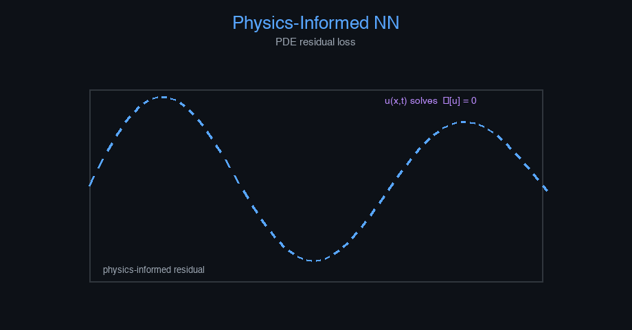

# pinn-heat-equation


Physics-Informed Neural Network (PINN) — AI engineering example · part of the MLOps monorepo

## 1. Mathematical Foundations

This example is grounded in **Physics-Informed Neural Network (PINN)**. The equations below
drive every forward and backward pass in the implementation.

$$\mathcal{L}_{total} = \mathcal{L}_{data} + \lambda \mathcal{L}_{pde}$$

$$\mathcal{L}_{data} = \frac{1}{N} \sum_{i=1}^{N} |u_\theta(x_i, t_i) - u_i|^2$$

$$\mathcal{L}_{pde} = \frac{1}{N_f} \sum_{i=1}^{N_f} \left| \mathcal{F}\left(u_\theta, x_i, t_i; \frac{\partial u_\theta}{\partial x}, \frac{\partial u_\theta}{\partial t}, \ldots \right) \right|^2$$

$$u_t + u u_x = \nu u_{xx} \quad \text{(Burgers' equation)}$$

### Derivation

PINNs embed physical laws as soft constraints via automatic differentiation. The total loss combines data fitting $\mathcal{L}_{data}$ and PDE residual $\mathcal{L}_{pde}$. Gradients of $u_\theta$ w.r.t. inputs are computed symbolically via autograd. This enables solving PDEs without labeled data in the domain interior.

### Worked Numerical Example

$$z = w \cdot x + b$$

Illustrative forward-pass evaluation (scalar example):

Input  x        = 12.0   (e.g. pizza diameter, inches)
Weights w       =  0.85
Bias    b       =  0.30
---------------------------------
z = w*x + b
  = 0.85 * 12.0 + 0.30
  = 10.20 + 0.30
  = 10.50   <- model output

### Conceptual Diagram

        Core transformation flow
   [ Input x ] --> ( w · x + b ) --> [ Output z ]
                       |
                  [ activation ]
                       |
                  [ prediction ]



Interactive PDE solution comparison: PINN vs finite difference; residual heatmap; loss decomposition pie chart.

## 2. Core Logic & Architecture

The example follows a consistent **data → train → evaluate → serve**
pipeline. Inputs are loaded and validated, transformed by the core algorithm, scored against
held-out data, and exposed through a REST API.

  Raw dataset→
  load + validate (data.py)→
  fit / transform (model.py)→
  evaluate + persist (train.py)→
  serve (api.py)

### Primary Components

| Class | Public methods | Responsibility |
| --- | --- | --- |
| `PredictRequest` | — |  |
| `PredictBulkRequest` | — |  |
| `PredictResponse` | — |  |
| `BulkPredictResponse` | — |  |
| `DriftResponse` | — |  |
| `StatsResponse` | — |  |
| `PINNHeatEquation` | _init_weights, _forward, _compute_physics_residual, fit, predict, predict_proba, evaluate, save, load, to_dict | Physics-Informed Neural Network for solving the heat equation.  Trained to solve u_t = alpha * u_xx while respecting physical constraints.  Args:     alpha: Thermal diffusivity coefficient     hidden_dim: Hidden units per layer     n_layers: Number of hidden layers     learning_rate: Gradient descent step size     n_iterations: Number of training iterations     weight_decay: L2 regularization     clip_value: Gradient clipping threshold     random_seed: Random seed |

### Data Flow


1. **Load** — `data.py` reads the source dataset and splits train/test.


2. **Validate** — a Pydantic schema guards input shape/dtypes before training.


3. **Fit / Transform** — `model.py` applies the mathematics from Section 1.


4. **Evaluate** — metrics (MSE/RMSE/R², accuracy, etc.) are computed and logged.


5. **Persist** — weights/artifacts are saved and registered in the model registry.


6. **Serve** — `api.py` exposes prediction endpoints with drift detection.

### Design Patterns & Performance

Key design choices in this module: a pure-NumPy implementation (no PyTorch/TensorFlow), schema validation via `ai_core.validation`, structured JSON logging through `ai_core.logging`, Prometheus metrics from `ai_core.metrics`, and MLflow/model-registry persistence via `ai_core.model_registry`. The FastAPI service wraps the trained model with observability middleware from `ai_core.fastapi_middleware`.

## 3. Detailed Code Walkthrough

The most important behaviour is summarised below; full source for each module is collapsible
so the page stays readable while remaining self-contained.

### `PINNHeatEquation.fit(X, u_true, n_iterations)`

Train the PINN to solve the heat equation.

Args:
    X: Input coordinates (n_samples, 2) [x, t]
    u_true: True temperature values (n_samples, 1)

### `PINNHeatEquation.predict(X)`

Predict temperature u(x, t) for given coordinates.

### Source Files

<details>
<summary>model.py</summary>

```
"""Physics-Informed Neural Network for heat equation solving.

Architecture:
    Input (batch, 2) [x, t coordinates] -> Dense (hidden_dim, tanh) -> Dense (hidden_dim, tanh)
    -> Dense (1, linear) -> Temperature prediction u(x, t)

Loss:
    Data loss: MSE( u_pred - u_true )
    Physics loss: MSE( du/dt - alpha * d2u/dx2 ) (heat equation residual)
"""

from dataclasses import dataclass, field

import numpy as np

def tanh(z: np.ndarray) -> np.ndarray:
    return np.tanh(z)

def tanh_derivative(tanh_val: np.ndarray) -> np.ndarray:
    return 1.0 - tanh_val ** 2

@dataclass
class PINNHeatEquation:
    """Physics-Informed Neural Network for solving the heat equation.

    Trained to solve u_t = alpha * u_xx while respecting physical constraints.

    Args:
        alpha: Thermal diffusivity coefficient
        hidden_dim: Hidden units per layer
        n_layers: Number of hidden layers
        learning_rate: Gradient descent step size
        n_iterations: Number of training iterations
        weight_decay: L2 regularization
        clip_value: Gradient clipping threshold
        random_seed: Random seed
    """

    alpha: float = 0.01
    hidden_dim: int = 32
    n_layers: int = 2
    learning_rate: float = 0.01
    n_iterations: int = 500
    weight_decay: float = 0.001
    clip_value: float = 5.0
    random_seed: int = 42

    weights: list = field(default_factory=list, repr=False)
    biases: list = field(default_factory=list, repr=False)
    n_weights: int = 0
    training_mode: str = "physics-informed"
    loss_history: list[float] = field(default_factory=list)
    _data_loss_history: list[float] = field(default_factory=list, repr=False)
    _physics_loss_history: list[float] = field(default_factory=list, repr=False)

    def _init_weights(self) -> None:
        rng = np.random.default_rng(self.random_seed)
        self.n_weights = self.n_layers + 1

        self.weights = [
            rng.normal(0, np.sqrt(2.0 / 2), (2, self.hidden_dim)),
        ] + [
            rng.normal(0, np.sqrt(2.0 / self.hidden_dim), (self.hidden_dim, self.hidden_dim))
            for _ in range(self.n_layers - 1)
        ] + [
            rng.normal(0, np.sqrt(1.0 / self.hidden_dim), (self.hidden_dim, 1)),
        ]

        self.biases = [np.zeros(self.hidden_dim) for _ in range(self.n_layers)] + [np.zeros(1)]

    def _forward(self, X: np.ndarray, training: bool = True) -> tuple[np.ndarray, dict]:
        """Forward pass through the network.

        Args:
            X: Input coordinates (batch, 2) [x, t]

        Returns:
            u: Temperature predictions (batch, 1)
        """
        activations = [X]
        zs = []

        a = X
        for i in range(len(self.weights)):
            z = a @ self.weights[i] + self.biases[i]
            zs.append(z)
            a = tanh(z) if i < len(self.weights) - 1 else z
            activations.append(a)

        cache = {"activations": activations, "zs": zs}
        return a, cache

    def _compute_physics_residual(self, X: np.ndarray, u_pred: np.ndarray) -> np.ndarray:
        """Compute the heat equation residual: du/dt - alpha * d2u/dx2.

        Uses finite differences for automatic differentiation approximation.
        """
        eps = 1e-5
        X_x_plus = X.copy()
        X_x_plus[:, 0] += eps
        X_x_minus = X.copy()
        X_x_minus[:, 0] -= eps
        X_t_plus = X.copy()
        X_t_plus[:, 1] += eps
        X_t_minus = X.copy()
        X_t_minus[:, 1] -= eps

        u_x_plus, _ = self._forward(X_x_plus)
        u_x_minus, _ = self._forward(X_x_minus)
        u_t_plus, _ = self._forward(X_t_plus)
        u_t_minus, _ = self._forward(X_t_minus)

        du_dt = (u_t_plus - u_t_minus) / (2 * eps)
        d2u_dx2 = (u_x_plus - 2 * u_pred + u_x_minus) / (eps ** 2)

        residual = du_dt - self.alpha * d2u_dx2
        return residual

    def fit(
        self,
        X: np.ndarray,
        u_true: np.ndarray,
        n_iterations: int | None = None,
    ) -> "PINNHeatEquation":
        """Train the PINN to solve the heat equation.

        Args:
            X: Input coordinates (n_samples, 2) [x, t]
            u_true: True temperature values (n_samples, 1)
        """
        if not self.weights:
            self._init_weights()

        if n_iterations is None:
            n_iterations = self.n_iterations

        n_samples = X.shape[0]
        rng = np.random.default_rng(self.random_seed)

        for _epoch in range(n_iterations):
            X_shuffled = X[rng.permutation(n_samples)]
            u_shuffled = u_true[rng.permutation(n_samples)] if u_true is not None else None

            total_data_loss = 0.0
            total_physics_loss = 0.0

            for i in range(n_samples):
                x_i = X_shuffled[i:i + 1]
                u_i = u_shuffled[i:i + 1] if u_shuffled is not None else np.zeros((1, 1))

                u_pred, cache = self._forward(x_i)
                residual = self._compute_physics_residual(x_i, u_pred)

                data_loss = np.mean((u_pred - u_i) ** 2)
                physics_loss = np.mean(residual ** 2)
                total_data_loss += data_loss
                total_physics_loss += physics_loss

                d_pred_du = 1.0
                ddout = d_pred_du * 2 * (u_pred - u_i) / u_i.size

                grads_w = [np.zeros_like(w) for w in self.weights]
                grads_b = [np.zeros_like(b) for b in self.biases]

                activations = cache["activations"]
                zs = cache["zs"]

                da = ddout
                for layer_idx in reversed(range(len(self.weights))):
                    grads_w[layer_idx] += activations[layer_idx].T @ da
                    grads_b[layer_idx] += np.sum(da, axis=0)
                    if layer_idx > 0:
                        da = da @ self.weights[layer_idx].T
                        da = da * tanh_derivative(tanh(zs[layer_idx - 1]))

                grad_norm = np.sqrt(sum(np.sum(g ** 2) for g in grads_w if g is not None))
                if grad_norm > self.clip_value:
                    scale = self.clip_value / (grad_norm + 1e-8)
                    grads_w = [g * scale for g in grads_w]

                lr = self.learning_rate
                wd = self.weight_decay
                for layer_idx in range(len(self.weights)):
                    self.weights[layer_idx] -= lr * (grads_w[layer_idx] + wd * self.weights[layer_idx])
                    self.biases[layer_idx] -= lr * grads_b[layer_idx]

            self.loss_history.append((total_data_loss + total_physics_loss) / n_samples)
            self._data_loss_history.append(total_data_loss / n_samples)
            self._physics_loss_history.append(total_physics_loss / n_samples)

        return self

    def predict(self, X: np.ndarray) -> np.ndarray:
        """Predict temperature u(x, t) for given coordinates."""
        u, _ = self._forward(X)
        return u.flatten()

    def predict_proba(self, X: np.ndarray) -> np.ndarray:
        """Return physics residual magnitude as confidence measure."""
        u_pred, _ = self._forward(X)
        residual = self._compute_physics_residual(X, u_pred)
        return np.abs(residual).flatten()

    def evaluate(self, X: np.ndarray, u_true: np.ndarray) -> dict[str, float]:
        u_pred, _ = self._forward(X)
        mse = float(np.mean((u_pred - u_true) ** 2))
        rmse = float(np.sqrt(mse))
        max_err = float(np.max(np.abs(u_pred - u_true)))
        return {"mse": mse, "rmse": rmse, "max_error": max_err, "n_samples": float(len(X))}

    def save(self, path: str) -> None:
        arrays = {
            "loss_history": np.array(self.loss_history),
            "alpha": np.array([self.alpha]),
            "hidden_dim": np.array([self.hidden_dim]),
            "n_layers": np.array([self.n_layers]),
            "learning_rate": np.array([self.learning_rate]),
            "n_iterations": np.array([self.n_iterations]),
            "weight_decay": np.array([self.weight_decay]),
        }
        for i, w in enumerate(self.weights):
            arrays[f"W{i}"] = w
        for i, b in enumerate(self.biases):
            arrays[f"b{i}"] = b
        np.savez(path, **arrays)

    @classmethod
    def load(cls, path: str) -> "PINNHeatEquation":
        data = np.load(path, allow_pickle=True)
        obj = cls(
            alpha=float(data["alpha"].item()),
            hidden_dim=int(data["hidden_dim"].item()),
            n_layers=int(data["n_layers"].item()),
            learning_rate=float(data["learning_rate"].item()),
            n_iterations=int(data["n_iterations"].item()),
            weight_decay=float(data["weight_decay"].item()),
            random_seed=42,
        )
        obj._init_weights()
        obj.weights = [data[f"W{i}"] for i in range(len(obj.weights))]
        obj.biases = [data[f"b{i}"] for i in range(len(obj.biases))]
        obj.loss_history = list(data.get("loss_history", [0.0]))
        return obj

    def to_dict(self) -> dict:
        return {
            "alpha": self.alpha,
            "hidden_dim": self.hidden_dim,
            "n_layers": self.n_layers,
            "learning_rate": self.learning_rate,
            "n_iterations": self.n_iterations,
            "training_mode": self.training_mode,
            "n_epochs_run": len(self.loss_history),
            "final_loss": self.loss_history[-1] if self.loss_history else 0.0,
        }
```

</details>

<details>
<summary>train.py</summary>

```
"""Training pipeline for PINN Heat Equation Solver."""

import argparse
import os
from pathlib import Path

from ai_core.logging import get_logger, setup_logging
from ai_core.model_registry import ModelRegistry
from ai_core.validation import DataValidator, create_pinn_heat_equation_schema

from pinn_heat_equation.data import (
    generate_synthetic_data,
    save_training_data,
    train_test_split,
)
from pinn_heat_equation.model import PINNHeatEquation

logger = get_logger(__name__)

def train(
    model_dir: Path,
    data_path: Path | None = None,
    n_samples: int = 200,
    alpha: float = 0.01,
    hidden_dim: int = 32,
    n_layers: int = 2,
    learning_rate: float = 0.01,
    n_iterations: int = 500,
    weight_decay: float = 0.001,
    model_version: str = "1.0.0",
    register_to_mlflow: bool = False,
    test_size: float = 0.2,
    random_seed: int = 42,
) -> dict:
    X, u_true = generate_synthetic_data(n_samples=n_samples, random_seed=random_seed, alpha=alpha)
    logger.info("Generated PDE training data", n_samples=n_samples, alpha=alpha)

    validator = DataValidator(create_pinn_heat_equation_schema())
    validation = validator.validate(X.reshape(-1, 1))
    if not validation.valid:
        logger.error("Training data validation failed", errors=validation.errors)
        raise ValueError(f"Training data validation failed: {validation.errors}")

    X_train, X_test, u_train, u_test = train_test_split(X, u_true, test_size=test_size, random_seed=random_seed)
    logger.info("Data split", n_train=len(X_train), n_test=len(X_test))

    model_dir.mkdir(parents=True, exist_ok=True)
    save_training_data(X, u_true, model_dir / "training_data.npz")

    model = PINNHeatEquation(
        alpha=alpha,
        hidden_dim=hidden_dim,
        n_layers=n_layers,
        learning_rate=learning_rate,
        n_iterations=n_iterations,
        weight_decay=weight_decay,
        random_seed=random_seed,
    )
    model.fit(X_train, u_train)

    test_metrics = model.evaluate(X_test, u_test)
    logger.info("Training complete", training_mode=model.training_mode, final_loss=model.loss_history[-1])

    model_path = model_dir / f"pinn_model_v{model_version}.npz"
    model.save(str(model_path))

    metrics = {
        **test_metrics,
        "training_mode": "physics-informed",
        "n_epochs_run": float(len(model.loss_history)),
        "final_loss": model.loss_history[-1] if model.loss_history else 0.0,
        "n_train_samples": float(len(X_train)),
        "n_test_samples": float(len(X_test)),
        "alpha": float(alpha),
    }

    registry = ModelRegistry(base_dir=model_dir)
    registry.save_model(
        model_name="pinn-heat-equation",
        model_version=model_version,
        model_type="regression",
        metrics=metrics,
        parameters={
            "alpha": alpha,
            "hidden_dim": hidden_dim,
            "n_layers": n_layers,
            "learning_rate": learning_rate,
            "n_iterations": n_iterations,
            "weight_decay": weight_decay,
            "random_seed": random_seed,
        },
        artifacts={
            f"pinn_model_v{model_version}.npz": model_path,
            "training_data.npz": model_dir / "training_data.npz",
        },
        tags={"framework": "numpy", "task": "pinn_heat_equation", "model_type": "PINN"},
    )

    if register_to_mlflow:
        registry.log_to_mlflow(
            model_name="pinn-heat-equation",
            model_version=model_version,
            metrics=metrics,
            params={"alpha": alpha, "hidden_dim": hidden_dim, "n_layers": n_layers, "learning_rate": learning_rate, "n_iterations": n_iterations},
            artifacts={"model": str(model_path)},
            tags={"model_type": "pinn", "framework": "numpy"},
        )

    return metrics

def main():
    parser = argparse.ArgumentParser(description="Train PINN Heat Equation model")
    parser.add_argument("--model-dir", type=Path, default=Path(os.getenv("MODEL_DIR", "/models")))
    parser.add_argument("--data-path", type=Path, default=None)
    parser.add_argument("--n-samples", type=int, default=int(os.getenv("N_SAMPLES", "200")))
    parser.add_argument("--alpha", type=float, default=float(os.getenv("ALPHA", "0.01")))
    parser.add_argument("--hidden-dim", type=int, default=int(os.getenv("HIDDEN_DIM", "32")))
    parser.add_argument("--n-layers", type=int, default=int(os.getenv("N_LAYERS", "2")))
    parser.add_argument("--learning-rate", type=float, default=float(os.getenv("LEARNING_RATE", "0.01")))
    parser.add_argument("--n-iterations", type=int, default=int(os.getenv("N_ITERATIONS", "500")))
    parser.add_argument("--weight-decay", type=float, default=float(os.getenv("WEIGHT_DECAY", "0.001")))
    parser.add_argument("--model-version", type=str, default=os.getenv("MODEL_VERSION", "1.0.0"))
    parser.add_argument("--test-size", type=float, default=float(os.getenv("TEST_SIZE", "0.2")))
    parser.add_argument("--random-seed", type=int, default=int(os.getenv("RANDOM_SEED", "42")))
    parser.add_argument("--register-mlflow", action="store_true", default=os.getenv("REGISTER_MLFLOW", "false").lower() == "true")
    parser.add_argument("--log-level", type=str, default=os.getenv("LOG_LEVEL", "INFO"))
    args = parser.parse_args()

    setup_logging(args.log_level)
    args.model_dir.mkdir(parents=True, exist_ok=True)

    metrics = train(
        model_dir=args.model_dir,
        data_path=args.data_path,
        n_samples=args.n_samples,
        alpha=args.alpha,
        hidden_dim=args.hidden_dim,
        n_layers=args.n_layers,
        learning_rate=args.learning_rate,
        n_iterations=args.n_iterations,
        weight_decay=args.weight_decay,
        model_version=args.model_version,
        register_to_mlflow=args.register_mlflow,
        test_size=args.test_size,
        random_seed=args.random_seed,
    )
    logger.info("Training finished", metrics=metrics, model_dir=str(args.model_dir))

if __name__ == "__main__":
    main()
```

</details>

<details>
<summary>data.py</summary>

```
"""Data loading and preprocessing for PINN heat equation solver."""

from pathlib import Path

import numpy as np

N_FEATURES = 2
ALPHA = 0.01

DEFAULT_N_SAMPLES = 200

def heat_equation_solution(x: np.ndarray, t: float, alpha: float = ALPHA, n_terms: int = 50) -> np.ndarray:
    """Analytical solution to the 1D heat equation on [0, 1] with u(x,0)=sin(pi*x), u(0,t)=u(1,t)=0.

    u(x,t) = sum_{n=1}^{inf} (2/(n*pi)) * (1 - exp(-n^2 * pi^2 * alpha * t)) * sin(n*pi*x)
    For initial condition sin(pi*x), only n=1 matters:
    u(x,t) = sin(pi*x) * exp(-pi^2 * alpha * t)
    """
    return np.sin(np.pi * x) * np.exp(-np.pi ** 2 * alpha * t)

def generate_synthetic_data(
    n_samples: int = DEFAULT_N_SAMPLES,
    random_seed: int = 42,
    alpha: float = ALPHA,
) -> tuple[np.ndarray, np.ndarray]:
    """Generate synthetic PDE solver data for the heat equation.

    Returns:
        X: (n_samples, 2) [x, t] coordinates
        u_true: (n_samples, 1) true temperature values
    """
    rng = np.random.default_rng(random_seed)
    X = np.zeros((n_samples, 2))
    u_true = np.zeros((n_samples, 1))

    for i in range(n_samples):
        x = rng.uniform(0, 1)
        t = rng.uniform(0, 0.5)
        X[i] = [x, t]
        u_true[i, 0] = heat_equation_solution(x, t, alpha=alpha)

    perm = rng.permutation(n_samples)
    return X[perm], u_true[perm]

def load_training_data(
    data_path: Path | None = None,
    n_samples: int = DEFAULT_N_SAMPLES,
    random_seed: int = 42,
) -> tuple[np.ndarray, np.ndarray]:
    if data_path and Path(data_path).exists():
        data = np.load(data_path, allow_pickle=True)
        return data["X"], data["u_true"]
    return generate_synthetic_data(n_samples=n_samples, random_seed=random_seed)

def train_test_split(
    X: np.ndarray, y: np.ndarray, test_size: float = 0.2, random_seed: int | None = None
) -> tuple[np.ndarray, np.ndarray, np.ndarray, np.ndarray]:
    n = len(X)
    n_test = max(1, int(n * test_size))
    if random_seed is not None:
        rng = np.random.default_rng(random_seed)
        indices = rng.permutation(n)
    else:
        indices = np.random.permutation(n)
    test_idx = indices[:n_test]
    train_idx = indices[n_test:]
    return X[train_idx], X[test_idx], y[train_idx], y[test_idx]

def save_training_data(X: np.ndarray, u_true: np.ndarray, path: Path) -> None:
    path = Path(path)
    path.parent.mkdir(parents=True, exist_ok=True)
    np.savez(path, X=X, u_true=u_true)
```

</details>

<details>
<summary>api.py</summary>

```
"""Serving API for PINN Heat Equation Solver."""

import os
import time
from contextlib import asynccontextmanager
from pathlib import Path

import numpy as np
from ai_core.drift import DriftDetector
from ai_core.fastapi_middleware import add_observability_middleware
from ai_core.logging import get_logger, setup_logging
from ai_core.metrics import MetricsCollector
from ai_core.model_registry import ModelRegistry
from ai_core.validation import DataValidator, create_pinn_heat_equation_schema
from fastapi import FastAPI, HTTPException, Response
from pydantic import BaseModel, Field

from pinn_heat_equation.data import N_FEATURES, generate_synthetic_data
from pinn_heat_equation.model import PINNHeatEquation

logger = get_logger(__name__)

MODEL_DIR = Path(os.getenv("MODEL_DIR", "/models"))
MODEL_VERSION = os.getenv("MODEL_VERSION", "latest")
METRICS_PORT = int(os.getenv("PINN_METRICS_PORT", "8030"))
DRIFT_THRESHOLD = float(os.getenv("DRIFT_THRESHOLD", "0.2"))

class PredictRequest(BaseModel):
    x: float = Field(..., ge=0.0, le=1.0)
    t: float = Field(..., ge=0.0, le=0.5)

class PredictBulkRequest(BaseModel):
    requests: list[dict] = Field(..., min_length=1, max_length=50)

class PredictResponse(BaseModel):
    temperature: float
    physics_residual: float
    model_version: str
    training_mode: str

class BulkPredictResponse(BaseModel):
    predictions: list[PredictResponse]
    model_version: str

class DriftResponse(BaseModel):
    total_features: int
    drifted_features: int
    drift_ratio: float
    drifted: list[dict]
    all_results: list[dict]

class StatsResponse(BaseModel):
    alpha: float
    hidden_dim: int
    n_layers: int
    training_mode: str
    n_epochs_run: int
    final_loss: float
    model_version: str

_model: PINNHeatEquation | None = None
_model_version: str = "unknown"
_metrics: MetricsCollector | None = None
_validator: DataValidator | None = None
_drift_detector: DriftDetector | None = None
_reference_data: np.ndarray | None = None
_recent_predictions: list[list[float]] = []

@asynccontextmanager
async def lifespan(app: FastAPI):
    global _model, _model_version, _metrics, _validator, _drift_detector, _reference_data

    setup_logging(os.getenv("LOG_LEVEL", "INFO"))
    _metrics = MetricsCollector("pinn_heat_equation", port=METRICS_PORT)
    app.state.metrics = _metrics

    _validator = DataValidator(create_pinn_heat_equation_schema())
    feature_names = ["x", "t"]
    _drift_detector = DriftDetector(
        feature_names=feature_names,
        feature_types={"x": "float", "t": "float"},
        psi_threshold=DRIFT_THRESHOLD,
    )

    _model, _model_version = _load_model()
    _metrics.set_model_version(_model_version)
    _metrics.set_model_info(
        model_name="pinn-heat-equation",
        model_version=_model_version,
        model_type="regression",
    )

    _reference_data = _load_reference_data()
    logger.info("Model loaded", model="pinn-heat-equation", version=_model_version)

    yield
    logger.info("Shutting down pinn-heat-equation API")

def _load_model() -> tuple[PINNHeatEquation, str]:
    registry = ModelRegistry(base_dir=MODEL_DIR)
    try:
        if MODEL_VERSION == "latest":
            models = registry.list_models()
            nn_models = [m for m in models if m.get("model_name") == "pinn-heat-equation"]
            if nn_models:
                nn_models.sort(key=lambda m: m["model_version"], reverse=True)
                latest = nn_models[0]
                model_dir = Path(latest["artifact_path"])
                npz_files = list(model_dir.glob("pinn_model_*.npz")) + list(model_dir.glob("*.npz"))
                if npz_files:
                    return PINNHeatEquation.load(str(npz_files[0])), latest["model_version"]
        else:
            model_dir = MODEL_DIR / "pinn-heat-equation" / MODEL_VERSION
            if model_dir.exists():
                npz_files = list(model_dir.glob("pinn_model_*.npz")) + list(model_dir.glob("*.npz"))
                if npz_files:
                    return PINNHeatEquation.load(str(npz_files[0])), MODEL_VERSION
    except Exception as e:
        logger.warning(f"Registry lookup failed: {e}")

    npz_path = MODEL_DIR / "pinn_model.npz"
    if npz_path.exists():
        return PINNHeatEquation.load(str(npz_path)), "legacy"

    candidate_paths = [
        Path("/app/artifacts/models/pinn_model_v1.0.0.npz"),
        Path(__file__).resolve().parents[3] / "artifacts" / "models" / "pinn_model_v1.0.0.npz",
    ]
    for p in candidate_paths:
        if p.exists():
            logger.info("Loading bundled baseline model", path=str(p))
            return PINNHeatEquation.load(str(p)), "1.0.0-bundled"

    logger.warning("No pre-existing model found. Initializing baseline model.")
    X_base, u_base = generate_synthetic_data(n_samples=100, random_seed=42)
    model = PINNHeatEquation(
        alpha=0.01,
        hidden_dim=16,
        n_layers=2,
        learning_rate=0.01,
        n_iterations=50,
        random_seed=42,
    )
    model.fit(X_base, u_base)
    return model, "1.0.0-baseline"

def _load_reference_data() -> np.ndarray | None:
    X_base, _ = generate_synthetic_data(n_samples=100, random_seed=42)
    return X_base

app = FastAPI(
    title="PINN Heat Equation Solver API",
    description="Solves supervised learning tasks while respecting physical laws described by differential equations",
    version="1.0.0",
    lifespan=lifespan,
)

add_observability_middleware(app)

@app.get("/")
def read_root():
    return {
        "service": "pinn_heat_equation-api",
        "version": "1.0.0",
        "model_version": _model_version,
        "training_mode": _model.training_mode if _model else "unknown",
        "endpoints": {
            "health": "/health",
            "predict": "POST /predict",
            "stats": "GET /stats",
            "drift": "GET /drift",
            "metrics": "/metrics",
        },
    }

@app.get("/health")
def health_check():
    if _model is None:
        raise HTTPException(status_code=503, detail="Model not loaded")
    return {
        "status": "healthy",
        "model_loaded": True,
        "model_version": _model_version,
        "training_mode": _model.training_mode if _model else "unknown",
    }

@app.get("/metrics")
def metrics():
    from prometheus_client import CONTENT_TYPE_LATEST, generate_latest
    return Response(content=generate_latest(), media_type=CONTENT_TYPE_LATEST)

@app.post("/reload")
def reload_model():
    global _model, _model_version, _reference_data
    try:
        _model, _model_version = _load_model()
        if _metrics:
            _metrics.set_model_version(_model_version)
            _metrics.set_model_info(
                model_name="pinn-heat-equation",
                model_version=_model_version,
                model_type="regression",
            )
        _reference_data = _load_reference_data()
        logger.info("Model reloaded", model="pinn-heat-equation", version=_model_version)
        return {"status": "reloaded", "model_version": _model_version}
    except Exception as e:
        logger.exception("Model reload failed", error=str(e))
        raise HTTPException(status_code=500, detail=f"Reload failed: {e}") from e

@app.get("/drift", response_model=DriftResponse)
def drift_check():
    if _drift_detector is None or _reference_data is None:
        raise HTTPException(status_code=503, detail="Drift detection not available")
    if len(_recent_predictions) < 10:
        return {"total_features": N_FEATURES, "drifted_features": 0, "drift_ratio": 0.0, "drifted": [], "all_results": []}
    current = np.array(_recent_predictions[-100:])
    results = _drift_detector.detect_drift(_reference_data, current)
    summary = _drift_detector.summarize(results)
    if _metrics:
        _metrics.set_drift_ratio(summary["drift_ratio"])
    return summary

@app.get("/stats", response_model=StatsResponse)
def get_stats():
    if _model is None or not _model.weights:
        raise HTTPException(status_code=503, detail="Model not loaded")
    return StatsResponse(
        alpha=_model.alpha,
        hidden_dim=_model.hidden_dim,
        n_layers=_model.n_layers,
        training_mode=_model.training_mode,
        n_epochs_run=len(_model.loss_history),
        final_loss=_model.loss_history[-1] if _model.loss_history else 0.0,
        model_version=_model_version,
    )

@app.post("/predict", response_model=PredictResponse)
def predict(body: PredictRequest):
    """Predict temperature u(x, t) using physics-informed network."""
    if _model is None or _metrics is None or _validator is None:
        raise HTTPException(status_code=503, detail="Model not loaded")

    X = np.array([[body.x, body.t]])
    validation = _validator.validate(X.reshape(-1, 1))
    if not validation.valid:
        raise HTTPException(status_code=422, detail=validation.errors)

    start = time.time()
    try:
        u_pred = _model.predict(X)[0]
        residual = _model.predict_proba(X)[0]
        response = PredictResponse(
            temperature=round(float(u_pred), 6),
            physics_residual=round(float(residual), 6),
            model_version=_model_version,
            training_mode=_model.training_mode,
        )
        duration = time.time() - start
        _metrics.record_prediction(model_version=_model_version, duration=duration)

        _recent_predictions.append([body.x, body.t])
        if len(_recent_predictions) > 1000:
            _recent_predictions.pop(0)

        return response
    except Exception as e:
        _metrics.record_error(model_version=_model_version, error_type="prediction")
        logger.exception("Prediction failed", error=str(e))
        raise HTTPException(status_code=500, detail="Prediction failed") from e

@app.post("/predict/bulk", response_model=BulkPredictResponse)
def predict_bulk(body: PredictBulkRequest):
    """Make multiple predictions."""
    global _recent_predictions
    if _model is None or _metrics is None:
        raise HTTPException(status_code=503, detail="Model not loaded")
    if len(body.requests) < 1 or len(body.requests) > 50:
        raise HTTPException(status_code=422, detail="Batch size must be between 1 and 50")

    predictions = []
    for req in body.requests:
        x = float(req.get("x", 0.5))
        t = float(req.get("t", 0.1))
        X = np.array([[x, t]])
        u_pred = _model.predict(X)[0]
        residual = _model.predict_proba(X)[0]
        predictions.append(PredictResponse(
            temperature=round(float(u_pred), 6),
            physics_residual=round(float(residual), 6),
            model_version=_model_version,
            training_mode=_model.training_mode,
        ))
        _recent_predictions.append([x, t])
        if len(_recent_predictions) > 1000:
            _recent_predictions.pop(0)

    return BulkPredictResponse(predictions=predictions, model_version=_model_version)
```

</details>

## 4. Monorepo Integration

This example is a first-class consumer of the shared `packages/ai-core` library.
It reuses the following foundation modules instead of re-implementing infrastructure:

ai_core.drift
ai_core.fastapi_middleware
ai_core.logging
ai_core.metrics
ai_core.model_registry
ai_core.validation

### How it plugs in


- **Configuration** — 12-factor config from `ai_core.config`.


- **Observability** — structured logging + Prometheus metrics are wired in automatically.


- **Validation** — input schema validation prevents bad data reaching the model.


- **Registry** — trained artifacts are versioned and registered for reproducible serving.


- **Serving** — the FastAPI app mounts shared observability middleware for tracing & metrics.

Because every example shares `ai_core`, cross-cutting concerns (drift detection,
logging, metrics, model registry) behave identically across the 47 examples in this monorepo.
