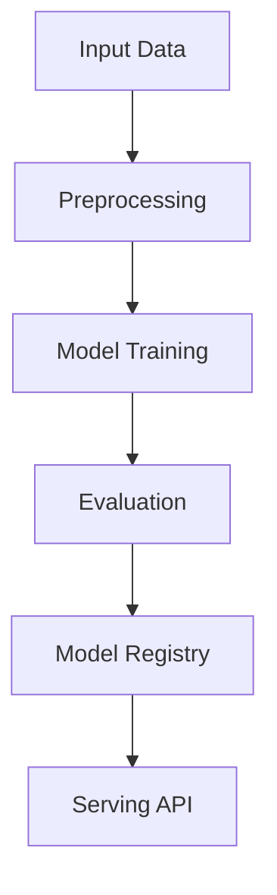

# pinn-heat-equation

## ∫ Mathematics & Theory

Physics-Informed Neural Network (PINN) — Underlying equations and derivations

$$\mathcal{L}_{total} = \mathcal{L}_{data} + \lambda \mathcal{L}_{pde}$$

$$\mathcal{L}_{data} = \frac{1}{N} \sum_{i=1}^{N} |u_\theta(x_i, t_i) - u_i|^2$$

$$\mathcal{L}_{pde} = \frac{1}{N_f} \sum_{i=1}^{N_f} \left| \mathcal{F}\left(u_\theta, x_i, t_i; \frac{\partial u_\theta}{\partial x}, \frac{\partial u_\theta}{\partial t}, \ldots \right) \right|^2$$

$$u_t + u u_x = \nu u_{xx} \quad \text{(Burgers' equation)}$$

### Step-by-Step Derivation

PINNs embed physical laws as soft constraints via automatic differentiation. The total loss combines data fitting $\mathcal{L}_{data}$ and PDE residual $\mathcal{L}_{pde}$. Gradients of $u_\theta$ w.r.t. inputs are computed symbolically via autograd. This enables solving PDEs without labeled data in the domain interior.

### Interactive Visualization

Interactive PDE solution comparison: PINN vs finite difference; residual heatmap; loss decomposition pie chart.

## ⚙ Architecture

Model structure, data flow, and layer breakdown

### Class Hierarchy

```
  PINNHeatEquation
```

### Data Flow



## ⚡ API Reference

FastAPI endpoints and model interfaces

| Method | Endpoint |
| --- | --- |
| `GET` | `/` |
| `GET` | `/health` |
| `GET` | `/metrics` |
| `POST` | `/reload` |

## ▶ Usage

Code examples and CLI commands

### Training Script

```python
"""Training pipeline for PINN Heat Equation Solver."""

import argparse
import os
from pathlib import Path

from ai_core.logging import get_logger, setup_logging
from ai_core.model_registry import ModelRegistry
from ai_core.validation import DataValidator, create_pinn_heat_equation_schema

from pinn_heat_equation.data import (
    generate_synthetic_data,
    save_training_data,
    train_test_split,
)
from pinn_heat_equation.model import PINNHeatEquation

logger = get_logger(__name__)

def train(
    model_dir: Path,
    data_path: Path | None = None,
    n_samples: int = 200,
    alpha: float = 0.01,
    hidden_dim: int = 32,
    n_layers: int = 2,
    learning_rate: float = 0.01,
    n_iterations: int = 500,
    weight_decay: float = 0.001,
    model_version: str = "1.0.0",
    register_to_mlflow: bool = False,
    test_size: float = 0.2,
    random_seed: int = 42,
) -> dict:
    X, u_true = generate_synthetic_data(n_samples=n_samples, random_seed=random_seed, alpha=alpha)
    logger.info("Generated PDE training data", n_samples=n_samples, alpha=alpha)

    validator = DataValidator(create_pinn_heat_equation_schema())
    validation = validator.validate(X.reshape(-1, 1))
    if not validation.valid:
        logger.error("Training data validation failed", errors=validation.errors)
        raise ValueError(f"Training data validation failed: {validation.errors}")

    X_train, X_test, u_train, u_test = train_test_split(X, u_true, test_size=test_size, random_seed=random_seed)
    logger.info("Data split", n_train=len(X_train), n_test=len(X_test))

    model_dir.mkdir(parents=True, exist_ok=True)
    save_training_data(X, u_true, model_dir / "training_data.npz")

    model = PINNHeatEquation(
        alpha=alpha,
        hidden_dim=hidden_dim,
        n_layers=n_layers,
        learning_rate=learning_rate,
        n_iterations=n_iterations,
        weight_decay=weight_decay,
        random_seed=random_seed,
    )
    model.fit(X_train, u_train)

    test_metrics = model.evaluate(X_test, u_test)
    logger.info("Training complete", training_mode=model.training_mode, final_loss=model.loss_history[-1])

    model_path = model_dir / f"pinn_model_v{model_version}.npz"
    model.save(str(model_path))

    metrics = {
        **test_metrics,
        "training_mode": "physics-informed",
        "n_epochs_run": float(len(model.loss_history)),
        "final_loss": model.loss_history[-1] if model.loss_history else 0.0,
        "n_train_samples": float(len(X_train)),
        "n_test_samples": float(len(X_test)),
        "alpha": float(alpha),
    }

    registry = ModelRegistry(base_dir=model_dir)
    registry.save_model(
        model_name="pinn-heat-equation",
        model_version=model_version,
        model_type="regression",
        metrics=metrics,
        parameters={
            "alpha": alpha,
            "hidden_dim": hidden_dim,
            "n_layers": n_layers,
            "learning_rate": learning_rate,
            "n_iterations": n_iterations,
            "weight_decay": weight_decay,
            "random_seed": random_seed,
        },
        artifacts={
            f"pinn_model_v{model_version}.npz": model_path,
            "training_data.npz": model_dir / "training_data.npz",
        },
        tags={"framework": "numpy", "task": "pinn_heat_equation", "model_type": "PINN"},
    )

    if register_to_mlflow:
        registry.log_to_mlflow(
            model_name="pinn-heat-equation",
            model_version=model_version,
            metrics=metrics,
            params={"alpha": alpha, "hidden_dim": hidden_dim, "n_layers": n_layers, "learning_rate": learning_rate, "n_iterations": n_iterations},
            artifacts={"model": str(model_path)},
            tags={"model_type": "pinn", "framework": "numpy"},
        )

    return metrics

def main():
    parser = argparse.ArgumentParser(description="Train PINN Heat Equation model")
    parser.add_argument("--model-dir", type=Path, default=Path(os.getenv("MODEL_DIR", "/models")))
    parser.add_argument("--data-path", type=Path, default=None)
    parser.add_argument("--n-samples", type=int, default=int(os.getenv("N_SAMPLES", "200")))
    parser.add_argument("--alpha", type=float, default=float(os.getenv("ALPHA", "0.01")))
    parser.add_argument("--hidden-dim", type=int, default=int(os.getenv("HIDDEN_DIM", "32")))
    parser.add_argument("--n-layers", type=int, default=int(os.getenv("N_LAYERS", "2")))
    parser.add_argument("--learning-rate", type=float, default=float(os.getenv("LEARNING_RATE", "0.01")))
    parser.add_argument("--n-iterations", type=int, default=int(os.getenv("N_ITERATIONS", "500")))
    parser.add_argument("--weight-decay", type=float, default=float(os.getenv("WEIGHT_DECAY", "0.001")))
    parser.add_argument("--model-version", type=str, default=os.getenv("MODEL_VERSION", "1.0.0"))
    parser.add_argument("--test-size", type=float, default=float(os.getenv("TEST_SIZE", "0.2")))
    parser.add_argument("--random-seed", type=int, default=int(os.getenv("RANDOM_SEED", "42")))
    parser.add_argument("--register-mlflow", action="store_true", default=os.getenv("REGISTER_MLFLOW", "false").lower() == "true")
    parser.add_argument("--log-level", type=str, default=os.getenv("LOG_LEVEL", "INFO"))
    args = parser.parse_args()

    setup_logging(args.log_level)
    args.model_dir.mkdir(parents=True, exist_ok=True)

    metrics = train(
        model_dir=args.model_dir,
        data_path=args.data_path,
        n_samples=args.n_samples,
        alpha=args.alpha,
        hidden_dim=args.hidden_dim,
        n_layers=args.n_layers,
        learning_rate=args.learning_rate,
        n_iterations=args.n_iterations,
        weight_decay=args.weight_decay,
        model_version=args.model_version,
        register_to_mlflow=args.register_mlflow,
        test_size=args.test_size,
        random_seed=args.random_seed,
    )
    logger.info("Training finished", metrics=metrics, model_dir=str(args.model_dir))

if __name__ == "__main__":
    main()
```

### API Server

```python
"""Serving API for PINN Heat Equation Solver."""

import os
import time
from contextlib import asynccontextmanager
from pathlib import Path

import numpy as np
from ai_core.drift import DriftDetector
from ai_core.fastapi_middleware import add_observability_middleware
from ai_core.logging import get_logger, setup_logging
from ai_core.metrics import MetricsCollector
from ai_core.model_registry import ModelRegistry
from ai_core.validation import DataValidator, create_pinn_heat_equation_schema
from fastapi import FastAPI, HTTPException, Response
from pydantic import BaseModel, Field

from pinn_heat_equation.data import N_FEATURES, generate_synthetic_data
from pinn_heat_equation.model import PINNHeatEquation

logger = get_logger(__name__)

MODEL_DIR = Path(os.getenv("MODEL_DIR", "/models"))
MODEL_VERSION = os.getenv("MODEL_VERSION", "latest")
METRICS_PORT = int(os.getenv("PINN_METRICS_PORT", "8030"))
DRIFT_THRESHOLD = float(os.getenv("DRIFT_THRESHOLD", "0.2"))

class PredictRequest(BaseModel):
    x: float = Field(..., ge=0.0, le=1.0)
    t: float = Field(..., ge=0.0, le=0.5)

class PredictBulkRequest(BaseModel):
    requests: list[dict] = Field(..., min_length=1, max_length=50)

class PredictResponse(BaseModel):
    temperature: float
    physics_residual: float
    model_version: str
    training_mode: str

class BulkPredictResponse(BaseModel):
    predictions: list[PredictResponse]
    model_version: str

class DriftResponse(BaseModel):
    total_features: int
    drifted_features: int
    drift_ratio: float
    drifted: list[dict]
    all_results: list[dict]

class StatsResponse(BaseModel):
    alpha: float
    hidden_dim: int
    n_layers: int
    training_mode: str
    n_epochs_run: int
    final_loss: float
    model_version: str

_model: PINNHeatEquation | None = None
_model_version: str = "unknown"
_metrics: MetricsCollector | None = None
_validator: DataValidator | None = None
_drift_detector: DriftDetector | None = None
_reference_data: np.ndarray | None = None
_recent_predictions: list[list[float]] = []

@asynccontextmanager
async def lifespan(app: FastAPI):
    global _model, _model_version, _metrics, _validator, _drift_detector, _reference_data

    setup_logging(os.getenv("LOG_LEVEL", "INFO"))
    _metrics = MetricsCollector("pinn_heat_equation", port=METRICS_PORT)
    app.state.metrics = _metrics

    _validator = DataValidator(create_pinn_heat_equation_schema())
    feature_names = ["x", "t"]
    _drift_detector = DriftDetector(
        feature_names=feature_names,
        feature_types={"x": "float", "t": "float"},
        psi_threshold=DRIFT_THRESHOLD,
    )

    _model, _model_version = _load_model()
    _metrics.set_model_version(_model_version)
    _metrics.set_model_info(
        model_name="pinn-heat-equation",
        model_version=_model_version,
        model_type="regression",
    )

    _reference_data = _load_reference_data()
    logger.info("Model loaded", model="pinn-heat-equation", version=_model_version)

    yield
    logger.info("Shutting down pinn-heat-equation API")

def _load_model() -> tuple[PINNHeatEquation, str]:
    registry = ModelRegistry(base_dir=MODEL_DIR)
    try:
        if MODEL_VERSION == "latest":
            models = registry.list_models()
            nn_models = [m for m in models if m.get("model_name") == "pinn-heat-equation"]
            if nn_models:
                nn_models.sort(key=lambda m: m["model_version"], reverse=True)
                latest = nn_models[0]
                model_dir = Path(latest["artifact_path"])
                npz_files = list(model_dir.glob("pinn_model_*.npz")) + list(model_dir.glob("*.npz"))
                if npz_files:
                    return PINNHeatEquation.load(str(npz_files[0])), latest["model_version"]
        else:
            model_dir = MODEL_DIR / "pinn-heat-equation" / MODEL_VERSION
            if model_dir.exists():
                npz_files = list(model_dir.glob("pinn_model_*.npz")) + list(model_dir.glob("*.npz"))
                if npz_files:
                    return PINNHeatEquation.load(str(npz_files[0])), MODEL_VERSION
    except Exception as e:
        logger.warning(f"Registry lookup failed: {e}")

    npz_path = MODEL_DIR / "pinn_model.npz"
    if npz_path.exists():
        return PINNHeatEquation.load(str(npz_path)), "legacy"

    candidate_paths = [
        Path("/app/artifacts/models/pinn_model_v1.0.0.npz"),
        Path(__file__).resolve().parents[3] / "artifacts" / "models" / "pinn_model_v1.0.0.npz",
    ]
    for p in candidate_paths:
        if p.exists():
            logger.info("Loading bundled baseline model", path=str(p))
            return PINNHeatEquation.load(str(p)), "1.0.0-bundled"

    logger.warning("No pre-existing model found. Initializing baseline model.")
    X_base, u_base = generate_synthetic_data(n_samples=100, random_seed=42)
    model = PINNHeatEquation(
        alpha=0.01,
        hidden_dim=16,
        n_layers=2,
        learning_rate=0.01,
        n_iterations=50,
        random_seed=42,
    )
    model.fit(X_base, u_base)
    return model, "1.0.0-baseline"

def _load_reference_data() -> np.ndarray | None:
    X_base, _ = generate_synthetic_data(n_samples=100, random_seed=42)
    return X_base

app = FastAPI(
    title="PINN Heat Equation Solver API",
    description="Solves supervised learning tasks while respecting physical laws described by differential equations",
    version="1.0.0",
    lifespan=lifespan,
)

add_observability_middleware(app)

@app.get("/")
def read_root():
    return {
        "service": "pinn_heat_equation-api",
        "version": "1.0.0",
        "model_version": _model_version,
        "training_mode": _model.training_mode if _model else "unknown",
        "endpoints": {
            "health": "/health",
            "predict": "POST /predict",
            "stats": "GET /stats",
            "drift": "GET /drift",
            "metrics": "/metrics",
        },
    }

@app.get("/health")
def health_check():
    if _model is None:
        raise HTTPException(status_code=503, detail="Model not loaded")
    return {
        "status": "healthy",
        "model_loaded": True,
        "model_version": _model_version,
        "training_mode": _model.training_mode if _model else "unknown",
    }

@app.get("/metrics")
def metrics():
    from prometheus_client import CONTENT_TYPE_LATEST, generate_latest
    return Response(content=generate_latest(), media_type=CONTENT_TYPE_LATEST)

@app.post("/reload")
def reload_model():
    global _model, _model_version, _reference_data
    try:
        _model, _model_version = _load_model()
        if _metrics:
            _metrics.set_model_version(_model_version)
            _metrics.set_model_info(
                model_name="pinn-heat-equation",
                model_version=_model_version,
                model_type="regression",
            )
        _reference_data = _load_reference_data()
        logger.info("Model reloaded", model="pinn-heat-equation", version=_model_version)
        return {"status": "reloaded", "model_version": _model_version}
    except Exception as e:
        logger.exception("Model reload failed", error=str(e))
        raise HTTPException(status_code=500, detail=f"Reload failed: {e}") from e

@app.get("/drift", response_model=DriftResponse)
def drift_check():
    if _drift_detector is None or _reference_data is None:
        raise HTTPException(status_code=503, detail="Drift detection not available")
    if len(_recent_predictions) < 10:
        return {"total_features": N_FEATURES, "drifted_features": 0, "drift_ratio": 0.0, "drifted": [], "all_results": []}
    current = np.array(_recent_predictions[-100:])
    results = _drift_detector.detect_drift(_reference_data, current)
    summary = _drift_detector.summarize(results)
    if _metrics:
        _metrics.set_drift_ratio(summary["drift_ratio"])
    return summary

@app.get("/stats", response_model=StatsResponse)
def get_stats():
    if _model is None or not _model.weights:
        raise HTTPException(status_code=503, detail="Model not loaded")
    return StatsResponse(
        alpha=_model.alpha,
        hidden_dim=_model.hidden_dim,
        n_layers=_model.n_layers,
        training_mode=_model.training_mode,
        n_epochs_run=len(_model.loss_history),
        final_loss=_model.loss_history[-1] if _model.loss_history else 0.0,
        model_version=_model_version,
    )

@app.post("/predict", response_model=PredictResponse)
def predict(body: PredictRequest):
    """Predict temperature u(x, t) using physics-informed network."""
    if _model is None or _metrics is None or _validator is None:
        raise HTTPException(status_code=503, detail="Model not loaded")

    X = np.array([[body.x, body.t]])
    validation = _validator.validate(X.reshape(-1, 1))
    if not validation.valid:
        raise HTTPException(status_code=422, detail=validation.errors)

    start = time.time()
    try:
        u_pred = _model.predict(X)[0]
        residual = _model.predict_proba(X)[0]
        response = PredictResponse(
            temperature=round(float(u_pred), 6),
            physics_residual=round(float(residual), 6),
            model_version=_model_version,
            training_mode=_model.training_mode,
        )
        duration = time.time() - start
        _metrics.record_prediction(model_version=_model_version, duration=duration)

        _recent_predictions.append([body.x, body.t])
        if len(_recent_predictions) > 1000:
            _recent_predictions.pop(0)

        return response
    except Exception as e:
        _metrics.record_error(model_version=_model_version, error_type="prediction")
        logger.exception("Prediction failed", error=str(e))
        raise HTTPException(status_code=500, detail="Prediction failed") from e

@app.post("/predict/bulk", response_model=BulkPredictResponse)
def predict_bulk(body: PredictBulkRequest):
    """Make multiple predictions."""
    global _recent_predictions
    if _model is None or _metrics is None:
        raise HTTPException(status_code=503, detail="Model not loaded")
    if len(body.requests) < 1 or len(body.requests) > 50:
        raise HTTPException(status_code=422, detail="Batch size must be between 1 and 50")

    predictions = []
    for req in body.requests:
        x = float(req.get("x", 0.5))
        t = float(req.get("t", 0.1))
        X = np.array([[x, t]])
        u_pred = _model.predict(X)[0]
        residual = _model.predict_proba(X)[0]
        predictions.append(PredictResponse(
            temperature=round(float(u_pred), 6),
            physics_residual=round(float(residual), 6),
            model_version=_model_version,
            training_mode=_model.training_mode,
        ))
        _recent_predictions.append([x, t])
        if len(_recent_predictions) > 1000:
            _recent_predictions.pop(0)

    return BulkPredictResponse(predictions=predictions, model_version=_model_version)
```

### CLI Commands

```bash
uv run python -m pinn_heat_equation.train --model-dir ./artifacts/models
```

## 📊 Benchmarks

Test results and performance metrics

Run `pytest tests/test_models.py` and `pytest tests/test_apis.py` for detailed metrics.

Generated documentation for **pinn-heat-equation**
