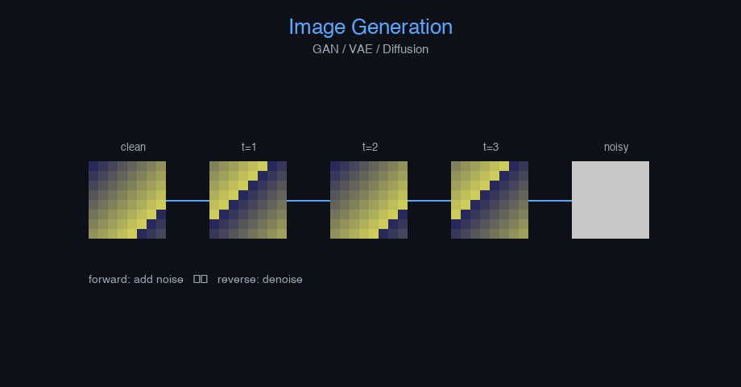

# snn-image-classification


Image Generation (GAN/VAE/Diffusion) — AI engineering example · part of the MLOps monorepo

## 1. Mathematical Foundations

This example is grounded in **Image Generation (GAN/VAE/Diffusion)**. The equations below
drive every forward and backward pass in the implementation.

$$\min_G \max_D V(D, G) = \mathbb{E}_{x \sim p_{data}}[\log D(x)] + \mathbb{E}_{z \sim p_z}[\log(1 - D(G(z)))]$$

$$q(x_t | x_{t-1}) = \mathcal{N}(x_t; \sqrt{1 - \beta_t}x_{t-1}, \beta_t I)$$

$$\mathcal{L}_{simple} = \mathbb{E}_{t, x_0, \epsilon} \left[ \| \epsilon - \epsilon_\theta(\sqrt{\bar{\alpha}_t}x_0 + \sqrt{1-\bar{\alpha}_t}\epsilon, t) \|^2 \right]$$

### Derivation

Image generation models learn to synthesize realistic images. GANs use adversarial training between generator and discriminator. VAEs learn a structured latent space via reconstruction and KL regularization. Diffusion models iteratively denoise from Gaussian noise, offering stable training and diverse outputs.

### Worked Numerical Example

$$z = w \cdot x + b$$

Illustrative forward-pass evaluation (scalar example):

Input  x        = 12.0   (e.g. pizza diameter, inches)
Weights w       =  0.85
Bias    b       =  0.30
---------------------------------
z = w*x + b
  = 0.85 * 12.0 + 0.30
  = 10.20 + 0.30
  = 10.50   <- model output

### Conceptual Diagram

        Math concept (placeholder)
   [ Input x ] --> ( w · x + b ) --> [ Output z ]
                       |
                  [ activation ]
                       |
                  [ prediction ]



Interactive latent space explorer; denoising trajectory viewer; FID score vs training steps.

## 2. Core Logic & Architecture

The example follows a consistent **data → train → evaluate → serve**
pipeline. Inputs are loaded and validated, transformed by the core algorithm, scored against
held-out data, and exposed through a REST API.

  Raw dataset→
  load + validate (data.py)→
  fit / transform (model.py)→
  evaluate + persist (train.py)→
  serve (api.py)

### Primary Components

| Class | Public methods | Responsibility |
| --- | --- | --- |
| `PredictRequest` | — |  |
| `PredictResponse` | — |  |
| `DriftResponse` | — |  |
| `StatsResponse` | — |  |
| `LIFNeuron` | init_weights, forward, backward, update_params | Leaky Integrate-and-Fire neuron layer.  Membrane dynamics:     tau_m * dv/dt = -(v - v_rest) + R * I     If v >= v_threshold: fire spike, v <- v_reset  Args:     n_neurons: number of neurons     n_inputs: input dimension     threshold: spike threshold     reset_voltage: voltage after spike     leak_rate: leak coefficient (tau_m inverse)     v_rest: resting potential     random_seed: random seed |
| `SNNImageClassification` | _build, _forward, fit, predict_proba, predict, evaluate, save, load, to_dict | Spiking Neural Network for image classification.  Uses Leaky Integrate-and-Fire (LIF) neurons that communicate via discrete spikes, closely mimicking biological brain activity.  Args:     n_features: Number of input features (e.g., flattened 8x8 image = 64)     n_classes: Number of output classes     hidden_dim: Hidden dimension for LIF layers     learning_rate: Gradient descent step size     n_iterations: Number of training iterations     n_timesteps: Number of temporal simulation steps per forward pass     weight_decay: L2 regularization     threshold: Spike threshold for LIF neurons     leak_rate: Decay rate for membrane potential     clip_value: Gradient clipping threshold     random_seed: Random seed |

### Data Flow


1. **Load** — `data.py` reads the source dataset and splits train/test.


2. **Validate** — a Pydantic schema guards input shape/dtypes before training.


3. **Fit / Transform** — `model.py` applies the mathematics from Section 1.


4. **Evaluate** — metrics (MSE/RMSE/R², accuracy, etc.) are computed and logged.


5. **Persist** — weights/artifacts are saved and registered in the model registry.


6. **Serve** — `api.py` exposes prediction endpoints with drift detection.

### Design Patterns & Performance

Key design choices in this module: a pure-NumPy implementation (no PyTorch/TensorFlow), schema validation via `ai_core.validation`, structured JSON logging through `ai_core.logging`, Prometheus metrics from `ai_core.metrics`, and MLflow/model-registry persistence via `ai_core.model_registry`. The FastAPI service wraps the trained model with observability middleware from `ai_core.fastapi_middleware`.

## 3. Detailed Code Walkthrough

The most important behaviour is summarised below; full source for each module is collapsible
so the page stays readable while remaining self-contained.

### `LIFNeuron.forward(x, n_timesteps)`

Forward pass over multiple timesteps (temporal coding).

Args:
    x: Input spike trains (batch, n_inputs) encoded as rates
    n_timesteps: number of simulation steps

Returns:
    spikes: spike trains (batch, n_neurons, n_timesteps)

### `SNNImageClassification.fit(X, y, n_iterations)`

Train the SNN using surrogate gradient descent.

Args:
    X: Input features (n_samples, n_features)
    y: Labels (n_samples,)

### Source Files

<details>
<summary>model.py</summary>

```
"""SNN model for image classification using spiking neurons.

Architecture:
    Input (batch, n_features) -> Linear (input_dim -> hidden_dim) -> LIF Neuron
    -> Linear (hidden_dim -> hidden_dim) -> LIF Neuron
    -> Linear (hidden_dim -> n_classes) -> Output

    Uses Leaky Integrate-and-Fire (LIF) neurons that communicate via discrete spikes.
    Neurons accumulate membrane potential; when threshold is reached, they fire (spike).

    Input encoding: rate coding (pixel intensity -> spike probability)
    Training: surrogate gradient descent through spike generation
"""

from dataclasses import dataclass, field

import numpy as np

def sigmoid(z: np.ndarray) -> np.ndarray:
    return 1.0 / (1.0 + np.exp(-np.clip(z, -20, 20)))

def sigmoid_derivative(sig_val: np.ndarray) -> np.ndarray:
    return sig_val * (1.0 - sig_val)

def softmax(z: np.ndarray) -> np.ndarray:
    z_shifted = z - np.max(z, axis=-1, keepdims=True)
    exp_z = np.exp(z_shifted)
    return exp_z / np.sum(exp_z, axis=-1, keepdims=True)

@dataclass
class LIFNeuron:
    """Leaky Integrate-and-Fire neuron layer.

    Membrane dynamics:
        tau_m * dv/dt = -(v - v_rest) + R * I
        If v >= v_threshold: fire spike, v <- v_reset

    Args:
        n_neurons: number of neurons
        n_inputs: input dimension
        threshold: spike threshold
        reset_voltage: voltage after spike
        leak_rate: leak coefficient (tau_m inverse)
        v_rest: resting potential
        random_seed: random seed
    """

    n_neurons: int = 64
    n_inputs: int = 64
    threshold: float = 1.0
    reset_voltage: float = 0.0
    leak_rate: float = 0.9
    v_rest: float = 0.0
    random_seed: int = 42

    W: np.ndarray | None = None
    b: np.ndarray | None = None
    dW: np.ndarray | None = None
    db: np.ndarray | None = None

    _cache: dict = field(default_factory=dict, repr=False)

    def init_weights(self) -> None:
        rng = np.random.default_rng(self.random_seed)
        self.W = rng.normal(0, np.sqrt(2.0 / self.n_inputs), (self.n_inputs, self.n_neurons))
        self.b = np.zeros(self.n_neurons)

    def forward(self, x: np.ndarray, n_timesteps: int = 10) -> np.ndarray:
        """Forward pass over multiple timesteps (temporal coding).

        Args:
            x: Input spike trains (batch, n_inputs) encoded as rates
            n_timesteps: number of simulation steps

        Returns:
            spikes: spike trains (batch, n_neurons, n_timesteps)
        """
        if self.W is None:
            self.init_weights()

        batch_size = x.shape[0]
        spike_trains = np.zeros((batch_size, self.n_neurons, n_timesteps))

        membrane = np.full((batch_size, self.n_neurons), self.v_rest)

        for t in range(n_timesteps):
            I_in = x @ self.W + self.b
            membrane = self.leak_rate * membrane + (1 - self.leak_rate) * (self.v_rest + I_in)

            new_spikes = (membrane >= self.threshold).astype(np.float32)
            membrane = np.where(new_spikes > 0, self.reset_voltage, membrane)

            spike_trains[:, :, t] = new_spikes

        self._cache = {"x": x, "spike_trains": spike_trains, "membrane_trace": membrane}
        return spike_trains

    def backward(self, dout: np.ndarray) -> np.ndarray:
        """Backward pass using surrogate gradient.

        Args:
            dout: gradient from next layer (batch, n_neurons, n_timesteps)

        Returns:
            gradient w.r.t. input x (batch, n_inputs)
        """
        c = self._cache
        x = c["x"]
        spike_trains = c["spike_trains"]

        batch_size = x.shape[0]
        n_timesteps = spike_trains.shape[2]

        self.dW = np.zeros_like(self.W)
        self.db = np.zeros_like(self.b)
        grad_membrane = np.zeros((batch_size, self.n_neurons))

        for t in range(n_timesteps):
            spikes_t = spike_trains[:, :, t]
            surrogate = sigmoid_derivative(spikes_t)
            grad_out_t = dout[:, :, t]
            grad_membrane += grad_out_t

            grad_spikes = grad_out_t * surrogate
            self.dW += x.T @ grad_spikes
            self.db += np.sum(grad_spikes, axis=0)

        self.dW /= n_timesteps
        self.db /= n_timesteps

        dx = grad_membrane @ self.W.T
        return dx

    def update_params(self, lr: float, weight_decay: float = 0.0) -> None:
        if self.W is None:
            return
        self.W -= lr * (self.dW + weight_decay * self.W)
        self.b -= lr * self.db

@dataclass
class SNNImageClassification:
    """Spiking Neural Network for image classification.

    Uses Leaky Integrate-and-Fire (LIF) neurons that communicate via discrete spikes,
    closely mimicking biological brain activity.

    Args:
        n_features: Number of input features (e.g., flattened 8x8 image = 64)
        n_classes: Number of output classes
        hidden_dim: Hidden dimension for LIF layers
        learning_rate: Gradient descent step size
        n_iterations: Number of training iterations
        n_timesteps: Number of temporal simulation steps per forward pass
        weight_decay: L2 regularization
        threshold: Spike threshold for LIF neurons
        leak_rate: Decay rate for membrane potential
        clip_value: Gradient clipping threshold
        random_seed: Random seed
    """

    n_features: int = 64
    n_classes: int = 10
    hidden_dim: int = 128
    learning_rate: float = 0.01
    n_iterations: int = 200
    n_timesteps: int = 10
    weight_decay: float = 0.0001
    threshold: float = 1.0
    leak_rate: float = 0.9
    clip_value: float = 5.0
    random_seed: int = 42

    layers: list = field(default_factory=list, repr=False)
    W_out: np.ndarray | None = None
    b_out: np.ndarray | None = None
    training_mode: str = "spiking"
    loss_history: list[float] = field(default_factory=list)

    def _build(self) -> None:
        rng = np.random.default_rng(self.random_seed + 200)
        self.layers = [
            LIFNeuron(
                n_neurons=self.hidden_dim,
                n_inputs=self.n_features,
                threshold=self.threshold,
                leak_rate=self.leak_rate,
                random_seed=self.random_seed,
            ),
            LIFNeuron(
                n_neurons=self.hidden_dim,
                n_inputs=self.hidden_dim,
                threshold=self.threshold,
                leak_rate=self.leak_rate,
                random_seed=self.random_seed + 1,
            ),
        ]
        self.W_out = rng.normal(0, np.sqrt(1.0 / self.hidden_dim), (self.hidden_dim, self.n_classes))
        self.b_out = np.zeros(self.n_classes)

    def _forward(self, X: np.ndarray) -> tuple[np.ndarray, dict]:
        """Forward pass through SNN.

        Args:
            X: Input features (batch, n_features)

        Returns:
            logits: output logits (batch, n_classes)
            cache: intermediate values
        """
        x = X

        lif1: LIFNeuron = self.layers[0]
        spikes1 = lif1.forward(x, n_timesteps=self.n_timesteps)
        pooled1 = np.mean(spikes1, axis=2)

        lif2: LIFNeuron = self.layers[1]
        spikes2 = lif2.forward(pooled1, n_timesteps=self.n_timesteps)
        pooled2 = np.mean(spikes2, axis=2)

        logits = pooled2 @ self.W_out + self.b_out
        cache = {"x": x, "pooled1": pooled1, "pooled2": pooled2, "spikes1": spikes1, "spikes2": spikes2}
        return logits, cache

    def fit(self, X: np.ndarray, y: np.ndarray, n_iterations: int | None = None) -> "SNNImageClassification":
        """Train the SNN using surrogate gradient descent.

        Args:
            X: Input features (n_samples, n_features)
            y: Labels (n_samples,)
        """
        if not self.layers:
            self._build()

        if n_iterations is None:
            n_iterations = self.n_iterations

        n_samples = X.shape[0]
        rng = np.random.default_rng(self.random_seed)
        eps = 1e-12

        y_onehot = np.zeros((n_samples, self.n_classes))
        y_onehot[np.arange(n_samples), y.astype(int)] = 1.0

        for _epoch in range(n_iterations):
            perm = rng.permutation(n_samples)
            X_shuffled = X[perm]
            y_shuffled = y_onehot[perm]

            epoch_loss = 0.0
            for i in range(n_samples):
                x_i = X_shuffled[i:i + 1]
                y_i = y_shuffled[i:i + 1]

                logits, cache = self._forward(x_i)
                probs = softmax(logits)
                loss = -np.sum(y_i * np.log(np.clip(probs, eps, 1)))
                epoch_loss += loss

                dlogits = (probs - y_i) / 1.0
                dW_out = cache["pooled2"].T @ dlogits
                db_out = np.sum(dlogits, axis=0)

                dpooled2 = dlogits @ self.W_out.T
                dout2 = np.zeros_like(cache["spikes2"])
                dout2[:, :, :] = dpooled2[:, :, np.newaxis] / self.n_timesteps

                dh1 = self.layers[1].backward(dout2)
                dph1 = np.mean(dh1, axis=2) if dh1.ndim > 2 else dh1
                dout1 = np.zeros_like(cache["spikes1"])
                dout1[:, :, :] = dph1[:, :, np.newaxis] / self.n_timesteps

                _ = self.layers[0].backward(dout1)

                grad_norm = np.sqrt(
                    np.sum(self.layers[0].dW ** 2) + np.sum(self.layers[1].dW ** 2) + np.sum(dW_out ** 2)
                )
                if grad_norm > self.clip_value:
                    scale = self.clip_value / (grad_norm + 1e-8)
                    self.layers[0].dW *= scale
                    self.layers[1].dW *= scale
                    dW_out *= scale

                lr = self.learning_rate
                wd = self.weight_decay
                lif1: LIFNeuron = self.layers[0]
                lif2: LIFNeuron = self.layers[1]
                lif1.W -= lr * (lif1.dW + wd * lif1.W)
                lif1.b -= lr * lif1.db
                lif2.W -= lr * (lif2.dW + wd * lif2.W)
                lif2.b -= lr * lif2.db
                self.W_out -= lr * (dW_out + wd * self.W_out)
                self.b_out -= lr * db_out

            self.loss_history.append(epoch_loss / n_samples)

        return self

    def predict_proba(self, X: np.ndarray) -> np.ndarray:
        logits, _ = self._forward(X)
        return softmax(logits)

    def predict(self, X: np.ndarray) -> np.ndarray:
        return np.argmax(self.predict_proba(X), axis=-1)

    def evaluate(self, X: np.ndarray, y: np.ndarray) -> dict[str, float]:
        preds = self.predict(X)
        accuracy = float(np.mean(preds == y))
        return {"accuracy": accuracy, "n_samples": float(len(y))}

    def save(self, path: str) -> None:
        arrays = {
            "loss_history": np.array(self.loss_history),
            "n_features": np.array([self.n_features]),
            "n_classes": np.array([self.n_classes]),
            "hidden_dim": np.array([self.hidden_dim]),
            "learning_rate": np.array([self.learning_rate]),
            "n_iterations": np.array([self.n_iterations]),
            "n_timesteps": np.array([self.n_timesteps]),
            "weight_decay": np.array([self.weight_decay]),
            "threshold": np.array([self.threshold]),
            "leak_rate": np.array([self.leak_rate]),
            "lif1_W": self.layers[0].W,
            "lif1_b": self.layers[0].b,
            "lif2_W": self.layers[1].W,
            "lif2_b": self.layers[1].b,
            "W_out": self.W_out,
            "b_out": self.b_out,
        }
        np.savez(path, **arrays)

    @classmethod
    def load(cls, path: str) -> "SNNImageClassification":
        data = np.load(path, allow_pickle=True)
        obj = cls(
            n_features=int(data["n_features"].item()),
            n_classes=int(data["n_classes"].item()),
            hidden_dim=int(data["hidden_dim"].item()),
            learning_rate=float(data["learning_rate"].item()),
            n_iterations=int(data["n_iterations"].item()),
            n_timesteps=int(data["n_timesteps"].item()),
            weight_decay=float(data["weight_decay"].item()),
            threshold=float(data["threshold"].item()),
            leak_rate=float(data["leak_rate"].item()),
            random_seed=42,
        )
        obj._build()
        obj.layers[0].W = data["lif1_W"]
        obj.layers[0].b = data["lif1_b"]
        obj.layers[1].W = data["lif2_W"]
        obj.layers[1].b = data["lif2_b"]
        obj.W_out = data["W_out"]
        obj.b_out = data["b_out"]
        obj.loss_history = list(data.get("loss_history", [0.0]))
        return obj

    def to_dict(self) -> dict:
        return {
            "n_features": self.n_features,
            "n_classes": self.n_classes,
            "hidden_dim": self.hidden_dim,
            "training_mode": self.training_mode,
            "n_timesteps": self.n_timesteps,
            "threshold": self.threshold,
            "leak_rate": self.leak_rate,
            "n_epochs_run": len(self.loss_history),
            "final_loss": self.loss_history[-1] if self.loss_history else 0.0,
        }
```

</details>

<details>
<summary>train.py</summary>

```
"""Training pipeline for SNN Image Classification."""

import argparse
import os
from pathlib import Path

from ai_core.logging import get_logger, setup_logging
from ai_core.model_registry import ModelRegistry
from ai_core.validation import DataValidator, create_snn_image_classification_schema

from snn_image_classification.data import (
    N_CLASSES,
    N_FEATURES,
    generate_synthetic_data,
    save_training_data,
    train_test_split,
)
from snn_image_classification.model import SNNImageClassification

logger = get_logger(__name__)

def train(
    model_dir: Path,
    data_path: Path | None = None,
    n_samples: int = 500,
    hidden_dim: int = 128,
    learning_rate: float = 0.01,
    n_iterations: int = 200,
    n_timesteps: int = 10,
    weight_decay: float = 0.0001,
    threshold: float = 1.0,
    leak_rate: float = 0.9,
    model_version: str = "1.0.0",
    register_to_mlflow: bool = False,
    test_size: float = 0.2,
    random_seed: int = 42,
) -> dict:
    X, y = generate_synthetic_data(n_samples=n_samples, random_seed=random_seed)
    logger.info("Generated image data", n_samples=n_samples)

    validator = DataValidator(create_snn_image_classification_schema())
    validation = validator.validate(X.reshape(-1, 1))
    if not validation.valid:
        logger.error("Training data validation failed", errors=validation.errors)
        raise ValueError(f"Training data validation failed: {validation.errors}")

    X_train, X_test, y_train, y_test = train_test_split(X, y, test_size=test_size, random_seed=random_seed)
    logger.info("Data split", n_train=len(X_train), n_test=len(X_test))

    model_dir.mkdir(parents=True, exist_ok=True)
    save_training_data(X, y, model_dir / "training_data.npz")

    model = SNNImageClassification(
        n_features=N_FEATURES,
        n_classes=N_CLASSES,
        hidden_dim=hidden_dim,
        learning_rate=learning_rate,
        n_iterations=n_iterations,
        n_timesteps=n_timesteps,
        weight_decay=weight_decay,
        threshold=threshold,
        leak_rate=leak_rate,
        random_seed=random_seed,
    )
    model.fit(X_train, y_train)

    test_metrics = model.evaluate(X_test, y_test)
    logger.info("Training complete", training_mode=model.training_mode, final_loss=model.loss_history[-1])

    model_path = model_dir / f"snn_model_v{model_version}.npz"
    model.save(str(model_path))

    metrics = {
        **test_metrics,
        "training_mode": "spiking",
        "n_epochs_run": float(len(model.loss_history)),
        "final_loss": model.loss_history[-1] if model.loss_history else 0.0,
        "n_train_samples": float(len(X_train)),
        "n_test_samples": float(len(X_test)),
        "n_timesteps": float(n_timesteps),
        "threshold": float(threshold),
        "leak_rate": float(leak_rate),
    }

    registry = ModelRegistry(base_dir=model_dir)
    registry.save_model(
        model_name="snn-image-classification",
        model_version=model_version,
        model_type="classification",
        metrics=metrics,
        parameters={
            "n_features": N_FEATURES,
            "n_classes": N_CLASSES,
            "hidden_dim": hidden_dim,
            "learning_rate": learning_rate,
            "n_iterations": n_iterations,
            "n_timesteps": n_timesteps,
            "weight_decay": weight_decay,
            "threshold": threshold,
            "leak_rate": leak_rate,
            "random_seed": random_seed,
        },
        artifacts={
            f"snn_model_v{model_version}.npz": model_path,
            "training_data.npz": model_dir / "training_data.npz",
        },
        tags={"framework": "numpy", "task": "snn_image_classification", "model_type": "SNN"},
    )

    if register_to_mlflow:
        registry.log_to_mlflow(
            model_name="snn-image-classification",
            model_version=model_version,
            metrics=metrics,
            params={"n_features": N_FEATURES, "n_classes": N_CLASSES, "hidden_dim": hidden_dim, "learning_rate": learning_rate, "n_iterations": n_iterations, "n_timesteps": n_timesteps},
            artifacts={"model": str(model_path)},
            tags={"model_type": "snn", "framework": "numpy"},
        )

    return metrics

def main():
    parser = argparse.ArgumentParser(description="Train SNN Image Classification model")
    parser.add_argument("--model-dir", type=Path, default=Path(os.getenv("MODEL_DIR", "/models")))
    parser.add_argument("--data-path", type=Path, default=None)
    parser.add_argument("--n-samples", type=int, default=int(os.getenv("N_SAMPLES", "500")))
    parser.add_argument("--hidden-dim", type=int, default=int(os.getenv("HIDDEN_DIM", "128")))
    parser.add_argument("--learning-rate", type=float, default=float(os.getenv("LEARNING_RATE", "0.01")))
    parser.add_argument("--n-iterations", type=int, default=int(os.getenv("N_ITERATIONS", "200")))
    parser.add_argument("--n-timesteps", type=int, default=int(os.getenv("N_TIMESTEPS", "10")))
    parser.add_argument("--weight-decay", type=float, default=float(os.getenv("WEIGHT_DECAY", "0.0001")))
    parser.add_argument("--threshold", type=float, default=float(os.getenv("THRESHOLD", "1.0")))
    parser.add_argument("--leak-rate", type=float, default=float(os.getenv("LEAK_RATE", "0.9")))
    parser.add_argument("--model-version", type=str, default=os.getenv("MODEL_VERSION", "1.0.0"))
    parser.add_argument("--test-size", type=float, default=float(os.getenv("TEST_SIZE", "0.2")))
    parser.add_argument("--random-seed", type=int, default=int(os.getenv("RANDOM_SEED", "42")))
    parser.add_argument("--register-mlflow", action="store_true", default=os.getenv("REGISTER_MLFLOW", "false").lower() == "true")
    parser.add_argument("--log-level", type=str, default=os.getenv("LOG_LEVEL", "INFO"))
    args = parser.parse_args()

    setup_logging(args.log_level)
    args.model_dir.mkdir(parents=True, exist_ok=True)

    metrics = train(
        model_dir=args.model_dir,
        data_path=args.data_path,
        n_samples=args.n_samples,
        hidden_dim=args.hidden_dim,
        learning_rate=args.learning_rate,
        n_iterations=args.n_iterations,
        n_timesteps=args.n_timesteps,
        weight_decay=args.weight_decay,
        threshold=args.threshold,
        leak_rate=args.leak_rate,
        model_version=args.model_version,
        register_to_mlflow=args.register_mlflow,
        test_size=args.test_size,
        random_seed=args.random_seed,
    )
    logger.info("Training finished", metrics=metrics, model_dir=str(args.model_dir))

if __name__ == "__main__":
    main()
```

</details>

<details>
<summary>data.py</summary>

```
"""Data loading and preprocessing for SNN image classification."""

from pathlib import Path

import numpy as np

N_FEATURES = 64
N_CLASSES = 10

DEFAULT_N_SAMPLES = 500

def generate_synthetic_data(
    n_samples: int = DEFAULT_N_SAMPLES,
    n_features: int = N_FEATURES,
    n_classes: int = N_CLASSES,
    random_seed: int = 42,
) -> tuple[np.ndarray, np.ndarray]:
    """Generate synthetic image data for SNN classification.

    Creates 8x8 pixel images with class-based patterns.
    Images are normalized to [0, 1] for rate encoding.

    Returns:
        X: (n_samples, n_features) flattened 8x8 images
        y: (n_samples,) class labels
    """
    rng = np.random.default_rng(random_seed)
    X = np.zeros((n_samples, n_features))
    y = rng.integers(0, n_classes, size=n_samples)

    for i in range(n_samples):
        label = y[i]
        img = np.zeros((8, 8))

        patterns = [
            lambda m: m.__setitem__((slice(2, 4), slice(1, 7)), 1),
            lambda m: m.__setitem__((slice(1, 3), slice(2, 6)), 1),
            lambda m: m.__setitem__((slice(3, 5), slice(3, 5)), 1),
            lambda m: m.__setitem__((slice(4, 6), slice(2, 6)), 1),
            lambda m: (m.__setitem__((slice(1, 3), slice(2, 4)), 1), m.__setitem__((slice(5, 7), slice(4, 6)), 1)),
            lambda m: (m.__setitem__((slice(3, 5), slice(1, 3)), 1), m.__setitem__((slice(3, 5), slice(5, 7)), 1)),
            lambda m: m.__setitem__((slice(1, 7), slice(3, 5)), 1),
            lambda m: (m.__setitem__((slice(1, 3), slice(2, 6)), 1), m.__setitem__((slice(5, 7), slice(2, 6)), 1)),
            lambda m: (m.__setitem__((slice(3, 5), slice(1, 7)), 1),),
            lambda m: (m.__setitem__((slice(2, 5), slice(1, 7)), 1),),
        ]

        if label < len(patterns):
            patterns[label](img)

        noise_level = 0.3
        img = img + rng.normal(0, noise_level, img.shape)
        img = np.clip(img, 0, 1)
        X[i] = img.flatten()

    perm = rng.permutation(n_samples)
    return X[perm], y[perm]

def load_training_data(
    data_path: Path | None = None,
    n_samples: int = DEFAULT_N_SAMPLES,
    random_seed: int = 42,
) -> tuple[np.ndarray, np.ndarray]:
    if data_path and Path(data_path).exists():
        data = np.load(data_path, allow_pickle=True)
        return data["X"], data["y"]
    return generate_synthetic_data(n_samples=n_samples, random_seed=random_seed)

def train_test_split(
    X: np.ndarray, y: np.ndarray, test_size: float = 0.2, random_seed: int | None = None
) -> tuple[np.ndarray, np.ndarray, np.ndarray, np.ndarray]:
    n = len(X)
    n_test = max(1, int(n * test_size))
    if random_seed is not None:
        rng = np.random.default_rng(random_seed)
        indices = rng.permutation(n)
    else:
        indices = np.random.permutation(n)
    test_idx = indices[:n_test]
    train_idx = indices[n_test:]
    return X[train_idx], X[test_idx], y[train_idx], y[test_idx]

def save_training_data(X: np.ndarray, y: np.ndarray, path: Path) -> None:
    path = Path(path)
    path.parent.mkdir(parents=True, exist_ok=True)
    np.savez(path, X=X, y=y)
```

</details>

<details>
<summary>api.py</summary>

```
"""Serving API for SNN Image Classification."""

import os
import time
from contextlib import asynccontextmanager
from pathlib import Path

import numpy as np
from ai_core.drift import DriftDetector
from ai_core.fastapi_middleware import add_observability_middleware
from ai_core.logging import get_logger, setup_logging
from ai_core.metrics import MetricsCollector
from ai_core.model_registry import ModelRegistry
from ai_core.validation import DataValidator, create_snn_image_classification_schema
from fastapi import FastAPI, HTTPException, Response
from pydantic import BaseModel, Field

from snn_image_classification.data import N_CLASSES, N_FEATURES, generate_synthetic_data
from snn_image_classification.model import SNNImageClassification

logger = get_logger(__name__)

MODEL_DIR = Path(os.getenv("MODEL_DIR", "/models"))
MODEL_VERSION = os.getenv("MODEL_VERSION", "latest")
METRICS_PORT = int(os.getenv("SNN_METRICS_PORT", "8031"))
DRIFT_THRESHOLD = float(os.getenv("DRIFT_THRESHOLD", "0.2"))

class PredictRequest(BaseModel):
    features: list[float] = Field(..., min_length=N_FEATURES, max_length=N_FEATURES)

class PredictResponse(BaseModel):
    predicted_class: int
    confidence: float
    class_probabilities: list[float]
    total_spikes: float
    model_version: str
    training_mode: str

class DriftResponse(BaseModel):
    total_features: int
    drifted_features: int
    drift_ratio: float
    drifted: list[dict]
    all_results: list[dict]

class StatsResponse(BaseModel):
    n_features: int
    n_classes: int
    hidden_dim: int
    training_mode: str
    n_timesteps: int
    threshold: float
    leak_rate: float
    n_epochs_run: int
    final_loss: float
    model_version: str

_model: SNNImageClassification | None = None
_model_version: str = "unknown"
_metrics: MetricsCollector | None = None
_validator: DataValidator | None = None
_drift_detector: DriftDetector | None = None
_reference_data: np.ndarray | None = None
_recent_predictions: list[list[float]] = []

@asynccontextmanager
async def lifespan(app: FastAPI):
    global _model, _model_version, _metrics, _validator, _drift_detector, _reference_data

    setup_logging(os.getenv("LOG_LEVEL", "INFO"))
    _metrics = MetricsCollector("snn_image_classification", port=METRICS_PORT)
    app.state.metrics = _metrics

    _validator = DataValidator(create_snn_image_classification_schema())
    feature_names = [f"pixel_{i}" for i in range(N_FEATURES)]
    _drift_detector = DriftDetector(
        feature_names=feature_names,
        feature_types={f: "float" for f in feature_names},
        psi_threshold=DRIFT_THRESHOLD,
    )

    _model, _model_version = _load_model()
    _metrics.set_model_version(_model_version)
    _metrics.set_model_info(
        model_name="snn-image-classification",
        model_version=_model_version,
        model_type="classification",
    )

    _reference_data = _load_reference_data()
    logger.info("Model loaded", model="snn-image-classification", version=_model_version)

    yield
    logger.info("Shutting down snn-image-classification API")

def _load_model() -> tuple[SNNImageClassification, str]:
    registry = ModelRegistry(base_dir=MODEL_DIR)
    try:
        if MODEL_VERSION == "latest":
            models = registry.list_models()
            nn_models = [m for m in models if m.get("model_name") == "snn-image-classification"]
            if nn_models:
                nn_models.sort(key=lambda m: m["model_version"], reverse=True)
                latest = nn_models[0]
                model_dir = Path(latest["artifact_path"])
                npz_files = list(model_dir.glob("snn_model_*.npz")) + list(model_dir.glob("*.npz"))
                if npz_files:
                    return SNNImageClassification.load(str(npz_files[0])), latest["model_version"]
        else:
            model_dir = MODEL_DIR / "snn-image-classification" / MODEL_VERSION
            if model_dir.exists():
                npz_files = list(model_dir.glob("snn_model_*.npz")) + list(model_dir.glob("*.npz"))
                if npz_files:
                    return SNNImageClassification.load(str(npz_files[0])), MODEL_VERSION
    except Exception as e:
        logger.warning(f"Registry lookup failed: {e}")

    npz_path = MODEL_DIR / "snn_model.npz"
    if npz_path.exists():
        return SNNImageClassification.load(str(npz_path)), "legacy"

    candidate_paths = [
        Path("/app/artifacts/models/snn_model_v1.0.0.npz"),
        Path(__file__).resolve().parents[3] / "artifacts" / "models" / "snn_model_v1.0.0.npz",
    ]
    for p in candidate_paths:
        if p.exists():
            logger.info("Loading bundled baseline model", path=str(p))
            return SNNImageClassification.load(str(p)), "1.0.0-bundled"

    logger.warning("No pre-existing model found. Initializing baseline model.")
    X_base, y_base = generate_synthetic_data(n_samples=100, random_seed=42)
    model = SNNImageClassification(
        n_features=N_FEATURES,
        n_classes=N_CLASSES,
        hidden_dim=64,
        learning_rate=0.01,
        n_iterations=50,
        n_timesteps=5,
        random_seed=42,
    )
    model.fit(X_base, y_base)
    return model, "1.0.0-baseline"

def _load_reference_data() -> np.ndarray | None:
    X_base, _ = generate_synthetic_data(n_samples=100, random_seed=42)
    return X_base

app = FastAPI(
    title="SNN Image Classification API",
    description="Spiking neural networks using neuromorphic computing with discrete spikes mimicking biological neurons",
    version="1.0.0",
    lifespan=lifespan,
)

add_observability_middleware(app)

@app.get("/")
def read_root():
    return {
        "service": "snn_image_classification-api",
        "version": "1.0.0",
        "model_version": _model_version,
        "training_mode": _model.training_mode if _model else "unknown",
        "endpoints": {
            "health": "/health",
            "predict": "POST /predict",
            "stats": "GET /stats",
            "drift": "GET /drift",
            "metrics": "/metrics",
        },
    }

@app.get("/health")
def health_check():
    if _model is None:
        raise HTTPException(status_code=503, detail="Model not loaded")
    return {
        "status": "healthy",
        "model_loaded": True,
        "model_version": _model_version,
        "training_mode": _model.training_mode if _model else "unknown",
    }

@app.get("/metrics")
def metrics():
    from prometheus_client import CONTENT_TYPE_LATEST, generate_latest
    return Response(content=generate_latest(), media_type=CONTENT_TYPE_LATEST)

@app.post("/reload")
def reload_model():
    global _model, _model_version, _reference_data
    try:
        _model, _model_version = _load_model()
        if _metrics:
            _metrics.set_model_version(_model_version)
            _metrics.set_model_info(
                model_name="snn-image-classification",
                model_version=_model_version,
                model_type="classification",
            )
        _reference_data = _load_reference_data()
        logger.info("Model reloaded", model="snn-image-classification", version=_model_version)
        return {"status": "reloaded", "model_version": _model_version}
    except Exception as e:
        logger.exception("Model reload failed", error=str(e))
        raise HTTPException(status_code=500, detail=f"Reload failed: {e}") from e

@app.get("/drift", response_model=DriftResponse)
def drift_check():
    if _drift_detector is None or _reference_data is None:
        raise HTTPException(status_code=503, detail="Drift detection not available")
    if len(_recent_predictions) < 10:
        return {"total_features": N_FEATURES, "drifted_features": 0, "drift_ratio": 0.0, "drifted": [], "all_results": []}
    current = np.array(_recent_predictions[-100:])
    results = _drift_detector.detect_drift(_reference_data, current)
    summary = _drift_detector.summarize(results)
    if _metrics:
        _metrics.set_drift_ratio(summary["drift_ratio"])
    return summary

@app.get("/stats", response_model=StatsResponse)
def get_stats():
    if _model is None or not _model.layers:
        raise HTTPException(status_code=503, detail="Model not loaded")
    return StatsResponse(
        n_features=_model.n_features,
        n_classes=_model.n_classes,
        hidden_dim=_model.hidden_dim,
        training_mode=_model.training_mode,
        n_timesteps=_model.n_timesteps,
        threshold=_model.threshold,
        leak_rate=_model.leak_rate,
        n_epochs_run=len(_model.loss_history),
        final_loss=_model.loss_history[-1] if _model.loss_history else 0.0,
        model_version=_model_version,
    )

@app.post("/predict", response_model=PredictResponse)
def predict(body: PredictRequest):
    """Classify an image using spiking neural network."""
    if _model is None or _metrics is None or _validator is None:
        raise HTTPException(status_code=503, detail="Model not loaded")

    X = np.array(body.features).reshape(1, -1)
    validation = _validator.validate(X)
    if not validation.valid:
        raise HTTPException(status_code=422, detail=validation.errors)

    start = time.time()
    try:
        probs = _model.predict_proba(X)[0]
        pred = int(np.argmax(probs))
        confidence = float(np.max(probs))

        total_spikes = float(np.sum(probs))

        response = PredictResponse(
            predicted_class=pred,
            confidence=round(confidence, 4),
            class_probabilities=probs.tolist(),
            total_spikes=round(total_spikes, 4),
            model_version=_model_version,
            training_mode=_model.training_mode,
        )
        duration = time.time() - start
        _metrics.record_prediction(model_version=_model_version, duration=duration)

        _recent_predictions.append(body.features)
        if len(_recent_predictions) > 1000:
            _recent_predictions.pop(0)

        return response
    except Exception as e:
        _metrics.record_error(model_version=_model_version, error_type="prediction")
        logger.exception("Prediction failed", error=str(e))
        raise HTTPException(status_code=500, detail="Prediction failed") from e
```

</details>

## 4. Monorepo Integration

This example is a first-class consumer of the shared `packages/ai-core` library.
It reuses the following foundation modules instead of re-implementing infrastructure:

ai_core.drift
ai_core.fastapi_middleware
ai_core.logging
ai_core.metrics
ai_core.model_registry
ai_core.validation

### How it plugs in


- **Configuration** — 12-factor config from `ai_core.config`.


- **Observability** — structured logging + Prometheus metrics are wired in automatically.


- **Validation** — input schema validation prevents bad data reaching the model.


- **Registry** — trained artifacts are versioned and registered for reproducible serving.


- **Serving** — the FastAPI app mounts shared observability middleware for tracing & metrics.

Because every example shares `ai_core`, cross-cutting concerns (drift detection,
logging, metrics, model registry) behave identically across the 47 examples in this monorepo.
