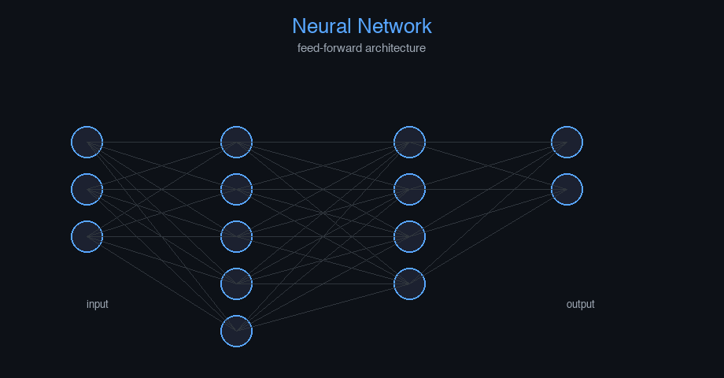

# speech-audio-music


Machine Learning Fundamentals — AI engineering example · part of the MLOps monorepo

## 1. Mathematical Foundations

This example is grounded in **Machine Learning Fundamentals**. The equations below
drive every forward and backward pass in the implementation.

$$\hat{y} = f(x; \theta)$$

$$\mathcal{L}(\theta) = \frac{1}{n} \sum_{i=1}^{n} \ell(y_i, \hat{y}_i)$$

$$\theta \leftarrow \theta - \alpha \nabla_\theta \mathcal{L}(\theta)$$

### Derivation

Machine learning models learn parameters $\theta$ by minimizing a loss function $\mathcal{L}$. Gradient descent iteratively updates parameters in the direction of steepest descent. The learning rate $\alpha$ controls step size. Stochastic gradient descent (SGD) uses mini-batches for computational efficiency.

### Worked Numerical Example

$$z = w \cdot x + b$$

Illustrative forward-pass evaluation (scalar example):

Input  x        = 12.0   (e.g. pizza diameter, inches)
Weights w       =  0.85
Bias    b       =  0.30
---------------------------------
z = w*x + b
  = 0.85 * 12.0 + 0.30
  = 10.20 + 0.30
  = 10.50   <- model output

### Conceptual Diagram

        Core transformation flow
   [ Input x ] --> ( w · x + b ) --> [ Output z ]
                       |
                  [ activation ]
                       |
                  [ prediction ]



Interactive loss landscape explorer; gradient descent trajectory; learning rate scheduler.

## 2. Core Logic & Architecture

The example follows a consistent **data → train → evaluate → serve**
pipeline. Inputs are loaded and validated, transformed by the core algorithm, scored against
held-out data, and exposed through a REST API.

  Raw dataset→
  load + validate (data.py)→
  fit / transform (model.py)→
  evaluate + persist (train.py)→
  serve (api.py)

### Primary Components

| Class | Public methods | Responsibility |
| --- | --- | --- |
| `PredictRequest` | — |  |
| `PredictBulkRequest` | — |  |
| `PredictResponse` | — |  |
| `BulkPredictResponse` | — |  |
| `StatsResponse` | — |  |
| `MusicGenerationRNN` | _to_onehot_seq, _to_onehot_batch, fit, predict_proba, predict, generate, perplexity, evaluate, save, load, to_dict | RNN language model for character-level music generation (many-to-many).  Args:     vocab_size: Number of possible note/rest tokens     seq_len: Length of input note sequences     hidden_dim: Number of hidden units     learning_rate: Gradient descent step size     n_iterations: Number of training epochs     weight_decay: L2 regularization strength     clip_value: Maximum gradient norm     random_seed: Random seed for reproducibility |

### Data Flow


1. **Load** — `data.py` reads the source dataset and splits train/test.


2. **Validate** — a Pydantic schema guards input shape/dtypes before training.


3. **Fit / Transform** — `model.py` applies the mathematics from Section 1.


4. **Evaluate** — metrics (MSE/RMSE/R², accuracy, etc.) are computed and logged.


5. **Persist** — weights/artifacts are saved and registered in the model registry.


6. **Serve** — `api.py` exposes prediction endpoints with drift detection.

### Design Patterns & Performance

Key design choices in this module: a pure-NumPy implementation (no PyTorch/TensorFlow), schema validation via `ai_core.validation`, structured JSON logging through `ai_core.logging`, Prometheus metrics from `ai_core.metrics`, and MLflow/model-registry persistence via `ai_core.model_registry`. The FastAPI service wraps the trained model with observability middleware from `ai_core.fastapi_middleware`.

## 3. Detailed Code Walkthrough

The most important behaviour is summarised below; full source for each module is collapsible
so the page stays readable while remaining self-contained.

### `MusicGenerationRNN.fit(X, y, X_val, y_val)`

Train the RNN with BPTT.

For music generation, y is derived from X by shifting by one position
(predict next note).

Args:
    X: Note index sequences (n_samples, seq_len)
    y: Optional explicit targets (n_samples, seq_len). If None, shift X.

Returns:
    self

### `MusicGenerationRNN.predict(X_seq)`

Greedy sampling: predict one note at each position.

### Source Files

<details>
<summary>model.py</summary>

```
"""Recurrent neural network for music generation.

A SimpleRNN (Elman network) trained with Backpropagation Through Time (BPTT).
Built from scratch with NumPy, using the shared nn_utils.rnn.SimpleRNN base.

Architecture:
    Input (seq_len, vocab_size) -> Hidden (hidden_dim, tanh) -> Output (vocab_size, softmax)

Loss: Cross-Entropy (many-to-many: predicts next note at each timestep)

The model is trained to predict the next musical note (or rest) in a sequence,
enabling autoregressive music composition.
"""

from dataclasses import dataclass, field

import numpy as np
from ai_core.nn_utils.rnn import SimpleRNN

@dataclass
class MusicGenerationRNN:
    """RNN language model for character-level music generation (many-to-many).

    Args:
        vocab_size: Number of possible note/rest tokens
        seq_len: Length of input note sequences
        hidden_dim: Number of hidden units
        learning_rate: Gradient descent step size
        n_iterations: Number of training epochs
        weight_decay: L2 regularization strength
        clip_value: Maximum gradient norm
        random_seed: Random seed for reproducibility
    """

    vocab_size: int = 40
    seq_len: int = 20
    hidden_dim: int = 32
    learning_rate: float = 0.1
    n_iterations: int = 500
    weight_decay: float = 0.001
    clip_value: float = 5.0
    random_seed: int = 42

    model: SimpleRNN | None = field(default=None, repr=False)
    training_mode: str = "self-supervised"
    loss_history: list[float] = field(default_factory=list)

    def _to_onehot_seq(self, seq: np.ndarray, dim: int) -> np.ndarray:
        seq = np.atleast_1d(seq).astype(int)
        result = np.zeros((len(seq), dim))
        result[np.arange(len(seq)), seq % dim] = 1.0
        return result

    def _to_onehot_batch(self, X: np.ndarray) -> np.ndarray:
        n_samples = X.shape[0]
        seq_len = X.shape[1]
        result = np.zeros((n_samples, seq_len, self.vocab_size))
        for i in range(n_samples):
            result[i] = self._to_onehot_seq(X[i], self.vocab_size)
        return result

    def fit(
        self,
        X: np.ndarray,
        y: np.ndarray | None = None,
        X_val: np.ndarray | None = None,
        y_val: np.ndarray | None = None,
    ) -> "MusicGenerationRNN":
        """Train the RNN with BPTT.

        For music generation, y is derived from X by shifting by one position
        (predict next note).

        Args:
            X: Note index sequences (n_samples, seq_len)
            y: Optional explicit targets (n_samples, seq_len). If None, shift X.

        Returns:
            self
        """
        X_onehot = self._to_onehot_batch(X)

        # Next-token prediction: target = input shifted by 1
        y_shifted = np.roll(X, -1, axis=1) if y is None else y

        y_onehot = np.zeros((X_onehot.shape[0], X_onehot.shape[1], self.vocab_size))
        for i in range(X_onehot.shape[0]):
            for t in range(X_onehot.shape[1]):
                idx = int(y_shifted[i, t]) % self.vocab_size
                y_onehot[i, t, idx] = 1.0

        self.model = SimpleRNN(
            input_dim=self.vocab_size,
            hidden_dim=self.hidden_dim,
            output_dim=self.vocab_size,
            output_activation="softmax",
            learning_rate=self.learning_rate,
            weight_decay=self.weight_decay,
            clip_value=self.clip_value,
            random_seed=self.random_seed,
            output_loss="cross_entropy",
        )
        self.model.fit(X_onehot, y_onehot, n_iterations=self.n_iterations)
        self.loss_history = self.model.loss_history
        return self

    def predict_proba(self, X_seq: np.ndarray) -> np.ndarray:
        """Predict next-note probabilities for each position."""
        X_oh = self._to_onehot_seq(X_seq, self.vocab_size)
        return self.model.predict_many_to_many(X_oh)

    def predict(self, X_seq: np.ndarray) -> np.ndarray:
        """Greedy sampling: predict one note at each position."""
        probas = self.predict_proba(X_seq)
        return np.argmax(probas, axis=1)

    def generate(self, seed_seq: np.ndarray, n_tokens: int = 10) -> np.ndarray:
        """Autoregressively generate n_tokens following a seed sequence."""
        generated = list(seed_seq)
        current_seq = seed_seq.copy()

        for _ in range(n_tokens):
            X_oh = self._to_onehot_seq(current_seq, self.vocab_size)
            outputs = self.model.predict_many_to_many(X_oh)
            next_probs = outputs[-1]
            next_idx = int(np.argmax(next_probs))
            generated.append(next_idx)
            current_seq = np.array(generated[-self.seq_len :])

        return np.array(generated)

    def perplexity(self, X: np.ndarray) -> float:
        total_loss = 0.0
        n_tokens = 0
        for i in range(X.shape[0]):
            y_shifted = np.roll(X[i], -1)
            probas = self.predict_proba(X[i])
            for t in range(len(y_shifted) - 1):
                idx = int(y_shifted[t]) % self.vocab_size
                p = max(probas[t, idx], 1e-9)
                total_loss += -np.log(p)
                n_tokens += 1
        avg_loss = total_loss / max(n_tokens, 1)
        return float(np.exp(avg_loss))

    def evaluate(self, X: np.ndarray) -> dict[str, float]:
        return {"perplexity": self.perplexity(X), "n_sequences": float(X.shape[0])}

    def save(self, path: str) -> None:
        if self.model is None:
            raise ValueError("Cannot save untrained model")
        self.model.save(path)

    @classmethod
    def load(cls, path: str) -> "MusicGenerationRNN":
        model = SimpleRNN.load(path)
        obj = cls(
            vocab_size=model.input_dim,
            seq_len=20,
            hidden_dim=model.hidden_dim,
            learning_rate=model.learning_rate,
            weight_decay=model.weight_decay,
            clip_value=model.clip_value,
            random_seed=model.random_seed,
        )
        obj.model = model
        obj.loss_history = model.loss_history
        return obj

    def to_dict(self) -> dict:
        return {
            "vocab_size": self.vocab_size,
            "seq_len": self.seq_len,
            "hidden_dim": self.hidden_dim,
            "learning_rate": self.learning_rate,
            "n_iterations": self.n_iterations,
            "weight_decay": self.weight_decay,
            "random_seed": self.random_seed,
            "training_mode": self.training_mode,
            "n_epochs_run": len(self.loss_history),
            "final_loss": self.loss_history[-1] if self.loss_history else 0.0,
        }
```

</details>

<details>
<summary>train.py</summary>

```
"""Training pipeline for music generation (RNN language model)."""

import argparse
import os
from pathlib import Path

from ai_core.logging import get_logger, setup_logging
from ai_core.model_registry import ModelRegistry
from ai_core.validation import DataValidator, create_music_generation_schema

from speech_audio_music.data import (
    SEQ_LEN,
    VOCAB_SIZE,
    load_training_data,
    save_training_data,
    train_test_split,
)
from speech_audio_music.model import MusicGenerationRNN

logger = get_logger(__name__)

def train(
    model_dir: Path,
    data_path: Path | None = None,
    n_samples: int = 500,
    vocab_size: int = VOCAB_SIZE,
    seq_len: int = SEQ_LEN,
    hidden_dim: int = 32,
    learning_rate: float = 0.1,
    n_iterations: int = 500,
    weight_decay: float = 0.001,
    clip_value: float = 5.0,
    model_version: str = "1.0.0",
    register_to_mlflow: bool = False,
    test_size: float = 0.2,
    random_seed: int = 42,
) -> dict:
    X = load_training_data(data_path, n_samples=n_samples, random_seed=random_seed)
    logger.info("Loaded training data", n_samples=len(X), data_path=str(data_path))

    validator = DataValidator(create_music_generation_schema())
    validation = validator.validate(X.reshape(-1, 1))
    if not validation.valid:
        logger.error("Training data validation failed", errors=validation.errors)
        raise ValueError(f"Training data validation failed: {validation.errors}")
    logger.info("Training data validated", stats=validation.stats)

    X_train, X_test, _, _ = train_test_split(X, X, test_size=test_size, random_seed=random_seed)
    logger.info("Data split", n_train=len(X_train), n_test=len(X_test), test_size=test_size)

    model_dir.mkdir(parents=True, exist_ok=True)
    save_training_data(X, X, model_dir / "training_data.npz")

    model = MusicGenerationRNN(
        vocab_size=vocab_size,
        seq_len=seq_len,
        hidden_dim=hidden_dim,
        learning_rate=learning_rate,
        n_iterations=n_iterations,
        weight_decay=weight_decay,
        clip_value=clip_value,
        random_seed=random_seed,
    )
    model.fit(X_train, X_val=X_test)

    train_metrics = model.evaluate(X_train)
    test_metrics = model.evaluate(X_test)

    logger.info(
        "Training complete",
        training_mode=model.training_mode,
        n_epochs=len(model.loss_history),
        final_loss=model.loss_history[-1] if model.loss_history else 0.0,
        train_perplexity=train_metrics["perplexity"],
        test_perplexity=test_metrics["perplexity"],
    )

    model_path = model_dir / f"music_generation_model_v{model_version}.npz"
    model.save(str(model_path))

    _save_chart(model, model_dir, model_version)

    metrics = {
        **test_metrics,
        "training_mode": "self-supervised",
        "n_epochs_run": float(len(model.loss_history)),
        "final_loss": model.loss_history[-1] if model.loss_history else 0.0,
        "train_perplexity": train_metrics["perplexity"],
        "n_train_samples": float(len(X_train)),
        "n_test_samples": float(len(X_test)),
        "hidden_dim": float(hidden_dim),
        "learning_rate": float(learning_rate),
        "vocab_size": float(vocab_size),
    }

    registry = ModelRegistry(base_dir=model_dir)
    registry.save_model(
        model_name="music-generation",
        model_version=model_version,
        model_type="rnn_language_model",
        metrics=metrics,
        parameters={
            "vocab_size": vocab_size,
            "seq_len": seq_len,
            "hidden_dim": hidden_dim,
            "learning_rate": learning_rate,
            "n_iterations": n_iterations,
            "weight_decay": weight_decay,
            "random_seed": random_seed,
        },
        artifacts={
            f"music_generation_model_v{model_version}.npz": model_path,
            "training_data.npz": model_dir / "training_data.npz",
        },
        tags={"framework": "numpy", "task": "music_generation", "model_type": "simple_rnn"},
    )

    if register_to_mlflow:
        registry.log_to_mlflow(
            model_name="music-generation",
            model_version=model_version,
            metrics=metrics,
            params={
                "vocab_size": vocab_size,
                "seq_len": seq_len,
                "hidden_dim": hidden_dim,
                "learning_rate": learning_rate,
                "n_iterations": n_iterations,
                "weight_decay": weight_decay,
                "random_seed": random_seed,
            },
            artifacts={
                "model": str(model_path),
                "chart": str(model_dir / f"music_v{model_version}.png"),
            },
            tags={"model_type": "music_generation", "framework": "numpy"},
        )
        logger.info("Registered model to MLflow", model="music-generation", version=model_version)

    return metrics

def _save_chart(model: MusicGenerationRNN, output_dir: Path, version: str) -> None:
    import matplotlib

    matplotlib.use("Agg")
    import matplotlib.pyplot as plt

    if not model.loss_history:
        return

    fig, ax = plt.subplots(figsize=(10, 5))
    ax.plot(model.loss_history, color="steelblue", linewidth=1.5)
    ax.set_xlabel("Training Epoch")
    ax.set_ylabel("Loss (Cross-Entropy)")
    ax.set_title("Music Generation RNN Training Loss")
    ax.grid(True, alpha=0.3)
    ax.set_yscale("log")

    plt.tight_layout()
    chart_path = output_dir / f"music_v{version}.png"
    plt.savefig(str(chart_path), dpi=100)
    plt.close()
    logger.info("Chart saved", path=str(chart_path))

def main():
    parser = argparse.ArgumentParser(description="Train music generation RNN")
    parser.add_argument("--model-dir", type=Path, default=Path(os.getenv("MODEL_DIR", "/models")))
    parser.add_argument("--data-path", type=Path, default=None)
    parser.add_argument("--n-samples", type=int, default=int(os.getenv("N_SAMPLES", "500")))
    parser.add_argument(
        "--vocab-size", type=int, default=int(os.getenv("VOCAB_SIZE", str(VOCAB_SIZE)))
    )
    parser.add_argument("--seq-len", type=int, default=int(os.getenv("SEQ_LEN", str(SEQ_LEN))))
    parser.add_argument("--hidden-dim", type=int, default=int(os.getenv("HIDDEN_DIM", "32")))
    parser.add_argument(
        "--learning-rate", type=float, default=float(os.getenv("LEARNING_RATE", "0.1"))
    )
    parser.add_argument("--n-iterations", type=int, default=int(os.getenv("N_ITERATIONS", "500")))
    parser.add_argument(
        "--weight-decay", type=float, default=float(os.getenv("WEIGHT_DECAY", "0.001"))
    )
    parser.add_argument("--model-version", type=str, default=os.getenv("MODEL_VERSION", "1.0.0"))
    parser.add_argument("--test-size", type=float, default=float(os.getenv("TEST_SIZE", "0.2")))
    parser.add_argument("--random-seed", type=int, default=int(os.getenv("RANDOM_SEED", "42")))
    parser.add_argument(
        "--register-mlflow",
        action="store_true",
        default=os.getenv("REGISTER_MLFLOW", "false").lower() == "true",
    )
    parser.add_argument("--log-level", type=str, default=os.getenv("LOG_LEVEL", "INFO"))
    args = parser.parse_args()

    setup_logging(args.log_level)
    args.model_dir.mkdir(parents=True, exist_ok=True)

    metrics = train(
        model_dir=args.model_dir,
        data_path=args.data_path,
        n_samples=args.n_samples,
        vocab_size=args.vocab_size,
        seq_len=args.seq_len,
        hidden_dim=args.hidden_dim,
        learning_rate=args.learning_rate,
        n_iterations=args.n_iterations,
        weight_decay=args.weight_decay,
        model_version=args.model_version,
        register_to_mlflow=args.register_mlflow,
        test_size=args.test_size,
        random_seed=args.random_seed,
    )

    logger.info("Training finished", metrics=metrics, model_dir=str(args.model_dir))

if __name__ == "__main__":
    main()
```

</details>

<details>
<summary>data.py</summary>

```
"""Data loading and preprocessing for music generation (RNN).

Generates synthetic musical note sequences for language-model-style generation.
Notes are represented as MIDI-style integer indices (0-39).
"""

from pathlib import Path

import numpy as np

VOCAB_SIZE = 40
SEQ_LEN = 20

DEFAULT_N_SAMPLES = 500

NOTE_NAMES = [
    "C4",
    "C#4",
    "D4",
    "D#4",
    "E4",
    "F4",
    "F#4",
    "G4",
    "G#4",
    "A4",
    "A#4",
    "B4",
    "C5",
    "C#5",
    "D5",
    "D#5",
    "E5",
    "F5",
    "F#5",
    "G5",
    "rest",
    "C3",
    "D3",
    "E3",
    "F3",
    "G3",
    "A3",
    "B3",
    "C4b",
    "pause",
    "D5b",
    "E5b",
    "F5b",
    "G5b",
    "A5b",
    "B5b",
    "high_C",
    "low_C",
    "chord",
    "end",
]

def generate_synthetic_data(
    n_samples: int = DEFAULT_N_SAMPLES,
    random_seed: int = 42,
) -> np.ndarray:
    """Generate synthetic note-index sequences with musical patterns.

    Sequences follow simple probabilistic patterns (e.g., stepwise motion,
    repeated notes, chord progressions) so the RNN can learn next-note prediction.

    Returns:
        X: (n_samples, SEQ_LEN) note indices
    """
    rng = np.random.default_rng(random_seed)

    X = np.zeros((n_samples, SEQ_LEN), dtype=int)

    for i in range(n_samples):
        seq = np.zeros(SEQ_LEN, dtype=int)
        seq[0] = rng.integers(0, 20)  # start with a note
        for t in range(1, SEQ_LEN):
            r = rng.random()
            if r < 0.5:
                # Stepwise motion (step up/down)
                seq[t] = (seq[t - 1] + rng.choice([-2, -1, 1, 2])) % VOCAB_SIZE
            elif r < 0.7:
                # Repeat the same note
                seq[t] = seq[t - 1]
            else:
                # Random jump
                seq[t] = rng.integers(0, VOCAB_SIZE)
        X[i] = seq

    return X

def load_training_data(
    data_path: Path | None = None,
    n_samples: int = DEFAULT_N_SAMPLES,
    random_seed: int = 42,
) -> np.ndarray:
    if data_path and Path(data_path).exists():
        data = np.load(data_path, allow_pickle=True)
        return data["X"]
    return generate_synthetic_data(n_samples=n_samples, random_seed=random_seed)

def save_training_data(X: np.ndarray, y: np.ndarray, path: Path) -> None:
    path = Path(path)
    path.parent.mkdir(parents=True, exist_ok=True)
    np.savez(path, X=X, y=y)

def train_test_split(
    X: np.ndarray,
    y: np.ndarray | None = None,
    test_size: float = 0.2,
    random_seed: int | None = None,
) -> tuple[np.ndarray, np.ndarray, np.ndarray, np.ndarray]:
    n = len(X)
    n_test = max(1, int(n * test_size))

    if random_seed is not None:
        rng = np.random.default_rng(random_seed)
        indices = rng.permutation(n)
    else:
        indices = np.random.permutation(n)

    test_idx = indices[:n_test]
    train_idx = indices[n_test:]

    return (
        X[train_idx],
        X[test_idx],
        (X[train_idx] if y is None else y[train_idx]),
        (X[test_idx] if y is None else y[test_idx]),
    )
```

</details>

<details>
<summary>api.py</summary>

```
"""Serving API for music generation (RNN language model)."""

import os
import time
from contextlib import asynccontextmanager
from pathlib import Path

import numpy as np
from ai_core.drift import DriftDetector
from ai_core.fastapi_middleware import add_observability_middleware
from ai_core.logging import get_logger, setup_logging
from ai_core.metrics import MetricsCollector
from ai_core.model_registry import ModelRegistry
from ai_core.validation import DataValidator, create_music_generation_schema
from fastapi import FastAPI, HTTPException, Response
from pydantic import BaseModel, Field

from speech_audio_music.data import NOTE_NAMES, SEQ_LEN, VOCAB_SIZE, generate_synthetic_data
from speech_audio_music.model import MusicGenerationRNN

logger = get_logger(__name__)

MODEL_DIR = Path(os.getenv("MODEL_DIR", "/models"))
MODEL_VERSION = os.getenv("MODEL_VERSION", "latest")
METRICS_PORT = int(os.getenv("MUSIC_GENERATION_METRICS_PORT", "8016"))
DRIFT_THRESHOLD = float(os.getenv("DRIFT_THRESHOLD", "0.2"))

class PredictRequest(BaseModel):
    seed_notes: list[int] = Field(..., min_length=1, max_length=SEQ_LEN)
    n_generate: int = Field(default=10, ge=1, le=50)

class PredictBulkRequest(BaseModel):
    requests: list[dict] = Field(..., min_length=1, max_length=50)

class PredictResponse(BaseModel):
    generated_notes: list[int]
    generated_notes_str: list[str]
    perplexity: float
    n_generated: int
    model_version: str
    training_mode: str

class BulkPredictResponse(BaseModel):
    predictions: list[PredictResponse]
    model_version: str

class StatsResponse(BaseModel):
    vocab_size: int
    seq_len: int
    hidden_dim: int
    training_mode: str
    n_epochs_run: int
    final_loss: float
    model_version: str

_model: MusicGenerationRNN | None = None
_model_version: str = "unknown"
_metrics: MetricsCollector | None = None
_validator: DataValidator | None = None
_drift_detector: DriftDetector | None = None
_reference_data: np.ndarray | None = None
_recent_predictions: list[list[int]] = []

@asynccontextmanager
async def lifespan(app: FastAPI):
    global _model, _model_version, _metrics, _validator, _drift_detector, _reference_data

    setup_logging(os.getenv("LOG_LEVEL", "INFO"))
    _metrics = MetricsCollector("music_generation", port=METRICS_PORT)
    app.state.metrics = _metrics

    _validator = DataValidator(create_music_generation_schema())
    _drift_detector = DriftDetector(
        feature_names=["note"],
        feature_types={"note": "int"},
        psi_threshold=DRIFT_THRESHOLD,
    )

    _model, _model_version = _load_model()
    _metrics.set_model_version(_model_version)
    _metrics.set_model_info(
        model_name="music-generation",
        model_version=_model_version,
        model_type="rnn_language_model",
    )

    _reference_data = _load_reference_data()
    logger.info("Model loaded", model="music-generation", version=_model_version)

    yield
    logger.info("Shutting down music-generation API")

def _load_model() -> tuple[MusicGenerationRNN, str]:
    registry = ModelRegistry(base_dir=MODEL_DIR)
    try:
        if MODEL_VERSION == "latest":
            models = registry.list_models()
            mg_models = [m for m in models if m.get("model_name") == "music-generation"]
            if mg_models:
                mg_models.sort(key=lambda m: m["model_version"], reverse=True)
                latest = mg_models[0]
                model_dir = Path(latest["artifact_path"])
                npz_files = list(model_dir.glob("music_generation_model_*.npz")) + list(
                    model_dir.glob("*.npz")
                )
                if npz_files:
                    return MusicGenerationRNN.load(str(npz_files[0])), latest["model_version"]
        else:
            model_dir = MODEL_DIR / "music-generation" / MODEL_VERSION
            if model_dir.exists():
                npz_files = list(model_dir.glob("music_generation_model_*.npz")) + list(
                    model_dir.glob("*.npz")
                )
                if npz_files:
                    return MusicGenerationRNN.load(str(npz_files[0])), MODEL_VERSION
    except Exception as e:
        logger.warning(f"Registry lookup failed: {e}")

    npz_path = MODEL_DIR / "music_generation_model.npz"
    if npz_path.exists():
        return MusicGenerationRNN.load(str(npz_path)), "legacy"

    candidate_paths = [
        Path("/app/artifacts/models/music_generation_model_v1.0.0.npz"),
        Path(__file__).resolve().parents[3]
        / "artifacts"
        / "models"
        / "music_generation_model_v1.0.0.npz",
    ]
    for p in candidate_paths:
        if p.exists():
            logger.info("Loading bundled baseline model", path=str(p))
            return MusicGenerationRNN.load(str(p)), "1.0.0-bundled"

    logger.warning("No pre-existing model found. Initializing baseline RNN model.")
    X_base = generate_synthetic_data(n_samples=100, random_seed=42)
    model = MusicGenerationRNN(
        vocab_size=VOCAB_SIZE,
        seq_len=SEQ_LEN,
        hidden_dim=32,
        learning_rate=0.1,
        n_iterations=100,
        random_seed=42,
    )
    model.fit(X_base)
    return model, "1.0.0-baseline"

def _load_reference_data() -> np.ndarray | None:
    X_base = generate_synthetic_data(n_samples=100, random_seed=42)
    return X_base.reshape(-1, 1)

app = FastAPI(
    title="Music Generation API",
    description="RNN language model for musical note sequence generation",
    version="1.0.0",
    lifespan=lifespan,
)

add_observability_middleware(app)

@app.get("/")
def read_root():
    return {
        "service": "music-generation-api",
        "version": "1.0.0",
        "model_version": _model_version,
        "training_mode": _model.training_mode if _model else "unknown",
        "vocab_size": VOCAB_SIZE,
        "seq_len": SEQ_LEN,
        "endpoints": {
            "health": "/health",
            "predict": "POST /predict",
            "predict/bulk": "POST /predict/bulk",
            "stats": "GET /stats",
            "drift": "GET /drift",
            "metrics": "/metrics",
        },
    }

@app.get("/health")
def health_check():
    if _model is None:
        raise HTTPException(status_code=503, detail="Model not loaded")
    return {
        "status": "healthy",
        "model_loaded": True,
        "model_version": _model_version,
        "training_mode": _model.training_mode if _model else "unknown",
    }

@app.get("/metrics")
def metrics():
    from prometheus_client import CONTENT_TYPE_LATEST, generate_latest

    return Response(content=generate_latest(), media_type=CONTENT_TYPE_LATEST)

@app.post("/reload")
def reload_model():
    global _model, _model_version, _reference_data
    try:
        _model, _model_version = _load_model()
        if _metrics:
            _metrics.set_model_version(_model_version)
            _metrics.set_model_info(
                model_name="music-generation",
                model_version=_model_version,
                model_type="rnn_language_model",
            )
        _reference_data = _load_reference_data()
        logger.info("Model reloaded dynamically", model="music-generation", version=_model_version)
        return {"status": "reloaded", "model_version": _model_version}
    except Exception as e:
        logger.exception("Model reload failed", error=str(e))
        raise HTTPException(status_code=500, detail=f"Reload failed: {e}") from e

@app.get("/drift")
def drift_check():
    if _drift_detector is None or _reference_data is None:
        raise HTTPException(status_code=503, detail="Drift detection not available")
    if len(_recent_predictions) < 10:
        return {
            "total_features": 1,
            "drifted_features": 0,
            "drift_ratio": 0.0,
            "drifted": [],
            "all_results": [],
        }
    current = np.array(_recent_predictions[-100:])
    results = _drift_detector.detect_drift(_reference_data, current)
    summary = _drift_detector.summarize(results)
    if _metrics:
        _metrics.set_drift_ratio(summary["drift_ratio"])
    return summary

@app.get("/stats", response_model=StatsResponse)
def get_stats():
    if _model is None or _model.model is None:
        raise HTTPException(status_code=503, detail="Model not loaded")
    return StatsResponse(
        vocab_size=VOCAB_SIZE,
        seq_len=SEQ_LEN,
        hidden_dim=_model.hidden_dim,
        training_mode=_model.training_mode,
        n_epochs_run=len(_model.loss_history),
        final_loss=_model.loss_history[-1] if _model.loss_history else 0.0,
        model_version=_model_version,
    )

def _compute_prediction(seed_notes: list[int], n_generate: int = 10) -> PredictResponse:
    if _model is None or _metrics is None or _validator is None:
        raise HTTPException(status_code=503, detail="Model not loaded")

    X = np.array([seed_notes])
    validation = _validator.validate(X.reshape(-1, 1))
    if not validation.valid:
        raise HTTPException(status_code=422, detail=validation.errors)

    start = time.time()
    try:
        generated = _model.generate(np.array(seed_notes), n_tokens=n_generate)
        note_names = [
            NOTE_NAMES[n] if n < len(NOTE_NAMES) else f"note_{n}" for n in generated.tolist()
        ]
        ppl = _model.perplexity(np.array([seed_notes]))
        duration = time.time() - start
        _metrics.record_prediction(model_version=_model_version, duration=duration)
        _recent_predictions.append(seed_notes)
        if len(_recent_predictions) > 1000:
            _recent_predictions.pop(0)

        return PredictResponse(
            generated_notes=[int(n) for n in generated.tolist()],
            generated_notes_str=note_names,
            perplexity=round(ppl, 4),
            n_generated=n_generate,
            model_version=_model_version,
            training_mode=_model.training_mode,
        )
    except Exception as e:
        _metrics.record_error(model_version=_model_version, error_type="prediction")
        logger.exception("Prediction failed", error=str(e))
        raise HTTPException(status_code=500, detail="Prediction failed") from e

@app.post("/predict", response_model=PredictResponse)
def predict(body: PredictRequest):
    return _compute_prediction(body.seed_notes, body.n_generate)

@app.post("/predict/bulk", response_model=BulkPredictResponse)
def predict_bulk(body: PredictBulkRequest):
    if _model is None or _metrics is None or _validator is None:
        raise HTTPException(status_code=503, detail="Model not loaded")
    if len(body.requests) < 1 or len(body.requests) > 50:
        raise HTTPException(status_code=422, detail="Batch size must be between 1 and 50")

    predictions = []
    for req in body.requests:
        notes = req.get("seed_notes", [])
        n_gen = req.get("n_generate", 10)
        predictions.append(_compute_prediction(notes, n_gen))

    return BulkPredictResponse(predictions=predictions, model_version=_model_version)
```

</details>

## 4. Monorepo Integration

This example is a first-class consumer of the shared `packages/ai-core` library.
It reuses the following foundation modules instead of re-implementing infrastructure:

ai_core.drift
ai_core.fastapi_middleware
ai_core.logging
ai_core.metrics
ai_core.model_registry
ai_core.nn_utils
ai_core.validation

### How it plugs in


- **Configuration** — 12-factor config from `ai_core.config`.


- **Observability** — structured logging + Prometheus metrics are wired in automatically.


- **Validation** — input schema validation prevents bad data reaching the model.


- **Registry** — trained artifacts are versioned and registered for reproducible serving.


- **Serving** — the FastAPI app mounts shared observability middleware for tracing & metrics.

Because every example shares `ai_core`, cross-cutting concerns (drift detection,
logging, metrics, model registry) behave identically across the 47 examples in this monorepo.
