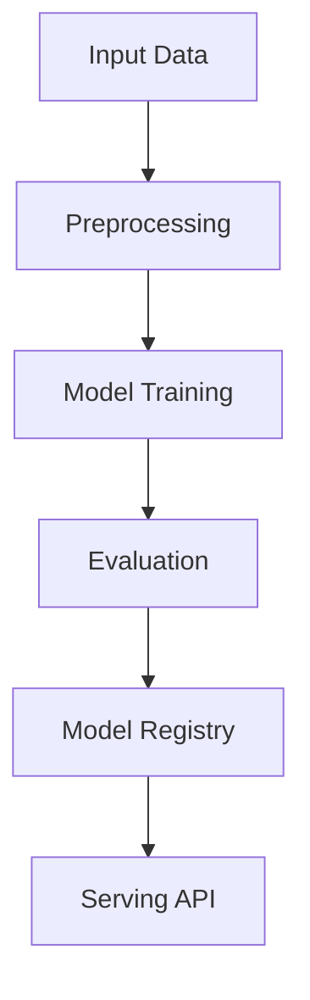

# speech-audio-recognition

## ∫ Mathematics & Theory

Recurrent Neural Network (RNN) — Underlying equations and derivations

$$h_t = \tanh(W_{hh}h_{t-1} + W_{xh}x_t + b_h)$$

$$\hat{y}_t = W_{hy}h_t + b_y$$

$$\mathcal{L} = \sum_{t=1}^{T} \mathcal{L}_t(y_t, \hat{y}_t)$$

$$\frac{\partial \mathcal{L}}{\partial W_{hh}} = \sum_{t=1}^{T} \delta_t h_{t-1}^T$$

### Step-by-Step Derivation

RNNs process sequences by maintaining a hidden state $h_t$ that summarizes past inputs. At each timestep, the hidden state is updated via $h_t = \tanh(W_{hh}h_{t-1} + W_{xh}x_t)$. Backpropagation Through Time (BPTT) unrolls the network and computes gradients across all timesteps. Vanishing gradients are mitigated by gated architectures like LSTM and GRU.

### Interactive Visualization

Interactive unfolded RNN diagram with gradient flow visualization; hidden state trajectory plot.

## ⚙ Architecture

Model structure, data flow, and layer breakdown

### Class Hierarchy

```
  SpeechRecognitionRNN
```

### Data Flow



## ⚡ API Reference

FastAPI endpoints and model interfaces

| Method | Endpoint |
| --- | --- |
| `GET` | `/` |
| `GET` | `/health` |
| `GET` | `/metrics` |
| `POST` | `/reload` |
| `GET` | `/drift` |

## ▶ Usage

Code examples and CLI commands

### Training Script

```python
"""Training pipeline for speech recognition (RNN)."""

import argparse
import os
from pathlib import Path

from ai_core.logging import get_logger, setup_logging
from ai_core.model_registry import ModelRegistry
from ai_core.validation import DataValidator, create_speech_recognition_schema

from speech_audio_recognition.data import (
    N_CLASSES,
    N_FEATURES,
    SEQ_LEN,
    load_training_data,
    save_training_data,
    train_test_split,
)
from speech_audio_recognition.model import SpeechRecognitionRNN

logger = get_logger(__name__)

def train(
    model_dir: Path,
    data_path: Path | None = None,
    n_samples: int = 500,
    n_features: int = N_FEATURES,
    seq_len: int = SEQ_LEN,
    n_classes: int = N_CLASSES,
    hidden_dim: int = 32,
    learning_rate: float = 0.05,
    n_iterations: int = 300,
    weight_decay: float = 0.001,
    clip_value: float = 5.0,
    model_version: str = "1.0.0",
    register_to_mlflow: bool = False,
    test_size: float = 0.2,
    random_seed: int = 42,
) -> dict:
    X, y = load_training_data(data_path, n_samples=n_samples, random_seed=random_seed)
    logger.info("Loaded training data", n_samples=len(X), data_path=str(data_path))

    validator = DataValidator(create_speech_recognition_schema())
    X_flat = X[:, 0, :].reshape(-1, N_FEATURES)
    validation = validator.validate(X_flat)
    if not validation.valid:
        logger.error("Training data validation failed", errors=validation.errors)
        raise ValueError(f"Training data validation failed: {validation.errors}")
    logger.info("Training data validated", stats=validation.stats)

    X_train, X_test, y_train, y_test = train_test_split(
        X, y, test_size=test_size, random_seed=random_seed
    )
    logger.info("Data split", n_train=len(X_train), n_test=len(X_test), test_size=test_size)

    model_dir.mkdir(parents=True, exist_ok=True)
    save_training_data(X, y, model_dir / "training_data.npz")

    model = SpeechRecognitionRNN(
        n_features=n_features,
        seq_len=seq_len,
        n_classes=n_classes,
        hidden_dim=hidden_dim,
        learning_rate=learning_rate,
        n_iterations=n_iterations,
        weight_decay=weight_decay,
        clip_value=clip_value,
        random_seed=random_seed,
    )
    model.fit(X_train, y_train, X_val=X_test, y_val=y_test)

    train_metrics = model.evaluate(X_train, y_train)
    test_metrics = model.evaluate(X_test, y_test)

    logger.info(
        "Training complete",
        training_mode=model.training_mode,
        n_epochs=len(model.loss_history),
        final_loss=model.loss_history[-1] if model.loss_history else 0.0,
        train_metrics=train_metrics,
        test_metrics=test_metrics,
    )

    model_path = model_dir / f"speech_recognition_model_v{model_version}.npz"
    model.save(str(model_path))

    _save_chart(model, model_dir, model_version)

    metrics = {
        **test_metrics,
        "training_mode": "supervised",
        "n_epochs_run": float(len(model.loss_history)),
        "final_loss": model.loss_history[-1] if model.loss_history else 0.0,
        "train_accuracy": train_metrics["accuracy"],
        "n_train_samples": float(len(X_train)),
        "n_test_samples": float(len(X_test)),
        "hidden_dim": float(hidden_dim),
        "learning_rate": float(learning_rate),
        "n_classes": float(n_classes),
    }

    registry = ModelRegistry(base_dir=model_dir)
    registry.save_model(
        model_name="speech-recognition",
        model_version=model_version,
        model_type="rnn_sequence_classification",
        metrics=metrics,
        parameters={
            "n_features": n_features,
            "seq_len": seq_len,
            "n_classes": n_classes,
            "hidden_dim": hidden_dim,
            "learning_rate": learning_rate,
            "n_iterations": n_iterations,
            "weight_decay": weight_decay,
            "random_seed": random_seed,
        },
        artifacts={
            f"speech_recognition_model_v{model_version}.npz": model_path,
            "training_data.npz": model_dir / "training_data.npz",
        },
        tags={"framework": "numpy", "task": "speech_recognition", "model_type": "simple_rnn"},
    )

    if register_to_mlflow:
        registry.log_to_mlflow(
            model_name="speech-recognition",
            model_version=model_version,
            metrics=metrics,
            params={
                "n_features": n_features,
                "n_classes": n_classes,
                "hidden_dim": hidden_dim,
                "learning_rate": learning_rate,
                "n_iterations": n_iterations,
                "weight_decay": weight_decay,
                "random_seed": random_seed,
            },
            artifacts={
                "model": str(model_path),
                "chart": str(model_dir / f"speech_v{model_version}.png"),
            },
            tags={"model_type": "speech_recognition", "framework": "numpy"},
        )
        logger.info("Registered model to MLflow", model="speech-recognition", version=model_version)

    return metrics

def _save_chart(model: SpeechRecognitionRNN, output_dir: Path, version: str) -> None:
    import matplotlib

    matplotlib.use("Agg")
    import matplotlib.pyplot as plt

    if not model.loss_history:
        return

    fig, ax = plt.subplots(figsize=(10, 5))
    ax.plot(model.loss_history, color="steelblue", linewidth=1.5)
    ax.set_xlabel("Training Epoch")
    ax.set_ylabel("Loss (Cross-Entropy)")
    ax.set_title("Speech Recognition RNN Training Loss")
    ax.grid(True, alpha=0.3)
    ax.set_yscale("log")

    plt.tight_layout()
    chart_path = output_dir / f"speech_v{version}.png"
    plt.savefig(str(chart_path), dpi=100)
    plt.close()
    logger.info("Chart saved", path=str(chart_path))

def main():
    parser = argparse.ArgumentParser(description="Train speech recognition RNN")
    parser.add_argument("--model-dir", type=Path, default=Path(os.getenv("MODEL_DIR", "/models")))
    parser.add_argument("--data-path", type=Path, default=None)
    parser.add_argument("--n-samples", type=int, default=int(os.getenv("N_SAMPLES", "500")))
    parser.add_argument(
        "--n-features", type=int, default=int(os.getenv("N_FEATURES", str(N_FEATURES)))
    )
    parser.add_argument("--seq-len", type=int, default=int(os.getenv("SEQ_LEN", str(SEQ_LEN))))
    parser.add_argument(
        "--n-classes", type=int, default=int(os.getenv("N_CLASSES", str(N_CLASSES)))
    )
    parser.add_argument("--hidden-dim", type=int, default=int(os.getenv("HIDDEN_DIM", "32")))
    parser.add_argument(
        "--learning-rate", type=float, default=float(os.getenv("LEARNING_RATE", "0.05"))
    )
    parser.add_argument("--n-iterations", type=int, default=int(os.getenv("N_ITERATIONS", "300")))
    parser.add_argument(
        "--weight-decay", type=float, default=float(os.getenv("WEIGHT_DECAY", "0.001"))
    )
    parser.add_argument("--model-version", type=str, default=os.getenv("MODEL_VERSION", "1.0.0"))
    parser.add_argument("--test-size", type=float, default=float(os.getenv("TEST_SIZE", "0.2")))
    parser.add_argument("--random-seed", type=int, default=int(os.getenv("RANDOM_SEED", "42")))
    parser.add_argument(
        "--register-mlflow",
        action="store_true",
        default=os.getenv("REGISTER_MLFLOW", "false").lower() == "true",
    )
    parser.add_argument("--log-level", type=str, default=os.getenv("LOG_LEVEL", "INFO"))
    args = parser.parse_args()

    setup_logging(args.log_level)
    args.model_dir.mkdir(parents=True, exist_ok=True)

    metrics = train(
        model_dir=args.model_dir,
        data_path=args.data_path,
        n_samples=args.n_samples,
        n_features=args.n_features,
        seq_len=args.seq_len,
        n_classes=args.n_classes,
        hidden_dim=args.hidden_dim,
        learning_rate=args.learning_rate,
        n_iterations=args.n_iterations,
        weight_decay=args.weight_decay,
        model_version=args.model_version,
        register_to_mlflow=args.register_mlflow,
        test_size=args.test_size,
        random_seed=args.random_seed,
    )

    logger.info("Training finished", metrics=metrics, model_dir=str(args.model_dir))

if __name__ == "__main__":
    main()
```

### API Server

```python
"""Serving API for speech recognition (RNN)."""

import os
import time
from contextlib import asynccontextmanager
from pathlib import Path

import numpy as np
from ai_core.drift import DriftDetector
from ai_core.fastapi_middleware import add_observability_middleware
from ai_core.logging import get_logger, setup_logging
from ai_core.metrics import MetricsCollector
from ai_core.model_registry import ModelRegistry
from ai_core.validation import DataValidator, create_speech_recognition_schema
from fastapi import FastAPI, HTTPException, Response
from pydantic import BaseModel, Field

from speech_audio_recognition.data import (
    N_CLASSES,
    N_FEATURES,
    SEQ_LEN,
    WORD_NAMES,
    generate_synthetic_data,
)
from speech_audio_recognition.model import SpeechRecognitionRNN

logger = get_logger(__name__)

MODEL_DIR = Path(os.getenv("MODEL_DIR", "/models"))
MODEL_VERSION = os.getenv("MODEL_VERSION", "latest")
METRICS_PORT = int(os.getenv("SPEECH_RECOGNITION_METRICS_PORT", "8015"))
DRIFT_THRESHOLD = float(os.getenv("DRIFT_THRESHOLD", "0.2"))

class PredictRequest(BaseModel):
    audio_features: list[list[float]] = Field(..., min_length=1, max_length=SEQ_LEN)

class PredictBulkRequest(BaseModel):
    requests: list[list[list[float]]] = Field(..., min_length=1, max_length=50)

class PredictResponse(BaseModel):
    word: str
    word_index: int
    confidence: float
    model_version: str
    training_mode: str

class BulkPredictResponse(BaseModel):
    predictions: list[PredictResponse]
    model_version: str

class StatsResponse(BaseModel):
    n_features: int
    seq_len: int
    n_classes: int
    hidden_dim: int
    training_mode: str
    n_epochs_run: int
    final_loss: float
    model_version: str

_model: SpeechRecognitionRNN | None = None
_model_version: str = "unknown"
_metrics: MetricsCollector | None = None
_validator: DataValidator | None = None
_drift_detector: DriftDetector | None = None
_reference_data: np.ndarray | None = None
_recent_predictions: list[list[float]] = []

@asynccontextmanager
async def lifespan(app: FastAPI):
    global _model, _model_version, _metrics, _validator, _drift_detector, _reference_data

    setup_logging(os.getenv("LOG_LEVEL", "INFO"))
    _metrics = MetricsCollector("speech_recognition", port=METRICS_PORT)
    app.state.metrics = _metrics

    _validator = DataValidator(create_speech_recognition_schema())
    _drift_detector = DriftDetector(
        feature_names=[f"frame_{i}" for i in range(N_FEATURES)],
        feature_types={f"frame_{i}": "float" for i in range(N_FEATURES)},
        psi_threshold=DRIFT_THRESHOLD,
    )

    _model, _model_version = _load_model()
    _metrics.set_model_version(_model_version)
    _metrics.set_model_info(
        model_name="speech-recognition",
        model_version=_model_version,
        model_type="rnn_sequence_classification",
    )

    _reference_data = _load_reference_data()
    logger.info("Model loaded", model="speech-recognition", version=_model_version)

    yield
    logger.info("Shutting down speech-recognition API")

def _load_model() -> tuple[SpeechRecognitionRNN, str]:
    registry = ModelRegistry(base_dir=MODEL_DIR)
    try:
        if MODEL_VERSION == "latest":
            models = registry.list_models()
            sr_models = [m for m in models if m.get("model_name") == "speech-recognition"]
            if sr_models:
                sr_models.sort(key=lambda m: m["model_version"], reverse=True)
                latest = sr_models[0]
                model_dir = Path(latest["artifact_path"])
                npz_files = list(model_dir.glob("speech_recognition_model_*.npz")) + list(
                    model_dir.glob("*.npz")
                )
                if npz_files:
                    return SpeechRecognitionRNN.load(str(npz_files[0])), latest["model_version"]
        else:
            model_dir = MODEL_DIR / "speech-recognition" / MODEL_VERSION
            if model_dir.exists():
                npz_files = list(model_dir.glob("speech_recognition_model_*.npz")) + list(
                    model_dir.glob("*.npz")
                )
                if npz_files:
                    return SpeechRecognitionRNN.load(str(npz_files[0])), MODEL_VERSION
    except Exception as e:
        logger.warning(f"Registry lookup failed: {e}")

    npz_path = MODEL_DIR / "speech_recognition_model.npz"
    if npz_path.exists():
        return SpeechRecognitionRNN.load(str(npz_path)), "legacy"

    candidate_paths = [
        Path("/app/artifacts/models/speech_recognition_model_v1.0.0.npz"),
        Path(__file__).resolve().parents[3]
        / "artifacts"
        / "models"
        / "speech_recognition_model_v1.0.0.npz",
    ]
    for p in candidate_paths:
        if p.exists():
            logger.info("Loading bundled baseline model", path=str(p))
            return SpeechRecognitionRNN.load(str(p)), "1.0.0-bundled"

    logger.warning("No pre-existing model found. Initializing baseline RNN model.")
    X_base, y_base = generate_synthetic_data(n_samples=100, random_seed=42)
    model = SpeechRecognitionRNN(
        n_features=N_FEATURES,
        seq_len=SEQ_LEN,
        n_classes=N_CLASSES,
        hidden_dim=32,
        learning_rate=0.05,
        n_iterations=100,
        random_seed=42,
    )
    model.fit(X_base, y_base)
    return model, "1.0.0-baseline"

def _load_reference_data() -> np.ndarray | None:
    X_base, _ = generate_synthetic_data(n_samples=100, random_seed=42)
    # Flatten for drift detection (first timestep features)
    return X_base[:, 0, :].reshape(-1, 1) if X_base.ndim == 3 else X_base

app = FastAPI(
    title="Speech Recognition API",
    description="RNN for speech-to-text feature sequence classification",
    version="1.0.0",
    lifespan=lifespan,
)

add_observability_middleware(app)

@app.get("/")
def read_root():
    return {
        "service": "speech-recognition-api",
        "version": "1.0.0",
        "model_version": _model_version,
        "training_mode": _model.training_mode if _model else "unknown",
        "n_features": N_FEATURES,
        "seq_len": SEQ_LEN,
        "n_classes": N_CLASSES,
        "endpoints": {
            "health": "/health",
            "predict": "POST /predict",
            "predict/bulk": "POST /predict/bulk",
            "stats": "GET /stats",
            "drift": "GET /drift",
            "metrics": "/metrics",
        },
    }

@app.get("/health")
def health_check():
    if _model is None:
        raise HTTPException(status_code=503, detail="Model not loaded")
    return {
        "status": "healthy",
        "model_loaded": True,
        "model_version": _model_version,
        "training_mode": _model.training_mode if _model else "unknown",
    }

@app.get("/metrics")
def metrics():
    from prometheus_client import CONTENT_TYPE_LATEST, generate_latest

    return Response(content=generate_latest(), media_type=CONTENT_TYPE_LATEST)

@app.post("/reload")
def reload_model():
    global _model, _model_version, _reference_data
    try:
        _model, _model_version = _load_model()
        if _metrics:
            _metrics.set_model_version(_model_version)
            _metrics.set_model_info(
                model_name="speech-recognition",
                model_version=_model_version,
                model_type="rnn_sequence_classification",
            )
        _reference_data = _load_reference_data()
        logger.info(
            "Model reloaded dynamically", model="speech-recognition", version=_model_version
        )
        return {"status": "reloaded", "model_version": _model_version}
    except Exception as e:
        logger.exception("Model reload failed", error=str(e))
        raise HTTPException(status_code=500, detail=f"Reload failed: {e}") from e

@app.get("/drift")
def drift_check():
    if _drift_detector is None or _reference_data is None:
        raise HTTPException(status_code=503, detail="Drift detection not available")
    if len(_recent_predictions) < 10:
        return {
            "total_features": N_FEATURES,
            "drifted_features": 0,
            "drift_ratio": 0.0,
            "drifted": [],
            "all_results": [],
        }
    current = np.array(_recent_predictions[-100:])
    results = _drift_detector.detect_drift(_reference_data[:, :N_FEATURES], current[:, :N_FEATURES])
    summary = _drift_detector.summarize(results)
    if _metrics:
        _metrics.set_drift_ratio(summary["drift_ratio"])
    return summary

@app.get("/stats", response_model=StatsResponse)
def get_stats():
    if _model is None or _model.model is None:
        raise HTTPException(status_code=503, detail="Model not loaded")
    return StatsResponse(
        n_features=N_FEATURES,
        seq_len=SEQ_LEN,
        n_classes=N_CLASSES,
        hidden_dim=_model.hidden_dim,
        training_mode=_model.training_mode,
        n_epochs_run=len(_model.loss_history),
        final_loss=_model.loss_history[-1] if _model.loss_history else 0.0,
        model_version=_model_version,
    )

def _compute_prediction(audio_features: list[list[float]]) -> PredictResponse:
    if _model is None or _metrics is None or _validator is None:
        raise HTTPException(status_code=503, detail="Model not loaded")

    X = np.array([audio_features])

    # Validate each frame
    for frame in audio_features:
        X_flat = np.array([frame])
        validation = _validator.validate(X_flat)
        if not validation.valid:
            raise HTTPException(status_code=422, detail=validation.errors)

    start = time.time()
    try:
        word_idx = int(_model.predict(X)[0])
        probas = _model.predict_proba(X)[0]
        confidence = float(np.max(probas))
        duration = time.time() - start
        _metrics.record_prediction(model_version=_model_version, duration=duration)

        flat = [v for frame in audio_features for v in frame]
        _recent_predictions.append(flat)
        if len(_recent_predictions) > 1000:
            _recent_predictions.pop(0)

        return PredictResponse(
            word=WORD_NAMES[word_idx] if word_idx < len(WORD_NAMES) else f"word_{word_idx}",
            word_index=word_idx,
            confidence=round(confidence, 4),
            model_version=_model_version,
            training_mode=_model.training_mode,
        )
    except Exception as e:
        _metrics.record_error(model_version=_model_version, error_type="prediction")
        logger.exception("Prediction failed", error=str(e))
        raise HTTPException(status_code=500, detail="Prediction failed") from e

@app.post("/predict", response_model=PredictResponse)
def predict(body: PredictRequest):
    return _compute_prediction(body.audio_features)

@app.post("/predict/bulk", response_model=BulkPredictResponse)
def predict_bulk(body: PredictBulkRequest):
    global _recent_predictions
    if _model is None or _metrics is None or _validator is None:
        raise HTTPException(status_code=503, detail="Model not loaded")
    if len(body.requests) < 1 or len(body.requests) > 50:
        raise HTTPException(status_code=422, detail="Batch size must be between 1 and 50")

    predictions = []
    for audio_features in body.requests:
        predictions.append(_compute_prediction(audio_features))

    return BulkPredictResponse(predictions=predictions, model_version=_model_version)
```

### CLI Commands

```bash
uv run python -m speech_audio_recognition.train --model-dir ./artifacts/models
```

## 📊 Benchmarks

Test results and performance metrics

Run `pytest tests/test_models.py` and `pytest tests/test_apis.py` for detailed metrics.

### Related Apps

- [capsnet-text-recognition](../capsnet-text-recognition/README.md)

- [cnn-facial-recognition](../cnn-facial-recognition/README.md)

- [pattern-recognition-digits](../pattern-recognition-digits/README.md)

- [speech-audio-music](../speech-audio-music/README.md)

Generated documentation for **speech-audio-recognition**
