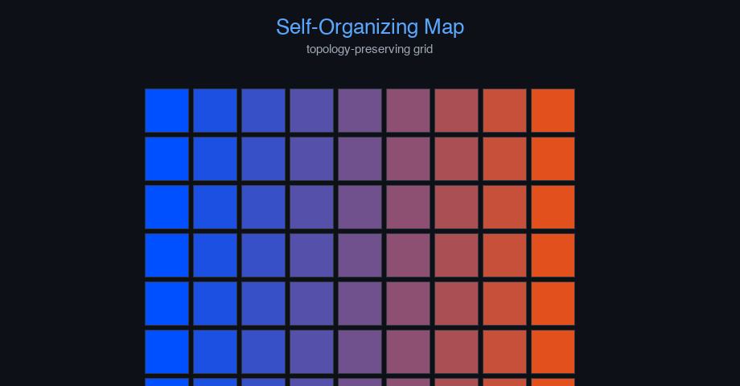

# self-organizing-maps


Machine Learning Fundamentals — AI engineering example · part of the MLOps monorepo

## 1. Mathematical Foundations

This example is grounded in **Machine Learning Fundamentals**. The equations below
drive every forward and backward pass in the implementation.

$$\hat{y} = f(x; \theta)$$

$$\mathcal{L}(\theta) = \frac{1}{n} \sum_{i=1}^{n} \ell(y_i, \hat{y}_i)$$

$$\theta \leftarrow \theta - \alpha \nabla_\theta \mathcal{L}(\theta)$$

### Derivation

Machine learning models learn parameters $\theta$ by minimizing a loss function $\mathcal{L}$. Gradient descent iteratively updates parameters in the direction of steepest descent. The learning rate $\alpha$ controls step size. Stochastic gradient descent (SGD) uses mini-batches for computational efficiency.

### Worked Numerical Example

$$z = w \cdot x + b$$

Illustrative forward-pass evaluation (scalar example):

Input  x        = 12.0   (e.g. pizza diameter, inches)
Weights w       =  0.85
Bias    b       =  0.30
---------------------------------
z = w*x + b
  = 0.85 * 12.0 + 0.30
  = 10.20 + 0.30
  = 10.50   <- model output

### Conceptual Diagram

        Math concept (placeholder)
   [ Input x ] --> ( w · x + b ) --> [ Output z ]
                       |
                  [ activation ]
                       |
                  [ prediction ]



Interactive loss landscape explorer; gradient descent trajectory; learning rate scheduler.

## 2. Core Logic & Architecture

The example follows a consistent **data → train → evaluate → serve**
pipeline. Inputs are loaded and validated, transformed by the core algorithm, scored against
held-out data, and exposed through a REST API.

  Raw dataset→
  load + validate (data.py)→
  fit / transform (model.py)→
  evaluate + persist (train.py)→
  serve (api.py)

### Primary Components

| Class | Public methods | Responsibility |
| --- | --- | --- |
| `PredictRequest` | — |  |
| `PredictBulkRequest` | — |  |
| `PredictResponse` | — |  |
| `BulkPredictResponse` | — |  |
| `DriftResponse` | — |  |
| `StatsResponse` | — |  |
| `SelfOrganizingMap` | n_neurons, _init_weights, _find_bmu, _neighborhood, fit, predict_proba, predict, transform, evaluate, save, load, to_dict | Self-Organizing Map for unsupervised clustering and visualization.  Produces a low-dimensional (2D grid) discretized representation of the input space.  Args:     n_features: Number of input features     grid_height: Height of the 2D neuron grid     grid_width: Width of the 2D neuron grid     learning_rate: Initial learning rate     n_iterations: Number of training iterations     sigma: Initial neighborhood radius     random_seed: Random seed |

### Data Flow


1. **Load** — `data.py` reads the source dataset and splits train/test.


2. **Validate** — a Pydantic schema guards input shape/dtypes before training.


3. **Fit / Transform** — `model.py` applies the mathematics from Section 1.


4. **Evaluate** — metrics (MSE/RMSE/R², accuracy, etc.) are computed and logged.


5. **Persist** — weights/artifacts are saved and registered in the model registry.


6. **Serve** — `api.py` exposes prediction endpoints with drift detection.

### Design Patterns & Performance

Key design choices in this module: a pure-NumPy implementation (no PyTorch/TensorFlow), schema validation via `ai_core.validation`, structured JSON logging through `ai_core.logging`, Prometheus metrics from `ai_core.metrics`, and MLflow/model-registry persistence via `ai_core.model_registry`. The FastAPI service wraps the trained model with observability middleware from `ai_core.fastapi_middleware`.

## 3. Detailed Code Walkthrough

The most important behaviour is summarised below; full source for each module is collapsible
so the page stays readable while remaining self-contained.

### `SelfOrganizingMap.fit(X, n_iterations)`

Train the SOM on input data using batch learning.

Args:
    X: Input data (n_samples, n_features)

### `SelfOrganizingMap.predict(X)`

Return BMU coordinates (row, col) for each input sample.

### Source Files

<details>
<summary>model.py</summary>

```
"""Self-Organizing Map for unsupervised clustering.

Architecture:
    Input (n_features,) -> Competitive layer (grid_height x grid_width neurons)
    Each neuron has a weight vector of dimension n_features.

    Training: For each input, find Best Matching Unit (BMU) and update
    weights of BMU and its neighbors (Gaussian neighborhood function).

Loss: Average quantization error (distance to BMU)
"""

from dataclasses import dataclass, field

import numpy as np

@dataclass
class SelfOrganizingMap:
    """Self-Organizing Map for unsupervised clustering and visualization.

    Produces a low-dimensional (2D grid) discretized representation of the input space.

    Args:
        n_features: Number of input features
        grid_height: Height of the 2D neuron grid
        grid_width: Width of the 2D neuron grid
        learning_rate: Initial learning rate
        n_iterations: Number of training iterations
        sigma: Initial neighborhood radius
        random_seed: Random seed
    """

    n_features: int = 32
    grid_height: int = 5
    grid_width: int = 5
    learning_rate: float = 0.5
    n_iterations: int = 300
    sigma: float = 2.0
    random_seed: int = 42

    weights: np.ndarray | None = None
    loss_history: list[float] = field(default_factory=list)
    training_mode: str = "unsupervised"

    @property
    def n_neurons(self) -> int:
        return self.grid_height * self.grid_width

    def _init_weights(self, X: np.ndarray, rng: np.random.Generator) -> None:
        """Initialize weights by sampling from the data distribution."""
        n = self.n_neurons
        indices = rng.choice(len(X), size=min(n, len(X)), replace=len(X) < n)
        self.weights = X[indices].copy()
        if len(self.weights) < n:
            extra = X[rng.choice(len(X), n - len(self.weights))]
            self.weights = np.vstack([self.weights, extra])

    def _find_bmu(self, x: np.ndarray) -> tuple[int, int]:
        """Find Best Matching Unit (neuron closest to input)."""
        distances = np.sqrt(np.sum((self.weights - x) ** 2, axis=1))
        bmu_idx = np.argmin(distances)
        row = bmu_idx // self.grid_width
        col = bmu_idx % self.grid_width
        return int(row), int(col)

    def _neighborhood(self, bmu_row: int, bmu_col: int, sigma: float) -> np.ndarray:
        """Compute Gaussian neighborhood function for all neurons."""
        neighborhood = np.zeros((self.grid_height, self.grid_width))
        for r in range(self.grid_height):
            for c in range(self.grid_width):
                dist = np.sqrt((r - bmu_row) ** 2 + (c - bmu_col) ** 2)
                neighborhood[r, c] = np.exp(-dist ** 2 / (2 * sigma ** 2 + 1e-8))
        return neighborhood.flatten()

    def fit(
        self,
        X: np.ndarray,
        n_iterations: int | None = None,
    ) -> "SelfOrganizingMap":
        """Train the SOM on input data using batch learning.

        Args:
            X: Input data (n_samples, n_features)
        """
        if self.weights is None:
            rng = np.random.default_rng(self.random_seed)
            self._init_weights(X, rng)

        if n_iterations is None:
            n_iterations = self.n_iterations

        rng = np.random.default_rng(self.random_seed)
        n_samples = X.shape[0]

        for iteration in range(n_iterations):
            t = iteration / n_iterations
            lr = self.learning_rate * (1 - t)
            sigma = self.sigma * (1 - t)

            epoch_loss = 0.0
            for _i in range(n_samples):
                x = X[rng.integers(0, n_samples)]
                bmu_row, bmu_col = self._find_bmu(x)
                bmu_idx = bmu_row * self.grid_width + bmu_col

                neighborhood = self._neighborhood(bmu_row, bmu_col, sigma)

                for n in range(self.n_neurons):
                    delta = lr * neighborhood[n] * (x - self.weights[n])
                    self.weights[n] += delta

                epoch_loss += np.sum((x - self.weights[bmu_idx]) ** 2)

            self.loss_history.append(epoch_loss / n_samples)

        return self

    def predict_proba(self, X: np.ndarray) -> np.ndarray:
        """Return quantization error (distance to BMU) for each sample."""
        errors = []
        for x in X:
            _, bmu_idx = self._find_bmu(x)
            errors.append(np.sqrt(np.sum((x - self.weights[bmu_idx]) ** 2)))
        return np.array(errors)

    def predict(self, X: np.ndarray) -> np.ndarray:
        """Return BMU coordinates (row, col) for each input sample."""
        results = []
        for x in X:
            bmu_row, bmu_col = self._find_bmu(x)
            results.append((bmu_row, bmu_col))
        return np.array(results)

    def transform(self, X: np.ndarray) -> np.ndarray:
        """Return BMU neuron indices for each input sample."""
        indices = []
        for x in X:
            bmu_row, bmu_col = self._find_bmu(x)
            indices.append(bmu_row * self.grid_width + bmu_col)
        return np.array(indices)

    def evaluate(self, X: np.ndarray) -> dict[str, float]:
        errors = self.predict_proba(X)
        return {
            "quantization_error": float(np.mean(errors)),
            "n_samples": float(len(X)),
            "unique_neurons_used": float(len(set(self.transform(X).tolist()))),
            "grid_size": float(self.n_neurons),
        }

    def save(self, path: str) -> None:
        arrays = {
            "loss_history": np.array(self.loss_history),
            "weights": self.weights,
            "n_features": np.array([self.n_features]),
            "grid_height": np.array([self.grid_height]),
            "grid_width": np.array([self.grid_width]),
            "learning_rate": np.array([self.learning_rate]),
            "n_iterations": np.array([self.n_iterations]),
            "sigma": np.array([self.sigma]),
            "random_seed": np.array([self.random_seed]),
        }
        np.savez(path, **arrays)

    @classmethod
    def load(cls, path: str) -> "SelfOrganizingMap":
        data = np.load(path)
        obj = cls(
            n_features=int(data["n_features"].item()),
            grid_height=int(data["grid_height"].item()),
            grid_width=int(data["grid_width"].item()),
            learning_rate=float(data["learning_rate"].item()),
            n_iterations=int(data["n_iterations"].item()),
            sigma=float(data["sigma"].item()),
            random_seed=int(data["random_seed"].item()),
        )
        obj.weights = data["weights"]
        obj.loss_history = list(data.get("loss_history", [0.0]))
        return obj

    def to_dict(self) -> dict:
        return {
            "n_features": self.n_features,
            "grid_height": self.grid_height,
            "grid_width": self.grid_width,
            "n_neurons": self.n_neurons,
            "learning_rate": self.learning_rate,
            "n_iterations": self.n_iterations,
            "sigma": self.sigma,
            "training_mode": self.training_mode,
            "n_epochs_run": len(self.loss_history),
            "final_loss": self.loss_history[-1] if self.loss_history else 0.0,
        }
```

</details>

<details>
<summary>train.py</summary>

```
"""Training pipeline for Self-Organizing Maps."""

import argparse
import os
from pathlib import Path

from ai_core.logging import get_logger, setup_logging
from ai_core.model_registry import ModelRegistry
from ai_core.validation import DataValidator, create_self_organizing_maps_schema

from self_organizing_maps.data import (
    GRID_HEIGHT,
    GRID_WIDTH,
    N_FEATURES,
    load_training_data,
    save_training_data,
    train_test_split,
)
from self_organizing_maps.model import SelfOrganizingMap

logger = get_logger(__name__)

def train(
    model_dir: Path,
    data_path: Path | None = None,
    n_samples: int = 500,
    grid_height: int = GRID_HEIGHT,
    grid_width: int = GRID_WIDTH,
    learning_rate: float = 0.5,
    n_iterations: int = 300,
    sigma: float = 2.0,
    model_version: str = "1.0.0",
    register_to_mlflow: bool = False,
    test_size: float = 0.2,
    random_seed: int = 42,
) -> dict:
    X, y = load_training_data(data_path, n_samples=n_samples, random_seed=random_seed)
    logger.info("Loaded training data", n_samples=len(X), data_path=str(data_path))

    validator = DataValidator(create_self_organizing_maps_schema())
    validation = validator.validate(X.reshape(-1, 1))
    if not validation.valid:
        logger.error("Training data validation failed", errors=validation.errors)
        raise ValueError(f"Training data validation failed: {validation.errors}")

    X_train, X_test, _, _ = train_test_split(X, y, test_size=test_size, random_seed=random_seed)
    logger.info("Data split", n_train=len(X_train), n_test=len(X_test))

    model_dir.mkdir(parents=True, exist_ok=True)
    save_training_data(X, y, model_dir / "training_data.npz")

    model = SelfOrganizingMap(
        n_features=N_FEATURES,
        grid_height=grid_height,
        grid_width=grid_width,
        learning_rate=learning_rate,
        n_iterations=n_iterations,
        sigma=sigma,
        random_seed=random_seed,
    )
    model.fit(X_train)

    test_metrics = model.evaluate(X_test)
    logger.info("Training complete", training_mode=model.training_mode, final_loss=model.loss_history[-1])

    model_path = model_dir / f"som_model_v{model_version}.npz"
    model.save(str(model_path))

    metrics = {
        **test_metrics,
        "training_mode": "unsupervised",
        "n_epochs_run": float(len(model.loss_history)),
        "final_loss": model.loss_history[-1] if model.loss_history else 0.0,
        "n_train_samples": float(len(X_train)),
        "n_test_samples": float(len(X_test)),
    }

    registry = ModelRegistry(base_dir=model_dir)
    registry.save_model(
        model_name="self-organizing-maps",
        model_version=model_version,
        model_type="clustering",
        metrics=metrics,
        parameters={
            "n_features": N_FEATURES,
            "grid_height": grid_height,
            "grid_width": grid_width,
            "learning_rate": learning_rate,
            "n_iterations": n_iterations,
            "sigma": sigma,
            "random_seed": random_seed,
        },
        artifacts={
            f"som_model_v{model_version}.npz": model_path,
            "training_data.npz": model_dir / "training_data.npz",
        },
        tags={"framework": "numpy", "task": "self_organizing_maps", "model_type": "SOM"},
    )

    if register_to_mlflow:
        registry.log_to_mlflow(
            model_name="self-organizing-maps",
            model_version=model_version,
            metrics=metrics,
            params={"n_features": N_FEATURES, "grid_height": grid_height, "grid_width": grid_width, "learning_rate": learning_rate, "n_iterations": n_iterations},
            artifacts={"model": str(model_path)},
            tags={"model_type": "som", "framework": "numpy"},
        )

    return metrics

def main():
    parser = argparse.ArgumentParser(description="Train Self-Organizing Maps model")
    parser.add_argument("--model-dir", type=Path, default=Path(os.getenv("MODEL_DIR", "/models")))
    parser.add_argument("--data-path", type=Path, default=None)
    parser.add_argument("--n-samples", type=int, default=int(os.getenv("N_SAMPLES", "500")))
    parser.add_argument("--grid-height", type=int, default=int(os.getenv("GRID_HEIGHT", "5")))
    parser.add_argument("--grid-width", type=int, default=int(os.getenv("GRID_WIDTH", "5")))
    parser.add_argument("--learning-rate", type=float, default=float(os.getenv("LEARNING_RATE", "0.5")))
    parser.add_argument("--n-iterations", type=int, default=int(os.getenv("N_ITERATIONS", "300")))
    parser.add_argument("--sigma", type=float, default=float(os.getenv("SIGMA", "2.0")))
    parser.add_argument("--model-version", type=str, default=os.getenv("MODEL_VERSION", "1.0.0"))
    parser.add_argument("--test-size", type=float, default=float(os.getenv("TEST_SIZE", "0.2")))
    parser.add_argument("--random-seed", type=int, default=int(os.getenv("RANDOM_SEED", "42")))
    parser.add_argument("--register-mlflow", action="store_true", default=os.getenv("REGISTER_MLFLOW", "false").lower() == "true")
    parser.add_argument("--log-level", type=str, default=os.getenv("LOG_LEVEL", "INFO"))
    args = parser.parse_args()

    setup_logging(args.log_level)
    args.model_dir.mkdir(parents=True, exist_ok=True)

    metrics = train(
        model_dir=args.model_dir,
        data_path=args.data_path,
        n_samples=args.n_samples,
        grid_height=args.grid_height,
        grid_width=args.grid_width,
        learning_rate=args.learning_rate,
        n_iterations=args.n_iterations,
        sigma=args.sigma,
        model_version=args.model_version,
        register_to_mlflow=args.register_mlflow,
        test_size=args.test_size,
        random_seed=args.random_seed,
    )
    logger.info("Training finished", metrics=metrics, model_dir=str(args.model_dir))

if __name__ == "__main__":
    main()
```

</details>

<details>
<summary>data.py</summary>

```
"""Data loading and preprocessing for Self-Organizing Maps."""

from pathlib import Path

import numpy as np

N_FEATURES = 32
GRID_HEIGHT = 5
GRID_WIDTH = 5

DEFAULT_N_SAMPLES = 500

def generate_synthetic_data(
    n_samples: int = DEFAULT_N_SAMPLES,
    noise_level: float = 0.1,
    random_seed: int = 42,
) -> tuple[np.ndarray, np.ndarray]:
    """Generate synthetic feature data for SOM training.

    Returns:
        X: (n_samples, N_FEATURES) feature vectors in [0, 1]
        y: (n_samples,) cluster labels (for evaluation only)
    """
    rng = np.random.default_rng(random_seed)
    X = np.zeros((n_samples, N_FEATURES), dtype=float)
    y = np.zeros(n_samples, dtype=int)

    n_per_cluster = n_samples // 5
    cluster_centers = np.array([
        np.full(N_FEATURES, 0.2),
        np.full(N_FEATURES, 0.4),
        np.full(N_FEATURES, 0.6),
        np.full(N_FEATURES, 0.8),
        np.zeros(N_FEATURES),
    ])
    cluster_centers[4, :N_FEATURES // 2] = 0.8
    cluster_centers[4, N_FEATURES // 2:] = 0.2

    for cluster_idx in range(5):
        start = cluster_idx * n_per_cluster
        end = start + n_per_cluster
        for i in range(start, min(end, n_samples)):
            X[i] = cluster_centers[cluster_idx] + rng.normal(0, noise_level, N_FEATURES)
            y[i] = cluster_idx

    X = np.clip(X, 0, 1)
    perm = rng.permutation(n_samples)
    return X[perm], y[perm]

def load_training_data(
    data_path: Path | None = None,
    n_samples: int = DEFAULT_N_SAMPLES,
    noise_level: float = 0.1,
    random_seed: int = 42,
) -> tuple[np.ndarray, np.ndarray]:
    if data_path and Path(data_path).exists():
        data = np.load(data_path, allow_pickle=True)
        return data["X"], data["y"]
    return generate_synthetic_data(n_samples=n_samples, noise_level=noise_level, random_seed=random_seed)

def train_test_split(
    X: np.ndarray, y: np.ndarray, test_size: float = 0.2, random_seed: int | None = None
) -> tuple[np.ndarray, np.ndarray, np.ndarray, np.ndarray]:
    n = len(X)
    n_test = max(1, int(n * test_size))
    if random_seed is not None:
        rng = np.random.default_rng(random_seed)
        indices = rng.permutation(n)
    else:
        indices = np.random.permutation(n)
    test_idx = indices[:n_test]
    train_idx = indices[n_test:]
    return X[train_idx], X[test_idx], y[train_idx], y[test_idx]

def save_training_data(X: np.ndarray, y: np.ndarray, path: Path) -> None:
    path = Path(path)
    path.parent.mkdir(parents=True, exist_ok=True)
    np.savez(path, X=X, y=y)
```

</details>

<details>
<summary>api.py</summary>

```
"""Serving API for Self-Organizing Maps."""

import os
import time
from contextlib import asynccontextmanager
from pathlib import Path

import numpy as np
from ai_core.drift import DriftDetector
from ai_core.fastapi_middleware import add_observability_middleware
from ai_core.logging import get_logger, setup_logging
from ai_core.metrics import MetricsCollector
from ai_core.model_registry import ModelRegistry
from ai_core.validation import DataValidator, create_self_organizing_maps_schema
from fastapi import FastAPI, HTTPException, Response
from pydantic import BaseModel, Field

from self_organizing_maps.data import N_FEATURES, generate_synthetic_data
from self_organizing_maps.model import SelfOrganizingMap

logger = get_logger(__name__)

MODEL_DIR = Path(os.getenv("MODEL_DIR", "/models"))
MODEL_VERSION = os.getenv("MODEL_VERSION", "latest")
METRICS_PORT = int(os.getenv("SOM_METRICS_PORT", "8028"))
DRIFT_THRESHOLD = float(os.getenv("DRIFT_THRESHOLD", "0.2"))

class PredictRequest(BaseModel):
    features: list[float] = Field(..., min_length=N_FEATURES, max_length=N_FEATURES)

class PredictBulkRequest(BaseModel):
    requests: list[list[float]] = Field(..., min_length=1, max_length=50)

class PredictResponse(BaseModel):
    bmu_row: int
    bmu_col: int
    quantization_error: float
    model_version: str
    training_mode: str

class BulkPredictResponse(BaseModel):
    predictions: list[PredictResponse]
    model_version: str

class DriftResponse(BaseModel):
    total_features: int
    drifted_features: int
    drift_ratio: float
    drifted: list[dict]
    all_results: list[dict]

class StatsResponse(BaseModel):
    n_features: int
    grid_height: int
    grid_width: int
    n_neurons: int
    training_mode: str
    n_epochs_run: int
    final_loss: float
    model_version: str

_model: SelfOrganizingMap | None = None
_model_version: str = "unknown"
_metrics: MetricsCollector | None = None
_validator: DataValidator | None = None
_drift_detector: DriftDetector | None = None
_reference_data: np.ndarray | None = None
_recent_predictions: list[list[float]] = []

@asynccontextmanager
async def lifespan(app: FastAPI):
    global _model, _model_version, _metrics, _validator, _drift_detector, _reference_data

    setup_logging(os.getenv("LOG_LEVEL", "INFO"))
    _metrics = MetricsCollector("self_organizing_maps", port=METRICS_PORT)
    app.state.metrics = _metrics

    _validator = DataValidator(create_self_organizing_maps_schema())
    feature_names = [f"feature_{i}" for i in range(N_FEATURES)]
    _drift_detector = DriftDetector(
        feature_names=feature_names,
        feature_types={f: "float" for f in feature_names},
        psi_threshold=DRIFT_THRESHOLD,
    )

    _model, _model_version = _load_model()
    _metrics.set_model_version(_model_version)
    _metrics.set_model_info(
        model_name="self-organizing-maps",
        model_version=_model_version,
        model_type="clustering",
    )

    _reference_data = _load_reference_data()
    logger.info("Model loaded", model="self-organizing-maps", version=_model_version)

    yield
    logger.info("Shutting down self-organizing-maps API")

def _load_model() -> tuple[SelfOrganizingMap, str]:
    registry = ModelRegistry(base_dir=MODEL_DIR)
    try:
        if MODEL_VERSION == "latest":
            models = registry.list_models()
            nn_models = [m for m in models if m.get("model_name") == "self-organizing-maps"]
            if nn_models:
                nn_models.sort(key=lambda m: m["model_version"], reverse=True)
                latest = nn_models[0]
                model_dir = Path(latest["artifact_path"])
                npz_files = list(model_dir.glob("som_model_*.npz")) + list(model_dir.glob("*.npz"))
                if npz_files:
                    return SelfOrganizingMap.load(str(npz_files[0])), latest["model_version"]
        else:
            model_dir = MODEL_DIR / "self-organizing-maps" / MODEL_VERSION
            if model_dir.exists():
                npz_files = list(model_dir.glob("som_model_*.npz")) + list(model_dir.glob("*.npz"))
                if npz_files:
                    return SelfOrganizingMap.load(str(npz_files[0])), MODEL_VERSION
    except Exception as e:
        logger.warning(f"Registry lookup failed: {e}")

    npz_path = MODEL_DIR / "som_model.npz"
    if npz_path.exists():
        return SelfOrganizingMap.load(str(npz_path)), "legacy"

    candidate_paths = [
        Path("/app/artifacts/models/som_model_v1.0.0.npz"),
        Path(__file__).resolve().parents[3] / "artifacts" / "models" / "som_model_v1.0.0.npz",
    ]
    for p in candidate_paths:
        if p.exists():
            logger.info("Loading bundled baseline model", path=str(p))
            return SelfOrganizingMap.load(str(p)), "1.0.0-bundled"

    logger.warning("No pre-existing model found. Initializing baseline model.")
    X_base, _ = generate_synthetic_data(n_samples=100, random_seed=42)
    model = SelfOrganizingMap(
        n_features=N_FEATURES,
        grid_height=5,
        grid_width=5,
        learning_rate=0.5,
        n_iterations=100,
        random_seed=42,
    )
    model.fit(X_base)
    return model, "1.0.0-baseline"

def _load_reference_data() -> np.ndarray | None:
    X_base, _ = generate_synthetic_data(n_samples=100, random_seed=42)
    return X_base

app = FastAPI(
    title="Self-Organizing Maps API",
    description="Unsupervised networks that produce a low-dimensional discretized representation of the input space",
    version="1.0.0",
    lifespan=lifespan,
)

add_observability_middleware(app)

@app.get("/")
def read_root():
    return {
        "service": "self_organizing_maps-api",
        "version": "1.0.0",
        "model_version": _model_version,
        "training_mode": _model.training_mode if _model else "unknown",
        "n_features": N_FEATURES,
        "endpoints": {
            "health": "/health",
            "predict": "POST /predict",
            "predict/bulk": "POST /predict/bulk",
            "stats": "GET /stats",
            "drift": "GET /drift",
            "metrics": "/metrics",
        },
    }

@app.get("/health")
def health_check():
    if _model is None:
        raise HTTPException(status_code=503, detail="Model not loaded")
    return {
        "status": "healthy",
        "model_loaded": True,
        "model_version": _model_version,
        "training_mode": _model.training_mode if _model else "unknown",
    }

@app.get("/metrics")
def metrics():
    from prometheus_client import CONTENT_TYPE_LATEST, generate_latest
    return Response(content=generate_latest(), media_type=CONTENT_TYPE_LATEST)

@app.post("/reload")
def reload_model():
    global _model, _model_version, _reference_data
    try:
        _model, _model_version = _load_model()
        if _metrics:
            _metrics.set_model_version(_model_version)
            _metrics.set_model_info(
                model_name="self-organizing-maps",
                model_version=_model_version,
                model_type="clustering",
            )
        _reference_data = _load_reference_data()
        logger.info("Model reloaded dynamically", model="self-organizing-maps", version=_model_version)
        return {"status": "reloaded", "model_version": _model_version}
    except Exception as e:
        logger.exception("Model reload failed", error=str(e))
        raise HTTPException(status_code=500, detail=f"Reload failed: {e}") from e

@app.get("/drift", response_model=DriftResponse)
def drift_check():
    if _drift_detector is None or _reference_data is None:
        raise HTTPException(status_code=503, detail="Drift detection not available")
    if len(_recent_predictions) < 10:
        return {"total_features": N_FEATURES, "drifted_features": 0, "drift_ratio": 0.0, "drifted": [], "all_results": []}
    current = np.array(_recent_predictions[-100:])
    results = _drift_detector.detect_drift(_reference_data, current)
    summary = _drift_detector.summarize(results)
    if _metrics:
        _metrics.set_drift_ratio(summary["drift_ratio"])
    return summary

@app.get("/stats", response_model=StatsResponse)
def get_stats():
    if _model is None or _model.weights is None:
        raise HTTPException(status_code=503, detail="Model not loaded")
    return StatsResponse(
        n_features=_model.n_features,
        grid_height=_model.grid_height,
        grid_width=_model.grid_width,
        n_neurons=_model.n_neurons,
        training_mode=_model.training_mode,
        n_epochs_run=len(_model.loss_history),
        final_loss=_model.loss_history[-1] if _model.loss_history else 0.0,
        model_version=_model_version,
    )

def _compute_prediction(features: list[float]):
    if _model is None or _metrics is None or _validator is None:
        raise HTTPException(status_code=503, detail="Model not loaded")

    X = np.array([features]).reshape(1, -1)
    validation = _validator.validate(X)
    if not validation.valid:
        raise HTTPException(status_code=422, detail=validation.errors)

    start = time.time()
    try:
        bmu_row, bmu_col = _model._find_bmu(X[0])
        error = float(np.sqrt(np.sum((X[0] - _model.weights[bmu_row * _model.grid_width + bmu_col]) ** 2)))
        response = PredictResponse(
            bmu_row=bmu_row,
            bmu_col=bmu_col,
            quantization_error=round(error, 4),
            model_version=_model_version,
            training_mode=_model.training_mode,
        )
        duration = time.time() - start
        _metrics.record_prediction(model_version=_model_version, duration=duration)

        _recent_predictions.append(features)
        if len(_recent_predictions) > 1000:
            _recent_predictions.pop(0)

        return response
    except Exception as e:
        _metrics.record_error(model_version=_model_version, error_type="prediction")
        logger.exception("Prediction failed", error=str(e))
        raise HTTPException(status_code=500, detail="Prediction failed") from e

@app.post("/predict", response_model=PredictResponse)
def predict(body: PredictRequest):
    return _compute_prediction(body.features)

@app.post("/predict/bulk", response_model=BulkPredictResponse)
def predict_bulk(body: PredictBulkRequest):
    global _recent_predictions
    if _model is None or _metrics is None or _validator is None:
        raise HTTPException(status_code=503, detail="Model not loaded")
    if len(body.requests) < 1 or len(body.requests) > 50:
        raise HTTPException(status_code=422, detail="Batch size must be between 1 and 50")
    predictions = [_compute_prediction(f) for f in body.requests]
    return BulkPredictResponse(predictions=predictions, model_version=_model_version)
```

</details>

## 4. Monorepo Integration

This example is a first-class consumer of the shared `packages/ai-core` library.
It reuses the following foundation modules instead of re-implementing infrastructure:

ai_core.drift
ai_core.fastapi_middleware
ai_core.logging
ai_core.metrics
ai_core.model_registry
ai_core.validation

### How it plugs in


- **Configuration** — 12-factor config from `ai_core.config`.


- **Observability** — structured logging + Prometheus metrics are wired in automatically.


- **Validation** — input schema validation prevents bad data reaching the model.


- **Registry** — trained artifacts are versioned and registered for reproducible serving.


- **Serving** — the FastAPI app mounts shared observability middleware for tracing & metrics.

Because every example shares `ai_core`, cross-cutting concerns (drift detection,
logging, metrics, model registry) behave identically across the 47 examples in this monorepo.
